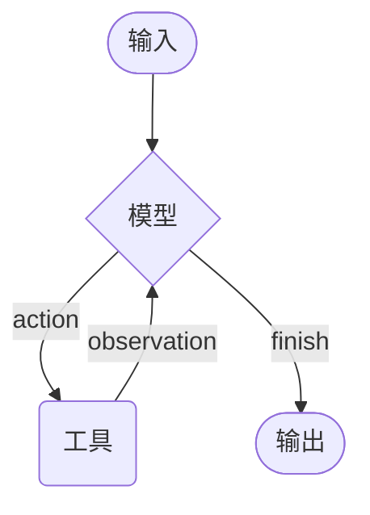

---
title: Agents
---

# Agents

Agents 将语言模型与[工具](/frameworks/langchain/core-components/tools)结合起来，构建出能够对任务进行推理、决定使用哪些工具，并通过迭代逐步逼近解决方案的系统。

在 Python 中，`create_agent` 提供了一个可直接用于生产环境的 Agent 实现。

[LLM Agent 会通过循环调用工具来完成目标](https://simonwillison.net/2025/Sep/18/agents/)。  
一个 Agent 会持续运行，直到满足停止条件，例如模型产出最终答案，或者达到迭代次数上限。



> [!INFO]
> `create_agent` 基于 [LangGraph](https://docs.langchain.com/oss/python/langgraph/overview) 构建图驱动的 Agent 运行时。图由节点和边组成，用来定义 Agent 如何处理信息。执行过程中，Agent 会在图中移动，依次执行模型节点、工具节点或 middleware 节点等。
>
> 如果你想进一步了解图的工作方式，可以查看 LangGraph 的 Graph API。

## 核心组成

### 模型

[模型](/frameworks/langchain/core-components/models)是 Agent 的推理引擎。你可以使用静态模型，也可以在运行时动态切换模型。

#### 静态模型

静态模型会在创建 Agent 时一次性配置好，在整个执行期间保持不变。这是最常见、也最直接的方式。

### Python

```python
from langchain.agents import create_agent

agent = create_agent("openai:gpt-5", tools=tools)
```

### Python

```python
from langchain.agents import create_agent
from langchain_openai import ChatOpenAI

model = ChatOpenAI(
    model="gpt-5",
    temperature=0.1,
    max_tokens=1000,
    timeout=30
)

agent = create_agent(model, tools=tools)
```

### Python

```python
from langchain_openai import ChatOpenAI
from langchain.agents import create_agent
from langchain.agents.middleware import wrap_model_call, ModelRequest, ModelResponse

basic_model = ChatOpenAI(model="gpt-4.1-mini")
advanced_model = ChatOpenAI(model="gpt-4.1")

@wrap_model_call
def dynamic_model_selection(request: ModelRequest, handler) -> ModelResponse:
    """根据对话复杂度选择模型。"""
    message_count = len(request.state["messages"])

    if message_count > 10:
        model = advanced_model
    else:
        model = basic_model

    return handler(request.override(model=model))

agent = create_agent(
    model=basic_model,
    tools=tools,
    middleware=[dynamic_model_selection]
)
```

### 工具

工具赋予 Agent 执行动作的能力。相比仅仅让模型绑定工具，Agent 还能处理以下能力：

- 在一次请求中串行调用多个工具
- 在合适时并行调用工具
- 根据前一步结果动态选择下一个工具
- 为工具调用提供重试与错误处理
- 在多次工具调用之间维持状态

更多内容可参考 [Tools](/frameworks/langchain/core-components/tools)。

#### 静态工具

静态工具会在创建 Agent 时定义好，并在整个执行过程中保持不变。

### Python

```python
from langchain.tools import tool
from langchain.agents import create_agent

@tool
def search(query: str) -> str:
    """搜索信息。"""
    return f"搜索结果：{query}"

@tool
def get_weather(location: str) -> str:
    """获取某个地点的天气信息。"""
    return f"{location} 的天气：晴，72 华氏度"

agent = create_agent(model, tools=[search, get_weather])
```

### Python

```python
from dataclasses import dataclass
from langchain.agents import create_agent
from langchain.agents.middleware import wrap_model_call, ModelRequest, ModelResponse
from typing import Callable

@dataclass
class Context:
    user_role: str

@wrap_model_call
def context_based_tools(
    request: ModelRequest,
    handler: Callable[[ModelRequest], ModelResponse]
) -> ModelResponse:
    """根据运行时上下文中的权限过滤工具。"""
    if request.runtime is None or request.runtime.context is None:
        user_role = "viewer"
    else:
        user_role = request.runtime.context.user_role

    if user_role == "admin":
        pass
    elif user_role == "editor":
        tools = [t for t in request.tools if t.name != "delete_data"]
        request = request.override(tools=tools)
    else:
        tools = [t for t in request.tools if t.name.startswith("read_")]
        request = request.override(tools=tools)

    return handler(request)

agent = create_agent(
    model="gpt-4.1",
    tools=[read_data, write_data, delete_data],
    middleware=[context_based_tools],
    context_schema=Context
)
```

#### 工具错误处理

你可以通过 middleware 自定义工具报错时的处理方式。

### Python

```python
from langchain.agents import create_agent
from langchain.agents.middleware import wrap_tool_call
from langchain.messages import ToolMessage

@wrap_tool_call
def handle_tool_errors(request, handler):
    """使用自定义消息处理工具执行错误。"""
    try:
        return handler(request)
    except Exception as e:
        return ToolMessage(
            content=f"工具错误：请检查输入后重试。({str(e)})",
            tool_call_id=request.tool_call["id"]
        )

agent = create_agent(
    model="gpt-4.1",
    tools=[search, get_weather],
    middleware=[handle_tool_errors]
)
```

### 系统提示词

你可以通过 prompt 控制 Agent 的行为方式。

### Python

```python
agent = create_agent(
    model,
    tools,
    system_prompt="你是一位乐于助人的助手。回答时要简洁且准确。"
)
```

### Python

```python
from langchain.agents import create_agent
from langchain.messages import SystemMessage, HumanMessage

literary_agent = create_agent(
    model="anthropic:claude-sonnet-4-5",
    system_prompt=SystemMessage(
        content=[
            {
                "type": "text",
                "text": "你是一位负责分析文学作品的 AI 助手。",
            },
            {
                "type": "text",
                "text": "<《傲慢与偏见》的完整内容>",
                "cache_control": {"type": "ephemeral"}
            }
        ]
    )
)

result = literary_agent.invoke(
    {"messages": [HumanMessage("分析《傲慢与偏见》的主要主题。")]}
)
```

这里的 `cache_control={"type": "ephemeral"}` 会提示 Anthropic 缓存该内容块，从而降低重复请求的延迟和成本。

#### 动态系统提示词

如果你需要根据运行时上下文或 Agent state 来动态生成系统提示词，可以使用 middleware。

### Python

```python
from typing import TypedDict
from langchain.agents import create_agent
from langchain.agents.middleware import dynamic_prompt, ModelRequest

class Context(TypedDict):
    user_role: str

@dynamic_prompt
def user_role_prompt(request: ModelRequest) -> str:
    """根据用户角色生成系统提示词。"""
    user_role = request.runtime.context.get("user_role", "user")
    base_prompt = "你是一位乐于助人的助手。"

    if user_role == "expert":
        return f"{base_prompt} 请提供详细的技术回答。"
    elif user_role == "beginner":
        return f"{base_prompt} 请使用简单语言解释概念，并避免术语。"

    return base_prompt

agent = create_agent(
    model="gpt-4.1",
    tools=[web_search],
    middleware=[user_role_prompt],
    context_schema=Context
)

result = agent.invoke(
    {"messages": [{"role": "user", "content": "解释一下机器学习"}]},
    context={"user_role": "expert"}
)
```

### 名称

你可以给 Agent 设置一个可选的 `name`。当 Agent 被作为子图嵌入多 Agent 系统时，这个名称会用作节点标识符。

### Python

```python
agent = create_agent(
    model,
    tools,
    name="research_assistant"
)
```

## 调用

调用 Agent 时，你需要向它的 state 传入一次更新。所有 Agent 的 state 中都包含消息序列，因此通常只需要传入一条新的用户消息。

### Python

```python
result = agent.invoke(
    {"messages": [{"role": "user", "content": "旧金山天气怎么样？"}]}
)
```

## 进阶概念

### 结构化输出

有些场景中，你可能希望 Agent 按照特定格式返回结果。LangChain 提供了结构化输出能力。

#### ToolStrategy

`ToolStrategy` 通过“人工工具调用”的方式生成结构化输出。凡是支持工具调用的模型都可以使用它。当 provider 原生结构化输出不可用或不够稳定时，可以优先使用它。

### Python

```python
from pydantic import BaseModel
from langchain.agents import create_agent
from langchain.agents.structured_output import ToolStrategy

class ContactInfo(BaseModel):
    name: str
    email: str
    phone: str

agent = create_agent(
    model="gpt-4.1-mini",
    tools=[search_tool],
    response_format=ToolStrategy(ContactInfo)
)

result = agent.invoke({
    "messages": [{"role": "user", "content": "从这段内容中提取联系人信息：张三，zhangsan@example.com，13800000000"}]
})

result["structured_response"]
```

#### ProviderStrategy

`ProviderStrategy` 直接使用模型 provider 原生支持的结构化输出能力。它更可靠，但只适用于支持该能力的模型。

### Python

```python
from langchain.agents.structured_output import ProviderStrategy

agent = create_agent(
    model="gpt-4.1",
    response_format=ProviderStrategy(ContactInfo)
)
```

在 `langchain 1.0` 之后，如果你直接传入 schema，例如 `response_format=ContactInfo`，那么当模型支持原生结构化输出时，会自动选择 `ProviderStrategy`；否则会回退到 `ToolStrategy`。

### 记忆

Agent 会自动通过消息 state 维护对话历史。你也可以为 Agent 配置自定义 state schema，以便在对话中额外记住一些信息。

可以把 state 中存储的信息理解为 Agent 的[短期记忆](/frameworks/langchain/core-components/short-term-memory)。

在 Python 中，自定义 state schema 必须基于 `AgentState` 并定义为 `TypedDict`。定义方式有两种：

1. 通过 middleware 定义，推荐
2. 通过 `create_agent` 的 `state_schema` 参数定义

#### 通过 middleware 定义 state

当你的自定义 state 需要被某些 middleware hook 或相关工具访问时，更推荐使用 middleware。

### Python

```python
from langchain.agents import AgentState, create_agent
from langchain.agents.middleware import AgentMiddleware
from typing import Any

class CustomState(AgentState):
    user_preferences: dict

class CustomMiddleware(AgentMiddleware):
    state_schema = CustomState
    tools = [tool1, tool2]

    def before_model(self, state: CustomState, runtime) -> dict[str, Any] | None:
        ...

agent = create_agent(
    model,
    tools=tools,
    middleware=[CustomMiddleware()]
)

result = agent.invoke({
    "messages": [{"role": "user", "content": "我更喜欢技术性解释"}],
    "user_preferences": {"style": "technical", "verbosity": "detailed"},
})
```

#### 通过 `state_schema` 定义 state

如果你的自定义 state 只需要在工具中使用，可以直接通过 `state_schema` 传入。

### Python

```python
from langchain.agents import AgentState

class CustomState(AgentState):
    user_preferences: dict

agent = create_agent(
    model,
    tools=[tool1, tool2],
    state_schema=CustomState
)

result = agent.invoke({
    "messages": [{"role": "user", "content": "我更喜欢技术性解释"}],
    "user_preferences": {"style": "technical", "verbosity": "detailed"},
})
```

> [!NOTE]
> 从 `langchain 1.0` 开始，自定义 state schema 必须是 `TypedDict`。Pydantic 模型和 dataclass 已不再支持。

### 流式输出

我们已经看到可以通过 `invoke` 获得最终结果。如果 Agent 需要执行多步，这可能会花一些时间。为了向用户展示中间进展，可以改用流式输出。

### Python

```python
from langchain.messages import AIMessage, HumanMessage

for chunk in agent.stream({
    "messages": [{"role": "user", "content": "搜索 AI 新闻并总结结果"}]
}, stream_mode="values"):
    latest_message = chunk["messages"][-1]
    if latest_message.content:
        if isinstance(latest_message, HumanMessage):
            print(f"用户：{latest_message.content}")
        elif isinstance(latest_message, AIMessage):
            print(f"Agent：{latest_message.content}")
    elif latest_message.tool_calls:
        print(f"正在调用工具：{[tc['name'] for tc in latest_message.tool_calls]}")
```

### Middleware

[Middleware](/frameworks/langchain/middleware/overview) 为定制 Agent 行为提供了强大的扩展能力。你可以用它来：

- 在模型调用前处理 state，例如裁剪消息、注入上下文
- 修改或校验模型响应，例如做 guardrails 或内容过滤
- 用自定义逻辑处理工具调用错误
- 根据 state 或 context 动态选择模型
- 加入自定义日志、监控与分析逻辑

middleware 会无缝融入 Agent 的执行流程，让你可以在不改动核心 Agent 逻辑的情况下，拦截并修改关键阶段的数据流。

> [!TIP]
> 如果你想深入了解 `before_model`、`after_model`、`wrap_tool_call` 等 hook，可以继续阅读 [Middleware](/frameworks/langchain/middleware/overview) 文档。
