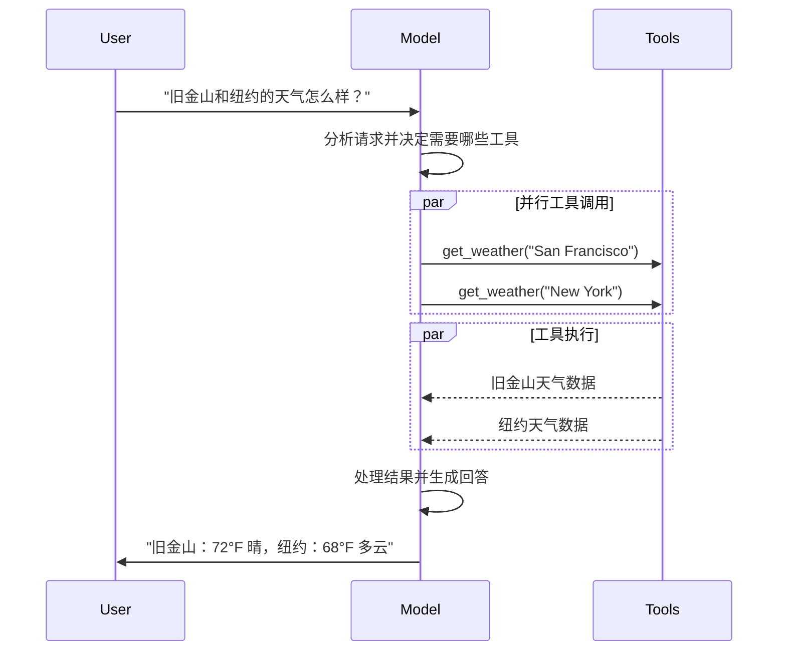

---
title: Models
---

# Models

[LLM](https://en.wikipedia.org/wiki/Large_language_model) 是强大的 AI 工具，能够像人类一样理解和生成文本。它们可以用于写作、翻译、总结、问答等任务，而不需要为每个任务单独训练专用模型。

除了文本生成之外，许多模型还支持：

- [Tool calling](#tool-calling)：调用外部工具，例如数据库查询、API 调用或代码执行
- [Structured output](#structured-output)：让模型输出满足指定格式
- [Multimodal](#multimodal)：处理或返回文本以外的数据，例如图片、音频和视频
- [Reasoning](#reasoning)：执行多步推理后再给出结论

模型是 [Agents](/frameworks/langchain/core-components/agents) 的推理引擎。它决定要调用哪些工具、如何理解工具结果，以及何时输出最终答案。

你选择的模型质量与能力，会直接影响 Agent 的基础可靠性和性能。不同模型擅长的方向不同，有些更适合复杂指令跟随，有些更适合结构化推理，还有些支持更大的上下文窗口。

LangChain 提供标准化的模型接口，因此你可以方便地在不同 provider 之间切换，并快速找到最适合当前业务场景的模型。

> [!INFO]
> 如果你需要查看各个 provider 的具体集成方式和能力差异，可以查看官方的 chat model integrations 页面。

## 基础用法

模型通常有两种使用方式：

1. 与 Agent 一起使用，在创建 Agent 时指定模型
2. 独立使用，在 Agent 循环之外直接调用模型完成文本生成、分类或抽取等任务

同一套模型接口可以同时适用于这两种方式，因此你可以先从简单调用开始，之后再逐步扩展到更复杂的 Agent 工作流。

### 初始化模型

在 LangChain 中，独立使用模型时，最简单的方式是通过 `init_chat_model` 来初始化一个聊天模型。

### Python

```python
from langchain.chat_models import init_chat_model

model = init_chat_model("openai:gpt-5")
response = model.invoke("为什么鹦鹉会说话？")
print(response)
```

### 支持的模型

LangChain 支持主流模型 provider，包括 OpenAI、Anthropic、Google、Azure、AWS Bedrock 等。每个 provider 又提供不同能力和定位的模型。

完整支持列表可查看官方 integrations 页面。

### 关键方法

- `invoke`：输入消息，等待模型生成完整响应后返回
- `stream`：以流式方式返回模型输出
- `batch`：批量发送多个请求，提升效率

> [!INFO]
> 除了 chat models 外，LangChain 还支持 embedding models、vector stores 等相关能力。

## 参数

聊天模型支持许多参数用于控制行为。不同模型与 provider 支持的完整参数集不同，但常见参数包括：

- `model`：要使用的模型名，或者 `{provider}:{model}` 格式的模型标识
- `api_key`：用于访问对应 provider 的密钥，通常通过环境变量传入
- `temperature`：控制输出随机性。越高越发散，越低越稳定
- `max_tokens`：限制输出的 token 数量
- `timeout`：请求超时时间
- `max_retries`：请求失败时的最大重试次数

### Python

```python
from langchain.chat_models import init_chat_model

model = init_chat_model(
    "claude-sonnet-4-6",
    temperature=0.7,
    timeout=30,
    max_tokens=1000,
    max_retries=6,
)
```

## 调用

聊天模型需要被调用后才会产生输出。最常见的调用方式有三种：

- `invoke`
- `stream`
- `batch`

### Invoke

`invoke()` 是最直接的调用方式。你可以传入一条消息，也可以传入一个消息列表。

### Python

```python
response = model.invoke("为什么鹦鹉拥有鲜艳的羽毛？")
print(response)
```

### Python

```python
conversation = [
    {"role": "system", "content": "你是一位把英语翻译成法语的助手。"},
    {"role": "user", "content": "翻译：我热爱编程。"},
    {"role": "assistant", "content": "J'adore la programmation."},
    {"role": "user", "content": "翻译：我喜欢构建应用程序。"}
]

response = model.invoke(conversation)
print(response)
```

```python
from langchain.messages import HumanMessage, AIMessage, SystemMessage

conversation = [
    SystemMessage("你是一位把英语翻译成法语的助手。"),
    HumanMessage("翻译：我热爱编程。"),
    AIMessage("J'adore la programmation."),
    HumanMessage("翻译：我喜欢构建应用程序。")
]

response = model.invoke(conversation)
print(response)
```

### Stream

大多数模型都支持流式输出。对于较长回答，流式返回可以显著提升用户体验。

调用 `stream()` 会返回一个迭代器，你可以边生成边处理输出。

### Python

```python
for chunk in model.stream("为什么鹦鹉拥有鲜艳的羽毛？"):
    print(chunk.text, end="|", flush=True)
```

```python
for chunk in model.stream("天空是什么颜色？"):
    for block in chunk.content_blocks:
        if block["type"] == "reasoning" and (reasoning := block.get("reasoning")):
            print(f"推理过程：{reasoning}")
        elif block["type"] == "tool_call_chunk":
            print(f"工具调用片段：{block}")
        elif block["type"] == "text":
            print(block["text"])
```

### Python

```python
full = None
for chunk in model.stream("天空是什么颜色？"):
    full = chunk if full is None else full + chunk
    print(full.text)

print(full.content_blocks)
```

### Batch

当你要处理一批互不依赖的请求时，可以用 `batch()` 并行调用模型，从而提升吞吐量并降低成本。

### Python

```python
responses = model.batch([
    "为什么鹦鹉拥有鲜艳的羽毛？",
    "飞机为什么能飞起来？",
    "什么是量子计算？"
])

for response in responses:
    print(response)
```

### Python

```python
for response in model.batch_as_completed([
    "为什么鹦鹉拥有鲜艳的羽毛？",
    "飞机为什么能飞起来？",
    "什么是量子计算？"
]):
    print(response)
```

> [!NOTE]
> `batch()` 和 `batch_as_completed()` 是客户端侧并行调用，与某些 provider 提供的原生 batch API 不是同一件事。

如果需要限制并发数，可以通过 `RunnableConfig` 中的 `max_concurrency` 进行控制。

### Python

```python
model.batch(
    list_of_inputs,
    config={
        "max_concurrency": 5,
    }
)
```

## Tool calling

模型可以请求调用工具，以完成数据库读取、网络搜索、运行代码等动作。

一个工具通常由两部分组成：

1. schema，包含工具名、描述和参数定义
2. 可执行函数或 coroutine

> [!NOTE]
> 你也可能听到 “function calling” 这个词。在这里，它和 “tool calling” 是同义的。

下面是一个基础的 tool calling 流程：



要让模型能使用你定义的工具，需要通过 `bind_tools()` / `bindTools()` 进行绑定。

### Python

```python
from langchain.tools import tool

@tool
def get_weather(location: str) -> str:
    """获取某地天气。"""
    return f"{location} 当前天气晴朗。"

model_with_tools = model.bind_tools([get_weather])

response = model_with_tools.invoke("波士顿天气怎么样？")
print(response.tool_calls)
```

## Structured output

你可以要求模型按某个 schema 返回结果，以便后续程序稳定解析。LangChain 支持多种 schema 类型和结构化输出方式。

### Python: Pydantic

```python
from pydantic import BaseModel, Field

class Movie(BaseModel):
    """电影信息。"""
    title: str = Field(description="电影标题")
    year: int = Field(description="上映年份")
    director: str = Field(description="导演")
    rating: float = Field(description="评分，满分 10 分")

model_with_structure = model.with_structured_output(Movie)
response = model_with_structure.invoke("请给出电影《盗梦空间》的详细信息")
print(response)
```

### Python: TypedDict

```python
from typing_extensions import TypedDict, Annotated

class MovieDict(TypedDict):
    """电影信息。"""
    title: Annotated[str, ..., "电影标题"]
    year: Annotated[int, ..., "上映年份"]
    director: Annotated[str, ..., "导演"]
    rating: Annotated[float, ..., "评分，满分 10 分"]

model_with_structure = model.with_structured_output(MovieDict)
response = model_with_structure.invoke("请给出电影《盗梦空间》的详细信息")
print(response)
```

### Python: JSON Schema

```python
json_schema = {
    "title": "Movie",
    "description": "电影信息",
    "type": "object",
    "properties": {
        "title": {"type": "string", "description": "电影标题"},
        "year": {"type": "integer", "description": "上映年份"},
        "director": {"type": "string", "description": "导演"},
        "rating": {"type": "number", "description": "评分，满分 10 分"},
    },
    "required": ["title", "year", "director", "rating"],
}

model_with_structure = model.with_structured_output(json_schema)
```

## 高级主题

### Model profiles

从 `langchain>=1.1` 开始，聊天模型可以通过 `profile` 属性暴露自身支持的能力信息，例如：

### Python

```python
model.profile
# {
#   "max_input_tokens": 400000,
#   "image_inputs": True,
#   "reasoning_output": True,
#   "tool_calling": True,
#   ...
# }
```

这些 profile 信息有助于应用根据模型能力动态调整行为。例如：

- 根据上下文窗口大小决定是否启用 summarization middleware
- 自动推断 `create_agent` 中的结构化输出策略
- 按是否支持多模态与工具调用来筛选模型

如果 profile 数据缺失、过旧或有误，你也可以在初始化模型时手动覆盖。

### Python

```python
from langchain.chat_models import init_chat_model

custom_profile = {
    "max_input_tokens": 100_000,
    "tool_calling": True,
    "structured_output": True,
}

model = init_chat_model("openai:gpt-5", profile=custom_profile)
```

### Multimodal

某些模型能够处理和返回图片、音频、视频等非文本数据。你可以通过消息中的 content blocks 向模型传入这类输入。

### Python

```python
response = model.invoke("生成一张猫的图片")
print(response.content_blocks)
# [
#     {"type": "text", "text": "这是一张猫的图片"},
#     {"type": "image", "base64": "...", "mime_type": "image/jpeg"},
# ]
```

### Reasoning

许多模型支持多步推理。若底层模型支持，你也可以把 reasoning 过程显式读取出来，以便理解模型是如何得出结论的。

### Python

```python
for chunk in model.stream("为什么鹦鹉拥有鲜艳的羽毛？"):
    reasoning_steps = [r for r in chunk.content_blocks if r["type"] == "reasoning"]
    print(reasoning_steps if reasoning_steps else chunk.text)
```

```python
response = model.invoke("为什么鹦鹉拥有鲜艳的羽毛？")
reasoning_steps = [b for b in response.content_blocks if b["type"] == "reasoning"]
print(" ".join(step["reasoning"] for step in reasoning_steps))
```

### 本地模型

LangChain 支持在本地硬件上运行模型。这适用于以下情况：

- 对数据隐私要求很高
- 需要运行自定义模型
- 希望避免云端模型调用成本

[Ollama](https://docs.langchain.com/oss/python/integrations/chat/ollama) 是本地运行聊天模型与 embedding 模型的常见选择之一。

### Prompt caching

许多 provider 都支持 prompt caching，用于降低重复请求的延迟和成本。常见有两种方式：

- 隐式缓存：provider 自动命中缓存并返还成本收益，例如 OpenAI、Gemini
- 显式缓存：你手动指定缓存点，例如 `ChatOpenAI` 的 `prompt_cache_key`，或 Anthropic 的 prompt caching middleware

> [!WARNING]
> Prompt caching 通常只有在输入 token 数量超过某个最小阈值时才会生效。具体阈值要看 provider 文档。

缓存命中情况通常会反映在模型响应的 usage metadata 中。

### 服务端工具使用

某些 provider 支持服务端 tool-calling 循环，也就是模型能在单次对话中直接与 web search、code interpreter 等工具交互，并自行分析结果。

如果模型在服务端调用了工具，那么返回消息的 content blocks 中会包含工具调用和工具结果。

### Python

```python
from langchain.chat_models import init_chat_model

model = init_chat_model("gpt-4.1-mini")

tool = {"type": "web_search"}
model_with_tools = model.bind_tools([tool])

response = model_with_tools.invoke("今天有什么积极的新闻？")
print(response.content_blocks)
```

### 限流

许多 provider 都对单位时间内的调用次数有限制。如果触发 rate limit，通常需要等待一段时间后再重试。

LangChain 支持在初始化模型时传入 `rate_limiter`，帮助你控制请求节奏。

### Python

```python
from langchain.chat_models import init_chat_model
from langchain_core.rate_limiters import InMemoryRateLimiter

rate_limiter = InMemoryRateLimiter(
    requests_per_second=0.1,
    check_every_n_seconds=0.1,
    max_bucket_size=10,
)

model = init_chat_model(
    model="gpt-5",
    model_provider="openai",
    rate_limiter=rate_limiter
)
```

> [!WARNING]
> 这个 rate limiter 只能限制“请求次数”，不能按请求大小或 token 数进行限流。

### Base URL 和代理设置

对于实现了 OpenAI Chat Completions API 的 provider，你可以配置自定义 `base_url`。

### Python

```python
from langchain.chat_models import init_chat_model

model = init_chat_model(
    model="MODEL_NAME",
    model_provider="openai",
    base_url="BASE_URL",
    api_key="YOUR_API_KEY",
)
```

### Python

```python
from langchain_openai import ChatOpenAI

model = ChatOpenAI(
    model="gpt-4.1",
    openai_proxy="http://proxy.example.com:8080"
)
```

> [!NOTE]
> 代理参数和命名方式会因 provider 不同而变化，具体请查看各自 integration 文档。

### Log probabilities

部分模型支持返回 token 级别的 log probabilities。你可以在初始化或绑定模型时开启 `logprobs`。

### Python

```python
from langchain.chat_models import init_chat_model

model = init_chat_model(
    model="gpt-4.1",
    model_provider="openai"
).bind(logprobs=True)

response = model.invoke("为什么鹦鹉会说话？")
print(response.response_metadata["logprobs"])
```

### Token usage

很多 provider 会在响应中返回 token usage 信息。若 provider 支持，这些信息会附着在 `AIMessage` 上。

### Python

```python
from langchain.chat_models import init_chat_model
from langchain_core.callbacks import UsageMetadataCallbackHandler

model_1 = init_chat_model(model="gpt-4.1-mini")
model_2 = init_chat_model(model="claude-haiku-4-5-20251001")

callback = UsageMetadataCallbackHandler()
result_1 = model_1.invoke("你好", config={"callbacks": [callback]})
result_2 = model_2.invoke("你好", config={"callbacks": [callback]})

print(callback.usage_metadata)
```

也可以使用 context manager 收集 usage metadata。

### Invocation config

调用模型时，你还可以通过 `config` 传入额外的运行配置，例如 callbacks、tags、metadata 等。

### Python

```python
response = model.invoke(
    "讲个笑话",
    config={
        "run_name": "joke_generation",
        "tags": ["humor", "demo"],
        "metadata": {"user_id": "123"},
        "callbacks": [my_callback_handler],
    }
)
```

### 可配置模型

你还可以创建“运行时可配置”的模型。这样同一个模型对象可以在调用时切换到底层不同模型。

### Python

```python
from langchain.chat_models import init_chat_model

configurable_model = init_chat_model(temperature=0)

configurable_model.invoke(
    "你叫什么名字？",
    config={"configurable": {"model": "gpt-5-nano"}},
)

configurable_model.invoke(
    "你叫什么名字？",
    config={"configurable": {"model": "claude-sonnet-4-6"}},
)
```

你也可以设置默认模型、指定哪些参数允许动态配置，以及为这些参数增加前缀。

### Python

```python
first_model = init_chat_model(
    model="gpt-4.1-mini",
    temperature=0,
    configurable_fields=("model", "model_provider", "temperature", "max_tokens"),
    config_prefix="first",
)

first_model.invoke(
    "你叫什么名字？",
    config={
        "configurable": {
            "first_model": "claude-sonnet-4-6",
            "first_temperature": 0.5,
            "first_max_tokens": 100,
        }
    },
)
```

可配置模型同样可以继续调用 `bind_tools`、`with_structured_output` 等声明式方法，再在运行时切换底层模型。
