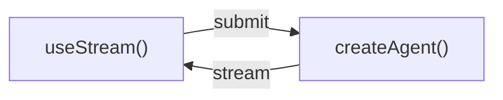

# Frontend 概览

你可以围绕 `createAgent` 创建功能丰富、可交互的前端界面。这些模式覆盖了从基础消息渲染，到 human-in-the-loop 审批、time travel 调试等更高级的工作流。

## 架构

所有模式都遵循同一套基本架构：

- 后端由 `createAgent` 提供流式状态
- 前端通过 `useStream` 订阅并渲染这些状态



在后端，`createAgent` 会生成一个编译后的 LangGraph graph，并暴露 streaming API。  
在前端，`useStream` 会连接这个 API，提供响应式状态，例如：

- messages
- tool calls
- interrupts
- history
- 其他流式状态

### Python 后端 + TypeScript 前端

```python
from langchain import create_agent
from langgraph.checkpoint.memory import MemorySaver

agent = create_agent(
    model="openai:gpt-5.4",
    tools=[get_weather, search_web],
    checkpointer=MemorySaver(),
)
```

```ts
import type { BaseMessage } from "@langchain/core/messages";

export interface GraphState {
  messages: BaseMessage[];
}
```

```tsx
import { useStream } from "@langchain/react";
import type { GraphState } from "./types";

function Chat() {
  const stream = useStream<GraphState>({
    apiUrl: "http://localhost:2024",
    assistantId: "agent",
  });

  return (
    <div>
      {stream.messages.map((msg) => (
        <Message key={msg.id} message={msg} />
      ))}
    </div>
  );
}
```

### JavaScript / TypeScript

```ts
import { createAgent } from "langchain";
import { MemorySaver } from "@langchain/langgraph";

const agent = createAgent({
  model: "openai:gpt-5.4",
  tools: [getWeather, searchWeb],
  checkpointer: new MemorySaver(),
});
```

```tsx
import { useStream } from "@langchain/react";
import type { agent } from "./agent";

function Chat() {
  const stream = useStream<typeof agent>({
    apiUrl: "http://localhost:2024",
    assistantId: "agent",
  });

  return (
    <div>
      {stream.messages.map((msg) => (
        <Message key={msg.id} message={msg} />
      ))}
    </div>
  );
}
```

`useStream` 可用于多个前端框架：

```ts
import { useStream } from "@langchain/react";
import { useStream } from "@langchain/vue";
import { useStream } from "@langchain/svelte";
import { useStream } from "@langchain/angular";
```

## Patterns

### 渲染消息与输出

- Markdown messages：把流式 markdown 渲染成富文本
- Structured output：把结构化 Agent 返回值渲染为定制 UI
- Reasoning tokens：显示模型的推理过程
- Generative UI：根据自然语言生成界面

### 展示 Agent 动作

- Tool calling：把工具调用渲染为类型安全的卡片
- Human-in-the-loop：在关键动作前暂停并等待人工审批

### 管理对话

- Branching chat：编辑消息、重生成回复、在分支间切换
- Message queues：队列化多条消息，按顺序交给 Agent 处理

### 高级 streaming

- Join & rejoin streams：断开后重新接入流，不丢进度
- Time travel：在历史 checkpoint 之间检查、跳转和恢复

## Integrations

`useStream` 本身不绑定具体 UI 库。你可以把它接到任意组件库或 generative UI 框架上。

常见集成包括：

- AI Elements
- assistant-ui
- OpenUI
