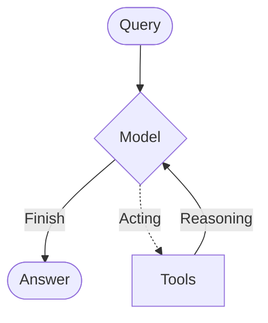

# Agents

Agents 的核心价值，不是“把模型包一层”，而是把大语言模型与工具系统结合起来，让它能够围绕目标持续推理、决定是否调用工具、接收工具结果，再继续下一轮判断，直到任务完成或满足停止条件。

在 Spring AI Alibaba 中，这类能力的核心实现是 `ReactAgent`。它适合用来构建能够自主做出一系列行动决策的智能体系统。

## ReactAgent 理论基础

### 什么是 ReAct

`ReAct` 是 `Reasoning + Acting` 的缩写，强调“推理”和“行动”交替进行。一个 Agent 不会只给出一次性的文本答案，而是会在循环中不断执行下面几件事：

1. 思考：先分析当前问题，决定下一步怎么做
2. 行动：如果需要外部信息，就调用工具
3. 观察：拿到工具返回结果后继续判断
4. 迭代：重复这个过程，直到能给出最终答案

这种模式很适合处理下面几类任务：

- 需要拆成多个步骤的问题
- 需要调用一个或多个工具的问题
- 需要根据中间结果动态调整策略的问题
- 需要在不完全确定的情况下继续推进的问题

### ReactAgent 的工作方式

Spring AI Alibaba 中的 `ReactAgent` 建立在 Graph 运行时之上。你可以把它理解为一个围绕几个关键节点循环执行的系统：

- `Model Node`：负责调用模型做推理和决策
- `Tool Node`：负责执行工具调用
- `Hook Nodes`：负责在关键环节插入自定义逻辑

因此，`ReactAgent` 不是一个“单次请求 -> 单次响应”的薄封装，而是一个具备循环执行能力的 Agent 运行框架。

ReactAgent 的核心执行流程可以概括为：



## 核心组件

### Model（模型）

模型是 Agent 的推理引擎。最基础的用法，是先准备一个 `ChatModel`，再把它交给 `ReactAgent`。

#### 基础模型配置

```java
// 创建 DashScope API 实例
DashScopeApi dashScopeApi = DashScopeApi.builder()
    .apiKey(System.getenv("AI_DASHSCOPE_API_KEY"))
    .build();
// 创建 ChatModel
ChatModel chatModel = DashScopeChatModel.builder()
    .dashScopeApi(dashScopeApi)
    .build();

// 创建 Agent
ReactAgent agent = ReactAgent.builder()
    .name("my_agent")
    .model(chatModel)
    .build();
```

这类写法适合最小示例或快速验证。

#### 高级模型配置

如果你希望进一步控制模型输出行为，可以通过 `ChatOptions` 做更细的参数配置：

```java
ChatModel chatModel = DashScopeChatModel.builder()
    .dashScopeApi(dashScopeApi)
    .defaultOptions(DashScopeChatOptions.builder()
        .withModel(DashScopeChatModel.DEFAULT_MODEL_NAME)//默认模型qwen-plus
        .withTemperature(0.7)//控制输出的随机性，越高越散
        .withMaxToken(2000)//限制单次输出长度
        .withTopP(0.9)//控制采样范围和输出多样性
        .build())
    .build();
```

常见参数可以这样理解：

- `temperature`：控制输出的随机性（0.0-1.0之间），越高越散,越有创造性
- `maxToken`：限制单次响应的最大token数
- `topP`：控制采样范围和输出多样性

### Tools（工具）

工具决定了 Agent 是否能真正“做事”。没有工具时，模型只能基于已有上下文生成文本；有了工具后，它才能查询数据、访问系统、调用外部能力。

#### 定义和使用工具

```java
// 定义工具（示例：仅一个搜索工具）
public class SearchTool implements BiFunction<String, ToolContext, String> {
    @Override
    public String apply(String query, ToolContext context) {
        // 实现搜索逻辑
        return "搜索结果: " + query;
    }
}

// 创建工具回调
ToolCallback searchTool = FunctionToolCallback.builder("search", new SearchTool())
    .description("搜索工具")
    .build();

// 在Agent中使用
ReactAgent agent = ReactAgent.builder()
    .name("search_agent")
    .model(chatModel)
    .tools(searchTool)
    .build();
```

这里最关键的不是代码形式本身，而是下面几件事：

- 工具名要清楚
- 工具描述要能帮助模型理解用途
- 输入参数要尽量语义明确

#### 工具错误处理

在真实项目里，工具失败是常态，不是例外。Spring AI Alibaba 支持通过拦截器为工具调用统一做错误处理。

```java
// 工具错误拦截器：统一处理工具调用异常
public class ToolErrorInterceptor extends ToolInterceptor {
    // 拦截工具调用，统一捕获并处理异常
    @Override
    public ToolCallResponse interceptToolCall(ToolCallRequest request, ToolCallHandler handler) {
        try {
            // 执行原始工具调用
            return handler.call(request);
        } catch (Exception e) {
            // 捕获异常，返回包装后的错误响应
            return ToolCallResponse.of(
                request.getToolCallId(),
                request.getToolName(),
                "Tool failed: " + e.getMessage()
            );
        }
    }

    // 返回拦截器名称，用于标识和日志
    @Override
    public String getName() {
        return "ToolErrorInterceptor";
    }
}

ReactAgent agent = ReactAgent.builder()
    .name("my_agent")
    .model(chatModel)
    .interceptors(new ToolErrorInterceptor())//添加拦截器
    .build();
```

一个典型的 ReAct 循环可以理解成这样：

```text
用户：查询杭州天气并推荐活动
-> 推理：先查天气
-> 工具调用：get_weather("杭州")
-> 观察：晴，25°C
-> 推理：继续推荐活动
-> 工具调用：search("户外活动")
-> 观察：西湖游玩等结果
-> 推理：信息足够，生成最终答案
```

### System Prompt（系统提示）

系统提示决定 Agent 怎么理解任务、怎么组织行为、什么时候该使用工具。

#### 基础用法

```java
ReactAgent agent = ReactAgent.builder()
    .name("my_agent")
    .model(chatModel)
    .systemPrompt("你是一个专业的技术助手。请准确、简洁地回答问题。")
    .build();
```

#### 使用 instruction

如果你希望给出更长、更详细的行为指令，可以使用 `instruction`：

```java
String instruction = """
    你是一个软件架构分析 Agent。

    你可以使用以下工具：
    - search_docs：用于检索架构文档和技术资料
    - get_system_context：用于读取当前系统上下文和约束信息
    - query_metrics：用于查询系统运行指标
    - ask_human：当信息不足且无法通过工具获取时，用于请求人工补充信息

    在执行任务时，请遵循以下规则：
    1. 先理解用户目标和约束条件
    2. 如果问题依赖事实、配置、运行状态或外部文档，优先调用相关工具
    3. 不要在缺少依据时直接假设
    4. 如果现有工具无法补足信息，再提出澄清问题或请求人工补充
    5. 在得到足够信息后，再输出方案分析、权衡和建议
    6. 如果任务已经完成，就停止继续推理并输出最终答案

    保持专业、清晰、简洁。
    """;

ReactAgent agent = ReactAgent.builder()
    .name("architect_agent")
    .model(chatModel)
    .instruction(instruction)
    .build();
```

#### 动态 System Prompt

如果系统提示需要根据上下文动态变化，可以使用 `ModelInterceptor` 做增强：

```java
// 动态提示拦截器：根据用户角色自适应系统提示
public class DynamicPromptInterceptor extends ModelInterceptor {
    @Override
    public ModelResponse interceptModel(ModelRequest request, ModelCallHandler handler) {
        // 从上下文获取用户角色，默认 "default"
        String userRole = (String) request.getContext().getOrDefault("user_role", "default");
        
        // 根据角色动态生成系统提示
        String dynamicPrompt = switch (userRole) {
            case "expert" -> """
                你正在与技术专家对话。
                - 使用专业术语
                - 深入技术细节
                """;
            case "beginner" -> """
                你正在与初学者对话。
                - 使用简单语言
                - 解释基础概念
                """;
            default -> "你是一个专业的助手，保持友好和专业。";
        };

        // 增强系统消息：若原有存在则追加，否则新建
        SystemMessage enhancedSystemMessage;
        if (request.getSystemMessage() == null) {
            enhancedSystemMessage = new SystemMessage(dynamicPrompt);
        } else {
            enhancedSystemMessage = new SystemMessage(
                request.getSystemMessage().getText() + "\n\n" + dynamicPrompt
            );
        }

        // 构建修改后的请求并执行
        ModelRequest modified = ModelRequest.builder(request)
            .systemMessage(enhancedSystemMessage)
            .build();

        return handler.call(modified);
    }

    @Override
    public String getName() {
        return "DynamicPromptInterceptor";
    }
}

// 使用动态提示拦截器配置自适应 Agent
ReactAgent agent = ReactAgent.builder()
    .name("adaptive_agent")
    .model(chatModel)
    .interceptors(new DynamicPromptInterceptor())  // 注入拦截器
    .build();
```

## 调用 Agent

### 基础调用

最常见的方式是使用 `call` 获取最终响应：

```java
// 方式一：直接传入字符串（最简单）
AssistantMessage response = agent.call("杭州的天气怎么样？");
System.out.println(response.getText());

// 方式二：传入 UserMessage 对象（可携带额外元数据）
UserMessage userMessage = new UserMessage("帮我分析这个问题");
AssistantMessage second = agent.call(userMessage);

// 方式三：传入消息列表（多轮对话场景）
List<Message> messages = List.of(
    new UserMessage("我想了解 Java 多线程"),
    new UserMessage("特别是线程池的使用")
);
AssistantMessage third = agent.call(messages);
```

### 获取完整状态

如果你不只想拿最终答案，还想拿到完整执行状态，可以用 `invoke`：

```java
// 使用 invoke 获取完整执行状态（而非仅最终响应）
Optional<OverAllState> result = agent.invoke("帮我写一首诗");

if (result.isPresent()) {
    OverAllState state = result.get();

    // 从状态中提取消息列表（包含对话历史）
    Optional<Object> messages = state.value("messages");
    List<Message> messageList = (List<Message>) messages.get();

    // 提取自定义数据（如业务上下文）
    Optional<Object> customData = state.value("custom_key");

    System.out.println("完整状态：" + state);
}
```

### 使用配置

运行时配置通常通过 `RunnableConfig` 传入，例如线程上下文或元数据：

```java
String threadId = "thread_123";

RunnableConfig runnableConfig = RunnableConfig.builder()
    .threadId(threadId)
    .addMetadata("key", "value")
    .build();

AssistantMessage response = agent.call("你的问题", runnableConfig);
```

## 高级特性

### 结构化输出

在某些场景里，你不希望 Agent 输出一段自由文本，而是希望它返回可被程序继续消费的结构化结果。

#### 使用 outputType

```java
// 定义结构化输出格式：诗歌输出类
public class PoemOutput {
    private String title;   // 诗歌标题
    private String content; // 诗歌内容
    private String style;   // 诗歌风格

    public String getTitle() { return title; }
    public void setTitle(String title) { this.title = title; }
    public String getContent() { return content; }
    public void setContent(String content) { this.content = content; }
    public String getStyle() { return style; }
    public void setStyle(String style) { this.style = style; }
}

// 创建 Agent 时指定输出类型
ReactAgent agent = ReactAgent.builder()
    .name("poem_agent")
    .model(chatModel)
    .outputType(PoemOutput.class)  // 关键配置：指定结构化输出类型
    .saver(new MemorySaver())
    .build();

// 调用后，Agent 会自动将响应解析为 PoemOutput 结构
AssistantMessage response = agent.call("写一首关于春天的诗");
System.out.println(response.getText());
```

#### 使用 outputSchema

如果你希望自己控制输出 Schema，可以结合 `BeanOutputConverter` 使用：

```java
import org.springframework.ai.converter.BeanOutputConverter;

// 定义输出类型
public static class TextAnalysisResult {
private String summary;
private List<String> keywords;
private String sentiment;
private Double confidence;

// Getters and Setters
public String getSummary() { return summary; }
public void setSummary(String summary) { this.summary = summary; }
public List<String> getKeywords() { return keywords; }
public void setKeywords(List<String> keywords) { this.keywords = keywords; }
public String getSentiment() { return sentiment; }
public void setSentiment(String sentiment) { this.sentiment = sentiment; }
public Double getConfidence() { return confidence; }
public void setConfidence(Double confidence) { this.confidence = confidence; }
}

// 使用 BeanOutputConverter 生成 outputSchema
BeanOutputConverter<TextAnalysisResult> outputConverter = new BeanOutputConverter<>(TextAnalysisResult.class);
String format = outputConverter.getFormat();

ReactAgent agent = ReactAgent.builder()
.name("analysis_agent")
.model(chatModel)
.outputSchema(format)
.saver(new MemorySaver())
.build();

AssistantMessage response = agent.call("分析这段文本：春天来了，万物复苏。");
```

通常可以这样选：

- `outputType`：更适合结构固定、类型安全的场景（推荐）
- `outputSchema`：更适合输出格式需要灵活调整的场景

### Memory（记忆）

Agent 的短期记忆本质上是状态管理。通过 `MemorySaver`，Agent 可以在同一会话线程里保留上下文。

```java
ReactAgent agent = ReactAgent.builder()
    .name("chat_agent")
    .model(chatModel)
    .saver(new MemorySaver())//配置内存存储
    .build();

// 使用 thread_id 维护对话上下文
RunnableConfig config = RunnableConfig.builder()
    .threadId("user_123")
    .build();

agent.call("我叫张三", config);
agent.call("我叫什么名字？", config);
```

在生产环境中，更常见的选择是把 `MemorySaver` 换成持久化实现，例如 `RedisSaver` 或 `MongoSaver`。

### Hooks（钩子）

Hooks 允许你在 Agent 执行过程中的关键位置插入自定义逻辑。

```java
import com.alibaba.cloud.ai.graph.agent.hook.*;
import com.alibaba.cloud.ai.graph.agent.hook.messages.MessagesModelHook;
import com.alibaba.cloud.ai.graph.agent.hook.messages.AgentCommand;
import com.alibaba.cloud.ai.graph.agent.hook.messages.UpdatePolicy;

// 1. AgentHook - 在 Agent 开始/结束时执行，每次 Agent 调用只会运行一次
@HookPositions({HookPosition.BEFORE_AGENT, HookPosition.AFTER_AGENT})
public class LoggingHook extends AgentHook {
    @Override
    public String getName() {
        return "logging";
    }

    @Override
    public CompletableFuture<Map<String, Object>> beforeAgent(OverAllState state, RunnableConfig config) {
        System.out.println("Agent 开始执行");
        return CompletableFuture.completedFuture(Map.of());
    }

    @Override
    public CompletableFuture<Map<String, Object>> afterAgent(OverAllState state, RunnableConfig config) {
        System.out.println("Agent 执行完成");
        return CompletableFuture.completedFuture(Map.of());
    }
}

// 2. MessagesModelHook - 在模型调用前后执行（如消息修剪），专门用于操作消息列表
//    区别于 AgentHook：MessagesModelHook 在一次 agent 调用中可能会执行多次（每次 reasoning-acting 迭代都会执行）
@HookPositions({HookPosition.BEFORE_MODEL})
public class MessageTrimmingHook extends MessagesModelHook {
    private static final int MAX_MESSAGES = 10;

    @Override
    public String getName() {
        return "message_trimming";
    }

    @Override
    public AgentCommand beforeModel(List<Message> previousMessages, RunnableConfig config) {
        if (previousMessages.size() > MAX_MESSAGES) {
            // 只保留最后 MAX_MESSAGES 条消息
            List<Message> trimmedMessages = previousMessages.subList(
                previousMessages.size() - MAX_MESSAGES,
                previousMessages.size()
            );
            return new AgentCommand(trimmedMessages, UpdatePolicy.REPLACE);
        }
        // 消息数量未超过限制，直接返回原消息列表
        return new AgentCommand(previousMessages);
    }
}
```

如果你更关心消息处理，也可以用 `MessagesModelHook` 在模型调用前后裁剪或改写消息列表。

常见的 Hook 位置包括：

- `BEFORE_AGENT` / `AFTER_AGENT`
- `BEFORE_MODEL` / `AFTER_MODEL`

### Interceptors（拦截器）

如果你需要更细粒度地拦截模型调用或工具执行，可以使用 Interceptors。

```java
import com.alibaba.cloud.ai.graph.agent.interceptor.*;

// ModelInterceptor - 内容安全检查
public class GuardrailInterceptor extends ModelInterceptor {
    @Override
    public ModelResponse interceptModel(ModelRequest request, ModelCallHandler handler) {
        // 前置：检查输入
        if (containsSensitiveContent(request.getMessages())) {
            return ModelResponse.of(AssistantMessage.builder().content("检测到不适当的内容").build());
        }

        // 执行调用
        ModelResponse response = handler.call(request);

        // 后置：检查输出
        return sanitizeIfNeeded(response);
    }
}

// ToolInterceptor - 监控和错误处理
public class ToolMonitoringInterceptor extends ToolInterceptor {
    @Override
    public ToolCallResponse interceptToolCall(ToolCallRequest request, ToolCallHandler handler) {
        long startTime = System.currentTimeMillis();
        try {
            ToolCallResponse response = handler.call(request);
            logSuccess(request, System.currentTimeMillis() - startTime);
            return response;
        } catch (Exception e) {
            logError(request, e, System.currentTimeMillis() - startTime);
            return ToolCallResponse.error(
                request.getToolCall(),
                "工具执行遇到问题，请稍后重试"
            );
        }
    }
}

// 组合使用
ReactAgent agent = ReactAgent.builder()
    .name("my_agent")
    .model(chatModel)
    .interceptors(new GuardrailInterceptor(), new LoggingInterceptor(), new ToolMonitoringInterceptor())
    .saver(new MemorySaver())
    .build();
```
常见用途：

- ModelInterceptor：内容安全、动态提示、日志记录、性能监控
- ToolInterceptor：错误重试、权限检查、结果缓存、审计日志

Hooks 更像在固定节点插入逻辑；Interceptors 更像包裹调用过程并进行修改、放行或拦截。

## 控制与流式输出
### 迭代控制
通过 Hooks 控制 Agent 的执行迭代，防止无限循环或过度成本。

常见做法有两种：

- 使用 `ModelCallLimitHook` 限制模型调用次数
- 使用自定义停止条件 Hook 决定是否提前结束执行

#### 使用 ModelCallLimitHook 限制模型调用次数

```java
import com.alibaba.cloud.ai.graph.agent.hook.modelcalllimit.ModelCallLimitHook;
import com.alibaba.cloud.ai.graph.checkpoint.savers.MemorySaver;

// 使用内置的 ModelCallLimitHook 限制模型调用次数
ReactAgent agent = ReactAgent.builder()
  .name("my_agent")
  .model(chatModel)
  .hooks(ModelCallLimitHook.builder().runLimit(5).build())  // 限制最多调用 5 次
  .saver(new MemorySaver())
  .build();
```

#### 自定义停止条件 Hook

如果你希望停止条件更贴近业务逻辑，也可以自己定义 Hook。

```java
import com.alibaba.cloud.ai.graph.agent.hook.ModelHook;
import com.alibaba.cloud.ai.graph.agent.hook.HookPosition;
import com.alibaba.cloud.ai.graph.agent.hook.HookPositions;
import com.alibaba.cloud.ai.graph.agent.hook.JumpTo;
import org.springframework.ai.chat.messages.AssistantMessage;

// 自定义停止条件：基于状态判断是否继续
@HookPositions({HookPosition.BEFORE_MODEL})
public class CustomStopConditionHook extends ModelHook {

  @Override
  public String getName() {
      return "custom_stop_condition";
  }

  @Override
  public CompletableFuture<Map<String, Object>> beforeModel(OverAllState state, RunnableConfig config) {
      // 检查是否找到答案，展示使用 OverAllState
      boolean answerFound = (Boolean) state.value("answer_found").orElse(false);
      // 检查错误次数，展示使用 RunnableConfig
      int errorCount = (Integer) config.context().get("error_count").orElse(0);

      // 找到答案或错误过多时停止
      if (answerFound || errorCount > 3) {
          List<Message> messages = new ArrayList<>();
          messages.add(new AssistantMessage(
              answerFound ? "已找到答案，Agent 执行完成。"
                          : "错误次数过多 (" + errorCount + ")，Agent 执行终止。"
          ));
          // 消息将被追加到原始消息列表上下文中
          return CompletableFuture.completedFuture(Map.of("messages", messages));
      }

      return CompletableFuture.completedFuture(Map.of());
  }

}

// 使用自定义停止条件
ReactAgent agent = ReactAgent.builder()
  .name("my_agent")
  .model(chatModel)
  .hooks(new CustomStopConditionHook())
  .saver(new MemorySaver())
  .build();
```

### 流式输出

在 Agent 场景里，流式输出统一围绕 `StreamingOutput` 处理。无论是模型推理、工具调用还是 Hook 节点，流式阶段都会落到这个类型上。

#### 使用 OutputType 区分输出类型

通过 `OutputType`，可以区分不同节点的输出类型，以及它属于流式增量还是完成事件。

| 输出类型 | 说明 |
| :--- | :--- |
| `AGENT_MODEL_STREAMING` | 模型推理的流式增量内容 |
| `AGENT_MODEL_FINISHED` | 模型推理完成，可获取全量内容 |
| `AGENT_TOOL_STREAMING` | 工具调用的流式增量内容 |
| `AGENT_TOOL_FINISHED` | 工具调用完成 |
| `AGENT_HOOK_STREAMING` | Hook 节点的流式增量内容 |
| `AGENT_HOOK_FINISHED` | Hook 节点完成 |

> [!TIP]
> - 对于 Hook 这类通常非流式的节点，直接读取 `AGENT_HOOK_FINISHED` 即可
> - 并不是所有节点输出都一定有业务意义，尤其 Hook 输出通常需要主动过滤

#### 流式输出示例

```java
import reactor.core.publisher.Flux;
import com.alibaba.cloud.ai.graph.NodeOutput;
import com.alibaba.cloud.ai.graph.streaming.StreamingOutput;
import com.alibaba.cloud.ai.graph.streaming.OutputType;

Flux<NodeOutput> stream = agent.stream("复杂任务");
stream.subscribe(
  output -> {
      // 检查是否为 StreamingOutput 类型
      if (output instanceof StreamingOutput streamingOutput) {
          OutputType type = streamingOutput.getOutputType();
          
          // 处理模型推理的流式输出
          if (type == OutputType.AGENT_MODEL_STREAMING) {
              // 流式增量内容，逐步显示
              System.out.print(streamingOutput.message().getText());
          } else if (type == OutputType.AGENT_MODEL_FINISHED) {
              // 模型推理完成，可获取完整响应
              System.out.println("\n模型输出完成");
          }
          
          // 处理工具调用完成（目前不支持 STREAMING）
          if (type == OutputType.AGENT_TOOL_FINISHED) {
              System.out.println("工具调用完成: " + output.node());
          }
          
          // 对于 Hook 节点，通常只关注完成事件（如果Hook没有有效输出可以忽略）
          if (type == OutputType.AGENT_HOOK_FINISHED) {
              System.out.println("Hook 执行完成: " + output.node());
          }
      }
  },
  error -> System.err.println("错误: " + error),
  () -> System.out.println("Agent 执行完成")
);
```

### 消息类型识别

`StreamingOutput.message()` 返回的消息可能是不同类型，通常需要结合 `OutputType` 和消息元数据一起判断。

| OutputType | 消息类型 | 判断条件 | 说明 |
| :--- | :--- | :--- | :--- |
| `AGENT_MODEL_STREAMING` / `AGENT_MODEL_FINISHED` | 模型普通响应 | `AssistantMessage` 且 `metadata.reasoningContent` 为空 | 模型的实际回复内容，通过 `getText()` 获取 |
| `AGENT_MODEL_STREAMING` / `AGENT_MODEL_FINISHED` | 模型 Thinking | `AssistantMessage` 且 `metadata.reasoningContent` 不为空 | 模型的思考过程（如 DeepSeek 等支持 Thinking 的模型） |
| `AGENT_MODEL_FINISHED` | 工具调用请求 | `AssistantMessage` 且 `hasToolCalls()` 为 `true` | 模型请求调用工具，包含工具名称和参数 |
| `AGENT_TOOL_FINISHED` | 工具响应结果 | `ToolResponseMessage` | 工具执行后的返回结果 |

#### 消息类型识别示例

```java
import org.springframework.ai.chat.messages.Message;
import org.springframework.ai.chat.messages.AssistantMessage;
import org.springframework.ai.chat.messages.ToolResponseMessage;

// 结合 OutputType 和消息类型进行处理
if (output instanceof StreamingOutput streamingOutput) {
  OutputType type = streamingOutput.getOutputType();
  Message message = streamingOutput.message();
  
  // 处理模型流式输出
  if (type == OutputType.AGENT_MODEL_STREAMING) {
      if (message instanceof AssistantMessage assistantMessage) {
          // 检查是否为 Thinking 消息
          Object reasoningContent = assistantMessage.getMetadata().get("reasoningContent");
          if (reasoningContent != null && !reasoningContent.toString().isEmpty()) {
              System.out.print("[Thinking] " + reasoningContent);
          } else {
              // 普通模型响应（增量内容）
              System.out.print(assistantMessage.getText());
          }
      }
  }
  // 处理模型输出完成
  else if (type == OutputType.AGENT_MODEL_FINISHED) {
      if (message instanceof AssistantMessage assistantMessage) {
          if (assistantMessage.hasToolCalls()) {
              // 工具调用请求
              assistantMessage.getToolCalls().forEach(toolCall -> {
                  System.out.println("[Tool Call] " + toolCall.name() + ": " + toolCall.arguments());
              });
          } else {
              // 模型完整响应
              System.out.println("\n[Model Finished]");
          }
      }
  }
  // 处理工具执行结果
  else if (type == OutputType.AGENT_TOOL_FINISHED) {
      if (message instanceof ToolResponseMessage toolResponse) {
          toolResponse.getResponses().forEach(response -> {
              System.out.println("[Tool Result] " + response.name() + ": " + response.responseData());
          });
      }
  }
}
```

> [!TIP]
> - **先判断 OutputType**：通过 OutputType 先确定是模型输出、工具输出还是 Hook 输出，再处理具体消息
> - **Thinking 消息**：部分模型（如 DeepSeek-R1）支持输出思考过程，通过 `metadata.reasoningContent` 获取
> - **工具调用**：工具调用请求通常在 `AGENT_MODEL_FINISHED` 阶段出现，此时 `hasToolCalls()` 返回 `true`
> - **流式 vs 完成**：`STREAMING` 阶段内容是增量的，`FINISHED` 阶段可获取完整消息或执行结果

更多关于 Graph 底层流式输出机制，可以继续阅读官方的 Graph 流式输出文档。

## 阅读建议

如果你是第一次接触 Spring AI Alibaba 的 Agent Framework，比较建议按这个顺序理解：

1. 先理解 `ReactAgent` 的循环执行方式
2. 再看模型、工具和系统提示怎么组合
3. 然后掌握 `call`、`invoke`、`RunnableConfig`
4. 最后再进入结构化输出、记忆、Hooks 和 Interceptors

这样读，会比一开始就陷入高级能力细节更容易建立整体认知。

## 参考链接

- 官方 Agents 文档：[https://java2ai.com/docs/frameworks/agent-framework/tutorials/agents/](https://java2ai.com/docs/frameworks/agent-framework/tutorials/agents/)
- 官方示例代码入口：[https://github.com/spring-ai-alibaba/examples](https://github.com/spring-ai-alibaba/examples)

本文的章节结构和能力范围主要参考 Spring AI Alibaba 官方 Agents 文档，代码示例为面向本站读者的整理与改写。
