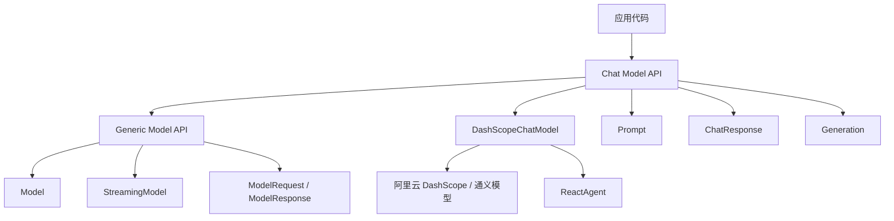
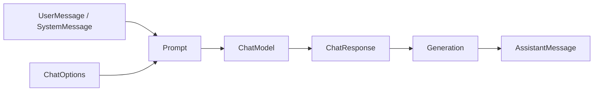

# 模型

## 概述

`ChatModel API` 为开发者提供了将 AI 驱动的聊天补全能力集成到应用程序中的方式。
它的目标不是绑定某一个具体模型，而是通过统一接口降低不同模型提供商之间的切换成本。

围绕这个目标，Spring AI 提供了几层抽象：

- 通用的 `Generic Model API`
- 面向聊天场景的 `Chat Model API`
- 面向具体提供商的实现，例如 `DashScopeChatModel`

下面这张图可以先帮助你建立一个整体印象：



## Generic Model API

Spring AI 先定义了一套通用模型接口，作为所有模型实现的基础。

### Model

`Model` 接口提供了调用 AI model 的通用 API。它旨在通过抽象发送请求和接收响应的过程来处理与各种类型的 AI model 的交互。该接口使用 Java 泛型来容纳不同类型的请求和响应，增强了不同 AI model 实现的灵活性和适应性。

```java
public interface Model<TReq extends ModelRequest<?>, TRes extends ModelResponse<?>> {

  /**
   * 执行对 AI 模型的方法调用。
   * @param request 要发送到 AI 模型的请求对象
   * @return 来自 AI 模型的响应
   */
  TRes call(TReq request);
}
```

### StreamingModel

`StreamingModel` 接口提供了调用具有流式响应的 AI model 的通用 API。它抽象了发送请求和接收流式响应的过程。

```java
public interface StreamingModel<TReq extends ModelRequest<?>, TResChunk extends ModelResponse<?>> {

  /**
   * 执行对 AI 模型的方法调用（流式响应）。
   * @param request 要发送到 AI 模型的请求对象
   * @return AI 模型的流式响应
   */
  Flux<TResChunk> stream(TReq request);
}
```

### ModelRequest

`ModelRequest` 接口表示对 AI model 的请求。它封装了与 AI model 交互所需的信息，包括指令或输入（泛型类型 `T`）和附加的 model 选项。

```java
public interface ModelRequest<T> {

  /**
   * 获取 AI 模型所需的指令或输入。
   * @return AI 模型所需的指令或输入
   */
  T getInstructions(); // 必填输入
  /**
   * 获取 AI 模型交互的可自定义选项。
   * @return AI 模型交互的可自定义选项
   */
  ModelOptions getOptions();
}
```

### ModelOptions

`ModelOptions` 是模型选项的基础接口。

```java
public interface ModelOptions {

}
```

### ModelResponse

`ModelResponse` 表示模型返回结果以及相关元数据。

```java
public interface ModelResponse<T extends ModelResult<?>> {

  /**
   * 获取 AI 模型的单个结果（第一个）。
   * @return AI 模型生成的第一个结果
   */
  T getResult();
  /**
   * 获取 AI 模型生成的所有候选结果列表。
   * 注：模型可配置返回多个候选结果（如设置 num_return_sequences）。
   * @return 生成的所有候选结果列表
   */
  List<T> getResults();

  /**
   * 获取与 AI 模型响应相关联的响应元数据。
   * @return 响应元数据
   */
  ResponseMetadata getMetadata();
}
```

### ModelResult

`ModelResult` 表示某一次模型输出以及与之关联的元数据。

```java
public interface ModelResult<T> {

  /**
   * 获取 AI 模型生成的输出内容。
   * @return AI 模型生成的输出内容
   */
  T getOutput();
  /**
   * 获取与 AI 模型结果相关联的元数据。
   * @return 与结果相关联的元数据
   */
  ResultMetadata getMetadata();
}
```

> [!Tip]
> **元数据层级区别**：
> - `ModelResponse.getMetadata()`：请求级元数据（总耗时、总Token、请求ID等）
> - `ModelResult.getMetadata()`：结果级元数据（完成原因、单结果Token、分数等）

## Chat Model API

在 `Generic Model API` 之上，Spring AI 提供了更适合聊天场景的抽象。

如果把一次最常见的聊天调用过程简化来看，核心对象之间的关系大致如下：



### ChatModel

`ChatModel` 扩展了 `Model<Prompt, ChatResponse>` 和 `StreamingChatModel`。

```java
public interface ChatModel extends Model<Prompt, ChatResponse>, StreamingChatModel {

  default String call(String message) {...}

  @Override
  ChatResponse call(Prompt prompt);
}
```

- `call(String)` 适合快速上手
- `call(Prompt)` 更适合真实项目

### StreamingChatModel

`StreamingChatModel` 用于流式返回聊天结果。

```java
public interface StreamingChatModel extends StreamingModel<Prompt, ChatResponse> {

  default Flux<String> stream(String message) {...}

  @Override
  Flux<ChatResponse> stream(Prompt prompt);
}
```

### Prompt

`Prompt` 是 `ModelRequest<List<Message>>` 的一个实现，用来封装消息列表和可选的模型选项。

以下是 Prompt 类的简化版本，排除了构造函数和其他实用方法：

```java
public class Prompt implements ModelRequest<List<Message>> {

  private final List<Message> messages;

  private ChatOptions modelOptions;

  @Override
  public ChatOptions getOptions() {...}

  @Override
  public List<Message> getInstructions() {...}

    // 构造函数和实用方法省略
}
```

#### Message

`Message` 接口封装了 `Prompt` 文本内容、元数据属性集合以及称为 `MessageType` 的分类。

```java
public interface Content {

  String getText();

  Map<String, Object> getMetadata();
}

public interface Message extends Content {

  MessageType getMessageType();
}
```

多模态消息还会实现 `MediaContent` 接口，用来提供媒体内容列表。

```java
public interface MediaContent extends Content {

  Collection<Media> getMedia();
}
```

常见消息类型包括：

- `UserMessage`
- `SystemMessage`
- `AssistantMessage`
- `FunctionMessage`
- `ToolResponseMessage`

聊天完成端点根据对话角色区分消息类别，由 MessageType 有效映射。

例如，OpenAI 识别不同对话角色的消息类别，如 system、user、function 或 assistant。

虽然术语 MessageType 可能暗示特定的消息格式，但在此上下文中，它有效地指定了消息在对话中扮演的角色。

对于不使用特定角色的 AI 模型，UserMessage 实现充当标准类别，通常表示用户生成的查询或指令。

#### ChatOptions

`ChatOptions` 是 `ModelOptions` 的子接口，用来描述传递给模型的可移植选项。

```java
public interface ChatOptions extends ModelOptions {

  String getModel();
  Float getFrequencyPenalty();
  Integer getMaxTokens();
  Float getPresencePenalty();
  List<String> getStopSequences();
  Float getTemperature();
  Integer getTopK();
  Float getTopP();
  ChatOptions copy();
}
```

常用选项包括：

- `model`: 要使用的模型 ID
- `frequencyPenalty`: 频率惩罚（-2.0 到 2.0），降低重复令牌的可能性
- `maxTokens`: 生成响应的最大令牌数
- `presencePenalty`: 存在惩罚（-2.0 到 2.0），鼓励谈论新主题
- `stopSequences`: 停止序列列表，遇到时停止生成
- `temperature`: 采样温度（0.0 到 2.0），控制随机性
- `topK`: Top-K 采样参数
- `topP`: Top-P（核采样）参数

`ChatOptions` 的使用通常分成两层：

- **启动时的默认配置**：在 `ChatModel` 初始化时设置，作为所有请求的基线配置
- **运行时配置**：通过 `Prompt` 携带，可覆盖启动配置，优先级更高

**选项合并规则**：运行时选项优先于启动选项，Spring AI 自动处理合并。输入会转换为模型特定格式，输出则统一为标准化的 `ChatResponse`。

### ChatResponse

`ChatResponse` 表示一次聊天模型调用返回的完整结果。

```java
public class ChatResponse implements ModelResponse<Generation> {

  private final ChatResponseMetadata chatResponseMetadata;
  private final List<Generation> generations;

  @Override
  public ChatResponseMetadata getMetadata() {...}

  @Override
  public List<Generation> getResults() {...}

  // 其他方法省略
}
```

### Generation

`Generation` 表示一次具体生成结果，通常封装一个 `AssistantMessage`。

```java
public class Generation implements ModelResult<AssistantMessage> {

  private final AssistantMessage assistantMessage;
  private ChatGenerationMetadata chatGenerationMetadata;

  @Override
  public AssistantMessage getOutput() {...}

  @Override
  public ChatGenerationMetadata getMetadata() {...}

  // 其他方法省略
}
```

## 可用实现

Spring AI 提供了统一的 `ChatModel` 和 `StreamingChatModel` 接口，因此可以比较平滑地切换不同模型提供商。

### 支持的模型提供商

常见支持包括：

- OpenAI
- Azure OpenAI
- Alibaba DashScope
- Ollama
- Hugging Face
- Vertex AI Gemini
- Amazon Bedrock
- Mistral AI
- Anthropic

### API 架构

可以把模型这一层理解成三层结构：

- 顶层是统一的 `ChatModel API`
- 中间层是 `Prompt`、`ChatResponse`、`Generation` 等抽象
- 底层是不同提供商的具体实现

在 Spring AI Alibaba 的实际使用里，最常见的模型实现是 `DashScopeChatModel`。

## DashScopeChatModel

`DashScopeChatModel` 是 Spring AI Alibaba 中最常见的模型实现之一，用来接入阿里云百炼平台上的通义模型。

### 前置条件

在使用 `DashScopeChatModel` 之前，通常需要：

1. 获取 DashScope API Key
2. 设置环境变量 `AI_DASHSCOPE_API_KEY`

### 添加依赖

```xml
<dependency>
    <groupId>com.alibaba.cloud.ai</groupId>
    <artifactId>spring-ai-alibaba-starter-dashscope</artifactId>
    <version>1.1.2.1</version>
</dependency>
```

### 基础使用

#### 创建 ChatModel

```java
import com.alibaba.cloud.ai.dashscope.api.DashScopeApi;
import com.alibaba.cloud.ai.dashscope.chat.DashScopeChatModel;
import org.springframework.ai.chat.model.ChatModel;

// 创建 DashScope API 实例
DashScopeApi dashScopeApi = DashScopeApi.builder()
  .apiKey(System.getenv("AI_DASHSCOPE_API_KEY"))
  .build();
// 创建 ChatModel
ChatModel chatModel = DashScopeChatModel.builder()
  .dashScopeApi(dashScopeApi)
  .build();
```

#### 简单调用

```java
// 使用字符串直接调用
String response = chatModel.call("介绍一下Spring框架");
System.out.println(response);
```

#### 使用 Prompt

```java
import org.springframework.ai.chat.prompt.Prompt;
import org.springframework.ai.chat.messages.UserMessage;
import org.springframework.ai.chat.model.ChatResponse;

// 创建 Prompt
Prompt prompt = new Prompt(new UserMessage("解释什么是微服务架构"));

// 调用并获取响应
ChatResponse response = chatModel.call(prompt);
String answer = response.getResult().getOutput().getText();
System.out.println(answer);
```

### 配置选项

#### 使用 ChatOptions

```java
import com.alibaba.cloud.ai.dashscope.chat.DashScopeChatOptions;

DashScopeChatOptions options = DashScopeChatOptions.builder()
  .withModel("qwen-plus")           // 模型名称
  .withTemperature(0.7)              // Temperature 参数
  .withMaxToken(2000)                // 最大令牌数
  .withTopP(0.9)                     // Top-P 采样
  .build();
ChatModel chatModel = DashScopeChatModel.builder()
  .dashScopeApi(dashScopeApi)
  .defaultOptions(options)
  .build();
```

#### 运行时覆盖选项

```java
// 创建带有特定选项的 Prompt
DashScopeChatOptions runtimeOptions = DashScopeChatOptions.builder()
  .withTemperature(0.3)  // 更低的温度，更确定的输出
  .withMaxToken(500)
  .build();

Prompt prompt = new Prompt(
  new UserMessage("用一句话总结Java的特点"),
  runtimeOptions
);

ChatResponse response = chatModel.call(prompt);
```

### 流式响应

```java
import reactor.core.publisher.Flux;

// 使用流式 API
Flux<ChatResponse> responseStream = chatModel.stream(
  new Prompt("详细解释Spring Boot的自动配置原理")
);
// 订阅并处理流式响应
responseStream.subscribe(
  chatResponse -> {
      String content = chatResponse.getResult()
          .getOutput()
          .getText();
      System.out.print(content);
  },
  error -> System.err.println("错误: " + error.getMessage()),
  () -> System.out.println("\n流式响应完成")
);
```

### 多轮对话

```java
import org.springframework.ai.chat.messages.Message;
import org.springframework.ai.chat.messages.SystemMessage;
import org.springframework.ai.chat.messages.AssistantMessage;
import java.util.List;

// 创建对话历史
List<Message> messages = List.of(
  new SystemMessage("你是一个Java专家"),
  new UserMessage("什么是Spring Boot?"),
  new AssistantMessage("Spring Boot是..."),
  new UserMessage("它有什么优势?")
);

Prompt prompt = new Prompt(messages);
ChatResponse response = chatModel.call(prompt);
```

### 支持的模型

DashScope 支持多个模型，包括：

- `qwen-turbo`：通义千问超大规模语言模型，支持中文、英文等
- `qwen-plus`：通义千问增强版
- `qwen-max`：通义千问旗舰版
- `qwen-max-longcontext`：支持长文本的通义千问

### 函数调用

`DashScopeChatModel` 支持函数调用（Function Calling），允许模型调用外部函数。

```java
import org.springframework.ai.chat.prompt.Prompt;
import org.springframework.ai.tool.ToolCallback;
import org.springframework.ai.tool.function.FunctionToolCallback;

// 定义函数工具
ToolCallback weatherFunction = FunctionToolCallback.builder("getWeather", (String city) -> {
      // 实际的天气查询逻辑
      return "晴朗，25°C";
  })
  .description("获取指定城市的天气")
  .inputType(String.class)
  .build();

// 使用函数
DashScopeChatOptions options = DashScopeChatOptions.builder()
  .withToolCallbacks(List.of(weatherFunction))
  .build();

Prompt prompt = new Prompt("北京的天气怎么样?", options);
ChatResponse response = chatModel.call(prompt);
```

## 与 ReactAgent 集成

在 Agent Framework 中，模型通常会直接交给 `ReactAgent` 使用。

```java
import com.alibaba.cloud.ai.graph.agent.ReactAgent;

ReactAgent agent = ReactAgent.builder()
  .name("my_agent")
  .model(chatModel)
  .systemPrompt("你是一个有帮助的AI助手")
  .build();

// 调用 Agent
AssistantMessage response = agent.call("帮我分析这个问题");
```

更具体的 Agent 使用方式，可以继续阅读 [Agents](/frameworks/spring-ai-alibaba/core-components/agents)。

## 总结

模型这一层的关键价值，是把不同大模型提供商的调用方式收敛成统一接口。

对 Spring AI Alibaba 开发者来说，比较自然的理解路径通常是：

1. 先理解 `ChatModel`
2. 再熟悉 `Prompt`、`ChatResponse`、`Generation`
3. 然后掌握 `DashScopeChatModel`
4. 最后再把它接入 `ReactAgent`

## 参考链接

- [Spring AI Alibaba 官方 Models 文档](https://java2ai.com/docs/frameworks/agent-framework/tutorials/models/)
- [Spring AI Alibaba 官方站点](https://java2ai.com/)
- [官方示例代码](https://github.com/spring-ai-alibaba/examples)
