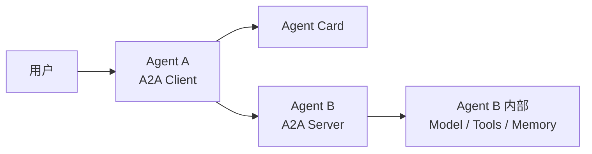
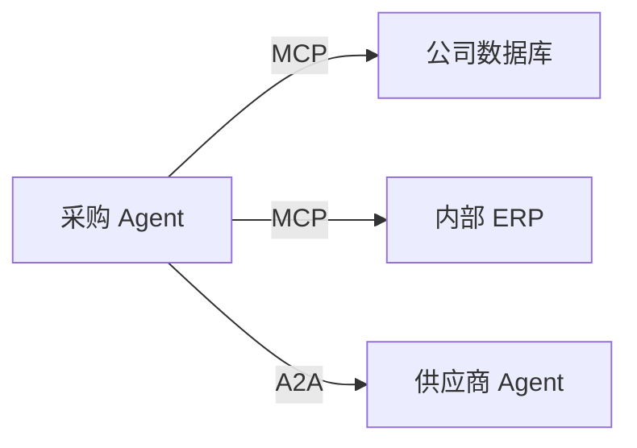

# A2A 是什么：让独立 Agent 能够互相协作

上一篇讲 Multi-Agent 时，我们看到的很多系统其实都运行在同一个应用内部。

例如：

```text
Main Agent
├─ Research Subagent
├─ Code Subagent
└─ Test Subagent
```

主 Agent 知道其他 Subagent 是谁，也知道怎样创建它们、给它们传递任务，再拿回结果。

这种情况下，Framework 自己就可以负责 Agent 之间的通信。

但如果两个 Agent 根本不属于同一个系统呢？

例如：

```text
旅行规划 Agent
        ↓
航空公司 Agent

企业采购 Agent
        ↓
供应商 Agent

公司内部 Agent
        ↓
外部 SaaS Agent
```

它们可能由不同团队开发，使用不同语言、不同 Framework，甚至运行在不同公司的服务器上。

这时候新的问题就出现了：

> **一个 Agent 怎么知道另一个 Agent 能做什么，又应该怎样把任务交给它？**

A2A 就是在解决这一层问题。

## 为什么会出现 A2A

假设一家公司已经有几个独立 Agent：

```text
Sales Agent
Support Agent
Finance Agent
Procurement Agent
```

每个 Agent 自己都运行得很好。

但现在希望 Procurement Agent 能把供应商询价任务交给另一家公司提供的 Supplier Agent。

如果没有统一标准，双方就需要自己约定：

```text
请求发到哪个接口？
怎么描述任务？
返回什么格式？
任务需要很久怎么办？
中途还缺用户信息怎么办？
最后生成的文件怎么返回？
怎么知道对方到底支持什么能力？
```

换一个新的 Agent，又要重新设计一套。

这和 MCP 出现之前各种 Tool 接入方式非常像。

所以 A2A 最核心的目标可以概括成：

> **标准化独立 Agent 之间的互操作。**

---

## A2A 到底是什么

`A2A` 是：**Agent2Agent Protocol**，也就是 **Agent-to-Agent Protocol**。

它是一个开放标准，用于让彼此独立、甚至内部实现完全不透明的 Agent 系统进行通信和协作。

这里的“独立”非常重要。

A2A 并不要求：

```text
两个 Agent 使用同一个模型
两个 Agent 使用同一个 Framework
两个 Agent 使用同一种编程语言
两个 Agent 共享 Memory
两个 Agent 知道对方内部有哪些 Tool
```

实际上，A2A 强调：

> Agent 可以互相协作，但不需要暴露自己的内部状态、Memory、Tool 或专有实现。

可以把这种关系理解成两个公司之间合作。

你不需要知道另一家公司内部员工怎么开会、数据库怎么设计。

你只需要知道：

```text
它提供什么服务
↓
怎么联系它
↓
怎么提交任务
↓
怎么拿到结果
```

A2A 就是在给 Agent 定义类似的边界。

---

## A2A 是怎么工作的

先看一张图：



假设 Agent A 想找另一个 Agent 帮忙。

它大致需要经历：

```text
找到 Agent B
↓
了解 Agent B 能做什么
↓
决定是否适合当前任务
↓
把任务发送给 Agent B
↓
等待执行
↓
接收进度或结果
```

A2A 就把这些步骤中最需要跨系统统一的部分标准化了。

其中几个核心概念尤其重要：

```text
Agent Card
Message
Task
Artifact
```

我们理解这四个以后，基本就能看懂 A2A 在干什么了。

---

## Agent Card：先告诉别人“我是谁、我能做什么”

两个独立 Agent 想合作，首先得知道对方能干什么。

A2A 使用 **Agent Card** 来描述一个 Agent。

它就像 Agent 的数字名片。

Agent Card 通常会包含：

- Agent 名称和描述
- 服务地址
- 支持的 A2A 协议版本
- 支持的通信方式
- 身份认证要求
- 支持哪些能力
- 可以处理哪些类型的任务

例如一个旅行 Agent 的 Agent Card，可以告诉其他 Agent：

```text
名称：
Hotel Agent

能力：
搜索酒店
查询房型
比较价格

输入：
文本 / JSON

输出：
文本 / JSON

A2A 地址：
https://hotel.example.com/a2a
```

于是另一个 Agent 就能先判断：

> 当前任务需要查酒店，这个 Agent 看起来能处理。

公开发现位置通常可以使用：

```text
https://example.com/.well-known/agent-card.json
```

也可以通过 Registry、内部 Catalog 或直接配置 Agent Card 地址来发现 Agent。

所以 A2A 的第一步就是：

> **先发现它，再理解它声明的能力。**

这里有一个特别容易和前面 Agent Skills 文章混淆的词。

Agent Card 里面也存在：

```text
skills
```

例如：

```text
搜索酒店
预订酒店
查询订单
```

A2A 规范里的 `AgentSkill` 主要是**描述这个 Agent 擅长完成哪些任务**，其中包括名称、描述、标签、示例和支持的输入输出类型。

它和 **Agent Skills 开放格式**并不是一回事。

Agent Skill 是：

```text
skill-name/
├── SKILL.md
├── scripts/
├── references/
└── assets/
```

是一种给 Agent 提供流程方法和资源的能力包。

而 A2A Agent Card 中的 Skill 更像：

> **Agent 对外声明“我会做什么”。**

两者名字相同，但不要混为一谈。

---

## Message、Task 和 Artifact 分别是什么

知道对方能做什么以后，就可以真正开始交互。

最基础的是 **Message**。

例如：

```text
请帮我查一下东京下周五，
距离东京站 2 公里以内、
每晚不超过 20,000 日元的酒店。
```

这就是发给另一个 Agent 的一条消息。

A2A 的 Message 不只能传文本，还可以承载文件、结构化 JSON 等不同类型的数据。

有些任务很简单：

```text
把 100 美元换算成日元。
```

Remote Agent 可能马上就可以回复一个 Message。

但真实 Agent 协作经常不是一次请求、一次响应这么简单。

例如：

```text
帮我比较三个供应商，
联系它们询价，
等报价回来以后整理报告。
```

这个任务可能需要几分钟、几小时甚至更久。

所以 A2A 还有一个非常重要的概念：

**Task。**

Task 代表一项有生命周期的工作。

可以先简单理解成：

```text
收到任务
↓
开始执行
↓
处理中
↓
可能需要补充信息
↓
继续执行
↓
完成 / 失败 / 取消
```

简单交互可以直接返回无状态 `Message`，复杂工作则可以创建有状态 `Task`。Task 可以一直运行，直到完成、失败、取消，或者因为缺少输入、认证等原因暂时停下来。

这也是 A2A 和普通“Agent 调一个 HTTP API”不同的地方。

A2A 从一开始就考虑了：

> **Agent 做的是任务，而不一定只是一次函数调用。**

任务最终还可能产生真正的结果。

这就是 **Artifact**。

例如：

```text
市场调研报告.pdf
供应商报价表.xlsx
生成的代码 Patch
旅行计划.json
```

这些都可以看作任务产生的 Artifact。

所以可以这样记：

```text
Message
→ Agent 之间说了什么

Task
→ Agent 正在完成哪件事情

Artifact
→ 这件事情最后产出了什么
```

---

## 一个完整的 A2A 协作过程

假设有一个：

```text
Travel Planner Agent
```

用户说：

> 帮我安排下个月去东京三天的住宿。

Travel Planner 自己不负责酒店搜索，但它知道有一个独立的 Hotel Agent。

整个过程可以简化成：

```text
Travel Planner
↓
读取 Hotel Agent 的 Agent Card

发现：
它支持 hotel-search
↓
发送 Message：

“搜索东京酒店……”
↓
Hotel Agent 创建 Task
↓
开始搜索
↓
返回任务进度
↓
生成酒店候选结果
↓
返回 Artifact
↓
Travel Planner 获得结果
↓
继续完成整个旅行计划
```

最重要的是：

> Travel Planner 不需要知道 Hotel Agent 内部到底用了什么模型、调用了哪家酒店 API、使用什么数据库。

Hotel Agent 也不需要把：

```text
System Prompt
Memory
内部 Tools
私有代码
```

暴露出去。

双方只需要遵守共同的 A2A 协议边界。

这就是 **Opaque Agent Collaboration**：Agent 可以保持内部实现不透明，但仍然能够互操作。

---

## A2A 和 MCP 有什么区别

因为两者出现的时间接近，又都在解决“连接”，所以就比较容易混淆。

简单理解就是：

```text
MCP
Agent ↔ Tool / Data

A2A
Agent ↔ Agent
```

例如一个采购 Agent：



MCP 解决：

> 采购 Agent 怎么访问自己的数据库和 ERP。

A2A 解决：

> 采购 Agent 怎么把询价任务委托给另一个独立 Supplier Agent。

而 Supplier Agent 自己内部又完全可能继续使用 MCP：

```text
Supplier Agent
├─ MCP → 商品数据库
├─ MCP → 库存系统
└─ MCP → 订单系统
```

于是可以形成：

```text
Agent A
│
├─ MCP → 自己的 Tools / Data
│
└─ A2A → Agent B
           │
           └─ MCP → Agent B 的 Tools / Data
```

这也是为什么经常会看到：

> **MCP inside agents，A2A between agents。**

当然，不意味着所有 Agent-to-Tool 和 Agent-to-Agent 系统都必须分别使用这两个协议。

---

## A2A 和普通 Multi-Agent 有什么区别

上一篇已经讲过：

> Multi-Agent 并不一定需要 A2A。

例如：

```text
Main Agent
↓
Subagent
```

它们本来就属于同一个 Runtime。

主 Agent 已经知道：

- Subagent 怎么启动
- 参数怎么传
- Context 怎么管理
- 结果怎么返回

这时候没有必要再增加一层 A2A。

所以 Multi-Agent 是一个更宽泛的架构概念：

> **一个系统由多个 Agent 协作。**

A2A 则是一个协议：

> **当这些 Agent 需要跨系统边界互操作时，用什么共同语言通信。**

可以这样理解：

```text
Multi-Agent
        │
        ├─ 同一个应用内部
        │   └─ Framework 自己协调
        │
        └─ 独立 Agent 之间
            └─ 可以考虑 A2A
```

因此：

> **A2A 可以服务 Multi-Agent，但 Multi-Agent 不等于 A2A。**

---

## 实际怎么使用 A2A

对于我们普通用户来说，目前 A2A 还不像 MCP 那样经常表现为“把这个 Server 地址加到客户端”。

它更多还是一个开发者层面的互操作协议。

如果要让一个 Agent 支持 A2A，通常需要做两件事。

第一件是：

> **把自己的 Agent 作为 A2A Server 暴露出去。**

需要定义 Agent Card，告诉外部：

```text
我是谁
我能做什么
怎么找到我
支持什么协议
需要什么认证
```

第二件是：

> **让另一个 Agent 成为 A2A Client。**

Client 获取 Agent Card 后，就可以根据对方能力发送消息和任务。

官方已经提供 Python、JavaScript、Java、Go、C#/.NET、Rust 等 SDK，并提供 Python Quickstart 和多 Agent 协作示例。

基本路线就是：

```text
定义 AgentSkill
↓
创建 Agent Card
↓
实现 Agent Executor
↓
启动 A2A Server
↓
使用 Client 发送请求
↓
继续处理 Streaming / Multi-turn
```

我们当前入门阶段没有必要深入了解 A2A 的底层实现。

只需要先知道：**A2A 并不是一种新的 Agent Framework。**

我们仍然可以使用：

```text
LangGraph
ADK
自研 Agent
其他 Framework
```

实现 Agent 本身。

A2A 负责的是：

> 把这个已经存在的 Agent，用统一协议开放给别的 Agent。

---

## A2A 能解决什么，又不能解决什么

A2A 最有价值的地方是降低独立 Agent 之间的集成成本。

它统一了：

```text
能力描述
Agent 发现
任务委托
消息交换
长任务状态
结果交付
协议协商
```

从而让：

```text
Framework A 的 Agent
```

有机会与：

```text
Framework B 的 Agent
```

按照共同标准进行交互。

但 A2A 并不会替 Agent 决定：

```text
任务应该怎么拆
应该找哪个 Agent
返回结果是否可信
多个 Agent 冲突怎么办
业务权限怎么设计
是否应该把任务委托出去
```

这些仍然属于上层 Agent Runtime、业务逻辑和编排系统。

所以 A2A 解决的是：

> **Agent 之间如何互操作。**

而不是：

> **整个 Multi-Agent 系统应该怎样设计。**

---

## 总结

到这里，我们已经建立了对 A2A 基本的认知：

```text
为什么需要 A2A
→ 独立 Agent 之间缺少统一协作方式

A2A 是什么
→ Agent-to-Agent 的开放互操作协议

怎么知道别人会什么
→ Agent Card

怎么交流
→ Message

怎么处理复杂工作
→ Task

怎么返回成果
→ Artifact

和 MCP 什么关系
→ MCP 连接 Tool / Data
  A2A 连接独立 Agent
```

而上一篇 Multi-Agent 和这一篇 A2A 的关系也可以最后归纳成：

```text
Multi-Agent
→ 多个 Agent 怎么协作

A2A
→ 独立 Agent 跨系统协作时，
  怎样使用统一协议
```

下一篇我们不再继续讲这些协议，带大家整体了解一下各种 **Engineering**。
