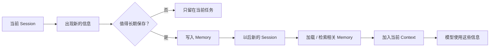

# Agent Memory 是什么：让 Agent 记住真正重要的信息

我们和一个 Agent 连续工作几天以后，就很容易遇到下面这样的情况：

第一天已经告诉它：这个项目统一使用 pnpm，不要使用 npm。

第二天打开一个新的会话，它又执行：

```bash
npm install
```

或者已经反复告诉AI：

> 我喜欢简洁一点的回答。

下次再问它，又像第一次回答一样重新开始。

这时候缺少的就不只是更好的 Prompt 或更多 Tool 了。

而是：

> **Agent 能不能把过去有价值的信息保存下来，并在以后真正需要的时候重新使用。**

这就是 Agent Memory 要解决的问题。

## 为什么 Agent 需要 Memory

大模型每次生成内容，都只能根据**当前 Context 中能够看到的信息**进行判断。

如果某条信息已经不在 Context 中，模型本身不会因为“上周聊过”就自动记得它。

最简单的办法当然是把所有历史对话一直保留下来：

```text
第一轮对话
+
第二轮对话
+
第三轮对话
+
……
+
今天的问题
↓
全部交给模型
```

但对话越来越长以后，很快就会遇到问题。

不仅 Context 会不断增大，成本和响应时间会上升，大量已经过时或无关的信息也会干扰当前判断。即使上下文窗口能够容纳完整历史，过长的历史仍可能让模型受到陈旧和无关内容影响。

更重要的是：

> **过去发生过的所有事情，并不都值得长期记住。**

例如：

```text
刚刚一次 Tool Call 的临时结果
今天随口问的一句话
已经失效的项目路径
一次没有验证的猜测
```

它们可能只对当前任务有用。

但另外一些信息却值得以后继续使用：

```text
用户长期偏好
项目构建命令
已经确认的架构决策
过去解决某类问题得到的经验
```

所以 Memory 真正要解决的不是：

> 怎么把所有东西保存下来？

而是：

> **什么值得保存、保存到哪里，以及以后什么时候重新拿出来。**

---

## Agent Memory 到底是什么

Memory 让 Agent 能够记住过去的交互，从反馈中学习，并根据用户偏好进行调整。

例如用户告诉 Agent：

```text
以后代码示例默认使用 Java。
```

系统可以把：

```text
preferred_language = Java
```

保存下来。

几天以后，即使已经开启一个新的会话，Agent 仍然可以重新获得这条信息。

再比如 Coding Agent 在一个仓库里发现：

```text
项目使用 pnpm
测试命令是 pnpm test
启动命令是 pnpm dev
```

这些信息以后在同一个项目里还会反复使用，也可能被保存为项目相关的 Memory。

所以一条 Memory 最核心的特点不是：

> 它存在哪里。

而是：

> **它能够跨越当前这一刻，在以后继续影响 Agent。**

---

## Memory、Context 和 Session 有什么区别

先看一个简单例子。

我们今天重新打开一个 Coding Agent：

```text
新的 Session

用户：
帮我继续修改昨天那个项目。
```

Agent 最终处理任务时，可能同时获得：

```text
当前用户请求
+
系统指令
+
当前打开的文件
+
昨天保存的项目 Memory
+
刚刚执行的 Tool 结果
```

这些真正被交给模型的内容，共同构成了当前的 **Context**。

所以：

> **Context 解决的是：模型这一刻能看到什么。**

Memory 不一样。

Memory 是过去保存下来的信息，例如：

```text
项目使用 pnpm
用户偏好中文回答
昨天确定使用 PostgreSQL
```

这些信息可以存在 Memory 中，却不一定每一次都全部进入 Context。

系统可以根据当前任务只读取相关部分。

所以：

> **Memory 解决的是：哪些过去的信息以后还应该能够重新使用。**

而 **Session** 是一次连续交互的边界。

例如：

```text
Session A
上午排查登录问题

Session B
下午重新打开 Agent，继续开发
```

同一个 Session 中通常会保留连续的消息和任务状态。

新的 Session 则可能拥有新的 Context。

Claude Code 就是一个非常直观的现实例子：每个 Claude Code Session 都从新的 Context Window 开始，但可以通过 `CLAUDE.md` 和 Auto Memory 把知识带到之后的 Session。

所以大概可以这么理解：

```text
Session
→ 这是哪一次连续交互

Memory
→ 过去有哪些信息还值得保留

Context
→ 模型这一刻真正看到了哪些信息
```

它们之间又会发生联系：

```text
过去的 Session
      ↓
产生有价值的信息
      ↓
    Memory
      ↓
以后重新读取
      ↓
放进当前 Context
      ↓
影响模型这一次判断
```

这也是为什么：

> **有 Memory，不代表模型此刻一定能看到它。**

Memory 最终还需要被加载或者检索到当前 Context 中，才能真正影响模型。

---

## Agent Memory 可以怎么分类

Memory 容易让人困惑，很大一个原因是网上经常同时出现：

```text
长期记忆
用户记忆
项目记忆
语义记忆
Agent 记忆
```

看起来像五种并列类型。

实际上它们往往属于**不同分类维度**。

同一条 Memory，可以同时拥有多个属性。

### 按生命周期：短期记忆与长期记忆

第一种分类方式是看：

> **这条信息需要存在多久？**

最常见的就是：

```text
短期记忆
Long-term Memory
```

短期记忆主要服务当前连续任务，例如：

```text
消息历史
当前任务数据
上传的文件
刚刚获得的结果
```

比如正在修改一个 Bug：

```text
已经找到问题出现在 UserService
刚刚修改了第 73 行
下一步要运行登录测试
```

这些信息当前非常重要，但半年后通常没有必要继续影响 Agent。

长期记忆则需要跨越不同 Session 或 Thread。

例如：

```text
用户默认使用中文
这个项目统一使用 pnpm
用户不希望自动提交代码
```

因此：

```text
短期记忆
→ 服务当前连续任务

长期记忆
→ 跨 Session 继续存在
```
---

### 按作用范围：用户、项目、Agent 与共享记忆

第二种分类方式不是看时间，而是看：

> **这条 Memory 到底属于谁？**

例如：

```text
用户喜欢简洁回答
```

显然应该跟着这个用户走。

这属于 **User-scoped Memory**。

如果换了另一个用户，就不应该自动继承这个偏好。

有些 Memory 则只适用于一个项目。

例如：

```text
bujidao-ai 使用 pnpm

主分支叫 main

运行测试前需要启动 PostgreSQL
```

换到另一个项目以后，这些信息就不应该继续影响 Agent。

这可以理解成：

**Project / Repository Memory。**

Claude Code 的 Auto Memory 就是一个典型例子。它会按 Repository 保存自己发现的 Build Commands、Debugging Insights 和用户在这个项目中的偏好；与此同时，`CLAUDE.md` 又可以按照 User、Project、Organization 等不同范围提供持久信息。

还有一些 Memory 属于 Agent 自己。

例如一个长期运行的研究 Agent 逐渐积累：

```text
哪些搜索方式更有效
自己以前在哪些问题上容易犯错
哪些信息源通常更可信
```

这些信息不是某个用户独有，而可能被这个 Agent 在不同用户和任务之间继续使用。

这就是：

**Agent-scoped Memory。**

再往外，还有 Shared / Organization Memory。

例如一个团队里的多个 Agent 都应该知道：

```text
公司统一使用 UTC 时间

生产数据库禁止直接写入

内部文档系统地址是什么
```

这些信息可能需要由多个 Agent 共享。

所以这一条分类轴大致可以理解成：

```text
Memory 属于谁？

├─ User
├─ Project / Repository
├─ Agent
└─ Shared / Organization
```

不同系统的具体名称可能不同，但背后的问题都是一样的：

> **这条信息应该影响到多大的范围？**

---

### 按内容类型：事实、经历与流程经验

还有一种也比较有用的分类方式，是看：

> **到底记住了什么？**

```text
Semantic Memory
Episodic Memory
Procedural Memory
```

LangGraph 参考人类记忆的概念，把长期 Memory 分成 Semantic Memory、Episodic Memory 和 Procedural Memory。

**Semantic Memory，语义记忆**，主要保存事实和知识。

例如：

```text
用户是 Java 开发者

项目使用 PostgreSQL

接口默认返回 JSON
```

可以简单理解成：

> **记住“是什么”。**

**Episodic Memory，情景记忆**，更偏过去发生过的事件和经历。

例如 Agent 曾经完成过一次任务：

```text
上次部署失败
↓
发现原因是环境变量缺失
↓
补充 DATABASE_URL 后部署成功
```

可以理解成：

> **记住“以前发生过什么”。**

**Procedural Memory，程序性记忆**，则更偏完成任务时使用的规则和方法。

例如：

```text
修改数据库 Schema 后
必须先生成 Migration
再运行测试
```

可以理解成：

> **记住“这类事情应该怎么做”。**

这里需要注意，这是一种**认知上的 Memory 分类方式**。

不同 Agent 产品并不会都建立三个分别叫semantic_memory、episodic_memory、procedural_memory的数据库。

真实实现可能是文件、结构化数据、Prompt、Skill、数据库记录或者其他形式。

这些名称更重要的作用，是帮助我们理解：

> Agent 保存下来的内容，本身也可以有完全不同的性质。

把三个维度放在一起以后，我们就会发现：

> **“长期记忆”“项目记忆”“语义记忆”不是三个互斥选项。**

例如：

```text
这个项目统一使用 pnpm。
```

它可以同时是：

```text
长期记忆
+
Project Scope
+
Semantic Memory
```

而：

```text
用户喜欢回答先给结论。
```

可以同时是：

```text
长期记忆
+
User Scope
+
Semantic Memory
```
---

## 一条 Memory 是怎么被记住和再次使用的

知道 Memory 可以保存什么以后，还有一个更重要的问题：

> 信息到底怎样从一次对话，变成以后还能使用的 Memory？

可以先看一个完整过程：



例如用户说：

> 以后这个项目都使用 pnpm。

系统首先要判断：

```text
这是一个临时信息吗？
不是。

以后还会使用吗？
很可能。

应该属于谁？
当前项目。
```

于是可以保存一条 Memory：

```text
scope: project
content: Package manager is pnpm.
```

几天以后重新进入这个项目。

Agent 不需要恢复全部历史聊天，只需要重新得到：

```text
Package manager: pnpm
```

然后把它加入当前 Context。

模型便可以继续使用。

这里还涉及两种非常常见的使用方式。

一种是**直接加载**。

如果 Memory 很少，而且几乎每次都会使用，就可以在 Session 开始时直接放进 Context。

Claude Code 的 Auto Memory 就会在每个 Session 开始时加载一部分内容。

另一种则是**按需检索**。

例如一个 Agent 已经积累了几千条过去经验，不可能每次全部放进 Context。

当前任务是：

> PostgreSQL Migration 为什么执行失败？

系统就可以只查找和：

```text
PostgreSQL
Migration
数据库
```

相关的 Memory。

所以 Memory 系统往往不只是：存。

还必须考虑：什么时候存？存到哪里？什么时候找？找哪些？怎样放回 Context？


这些更深入的写入和检索策略，会留到后面的 Memory 原理中再讨论。

---

## 实际 Agent 产品里的 Memory 长什么样

Memory 并没有一种所有 Agent 都必须遵守的固定实现。

现在不同系统其实采用了相当不同的方法。

**LangGraph** 会把 Short-term Memory 作为 Thread State 的一部分，并通过 Checkpoint 保存；跨 Thread 的 Long-term Memory 则进入独立 Store，并可以通过 Namespace 组织。

因此它比较像：

```text
Thread / Session
→ 当前任务和消息

Store
→ 跨 Session 的长期 Memory
```

---

**Claude Code** 就非常贴近 Coding Agent 场景。

每个 Session 都从新的 Context Window 开始，但通过两套机制把信息带到未来：

```text
CLAUDE.md
→ 人主动写下来的持久说明

Auto Memory
→ Claude 自己积累的经验和模式
```

官方给 Auto Memory 举的典型内容包括 Build Commands、Debugging Insights，以及 Claude 从交互中发现的偏好。

例如说：

```text
记住，这个项目以后都使用 pnpm。
```

Claude Code 当前可以把这类内容保存到 Auto Memory，在之后的 Session 中继续使用。

---

**Mem0** 更强调 Memory 的作用域。

一条 Memory 可以围绕：

```text
user_id
agent_id
app_id
run_id
```

等实体进行组织和检索。

例如旅行 Agent 可以保存：

```text
用户 6412
→ 喜欢 Boutique Hotel
→ 不吃贝类
```

以后只给这个用户的旅行任务使用。

---

**Letta** 又采用了比较不同的设计。

它把部分 Memory 组织成 Memory Blocks。

这些 Block 可以直接挂载在 Agent 上，进入 Agent 当前 Context；同一个 Block 还可以同时挂载给多个 Agent，形成共享 Memory。

这些实现看起来差异很大，但它们其实都在回答同样几个问题：

```text
记什么？
属于谁？
保存多久？
什么时候读取？
怎样进入当前 Context？
```

这才是理解 Agent Memory 最重要的主线。

---

## Memory 为什么不等于聊天记录和向量数据库

很多 Agent 项目的第一个 Memory 版本都是：

> 把聊天记录全部保存起来。

聊天记录当然可以成为 Memory 的来源，甚至也是最常见的 Short-term Memory 形式之一。

但：

> **保存聊天记录，不等于已经设计好了 Memory。**

例如下面一段两小时的聊天：

```text
用户问了 40 个问题
Agent 调用了 30 次 Tool
产生了 20 个中间结果
期间改了 4 次方案
```

最后真正值得以后保存的可能只有：

```text
最终采用方案 B。
以后不要使用方案 A。
```

Memory 系统需要做的，往往恰恰是从大量过去信息中提炼真正值得继续使用的部分。

另一个常见说法是：

> 做 Agent Memory，就是上一个向量数据库。

这同样不准确。

向量数据库只是其中一种**存储和检索手段**。

Memory 完全可以保存成：

```text
JSON
关系数据库
Markdown 文件
Key-Value Store
向量数据库
普通文档集合
```

是否使用 Embedding 和 Vector Search，要看具体 Memory 怎么检索。

LangGraph 的文档也特别区分了 **Semantic Memory** 和 **Semantic Search**。

前者表示保存事实和知识这一类记忆；后者才是利用语义相似度检索内容的一种技术。两者不是一个概念。

```text
Agent Memory
      ↓
需要某种存储方式
      ↓
数据库 / 文件 / Store ...
      ↓
可能需要检索
      ↓
关键词 / Filter / Vector Search ...
```
---

## 什么值得记，什么不应该记

Memory 不是越多越好。

真正有价值的 Memory，通常具有两个特点：

> **以后还可能使用，而且未来使用它确实能够改善 Agent 的判断。**

例如：

```text
用户明确表达的长期偏好

项目中已经确认的技术事实

稳定的工作约定

多次任务中验证有效的经验

长期任务中需要持续保持的背景
```

这些通常比较值得保存。

而下面的信息则应该更谨慎：

```text
一次性的 Tool 输出

当前步骤的临时变量

已经失效的信息

模型没有验证过的猜测

与未来任务几乎没有关系的闲聊
```

例如 Agent 搜索了一次天气：

```text
东京今天 27°C。
```

除非任务本身需要保存这条历史，否则通常没有理由把它变成长期 Memory。

但：

```text
用户旅行时更喜欢温度较低的地区。
```

如果这是用户明确表达的长期偏好，就可能具有保存价值。

此外，Memory 还可能涉及个人偏好、工作信息甚至更加敏感的数据。

因此“能不能记”之外，还应该考虑：

> **这条信息是否应该被长期保存，以及用户是否应该拥有查看、修改和删除它的能力。**

---

## Memory 也会记错、过期和冲突

Memory 会让 Agent 更连续，但也会带来一个新的问题：

> **过去的信息未必永远正确。**

例如 Memory 中保存：

```text
项目使用 MySQL。
```

三个月后项目已经迁移到 PostgreSQL。

如果 Agent 仍然继续读取旧 Memory，它反而会被过去误导。

用户偏好也可能发生变化：

```text
以前：
默认使用 Java。

现在：
这个项目改用 TypeScript。
```

还有一种情况，是同一件事出现两条冲突 Memory：

```text
Memory A：
部署区域是 Tokyo。

Memory B：
部署区域是 Singapore。
```

系统如果不知道哪一条更新，就可能产生错误判断。

所以一个真正可靠的 Memory 系统最终还要面对：

```text
更新
覆盖
删除
去重
冲突
过期
来源
作用域
```

这些问题。

长期 Memory 没有一种适合所有系统的固定方案；无论是维护一个持续更新的 Profile，还是维护大量独立 Memory，都需要解决更新、删除和检索带来的复杂性。

因此：

> **Memory 的目标从来不是让 Agent“什么都不忘”。**

更理想的状态应该是：

> **让 Agent 在正确的时间，记得真正有用而且仍然可信的信息。**

---

## 总结

到这里，可以先把 Agent Memory 理解成一张多维地图：

```text
Agent Memory

按生命周期
├─ Short-term
└─ Long-term

按作用范围
├─ User
├─ Project
├─ Agent
└─ Shared / Organization

按内容
├─ Semantic
├─ Episodic
└─ Procedural
```

最重要的几个关系则是：

```text
Session
→ 一次连续交互的边界

Memory
→ 从过去保留下来的信息

Context
→ 模型这一刻真正看到的信息
```

一条 Memory 被保存下来以后，并不会自动帮助 Agent。

真正完整的过程是：

```text
过去产生信息
→ 判断是否值得保存
→ 写入正确作用域
→ 以后加载或检索
→ 放进当前 Context
→ 再被模型使用
```
