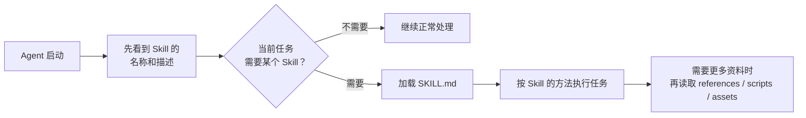

# Agent Skills 是什么：把流程方法变成可复用能力

在前面的文章里，我们已经见过不少 Tool。

例如 Coding Agent 可能拥有：

```text
read_file
write_file
search_code
run_tests
```

有了这些 Tool，Agent 已经可以读取代码、修改文件、搜索项目并运行测试。

但这时候还有一个问题：

> **有工具，不代表 Agent 就知道一类任务应该怎么做。**

例如让 Agent：

> 帮我修复这个 GitHub Issue。

它虽然知道怎么读文件、写文件和运行测试，但仍然需要自己判断：

* 应该先看 Issue 还是先搜索代码
* 修改之前需要了解哪些上下文
* 修改以后应该运行哪些测试
* 测试通过以后还要不要检查 Diff
* 最后应该按照什么格式汇报

这些东西都不是某一个 Tool 能解决的。

应该是：

> **完成这一类任务时长期积累下来的一套流程、经验和要求。**

Agent Skills 就是在解决这个问题。

## 为什么会出现 Agent Skills

很多人使用 Agent 一段时间以后，都会遇到一个很相似的现象。

第一次让 Agent 做代码审查，需要告诉它：

> 重点检查 Bug、回归风险和缺失测试，不要只总结代码变化。

下次做 Code Review，还要再说一次。

再比如写发布说明：

> 先读取变更记录，区分新增功能、Bug 修复和 Breaking Changes，最后输出 Markdown。

下次发布又要重新解释。

慢慢就会出现大量这样的内容：

```text
“以后做这件事的时候，记得先……”

“这种任务统一按照这个格式……”

“运行完成以后一定检查……”

“遇到这种情况不要直接……”
```

最开始，它们可能只是散落在 Prompt、项目文档、团队 Wiki，甚至我们开发者自己的脑子里。

问题在于：

> **这些流程明明可以复用，却每次都在重新告诉 Agent。**

Anthropic 在 2025 年推出 Agent Skills 时，强调的正是这种“procedural knowledge”——真实工作不只有工具和知识，还包含“这件事应该怎样做”的过程经验。Agent Skills 将这些说明、脚本和资源组织起来，让 Agent 可以在需要时发现并加载。

所以 Skill 最核心的价值，可以概括成一句话：

> **把一类重复任务的流程方法，从一次性的对话里拿出来，变成可以长期复用的能力。**

---

## Agent Skills 到底是什么

现在所说的 Agent Skills，并不只是泛指“Agent 有某项能力”。

它已经逐渐形成了一套明确的文件组织方式。

Hugging Face 对 Agent Skills 的定义很直观：

> Skill 是一个包含特定领域知识的自包含能力包，可以被 Agent 发现并在需要时使用。

OpenAI 目前也把 Skill 描述为一种**可复用、可共享的工作流**：把任务怎么做定义一次，以后遇到同类任务就可以再次应用。

一个 Skill 最核心的部分通常是：

```text
SKILL.md
```

里面写清楚：

* 这个 Skill 是做什么的
* 什么情况下应该使用
* 任务应该按照什么步骤完成
* 有哪些要求和限制
* 最终应该得到什么结果

如果任务比较复杂，还可以继续附带：

```text
scripts/
references/
assets/
```

也就是说，Skill 不一定只是一篇 Markdown。

它可以是一整个小型能力包。

---

## Agent Skills 是怎么发展起来的

“给 Agent 保存一套固定指令”的想法并不是突然出现的。

在 Skills 之前，不同 Agent 产品里早就存在：

```text
Custom Instructions
Commands
项目说明文件
Prompt Templates
规则文件
```

这些机制都在尝试解决类似问题：

> 怎样让 Agent 不需要每次都从零开始理解我们的工作方式？

2025 年 10 月，Anthropic 正式推出 Agent Skills，把 Instructions、Scripts 和 Resources 组织成可以动态发现、按需加载的目录。

同年 12 月，Agent Skills 被进一步发布为开放标准，希望这种能力不再只属于 Claude，而是能够在不同 Agent 产品之间迁移。

到了 2026 年，Skills 已经开始明显跨出单一产品生态。

Hugging Face 的 Context Course 直接把 Agent Skills 作为第一个核心单元，并以 Claude Code、Codex、OpenCode、Pi 等不同 Code Agent 作为参考实现；其资料称 Agent Skills 规范已经被 30 多个 Code Agent 采用。

OpenAI 也已经支持以 `SKILL.md` 为核心的 Skills，并允许在支持 Agent Skills 格式的工具之间导入和导出。

因此现在 Agent Skills **正在逐渐跨 Agent 产品复用的一种能力组织方式。**

不过不同产品在 Skill 放在哪里、什么时候加载、支持哪些扩展字段上仍然可能不同。

开放格式解决的是共同部分，不代表所有产品实现已经完全一样。

---

## 一个 Skill 实际长什么样

按照当前 Agent Skills Specification，一个 Skill 最简单可以只有一个目录和一个 `SKILL.md`。

完整一些则可能是：

```text
code-review/
├── SKILL.md
├── scripts/
│   └── check-diff.sh
├── references/
│   └── review-guide.md
└── assets/
    └── report-template.md
```

其中只有：

```text
SKILL.md
```

是必须存在的。

`scripts`、`references` 和 `assets` 都是按需要增加的可选内容。

例如我们可以写一个最简单的 Code Review Skill：

```markdown
---
name: code-review
description: Review code changes for bugs, regressions and missing tests.
---

# Code Review

读取本次代码变更后再开始 Review。

重点检查：

- 明显 Bug
- 潜在回归
- 边界条件
- 缺失测试
- 安全风险

不要只总结代码变化。

如果发现问题，优先说明：

1. 问题在哪里
2. 为什么有风险
3. 什么情况下会触发
4. 建议怎么修改

如果没有发现明显问题，也要说明仍然存在的不确定性。
```

前面的 YAML 部分是这个 Skill 的基本信息。

其中最重要的是：

```yaml
name: code-review
description: ...
```

`name` 告诉系统这个 Skill 叫什么。

`description` 不只是说明文字，它还需要告诉 Agent：

> **这个 Skill 能做什么，以及什么时候应该使用。**

按照当前规范，这两个字段属于必需元数据。

下面的 Markdown 正文，才是真正的任务方法。

---

如果这套流程还需要大量资料，也没有必要把全部内容塞进 `SKILL.md`。

例如：

```text
references/
├── java-review.md
├── frontend-review.md
└── security-review.md
```

Agent 做 Java Review 时，再去读取相应参考资料。

如果某一步需要确定性执行，还可以准备脚本：

```text
scripts/
└── check-diff.sh
```

所以一个完整的 Skill 可以同时拥有：

> **说明 + 流程 + 参考资料 + 模板 + 可执行脚本。**

这也是它和普通 Prompt 有明显区别的地方。

---

## Agent 是怎么使用 Skill 的

如果我们给 Agent 装了几十个 Skills，Agent 每次运行时，是不是要把几十份 `SKILL.md` 全部读进 Context？

其实一般都不会这样做。

因为 Agent Skills 一个很重要的设计就是：

**按需加载。**

可以先用下面这张图理解：



比如系统里存在：

```text
code-review
release-note
pdf-processing
database-migration
```

用户说：

> 帮我 Review 一下刚才的代码修改。

Agent 没必要先完整阅读另外三个 Skills。

它只需要先根据名称和描述发现：

```text
code-review
```

可能适合当前任务。

然后再加载它真正的 `SKILL.md`。

如果 Skill 中又写着：

> Java 项目请继续参考 `references/java-review.md`

这时候才继续读取对应文件。

这种思想叫做：

**Progressive Disclosure，渐进式披露。**

“先暴露必要元数据、命中后再加载完整内容”是 Skill 的核心特征之一。

对于入门阶段，我们不需要研究它内部到底怎样实现。

只需要理解：

> **Skill 不是把更多内容永远塞进 Prompt，而是让 Agent 在需要的时候找到正确的方法。**

---

## 为什么 Skill 不只是一个长 Prompt

表面看起来，`SKILL.md` 里也是 Markdown 文字。

那我把这些内容直接复制到 Prompt 里，不也一样吗？

如果只有一次任务，确实可能一样。

比如：

```text
请按照下面流程 Review 代码……
```

完全可以直接写在 Prompt 中。

Skill 真正产生价值，是因为这套方法开始需要**反复使用**。

例如一个团队每周都会做：

```text
代码审查
版本发布
事故复盘
日志分析
文档检查
```

如果每次都重新复制一份 Prompt：

* 内容可能慢慢变成不同版本
* 有人忘记某些步骤
* 更新规则以后需要到处修改
* 参考资料和脚本也很难一起管理

Skill 则把这些内容变成一个明确的对象：

```text
release-note/
└── SKILL.md
```

团队只需要维护这一份。

以后流程发生变化，比如：

```text
发布说明必须增加 Breaking Changes 检查
```

那么只需要更新 Skill ，Agent实现的时候就会作为参考。

所以并不是：

> Prompt 很低级，Skill 很高级。

准确地说：

> **Prompt 适合表达当前这一次任务；Skill 更适合沉淀可以重复使用的流程方法。**

所以，回馈一下你日常的AI使用流程，是否存在重复相同 Prompt、模板、步骤和格式要求，那么就很适合把它们变成可复用的 Skill。

---

## Skill、Tool、MCP 和 Workflow 有什么区别

这几个概念很容易在 Agent 项目里同时出现。

可以先用一张表区分：

| 概念 | 主要解决什么 |
| --- | --- |
| **Tool** | Agent 能执行什么动作 |
| **MCP** | 外部能力怎样标准化连接进 Agent |
| **Skill** | 某一类任务应该怎样完成 |
| **Workflow** | 系统按照什么流程组织和执行任务 |

例如现在有一个：

> 修复 GitHub Issue

的任务。

Agent 可能拥有 Tool：

```text
read_file
write_file
run_tests
```

又通过 MCP 连接 GitHub：

```text
get_issue
create_comment
```

同时存在一个 Skill：

```text
fix-github-issue
```

里面规定：

```text
先读取 Issue
↓
定位相关代码
↓
确认修改范围
↓
修改代码
↓
运行测试
↓
检查 Diff
↓
汇报结果
```

这里：

**Tool** 负责真的读文件、写文件和跑测试。

**MCP** 负责把 GitHub 这些外部能力接进 Agent。

**Skill** 告诉 Agent，修复 Issue 这类事情通常应该按照什么方式做。

如果系统又强制要求：

```text
开发
→ Code Review
→ CI
→ 人工审批
→ Merge
```

那么这就是一个明确的 Workflow。

所以 Skill 虽然标题里有“流程方法”，但它并不等于 Workflow。

因为 Skill 里面的流程 Agent 有时候又会忘记。但是 Workflow 程序一般不会。

---

## Skill 和项目规则、Memory 有什么区别

Coding Agent 里还有两个东西特别容易和 Skills 混在一起：

```text
项目规则
Memory
```

假设一个项目规定：

```text
所有新增 Java 类必须放在指定 package。
禁止直接修改生产数据库。
提交代码前必须运行 mvn test。
```

这些要求几乎无论 Agent 做什么任务都成立。

它们更适合作为**项目级规则**持续存在。

而：

```text
怎样发布一个新版本
```

只有真的执行发布任务时才需要。

它就更适合作为 Skill。

可以先这样区分：

```text
项目规则
→ 在这个项目里长期都应该遵守什么

Skill
→ 遇到某一类任务时应该怎么做
```

Memory 又是另一个问题。

例如 Agent 曾经知道：

> 用户更喜欢简洁的 Commit Message。

或者：

> 上一次排查发现这个项目的测试环境需要特殊配置。

这些是从过去保存下来、以后可能再次使用的信息，更接近 Memory。

可以暂时记成：

```text
项目规则 → 长期约束

Skill    → 可复用流程方法

Memory   → 从过去保存下来的信息
```
---

## 实际怎么使用一个 Skill

和 MCP 类似，使用 Agent Skills 也可以分成两种情况。

### 使用别人提供的 Skill

如果别人已经写好了 Skill，通常只需要把整个 Skill 目录安装到当前 Agent 能够发现的位置。

例如：

```text
.agent/skills/
└── pdf-processing/
    ├── SKILL.md
    ├── scripts/
    └── references/
```

不同 Agent 查找 Skills 的目录可能不同。

安装完成以后，一般不需要每次都说：

> 请加载 `pdf-processing` Skill。

当任务和 Skill 的描述匹配时，支持自动发现的 Agent 可以自行判断是否加载。

当然，有一些产品也支持用户主动指定某个 Skill ，比如我们前面介绍 Pi Agent 的时候就提到了。

---

### 自己创建一个最小 Skill

自己创建也不复杂。

假设经常需要 Agent 帮忙检查文章，可以创建：

```text
article-review/
└── SKILL.md
```

内容：

```markdown
---
name: article-review
description: Review technical tutorial articles for repetition, unclear explanations and structural problems.
---

# Article Review

Review the complete article before making changes.

Focus on:

- repeated explanations
- unclear technical claims
- unnecessary sections
- broken logical transitions
- headings that fragment the article too much

Do not rewrite content only for stylistic preference.

When suggesting a change, explain why the change is necessary.
```

到这里，一个最小 Skill 已经成立。

以后如果发现经常还需要检查一套固定文章规范，再增加：

```text
references/
└── writing-guide.md
```

如果还需要程序自动验证 Frontmatter：

```text
scripts/
└── validate-frontmatter.py
```
而且 Skill 完全可以让 AI 来帮你实现，比如执行了一个流程以后发现以后会复用，那么就可以让 Agent 总结为Skill。

当然也可以从零描述一个需求，然后再让 AI 创建，不过推荐大家创建完成以后一定要实际测试一遍。

Skill 并不是一开始就是非常完美的，可以随着实际使用以及后续需求不断完善优化。

---

## 什么样的内容适合做成 Skill

并不是所有 Prompt 都值得变成 Skill。

例如：

```text
代码 Review
发布版本
创建 PR
分析事故
整理会议纪要
检查文章
生成项目文档
处理特定格式的数据
```

都比较适合。

因为这些任务通常都有：

* 重复步骤
* 固定要求
* 常见错误
* 输出格式
* 可复用参考资料

相反，如果只是：

> 帮我解释这一段代码是什么意思。

这种一次性问题，一般没有必要专门创建 Skill。

Skill 也不应该无限做大。

例如：

```text
software-engineering
```

这个 Skill 试图规定整个软件开发的一切，很快就会变成一本巨大的说明书。

相比之下：

```text
review-pull-request
write-release-notes
debug-ci-failure
```

拥有更明确的使用边界和要求，效果也会比大而全的更好。

---

## 使用 Skills 时需要注意什么

第一个问题是 **Skill 并不能保证 Agent 一定做对**。

如果 Skill 本身写错了：

```text
错误流程
过时命令
错误 API
不合理约束
```

Agent 反而可能更加稳定地重复这些错误。

所以 Skill 本质上也是需要维护的工程资产。

第二个问题是，不要把所有知识都塞进 `SKILL.md`。

如果一个 Skill 需要几十份 API 文档、案例和模板，合理的方式是把它们拆到 `references` 和 `assets`，真正需要时再读取。

否则 Skill 本身又会重新变成一个巨大的 Context，污染上下文。

第三个问题是，Skill 可能包含脚本。

因此从网络上下载 Skill 时，不能只看 `SKILL.md` 写得是否正常，还应该查看：

```text
scripts/
```

里到底会执行什么，以及它是否需要文件、网络、凭据或其他敏感权限。

最后，也不要把所有工作习惯都做成 Skill。

如果一条规则始终适用于整个项目，它可能更应该进入项目规则，而不是全局 Skill。这个后续大家在做的时候一定要区分好。

---

## 总结

到这里，Agent Skills 最核心的几个问题已经可以串起来：

```text
为什么需要 Skill
→ Agent 有 Tool，但不一定知道一类任务该怎么做

Skill 是什么
→ 可以被发现和复用的任务方法包

核心是什么
→ SKILL.md

还能带什么
→ scripts / references / assets

什么时候加载
→ 当前任务需要时按需加载

和 MCP 什么区别
→ MCP 负责连接能力，Skill 负责沉淀方法
```

如果只是使用 Skills，理解这些以后已经可以自己安装或者创建第一个 Skill。

继续往下，还会出现一些更偏技术的问题：

> Agent 到底怎样发现几十个 Skills？
> `description` 为什么会影响 Skill 是否被选中？
> 完整 Skill 什么时候进入 Context？
> 多个 Skills 同时命中怎么办？
> 不同 Agent 对开放规范做了哪些扩展？
> Skills 与 Context Engineering 又是什么关系？

这些更适合留到后面的 **Agent Skills 原理**继续深入。
