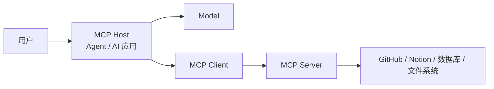

# MCP 是什么：从模型连接外部世界说起

我们都知道大模型本身并不能直接访问 GitHub、Notion、数据库，也不能凭空读取电脑里的文件。

想让 Agent 真正做事，就需要不断给它连接外部能力。

比如：

```text
读取本地文件
查询数据库
搜索 GitHub
访问公司内部系统
创建 Issue
读取 Notion 页面
……
```

这些能力当然每个公司都可以自己写。

问题是，当 AI 应用越来越多、外部系统也越来越多以后，双方如果都自己设计一套连接方式，很快就会变成大量重复的适配工作。

MCP 就是在这样的背景下出现的。

## 为什么会出现 MCP

假设现在有三个 Agent 应用：

```text
Coding Agent
知识库 Agent
桌面助手
```

它们都希望访问：GitHub、Notion、Google Drive......

在没有统一协议的情况下，每个应用都可能分别实现一套接入方式。

例如 Coding Agent 要知道 GitHub API 怎么调用，知识库 Agent 也要重新适配一次 GitHub；以后换一个新的 Agent 客户端，又可能重新做一遍。

而且这个协议可能是调用方定，也可能是被调用方定。

随着组合越来越多，连接关系会迅速复杂起来。

Anthropic 在 2024 年发布 MCP 时提到的核心问题正是这一点：模型能力越来越强，但 AI 应用仍然被隔离在各种数据源和业务系统之外，而新的数据源往往需要新的定制集成。

所以 MCP 想做的事情并不神秘：

> **给 AI 应用和外部系统之间定义一套大家都可以遵守的连接标准。**

一个外部系统如果已经提供 MCP Server，不同支持 MCP 的应用就可以按照同一套协议去连接它，而不必每次重新约定一套完全不同的通信方式。

我们可以先用一个生活中的例子理解“协议”。

假设一个外卖平台要接入三家餐厅：餐厅 A 要求电话下单，餐厅 B 要求发送固定格式的短信，餐厅 C 则要求填写自己的表单。

平台每接入一家餐厅，都要重新学习一套规则，这就是不同协议带来的适配成本。

如果大家约定统一的订单格式：餐厅、商品、数量、地址，那么平台只需要理解这一套格式，每家餐厅再把自己的内部系统适配到这套格式即可。

外部沟通方式统一了，但每家餐厅内部怎么实现仍然可以不同。

MCP 做的事情与此类似：让不同外部系统按照同一套规则向 Agent 暴露能力，从而减少重复适配。

---

## MCP 到底是什么

`MCP` 全称是：

**Model Context Protocol**

通常翻译为：

**模型上下文协议。**

官方目前将它定义为一个开放标准，用来连接 AI 应用与存放数据、工具和其他能力的外部系统。

可以先这样理解：

```text
Agent 已经会思考和调用工具

MCP 进一步解决：

这些工具和外部数据
应该怎样以统一方式接进 Agent？
```

例如 GitHub 提供了一个 MCP Server。

以后不同 MCP Host 就可以按照统一协议连接它，而不是每个 Host 都重新理解 GitHub 的内部实现。

---

## MCP 是怎么发展起来的

MCP 出现的时间其实并不像 Agent 这个概念那么早，但发展速度同样非常快。

### 2024：Anthropic 发布 MCP

2024 年 11 月 25 日，Anthropic 正式开源 Model Context Protocol。

最初的目标就是减少 AI 应用连接外部数据源时大量重复的定制开发，让不同应用和数据源能够围绕一套开放协议进行集成。

最开始 MCP 和 Claude 生态联系非常紧密，所以很多人第一次看到 MCP 时会误以为：

> MCP 是 Claude 自己的插件协议。

但后来的发展很快超出了这个范围。

### 2025：从 Claude 生态走向开放标准

到 2025 年，越来越多 AI 产品和开发工具开始支持 MCP。

Anthropic 在 2025 年 12 月披露，当时 MCP 已经被 ChatGPT、Cursor、Gemini、Microsoft Copilot、Visual Studio Code 等产品采用，公开活跃的 MCP Server 超过 10,000 个。

同年 12 月，Anthropic 将 MCP 捐赠给 Linux Foundation 旗下新成立的 **Agentic AI Foundation（AAIF）**。

从这个阶段开始，MCP 的定位已经明显不再是某一家公司的产品能力，而是在向一个更中立的 Agent 基础协议发展。

### 2026：MCP 继续演进

MCP 并没有在 2025 年以后停止变化。

截至 2026 年 9 月，当前正式规范版本是 `2026-07-28`。

这一版是 MCP 发布以来一次非常大的协议调整，包括 Stateless Core、更完善的授权设计、正式的 Extensions Framework，以及 Tasks 等扩展能力。

围绕 MCP 还开始出现：

```text
MCP Apps
Tasks
企业级授权
Extensions
Registry
……
```

2026 年 8 月公布的新路线图仍然在继续推进传输、Agent 通信、企业能力和协议治理。

这里暂时不用研究这些协议变化。

我们入门阶段只需要知道：

> **MCP 不是一份发布以后就不再变化的静态协议，它还处在快速发展过程中。**

不同历史版本在连接方式、生命周期和部分能力上会存在明显差异。

这些具体变化会放到后面的 MCP 原理中继续展开。

---

## MCP 是怎么工作的

理解 MCP，最重要的是先看清几个角色。



这里可以先记住三个名字：

**Host** 是用户真正使用的 AI 应用。

例如一个 Coding Agent（Codex、Trae）、IDE、桌面助手（Workbuddy），或者自己开发的 Agent 产品，都可能成为 MCP Host。

**Client** 是 Host 内部负责按照 MCP 与 Server 通信的部分。

**Server** 则负责把某一类外部能力按照 MCP 暴露出来。

所以准确的关系并不是：

```text
大模型
↓
直接连接数据库
```

而是：

```text
Host
↓
MCP Client
↓
MCP Server
↓
真实外部系统
```

Host 仍然负责模型、对话、Agent Loop、权限和整个应用逻辑。

MCP Server 只需要把自己负责的能力暴露出来。

这也是为什么同一个 Host 可以连接很多 MCP Server：

```text
Coding Agent
├─ GitHub MCP Server
├─ Notion MCP Server
└─ 内部业务 MCP Server
```

一个 MCP Server 也可以被不同 Host 使用。

---

MCP Server 又有本地和远程两种常见形态。

本地 Server 可以作为电脑上的一个进程运行，例如某个 Server 需要读取本地项目文件。

远程 Server 则运行在网络上的服务器中，例如 Notion、Sentry 等 SaaS 服务可以直接提供一个远程 MCP 地址。

对于我们使用者来说，两者最终的体验都很接近：

> **先让 Host 连接这个 Server，再使用 Server 暴露出来的能力。**

具体数据到底怎样传输、不同 Transport 有什么区别，则属于协议实现层的问题，入门阶段我们先不展开，如果感兴趣的话，大家可以看我们后续出的原理栏目的讲解。

---

## MCP Server 能提供什么

很多人第一次接触 MCP，会把它直接理解成：

> MCP 就是让 Agent 调用更多 Tool。

但这只说对了一部分。

MCP Server 最核心的三类 Server Primitive 是：

```text
Tools
Resources
Prompts
```

**Tools** 比较容易理解，它代表可以执行的动作。

例如：

```text
创建 GitHub Issue
查询天气
执行数据库查询
发送一条消息
```

如果 Agent 判断自己需要执行这个动作，就可以调用对应 Tool。

---

**Resources** 更偏向“可以读取的信息”。

例如：

```text
项目 README
数据库 Schema
某个配置文件
产品文档
一条业务记录
```

Resource 通常具有自己的 URI，Host 可以根据需要读取它，再把真正有用的信息放进 Context。官方也将 Resources 定位为 Server 向 Client 暴露上下文数据的一种标准方式。

---

**Prompts** 则可以提供可复用的提示模板。

例如一个 Server 可以提供：

```text
Review PR
分析错误日志
总结项目文档
```

这样的预定义 Prompt。

所以：

> **MCP 并不仅仅在标准化“函数怎么调用”，它还在标准化 AI 应用怎样获取外部能力和上下文。**

后续 MCP 还在通过 Extensions 扩展新的能力，但是我们在入门阶段先把 Tools、Resources、Prompts 这三个概念分清已经足够。

---

## 实际怎么使用 MCP

使用 MCP 通常有两种情况。

### 使用现成的 MCP Server

这是绝大多数我们普通用户最先接触 MCP 的方式。

例如某个服务已经提供：

```text
Notion MCP Server
GitHub MCP Server
Sentry MCP Server
……
```

只需要把它添加到一个支持 MCP 的 Host 中。

以 Claude Code 为例，当前官方文档可以直接添加远程 HTTP MCP Server。

例如添加 Notion：

```bash
claude mcp add --transport http notion https://mcp.notion.com/mcp
```

添加以后，可以通过：

```text
/mcp
```

查看连接情况，并在需要时完成授权。

接下来用户依然是在正常说话：

```text
帮我找到 Notion 里关于 ReadSignal 的产品文档，
然后总结当前 MVP。
```

真正执行时，Host 会根据当前 MCP Server 提供的能力，把可用 Tool 等信息交给模型。

模型判断需要访问 Notion 后，再通过 MCP 调用对应能力。

这样就不需要用户自己手动编写一次 HTTP 请求。

不同 Host 的配置方式可能不同，有的使用命令，有的使用 JSON，有的直接在 UI 里添加 Server。

但核心过程没有太大区别：

```text
找到 MCP Server
→ 添加到 Host
→ 完成必要授权
→ Host 获得 Server 提供的能力
→ 正常向 Agent 提出任务
```

这就是我们常说的：

> **“给 Agent 接了一个 MCP。”**

### 自己开发一个 MCP Server

如果现成 Server 无法满足需求，也可以自己开发。

例如公司内部有一套订单系统：

```text
GET /orders
POST /refund
GET /customers
```

原本这些只是普通内部 API。

开发者可以在外面增加一个 MCP Server，把其中适合 Agent 使用的能力重新暴露为：

```text
query_order
get_customer
create_refund_request
```

这样以后支持 MCP 的 Agent 应用就可以按照同一套协议发现和使用这些能力。

官方目前提供 TypeScript、Python、Go、C# 等主要 SDK；一个 Server 可以注册 Tools、Resources 和 Prompts，再通过相应 Transport 提供服务。

所以：

> **使用 MCP Server 是在使用别人已经标准化好的能力；开发 MCP Server，则是在把自己的能力标准化地开放出去。**

---

## MCP 和 Tool Calling 有什么关系

这是理解 MCP 时最容易混淆的问题之一。

前面的 Agent 运行原理和最小 Agent 中我们已经见过 Tool Calling。

模型可以返回类似这样的意图：

```text
我要调用：

search_docs({
  "query": "MCP"
})
```

Tool Calling 主要解决的是：

> **模型怎么表达“我要调用这个 Tool”。**

MCP 解决的则是：

> **这个 Tool 从哪里来，以及 Host 怎样用统一方式发现和调用它。**

两者可以直接组合在一起：

```text
模型通过 Tool Calling
决定调用 search_docs

        ↓

Host 通过 MCP
向对应 MCP Server 发起调用

        ↓

Server 执行真实操作
并返回结果

        ↓

Host 把结果交回模型
```

所以：

> **MCP 没有替代 Tool Calling，它们解决的是不同层的问题。**

官方在 SDK 的 Client 教程同样指出，MCP Server 暴露出的 Tool 名称、描述和输入 Schema，可以直接映射为支持 Tool Calling 的模型所需要的工具定义。

---

## MCP 和 API、插件、Skills 有什么区别

| 概念 | 主要解决什么 |
| --- | --- |
| **API** | 一个系统把自己的数据或功能开放给其他程序 |
| **MCP** | AI 应用如何用统一协议连接这些外部能力 |
| **插件** | 某个产品生态中安装和扩展功能的一种产品形态 |
| **Skills** | 给 Agent 提供可复用的任务知识、规则和做事方法 |

例如：

```text
GitHub 本来就有 API
```

MCP 并不会让这些 API 消失。

GitHub MCP Server 完全可能在内部继续调用 GitHub API，只是对 Agent 应用暴露出了一套统一的 MCP 接口。

所以：

> **MCP 更像是站在 AI 应用这一侧，对外部能力重新建立统一连接方式。**

Skills 的方向又不一样。

可以暂时先记：

```text
MCP
→ 怎么把外部能力接进来

Skill
→ Agent 遇到某类任务以后应该怎么做
```

下一篇番外我们会单独继续讲 Agent Skills。

---

## MCP 能解决什么，又不能解决什么

MCP 最擅长解决的是**集成标准化**。

例如同一个 GitHub MCP Server，可以被多个支持 MCP 的 Host 使用；自己开发的 Agent 以后也可以复用已有 MCP Server，而不必重新为每个外部系统设计一套完全不同的适配格式。

但 MCP 并不是 Agent 的完整运行框架。

接上 MCP 以后，它不会自动帮系统解决：

```text
模型该选哪个 Tool
Tool 应该按什么顺序执行
Agent 什么时候停止
Context 应该怎样管理
业务权限应该怎样设计
失败以后应该怎样恢复
```

这些仍然是 Agent Runtime、业务系统或者具体 Framework 需要处理的问题。

MCP 解决的是其中非常重要的一层——**连接问题**。

---

## 使用 MCP 时需要注意什么

MCP Server 能把真实系统能力交给 Agent，也意味着它可能获得真实权限。

一个文件系统 Server 可能能够读取文件，一个 GitHub Server 可能能够修改仓库，一个数据库 Server 甚至可能拥有写入权限。

我们不要完全详细 MCP ，权限越大，风险越大。

尤其是从网络上找到第三方 Server 时，需要确认来源、查看它需要什么权限，以及它到底会访问哪些数据。Claude Code 官方文档也明确提醒，从外部内容获取信息的 MCP Server 可能带来 Prompt Injection 等风险。

对于删除数据、支付、修改生产环境、发送正式消息等高风险 Tool，也仍然应该保留授权、确认或其他权限边界。

---

## 总结

到这里，我们已经把 MCP 最重要的入门认知已经可以串起来：

```text
为什么出现
→ 外部系统的连接方式太碎

MCP 是什么
→ AI 应用连接外部能力的开放标准

谁在参与
→ Host / Client / Server

Server 能提供什么
→ Tools / Resources / Prompts

怎么使用
→ 接入现成 Server，或者开发自己的 Server

和 Tool Calling 什么关系
→ Tool Calling 决定调用，MCP 标准化连接
```

如果只是使用 MCP，理解到这里已经可以开始实践。

如果还想继续了解：

> MCP 底层到底怎样通信？
> 不同 Transport 有什么区别？
> 协议消息到底长什么样？
> 为什么 2026 年又从 Stateful Core 改成 Stateless Core？

这些就不再属于我们当前入门阶段的问题了。

后面的原理栏目后续会继续往 MCP 协议和设计层深入。

下一篇番外则继续看另一个经常和 MCP 放在一起讨论、但解决完全不同问题的概念：

**[Agent Skills 是什么](./agent-skills.md)**。
