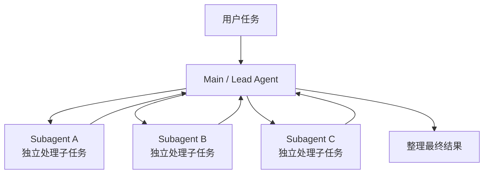

# Multi-Agent 是什么：从 Subagent 到 Agent Team

我们前面介绍的最小 Agent 中，一个 Agent 已经可以完成相当复杂的任务：

```text
理解目标
↓
调用 Tool
↓
读取结果
↓
继续判断
↓
反复执行
↓
完成任务
```

如果任务继续变复杂，我们是否可以考虑：

> 能不能不让一个 Agent 什么都做，而是把不同工作交给不同 Agent？

例如做一次技术调研：

```text
一个 Agent 查官方文档
一个 Agent 查开源项目
一个 Agent 查真实使用案例
最后再汇总结论
```

或者开发一个功能：

```text
一个 Agent 调研代码
一个 Agent 实现后端
一个 Agent 检查测试
```

这就是 Multi-Agent 开始出现的地方。

但 Multi-Agent 并不是：

> Agent 越多，系统就越强。

它真正解决的是：

> **当一个任务存在清晰的分工、独立 Context 或并行空间时，怎样把工作合理地交给多个 Agent。**

## 为什么会出现 Multi-Agent

单 Agent 最大的优点就是简单。

所有信息都集中在一个地方：

```text
用户
↓
Agent
├─ Tool A
├─ Tool B
├─ Tool C
└─ Tool D
```

Agent 自己规划、执行、检查，最后返回结果。

很多任务这样已经足够。

但当任务越来越大以后，单 Agent 会逐渐遇到一些实际问题。

例如一个研究任务需要搜索几十个网页。

如果所有搜索结果、网页正文和分析过程都进入同一个 Context：

```text
用户问题
+
搜索方向 A 的资料
+
搜索方向 B 的资料
+
搜索方向 C 的资料
+
几十次 Tool Result
+
中间分析
+
最终总结
```

Context 很快就会变得非常拥挤。

还有一些任务本身就天然可以同时进行：

```text
调查产品 A
调查产品 B
调查产品 C
```

如果一个 Agent 从 A 查到 B，再从 B 查到 C，只是在串行等待。

这时候，把三个方向分别交出去，就有可能同时推进。

Multi-Agent 因此经常用来解决几类问题：

- **分工**：不同 Agent 负责不同领域
- **Context 隔离**：不让所有过程信息都挤进一个 Context
- **并行执行**：多个相对独立的任务同时推进
- **能力隔离**：不同 Agent 使用不同 Prompt、Tool、权限甚至模型

很多时候，大家以为需要 Multi-Agent，实际想解决的可能只是 Context 管理、Tool 管理或者并行执行。如果一个 Agent 配合合适的 Tool 和 Prompt 已经能完成任务，就没有必要强行拆成多个 Agent。

所以：

> **Multi-Agent 是复杂度管理手段，不是 Agent 系统的必经阶段。**

---

## Multi-Agent 到底是什么

Multi-Agent 一般指：

> **多个能够相对独立完成推理和任务执行的 Agent，通过某种协调方式共同完成一个更大的目标。**

这里最关键的不是“有几个模型调用”。

例如：

```text
LLM 生成标题
↓
LLM 总结正文
↓
LLM 翻译结果
```

虽然调用了三次模型，但这不一定就值得叫 Multi-Agent。

真正的 Multi-Agent 一般会出现更明确的 Agent 边界。

比如不同 Agent 可能拥有自己的：

```text
Instructions
Context
Tools
Memory
Permissions
Model
Task
```

然后再通过：

```text
委派
返回结果
任务路由
控制权交接
共享任务
消息通信
```

等方式协作。

比较容易理解的一种结构就是：



主 Agent 不再亲自完成所有细节。

它开始承担另一种职责：

> **决定什么事情自己做，什么事情应该交出去。**

---

## 从单 Agent 到 Subagent

现在很多 Agent 产品里最常见的 Multi-Agent 形态，其实并不是复杂一群 Agent。

而是：

**Main Agent + Subagent。**

Subagent 可以理解成主 Agent 为某个局部任务找来的一个临时助手。

例如主 Agent 正在开发一个项目，需要确认：

> 这个项目的登录逻辑到底分布在哪些文件？

如果让主 Agent 自己搜索，可能产生大量：

```text
目录结果
搜索结果
代码片段
依赖关系
```

这些内容都会占据当前 Context。

另一种方式是：

```text
Main Agent
↓
创建 Explore Subagent
↓
“找出登录流程相关代码，并告诉我关键文件和调用关系”
↓
Subagent 自己搜索大量代码
↓
只返回最终结论
```

这时候，主 Agent 真正需要看到的可能只有：

```text
登录入口：AuthController

核心逻辑：AuthService

Token 生成：JwtProvider

用户查询：UserMapper
```

大量中间搜索过程都留在 Subagent 自己的 Context 中。

Claude Code 当前的 Subagent 就采用这种思路：Subagent 在独立 Context Window 中运行，可以拥有自己的 System Prompt、Tool 和权限，完成以后将结果返回调用它的主 Agent。高容量搜索、日志分析等容易污染主 Context 的任务，就是典型的使用场景。

因此 Subagent 一个非常重要的价值就是：

> **让一部分复杂工作拥有自己的 Context 边界，而不污染主 Agent Context。**

Subagent 也可以带有更专业的能力。

例如：

```text
Main Agent

├─ Explore Agent
│  └─ 只负责代码搜索和分析
│
├─ Test Agent
│  └─ 只负责测试与验证
│
└─ Security Agent
   └─ 只检查安全风险
```

每一个 Subagent 都只需要看到与自己任务相关的信息。

主 Agent 则继续保持整体目标。

这就形成了最基础的：

> **委派（Delegation）。**

---

## 多个 Agent 可以怎么协作

有了 Subagent 以后，进一步的问题就是：

> 多个 Agent 之间到底是什么关系？

目前并没有一种所有系统都必须遵守的统一 Multi-Agent 架构，但是有几种关系非常常见。

第一种是 **Manager / Supervisor**。

```text
Manager Agent
├─ Research Agent
├─ Analysis Agent
└─ Review Agent
```

Manager 始终掌握整个任务。

Specialist 只负责一个子问题，处理完以后把结果交回来。

OpenAI Agents SDK 把这种方式称为 **Agents as Tools**：一个 Specialist Agent 可以像 Tool 一样被 Manager 调用，而最终对用户负责的仍然是 Manager。

例如：

```text
用户：
分析这家公司是否值得投资。

Manager
├─ 调用 Financial Agent
├─ 调用 News Agent
└─ 调用 Risk Agent

Manager
↓
综合三个结果
↓
最终回答
```

这种方式适合：

> **任务可以拆，但最终仍然需要一个统一负责人。**

---

还有一种常见方式是 **Router**。

Router 不一定负责完成任务，它主要判断：

> 这件事情应该交给谁？

例如客服系统：

```text
用户请求
↓
Router

订单问题 → Order Agent

退款问题 → Refund Agent

技术问题 → Technical Agent
```

它就像一个智能分诊系统。

Router 可以自己判断，也可以由规则、模型或者其他逻辑完成。

还有一些任务适合让多个 Agent **并行探索**。

例如：

```text
调研“2026 年 Coding Agent 的发展趋势”

Agent A → 调研 Claude Code
Agent B → 调研 Codex
Agent C → 调研 Cursor
Agent D → 调研开源项目
```

多个方向之间相对独立，就可以同时推进。

Anthropic 的 Research 系统就是一个非常典型的现实案例：Lead Agent 先制定研究策略，再创建多个 Subagent，让它们同时探索不同方向，最后由 Lead Agent 汇总结果。这种方式通常被称为 **Orchestrator-Worker** 架构。

这说明 Multi-Agent 的关键并不在于：

> 建了多少个角色。

而在于：

> **这些角色之间有没有合理的任务边界。**

---

## Handoff：什么时候需要把控制权交出去

前面的 Manager 模式中，即使 Specialist Agent 参与了任务，控制权仍然在主 Agent 手里。

但有些场景并不适合这样。

例如客服系统：

```text
用户：
我的信用卡被重复扣款了。
```

最开始可能由一个 Triage Agent 判断问题类型。

确定这是账单问题以后，与其让：

```text
Triage Agent
↓
不断调用 Billing Agent
↓
再转述 Billing Agent 的回答
```

不如直接：

```text
Triage Agent
↓
Handoff
↓
Billing Agent
↓
继续直接处理后续对话
```

这就是 **Handoff**。

它的关键区别是：

> **任务的当前控制权发生了转移。**

OpenAI Agents SDK 当前把 Manager 和 Handoff 明确作为两种主要 Multi-Agent 编排方式：

| 方式 | 谁保持控制权 |
| --- | --- |
| Agents as Tools | Manager 一直保持控制权 |
| Handoff | 控制权转移给 Specialist |

可以简单理解成：

```text
Subagent / Agent as Tool
→ “你帮我做一下这件事，做完告诉我。”

Handoff
→ “接下来这件事由你接手，我不再管。”
```
---

## Agent Team 和 Subagent 有什么不同

随着 Multi-Agent 继续发展，最近又出现一个概念：

**Agent Team。**

它和简单的 Main Agent + Subagents 并不完全一样。

以 Claude Code 当前的 Agent Teams 为例：

```text
Team Lead
├─ Frontend Teammate
├─ Backend Teammate
└─ Test Teammate
```

每一个 Teammate 都运行在自己的独立 Session 和 Context 中。

更关键的是，它们并不是只能：

```text
Teammate
↓
向 Lead 汇报
```

而是可以：

```text
Frontend ↔ Backend
Backend ↔ Test
Frontend ↔ Test
```

彼此直接通信。

团队还拥有共享 Task List，可以查看任务、认领工作，并根据其他成员进度进行协作。用户甚至可以直接和某个 Teammate 对话。

因此可以这样区分：

| | Subagent | Agent Team |
| --- | --- | --- |
| Context | 有自己的 Context | 每个成员都是独立 Session / Context |
| 通信 | 主要向 Main Agent 返回结果 | Teammate 可以直接互相通信 |
| 协调 | Main Agent 负责 | Lead + 共享任务 + 成员协作 |
| 适合 | 边界明确的局部任务 | 需要成员持续协作的并行任务 |

例如查一个函数定义：

```text
交给 Subagent
↓
查完返回结果
```

就够了。

但开发一个跨越：

```text
Frontend
Backend
Tests
```

的大功能，如果三部分能够相对独立推进，又需要中间互相确认接口变化，就可能更适合 Team 式协作。

不过这里一定要注意：

> **Agent Team 目前不是 Multi-Agent 的统一标准架构。**

例如 Claude Code 的 Agent Teams 当前仍被官方标记为 **Experimental**，并且存在 Session 恢复、任务协调和关闭行为等已知限制。

所以：

> Agent Team 是当前正在出现的一种更强调 Agent 间直接协作的 Multi-Agent 形态。

而不是：

> 所有 Multi-Agent 最后都会发展成 Agent Team。

同样，使用 Agent Team 效果就不一定更好。

---

## 实际的 Multi-Agent 系统长什么样

前面的概念在真实 Agent 产品里已经有不少对应实现。

Anthropic Research 主要展示的是：

```text
Lead Agent
↓
拆解研究问题
↓
创建多个 Research Subagents
↓
并行搜索
↓
Subagents 返回结果
↓
Lead 继续研究或汇总
```

其中 Subagent 不只是执行一次搜索，它本身也是能够反复使用 Tool、判断结果并继续搜索的 Agent。

OpenAI Agents SDK 更适合说明：

```text
Manager
vs
Handoff
```

如果 Specialist 只是帮助主 Agent 完成一个局部任务，可以把 Agent 暴露成 Tool。

如果希望 Specialist 真正接管当前对话，则使用 Handoff。

Claude Code 则同时提供了：

```text
Subagent
Agent Team
```

两种不同层次的并行方式。

如果只是希望把一个会产生大量日志、搜索结果或文件内容的局部任务交出去，用 Subagent；如果多个独立 Session 之间还需要持续通信和协作，再考虑 Agent Team。

所以：

> **Multi-Agent 并不存在唯一正确的形态。**

核心问题始终是：

```text
任务由谁负责？
↓
谁能创建其他 Agent？
↓
Agent 之间能不能直接通信？
↓
谁拥有当前控制权？
↓
最终结果由谁收敛？
```

---

## Multi-Agent 为什么不一定比单 Agent 更好

看到这里，我们可能就会认为：

```text
1 个 Agent
<
3 个 Agent
<
10 个 Agent
```

实际系统并不是这样的。

每增加一个 Agent，就会增加新的成本。

首先是 **Token 和模型调用成本**。

每个 Agent 都可能拥有自己的：

```text
System Prompt
Context
Tool Description
推理过程
Tool Result
```

所以多个 Agent 同时运行，消耗自然会明显增加。多 Agent 系统更适合高价值、复杂且可以充分并行的任务。

第二个问题是 **协调成本**。

假设三个 Agent 同时修改同一个文件：

```text
Agent A 修改第 30 行

Agent B 同时重构整个类

Agent C 又修改第 30～80 行
```

最后可能不是效率提升，而是互相制造冲突。

Agent Team 更适合可以独立工作的任务；如果任务高度串行、需要频繁编辑同一个文件或成员之间有大量前后依赖，单 Session 或 Subagent 往往更加合适。

第三个问题是 **信息可能丢失**。

Subagent 做了大量工作，最后返回：

```text
找到三个问题，已经整理完毕。
```

但如果 Main Agent 后面真正需要的是 Subagent 搜索过程中发现的一个细节，这个细节可能已经在总结时丢掉。

所以 Context 隔离是一种优势，也是一种代价：

> 隔离掉无关信息的同时，也可能隔离掉后续真正需要的信息。

最后还有一个很现实的问题：

> **谁负责最后做决定？**

如果多个 Agent 得到不同结论：

```text
Agent A：建议方案 A

Agent B：建议方案 B

Agent C：认为两个都不应该用
```

系统还需要有收敛机制。

否则只不过把一个 Agent 的不确定性，变成了多个 Agent 的争论。

因此：

> **Multi-Agent 解决了一部分复杂度，同时也会创造新的复杂度。**

---

## 什么任务适合 Multi-Agent

我推荐的判断方式就是看：

> **任务拆开以后，各部分能不能相对独立地推进？**

比较适合 Multi-Agent 的任务通常具有几个明显特征。

例如多方向研究：

```text
分别调查市场
技术
竞争对手
法规
```

不同方向之间高度独立，可以并行搜索。

又比如大型代码库中的独立模块开发：

```text
Frontend
Backend
Tests
Docs
```

如果模块边界清晰，也适合不同 Agent 分别负责。

再比如 Debug：

```text
Agent A：
假设是数据库问题

Agent B：
假设是缓存问题

Agent C：
假设是并发问题
```

可以让多个 Agent 同时验证不同假设。

相反，如果任务是：

```text
先完成 A
才能知道 B 怎么做
完成 B
才能决定 C
```

每一步都高度依赖上一步结果。

拆成三个 Agent 并不会带来真正的并行收益。

甚至只是：

```text
读取一个文件
修改一个函数
运行一次测试
```

这种任务，一个 Agent 通常已经足够。

---

## 多个 Agent 一定需要 A2A 吗

不需要。

既然 Multi-Agent 是 Agent 之间协作，那是不是一定要使用 A2A？

其实很多 Multi-Agent 系统都运行在同一个应用内部。

例如：

```text
Main Agent
↓
Subagent
```

Main Agent 和 Subagent 完全可以通过：

```text
函数调用
Agent as Tool
共享 Runtime
内部消息队列
Framework 自己的调度机制
```

完成通信。

没有必要为了内部调用再增加一个跨系统协议。

OpenAI Agents SDK 的 Agents as Tools、Claude Code 的 Subagents 都属于这种情况：Framework 或 Runtime 本身就知道如何创建、调用和管理这些 Agent。

但如果情况开始变成：

```text
公司 A 的采购 Agent
          ↓
公司 B 的供应商 Agent
```

或者：

```text
LangGraph Agent
↓
另一个团队开发的独立 Agent 服务
```

双方可能：

- 不在同一个进程
- 不使用同一种 Framework
- 不由同一个团队开发
- 不知道对方内部有哪些 Tool
- 甚至不知道对方能完成什么任务

这时候问题就不再只是：

> 一个系统内部怎么编排几个 Agent？

而变成：

> **两个独立 Agent 怎样发现彼此、描述能力、委托任务并交换结果？**

这正是下一篇 **A2A** 要解决的问题。

---

## 总结

到这里，我们可以先把 Multi-Agent 的几个主要概念放在一起：

```text
单 Agent
→ 一个 Agent 自己完成任务

Subagent
→ 把一个局部任务交给独立 Agent，完成后返回结果

Manager / Agents as Tools
→ 主 Agent 一直保持控制权

Handoff
→ 把当前控制权交给 Specialist

Agent Team
→ 多个相对独立 Agent 进一步直接通信和协作
```

它们不是一条必须按顺序升级的路线。

更不是：

```text
Subagent
↓
Handoff
↓
Agent Team
```

越来越“高级”。

它们只是不同的协作方式。

真正应该判断的是：

> **当前任务需要什么样的分工和控制关系。**
