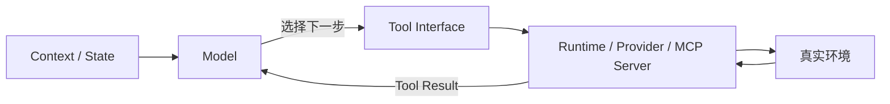

# Tool Calling 是什么：从 Function Calling 到 Agent 工具系统

如果已经按照前面的入门内容学下来，`Tool Calling` 应该不是一个陌生的词。

在《Agent 是怎么运转的》中，我们已经见过：

> 模型根据当前 Context 判断下一步要做什么，如果需要外部能力，就产生 Tool Call，再由外部环境完成真正的操作。

到了《开发第一个 AI Agent 前需要知道什么》，我们又进一步看到了结构化的工具调用请求，以及 Tool Result 怎样重新进入下一轮 Context。

后面的两个最小 Agent，也已经真正开始写代码：

```typescript
{
  type: "function",
  function: {
    // ...
  }
}
```

你有没有发现我们这里用了 `function`：

> 前面一直叫 Tool Calling，为什么代码里又出现了 `function`？

> Function Calling 和 Tool Calling 到底是不是一个东西？

> Tool 一定是自己写的函数吗？

> Web Search、Code Execution、MCP 里的 Tool，又是谁真正执行的？

> 模型没有看过函数实现，它为什么知道该选哪个 Tool？

---

## 前面的 Agent 其实已经一直在使用 Tool Calling

前面的最小 Agent 中，我们给模型准备了：

```text
get_weather
search_attractions
get_attraction_detail
```

Coding Agent 中又准备了：

```text
read_file
write_file
run_command
```

对于模型来说，这些都是它当前可以使用的 **Tool**。

用户提出任务以后，模型可以：

```text
直接回答
```

也可以判断：

```text
当前信息不够
我需要使用某个 Tool
```

然后产生对应的调用请求。

例如：

```json
{
  "name": "get_weather",
  "arguments": {
    "city": "Tokyo"
  }
}
```

外部系统完成真正的查询，再把结果交回来。

这一套过程，就是我们前面一直说的：

**Tool Calling。**

---

## Tool、Tool Call 和 Tool Result 到底分别是什么

先假设有一个天气 Tool：

```text
get_weather
```

### Tool

**Tool 是模型当前可以使用的一项能力。**

它通常会有自己的描述，例如：

```json
{
  "name": "get_weather",
  "description": "查询指定城市当前天气",
  "parameters": {
    "city": {
      "type": "string",
      "description": "需要查询天气的城市"
    }
  }
}
```

然后模型就知道了：

> 这里有一项什么能力，以及应该怎样使用。

所以 `Tool` 并不是模型刚刚产生的某个结果。

它是系统提前暴露给模型的**可用能力定义**。

---

### Tool Call

如果模型看到：

> 杭州今天需要带伞吗？

它判断自己不能只靠已有知识回答，因为天气是实时变化的。

所以生成了：

```json
{
  "name": "get_weather",
  "arguments": {
    "city": "Tokyo"
  }
}
```

这就是：

**Tool Call。**

它表达的是：

> **模型希望使用哪个 Tool，以及希望传入什么参数。**

Tool Call 本身还不是天气结果。

它本质上还是一段文本，然后被我们的程序代码识别为了一次**调用请求**。

---

### Tool Result

接下来，真正的天气系统可能返回：

```json
{
  "city": "Tokyo",
  "weather": "Rain",
  "temperature": 24
}
```

这才是：

**Tool Result。**

它代表：

> **Tool 真正执行以后产生的结果。**

这个结果之后可以重新进入模型能够看到的 Context。

模型于是知道：

```text
Tokyo
Rain
24℃
```

然后继续回答：

> 今天有雨，建议带伞。

| 概念          | 表示什么        |
| ----------- | ----------- |
| Tool        | 有什么能力可以使用   |
| Tool Call   | 模型希望怎样使用它   |
| Tool Result | 真正执行以后得到了什么 |

---

## Function Calling 和 Tool Calling 是什么关系

其实并不复杂。

因为不同厂商的叫法并不完全统一，才导致看起来很乱。

OpenAI 会把开发者自己定义的函数能力称为 **Function Calling / Function Tools**，同时又把它们放在整个 `tools` 体系下。当前 Responses API 将 Tool 分为包括：

```text
Built-in Tools
MCP Tools
Function Calls / Custom Tools
```

等不同类型。

Anthropic 的官方文档也直接说明了：

> Tool use，也称为 function calling。

Google Gemini 则仍然大量使用 **Function Calling** 这个名称，专门表示模型选择开发者声明的函数并生成调用参数。

为了方便理解，我们统一采用一个口径：

> **Tool Calling 是更通用的说法。**

而 Function Calling，可以理解成其中非常常见的一种形式：

> **把开发者自己的函数按照结构化 Schema 暴露给模型，让模型决定什么时候使用，以及传入什么参数。**

例如：

```typescript
function getWeather(city: string) {
  // ...
}
```

暴露给模型以后，就成为一个 Function Tool：

```json
{
  "type": "function",
  "name": "get_weather",
  "description": "查询城市天气"
}
```
---

## Tool 不一定只是一个 Function

早期学习 Tool Calling 时，我们经常自己写：

```python
def get_weather(city):
    ...
```

或者：

```typescript
function readFile(path: string) {
  ...
}
```

实际上今天的 Tool 已经比这个范围大得多。

以 OpenAI 当前 Tools 体系为例，除了开发者定义的 Function Call，还存在 Web Search、File Search、MCP 等其他 Tool 类型。

Gemini 同样区分：

```text
Built-in Tools
+
Custom Tools / Function Calling
```

内置工具包括 Google Search、Maps、URL Context、File Search、Code Execution 等。

Anthropic 当前也同时存在：

```text
用户自定义 Tools
Anthropic Schema Client Tools
Server Tools
```

例如：

```text
Bash
Text Editor
Memory
Web Search
Web Fetch
Code Execution
```

大概可以这样划分一下：

```text
Tools
│
├─ 自定义 Function Tools
│   ├─ get_weather
│   ├─ query_database
│   └─ create_order
│
├─ Provider Tools
│   ├─ Web Search
│   ├─ File Search
│   └─ Code Execution
│
├─ MCP Tools
│   └─ 由 MCP Server 暴露
│
└─ Framework / Runtime Tools
    ├─ Subagent
    ├─ Browser
    └─ 其他运行时能力
```
---

## Tool 到底由谁执行

前面的最小 Agent 中一直强调：

> **模型不会自己执行函数，真正的操作由模型之外的执行环境完成。**

至于这个“执行环境”到底是谁，要看具体 Tool 类型。

---

对于我们自己定义的函数：

```text
get_weather
query_database
send_email
```

通常是：

```text
模型
↓
产生 Function / Tool Call
↓
我们的 Agent Runtime
↓
执行自己的代码
```
---

但如果使用的是 Provider 提供的内置 Tool，情况就不一样了。

例如 Gemini 的：

```text
Google Search
Code Execution
File Search
```

这些 Built-in Tool 可以直接由 Google 的服务器执行。

Anthropic 的：

```text
web_search
web_fetch
code_execution
```

也是 Server Tool，由 Anthropic 的基础设施完成执行。

所以这里不需要自己的程序真的实现：

---

如果是 MCP Tool：

```text
Agent Runtime
↓
MCP Client
↓
MCP Server
↓
真实外部系统
```

真正的业务能力最终由 MCP Server 一侧连接的系统完成。

```text
模型
→ 决定 / 请求使用 Tool

Tool Runtime
→ 负责把这个请求变成真正的执行

执行方
→ 可能是你的应用
→ 可能是模型 Provider
→ 可能是 MCP Server
→ 也可能是其他 Runtime
```
---

## Tool Calling 和 Structured Output 有什么区别

因为两者经常都会出现：

```text
JSON
Schema
结构化参数
```

例如 Tool Call：

```json
{
  "city": "Tokyo"
}
```

Structured Output 也可能要求模型输出：

```json
{
  "city": "Tokyo"
}
```

看起来非常像。

但它们解决的是完全不同的问题。

---

假设用户问：

> 东京今天多少度？

模型需要先查询实时天气。

这时候：

```text
get_weather({
  "city": "Tokyo"
})
```

属于 **Tool Calling**。

因为这段结构化数据的目的不是作为最终答案。

它是在告诉系统：

> **请先帮我执行一个动作。**

工具执行之后，模型还要继续处理结果。

---

再看另一个任务：

> 从下面的简历中提取姓名、邮箱和技能列表。

系统要求最终输出：

```json
{
  "name": "Alice",
  "email": "alice@example.com",
  "skills": [
    "Java",
    "Spring Boot"
  ]
}
```

这里没有任何外部动作需要执行。

只是要求：

> **模型最终回答必须满足某种结构。**

这就是 **Structured Output**。

|                   | 主要目的         |
| ----------------- | ------------ |
| Function Calling  | 在对话过程中执行一个动作 |
| Structured Output | 让最终输出满足指定结构  |

---

## 模型怎么知道该调用哪个 Tool

假设我们给 Agent 两个 Tool：

```text
search_docs
search_web
```

模型为什么知道：

> 查项目内部文档应该用 `search_docs`？

它并没有直接阅读我们程序代码：

```python
def search_docs():
    # 后面可能几百行实现
```

模型真正看到的是类似：

```json
{
  "name": "search_docs",
  "description": "搜索当前项目内部技术文档",
  "parameters": {
    "query": {
      "type": "string",
      "description": "需要检索的问题"
    }
  }
}
```

所以 Tool Definition 本身就是 Agent Context 的一部分。

模型通常会综合：

```text
用户当前请求

Tool Name

Tool Description

Parameter Schema

Instructions

当前 Context
```

然后判断：

> 现在应该调用什么。

所以：

> Tool 应该有清晰的名称和详细、准确的 Description，参数本身也应该有良好的名称和说明。

例如下面两个 Tool：

```text
search
query
```

模型很难判断区别。

而：

```text
search_project_docs
→ 搜索当前项目已经索引的内部技术文档

search_public_web
→ 搜索公开互联网中的最新网页资料
```

边界就清晰很多。

---

参数也是一样。

如果 Schema 是：

```json
{
  "q": {
    "type": "string"
  },
  "x": {
    "type": "string"
  }
}
```

模型只能猜。

如果改成：

```json
{
  "query": {
    "type": "string",
    "description": "需要搜索的完整自然语言问题"
  },
  "repository": {
    "type": "string",
    "description": "限制搜索的 GitHub 仓库，例如 openai/openai-python"
  }
}
```

模型就拥有了更明确的使用信息。

所以 Tool Calling 的可靠性并不只取决于：

> 模型够不够聪明。

Tool 本身的设计，也会直接影响模型怎样使用它。

---

## 为什么 Tool Calling 有时会出错

即使模型已经支持 Tool Calling，也不意味着每一次 Tool Call 都会正确。

问题可能出现在完全不同的阶段。

最常见的一类是：

**选错 Tool。**

例如同时存在：

```text
search
search_docs
search_web
find
query
```

它们的能力高度重叠。

模型就很难判断应该用哪一个。

这也是为什么前面的 FAQ 已经提到：

> MCP 接得越多不等于 Agent 越强，如果很多 Tool 的边界非常接近，反而会增加模型的选择难度。

---

第二类是：

**参数错误。**

例如 Tool 需要：

```json
{
  "user_id": 123
}
```

模型却生成：

```json
{
  "username": "Alice"
}
```

或者参数虽然格式正确，但语义不正确。

因此 Tool Runtime 通常还需要真正做：

```text
Schema Validation
业务校验
权限检查
```

不能因为参数是模型生成的，就默认可信。

---

第三类是：

**Tool 本身执行失败。**

例如：

```text
网络超时
API 429
数据库连接失败
文件不存在
没有权限
业务条件不满足
```

这不是模型“选错 Tool”。

而是现实世界的动作本身失败了。

这时候应该把真实错误返回给 Agent，让它决定：

```text
重新尝试

调整参数

换一个 Tool

改变方案

或者停止
```

而不是简单无限重试。

---

还有一类问题会出现在多个 Tool 组合以后。

例如：

```text
search_web
↓
open_page
↓
extract_data
↓
query_database
↓
send_email
```

单独一次 Tool Calling 都没有问题。

但 Agent 可能：

```text
调用顺序错误

反复调用同一个 Tool

已经完成还继续调用

拿到 Tool Result 却没有正确使用

调用了不应该使用的高风险 Tool
```

这时候问题已经不再是单独的 Function Calling。

而是整个：

```text
Agent Loop
Context
Tool Design
State
Permissions
Stopping
```

共同决定的。

---

## Tool Calling 在 Agent 系统里处于什么位置

到这里，我们就可以重新理解 Tool Calling 在整个 Agent 系统中的位置了。

大模型擅长的是：

```text
理解
推理
生成
判断
```

但如果没有 Tool，它通常只能停留在信息空间里。

例如它可以告诉你：

> 应该去查数据库。

但没有数据库 Tool 时，它并不能真的得到：

```text
当前订单 #1024 的状态
```

Tool 的作用，就是把模型的决策和真实环境连接起来。



Tool Calling 位于一个非常关键的边界：

```text
模型世界
    ↓
Tool Calling
    ↓
软件和真实环境
```

模型通过它表达：

> **我接下来希望做什么。**

Runtime 则负责：

> **这个动作能不能做，以及应该怎样真正执行。**

---

这也解释了为什么：

> **有 Tool Calling，不代表系统就一定是 Agent。**

一个普通应用完全可以：

```text
用户请求
↓
模型调用一次天气 Tool
↓
返回天气
↓
结束
```

它同样用了 Tool Calling。

真正的 Agent 更重要的是：

```text
根据目标判断下一步
↓
调用 Tool
↓
观察 Tool Result
↓
更新 Context / State
↓
重新判断
↓
继续行动
↓
直到完成或停止
```

也就是说：

> Tool Calling 提供的是**行动能力**。

而 Agent Loop 提供的是：

> **根据行动结果继续推进任务的能力。**

这也是前面的《Agent 是怎么运转的》一直在强调的区别。

---

## 总结

到这里，可以把 Tool Calling 的几个核心概念收成一张图：

```text
Tool
→ 系统提供了什么能力

Tool Call
→ 模型请求怎样使用这项能力

Tool Result
→ 真实执行以后得到什么

Function Calling
→ 自定义函数型 Tool 的常见调用方式

Built-in Tool
→ Provider 自己提供和执行的能力

MCP Tool
→ 通过 MCP Server 接入的能力
```

后续我们统一使用：

> **Tool Calling**

作为主要术语。

`Function Calling`、`Tool Use` 等名称仍然会保留，因为在不同模型 API 和 Framework 文档中都会遇到，但不需要把它们理解成三个不同的概念。
