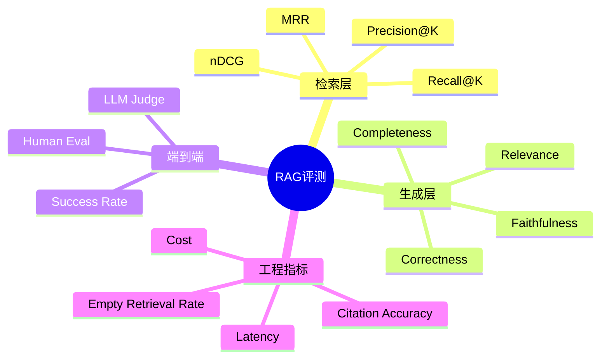

# 面试答题模板

这页不是内部编辑规范，而是给读者练习回答时使用的通用模板。遇到系统设计、RAG、Agent 或工程化问题时，都可以按这个结构组织答案。

## 推荐结构

1. 先定义问题
2. 再拆核心环节
3. 说明你的方案与取舍
4. 补充指标、风险和优化方式
5. 最后给出总结

## 一种通用答法

当面试官问一个技术问题时，可以优先按下面的节奏来回答：

- 先说明这个问题本质上在考什么
- 再把系统拆成几个关键模块
- 结合项目经验说明你会怎么设计
- 补充评估指标、常见风险和优化方向
- 最后用一句话收束，给出你的判断

## 示例

## 1. 做 RAG 项目时，你通常怎么评测效果？

我一般不会只看最终回答像不像对，而是把评测拆成检索、生成和端到端三层。

在检索层，重点看系统能不能把相关内容找出来，常见指标包括 `Recall@K`、`Precision@K`、`MRR` 和 `nDCG`。在生成层，重点看答案是否正确、是否忠于检索证据，以及有没有幻觉。到了端到端层面，还要看任务成功率、人工评测结果，以及线上延迟、成本、空召回率这类工程指标。

如果是实际项目，我还会补充一套评测集和线上反馈闭环。这样才能判断问题到底出在召回、排序、上下文构造，还是出在最终生成。

