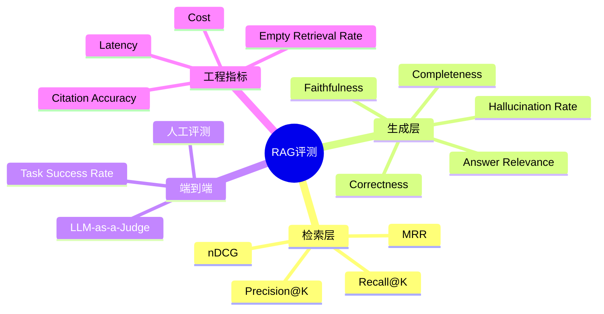
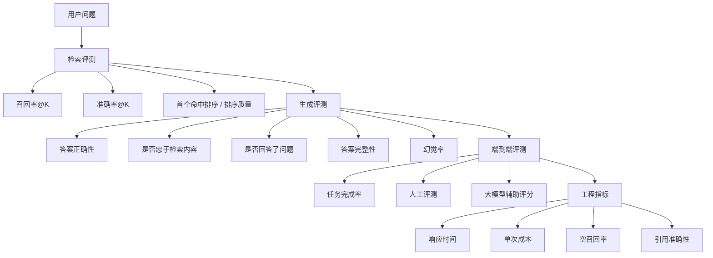
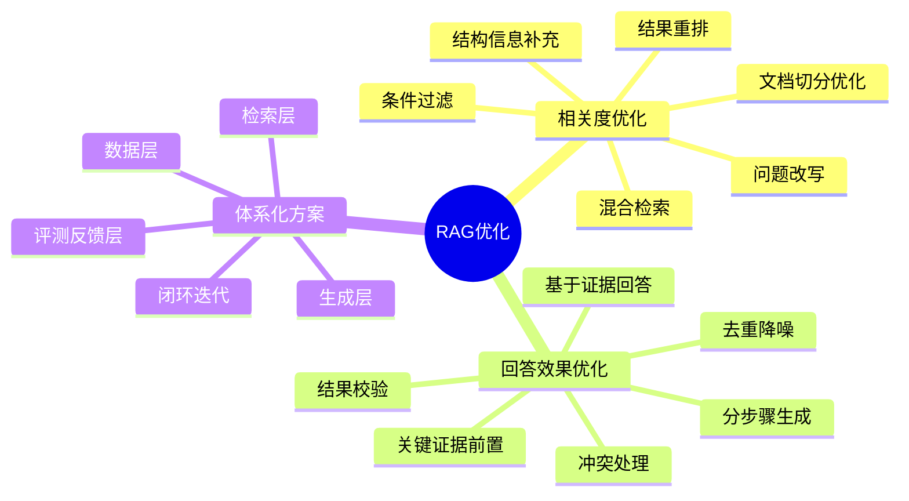
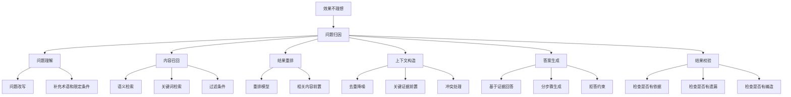

# RAG 性能优化

这一页收录和评测、优化相关的问题。适合放效果评估、延迟优化、召回质量优化、幻觉控制和成本控制。

## 1. 做 RAG 项目的时候，是怎么评测效果的？有哪些评测维度，具体用到了哪些指标？

做 RAG 项目时，我一般会从 `检索`、`生成`、`端到端` 三层来评测效果。

第一层是 `检索效果`，核心看“该召回的内容有没有召回上来，排序是否合理”。
常用指标有：

- `Recall@K`：看相关文档有没有出现在前 K 个结果里
- `Precision@K`：看前 K 个结果里相关文档占比
- `MRR`：看第一个正确结果排得靠不靠前
- `nDCG`：如果相关性有强弱分级，可以用它评估排序质量

第二层是 `生成效果`，核心看“答案对不对，是否基于检索内容回答，有没有幻觉”。
常看这些维度：

- `Correctness`：答案是否正确
- `Faithfulness / Groundedness`：回答是否忠于检索上下文
- `Answer Relevance`：是否真正回答了用户问题
- `Completeness`：答案是否完整
- `Hallucination Rate`：有没有编造内容

第三层是 `端到端效果`，也就是从用户视角看系统是不是可用。
常用指标有：

- `Task Success Rate`：用户问题是否被真正解决
- `人工评测分数`：比如正确性、完整性、可读性打分
- `LLM-as-a-Judge`：用大模型辅助评估答案质量

另外在线上还会关注一些 `工程指标`：

- `Latency`：响应时间，比如 P95
- `Cost`：单次请求成本
- `Empty Retrieval Rate`：空召回率
- `Citation Accuracy`：引用是否准确支撑答案

如果让我总结，RAG 评测本质上就是看三件事：
`能不能找到对的内容，能不能基于内容答对，能不能在真实场景里稳定可用。`

## 2. 如果对 RAG 的相关度和回答效果做优化，有什么思路？有没有更体系化的优化方案？

如果让我优化 `RAG` 的相关度和回答效果，我不会只去调提示词，而是会按整条链路分层优化。
因为 `RAG` 最终效果不好，问题不一定出在生成阶段，也可能出在前面的检索、排序或者上下文构造。

我通常会把整个流程拆成六个环节：
`问题理解、内容召回、结果重排、上下文构造、答案生成、结果校验。`

第一，优化相关度。

在相关度方面，我会重点做四件事。

第一步是优化问题理解。
很多用户提问比较口语化、模糊，或者和知识库里的表达方式不一致，所以我会先把问题改写成更适合检索的形式，必要时补充同义词、业务术语或者关键限定条件，提升问题和知识库内容之间的匹配度。

第二步是优化召回方式。
在召回阶段，我不会只依赖单一检索方式，而是会把 `语义检索` 和 `关键词检索` 结合起来。
这样既能覆盖语义相近的内容，也能兼顾产品名、接口名、报错信息这类需要精确匹配的场景，从而提升召回的覆盖率和稳定性。

第三步是优化知识切分和过滤条件。
除了检索方式本身，我还会优化文档切分策略、结构信息和过滤条件。
比如控制切分粒度、保留标题和章节信息、增加业务线或时间等字段，尽量减少无关内容进入候选结果，提升检索结果的纯度。

第四步是优化结果排序。
在召回之后，我还会增加结果重排，把真正最相关的内容稳定排到前面。
因为很多时候并不是“没找到”，而是“找到了但排得不够靠前”，最终导致模型没有用到最关键的证据。

第二，优化回答效果。

在回答效果方面，我会重点优化上下文质量，而不是一味增加上下文长度。
因为给模型的内容越多，不一定效果越好，反而可能把噪声、重复信息和冲突信息一起带进去，影响最终回答质量。

所以我通常会做几件事：

- `去重和降噪`，减少重复内容和无关信息
- `关键证据前置`，让模型优先看到最重要的依据
- `冲突处理`，避免模型混用相互矛盾的信息
- `回答约束`，通过提示明确要求模型必须基于上下文作答，证据不足时要明确说明，而不是随意补充

对于复杂问题，我还会采用 `分步骤生成`。
比如先抽取关键事实，再做归纳总结，最后生成答案。
在输出之后，再加一层结果校验，检查答案是否有依据、是否有遗漏、是否存在编造内容，从而降低幻觉和漏答的风险。

第三，更体系化的优化方式。

如果从更体系化的角度来做，我会从四个层面建立优化闭环。

第一层是 `数据层`。
它解决的是知识本身是否干净、完整、可检索的问题，包括文档清洗、去重、合理切分、补充结构信息和更新机制。

第二层是 `检索层`。
它解决的是能不能找到对的内容，包括问题改写、混合召回、过滤条件、结果重排等。

第三层是 `生成层`。
它解决的是拿到证据后能不能答好，包括上下文组织、回答约束、分步骤生成、拒答机制和结果校验。

第四层是 `评测反馈层`。
它解决的是怎么判断优化是否真的有效，包括评测集建设、问题分类、案例归因、线上反馈回流和持续迭代。

最后总结。

我的思路不是只针对某一个点去优化，而是先把问题拆到链路各个环节，再做针对性改进。
先通过案例归因判断问题到底出在 `召回、排序、上下文还是生成`，然后再分层优化，并结合评测集和线上反馈持续迭代。

这样做的好处是：
不仅能提升检索相关度，也能更稳定地提升最终回答质量，而且优化过程会更清晰、更可落地。

