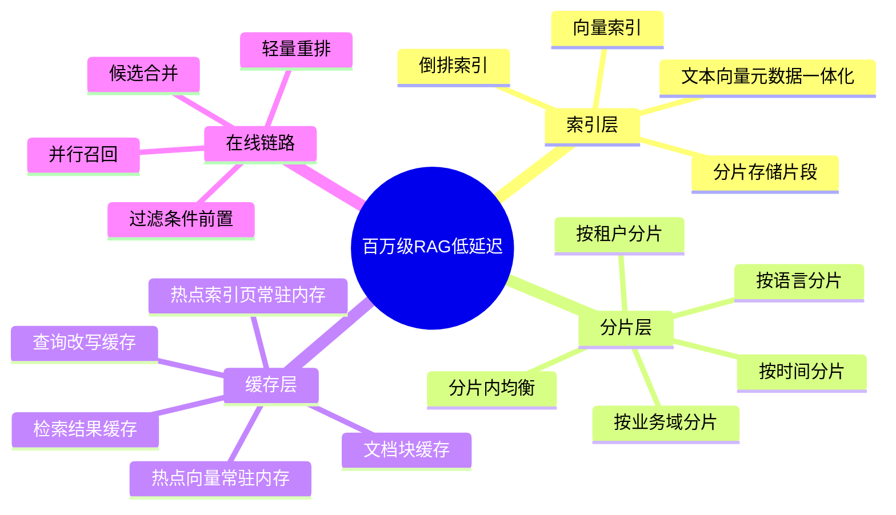
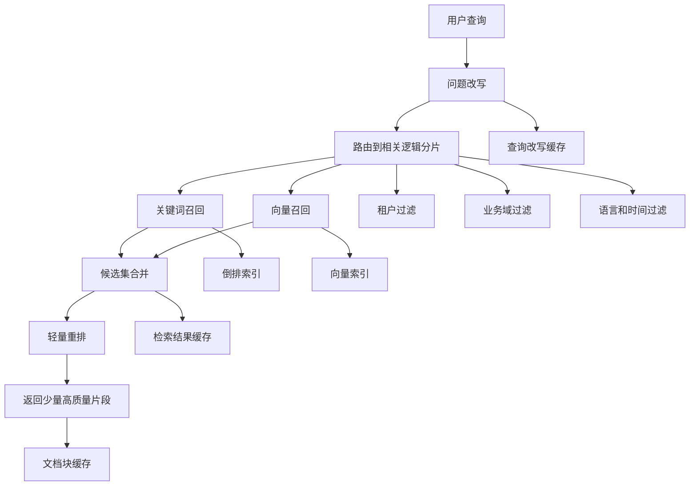

# RAG 实战设计

这一页收录系统设计和方案设计类问题。适合放数据入库、chunk 切分、索引构建、召回链路设计等题。

## 1. 百万级文档 RAG，检索延迟要求小于 200ms，如何设计索引、分片、缓存架构？

如果是百万级文档 `RAG`，检索延迟要求小于 `200ms`，我一般会采用 `混合检索 + 分层路由 + 多级缓存` 的架构。

在索引层，我会同时建立 `关键词倒排索引` 和 `向量索引`。文档不会按整篇建索引，而是切成片段，每个片段同时保存文本、向量和元数据，方便做语义召回、精确匹配和条件过滤。

在分片层，我不会只做简单哈希分片，而是优先按 `租户、业务域、语言、时间` 做逻辑分片，先把查询路由到少量相关分片，再在分片内部做均衡拆分。这样可以避免每次查询都广播到全量节点。

在缓存层，我通常会做 `查询改写缓存、检索结果缓存、文档块缓存`，并尽量让热点索引页和热点向量常驻内存，降低尾延迟。

在线查询链路上，我会采用并行召回，让关键词召回和向量召回同时执行，然后做候选合并和轻量重排，只保留少量高质量结果。同时把租户、权限、业务域这类过滤条件尽量前置，减少无效扫描。

整体上，这套方案的核心思想就是：
先通过路由和分片缩小搜索范围，再通过混合检索提升召回效果，最后用缓存和轻量重排把延迟稳定压到 `200ms` 以内。

