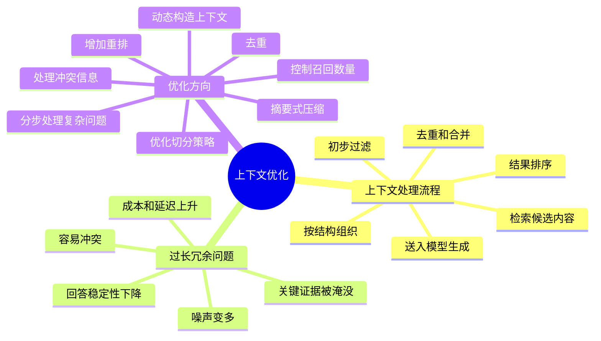
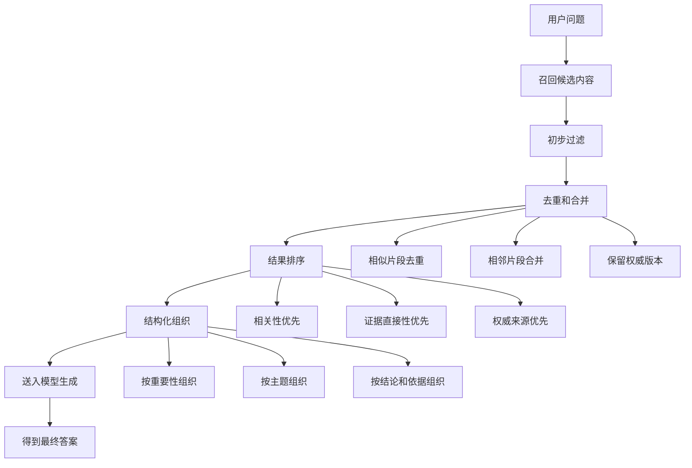

# RAG 项目难点

这一页收录项目落地中的难点问题。适合放数据噪声、长文档、多轮上下文、知识更新和复杂场景适配。

## 1. 项目里的上下文是怎么处理的？上下文过长、冗余等问题有什么优化方向？

项目里的上下文通常不会把检索到的内容原样全部丢给模型，而是会先做一层**上下文构造**。

一般会先根据用户问题召回一批相关片段，但这一步拿到的通常只是候选材料，不是最终要送给模型的上下文。接着会做初步过滤，把明显无关的内容先去掉，比如主题不一致、时间范围不对、业务域不匹配的内容，不进入后续阶段。

然后会做**去重和合并**。很多知识库里会有重复片段，或者不同文档里有高度相似的内容。如果直接都塞进去，会浪费上下文长度，还会干扰模型判断。所以通常会做：

- 相似内容去重
- 同一文档相邻片段合并
- 重复结论只保留最权威的一份

再往后是**排序**，把最关键、最能直接支撑答案的内容排在前面。因为模型通常对前面的内容更敏感，而且上下文长度有限，越靠前的内容越容易被真正利用。

在组织方式上，也不会简单拼接，而是尽量按一定逻辑组织，比如：

- 按重要性排序
- 按时间顺序排序
- 按主题分组
- 按“结论 + 依据”的形式组织

这样模型更容易理解，也更不容易答偏。

最后进入生成阶段时，给模型的上下文应该已经是筛过、排过、组织过的，而不是原始检索结果。

**上下文不是越长越好。** 过长和冗余通常会带来几个问题：

- 噪声变多：模型更容易抓错重点
- 关键证据被淹没：真正重要的片段可能夹在大量普通内容中间
- 容易出现冲突：不同文档表述不一致时模型容易混合生成
- 成本和延迟上升：输入 token 越多，响应越慢，成本也越高
- 回答稳定性下降：同一个问题多问几次，答案波动可能更明显

针对上下文过长、冗余的问题，核心思路通常是：**少而精**。

**第一，控制召回数量，不要盲目放太多内容。**
更合理的做法是先召回更多候选，再筛出真正有用的少量内容给模型。也就是说，召回可以宽一点，但最终上下文要收紧。

**第二，做去重。**
这是最直接也最有效的优化方式之一。常见做法包括：

- 文本相似片段去重
- 同一结论的重复描述去重
- 同一文档相邻片段合并
- 多个来源中只保留最权威版本

**第三，优化切分策略。**
很多上下文冗余，根源其实不在生成，而在前面的文档切分不合理。

- 切得太小：同一个意思被拆成很多碎片
- 切得太大：一段里夹杂太多无关内容

所以要根据文档类型设计切分方式，比如：

- 问答类文档切细一点
- 流程、制度、技术方案类保留章节结构
- 表格、代码、配置内容单独处理

**第四，增加重排，提升前几条质量。**
如果前几条质量足够高，其实不需要给很多内容。可以在召回之后做更细的排序，把：

- 和问题最相关的
- 证据最直接的
- 来源最权威的

内容放到最前面。

**第五，做摘要式压缩。**
对于特别长的文档，可以先不直接整段送进去，而是先做一层压缩，比如：

- 提取和问题最相关的句子
- 先抽取关键事实，再送给主模型
- 先对长文档做局部摘要，再拼装最终上下文

这类方法本质上是把原始材料变成证据摘要。

**第六，按问题类型动态构造上下文。**
不是所有问题都需要一样多的上下文。

- 事实型问题：通常少量高精度证据就够
- 对比型问题：需要多条来自不同来源的证据
- 总结型问题：可能需要更大范围的信息
- 多跳问题：需要多个片段组合

所以可以根据问题类型动态决定：

- 取多少条
- 每条多长
- 怎么排序
- 是否需要先压缩

**第七，处理冲突信息。**
如果上下文里有相互矛盾的内容，不能直接都扔给模型不管。通常可以这样处理：

- 权威来源优先
- 更新版本优先
- 明确标记冲突
- 要求模型说明存在不一致，而不是强行合并

**第八，分步处理复杂问题。**
复杂问题不要总想着一次把所有材料都塞进去，更好的方式是分两步甚至多步处理，比如：

- 先分别找不同子问题的证据
- 再对每部分做压缩或提取
- 最后汇总生成最终答案

这样可以避免一次输入过多上下文导致混乱。

