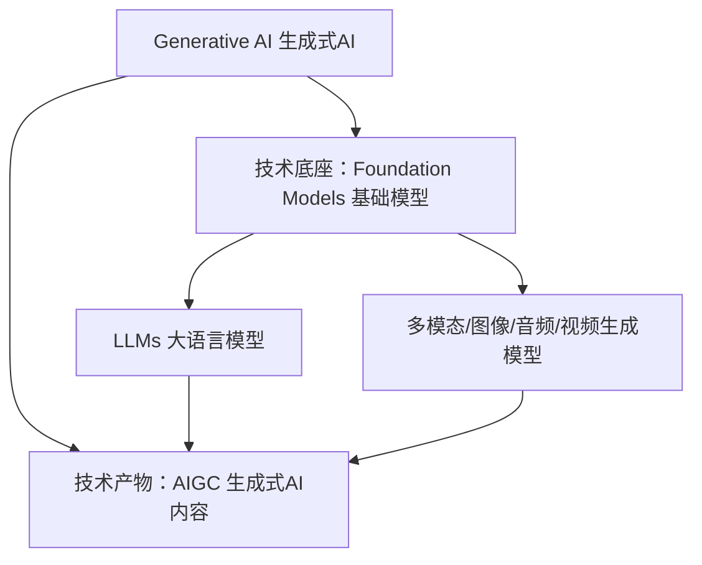

# 1.1.4 LLM、生成式 AI、AIGC、基础模型（Foundation Model）是什么关系？

先说结论：

**这几个词不是同义词，而是处在不同层级。**

- `生成式 AI` 是最上层的能力或应用范畴
- `AIGC` 更强调“AI 生成内容”这个结果形态
- `基础模型（Foundation Model）` 是一类可适配多任务的底层模型范式
- `LLM` 是基础模型在语言领域里最典型、最重要的一类

如果要先建立一个直观印象，可以把这几个概念理解成一张分层关系图：生成式 AI 在最外层，基础模型位于中间，LLM 是语言方向上最典型的一支。

下面这张图先给出一个简化版关系，帮助你快速建立层级感。

但这只是简化视角，因为生成式 AI 不只有语言，也包括图像、音频、视频、代码等；基础模型也不只用于生成，还可能支持理解、分类、规划和控制等任务。

## 什么是生成式 AI

生成式 AI 强调的是：系统不仅能识别或判断，还能生成新的内容。

生成的内容可以是：

- 文本
- 图片
- 音频
- 视频
- 代码
- 多模态内容

所以生成式 AI 是一个更宽的概念。LLM 属于生成式 AI 的重要组成部分，但不是全部。

比如文生图模型属于生成式 AI，但不是 LLM；音乐生成模型属于生成式 AI，但也不是 LLM。

## 什么是 AIGC

AIGC 是 `AI Generated Content` 的缩写，中文常写作“AI 生成内容”。

它和生成式 AI 非常接近，但常见使用语境略有不同：

- `生成式 AI` 更像技术范畴或方法范畴
- `AIGC` 更像内容生产场景里的说法

比如：

- 讨论模型训练、推理、对齐时，更常说“生成式 AI”
- 讨论文案生成、图片生成、视频创作、内容工业化生产时，更常说“AIGC”

在很多文章里，两者会混着用。工程上你不必过度抠字，但要知道它们强调点不同。

## 什么是基础模型

基础模型这个词强调的不是“会不会生成”，而是：

**一个在大规模广泛数据上训练出来、能适配很多下游任务的通用底座模型。**

这个概念的关键点有三个：

- 在大规模通用数据上训练
- 能迁移到很多下游任务
- 常常会成为一批应用和衍生模型的共同底座

所以，基础模型不一定只做文本，也可以是视觉、语音、多模态甚至机器人控制方向的底座模型。

它和“预训练模型”有关，但不完全等价。很多预训练模型也可以迁移，但基础模型这个概念更强调规模、通用性和生态中心地位。

## LLM 在这里处于什么位置

LLM 是基础模型在语言领域中的典型代表。

它的输入输出主要是语言 token，典型能力包括：

- 理解和生成文本
- 根据指令执行任务
- 通过上下文进行 few-shot 适配
- 作为聊天、RAG、Agent、代码助手等系统的认知核心

所以当你说“LLM”时，你说的是：

- 一类模型
- 一种语言方向的基础模型
- 生成式 AI 体系中的重要分支

但不是整个生成式 AI，也不是所有基础模型。

## 为什么这些词容易混

因为现实产品经常是多层概念叠在一起的。

比如一个知识助手产品，可能同时满足：

- 它是生成式 AI 产品
- 它在内容交互层面属于 AIGC
- 它底层使用的是基础模型
- 具体到语言能力，核心模型是 LLM

所以大家在不同语境里，可能都说得“没错”，但层级不一样。如果不分层，就容易造成沟通混乱。

## 一个实用判断法：先问自己在讨论哪一层

你可以用下面这个简单方法区分：

如果你在讨论“系统会不会生成内容”，你多半在讨论生成式 AI 或 AIGC。

如果你在讨论“底层是不是一个可迁移的通用大模型底座”，你多半在讨论基础模型。

如果你在讨论“这个模型是否主要处理语言输入输出、是否具备文本理解与生成能力”，你多半在讨论 LLM。

## 一个具体例子

假设你在做一个企业知识助手：

- 从产品类型看，它属于生成式 AI 应用
- 从内容生产结果看，它可以被归到 AIGC
- 从底层技术底座看，它很可能构建在一个基础模型之上
- 从核心模型类型看，如果主要做文本问答和推理，底层通常是 LLM
- 如果它还能处理图片和语音，那整体系统可能已经进入多模态基础模型范畴，而不只是纯 LLM

这个分层视角，比背定义更有用。因为真实系统就是这样一层一层搭起来的。

## 不要把基础模型和 LLM 完全画等号

今天在工程讨论里，大家经常默认“基础模型”就是“LLM”，因为语言模型最常见、生态最成熟。

但严格来说，这样说并不完整。

更稳妥的理解是：

- 大多数热门 LLM 都是基础模型
- 但基础模型不只有 LLM
- 生成式 AI 也不只依赖基础模型中的语言模型

理解这点以后，后面你再看多模态模型、语音模型、Agent foundation model 之类概念时，就不会把所有词都硬塞回“LLM”。

## 你可以先这样记住这四个词

- `生成式 AI`：强调生成能力的总范畴
- `AIGC`：强调 AI 生成内容的应用表达
- `基础模型`：强调可迁移、可复用的大规模模型底座
- `LLM`：基础模型在语言方向上的核心代表

如果以后你只想快速判断一句话有没有混概念，最简单的办法是看它是不是把“应用范畴”“内容形态”“模型范式”“具体模型类型”混成了同一层。
