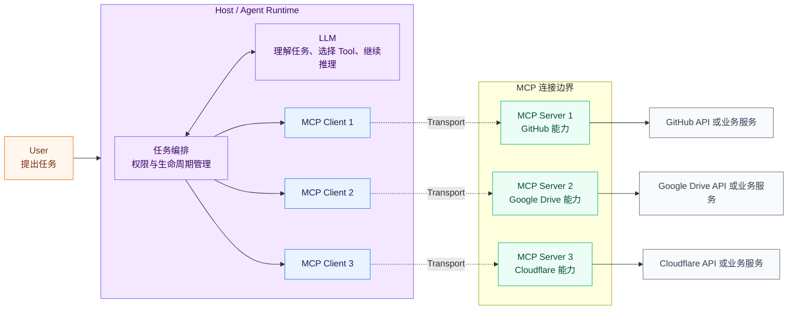
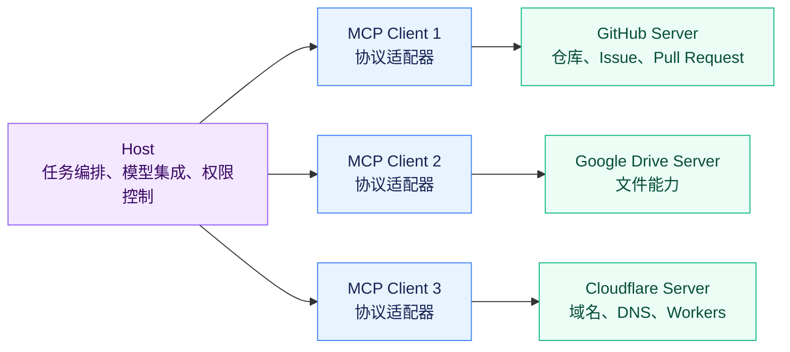
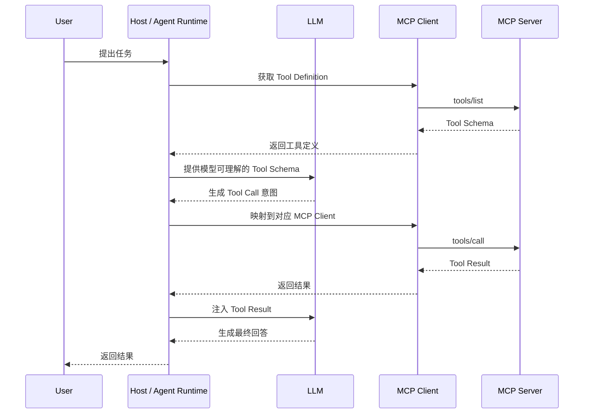

# 深入 MCP：MCP 的架构是怎样的？

如果你还不清楚 MCP 是什么、为什么会出现 MCP，或者 MCP 和 Tool Calling 到底是什么关系，可以先看前面的《[MCP 是什么](/getting-started/mcp)》和《[Tool Calling 是什么](/getting-started/tool-calling)》。

这一章我们不再重复这些基础概念，而是深入了解一下 MCP 的架构。



先想一个问题：当我们说“一个 Agent 接入了 MCP”，到底是谁在和 MCP Server 通信呢？

是大模型吗？

不是。

是 Agent 吗？

也不够准确。

按照 MCP 当前的架构，一个完整系统至少要区分 **Host、Client 和 Server** 三个角色。

Host 内部可以运行多个 MCP Client，每个 Client 面向一个特定的 MCP Server，而 Server 负责暴露 Tools、Resources、Prompts 等能力。

在理解 MCP 后面所有协议设计之前，我们必须先把这三个角色分清楚。

## 为什么 MCP 要分成 Host、Client 和 Server？

我们平时已经很熟悉 C/S、B/S 这类架构了，Client 和 Server 各司其职并不难理解。

那么到了 MCP，为什么只有 Client 和 Server 还不够，还要再单独引入一个 Host？

既然 MCP Server 已经提供了工具，Agent Runtime 直接请求 Server 不就可以了吗？

其实如果单纯从“能不能实现”的角度来说，当然可以。

一个应用完全可以自己写 HTTP 请求、自己管理 Tool Schema、自己把工具结果交给模型。

但这种情况下，没有形成一个统一的规范，代码会更加复杂，不同应用对接也复杂。

实际上， MCP 要解决的并不只是“怎样以最少代码调用一次外部接口”，它核心要解决的是：当一个 AI 应用同时连接多个外部能力时，**谁负责模型，谁负责协议，谁负责能力本身，以及这些责任之间怎样保持边界**。

Host 是整个系统真正的**控制中心**。

Host 的职责包括创建和管理 MCP Client、控制连接权限和生命周期、执行安全策略和用户授权、协调 LLM 集成，以及聚合来自不同 Client 的上下文。

换句话说，Host（宿主）并不是一个单纯的网络容器，它才是“这个 AI 应用本身”。Claude Desktop、IDE、Agent Runtime 或者我们自己开发的 Agent 应用，都可以处在 Host 这一层。

MCP Client 是 Host 内部的一块**协议适配器**。

它负责与具体的 MCP Server 进行通信：构造请求、携带协议版本和能力信息、接收响应、处理通知和订阅，把 Host 想完成的 MCP 操作转换成真正的协议消息。

MCP Server 则是**能力**的**提供者**。

它只需要专注于自己能够提供的能力，例如 GitHub Server 提供管理仓库、Issue、Pull Request 等能力，Google Drive Server 提供文件搜索、读取和管理能力，Cloudflare Server 提供域名、DNS、Workers、日志等云服务能力。

**Host 负责“我要完成什么”；Client 负责“怎么用 MCP 表达”；Server 负责“这个具体能力怎么执行”。**



举个简单的例子。

假设我们在 Codex 里接入 GitHub MCP Server，并发送消息“我想要查看我当前 GitHub 有哪些仓库”。此时，**Codex 是 Host**；Codex 内部会有一块负责 MCP 通信的代码或组件，这就是 **MCP Client**。它通常由应用开发者集成到自己的软件里，负责按照 MCP 协议向对应的 Server 发送请求、接收结果。

而 **MCP Server** 是能力提供方。比如 GitHub Server 负责提供仓库、Issue、Pull Request 等能力。


还有就是，**复杂的编排应该尽可能留在 Host，Server 则应该保持职责单一、彼此独立。**

假设 Codex 同时接入了 GitHub、Google Drive 和 Cloudflare 三个 MCP Server，用户告诉 Codex：
```text
查看项目最近的 Issue，找到 Google Drive 里的需求文档，再检查对应域名的 Cloudflare 配置。
```

真正知道“整个任务要完成什么、下一步该调用哪个能力”的，是作为 Host 的 Codex。

GitHub Server 只需要处理 GitHub 相关操作，Google Drive Server 只负责文件相关能力，Cloudflare Server 只处理自己的云服务能力。它们没有必要知道另外两个 Server 做了什么，也不需要知道整个任务最终想达到什么目的。

换句话说，**Server 负责把自己的能力做好，Host 负责把这些能力组合起来。**

## 一个 Host 为什么可以有多个 Client？

**因为一个 Host 通常不只连接一个 MCP Server。**

假设一个 Agent 同时拥有 GitHub、Google Drive、Cloudflare 三种外部能力。它并不会创建一个"超级 MCP Client"，然后让这个 Client 自己管理三个完全不同的 Server，而是会形成三个相互独立的 Client 实例。

**Host → GitHub Client → GitHub Server**

**Host → Google Drive Client → Google Drive Server**

**Host → Cloudflare Client → Cloudflare Server**

当前 MCP 官方架构规范就是这样定义的：

> **Host 创建并管理多个 Client，而每个 Client 与一个特定 Server 建立对应关系。**

那为什么不把所有 Server 都放到同一个 Client 呢？

首先是**能力空间不同**。

GitHub Server 可能声明 Tools 能力，Google Drive Server 可能同时提供 Resources，另一个 Server 又可能支持其他扩展。每个 Server 拥有自己的 Capability、Tool Catalog、Resource Namespace、通知和订阅状态。

如果把这些东西全部放进一个共享 Client 后，Client 内部还得重新建立一套“这个 Tool 属于哪个 Server”的路由系统。

而让 Client 对应绑定一个 Server，这个问题在架构层就被解决了。

当 GitHub Client 收到 `tools/list`，返回的一定是 GitHub Server 的 Tool；当这个 Client 发出 `tools/call`，目标也自然是这个 Server。Client 自己不需要重新做多 Server 路由。

其次是**生命周期隔离**。

Google Drive Server 崩溃，不应该导致 Cloudflare Client 一起失效；GitHub Server 被用户禁用，也不应该影响另一个 Server 的订阅。

在 stdio 场景里，这种隔离尤其直观。一个 Client 可能启动一个本地 Server 子进程，进程退出意味着这一条 Client–Server 路径失效，但 Host 中其他 Client 仍然可以继续工作。

第三是**安全边界**。

假设 GitHub Server 拥有仓库写入权限，而 Cloudflare Server 拥有修改 DNS、Workers 等云资源的权限。如果它们共享同一套内部连接状态、Credential 或上下文，就很容易造成权限边界模糊。

一个 Client 对应一个 Server，使 Host 可以围绕 Server 做更精细的控制：

* 这个 Server 能不能连接？
* 它可以暴露哪些 Tool？
* 哪些请求必须向用户确认？
* Authorization Token 属于谁？
* 结果能不能进入模型上下文？

最终决定这些问题的仍然是 Host，但“一 Client 对一 Server”给 Host 提供了非常清晰的控制单位。

## 为什么一个 Client 只连接一个 Server？

MCP 规范所说的 1:1，指的是：

**一个 MCP Client 实例面向一个特定的 MCP Server。**

但并不意味着：

**一个 MCP Server 进程只能服务一个 Client。**

也就是说远程服务器完全可以启动一个 Server 进程，让多个 Client 调用。

Client 要保证“一 Client 面向一个 Server”，最直接的原因就是：**它可以让协议上下文保持单一。**

想一下，如果一个 Client 同时连接 GitHub Server 和 Google Drive Server，会发生什么。

Client 调用 `tools/list` 后得到：

`create_issue`、`list_pull_requests`、`search_files`、`read_file`。

接下来调用：

`tools/call`

Client 就必须自己再解决：

* `create_issue` 属于哪台 Server？
* 两个 Server 都定义了 `search` 怎么办？
* 哪个 Server 支持 Resource Subscription？
* 哪个 Server 声明了某个 Extension？
* 一条 Notification 到底属于哪台 Server？
* 某台 Server 出错之后，要关闭整个 Client 还是只关闭一部分？

## LLM、Agent Runtime 和 MCP 到底是怎么串起来的？

MCP Server 根本不会直接和 LLM 通信。

假设用户对一个 Agent 说：

```text
帮我看一下这个项目最近有没有新的 Bug Issue。
```

Host 中的 Agent Runtime 首先需要让模型知道它有哪些 Tool。

MCP Client 可以从 GitHub MCP Server 获取工具定义，例如 Server 暴露：

`search_issues`

它可能拥有名称、描述和输入 Schema。

但这份 MCP Tool Definition 并不会原封不动地交给模型。

真正调用 OpenAI、Anthropic、Gemini 或其他 Model API 的是 Host。

Host 需要根据自己使用的模型供应商，把 MCP Tool 转换成这个模型 API 能理解的 Tool Schema，再连同 Conversation、System Prompt 和其他 Context 一起构造一次模型请求。

也就是说，在模型第一次“看到 MCP Tool”之前，MCP 已经结束了一段工作：

**Server → MCP Client → Host → Model Tool Schema**

模型得到的并不是一个“MCP Connection”。

模型得到的是：

```text
“你现在有一个叫 `search_issues` 的工具，它接受这些参数。”
```

模型根据用户请求产生一个 Tool Call，例如：

`search_issues(repo="xxx", query="is:issue is:open label:bug")`

到这一步为止，模型仍然没有发送任何 MCP 请求。

模型只是生成了一段**调用意图**，本质上就是一段文本代码。

接下来是 Agent Runtime 接管。

Runtime 解析 Tool Call，判断这个工具来自 GitHub MCP Server，然后找到对应的 MCP Client。

这时候才真正进入 MCP 内部。

MCP Client 构造 `tools/call` 请求，通过 Streamable HTTP 发送给 GitHub MCP Server。Server 找到对应 Tool Handler，执行真正的 GitHub API 请求，然后把 Tool Result 通过 MCP Response 返回。

接下来链路反过来：

**MCP Server → MCP Client → Host → Agent Runtime → Model Context**

Host 把 MCP Tool Result 转换成模型 API 可以接受的 Tool Result Message，再发起下一次模型推理。



<PlainExplanation title="这张图应该怎样理解">

这张图的顺序可以这样理解：

1. 用户向 Host 提出任务。
2. Host 让对应的 MCP Client 获取 Tool Definition。实际项目中，这一步通常发生在连接建立后，也可能从缓存读取，不一定每次提问都重新执行。
3. MCP Client 向 MCP Server 发送：

   ```text
   tools/list
   ```

   请求 Server 列出自己提供的 Tools。

4. MCP Server 返回 Tool Definition，包括：

   ```text
   Tool 名称
   Tool 描述
   输入参数 Schema
   其他 Tool 元数据
   ```

5. MCP Client 把 MCP Server 返回的 Tool Definition 交给 Host。
6. Host 不能把这份 MCP Tool Definition 原样交给模型，而是要根据具体模型供应商的格式，把它转换成模型能够理解的 Tool Schema，然后连同用户问题一起发送给 LLM。
7. LLM 判断当前任务是否需要调用 Tool。如果需要，它只会生成一个 Tool Call 意图，例如：

   ```text
   调用 search_issues
   参数是 repo=xxx
   ```

   此时模型还没有直接调用 MCP Server。

8. Host 收到模型生成的 Tool Call 后，根据 Tool 名称找到它属于哪个 MCP Server，再选择对应的 MCP Client。
9. 被选中的 MCP Client 向对应的 MCP Server 发送：

   ```text
   tools/call
   ```

   并携带 Tool 名称和参数。

10. MCP Server 执行真正的业务逻辑，例如调用 GitHub API，然后将结果作为 MCP Tool Result 返回给 MCP Client。
11. MCP Client 把结果交给 Host。
12. Host 再把 MCP Tool Result 转换成模型 API 能理解的消息，放回对话上下文中，让 LLM 继续推理。
13. LLM 根据：

   ```diff
   用户问题
   + Tool Call
   + Tool Result
   ```

   生成最终回答。

14. Host 把最终回答返回给用户。

最重要的是区分两条链路：

```text
Host ↔ LLM
```

负责模型理解、Tool 选择和继续推理。

```text
MCP Client ↔ MCP Server
```

负责 Tool 的发现、调用和结果返回。

Host 位于两者中间，负责把模型的 Tool Call 转换成 MCP 的 `tools/call`，再把 MCP 的 Tool Result 转换回模型能够理解的内容。

</PlainExplanation>

模型最终才会根据：

用户原始问题 + 前面的 Tool Call + Tool Result

生成：

```text
最近有 3 个 Bug Issue……
```

所以一轮完整的 Tool 调用实际上跨越了两个不同的“协议世界”。

第一层是：

**Host ↔ LLM**

这里可能使用 OpenAI、Anthropic、Gemini 等模型供应商自己的 API 和 Tool Calling 机制。

第二层是：

**MCP Client ↔ MCP Server**

这里使用 MCP。

而 Agent Runtime 就站在这两个世界中间。

它负责把：

```text
模型产生的 Tool Call
```

映射成：

```text
MCP `tools/call`
```

再把：

```text
MCP Tool Result
```

映射回：

```text
模型能够继续推理的 Tool Result。
```

另外，这里还有一个细节。

MCP 并没有规定 Host 必须使用 LLM，也没有规定 Tool 一定要由模型自主选择。

规范本身只定义 Client 与 Server 如何交换 MCP 消息。

Host 完全可以自己写：

```text
用户点击按钮 → 调 MCP Tool
```

也可以：

```text
Workflow 到达某一步 → 调 MCP Tool
```

甚至：

```text
后端定时任务 → 调 MCP Tool
```

因此，从协议角度看：

**MCP 并不依赖 Tool Calling 才能存在。**

反过来 Tool Calling 也完全不依赖 MCP。

真正把二者连接起来的是 **Host / Agent Runtime 的实现**。

这也是为什么架构中要强调 Host 的存在。
