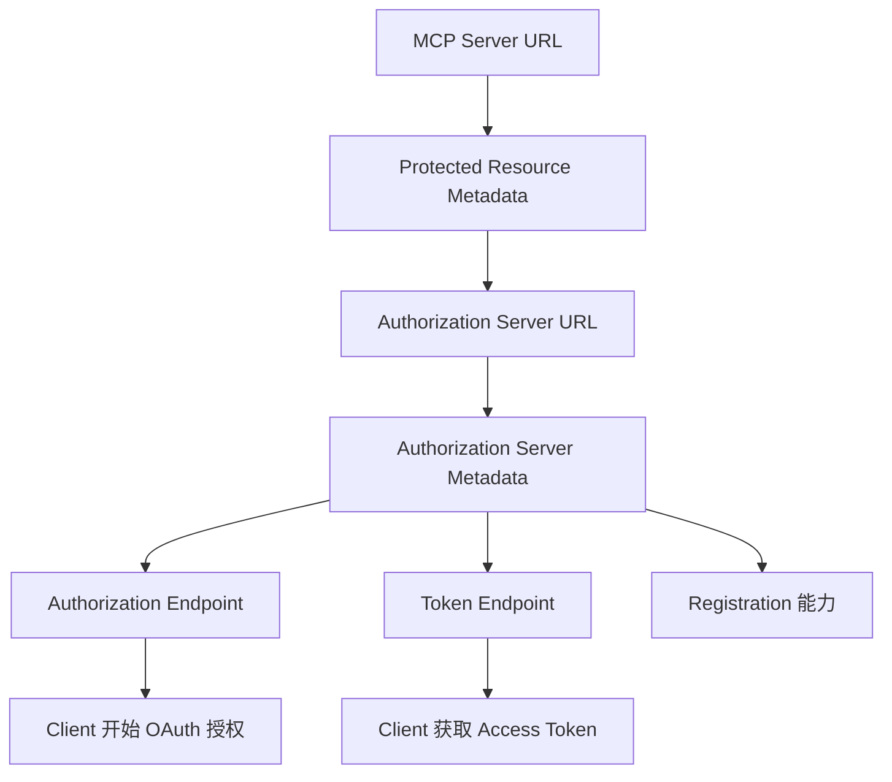
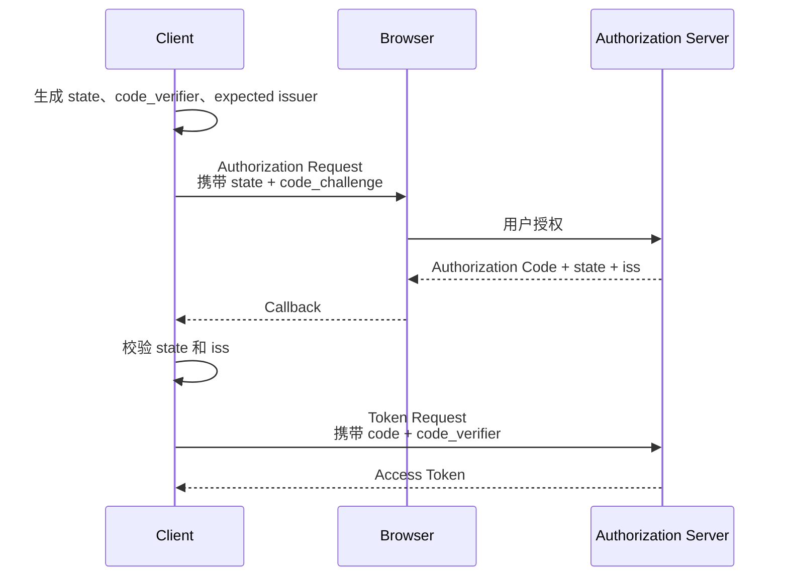
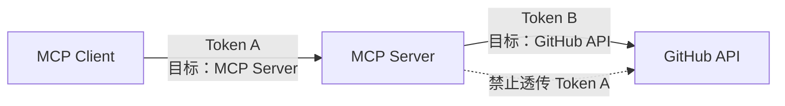
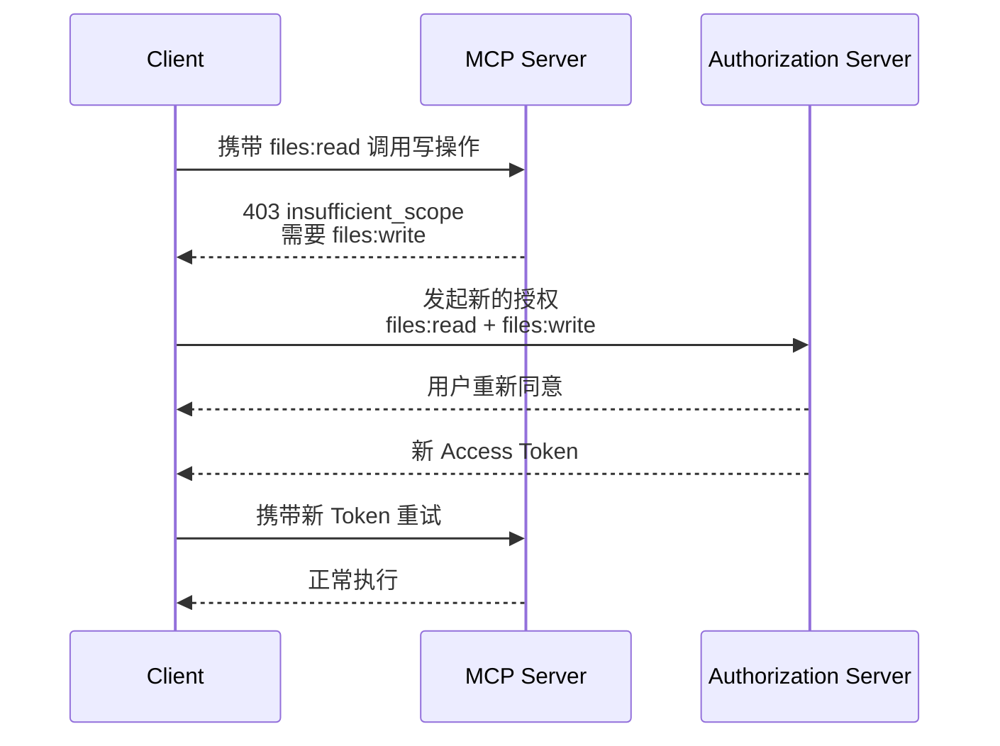

---

title: 深入 MCP：Remote MCP 的 Authorization 到底是怎么工作的？
description: "从 Authorization Server Discovery、Client Registration、PKCE、Resource Indicator 和 Step-up Authorization 出发，深入理解 Remote MCP 的授权机制。"
summary: 深入拆解 Remote MCP 如何发现授权服务器、确认 Client 身份、获取绑定目标 MCP Server 的 Access Token，并在权限不足时按需提升 Scope。
keywords:
- 深入 MCP
- MCP Authorization
- Remote MCP
tags:
  - AI Agent
  - 原理
  - MCP
author: 布吉岛
lastUpdated: 2026-09-14
status: draft
draft: true
assets: none
reviewed: false
sourceType: original
noindex: true

---

# 深入 MCP：Remote MCP 的 Authorization 到底是怎么工作的？

本地 stdio MCP 很少需要一套完整的 OAuth 授权流程。

因为 Server 通常就是 Host 启动的本地进程，GitHub Token、数据库密码之类的凭证，可以直接通过环境变量或本地配置传给它。

Remote MCP 不一样。

Client 访问的可能是：

```text id="etvk3z"
https://mcp.example.com
```

背后服务多个用户，而且 Server 还可能访问GitHub、Google Drive、Notion、企业内部系统等受保护数据。

这时候核心就不再是：

> Client 能不能访问这个 MCP Server？

而是：

> Client 代表的是谁？

> 用户到底允许它访问哪些能力？

> 这个 Access Token 是不是专门发给当前 MCP Server 的？

> Client 第一次看到一个完全陌生的 MCP Server，又怎么知道该去哪里登录？

MCP 没有自己重新设计一套账号和 Token 协议，而是建立在 OAuth 2.1 及相关标准之上。

MCP Authorization 是可选能力，主要面向 HTTP Transport。

对于 stdio，当前规范并不建议套用这套流程，而更适合从运行环境中获取凭证。

## 为什么 MCP Server 和 Authorization Server 要分成两个角色？

最简单的 Remote MCP 完全可以自己做：

```text id="prnfd2"
/login

/oauth/token

/mcp
```

也就是：

> 一个服务既负责用户登录，又负责签发 Token，还负责真正执行 MCP Request。

这当然能实现。

但 MCP 并没有把这种部署方式写死。

在当前 Authorization 模型里，有三个不同角色：

```text id="yrn2vo"
Resource Owner
      ↓
Authorization Server
      ↓ 发 Access Token
MCP Client
      ↓ 带 Token
MCP Server
```

其中：

**MCP Client**

对应 OAuth Client。

它代表用户向 MCP Server 发 Request。

**MCP Server**

对应 Resource Server（受保护资源服务器）。

它负责接受 Access Token，并根据 Token 和业务权限决定 Request 能不能执行。

**Authorization Server**

负责用户认证、授权确认、签发 Access Token。

Authorization Server 和 MCP Server 可以属于同一个系统，也可以完全分开。

例如一个企业 MCP Server 完全可以把认证交给现有身份平台：

```text id="9a4nj0"
MCP Server
    ↓ 信任
企业 Authorization Server
```

而不需要自己重新实现密码登录、MFA、账号生命周期、Refresh Token、Consent（授权确认）等一整套体系。

但这里还有一个问题。

用户完成登录，只能证明：

> Authorization Server 知道这个用户是谁。

并不能自动证明：

> 当前 Client 可以访问这个 MCP Server 的所有资源。

身份和资源授权不是一回事。

例如用户已经登录了，但是并允许删除 GitHub Repository

因此真正访问 MCP Server 时，仍然需要一个包含明确权限、并且面向当前 Resource Server 的 Access Token。

这也是后面的：`scope`和`resource`存在的核心原因。

## Client 第一次连接陌生 MCP Server，怎么知道应该去哪里登录？

假设一个 Host 第一次连接：

```text id="u32yrc"
https://mcp.example.com
```

它只有一个 MCP Endpoint。

它不知道：

```text id="8r123h"
Authorization Server 在哪里？

Authorization Endpoint 是什么？

Token Endpoint 是什么？

这个 Server 支持哪种 Client Registration？
```

如果 MCP 要实现真正的开放生态，就不能要求：

> 每增加一个 MCP Server，都在 Client 代码里手动写一份 OAuth 配置。

所以 Remote MCP Authorization 很重要的一部分其实不是：

> 怎么登录。

而是：

> **怎么发现授权系统。**

当前流程存在两层 Discovery（发现）。

第一层：

```text id="rlm06u"
MCP Server
        ↓
Protected Resource Metadata
        ↓
找到 Authorization Server
```

第二层：

```text id="259uo0"
Authorization Server
        ↓
Authorization Server Metadata
        ↓
找到 authorize / token 等 Endpoint
```

为什么要拆成两层？

因为这是两个不同主体在声明不同信息。

MCP Server 声明的是：

> **哪些 Authorization Server 有资格给我签发 Token？**

Authorization Server 自己声明的是：

> **如果你要和我走 OAuth，我的 Endpoint 和能力是什么？**

### 第一步：发现 MCP Server 信任谁

Client 第一次不带 Token 请求：

```text id="lbdzld"
https://mcp.example.com
```

可能收到：

```http id="0ifqyu"
HTTP/1.1 401 Unauthorized
WWW-Authenticate: Bearer resource_metadata="https://mcp.example.com/.well-known/oauth-protected-resource"
```

这里的：

```text id="wstd3v"
resource_metadata
```

指向 **Protected Resource Metadata（受保护资源元数据）**。

其中会包含：

```json id="rtbsnb"
{
  "authorization_servers": [
    "https://auth.example.com"
  ]
}
```

也就是告诉 Client：

> 要访问我，请去这个 Authorization Server 获得凭证。

当前规范要求 Client 支持从 `WWW-Authenticate` 获取 Metadata 地址。

如果 Response 没直接给出，Client 还要尝试标准 Well-known URI（约定的标准发现地址）。

例如 MCP Endpoint 是：

```text id="5x121g"
https://example.com/public/mcp
```

Client 可以按照规则尝试：

```text id="zvusxt"
https://example.com/.well-known/oauth-protected-resource/public/mcp
```

必要时再尝试 Root Metadata。

所以：

> **Client 并不需要提前知道授权系统地址。**

它可以从 Resource Server 自己开始发现。

Protected Resource Metadata 甚至可以列出多个 Authorization Server。

不同 Authorization Server 是独立的安全边界。

一个 Authorization Server 签发的 Client Credential 或 Token，不能因为“大家都能访问同一个 MCP Server”，就直接拿到另一个 Authorization Server 使用。

### 第二步：发现 Authorization Server 自己怎么工作

现在 Client 知道：

```text id="qohgss"
https://auth.example.com
```

但还是不知道：

```text id="uszgst"
Authorization Endpoint

Token Endpoint

支持哪些 Client Registration

是否支持 PKCE
```

于是 Client 再做一次 Authorization Server Metadata Discovery（授权服务器元数据发现）。

通常会读取类似：

```text id="d1qs8k"
/.well-known/oauth-authorization-server
```

或者兼容 OIDC 的：

```text id="430o5e"
/.well-known/openid-configuration
```

假设 Client 去：

```text id="u4n3lv"
https://attacker.example/.well-known/oauth-authorization-server
```

结果 Metadata 却写：

```json id="gse5rv"
{
  "issuer": "https://honest.example"
}
```

不能因为里面的 Token Endpoint 看起来合法就继续用。

必须拒绝。

因为 Discovery 本身也是安全边界的一部分。

最终整个路径是：

```text id="vdf5xa"
MCP Server URL
      ↓
Protected Resource Metadata
      ↓
Authorization Server URL
      ↓
Authorization Server Metadata
      ↓
Authorization Endpoint / Token Endpoint / Capabilities
```



这就是为什么 MCP 不需要自己定义：

```text id="njdn2z"
/mcp/login
```

这种私有协议。

## 一个通用 MCP Client 没提前注册过，`client_id` 从哪里来？

发现 Authorization Server 以后还有一个问题：

OAuth Client 通常需要：

```text id="c3m7ss"
client_id
```

但一个通用 MCP Host 可能第一次连接这个 Server。

双方之前根本没有见过。

传统方案当然可以让开发者先登录 Authorization Server 后台：

```text id="q1wjev"
创建 OAuth App
      ↓
拿到 client_id
      ↓
手动填进 MCP 配置
```

但这样会严重限制：

> 任意 Client 动态连接任意 MCP Server。

因此当前 MCP 支持三种 Client Registration（客户端注册）方式。

### 已经认识：Pre-registration

如果双方原本就存在关系，最简单。

例如企业内部明确配置：

```text id="iuqfdt"
Claude Desktop
client_id = xxx
```

那就直接使用已有注册信息。

没有必要再动态发现身份。

### 第一次见面：Client ID Metadata Documents

如果双方没有预先关系，当前规范更推荐：

**Client ID Metadata Document（客户端身份元数据文档）**

它有一个非常有意思的设计：

> `client_id` 本身就是一个 HTTPS URL。

例如：

```text id="mhy7w0"
https://agent.example.com/oauth/client.json
```

这个 URL 同时承担：

> Client Identifier（客户端标识）

和：

> Client Metadata 的入口。

Authorization Server 看到：

```text id="hvva5r"
client_id=https://agent.example.com/oauth/client.json
```

以后，可以自己请求：

```text id="c3q846"
GET https://agent.example.com/oauth/client.json
```

读取：

```json id="u0g52u"
{
  "client_id": "https://agent.example.com/oauth/client.json",
  "client_name": "Example Agent",
  "redirect_uris": [
    "http://localhost:3000/callback"
  ]
}
```

然后检查：

```text id="7mzq1m"
metadata.client_id
```

是不是和：

```text id="66xm3q"
文档 URL
```

完全一致。

这套设计实际上把 Client 身份从：

> Authorization Server 数据库里的一条预注册记录

变成：

> **Client 自己托管的一份可以被 Authorization Server 动态验证的身份描述。**

这特别适合 MCP。

因为 MCP Client 和 MCP Server 的组合数量理论上可以非常大：

```text id="972j5c"
Client A × Server 1
Client A × Server 2
Client B × Server 1
Client B × Server 3
...
```

如果每一种组合都要求提前手动注册，很难形成真正开放的连接生态。

Client ID Metadata Document 让：

> 第一次见面也可以建立 Client Identity。

### 为什么 Dynamic Client Registration 反而退居兼容方案？

早期 MCP 大量依赖：

**Dynamic Client Registration（动态客户端注册）**

也就是 Client 向 Authorization Server：

```text id="mmc7fq"
POST /register
```

临时申请一个：

```text id="ruhyqo"
client_id
```

这同样可以解决“双方以前不认识”。

但它意味着 Authorization Server 必须开放动态创建 OAuth Client 的接口，还需要处理Client 生命周期、注册滥用、Credential 存储等额外问题。

因此当前规范已经把 Dynamic Client Registration 标记为 deprecated（弃用），主要保留给还不支持 Client ID Metadata Document 的旧 Authorization Server。

当前 Client 的选择逻辑大致是：

```text id="9hxrij"
有预注册 Client？
    ↓ 是
直接使用

否则
    ↓
支持 Client ID Metadata Document？
    ↓ 是
使用 URL Client ID

否则
    ↓
支持 Dynamic Registration？
    ↓ 是
动态注册

否则
    ↓
需要用户手动提供 Client 配置
```

这里仍然有一个安全代价。

Authorization Server 需要主动请求 Client 提供的 Metadata URL。

这意味着需要考虑**SSRF（服务端请求伪造）**等风险。

## Authorization Code 拿回来以后，为什么还不能直接换 Token？

现在 Client 已经知道：

Authorization Server 是谁；

自己的 `client_id` 是什么；

Redirect URI 是什么。

接下来进入 OAuth Authorization Code Flow（授权码流程）。

但对于一个通用 MCP Client 来说：

> 收到一串 Authorization Code 并不意味着可以无条件拿去换 Token。

它必须确认：

> 这串 Code 真的是刚才那次正确授权过程产生的。

这里当前 MCP 特别强调几层保护。

### PKCE 防止 Authorization Code 被别人拿走使用

Client 在跳转用户浏览器以前，先生成一个随机：

```text id="gbxsjf"
code_verifier
```

再计算：

```text id="imhdst"
code_challenge
```

Authorization Request 发出去的是：

```text id="u8q23p"
code_challenge
```

真正到 Token Endpoint 换 Token 时，再提供：

```text id="sjojvs"
code_verifier
```

Authorization Server 验证二者对应以后才发 Token。

于是攻击者即使截获：

```text id="a3btdu"
authorization_code
```

但没有最初 Client 保存的：

```text id="xmyf3l"
code_verifier
```

也无法直接兑换 Token。

当前 MCP 要求 Client 实现 PKCE，并检查 Authorization Server Metadata 是否声明支持 PKCE。

不是：

> 对方也许支持，我们先发过去试试。

如果无法确认支持，Client 不应该继续授权流程。

### `state` 解决的是“这次返回属于哪次授权”

Host 同时连接多个 MCP Server 时，很可能同时存在多次 OAuth Flow。

Client 可以在授权开始时生成：

```text id="2q2gq3"
state
```

浏览器跳回来时再验证。

它解决的是：

> 当前 Callback 是否属于我之前发出去的那一次 Authorization Request。

### `iss` 解决的是“到底哪个 Authorization Server 返回的”

还有一类更隐蔽的问题。

假设 Client 同时支持：

```text id="e0od50"
Auth Server A
Auth Server B
```

攻击者尝试把：

```text id="8yc8yo"
A 发出的 Authorization Code
```

引导 Client 拿去：

```text id="cuj18e"
B 的 Token Endpoint
```

这就是 OAuth 里典型的 Mix-Up Attack（授权服务器混淆攻击）。

因此 Client 在真正跳转用户以前，就应该记录：

> 当前 Flow 期望的 `issuer` 是谁。

Authorization Response 如果提供：

```text id="96r6i5"
iss
```

Client 必须按照规则验证它是否和之前记录的 Authorization Server 一致。

所以整个 Authorization Code Flow 里，Client 实际维护着一组关联关系：

```text id="uk21wa"
这次 Authorization Request
        │
        ├── state
        ├── code_verifier
        └── expected issuer
```

这些值不能跨 Session 随意混用。

因为通用 MCP Host 面对的不是：

> 一个固定网站登录自己的唯一 OAuth 服务。

而是：

> **同时连接许多互不相关 Remote MCP Server 的动态 OAuth Client。**

这让“当前 Authorization Result 究竟属于谁”变得格外重要。



## 为什么 MCP 强制要求 `resource`，Token 不能只证明“用户登录过了”？

假设一个 Authorization Server 同时服务：

```text id="qeh56z"
GitHub MCP
Google Drive MCP
Jira MCP
```

用户已经登录，并不代表：

> Authorization Server 发出的任意 Access Token 都应该被三个 MCP Server 接受。

真正安全的 Token 应该回答两个问题：

```text id="zyufgq"
这个 Token 代表谁？

这个 Token 是发给谁使用的？
```

第二个问题就是 Resource Binding（资源绑定）。

当前 MCP 要求 Client 在 Authorization Request 和 Token Request 中包含：

```text id="w6zh6g"
resource
```

例如：

```text id="o5a0es"
resource=https://mcp.example.com
```

明确告诉 Authorization Server：

> 我现在申请的 Token 是准备用来访问这个 Resource Server。

所以最终 Access Token 不只是：

```text id="lvtzpa"
Alice 已登录
```

而应该类似：

```text id="4ua7mz"
Subject = Alice

Audience =
https://mcp.example.com

Scope =
files:read
```

MCP Server 收到 Token 后必须验证：

> 这个 Token 是否真的以我为目标资源。

如果 Token 的 Audience 是：

```text id="7tlkv6"
https://server-a.example.com
```

却被拿到：

```text id="6gv4ck"
https://server-b.example.com
```

Server B 必须拒绝。

这其实是 Remote MCP 授权里非常重要的一条边界。

因为一个 Agent Host 可能同时持有很多 Access Token。

如果 Token 没有明确绑定目标 Resource，就很容易出现：

```text id="7rvbe2"
本来只应该给 Server A 的 Token
         ↓
误发 / 被诱导发送
         ↓
Server B
```

这样的 Cross-Service Token Abuse（跨服务 Token 滥用）。

### 为什么 MCP Server 也不能把这个 Token 原样交给 GitHub？

假设 MCP Server 是：

```text id="2wcvab"
GitHub MCP Server
```

它收到 Client 的：

```text id="26g03b"
Authorization: Bearer <token>
```

然后内部还需要调用：

```text id="t9fzpp"
api.github.com
```

最简单的实现似乎是：

> Client 给我的 Token，我直接转给 GitHub。

但这是错误的。

因为 Client 手里的 Token 是：

```text id="ta4zpu"
Client → MCP Server
```

这一条安全边界的凭证。

它的目标 Resource 应该是：

```text id="q0agtj"
MCP Server
```

不是：

```text id="s06029"
GitHub API
```

如果 MCP Server 还需要访问上游 GitHub API，它应该作为新的 OAuth Client，获取：

> **专门面向 GitHub API 的另一份 Token。**

形成：

```text id="gwow4a"
MCP Client
    ↓ Token A
MCP Server
    ↓ Token B
GitHub API
```

而不是：

```text id="wvmend"
MCP Client
    ↓ Token A
MCP Server
    ↓ 原样 Token A
GitHub API
```

当前 MCP 安全规范明确禁止 Token Passthrough（Token 透传）。

它背后的根本原因就是：

> **Token 的安全意义不仅是“谁登录了”，还包括“谁可以消费这份 Token”。**



## 为什么 Scope 不应该在第一次授权时全部申请完？

解决了：

> Token 发给谁。

还要解决：

> Token 到底允许做什么。

这就是：

```text id="2q7udf"
scope
```

假设一个 Google Drive MCP Server 有：

```text id="9jrijs"
files:read

files:write

files:delete
```

一个用户最开始只是说：

> 帮我看看这个文档写了什么。

Client 真正需要的只有：

```text id="apg4dx"
files:read
```

如果第一次 Authorization 就申请：

```text id="yo0ax6"
files:read
files:write
files:delete
admin
```

虽然以后调用方便了，但破坏了一个很重要的原则：

**Least Privilege（最小权限）**

也就是：

> 当前操作需要多少权限，就尽量只获得多少权限。

当前 MCP 的 Scope 机制因此支持一个很重要的模式：

**Step-up Authorization（按需提升权限）**

### 第一次只拿基础权限

第一次 Client 请求 MCP Server 时，Server 可以在：

```text id="u6vz8e"
401 Unauthorized
```

中的：

```text id="0431m4"
WWW-Authenticate
```

直接告诉 Client：

> 当前基础访问需要什么 Scope。

例如：

```http id="0u419i"
HTTP/1.1 401 Unauthorized
WWW-Authenticate: Bearer
  resource_metadata="...",
  scope="files:read"
```

Client 就申请：

```text id="iykmr5"
files:read
```

而不是自己猜一个最大权限集合。

如果 Challenge 中没有提供 Scope，Client 才可以根据 Protected Resource Metadata 中的：

```text id="fk9smk"
scopes_supported
```

决定初始授权范围。

### 真正需要写权限时，再升级

后来用户说：

> 帮我修改这个文件。

当前 Access Token 只有：

```text id="0ew4me"
files:read
```

于是 Server 返回：

```http id="sy9d5z"
HTTP/1.1 403 Forbidden
WWW-Authenticate: Bearer
  error="insufficient_scope",
  scope="files:write"
```

这里：

```text id="gpyiu4"
401
```

和：

```text id="70l124"
403 insufficient_scope
```

语义已经不同。

401 更接近：

> 当前没有可接受的认证凭证。

而 403 `insufficient_scope` 表示：

> 我已经知道你是谁，而且 Token 本身也有效，但它没有执行当前操作需要的权限。

Client 收到以后，再发起新的 Authorization Flow，请求：

```text id="v0qcwj"
之前已有的权限
+
files:write
```

这就是 Step-up。

```text id="9ian18"
第一次
files:read
    ↓
用户真正需要修改
    ↓
403 insufficient_scope
    ↓
重新授权
    ↓
files:read + files:write
```

### 为什么不能直接 Refresh Token 扩大 Scope？

看到 Access Token 权限不够以后，一个 Client 可能会想：

> 我不是有 Refresh Token 吗？Refresh 一次，把 `files:write` 加进去不就好了？

不行。

Refresh Grant 不能用来偷偷扩大原来已经授权的 Scope。

否则用户最初只批准：

```text id="jykw4n"
files:read
```

Client 后台 Refresh 一次，突然变成：

```text id="7lmrot"
files:read
files:write
files:delete
```

那前面的 Consent（授权同意）就失去意义了。

因此当新的 Scope 比原授权范围更大时，需要重新进入用户授权过程。

官方 TypeScript SDK 在这一点上有专门处理：

如果收到新的：

```text id="ix5w3k"
insufficient_scope
```

Challenge，而且需要扩大 Scope，它不会简单 Refresh Token，而会要求一次新的 Authorization。

否则结果只会是：

```text id="1yviq2"
Refresh
    ↓
还是原来的 Scope
    ↓
重新请求
    ↓
再次 403
```

所以 Scope Challenge 不只是一个错误信息。

它实际上参与了：

> **权限逐步提升协议。**



把这一整套流程串起来，一个通用 Remote MCP Client 真正做的事情大致是：

```text id="gqxnmv"
只知道 MCP Server URL
        ↓
请求 MCP Server
        ↓
401
        ↓
发现 Protected Resource Metadata
        ↓
知道 Authorization Server
        ↓
发现 Authorization Server Metadata
        ↓
确定自己的 client_id
        ↓
PKCE + 用户授权
        ↓
请求绑定 MCP Server 的 Access Token
        ↓
携带 Token 调 MCP
        ↓
权限不足？
        ├── 否 → 正常执行
        └── 是
             ↓
        403 insufficient_scope
             ↓
        Step-up Authorization
             ↓
        获得新的授权范围
```

所以 Remote MCP Authorization 真正解决的并不是：

> **“给 MCP 加一个登录页面。”**

而是：

> **让一个事先不认识 MCP Server 的通用 Client，可以从一个 Server URL 开始，动态发现正确的身份系统、证明自己的 Client 身份、让用户安全完成授权，并拿到只针对当前 MCP Server、只拥有当前所需权限的凭证。**

这也是为什么当前 MCP Authorization 看起来涉及很多标准：

Protected Resource Metadata、Authorization Server Metadata、OAuth 2.1、PKCE、Client ID Metadata Document、Resource Indicator、Scope Challenge……

它们并不是为了把授权协议设计得更复杂。

恰恰相反。

MCP 自己真正新增的东西很少。

它选择做的是：

> **把已经存在的安全标准按照 MCP 的动态连接场景组合起来，而不是重新发明一套只属于 MCP 的账号和 Token 系统。**
