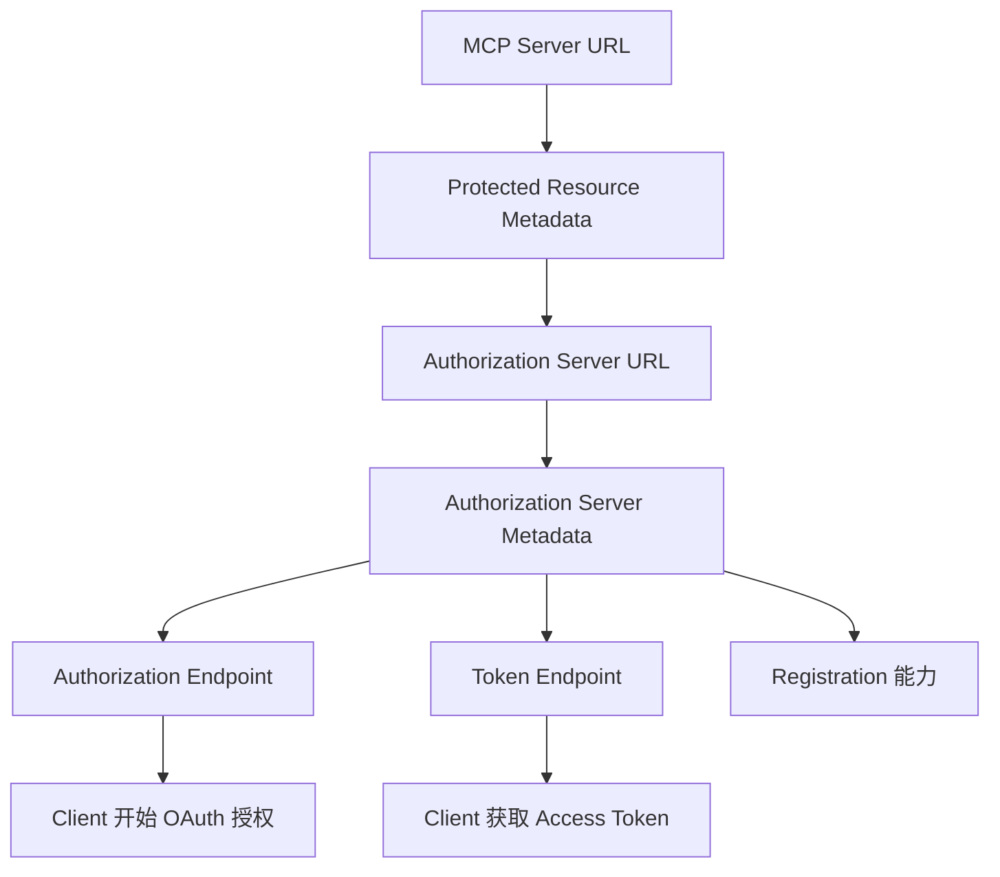
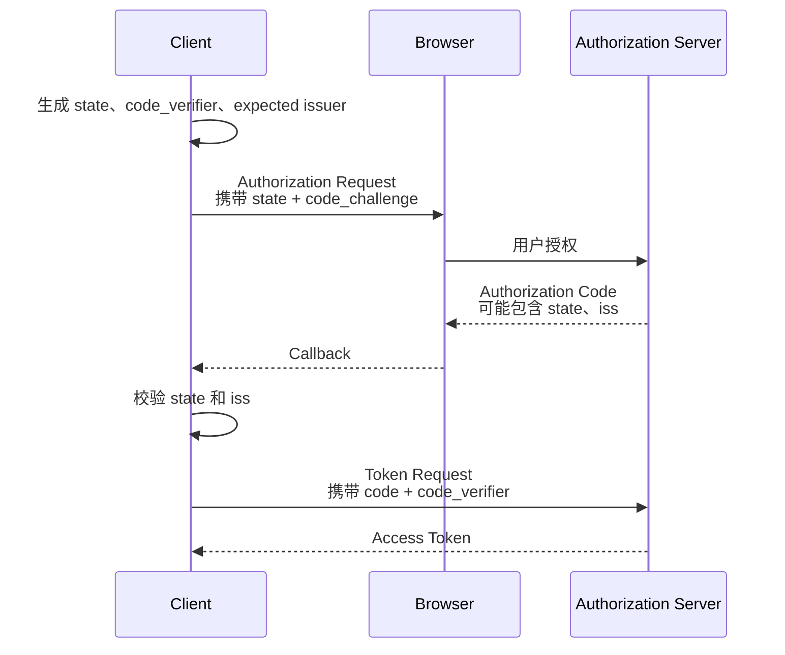
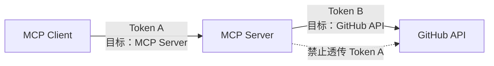
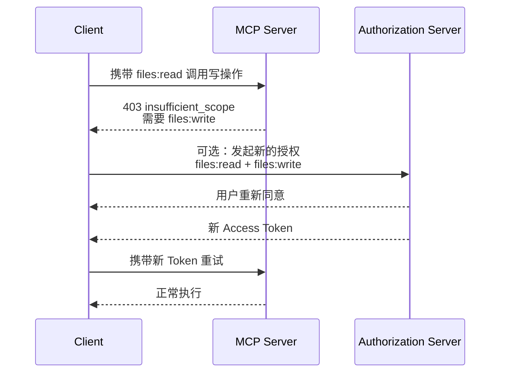

---

title: 深入 MCP：Remote MCP 的 Authorization 到底是怎么工作的？
description: "深入解析 Remote MCP 授权机制：从授权服务器发现、Client 注册与 PKCE，到 resource 资源绑定、Access Token 验证和 Scope 按需提升。"
summary: 梳理 Remote MCP 的 OAuth 授权流程，说明 Client 如何发现授权服务器、获取面向 MCP Server 的 Token，并处理 Scope 不足与 Step-up。
keywords:
  - MCP 授权机制
  - Remote MCP Authorization
  - MCP OAuth 2.1
  - PKCE
  - Client ID Metadata Document
  - Resource Indicator
  - Scope Step-up Authorization
tags:
  - AI Agent
  - 原理
  - MCP
author: 布吉岛
lastUpdated: 2026-09-23
status: published
draft: false
assets: none
reviewed: true
sourceType: original
noindex: false

---

# 深入 MCP：Remote MCP 的 Authorization 到底是怎么工作的？

本地 stdio MCP 很少需要一套完整的 OAuth 授权流程。

因为 Server 通常就是 Host 启动的本地进程，GitHub Token、数据库密码之类的凭证，可以直接通过环境变量或本地配置传给它。

Remote MCP 不一样。

Client 访问的可能是：

```text id="etvk3z"
https://mcp.example.com
```

背后服务多个用户，而且 Server 还可能访问 GitHub、Google Drive、Notion、企业内部系统等受保护数据。

这时候核心就要考虑认证和授权。

MCP 并没有自己重新设计一套账号和 Token 协议，而是建立在 OAuth 2.1 及相关标准之上。

## 为什么 MCP Server 和 Authorization Server 要分成两个角色？

最简单的 Remote MCP 完全可以自己做：

```text id="prnfd2"
/login

/oauth/token

/mcp
```

也就是：

```text
一个服务既负责用户登录，又负责签发 Token，还负责真正执行 MCP Request。
```

这当然可以实现。

但 MCP 并没有把这种部署方式写死。

在当前 Authorization 模型里，OAuth 视角下有三个主要角色：

```text id="yrn2vo"
Resource Owner（用户）
        ↕ 授权 / 登录
Authorization Server
        ↑        ↓
   授权请求    Access Token
        │        │
        └── MCP Client
                │
                │ Authorization: Bearer <Access Token>
                ↓
          MCP Server
       （Resource Server）
```

其中：

**MCP Client**

通常对应 OAuth Client。它一般由 MCP Host 创建和管理，与某个 MCP Server 建立连接。

它代表 Host 向 MCP Server 发 Request；在用户授权场景下，请求可以代表 Resource Owner，也可以在 `client_credentials` 等场景下代表客户端自身。

MCP Host 通常还负责管理多个 Client、发起浏览器授权、保存凭证以及执行整体安全策略。因此，Host 和 Client 在 MCP 架构中不是完全相同的角色。

**启用 HTTP Authorization 保护的 MCP Server**

对应 Resource Server（受保护资源服务器）。

它负责接受 Access Token，并根据 Token 和业务权限决定 Request 能不能执行。

**Authorization Server**

负责用户认证、授权确认、签发 Access Token。

Authorization Server 和 MCP Server 可以属于同一个系统，也可以完全分开。

例如一个企业 MCP Server 完全可以把认证交给现有身份平台：

```text id="9a4nj0"
MCP Server
    ↓ 信任
企业 Authorization Server
```

而不需要自己重新实现密码登录、MFA、账号生命周期、Refresh Token、Consent（授权确认）等一整套体系。

但这里还有一个问题。

用户完成登录，只能证明：

```text
Authorization Server 知道这个用户是谁。
```

并不能证明：

```text
当前 Client 可以访问这个 MCP Server 的所有资源。
```

身份认证和资源授权不是一回事。

例如用户已经登录了，但是不一定允许删除 GitHub Repository。

因此真正访问 MCP Server 时，仍然需要一个包含明确权限、并且面向当前 Resource Server 的 Access Token。

这也是后面的：`scope` 和 `resource` 存在的核心原因。

## Client 第一次连接陌生 MCP Server，怎么知道应该去哪里登录？

假设一个 Host 第一次连接：

```text id="u32yrc"
https://mcp.example.com
```

它只有一个 MCP Endpoint。

它不知道：

```text id="8r123h"
Authorization Server 在哪里？

Authorization Endpoint 是什么？

Token Endpoint 是什么？

这个 Server 支持哪种 Client Registration？
```

如果 MCP 要实现真正的开放生态，就不能要求：

```text
每增加一个 MCP Server，都在 Client 代码里手动写一份 OAuth 配置。
```

所以 Remote MCP Authorization 很重要的一部分其实不是怎么登录。

而是：

```text
怎么发现授权系统。
```

当前流程存在两层 Discovery（发现）。

第一层：

```text id="rlm06u"
    MCP Server
        ↓
Protected Resource Metadata
        ↓
找到 Authorization Server
```

第二层：

```text id="259uo0"
Authorization Server
        ↓
Authorization Server Metadata
        ↓
找到 authorize / token 等 Endpoint
```

为什么要拆成两层？

因为这是两个不同主体在声明不同信息。

MCP Server 通过 Protected Resource Metadata 发布的是：

```text
哪些 Authorization Server 可以用于访问这个受保护资源？
```

Authorization Server 自己声明的是：

```text
如果你要和我走 OAuth，我的 Endpoint 和能力是什么？
```

### 第一步：发现 MCP Server 发布的授权服务器信息

Client 第一次不带 Token 请求：

```text id="lbdzld"
https://mcp.example.com
```

可能收到：

```http id="0ifqyu"
HTTP/1.1 401 Unauthorized
WWW-Authenticate: Bearer resource_metadata="https://mcp.example.com/.well-known/oauth-protected-resource"
```

这里的：

```text id="wstd3v"
resource_metadata
```

指向 **Protected Resource Metadata（受保护资源元数据）**。

其中会包含：

```json id="rtbsnb"
{
  "authorization_servers": [
    "https://auth.example.com"
  ]
}
```

也就是告诉 Client：

```text
要访问我，可以去这些 Authorization Server 获取面向当前资源的凭证。
```

当前规范要求 Client 支持从 `WWW-Authenticate` 获取 Metadata 地址。

如果 Response 没直接给出，Client 还要尝试标准 Well-known URI（约定的标准发现地址）。

例如 MCP Endpoint 是：

```text id="5x121g"
https://example.com/public/mcp
```

Client 可以按照规则尝试：

```text id="zvusxt"
https://example.com/.well-known/oauth-protected-resource/public/mcp
```

必要时再尝试 Root Metadata。

所以 Client 并不需要提前知道授权系统地址。

它可以从 Resource Server 自己开始发现。

Protected Resource Metadata 甚至可以列出多个 Authorization Server。

不同 Authorization Server 是独立的安全边界。

一个 Authorization Server 签发的 Client Credential 不能跨 issuer （签发者）复用；Access Token 则必须针对目标 MCP Resource，并由 MCP Server 自己验证，不能因为“大家都能访问同一个 MCP Server”就直接接受来自其他边界的 Token。

### 第二步：发现 Authorization Server 自己怎么工作

现在 Client 知道：

```text id="qohgss"
https://auth.example.com
```

但还是不知道：

```text id="uszgst"
Authorization Endpoint

Token Endpoint

支持哪些 Client Registration

是否支持 PKCE
```

于是 Client 再做一次 Authorization Server Metadata Discovery（授权服务器元数据发现）。

通常会读取类似下面的标准发现地址。实际实现还需要支持 OAuth Authorization Server Metadata 与 OIDC Discovery，并处理 issuer 带路径时对应的路径插入或路径追加规则：

```text id="d1qs8k"
/.well-known/oauth-authorization-server
```

或者兼容 OIDC 的：

```text id="430o5e"
/.well-known/openid-configuration
```

假设 Client 去：

```text id="u4n3lv"
https://attacker.example/.well-known/oauth-authorization-server
```

结果 Metadata 却写：

```json id="gse5rv"
{
  "issuer": "https://honest.example"
}
```

不能因为里面的 Token Endpoint 看起来合法就继续用。

必须拒绝。

因为 Discovery 本身也是安全边界的一部分。

最终整个路径是：

```text id="vdf5xa"
MCP Server URL
      ↓
Protected Resource Metadata
      ↓
Authorization Server URL
      ↓
Authorization Server Metadata
      ↓
Authorization Endpoint / Token Endpoint / Capabilities
```



## 一个通用 MCP Client 没提前注册过，`client_id` 从哪里来？

发现 Authorization Server 以后还有一个问题：

OAuth Client 通常需要：

```text id="c3m7ss"
client_id
```

但一个通用 MCP Host 可能第一次连接这个 Server。

双方之前根本没有见过。

传统方案可以让开发者先登录 Authorization Server 后台：

```text id="q1wjev"
创建 OAuth App
      ↓
拿到 client_id
      ↓
手动填进 MCP 配置
```

但这样会严重限制：

```text
任意 Client 动态连接任意 MCP Server。
```

因此当前 MCP 支持三种 Client Registration（客户端注册）方式。

### 已经认识：Pre-registration

如果双方原本就存在关系，最简单。

例如企业内部明确配置：

```text id="iuqfdt"
Claude Desktop
client_id = xxx
```

那就直接使用已有注册信息。

没有必要再动态发现身份。

### 第一次见面：Client ID Metadata Documents

如果双方没有预先关系，当前规范推荐：

**Client ID Metadata Document（客户端身份元数据文档）**

它有一个非常有意思的设计：

```text
client_id 本身就是一个 HTTPS URL。
```

例如：

```text id="mhy7w0"
https://agent.example.com/oauth/client.json
```

这个 URL 同时承担：

```text
Client Identifier（客户端标识）
```

和：

```text
Client Metadata 的入口。
```

Authorization Server 看到：

```text id="hvva5r"
client_id=https://agent.example.com/oauth/client.json
```

以后，可以自己请求：

```text id="c3q846"
GET https://agent.example.com/oauth/client.json
```

读取：

```json id="u0g52u"
{
  "client_id": "https://agent.example.com/oauth/client.json",
  "client_name": "Example Agent",
  "redirect_uris": [
    "http://localhost:3000/callback"
  ]
}
```

然后检查。除此之外，Authorization Server 还必须根据自身策略验证元数据、`redirect_uri` 等内容。

这套设计实际上把 Client 身份从：

```text
Authorization Server 数据库里的一条预注册记录
```

变成：

```text
Client 自己托管的一份可以被 Authorization Server 动态验证的身份描述。
```

这特别适合 MCP。

因为 MCP Client 和 MCP Server 的组合数量理论上可以非常大：

```text id="972j5c"
Client A × Server 1
Client A × Server 2
Client B × Server 1
Client B × Server 3
...
```

如果每一种组合都要求提前手动注册，很难形成真正开放的连接生态。

Client ID Metadata Document 让客户端可以提供一份可被 Authorization Server 获取和校验的元数据：

```text
第一次见面也可以完成客户端元数据发现。
```

### 为什么 Dynamic Client Registration 反而退居兼容方案？

早期 MCP 大量依赖：

**Dynamic Client Registration（动态客户端注册）**

也就是 Client 向 Authorization Server：

```text id="mmc7fq"
POST /register
```

临时申请一个：

```text id="ruhyqo"
client_id
```

这同样可以解决“双方以前不认识”。

但它意味着 Authorization Server 必须开放动态创建 OAuth Client 的接口，还需要处理 Client 生命周期、注册滥用、Credential 存储等额外问题。

当前 Client 的选择逻辑大致是：

```text id="9hxrij"
有预注册 Client？
    ↓ 是
直接使用

否则
    ↓
支持 Client ID Metadata Document？
    ↓ 是
使用 URL Client ID

否则
    ↓
支持 Dynamic Registration？
    ↓ 是
动态注册

否则
    ↓
需要用户手动提供 Client 配置
```

这里仍然有一个安全代价。

Authorization Server 需要主动请求 Client 提供的 Metadata URL。

这意味着需要考虑**SSRF（服务端请求伪造）**等风险。

## Authorization Code 拿回来以后，为什么还不能直接换 Token？

现在 Client 已经知道：

Authorization Server 是谁；

自己的 `client_id` 是什么；

Redirect URI 是什么。

接下来进入 OAuth Authorization Code Flow（授权码流程）。

但对于一个通用 MCP Client 来说：

```text
收到一串 Authorization Code 并不意味着可以无条件拿去换 Token。
```

它必须确认：

```text
这串 Code 真的是刚才那次正确授权过程产生的。
```

这里当前 MCP 特别强调几层保护。

### PKCE 防止 Authorization Code 被别人拿走使用

Client 在跳转用户浏览器以前，先生成一个随机：

```text id="gbxsjf"
code_verifier
```

再计算：

```text id="imhdst"
code_challenge
```

Authorization Request 发出去的是：

```text id="u8q23p"
code_challenge
```

真正到 Token Endpoint 换 Token 时，再提供：

```text id="sjojvs"
code_verifier
```

Authorization Server 验证二者对应以后才发 Token。

于是攻击者即使截获：

```text id="a3btdu"
authorization_code
```

但没有最初 Client 保存的：

```text id="xmyf3l"
code_verifier
```

也无法直接兑换 Token。

### `state` 解决的是“这次返回属于哪次授权”

Host 同时连接多个 MCP Server 时，很可能同时存在多次 OAuth Flow。

Client 可以在授权开始时生成：

```text id="2q2gq3"
state
```

浏览器跳回来时再验证。

它解决的是：

```text
当前 Callback 是否属于我之前发出去的那一次 Authorization Request。
```

### `iss` 解决的是“到底哪个 Authorization Server 返回的”

还有一类更隐蔽的问题。

假设 Client 同时支持：

```text id="e0od50"
Auth Server A
Auth Server B
```

攻击者尝试把：

```text id="8yc8yo"
A 发出的 Authorization Code
```

引导 Client 拿去：

```text id="cuj18e"
B 的 Token Endpoint
```

这就是 OAuth 里典型的 Mix-Up Attack（授权服务器混淆攻击）。

因此 Client 在真正跳转用户以前，就应该记录：

```text
当前 Flow 期望的 issuer 是谁。
```

Authorization Server 应该在 Authorization Response 中返回：

```text id="96r6i5"
iss
```

如果响应包含 `iss`，Client 必须将它与此前从已验证的 Authorization Server Metadata 中记录的 `issuer` 做严格字符串比较；如果 Metadata 声明 `authorization_response_iss_parameter_supported=true`，但响应缺少 `iss`，Client 必须拒绝该响应。这里不能对 issuer 做大小写、默认端口或尾斜杠等 URL 归一化。

所以整个 Authorization Code Flow 里，Client 实际维护着一组关联关系：

```text id="uk21wa"
这次 Authorization Request
        │
        ├── state
        ├── code_verifier
        └── expected issuer
```

这些值必须绑定到同一个授权事务，不能跨授权请求、客户端实例或资源服务器上下文随意混用。对错误响应也要执行相同的 `iss` 校验。

因为通用 MCP Host 面对的不是：

```text
一个固定网站登录自己的唯一 OAuth 服务。
```

而是：

```text
同时连接许多互不相关 Remote MCP Server 的动态 OAuth Client。
```

这让“当前 Authorization Result 究竟属于谁”变得格外重要。



## 为什么 MCP 强制要求 `resource`，Token 不能只证明“用户登录过了”？

假设一个 Authorization Server 同时服务：

```text id="qeh56z"
GitHub MCP
Google Drive MCP
Jira MCP
```

用户已经登录，并不代表：

```text
Authorization Server 发出的任意 Access Token 都应该被三个 MCP Server 接受。
```

真正安全的 Token 应该回答两个问题：

```text id="zyufgq"
这个 Token 代表谁？

这个 Token 是发给谁使用的？
```

第二个问题就是 Resource Binding（资源绑定）。

对于采用 MCP HTTP Authorization 流程的 Client，当前规范要求在 Authorization Request 和 Token Request 中都包含：

```text id="w6zh6g"
resource
```

例如：

```text id="o5a0es"
resource=https://mcp.example.com
```

这里的值应当是该部署为 MCP Server 定义的 canonical resource URI（规范资源 URI），不一定永远只是站点根域名。明确告诉 Authorization Server：

```text
我现在申请的 Token 是准备用来访问这个 Resource Server。
```

所以最终 Access Token 不只是：

```text id="lvtzpa"
Alice 已登录
```

如果 Access Token 采用 JWT 表示，其中可能类似：

```text id="4ua7mz"
sub = Alice

aud =
https://mcp.example.com

scope =
files:read
```

MCP Server 收到 Token 后必须先按 OAuth Resource Server 规则验证 Token 的有效性，例如签名或 introspection 结果、issuer、过期时间、Token 类型和权限；同时还必须验证：

```text
这个 Token 是否真的以我为目标资源。
```

例如 JWT 型 Token 的 `aud` 是：

```text id="7tlkv6"
https://server-a.example.com
```

却被拿到：

```text id="6gv4ck"
https://server-b.example.com
```

Server B 必须拒绝。

这其实是 Remote MCP 授权里非常重要的一条边界。

因为一个 Agent Host 可能同时持有很多 Access Token。

如果 Token 没有明确绑定目标 Resource，就很容易出现：

```text id="7rvbe2"
本来只应该给 Server A 的 Token
         ↓
误发 / 被诱导发送
         ↓
Server B
```

这样的 Cross-Service Token Abuse（跨服务 Token 滥用）。

### 为什么 MCP Server 也不能把这个 Token 原样交给 GitHub？

假设 MCP Server 是：

```text id="2wcvab"
GitHub MCP Server
```

它收到 Client 的：

```text id="26g03b"
Authorization: Bearer <token>
```

然后内部还需要调用：

```text id="t9fzpp"
api.github.com
```

最简单的实现似乎是：

```text
Client 给我的 Token，我直接转给 GitHub。
```

但这是错误的。

因为 Client 手里的 Token 是：

```text id="ta4zpu"
Client → MCP Server
```

这一条安全边界的凭证。

它的目标 Resource 应该是：

```text id="q0agtj"
MCP Server
```

不是：

```text id="s06029"
GitHub API
```

如果 MCP Server 还需要访问上游 GitHub API，它必须使用面向上游服务、由上游服务认可的独立凭证或授权机制，例如作为新的 OAuth Client 获取：

```text
专门面向 GitHub API 的另一份 Token。
```

形成：

```text id="gwow4a"
MCP Client
    ↓ Token A
MCP Server
    ↓ Token B
GitHub API
```

而不是：

```text id="wvmend"
MCP Client
    ↓ Token A
MCP Server
    ↓ 原样 Token A
GitHub API
```

当前 MCP 安全规范明确禁止 Token Passthrough（Token 透传）。

它背后的根本原因就是：

```text
Token 的安全意义不仅是“谁登录了”，还包括“谁可以消费这份 Token”。
```



## 为什么 Scope 不应该在第一次授权时全部申请完？

解决了：

```text
Token 发给谁。
```

还要解决：

```text
Token 到底允许做什么。
```

这就是：

```text id="2q7udf"
scope
```

假设一个 Google Drive MCP Server 有：

```text id="9jrijs"
files:read

files:write

files:delete
```

一个用户最开始只是说：

```text
帮我看看这个文档写了什么。
```

Client 真正需要的只有：

```text id="apg4dx"
files:read
```

如果第一次 Authorization 就申请：

```text id="yo0ax6"
files:read
files:write
files:delete
admin
```

虽然以后调用方便了，但破坏了一个很重要的原则：

**Least Privilege（最小权限）**

也就是：

```text
当前操作需要多少权限，就尽量只获得多少权限。
```

当前 MCP 的 Scope 机制因此支持一个很重要的模式：

**Step-up Authorization（按需提升权限）**

### 第一次只拿基础权限

第一次 Client 请求 MCP Server 时，Server 可以在：

```text id="u6vz8e"
401 Unauthorized
```

中的：

```text id="0431m4"
WWW-Authenticate
```

直接告诉 Client：

```text
当前基础访问需要什么 Scope。
```

例如：

```http id="0u419i"
HTTP/1.1 401 Unauthorized
WWW-Authenticate: Bearer
  resource_metadata="...",
  scope="files:read"
```

Client 就申请：

```text id="iykmr5"
files:read
```

而不是自己猜一个最大权限集合。

如果 Challenge 中没有提供 Scope，通用 Client 可以按照当前规范的 fallback 策略，使用 Protected Resource Metadata 中的：

```text id="fk9smk"
scopes_supported
```

作为初始授权范围。对于已经理解具体工具语义的专用 Client，也可以根据业务所需采用更小的权限集合；但不能把这种最小权限推断当成所有通用 Client 都能执行的规范要求。

### 真正需要写权限时，再升级

后来用户说：

```text
帮我修改这个文件。
```

当前 Access Token 只有：

```text id="0ew4me"
files:read
```

于是 Server 返回：

```http id="sy9d5z"
HTTP/1.1 403 Forbidden
WWW-Authenticate: Bearer
  error="insufficient_scope",
  scope="files:write",
  resource_metadata="https://mcp.example.com/.well-known/oauth-protected-resource"
```

这里：

```text id="gpyiu4"
401
```

和：

```text id="70l124"
403 insufficient_scope
```

语义已经不同。

401 是：

```text
当前缺少或没有可接受的认证凭证，例如凭证缺失、无效、过期，或者 Token 并不是为当前 Resource Server 签发的。
```

而 403 `insufficient_scope` 通常表示：

```text
Token 本身有效，而且已经通过了当前资源服务器的认证校验，但它没有执行当前操作需要的权限。这里的主体可以是具体用户，也可以是机器身份，不一定对应某个具体的人。
```

代表用户的 Client 收到以后，可以发起新的 Authorization Flow，请求：

```text id="v0qcwj"
之前已有的权限
+
files:write
```

这就是 Step-up （升级）。对于 `client_credentials` 等机器身份场景，Client 也可以直接失败；是否自动重新授权取决于客户端类型和安全策略。

```text id="9ian18"
第一次
files:read
    ↓
用户真正需要修改
    ↓
403 insufficient_scope
    ↓
重新授权
    ↓
files:read + files:write
```

### 为什么不能直接 Refresh Token 扩大 Scope？

看到 Access Token 权限不够以后，一个 Client 可能会想：

```text
我不是有 Refresh Token 吗？Refresh 一次，把 files:write 加进去不就好了？
```

不行。

Refresh Grant 不能用来偷偷扩大原来已经授权的 Scope。

否则用户最初只批准：

```text id="jykw4n"
files:read
```

Client 后台 Refresh 一次，突然变成：

```text id="7lmrot"
files:read
files:write
files:delete
```

那前面的 Consent（授权同意）就失去意义了。

因此当新的 Scope 比原授权范围更大时，需要重新进入用户授权过程。

实现通常会对新的：

```text id="ix5w3k"
insufficient_scope
```

Challenge 做出相应处理：如果需要的 Scope 超出了原始授权范围，就不能简单依赖 Refresh Token，而应要求一次新的 Authorization。具体 SDK 的行为应以对应版本的实现为准。

否则结果只会是：

```text id="1yviq2"
Refresh
    ↓
还是原来的 Scope
    ↓
重新请求
    ↓
再次 403
```

所以 Scope Challenge 不只是一个错误信息。

在支持自动 Step-up 的客户端中，它实际上参与了：

```text
权限逐步提升协议。
```



把这一整套流程串起来，一个通用 Remote MCP Client 真正做的事情大致是：

```text id="gqxnmv"
只知道 MCP Server URL
        ↓
请求 MCP Server
        ↓
401
        ↓
发现 Protected Resource Metadata
        ↓
知道 Authorization Server
        ↓
发现 Authorization Server Metadata
        ↓
确定自己的 client_id
        ↓
PKCE + 用户授权
        ↓
请求绑定 MCP Server 的 Access Token
        ↓
携带 Token 调 MCP
        ↓
权限不足？
        ├── 否 → 正常执行
        └── 是
             ↓
        403 insufficient_scope
              ↓
         可选 Step-up Authorization
             ↓
        获得新的授权范围
```

所以 Remote MCP Authorization 真正解决的是：

```text
让一个事先不认识 MCP Server 的通用 Client，可以从一个 Server URL 开始，动态发现正确的身份系统、证明自己的 Client 身份、让用户安全完成授权，并拿到面向当前 MCP Server、范围由授权服务器和用户授权共同决定的凭证。
```

这也是为什么当前 MCP Authorization 看起来涉及很多标准：

Protected Resource Metadata、Authorization Server Metadata、OAuth 2.1、PKCE、Client ID Metadata Document、Resource Indicator、Scope Challenge……

它们并不是为了把授权协议设计得更复杂。

恰恰相反。

MCP 自己真正新增的东西很少。

它选择做的是：

```text
把已经存在的安全标准按照 MCP 的动态连接场景组合起来，而不是重新发明一套只属于 MCP 的账号和 Token 系统。
```

## 总结

- **适用范围与版本：** MCP Authorization 主要用于启用了 HTTP Authorization 的远程 MCP；stdio 通常从本地运行环境获取凭证。本文依据 `2026-07-28` Draft，DCR 等注册机制与已发布的 `2025-11-25` 版本有所差异。
- **发现授权系统：** Client 先从 Protected Resource Metadata 找到可用于目标资源的 Authorization Server，再读取其 Metadata 获取授权端点和 Token 端点。发现信息提供连接线索，Client 仍需校验 issuer 和后续凭证。
- **确认客户端并保护授权过程：** Client 可以使用预注册、CIMD，或在兼容场景下使用 DCR 确定 `client_id`。Authorization Code Flow 中，PKCE 保护授权码，`state` 关联回调与原请求，`iss` 用于核对响应来自预期的 Authorization Server。
- **把 Token 限定到目标资源：**`resource` 同时放入 Authorization Request 和 Token Request，指向目标 MCP Server 的 canonical resource URI。Token 可以是 JWT 或不透明格式，Server 都必须验证其有效性及是否面向自身。
- **守住服务间凭证边界：** 发给 MCP Server 的 Token 不能原样转发给 GitHub 等上游服务；MCP Server 访问上游时需要使用由上游认可的独立凭证或授权机制。
- **按需授予操作权限：** Scope 描述 Token 可执行的操作。通用 Client 优先使用初始 Challenge 提供的 Scope；没有时按规范使用 `scopes_supported` 中列出的 Scope。权限不足时可通过 `403 insufficient_scope` 引导用户授权提升，Refresh Token 不能静默扩大原授权范围。
- **区分认证失败与权限不足：**`401` 通常表示凭证缺失、无效、过期或不面向当前资源；`403 insufficient_scope` 表示凭证有效但权限不够。用户授权场景可以发起 Step-up，机器身份也可以选择直接失败。

## 相关面试题

- **MCP Client 如何发现并验证 Authorization Server？**
- **MCP Client 可以通过哪些方式获得 `client_id`？预先注册、客户端元数据文档（CIMD）和动态客户端注册（DCR）分别适用于什么场景？**
- **PKCE、`state` 和 `iss` 分别保护授权流程的哪一部分？**
- **`resource` 如何限定 Token 的使用目标？为什么不能把 MCP Token 透传给上游 API？**
- **通用 Client 如何选择初始 Scope？`scopes_supported` 在什么时候使用？**
- **`401` 与 `403 insufficient_scope` 有什么区别？Refresh Token 为什么不能静默扩大 Scope？**
