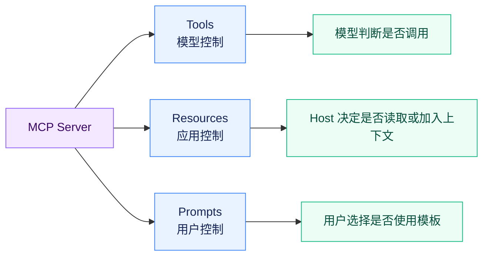
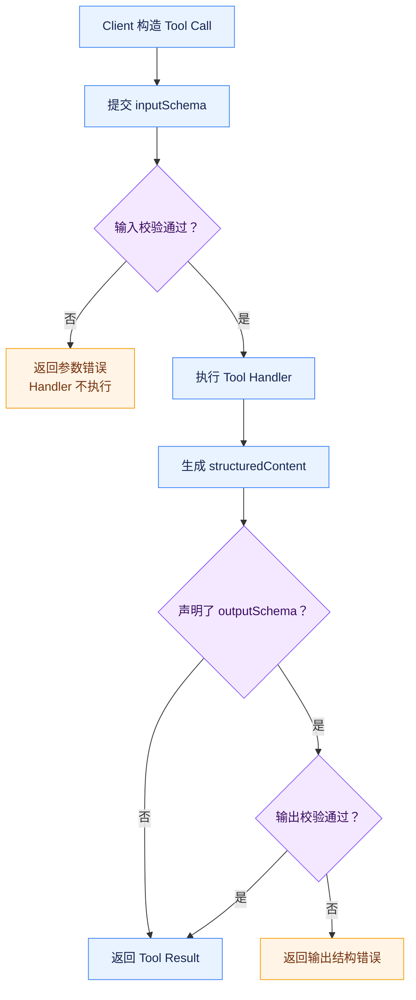
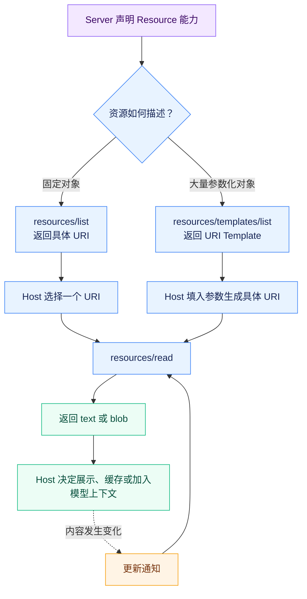
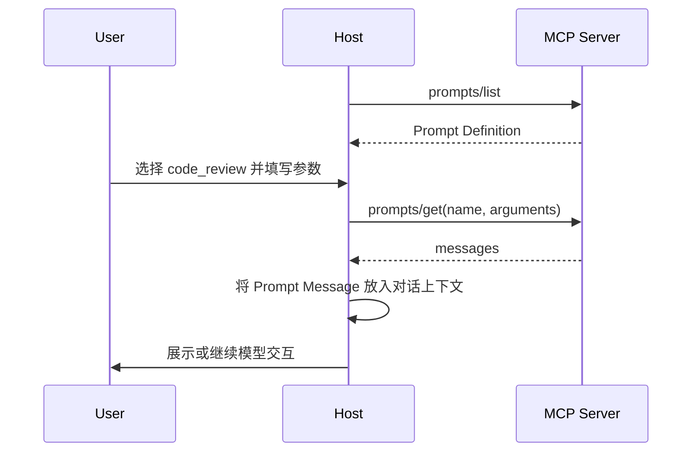

# 深入 MCP：MCP Server 是怎么描述自己能力的？

## Tools、Resources、Prompts 为什么要分成三种 Primitive？

MCP Server 最核心的三类能力是：

**Tools、Resources 和 Prompts。**

官方把它们称为 Primitive（协议原语），这里可以简单理解为：**MCP 协议预先定义好的三种基础能力模型。**

它们表面上看区别很大，但如果只从“能不能实现”的角度考虑，其实很多东西都可以全部做成 Tool。

比如读取一个项目文件，可以定义：

`read_file`

获取数据库表结构，可以定义：

`get_database_schema`

获取一段预先设计好的代码审查提示词，也可以定义：

`get_code_review_prompt`

既然都可以通过 Tool 实现，MCP 为什么还要再单独设计 Resource 和 Prompt？

因为协议真正需要表达的不只是：

> Server 能不能返回这段数据？

还需要告诉 Client：

> **这段能力应该以什么方式被发现、被选择和被使用。**

官方给三种 Primitive 定义了不同的控制模型：

* **Tools：Model-controlled（模型控制）**
* **Resources：Application-controlled（应用控制）**
* **Prompts：User-controlled（用户控制）**

这里的“控制”不是强制 UI 规则，而是在表达：

> **谁通常负责决定什么时候使用这项能力。**



Tool 更适合让模型自己决定什么时候调用。

比如模型发现用户问：

> 帮我查一下这个仓库最近有没有新的 Issue。

它可以根据当前上下文选择：

`list_issues`

Resource 不一样。

Resource 更像 Server 暴露给 Host 的一份**可寻址上下文数据**。

例如：

`file:///project/README.md`

或者：

`git://repository/history`

Host 可以把这些资源做成文件树、上下文选择器，也可以根据自己的策略自动加入模型上下文。

决定：

> 哪些 Resource 应该进入当前上下文？

通常不完全交给模型，而是由应用自己管理。

Prompt 又不同。

一个 Server 暴露：

`code_review`

Prompt，通常是希望用户主动选择：

> 我要执行“代码审查”这个预定义工作流。

它可能最终在界面里表现成：

`/code-review`

或者一个菜单按钮。

所以 MCP 把 Prompt 设计成更偏向用户主动触发的能力。

这三个控制模型背后，其实对应三种完全不同的交互语义：

**Tool：执行一个操作。**

**Resource：访问一份具有身份的数据。**

**Prompt：获取一个可以直接进入对话的预定义交互模板。**

这也是为什么 MCP 没有设计一个万能对象：

```text
Capability
```

然后所有东西都塞进去。

因为一旦这样做，Client 就必须自己猜：

> 这个 Capability 应该让模型调用吗？

> 应该展示给用户吗？

> 能不能订阅变化？

> 是不是存在一个稳定地址？

> 返回的是执行结果，还是上下文数据？

MCP 选择在协议层直接把这些语义拆开。

这不仅让 Server 更清楚自己在暴露什么，也让 Host 能够针对不同类型采用完全不同的处理方式。

当然，这种划分并不是说现实世界中的能力永远只有唯一答案。

例如：

> “读取 GitHub Issue”

既可以设计成：

`get_issue`

Tool，也可以把某个 Issue 暴露成：

`github://issues/123`

Resource。

两种方式都能返回 Issue 内容，但它们表达的协议意图不同。

Tool 在表达：

> **执行一次“获取 Issue”操作。**

Resource 在表达：

> **这里存在一份可以被定位和读取的 Issue 资源。**

## `tools/list` 返回的到底是什么？

Server 声明支持：

```json
{
  "capabilities": {
    "tools": {}
  }
}
```

以后，就意味着它实现了 MCP Tools 这套协议能力。

Client 接下来可以通过：

`tools/list`

获取当前可用的 Tool。

但 `tools/list` 返回的并不是一堆函数地址，也不是 Server 内部真实代码。

它返回的是：

> **Tool Definition（工具定义）。**

例如：

```json
{
  "name": "get_weather",
  "title": "天气查询",
  "description": "查询指定城市当前的天气信息",
  "inputSchema": {
    "type": "object",
    "properties": {
      "location": {
        "type": "string",
        "description": "城市名称"
      }
    },
    "required": ["location"]
  }
}
```

这里真正重要的是：

`name`

`description`

`inputSchema`

以及可选的：

`outputSchema`

`annotations`

`title`

`icons`

等信息。

这些字段共同回答的是：

> 这是什么能力？

> 怎样调用？

> 应该传什么？

> 可能返回什么？

Tool 的 `name` 是协议调用时真正使用的标识。

后面执行：

```text
tools/call
```

时，Client 就是通过 `name` 指定要调用哪个 Tool。

Tool Name 应该在**单个 Server 内保持唯一**。

注意是：

> 单个 Server 内。

不是整个 Host 全局唯一。

假设 Host 同时连接 GitHub Server 和 Google Drive Server，它们完全可能都暴露：

```text
search
```

对于各自 Server 来说都没有任何问题。

真正把多个 Server Tool 聚合到一起以后，才会发生：

```text
GitHub.search
GoogleDrive.search
```

这类命名冲突。

官方规范也明确提醒 Client 或 Proxy（代理层）：如果要聚合多个 Server 的 Tool，应该自己设计消歧策略，例如给 Tool Name 加上 Server 前缀。

但不能简单使用：

`serverInfo.name`

作为全局唯一标识，因为 Server 自己报告的 `name` 本身也不保证唯一。

这其实再次对应了我们第一篇讲过的架构边界：

> **Server 只需要保证自己的能力空间内部一致，多 Server 聚合问题属于 Host。**

`title` 和 `name` 也不是一个东西。

`name` 是协议标识，例如：

```text
create_issue
```

`title` 更偏向给用户看的显示名称：

```text
创建 GitHub Issue
```

`description` 也非常关键。

它不只是给开发者看的 API 文档。

当 Host 后面把 MCP Tool 转换成模型真正能够看到的 Tool Schema 时，这段 Description 很可能直接成为模型判断 “什么时候应该使用这个 Tool？”的重要依据。

所以 Tool Definition 实际上同时服务了两个消费者：

一边是程序：

> `name`、Schema、协议字段。

另一边是模型：

> `description`、参数说明以及能力语义。

这也是为什么 Tool Description 写得差，会直接影响模型的 Tool Selection（工具选择）。

Tool 还有一组：

`annotations`

可以描述一些行为特征，例如：

`readOnlyHint`

表示它是否只是读取数据；

`destructiveHint`

表示修改操作是否可能具有破坏性；

`idempotentHint`

表示同样参数重复执行是否具有幂等性，也就是重复执行是否产生相同效果；

`openWorldHint`

则帮助 Client 判断这个 Tool 是否可能和开放的外部世界发生交互。

但这里一定要注意：

> **Annotation 是 Hint（提示），不是安全保证。**

官方 Schema 明确强调这些字段不能被认为一定真实。

一个恶意 Server 完全可以给：

`delete_database`

写上：

```text
readOnlyHint = true
```

所以 Client 可以用这些信息改善 UI 和默认交互，但不能仅凭 Server 自己声明的 Annotation 就跳过安全确认。

这和前面讲 `serverInfo` 时的原则其实一样：

> **自我声明的信息可以辅助理解，但不能自动升级成可信安全事实。**

## 为什么 Tool 的输入和输出都要用 JSON Schema？

如果 Tool 只有：

```text
name
description
```

模型可能知道“这个工具是干什么的”，但仍然不知道：

> 到底应该怎样构造参数？

例如：

`create_issue`

可能需要：

```json
{
  "owner": "itkdm",
  "repo": "aiagentguide",
  "title": "xxx",
  "body": "xxx"
}
```

但如果协议只是告诉模型：

> 请传几个 JSON 参数。

问题马上就来了：

`owner` 是 string 还是 number？

`title` 必填吗？

有没有枚举值？

数组内部是什么结构？

对象还允许哪些字段？

MCP 没有重新发明一套参数类型描述语言，而是直接采用 **JSON Schema（JSON 数据结构约束规则）**。

当前 Tool 可以通过：

`inputSchema`

描述输入。

如果没有显式声明 `$schema`，当前规范默认按照：

**JSON Schema 2020-12**

解释。

例如：

```json
{
  "type": "object",
  "properties": {
    "query": {
      "type": "string"
    },
    "limit": {
      "type": "integer",
      "minimum": 1,
      "maximum": 100
    }
  },
  "required": ["query"]
}
```

这已经不仅仅是在告诉模型：

> 有 `query` 和 `limit` 两个参数。

它同时给出了：

类型、必填关系、取值范围

这些可以被程序直接验证的约束。

这就是 JSON Schema 最大的价值：

> **它既可以作为机器能够理解的类型契约，又足够通用，不需要 MCP 自己维护一套类型系统。**

当前 `2026-07-28` 还进一步放宽了 Tool Schema。

早期实现更容易把 `inputSchema` / `outputSchema` 理解成比较简单的 Object Schema，但新版明确允许使用 JSON Schema 2020-12 中更加完整的关键字，包括 `$ref`、组合 Schema 等能力。

也就是说，一个复杂 Tool 不必把所有结构重复展开：

```text
User
Address
Permission
...
```

完全可以通过标准 JSON Schema 的引用和组合机制表达。

对于完全没有参数的 Tool，规范也没有建议直接把`inputSchema`省掉。

因为 Tool Definition 仍然需要明确表达：

> 这个 Tool 接受怎样的参数结构。

官方推荐的无参数形式是：

```json
{
  "type": "object",
  "additionalProperties": false
}
```

它明确表达：

> 参数是一个空对象，而且不能随便再塞其他字段。

相比：

```json
{
  "type": "object"
}
```

前者约束更加准确。

Tool 的输出同样可以通过：

`outputSchema`

描述。

为什么结果也需要 Schema？

因为只约束输入还不够。

假设：

`get_user`

声称返回：

```json
{
  "id": "123",
  "name": "小明",
  "email": "xxx@example.com"
}
```

但 Server 某次突然返回：

```json
{
  "username": 123
}
```

如果后续程序还要把这个结果交给另外一个 Tool，或者写入数据库，那么输出结构的不稳定同样会造成问题。

因此：

`inputSchema`

约束：

> 调用者应该传什么。

`outputSchema`

描述：

> Server 应该返回什么结构化结果。



## 为什么 Tool Result 同时需要 `content` 和 `structuredContent`？

一个 Tool 执行完成以后，最简单的结果可以直接是一段文字：

```json
{
  "content": [
    {
      "type": "text",
      "text": "东京当前温度为 26°C"
    }
  ]
}
```

`content` 并不限于纯文本。

它还可以包含：

Text、Image、Audio、Resource Link、Embedded Resource

等不同 Content Block（内容块）。

也就是说，`content` 的目标更偏向：

> **给模型或者用户直接消费。**

例如一个图片分析工具可以直接返回图片；

一个文件生成工具可以返回 Resource Link（资源链接）；

一个搜索 Tool 可以返回多段文本。

但如果 Tool Result 还要被程序继续处理，只返回自然语言就会很麻烦。

假设：

`get_weather`

返回：

> 东京现在 26°C，天气晴朗，湿度 62%。

对于 LLM 来说完全够用。

但如果下一个 Tool 需要读取：

```text
temperature
humidity
```

程序就不得不重新从自然语言里解析。

这显然不可靠。

所以 MCP 同时支持：

`structuredContent`

也就是**结构化结果**。

例如：

```json
{
  "content": [
    {
      "type": "text",
      "text": "东京当前 26°C，天气晴朗，湿度 62%。"
    }
  ],
  "structuredContent": {
    "temperature": 26,
    "condition": "sunny",
    "humidity": 62
  }
}
```

这两个字段并不是重复设计。

`content`

更适合：

> 人和模型理解。

`structuredContent`

更适合：

> 程序继续处理。

如果 Tool 定义了：

`outputSchema`

那么 `structuredContent` 就应该符合这份 Schema。

例如：

```json
{
  "type": "object",
  "properties": {
    "temperature": {
      "type": "number"
    },
    "condition": {
      "type": "string"
    },
    "humidity": {
      "type": "number"
    }
  },
  "required": [
    "temperature",
    "condition"
  ]
}
```

需要注意一点：

> MCP 的 `structuredContent` 和我们平时说的大模型 Structured Output（结构化生成）不是一个东西。

Structured Output 通常是：

> 约束 LLM 必须按照某个 Schema 生成结果。

MCP `structuredContent` 则是：

> **Tool Server 已经执行完成以后，返回给 Client 的结构化数据。**

数据生产者不同。

一个是模型。

一个是 Tool。

当前协议允许 `structuredContent` 是任意合法 JSON 值，而不只是 Object：

Array、String、Number、Boolean、Null

都可以。

如果 Tool 定义了 `outputSchema`，那么结果只需要满足对应 Schema 即可。

这对于：

```text
list_users
```

这类天然返回数组的 Tool 就很合理。

没有必要为了“顶层必须是 Object”，强行包装成：

```json
{
  "users": [...]
}
```

还有一个兼容性问题。

目前规范建议：

> 如果 Tool 返回了 `structuredContent`，同时最好把序列化后的 JSON 也放进 Text Content。

原因是旧版 Client 或者一些只认识 `content` 的上层集成，可能根本不会读取：

`structuredContent`

所以一个结果可以同时保留：

**给旧 Client / LLM 看的文本版本**

和：

**给程序消费的结构化版本**

## Resource 为什么要用 URI，而不是也设计成一个 Tool？

Tool 的核心身份是：

```text
name
```

Resource 的核心身份却是：

**URI（统一资源标识符）。**

例如：

```text
file:///project/src/main.ts
```

Resource 为什么不也设计成：

```text
name = project_main_file
```

因为 Resource 要表达的并不只是：

> “我有一个读取文件的能力。”

它更重要的是：

> **这里存在一个可以被稳定定位的数据对象。**

这和函数调用完全不同。

一个：

`read_file`

Tool 表达的是操作：

> 给我一个 path，我帮你执行读取。

而：

```text
file:///project/src/main.ts
```

表达的是身份：

> 这是一个具体资源。

一旦数据具有稳定身份，很多能力就自然出现了。

Client 可以：

`resources/list`

发现它；

通过：

`resources/read`

读取它；

可以把这个 URI 存下来；

可以在 Prompt 或 Tool Result 里返回这个 URI；

甚至可以订阅它的变化。

所以 URI 其实给 Resource 建立了一种统一的：

> **寻址模型。**

这也是为什么 Resource 不要求一定对应真实文件。

规范里的：

`file://`

只是在表达：

> 这份 Resource 的行为类似文件系统资源。

它并不要求背后真的存在一块物理磁盘。

一个 Server 完全可以把数据库里的虚拟目录暴露成：

```text
file:///reports/2026/september.md
```

同样，自定义 Server 也可以设计：

```text
github://repo/itkdm/aiagentguide/issues/123
```

只要符合 URI 规范即可。

当前 MCP 还定义了一些常见 Scheme（URI 方案），例如：

`https://`

`file://`

`git://`

也允许 Server 自己定义 Scheme。

其中 `https://` 有一个很重要的语义。

如果 Resource 使用：

```text
https://example.com/report.pdf
```

规范建议只有在 Client 可以**直接通过 Web 获取这个资源**时才这样使用。

如果真正读取内容仍然必须经过 MCP Server：

`resources/read`

那么最好使用其他 URI Scheme。

原因也很好理解。

看到：

`https://`

Client 会自然认为：

> 这个 URI 本身就是一个可以直接访问的 Web 资源。

URI Scheme 不只是字符串前缀，它实际上会影响 Client 对资源寻址方式的理解。

Resource 的内容也不一定只返回一段数据。

一次：

`resources/read`

可以返回多个 Resource Content。

比如读取：

```text
file:///project/src/
```

Server 完全可以把这个目录对应的多个文件一起返回。

文本 Resource 使用：

`text`

Binary Resource（二进制资源）则可以使用 Base64 编码后的：

`blob`

并配合：

`mimeType`

告诉 Client内容是什么媒体类型。

所以 Resource 真正建立的是：

> **身份 → 寻址 → 读取 → 内容类型 → 更新**



这样一条完整的数据模型。

如果数据根本没有必要被 Host 独立发现、选择、引用或者订阅，那么专门设计 Resource 反而会增加复杂度。

## Resource Template 为什么还要单独存在？

Resource 有一个明显问题。

假设 GitHub Server 可以读取：

```text
github://repos/{owner}/{repo}/issues/{issueNumber}
```

全世界可能有几百万甚至几亿个符合这个结构的 Resource。

难道：

`resources/list`

要把所有可能的 URI 全部列出来吗？

当然不可能。

这时候就需要：

**Resource Template（资源 URI 模板）。**

例如：

```text
github://repos/{owner}/{repo}/issues/{issueNumber}
```

这不是一个具体 Resource。

因为：

`owner`

`repo`

`issueNumber`

都还没有确定。

它表达的是：

> **符合这个 URI 规则的一整类 Resource。**

客户端可以通过：

`resources/templates/list`

获取这些模板。

真正填入：

```text
owner = itkdm
repo = aiagentguide
issueNumber = 123
```

以后，才能得到：

```text
github://repos/itkdm/aiagentguide/issues/123
```

这样的具体 Resource URI。

Resource Template 使用的是标准的 **URI Template** 机制，而不是 MCP 自己设计：

```text
{xxx}
```

替换语法。

当前规范使用 RFC 6570 的 URI Template。

Resource Template 真正解决的是：

> **Resource Space（资源空间）太大，无法枚举。**

例如：

数据库表：

```text
database://tables/{table}
```

Git Commit：

```text
git://commits/{sha}
```

用户文档：

```text
docs://users/{userId}/{documentId}
```

这些资源都不是一个有限、固定的小列表。

如果只能依赖：

`resources/list`

要么列表大到不可接受，要么 Server只能暴露很小一部分资源。

Template 则让 Server 直接描述：

> “我能访问哪一类地址。”

另外，Resource Template 参数还可以和 MCP Completion API（补全接口）结合。

例如用户输入：

```text
github://repos/itkdm/
```

Host 可以让 Server帮助补全 Repo Name。

这让 Resource Template 不只是一份协议描述，也可以进一步参与真正的 UI 交互。

不过它仍然不是 Tool。

因为 Resource Template 最终生成的结果是：

**URI**

而不是：

**执行一个函数。**

## Prompt 为什么会成为 MCP 的一等能力？

很多人第一反应都会是：

> Prompt 不就是一段字符串吗？

如果只是固定写一句：

> 请帮我审查下面这段代码。

确实没有必要专门设计一套协议。

但 MCP Prompt 真正表达的不是一段静态文字，而是：

> **Server 可以向 Host 提供的一组可发现、可参数化、结构化的对话模板。**

例如 Server 可以声明：

```json
{
  "name": "code_review",
  "title": "代码审查",
  "description": "检查代码质量并给出改进建议",
  "arguments": [
    {
      "name": "code",
      "description": "需要审查的代码",
      "required": true
    }
  ]
}
```

Client 可以先通过：

`prompts/list`

发现它。

用户真正选择：

`code_review`

以后，Client 再调用：

`prompts/get`

并传入对应参数。



Server 最终返回的也不是单纯：

```text
string
```

而是：

```text
messages
```

例如：

```json
{
  "messages": [
    {
      "role": "user",
      "content": {
        "type": "text",
        "text": "请审查下面这段代码：..."
      }
    }
  ]
}
```

这里最大的区别就在于：

> **Prompt 是对话结构，而不只是文本。**

Prompt Message 可以有：

`user`

或者：

`assistant`

Role（角色）。

Content 也不只支持 Text。

还可以包含：

Image、Audio、Resource Link、Embedded Resource

等内容。

这意味着 Server 完全可以定义一套更完整的交互上下文。

例如：

> 先给模型一段用户问题，再附带一个 Resource，再附带图片。

如果 Prompt 只是一个字符串字段，这些结构都会丢失。

那为什么这件事不能由 Tool 完成？

当然可以写一个：

```text
generate_code_review_prompt
```

Tool。

但这样以后，从协议层看，它只是一个：

> 模型可以调用的函数。

Host 不知道：

> 这是一个更适合展示给用户主动选择的 Prompt Template（提示词模板）。

所以 Prompt 成为独立 Primitive 的价值并不主要是：

> “MCP 能帮你存 Prompt。”

真正的价值是：

> **MCP 给预定义交互模板建立了一个标准发现和调用协议。**

Host 可以把它做成：

Slash Command（斜杠命令）

菜单项

模板选择器

工作流入口

而不需要知道 Server 内部怎样生成 Prompt。

官方把 Prompt 定义为 User-controlled，也是这个原因：

> 用户通常主动决定什么时候使用这个模板。

这里要注意，User-controlled 指的是：

> 谁决定使用它。

不是：

> 谁编写 Prompt 内容。

真正的 Prompt 内容仍然由 Server 定义。

例如 GitHub Server 完全可以提供：

```text
summarize_pull_request
```

Prompt。

用户只是主动选择：

> 我要使用这个 Prompt。

具体里面如何组织消息、引用哪些 Resource，仍然由 Server 决定。

所以三种 Primitive 的边界到这里其实已经很清楚了：

**Tool 定义“可以做什么”。**

**Resource 定义“有什么数据可以访问”。**

**Prompt 定义“可以怎样开始一次预定义交互”。**

## 补充

即使看完上面的介绍，Resource 仍然可能比较抽象。相比之下，Tools 和 Prompts 已经能解决很多常见问题，而 Resource 在实际项目中的使用场景相对少一些。下面用一个真实案例，再具体说明 Resource 到底解决什么问题。

Mapbox MCP Server 将地点分类字典暴露为一个 Resource：

`mapbox://categories`

假设用户说：“帮我找附近的餐厅。”Host 可以先通过 `resources/list` 发现这份 Resource，再通过 `resources/read` 读取其中的分类字典，确认餐厅对应的分类 ID 是 `restaurant`。之后，Host 才把这个 ID 作为参数传给 Mapbox 的地点搜索 Tool。

```text
resources/list
    ↓
发现 mapbox://categories
    ↓
resources/read
    ↓
读取分类字典，得到 restaurant
    ↓
调用地点搜索 Tool，传入 category = restaurant
```

这里的 Resource 不是“执行一次搜索”，读取它也不会产生搜索副作用。它提供的是一份由 Server 维护的、可被重复读取的参考数据；Tool 负责执行动作，Resource 负责提供搜索所需要的数据。
