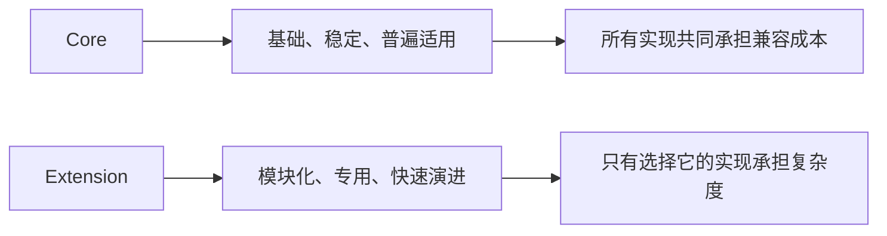
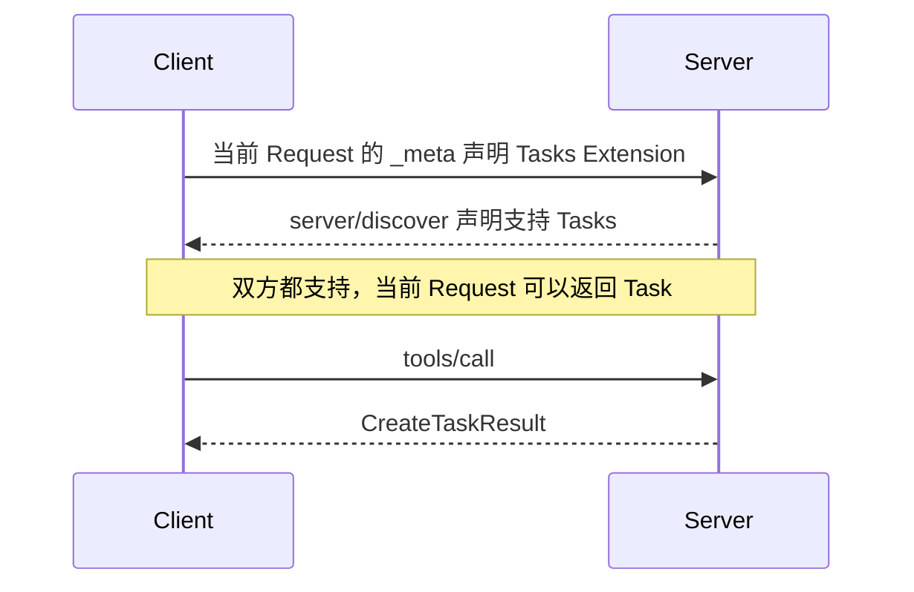
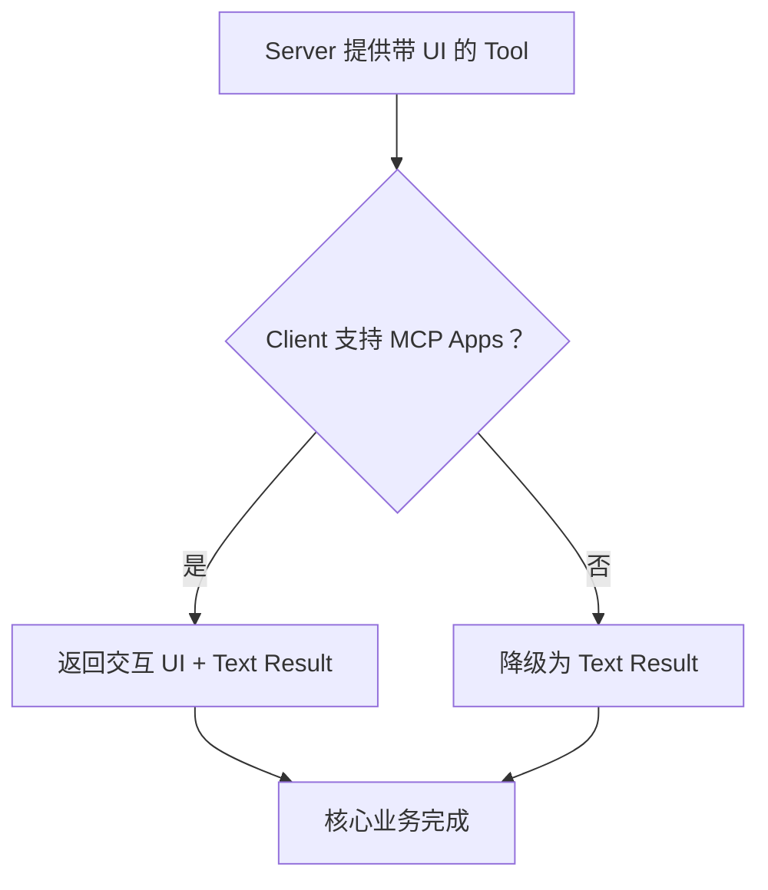
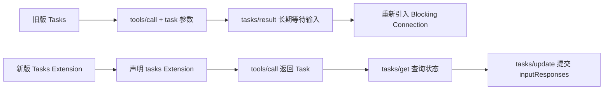

---

title: 深入 MCP：为什么 MCP 要把能力拆成 Core 和 Extension？
description: "从协议稳定性、扩展协商、优雅降级和 Tasks 的演进出发，深入理解 MCP 为什么要把能力拆分为 Core 和 Extension。"
summary: 深入分析 MCP Extension Framework 的设计动机、能力协商、版本演进和兼容策略，并通过 Tasks 从 Core 移入 Extension 的过程理解扩展机制真正解决的问题。
keywords:
- 深入 MCP
- MCP Extension
- MCP Tasks
tags:
  - AI Agent
  - 原理
  - MCP
author: 布吉岛
lastUpdated: 2026-09-14
status: draft
draft: true
assets: none
reviewed: false
sourceType: original
noindex: true

---

# 深入 MCP：为什么 MCP 要把能力拆成 Core 和 Extension？

其实一个协议刚出现的时候，功能通常不多。

只需要解决：

```text
双方怎么建立通信
消息长什么样
有哪些基本能力
怎么调用
```

就够了。

但随着生态发展，很快就会出现新的需求：

```text
长时间异步任务

交互式 UI

企业统一授权

Agent Skills

行业专用能力
```

如果新需求成熟一个，就往 MCP Core 里加一个，那么 Core 很快就会越来越大。

最后可能出现这样的情况：

一个只想实现：

```text
tools/list
tools/call
```

的简单 Server，却也必须理解：

```text
Tasks
UI
企业授权
Skills
各种行业扩展
```

即使这些能力它永远不会使用。

所以协议设计真正困难的地方，不是：

```text
怎样不断加入新功能。
```

而是：

```text
哪些能力值得让整个生态永久承担兼容成本，哪些能力应该允许独立发展。
```

这就是 MCP Extension Framework（扩展框架）存在的真正原因。

## 为什么不能把所有成熟功能都直接塞进 MCP Core？

先假设 MCP 出现了一个非常有价值的新能力：

```text
Task
```

它可以让一个 Tool 调用：

```text
开始执行
    ↓
立即返回 taskId
    ↓
后台继续运行
    ↓
Client 后续查询结果
```

显然很有价值。

那么是不是意味着：

```text
Tasks 应该直接成为所有 MCP 实现都必须理解的 Core Feature （核心功能）？
```

不一定。

因为一个能力进入 Core，并不是简单增加几个 JSON 字段。

它意味着整个生态长期都要理解它。

包括：

```text
Specification
Schema
SDK
Client
Server
Conformance Test
Gateway
Proxy
Debugger
Observability Tool
```

甚至未来所有新版本都要考虑：

```text
这个功能以前的语义还能不能继续工作？
```

这就是 Core 的兼容成本。

###  实际上 Core 是一份长期承诺

例如：

```text
tools/call
```

已经属于 Core。

那么以后 MCP 即使继续演进，也不能轻易说：

```text
这个方法不好用了，删掉吧。
```

因为可能已经有：

```text
几十个 SDK
几百个 Host
几万个 Server
```

依赖它。

所以一个能力进入 Core，本质上意味着：

```text
协议向整个生态承诺，未来会长期维护这套语义。
```

这和普通应用增加一个 Feature 完全不同。

应用自己的 API 可以：

```text
v1 deprecated
v2 migration
v3 remove
```

但基础协议如果频繁这样做，整个生态就会不断碎裂。

所以真正应该进入 Core 的能力，通常至少需要满足几个条件：

```text
足够通用

大部分实现都有价值

语义已经比较稳定

长期兼容成本值得承担
```

而不是：

```text
这个功能看起来很高级。
```

比如：

```text
MCP Apps （这里先不展开讲解，大白话其实就是server返回了HTML，然后渲染到了host，同时拥有双向通信能力）
```

很有价值。

但很多 CLI Agent 根本没有 UI Renderer。

```text
Enterprise-Managed Authorization
```

很有价值。

但一个个人本地 stdio Server 根本不需要企业统一身份管理。

```text
Skills over MCP
```

可能成为重要能力。

但不是每一个 MCP Server 都需要提供 Agent Skill。

如果这些全部直接进入 Core：

```text
协议就会逐渐把“可选生态能力”变成“所有实现的永久负担”。
```

因此 Extension 的第一层价值就是：

```text
把 Core 的稳定面和生态的创新面拆开。
```



Core 尽量只保存真正基础、稳定、普遍适用的协议能力。

而：

```text
模块化能力

专用能力

仍在快速演进的能力
```

则可以进入 Extension。

所以 Extension 并不是：

```text
不够重要的功能才放这里。
```

恰恰相反。

有些能力可能非常重要，只是：

```text
现在还没有成熟到值得冻结进 Core。
```

## Extension 和普通 Capability 到底有什么区别？

前面已经见过很多 Capability：

```text
tools

resources

prompts
```

Server 会声明：

```text
我支持哪些能力。
```

Client 也会声明自己的 Capability。

那么既然已经有 Capability，为什么还需要 Extension？

因为它们解决的问题并不完全一样。

### Core Capability 只是 Core 内部的能力开关

例如 Server 声明：

```json
{
  "capabilities": {
    "tools": {},
    "resources": {}
  }
}
```

这里表达的是：

```text
当前这个 Server 支持 MCP Core 已经定义好的 Tools 和 Resources。
```

双方都已经知道：

```text
tools
```

是什么。

Capability 只是在回答：

```text
你支不支持？
```

但 Extension 不一样。

例如：

```json
{
  "extensions": {
    "io.modelcontextprotocol/tasks": {}
  }
}
```

这里实际上是在说：

```text
我支持一整套 Core 之外的额外协议语义。
```

这套 Extension 可能新增：

```text
新的 Method

新的 Result Shape

新的 State Machine

新的字段

新的生命周期
```

例如 Tasks 会引入：

```text
tasks/get
tasks/update
tasks/cancel
```

还会让原本：

```text
tools/call
```

除了返回：

```text
resultType = complete
```

之外，还可能返回：

```text
resultType = task
```

所以：

```text
tools capability
```

和：

```text
tasks extension
```

不是一个层级的东西。

前者是：

```text
Core 已知能力的支持情况。
```

后者是：

```text
额外协议模块是否存在。
```

### 为什么 Extension Identifier 必须带 Vendor Prefix？

Extension 使用：

```text
{vendor-prefix}/{extension-name}
```

例如官方扩展：

```text
io.modelcontextprotocol/tasks
```

第三方可能使用：

```text
com.example/vector-search
```

为什么不能直接`tasks`、`ui`、`memory`？

因为 Extension 是开放生态。

假设：

```text
Company A
```

定义：

```text
memory
```

表示：

```text
长期 Agent Memory。
```

Company B 也定义：

```text
memory
```

但它表示：

```text
Server 内存统计信息。
```

如果都叫：

```text
memory
```

Client 根本无法判断是哪套协议。

所以 Vendor Prefix 的作用和 Java Package 非常类似：

```text
com.example.xxx
```

把命名空间绑定到一个明确的扩展所有者。

官方 MCP Extension 使用：

```text
io.modelcontextprotocol/
```

第三方则应该使用自己控制的域名反写前缀。

这样不同组织就可以独立扩展，而不会互相撞名。

### `_meta` 和 Extension 又有什么区别？

MCP 本身还支持：

```text
_meta
```

例如一个 Server 完全可以放：

```json
{
  "_meta": {
    "com.example/foo": "bar"
  }
}
```

那是不是所有扩展需求都可以塞进 `_meta`？

也不行。

`_meta` 更适合：

```text
附加信息。
```

比如某个自己的 Host 和 Server 都理解：

```text
com.example/internal-trace-id
```

完全没问题。

但如果一种能力会改变：

```text
Method
Result Shape
执行生命周期
双方行为
```

那么它实际上已经不是：

```text
“附带一个字段”。
```

而是在定义：

```text
一套双方共同理解的协议。
```

这时候就更适合使用正式 Extension。

简单来说`_meta`更像我额外带一点数据

而`Extension`更像我们双方额外实现了一套协议能力

## 为什么 Extension 必须显式协商，而不能“收到以后不认识就忽略”？

假设 Server 支持 Tasks。

它处理：

```text
tools/call
```

时发现这个操作需要一个小时。

于是直接返回：

```json
{
  "resultType": "task",
  "taskId": "task-123"
}
```

问题是：

```text
如果 Client 根本不知道 Tasks Extension 怎么办？
```

它原来可能只实现：

```text
tools/call
    ↓
CallToolResult
```

突然收到：

```text
CreateTaskResult
```

完全不知道：

```text
taskId
```

后面应该拿去做什么。

此时**整个 Result 的语义已经改变。**

所以 Extension 不能通过：

> “我先发，你不认识就算了。”

这种方式演进。

它必须先确认双方共同支持。

### Client 怎样声明 Extension？

现代 MCP 是 Per-request Capability（每请求能力声明）。

Client 会在 Request 的：

```text
_meta
```

中携带：

```text
io.modelcontextprotocol/clientCapabilities
```

其中可以声明：

```json
{
  "extensions": {
    "io.modelcontextprotocol/tasks": {}
  }
}
```

意思是：

```text
当前这一条 Request，如果你需要使用 Tasks Extension，我能够理解。
```

注意：

```text
是当前 Request。
```

而不是：

```text
我连接的时候说过一次，以后你永远记住。
```

这和现代 MCP Stateless（无状态）的设计完全一致。

Server 不应该依赖：

```text
上一个 Request
```

保存的隐藏协商状态。

### Server 怎么声明？

Server 则通过：

```text
server/discover
```

返回：

```json
{
  "capabilities": {
    "extensions": {
      "io.modelcontextprotocol/tasks": {}
    }
  }
}
```

告诉 Client：

```text
我可能会使用 Tasks。
```

于是：

```text
Client 支持 Tasks
+
Server 支持 Tasks
```

双方才真正有能力使用这一套 Extension。



### 为什么 Server 不能因为以前见过就直接返回 Task？

这是非常重要的一点。

假设：

```text
Request A
```

Client 声明了：

```text
io.modelcontextprotocol/tasks
```

五分钟以后：

```text
Request B
```

没声明。

Server 不能说：

```text
我记得这个 Client 以前支持，所以这次继续返回 Task。
```

因为现代 MCP 不应该把：

```text
Client Capability
```

当作 Connection Session State。

尤其在：

```text
HTTP Load Balancer
Multi-instance Server
Stateless Deployment
```

环境中，Request B 甚至可能落到另一台实例。

所以 Capability 必须跟着 Request 自己走。

Tasks Extension 明确要求：

```text
如果当前 Client Request 没声明 Tasks，Server 就不能返回 CreateTaskResult。
```

如果 Server 当前操作必须使用 Task 才能完成，就应该明确返回：

```text
Missing Required Client Capability
```

而不是偷偷发一个对方不理解的结果。

这就是 Extension Negotiation（扩展协商）的真正作用：

```text
不是问双方“喜不喜欢”这个能力，而是防止协议双方对同一条消息产生不同理解。
```

## 一方不支持 Extension 时，为什么优雅降级比报错更重要？

Extension 如果是 Optional（可选）的，就一定会面对：

```text
Client 支持
Server 不支持
```

或者：

```text
Server 支持
Client 不支持
```

的情况。

如果每一个 Extension 都设计成：

```text
不支持就彻底不能工作。
```

那么 Extension 很快会形成新的生态碎片。

比如：

```text
Client A
支持 Extension 1、2

Client B
支持 Extension 2、3

Server X
需要 Extension 1
```

结果不同实现之间出现大量：

```text
能连
不能连
一半能用
完全不能用
```

最终 Optional Extension 实际上就变成：

```text
隐式 Core。
```

所以一个好的 Extension 必须非常认真地考虑：

**Graceful Degradation（优雅降级）**

也就是：

```text
对方不支持时，有没有 Core Behavior 可以退回？
```

### MCP Apps 是一个直观例子

假设一个 Tool 可以返回：

```text
交互式图表
```

支持 MCP Apps 的 Client 可以直接渲染。

但一个普通命令行 Client 根本没有 UI。

如果 Server 因此直接说：

```text
你不支持 Apps，所以整个 Tool 不能调用。
```

很多情况下并不合理。

更好的设计可能是：

```text
支持 Apps
    ↓
交互 UI + Text Result
```

不支持 Apps：

```text
不支持 Apps
    ↓
只返回 Text Result
```

核心业务仍然能完成。

Extension 只是提供更丰富体验。

这才真正符合：

```text
Optional。
```



### 但并不是所有 Extension 都能降级

例如一个企业 MCP Server 明确规定：

```text
所有访问必须经过 Enterprise Authorization Extension。
```

那一个不支持这个 Extension 的 Client 根本无法安全访问。

这时候就应该明确拒绝。

所以 Extension Framework 的原则不是：

```text
永远必须降级。
```

而是：

```text
有合理 Core Fallback
→ 应该降级

Extension 是正确执行的必要条件
→ 明确拒绝
```

关键是：

```text
Extension Spec 必须把不支持时的行为也设计清楚。
```

不能只写：

```text
支持时怎么运行。
```

却完全不说明：

```text
不支持会发生什么。
```

否则所谓 Extension 兼容性只存在于纸面上。

## 为什么 Extension 可以比 Core 更快演进？

这是 Extension 最重要的架构价值之一。

Core Protocol 的 Release 非常重。

因为一个 Core Change 可能影响：

```text
所有 SDK

所有 Client

所有 Server

所有 Gateway
```

所以修改 Core 必须非常谨慎。

但一个新能力通常需要不断试错。

例如刚出现时，你可能认为：

```text
需要 Method A
需要 Method B
需要字段 C
```

真正放到生产环境以后才发现：

```text
Method A 根本不需要

字段 C 的语义不够

还需要支持新的生命周期
```

如果每一次实验都要：

```text
发布一个新的 MCP Core Version。
```

整个生态会被快速拖垮。

Extension 则拥有自己的：

```text
Repository
Maintainer
Release Cadence
Version
```

它可以独立于 Core 演进。

例如：

```text
Core = 2026-07-28
```

并不意味着：

```text
Tasks
Apps
Skills
```

都必须同时冻结在某一个完全相同的版本。

这些 Extension 可以独立更新。

这就是：

```text
Extension Version 和 Core Protocol Version 是两个不同维度。
```

### 独立演进不等于可以随便 Breaking

Extension 依然必须考虑 Backward Compatibility（向后兼容）。

如果只是：

```text
增加 Optional Field

修复 Bug

增加不破坏旧实现的新能力
```

完全可以在原 Extension 中继续演进。

但如果发生：

```text
删除字段

改变字段类型

改变原来的语义

新增必须字段
```

这种 Breaking Change，就不能假装旧 Client 还能正常工作。

这时更合理的方式可能是使用新的 Identifier：

```text
io.modelcontextprotocol/example
```

变成：

```text
io.modelcontextprotocol/example-v2
```

旧 Client：

```text
只认识 v1
```

新 Client：

```text
可以声明 v2
```

双方能力仍然可以明确协商。

### 为什么 SDK 也不被强迫实现所有 Extension？

这同样很重要。

如果：

```text
官方 Extension
```

就等于：

```text
所有官方 SDK 必须实现。
```

那实际上它依然和 Core 没什么区别。

所以当前 Extension Framework 明确允许：

```text
SDK 自己决定支持哪些 Extension。
```

而且 Extension：

```text
默认关闭
```

需要开发者显式启用。

这保证：

```text
Extension 的存在本身不会改变一个普通 MCP 实现的行为。
```

也就是说，Extension 真正做到的是：

```text
协议可以继续创新

但没有选择这个创新的人
不需要被迫承担它
```

## Tasks 为什么是理解 Extension 价值最好的案例？

如果只看 Extension Framework 的定义，很容易觉得：

```text
不就是 Plugin System 吗？
```

Tasks 的演进过程更能说明为什么 MCP 真正需要它。

Tasks 并不是一开始就作为 Extension 出现的。

`2025-11-25` 版本里，已经存在一版实验性 Tasks。

它试图解决的问题很合理：

```text
Tool 调用可能执行几分钟甚至几小时，不能永远把普通 Request 挂着。
```

例如：

```text
部署 Kubernetes 集群

运行 CI Pipeline

批量处理 100 万条数据

等待人工审批
```

都不适合：

```text
tools/call
    ↓
HTTP Connection 挂一个小时
    ↓
CallToolResult
```

所以 Task 的基本想法是：

```text
先返回一个 Handle，再异步获取结果。
```

问题并不在这个想法。

而在：

```text
第一版具体怎么实现。
```

### 第一版 Tasks 的协商太复杂了

旧设计同时存在：

```text
Method-level Task Capability

Tool.execution.taskSupport

Request 上的 task 参数
```

Client 想调用一个支持 Task 的 Tool，可能首先需要知道：

```text
Method 支不支持？
```

然后还要知道：

```text
当前具体 Tool 支不支持？
```

所以 Client 可能必须先：

```text
tools/list
```

拿到 Tool Definition。

再判断：

```text
execution.taskSupport
```

然后决定：

```text
这次 Request 能不能带 task。
```

这意味着：

```text
一次 Tool Call 开始依赖之前的 Discovery State。
```

对应用开发者来说很复杂，对后来的 Stateless MCP 也越来越不协调。

新版 Tasks 把这件事明显简化了。

现在 Client 只需要声明：

```text
io.modelcontextprotocol/tasks
```

Server 就知道：

```text
如果这次操作适合异步化，我可以返回 Task。
```

不需要 Client 提前判断：

```text
这个 Tool 会不会创建 Task？
```

Server 自己根据这一次 Request 决定。

所以：

```text
Client Capability
```

表达的不是：

> “请一定给我 Task。”

而是：

> **“如果你返回 Task，我能理解。”**

### `tasks/result` 为什么成了一个 Blocking Trap？

旧版还有一个很有意思的问题。

Task 本来是为了：

```text
不要让 Request 长时间挂着。
```

但如果 Task 中途需要用户输入：

```text
input_required
```

旧机制又需要 Client 调：

```text
tasks/result
```

建立一条长期 SSE Stream。

Server 再通过这条 Stream 发 Elicitation / Sampling。

也就是说：

```text
为了避免 Blocking
发明 Task

Task 中途要交互
又重新建立 Blocking Connection
```

设计开始自己和自己打架。

而 MCP 后来的架构又发生了几个关键变化：

```text
Stateless

MRTR

Server 不再独立向 Client 发 Request
```

旧 Tasks 的很多设计基础自然就不再成立。

新版于是改成：

```text
tasks/get
```

发现：

```text
status = input_required
```

并拿到：

```text
inputRequests
```

Client 再用：

```text
tasks/update
```

把：

```text
inputResponses
```

提交回来。

整个过程依然是：

```text
Client 发 Request
Server 返回 Result
```

不需要重新制造一条反向 RPC 或长时间阻塞的通信通道。



这明显更符合现代 MCP。

### 为什么 `tasks/list` 也遇到了麻烦？

表面上：

```text
tasks/list
```

非常合理。

Client 说：

```text
把我的所有 Task 给我。
```

问题是：

```text
“我的”到底是谁？
```

以前可以想象绑定：

```text
Session
```

但现代 MCP 已经逐渐从 Core 中移除 Protocol Session。

那么一台多租户 Server：

```text
User A
User B
Client C
Client D
```

收到：

```text
tasks/list
```

到底应该返回哪些 Task？

按`Authorization Subject`？

按`Client ID`？

按`Tenant`？

还是某个业务 Workspace？

不同 Server 的权限模型可能完全不一样。

协议层很难替所有实现定义一个统一 Scope。

更糟糕的是：

```text
如果 Scope 定义错了，就可能把别人的 Task 暴露出去。
```

所以新版 Tasks 更倾向于：

```text
taskId
```

作为一个独立 Durable Handle（可持久化句柄）。

Client 已经知道：

```text
task-abc123
```

就可以：

```text
tasks/get
tasks/update
tasks/cancel
```

操作这一条 Task。

而不是假设 Server 一定能安全回答：

> “把当前调用者所有 Task 全列出来。”

这里体现的其实也是现代 MCP 的一个重要趋势：

```text
尽量减少隐含 Connection State，把关联关系变成显式 Handle。
```

### Task 和 Progress 到底有什么区别？

前面的文章已经讲过 Progress。

一个操作时间很长，我一直发 Progress 不就行了吗？

区别在于：

**Progress 属于当前仍然活着的 Request。**

```text
Request
    ↓
Progress
    ↓
Progress
    ↓
Response
```

如果 Client Disconnect：

```text
这次 Request 没了
```

Progress 的生命周期也就结束了。

Task 则不同。

Server 返回：

```text
taskId = task-123
```

以后：

```text
原始 Request 已经结束
```

真正的工作却可以继续。

Client：

```text
断网

重启

重新建立 MCP Connection
```

以后，只要保存了：

```text
task-123
```

仍然可以：

```text
tasks/get
```

继续查询。

所以：

```text
Progress
= 长 Request 的过程信息
```

而：

```text
Task
= 脱离原 Request 独立存在的 Durable Work
```

这就是为什么 Task 需要：

```text
taskId
status
ttlMs
pollIntervalMs
```

这样的持久化语义。

### Task 和 Subscription 又是什么关系？

Task 默认可以：

```text
Polling
```

Client 周期性：

```text
tasks/get
```

查看状态。

如果双方还支持 Subscription，则 Server 也可以通过：

```text
notifications/tasks
```

推送状态变化。

但这里不要把二者混淆。

Subscription 只是：

```text
Task 状态怎么更及时地通知 Client。
```

Task 自己的存在并不依赖这条 Subscription。

即使：

```text
Subscription Stream 断开
```

Task 仍然可以继续存在。

Client 后面重新：

```text
tasks/get
```

还是能查询。

所以：

```text
Subscription
= 通知通道

Task
= Durable Execution State
```

两者是不同层次。

### Tasks 为什么被移出 Core，反而说明它很重要？

Tasks 从 Core 移入 Extension，不要误解成：

```text
MCP 官方觉得 Tasks 不重要了。
```

官方 SEP 对它的定位是：

```text
Tasks 很可能成为 MCP 的基础 Building Block。
```

甚至未来可能：

```text
在足够稳定和广泛采用后重新进入 Core。
```

现在把它放进 Extension，真正原因是：

```text
它仍然需要根据真实实现继续调整，而 Core 的发布节奏和兼容要求太重。
```

也就是说，Extension 在这里承担的是：

```text
真实生产实践
        ↓
快速迭代
        ↓
积累稳定语义
        ↓
广泛采用
        ↓
必要时晋升 Core
```

这其实是一个比：

```text
新功能直接进 Core。
```

更加健康的协议演进路径。

Extension 不是 Core 的垃圾桶。

也不是：

```text
永远不够格进入 Core 的二等能力。
```

它更像：

```text
稳定协议和快速创新之间的一层缓冲区。
```

现在 MCP 的官方 Extension 已经覆盖：

```text
Tasks

MCP Apps

Skills over MCP

Authorization Extensions
```

这些能力之间几乎没有共同业务领域。

有的是异步执行。

有的是 UI。

有的是 Agent 工作流。

有的是企业身份。

这反而说明 Extension Framework 的真正目标并不是解决某一种功能。

它解决的是一个协议生态发展到一定规模以后必然出现的问题：

```text
怎样允许生态继续变复杂，而不让 Core 本身也无限变复杂。
```

MCP Core 最重要的价值不是功能越多越好。

而是：

```text
尽量稳定、通用，并让不同实现之间仍然能够可靠通信。
```

Extension 则承担另一种责任：

```text
允许新的能力独立试验、独立发布、独立演进，并只让真正选择它的 Client 和 Server 承担复杂度。
```

这就是 Core 和 Extension 真正需要被拆开的原因。
