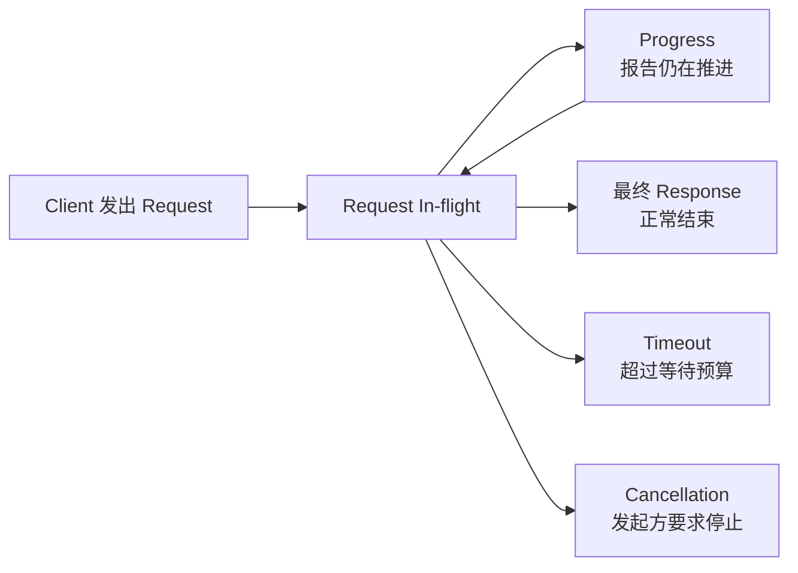
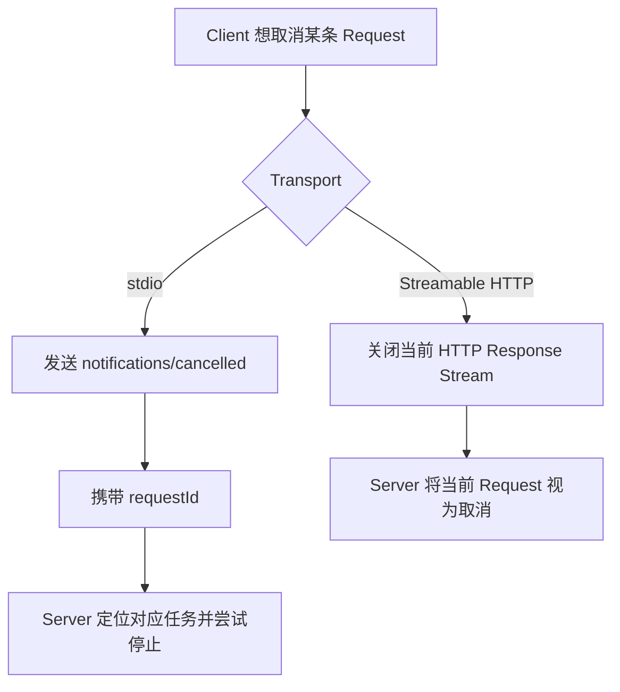
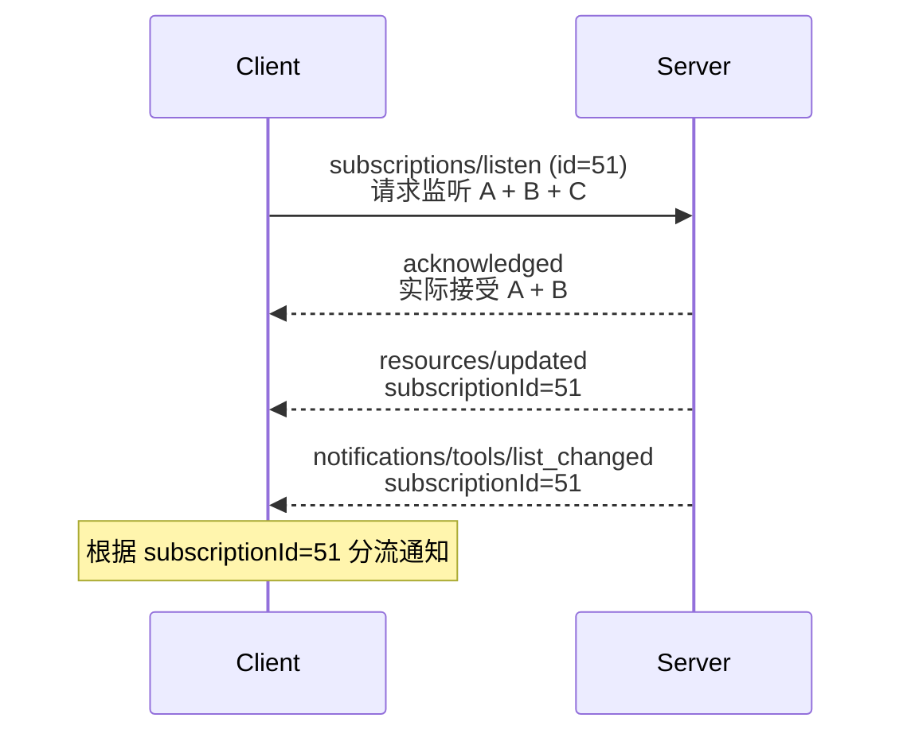

---

title: 深入 MCP：MCP 怎么处理长时间运行的请求和持续通知？
description: "从 Progress、Timeout、Cancellation 和 subscriptions/listen 出发，深入理解 MCP 如何管理长时间运行的请求与持续通知。"
summary: 深入拆解 MCP 中请求进度、超时、取消和长期订阅流的设计，以及不同 Transport 下生命周期管理的差异。
keywords:
- 深入 MCP
- MCP Progress
- MCP Cancellation
- MCP Subscription
tags:
  - AI Agent
  - 原理
  - MCP
author: 布吉岛
lastUpdated: 2026-09-14
status: draft
draft: true
assets: none
reviewed: false
sourceType: original
noindex: true

---

# 深入 MCP：MCP 怎么处理长时间运行的请求和持续通知？

很多 MCP Request 都可以很快完成。

例如：

```text
tools/list
resources/read
```

可能几百毫秒就能返回。

但如果 Tool 需要扫描整个仓库、分析几千个文件，或者等待某个外部系统执行完成，一条 Request 可能持续几十秒甚至更久。

这时候问题就不再只是：

```text
Request 发出去以后什么时候收到 Response？
```

而会变成：

```text
Client 怎么知道 Server 还在工作？
多久没有完成应该认为超时？
用户点击停止以后，怎样取消当前操作？
如果 Server 需要在很久以后主动告诉 Client “资源发生变化了”，还应该继续借用这条 Request 吗？
```

MCP 分别用 Progress、Cancellation 和 Subscription 解决这些问题，但它们其实都围绕同一个核心展开：

```text
一段通信到底应该活多久，以及结束时应该具有什么语义。
```

## Progress、Timeout 和 Cancellation 为什么必须围绕同一条 Request 来设计？

一条普通 JSON-RPC Request 最简单的生命周期只有：

```text
Request
   ↓
Response
```

Client 发出 Request，Server 执行，最后返回 Response。

如果 Server 需要执行一分钟，那么这一分钟里 Request 依然处于正在执行中状态。

这时候 Client 最少需要区分三件事：

```text
Server 正常执行，只是还没完成

Server 已经卡住，不会再完成

Client 已经不想继续等待
```

这三种状态分别对应：

**Progress**

告诉 Client：

```text
当前请求还在执行，而且已经进行到某个阶段。
```

**Timeout**

表示：

```text
Client 已经等待超过允许的时间，不准备继续等待。
```

**Cancellation**

则表示：

```text
这条 Request 还没有正常完成，但发起方主动要求停止。
```

如果一个长时间 Request 完全没有任何中间信号，Client 实际上无法区分：

```text
Server 正在认真处理第 999 个文件
```

和：

```text
Server 代码死循环了
```

Progress 给了 Client 一个重要的 Liveness Signal（存活信号）。

但它也不是 Heartbeat（心跳）协议。

Server 不需要固定每五秒报告一次，也不保证一定发送 Progress。

当前规范只允许 Client表达：

```text
如果你有进度，可以通过这个 Token 告诉我。
```

至于 Server 是否发送、多久发送一次，仍然由 Server 决定。

```text
Request
   │
   ├── Progress：请求还在继续
   │
   ├── Timeout：我已经不愿意继续等
   │
   ├── Cancellation：请停止当前工作
   │
   └── Response：请求正常结束
```

这几种信号都不能脱离原始 Request 单独理解。



## 为什么 Progress 要单独使用 `progressToken`，而不是直接使用 Request ID？

如果 Client 希望接收某条 Request 的执行进度，它会在 Request Metadata 中加入：

```text
progressToken
```

例如：

```json
{
  "jsonrpc": "2.0",
  "id": 17,
  "method": "tools/call",
  "params": {
    "name": "analyze_repository",
    "arguments": {},
    "_meta": {
      "progressToken": "repo-analysis-17"
    }
  }
}
```

Server 后面就可以发送：

```json
{
  "jsonrpc": "2.0",
  "method": "notifications/progress",
  "params": {
    "progressToken": "repo-analysis-17",
    "progress": 42,
    "total": 100,
    "message": "正在分析 Java 文件"
  }
}
```

已经有 `id = 17` 了，为什么还要另外设计一个 `progressToken`？

因为两者承担的协议职责不同。

JSON-RPC Request ID 是：

```text
Request 和最终 Response 之间的关联标识。
```

无论 Client 是否需要 Progress，这个 ID 都存在。

而：

```text
progressToken
```

首先表达的是：

```text
Client 希望当前 Request 可以发送 Progress。
```

也就是说，它同时承担了一层 Opt-in（主动启用）语义。

没有：

```text
progressToken
```

Server 就不应该凭空给某条 Request 推送 Progress Notification。

这样 Progress 能力不会自动污染所有 Request。

另外，Progress Token 只需要在**当前所有 Active Request 中保持唯一**。

它并不是一个长期业务 ID，也不应该被拿去充当：

```text
Run ID
Task ID
Trace ID
```

之类的东西。

Progress 本身的数值也不能简单理解成百分比。

例如：

```json
{
  "progress": 3,
  "total": 10
}
```

可以理解为：

```text
当前完成了 3 / 10。
```

但如果：

```json
{
  "progress": 3
}
```

没有 `total`，只能知道当前 Progress 已经推进到 3。

并不知道总共是不是 10。

规范只要求：

```text
每一次 Progress 的 progress 值都必须比上一条增加。
```

Server 甚至可以：

```text
1
2
3
4
```

只配合：

```text
正在扫描文件
正在解析依赖
正在生成结果
```

这样的文本信息。

真正重要的是：Client 能看到工作还在推进。

但即使 Progress 已经达到：

```text
100 / 100
```

也不能认为 Request 已经完成。

真正结束 Request 的仍然只能是：

**最终 Response。**

Progress 只是过程信息。

## 为什么收到 Progress 以后也不能无限延长 Timeout？

既然 Progress 能说明`Server`还在工作。

因此每收到一次 Progress，就重新计算 Timeout。

例如 Client 设置：

```text
timeout = 30s
```

Server 每隔 10 秒返回一次 Progress。

那么 Client 就可以认为：

```text
Server 没有卡死。
```

继续等待。

官方 TypeScript SDK 里也存在：

```text
resetTimeoutOnProgress
```

这样的处理机制。

但如果设计只做到这里，就会出现另一个问题。

假设 Server 每隔 20 秒都发送一次：

```text
progress = progress + 1
```

却永远不给最终结果。

如果每一次 Progress 都把 30 秒 Timeout 重新开始计算，那么这条 Request 理论上可以永远存在。

所以生产环境通常还需要另外一层：

**Maximum Total Timeout（最大总执行时间）**

例如：

```text
普通 Timeout：30 秒
最大总执行时间：10 分钟
```

含义就是：

只要 Server 一直在正常报告 Progress，可以容忍单次执行时间超过 30 秒。

但是：

```text
整个 Request 最长只能运行 10 分钟。
```

```text
Request 开始
    │
    ├── 20s → Progress
    ├── 40s → Progress
    ├── 60s → Progress
    ├── ...
    │
    └── 10min → 即使仍有 Progress，也必须结束等待
```

这和 MRTR 中的：

```text
timeout
maxTotalTimeout
```

其实是一类工程思想。

前者控制：

```text
当前这一段通信多久没有有效进展算异常。
```

后者控制：

```text
整个业务流程最长允许持续多久。
```

这两者并不一样。

另外，Progress 本身也需要 Rate Limit（频率限制）。

如果 Server 每毫秒发送一条：

```text
notifications/progress
```

不仅不会让 Client 更准确地了解进度，反而可能造成：

网络开销、UI 刷新压力、日志污染，甚至形成新的 DoS 面。

所以 Progress 的设计目标不是越多越好。

而是在长时间没有最终 Response 时，提供足够的信息证明请求仍然在推进。

## 为什么 stdio 和 Streamable HTTP 的取消方式完全不同？

Cancellation 表面上很简单：

```text
Client 不想继续等了，让 Server 停止。
```

但实际上，不同 Transport 取消信号并不一样。

### stdio 为什么需要 `notifications/cancelled`？

stdio 中，Client 和 Server 通常共享：

```text
stdin
stdout
```

这一对 Pipe（管道）。

同一时刻可能存在多条并发 Request：

```text
Request 101
Request 102
Request 103
```

所有消息都通过同一条字节流传输。

所以如果 Client 只想取消：

```text
Request 102
```

显然不能直接：

```text
关闭 stdout。
```

因为这样会把整个 MCP Connection 一起关掉，另外两条 Request 也会全部受到影响。

因此 stdio 需要显式发送：

```text
notifications/cancelled
```

例如：

```json
{
  "jsonrpc": "2.0",
  "method": "notifications/cancelled",
  "params": {
    "requestId": 102,
    "reason": "用户停止了操作"
  }
}
```

Server 收到以后，根据：

```text
requestId = 102
```

找到对应的执行任务，并尝试停止它。

这里的关键词是：

```text
尝试。
```

Server 收到 notifications/cancelled 后，应该尽快停止对应 Request 的后续工作，但 MCP 不保证这个 Request 一定能被立即、完整、无副作用地终止。

### 为什么 HTTP 不需要再发送取消 Notification？

Streamable HTTP 的并发模型不同。

每一条 Request 自己就有独立的 HTTP Request / Response 生命周期。

如果 Server 当前通过这条 Response Stream 返回 SSE：

```text
POST /mcp
   ↓
SSE Response
```

那么 Client 想取消这条 Request 时，直接关闭当前 Response Stream 即可。

这个 Disconnect 本身就是**当前 Request 被取消。**

所以当前规范规定：

在 Streamable HTTP 中，Client 关闭当前 SSE Response Stream 时，Server 必须把它视为对当前 Request 的取消。

这时候再额外发送：

```text
notifications/cancelled
```

反而没有必要。

两种 Transport 的差异可以概括成：

```text
stdio
多 Request 共用一个 Channel
        ↓
必须显式指定 requestId 取消

Streamable HTTP
每个 Request 有独立 Response Stream
        ↓
关闭当前 Stream 就已经知道取消的是谁
```

这说明：

```text
协议语义可以一致，但具体控制信号往往取决于 Transport 怎样表示并发。
```



### Cancellation 为什么一定存在 Race Condition？

假设用户点击停止。

Client 发送 Cancellation。

但 Cancellation 到达 Server 之前，Server 刚好已经完成：

```text
delete_file
```

或者：

```text
deploy_production
```

这时候会出现：

```text
Client              Server

Request  ───────────→
                  执行完成
Cancel   ───────────→
Response ←───────────
```

取消和完成在网络上发生了竞争。

所以：

```text
“我发送了取消”不等于“操作一定没有发生”。
```

这就是 Cancellation Race（取消竞态）。

规范因此允许 Server：

* 请求已经完成时忽略 Cancellation；
* 当前操作无法取消时忽略；
* 已经不知道这个 Request 时忽略。

Client 也应该忽略取消以后晚到的 Response。

这对于有副作用的 Tool 特别重要。

比如：

```text
charge_credit_card
```

用户点击停止以后，不能因为 UI 显示已取消，就推断钱一定没有扣。

业务层如果需要真正的强一致 Cancel / Rollback（取消或回滚），必须由具体 Tool 自己实现。

MCP Cancellation 只解决：

```text
这条正在运行的协议请求应该尽快停止。
```

它不替业务系统提供分布式事务。

## 既然新版取消了 GET SSE，为什么又需要 `subscriptions/listen`？

前面的 Transport 文章已经讲过，现代 MCP 不再依赖旧版长期 GET SSE。

普通 Streamable HTTP Request 的 SSE 是：

**Request-scoped（只属于当前请求）**

例如：

```text
tools/call
    ↓
HTTP POST
    ↓
SSE Response
    ↓
Progress
    ↓
最终 CallToolResult
    ↓
Stream 关闭
```

这条 Stream 的生命周期和`tools/call`绑定。

当 Request 完成以后，Stream 就应该结束。

但还有另外一种事件：

```text
Tool List 发生变化

Resource 在半小时以后被修改

Prompt List 发生变化
```

它们和某一次正在执行的：

```text
tools/call
```

完全没有关系。

如果为了等这些事件而一直挂着某条普通 Request，就重新回到了：

```text
拿业务 Request 当长期 Server Push 通道。
```

这正是新版想避免的。

所以 MCP 单独提供：

```text
subscriptions/listen
```

它的语义非常明确：

```text
Client 主动建立一条长期 Notification Stream。
```

例如 Client 可以声明：

```json
{
  "method": "subscriptions/listen",
  "params": {
    "notifications": {
      "toolsListChanged": true,
      "resourcesListChanged": true,
      "resourceSubscriptions": [
        "file:///project/config.json"
      ]
    }
  }
}
```

也就是说：

```text
我只想听这些事件。
```

Server 不能因为已经建立了一条长期 Stream，就开始随意推送其他消息。

这种 Filter（过滤器）设计非常重要。

因为一条长期连接如果没有明确订阅边界，很容易重新演变成：

```text
Server 想推什么就推什么。
```

而现代 MCP 仍然坚持：

```text
Client 决定自己愿意接收哪些长期通知。
```

所以：

```text
普通 Request SSE
```

和：

```text
subscriptions/listen
```

虽然都可能表现成一条长期 Stream，但语义完全不同。

普通 Request：

```text
我正在等待某项操作完成。
```

Subscription：

```text
我现在主动监听未来可能发生的某类事件。
```

```text
Request-scoped SSE
生命周期 = Request

subscriptions/listen
生命周期 = Subscription
```

这也是为什么旧的：

```text
resources/subscribe
```

以及 HTTP GET Stream 被统一重新设计。

长期通知不再挂在某个 Transport 机制上，而成为 MCP 自己明确的一种协议行为。

## 为什么 Subscription 还需要 Acknowledgment 和独立的 `subscriptionId`？

Client 发出：

```text
subscriptions/listen
```

以后，Server 并不能直接马上发送 Tool List Changed Notification。

规范要求第一条 Subscription 消息必须是：

```text
notifications/subscriptions/acknowledged
```

例如 Client 请求：

```text
toolsListChanged = true
resourcesListChanged = true
resourceSubscriptions = [A, B, C]
```

但 Server 可能只支持：

```text
toolsListChanged
resourceSubscriptions = [A, B]
```

Acknowledgment（确认通知）就是告诉 Client：

```text
你要求的 Subscription 我真正接受了哪些部分。
```

所以：

```text
Request Filter
```

只是 Client 希望建立什么 Subscription。

而 `Acknowledgment` 才是 Server 最终同意的 Subscription。

这实际上形成了一次非常轻量的 Negotiation（协商）。

```text
Client 希望监听
A + B + C

Server 实际支持
A + B

Acknowledgment
A + B
```

Server 在发送这条 Acknowledgment 之前，不能先发送属于该 Subscription 的普通 Notification。

否则就可能出现资源更新通知已经到了，但 Client 还不知道这条订阅到底有没有建立成功的问题。

### `subscriptionId` 为什么直接复用 Request ID？

每一条 Subscription 还会有：

```text
io.modelcontextprotocol/subscriptionId
```

当前协议直接使用最初：

```text
subscriptions/listen
```

Request 的 JSON-RPC ID 作为 Subscription ID。

例如：

```text
subscriptions/listen id = 51
```

那么后面的：

```text
notifications/resources/updated
```

都会携带：

```text
subscriptionId = 51
```

这在 stdio 里尤其重要。

因为 stdio 所有消息都可能交错在同一个 Channel：

```text
Subscription 51 → Resource Updated

普通 tools/call Response

Subscription 72 → Tools List Changed

Subscription 51 → Resource Updated
```

Client 必须根据：

```text
subscriptionId
```

做 Demultiplexing（把混在一起的消息重新分流）。

所以这里的关系和普通 Request 很像：

```text
Request ID
负责关联 Request / Response

Subscription ID
负责关联长期 Stream 上的一组 Notification
```

只是 Subscription 直接借用了最初 Request ID，避免再额外生成一套独立 Identifier。



### Connection 断开以后，Subscription 为什么不能自动恢复？

如果 stdio Process 重启：

```text
旧 Connection 结束
       ↓
新 Connection 建立
```

Client 不能假设：

```text
Server 还记得我刚才监听了哪些 Resource。
```

当前规范明确要求重新发送：

```text
subscriptions/listen
```

原因并不复杂。

Subscription 本质上属于：

```text
当前 Communication Channel（通信通道）上的长期监听关系。
```

它不是 Durable State（可持久化状态）。

所以`Connection`断开，意味着 Subscription 也失效。

这和后面要讲的 Tasks 正好形成非常清晰的边界。

如果某项工作要求：

```text
Client 断线一天以后回来，仍然能找到它。
```

那就不应该依赖 Subscription 或一条一直挂着的 Request。

因为 Progress、Cancellation、Subscription 解决的都是：

```text
当前通信关系还存在时，怎样管理正在运行的工作和通知。
```

它们都依赖一个仍然活着的 Request 或 Connection。

而真正能够脱离当前 Connection 长期存在的工作，需要另外一种模型：

**Task。**（后文介绍）

所以这一篇里真正应该理解的是三个不同生命周期：

```text
Progress / Cancellation
        ↓
属于当前 In-flight Request

Subscription
        ↓
属于当前长期 Notification Stream

Task
        ↓
工作可以脱离当前 Request / Connection 独立存在
```

MCP 把它们拆开，是因为：

```text
“执行时间很长”并不等于“它们应该拥有同一种生命周期”。
```

一个 Tool 运行 40 秒，可以继续保持普通 Request，并通过 Progress 报告状态。

一个 Resource 未来可能发生变化，应该建立 Subscription。

一个可能运行几个小时、Client 中途可以断线再回来查看的任务，则不应该靠前两种机制硬撑。
