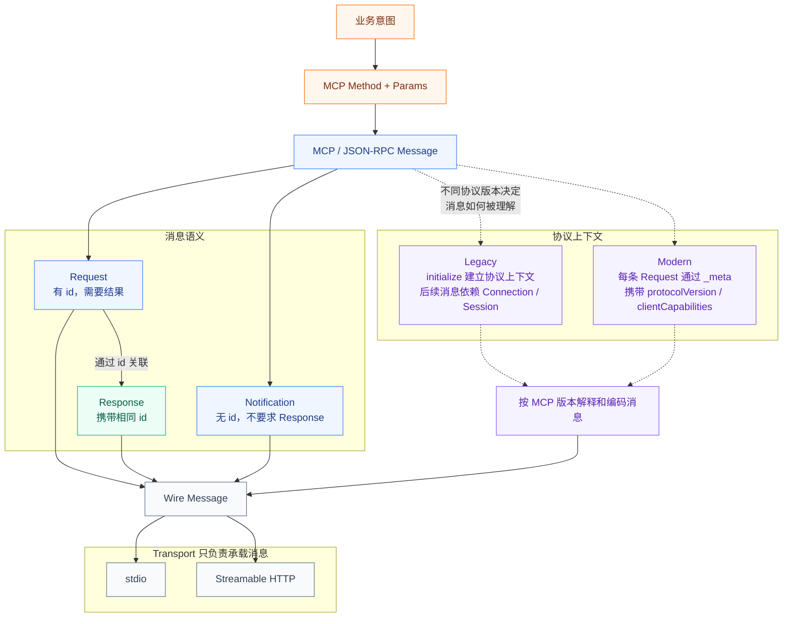
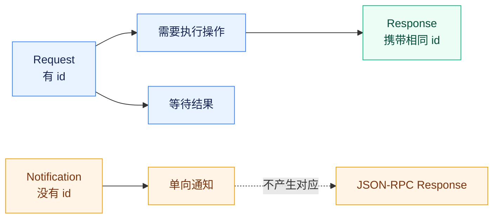
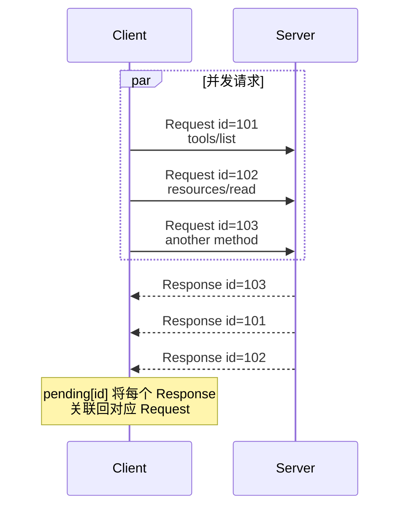
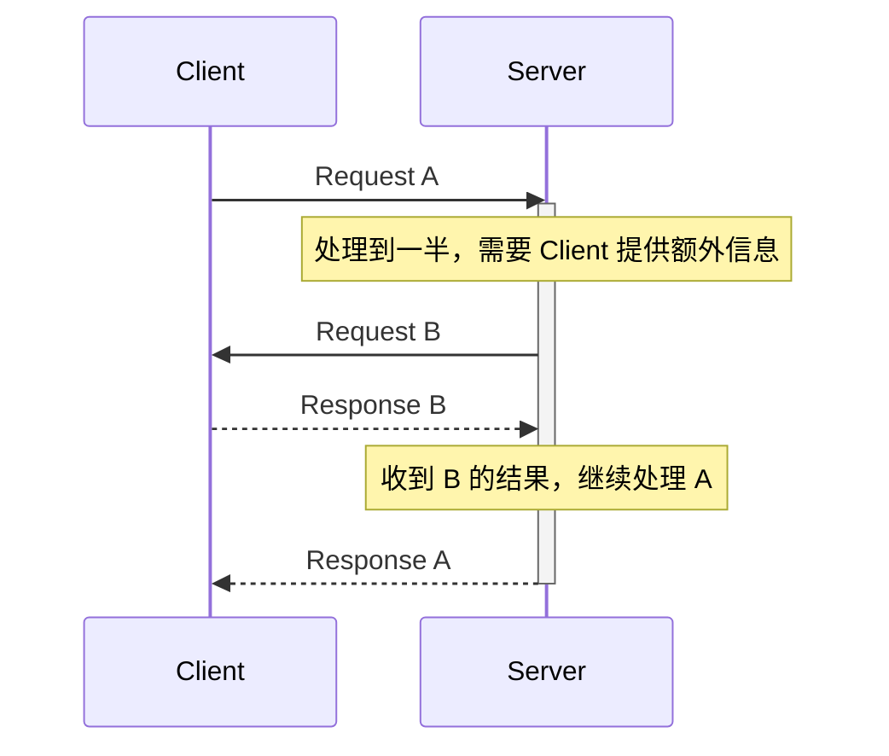

# 深入 MCP：MCP 的消息模型是怎么设计的？




## MCP 为什么选择 JSON-RPC 2.0？

MCP 并没有重新设计一套自己的 RPC （远程过程调用）消息格式，而是直接建立在 **JSON-RPC 2.0** 之上。

一条最基本的 MCP Request，底层是这样的结构：

```json
{
  "jsonrpc": "2.0",
  "id": 1,
  "method": "tools/list",
  "params": {}
}
```

`jsonrpc` 表示 JSON-RPC 协议版本，当前固定为 `"2.0"`；`method` 表示要调用的方法，`params` 携带调用参数，`id` 用来标识当前这一次 Request。

不管后面调用的是 `tools/list`、`tools/call`，还是 `resources/read`，在 JSON-RPC 看来，它们本质上都只是一个 Method Name。

这正是 MCP 选择 JSON-RPC 的价值所在。

RPC 协议其实已经解决很多 MCP 不需要重新解决的问题了，比如怎么表示一次远程方法调用？怎么区分请求和通知？多个并发请求的 Response 怎么找到原来的 Request？调用不存在的方法怎么办？参数错误怎么办？成功结果和协议错误怎么区分？

这些 JSON-RPC 2.0 已经给出了解决方案。


<PlainExplanation title="先看没有 JSON-RPC 会发生什么">

假设 MCP 想定义一个：

```text
调用工具 search
参数 q = "MCP"
```

最简单当然可以自己约定：

```json
{
  "action": "call_tool",
  "tool": "search",
  "arguments": {
    "q": "MCP"
  }
}
```

问题马上就来了。

Server 返回结果应该长什么样？

```json
{
  "data": "..."
}
```

那如果同时发了 10 个请求，我怎么知道这个结果对应哪一个？

于是你增加：

```json
{
  "requestId": 123,
  "data": "..."
}
```

如果失败呢？

```json
{
  "requestId": 123,
  "success": false,
  "errorCode": 500,
  "errorMessage": "..."
}
```

如果有一种消息我只想通知对方，不要求回复呢？

又要定义：

```json
{
  "type": "notification",
  "message": "..."
}
```

再继续下去，你会发现 MCP 自己开始设计：

```text
请求长什么样
响应长什么样
如何匹配请求和响应
错误长什么样
通知长什么样
方法叫什么
参数放在哪里
```

而这些问题，JSON-RPC 已经解决过了，所以MCP 没必要重新发明一套消息调用协议。

</PlainExplanation>

MCP 真正需要定义的是 JSON-RPC 不知道的东西，例如：

`tools/call` 到底是什么意思？

一个 Tool 应该怎样描述？

一个 Resource 应该怎样读取？

Client 和 Server 各自能做什么？

不同协议版本之间怎么理解同一条消息？

所以可以把两层关系理解为：

**JSON-RPC 定义“远程调用长什么样”，MCP 定义“这些远程调用在 MCP 世界里意味着什么”。**

这也带来了一个很重要的架构特征：**MCP 的消息语义不需要和 Transport 绑定。**

> 这里的 **Transport（传输机制）**，指 MCP 消息如何从一端传递到另一端，例如 `stdio` 或 Streamable HTTP。Transport 负责承载消息，但不负责定义消息在 MCP 中的具体含义。

JSON-RPC 规定消息格式以及 Request、Response、Notification 之间的关系，并不规定这些消息一定通过 HTTP 发送。当前 MCP 同样要求不同 Transport 保持相同的协议语义：同一个 MCP Request 可以由不同传输机制承载，但不能因为传输方式发生变化，`tools/call` 本身就变成另一种含义。

## Request、Response 和 Notification 有什么区别？

从 Wire Message（线路消息/传输层消息） 的角度来看，MCP 最基础的消息仍然只有三类：

**Request、Response 和 Notification。**

Request 表示：

```text
我要你执行一个操作，而且我需要知道结果。
```

例如：

```json
{
  "jsonrpc": "2.0",
  "id": 10,
  "method": "tools/list",
  "params": {
    "_meta": {
      "io.modelcontextprotocol/protocolVersion": "2026-07-28",
      "io.modelcontextprotocol/clientCapabilities": {}
    }
  }
}
```

这里最关键的不是 `tools/list`，而是：

```json
"id": 10
```

有 `id`，意味着发送方希望后面收到一个与这次 Request 对应的 Response。

成功 Response 会继续带着同一个 `id`：

```json
{
  "jsonrpc": "2.0",
  "id": 10,
  "result": {
    "resultType": "complete",
    "tools": []
  }
}
```

如果协议层处理失败，则会返回 `error`，而不是 `result`。

当前 `2026-07-28` Schema 中，正常成功响应被建模为 `JSONRPCResultResponse`，包含 `jsonrpc`、`id` 和 `result`；

错误响应则是 `JSONRPCErrorResponse`，包含 `error`。MCP 继续保留 JSON-RPC 的 `-32700`、`-32600`、`-32601`、`-32602`、`-32603` 等基础错误码。

Notification 与 Request 最大的区别，就是没有 `id`。

它表达的是：

```text
我告诉你一件事，但不需要你返回一个 JSON-RPC Response。
```

因此 Notification 很适合表示状态变化、进度或者取消等单向事件。

从表面看，Request 和 Notification 只差一个 `id`，但协议语义完全不同。

有 `id`，说明存在一个等待完成的调用。

没有 `id`，就不存在这一层 Request–Response 关联。

这意味着发送 Notification 之后，发送方不能再期待：

```text
“稍后请用 JSON-RPC Response 告诉我刚才那个 Notification 是否执行成功。”
```

因为协议根本没有提供用来关联这个 Response 的 Request ID。

Response 又不同，它不是主动产生的一种操作，而是某个 Request 的结果。

所以三种消息真正表达的是三种不同关系：

**Request 是一次需要完成结果的调用。**

**Response 是这个调用的结果。**

**Notification 是不要求对应 Response 的单向消息。**



这种模型从早期 MCP 一直存在，但在 `2026-07-28` 之后，有一个非常重要的变化：

**Request 的方向被收紧了。**

以前 MCP 不只是 Client 向 Server 发 Request，Server 同样可以主动向 Client 发起 Request。`2025-11-25` 的 Schema 中就明确存在 `sampling/createMessage` 这类 **Server → Client Request**。

新版就不再采用这种核心消息流。

当前 Transport 规范要求 Transport 承载的是：

**Client → Server：Request / Notification**

**Server → Client：Response / Notification**

Server 不再直接写出独立 JSON-RPC Request。

stdio 规范甚至明确要求 Server 禁止向 stdout 写 JSON-RPC Request。

为什么要发生这个变化，我们后面还会继续看到。

## MCP 是怎么把一条 Request 和对应的 Response 关联起来的？

如果一次只允许发送一个 Request，那么 Response 怎么找到 Request 似乎不是问题。

但实际上 MCP Client 不可能永远串行工作。

假设 Client 同时发出三条 Request：

`id = 101` 调用 `tools/list`

`id = 102` 调用 `resources/read`

`id = 103` 调用另一个 Method

Server 并不需要按照 101、102、103 的顺序完成。

可能 `103` 最先完成，然后是 `101`，最后才是 `102`。

所以 Response 不能依赖：

```text
“我收到的第一个 Response，一定对应我发出的第一个 Request。”
```

真正建立关联的是：**Request ID。**

所以 JSON-RPC 的 `id` 本质上是一次 RPC 的**关联标识**。



它不是 Tool ID，也不是 Session ID，更不是 Agent Run ID。

这一点很重要。

后面的 MCP 协议还会出现各种：

ID、Token、Cursor、Handle、State。

虽然它们看起来都只是一个 string，但它们解决的问题完全不同。

例如 Request ID 解决的是：

```text
这个 Response 属于哪一个 Request？
```

它并不负责：

```text
这个请求属于哪个用户？
```

也不负责：

```text
这是 Agent 的第几轮执行？
```

更不负责：

```text
多轮业务操作之间如何恢复状态？
```

这些属于另外的层次。

## 为什么早期 MCP 需要先 `initialize`，还要维护 Session？

早期 MCP 中，**`initialize` 是协议生命周期的必要步骤**；而 Streamable HTTP 中的 `MCP-Session-Id` 则是 Server 可以选择启用的协议级 Session 机制，并不是所有 Transport 都必须使用 Session ID。

在 `2025-11-25` 版本中，Client 与 Server 正式通信之前，要先进行初始化。

Client 首先发送：

```text
initialize
```

其中包含：

* `protocolVersion`：Client 支持的 MCP 协议版本；
* `capabilities`：Client 支持的可选协议能力；
* `clientInfo`：Client 实现的名称和版本信息。

例如：

```json
{
  "protocolVersion": "2025-11-25",
  "capabilities": {
    "roots": {}
  },
  "clientInfo": {
    "name": "ExampleClient",
    "version": "1.0.0"
  }
}
```

这个例子表示：Client 支持 `2025-11-25` 版本的 MCP，并声明自己支持 `roots` 能力。这里的 `roots` 可以先理解为 Client 能够向 Server 提供工作目录或文件系统范围信息。

除此之外，Client 还可以声明其他能力：

* `sampling`：允许 Server 请求 Client 使用它所连接的大模型生成内容；
* `elicitation`：允许 Server 请求 Client 向用户补充收集信息，例如填写参数或确认某个操作。

`capabilities` 是能力声明，不是工具列表。它表达的是“我支持哪些协议功能”，而不是“现在要执行什么操作”。

Server 返回 `InitializeResult`，其中又包含：

* 双方最终使用的 MCP 协议版本；
* Server 支持的可选协议能力；
* Server 实现的名称和版本信息。

随后 Client 发送：

```text
notifications/initialized
```

表示初始化阶段已经结束。

所以旧版协议的逻辑就很像：

```text
我们先见一次面，把双方是谁、支持什么、用哪个协议版本都讲清楚，后面的消息就基于这次握手建立起来的上下文继续通信。
```

这在协议设计上非常自然。

例如 Client 在 `initialize` 时已经告诉 Server：

```text
我支持 Sampling。
```

那么后面 Server 就不需要每收到一条 Request，都让 Client再重新声明一次 Sampling Capability。

这些信息可以被理解成**连接级上下文**。

Server 只要完成初始化，就可以把这些信息保存下来。

但是 `2026-07-28` 之后，Client Capability 应该从当前请求的 **Envelope**（请求封装，即包裹本次请求及其元数据的外层结构）中读取，而不是继续依赖 initialization 阶段保存的值。

如果使用旧版 Streamable HTTP，Server 还可以在 `InitializeResult` 对应的 HTTP Response 中返回：

`MCP-Session-Id`

一旦 Server 分配了这个 Session ID，Client 后续所有 HTTP Request 都必须继续携带它。

Server 就可以根据 Session ID 找回：

```text
这还是刚才那个 Client 的后续交互。
```

旧版规范甚至定义了 Session 终止、404 后重新 initialize，以及通过 HTTP DELETE 主动结束 Session 等行为。

现在这套模型已经逐渐移除了，其实并不是设计错误。

事实上，对于长连接或者单实例程序来说，它很合理。

一次初始化，后面复用上下文，可以减少重复信息。

问题出现在 MCP 开始越来越多地进入远程、分布式和云端部署环境以后。

## 为什么新版 MCP 取消了 `initialize` 和协议级 Session？

假设一个远程 MCP Server 部署了三个实例：

```text
Server A
Server B
Server C
```

Client 第一次：

```text
initialize
```

经过负载均衡，落到了 A。

A 记住了：

Client 是谁、Client 支持哪些 Capability、双方使用什么 Protocol Version，以及对应 Session。

下一条 Request 如果还是落到 A，没有任何问题。

但如果负载均衡把它送到了 B 呢？

如果 B 没有共享刚才的 Session Context，就会发现：

```text
这条请求到底是谁的？
它使用哪个 MCP 版本？
Client 支持哪些能力？
```

于是系统开始走向两个方向。

第一种是：

**Sticky Session。**

后续所有请求都尽量继续路由到最开始的 A。

第二种是：

**把 Session State 外置。**

例如放到 Redis 或其他共享存储中，让 A、B、C 都能重新找到状态。

这样当然也能工作。

但一个本来只是想提供“标准化外部能力”的协议，开始给基础设施增加新的要求：

- Server 必须保存协议 Session。

- 负载均衡必须理解粘性连接。

- 多个实例需要共享 Session State。

- Server 实例挂掉以后还要考虑状态恢复。

- Session 还需要过期和清理。

这时候问题已经不只是实现麻烦。

真正的问题是：

```text
一条 MCP Request 已经不能只靠自己被理解了。
```

它必须依赖：

```text
“这个 Request 之前还发生过什么？”
```

而 `2026-07-28` 做出的核心改变，就是把这层依赖拆掉。

新版正式移除了：

`initialize`

`notifications/initialized`

以及 Streamable HTTP 的：

`Mcp-Session-Id`

MCP 官方把这次变化直接定义为从旧模型走向 **Stateless Core**。

大家不要误解这里的 Stateless （无状态）。

它并不是说：

```text
MCP Server 从今以后不能保存任何状态。
```

一个 Tool 完全可能访问数据库，一个复杂业务操作也完全可能需要跨调用保存业务状态。

新版删除的是：

```text
“理解当前 MCP Request 必须依赖一个之前建立好的协议 Session”这种状态。
```

这叫**协议级状态**。

业务级状态仍然可以存在。

也正因为如此，`2026-07-28` 之后最重要的设计变化并不是“少了一个 initialize Method”。

真正的变化是：

```text
以前存在于初始化上下文里的协议事实，现在必须在每次 Request 上重新变得可见。
```

## 没有握手以后，一条 MCP Request 为什么必须能够“自己说明自己”？

看当前 `2026-07-28` 的 `RequestMetaObject`，会发现两个字段已经变成 Required：

```text
io.modelcontextprotocol/protocolVersion  （MCP协议版本）
io.modelcontextprotocol/clientCapabilities （客户端支持的MCP能力）
```

同时还有一个建议字段：

```text
io.modelcontextprotocol/clientInfo （客户端信息）
```

也就是说，Client 发送一条 Request 时，要直接在当前 Request 的 `_meta` 里告诉 Server：

```text
我这条请求使用什么 MCP Protocol Version。
```

以及：

```text
对于这条请求，我声明哪些 Client Capabilities。
```

更关键的是，规范直接要求：

```text
Server MUST NOT infer capabilities from prior requests
```

也就是说，即使上一个 Request 已经声明支持 `sampling` 能力，

Server 也不能推断：那这一次你肯定还支持。

当前请求声明什么，Server 就只能基于当前请求判断什么。

这其实已经把 Stateless Core 的思想写进了 Schema。

早期模型是：

```text
initialize
    ↓
protocolVersion
clientCapabilities
clientInfo
    ↓
connection/session context
    ↓
Request
Request
Request
```

新版变成：

```text
Request A
├─ protocolVersion
├─ clientCapabilities
└─ optional clientInfo

Request B
├─ protocolVersion
├─ clientCapabilities
└─ optional clientInfo
```

每一条 Request 都带着理解它所需要的核心协议上下文。

这样，理论上 Request A 可以交给 Server A，Request B 可以交给 Server B，Request C 可以交给 Server C。

Server 不必先去共享存储查询：

```text
“这个 Session 初始化的时候到底声明了什么？”
```

这种变化使普通 Round-Robin Load Balancer 成为可能，不再要求为了 MCP 协议 Session 保存共享状态。

当然，这种设计不是没有代价。

最明显的代价就是 **重复。**

以前 Protocol Version、Client Capabilities 可能只交换一次。

现在每条 Request 都要携带。

但这里做的是一个很经典的分布式系统取舍：

**牺牲少量重复元数据，换取请求的独立性。**

而且新版并不是说 Client 永远不能提前了解 Server。

新版本引入了`server/discover` ，Server 必须支持它，Client 可以通过它提前了解 Server 支持的现代协议版本和 Capabilities；但这个 Discovery 不再是像旧版 `initialize` 一样的强制前置握手。Schema 明确说明 Client 可以不调用 `server/discover`，而通过 per-request `_meta` 直接发起实际 Request。

这一点尤其关键。

旧版：

```text
先协商，后工作。
```

新版：

```text
可以先发现，但工作请求本身必须足够自描述。
```

这是一种完全不同的协议思路。

## 为什么新版 MCP 不再让 Server 直接向 Client 发起 Request？

旧版 MCP 实际上是一套双向 RPC。

不仅 Client 可以向 Server 发送 Request，Server 也可以反过来调用 Client。

例如 `2025-11-25` 的：

```text
sampling/createMessage
```

就是 Server → Client Request。

Server 告诉 Client：

```text
我需要你帮我调用一次模型。
```

旧版 `roots/list`、Elicitation 等能力同样存在类似的反向请求模式。

如果双方处在一条长期存在的双向连接中，这种设计很好理解。

但放进 Stateless Core 后，就出现了一个根本问题：

```text
Server 怎样在没有 Client Request 的情况下，主动找到 Client 并向它发起一个新的 RPC？
```

如果采用 HTTP：

Client 发出：

```text
Request A → Server
```

Server 处理一半发现：

```text
我还需要 Client 给我一些信息。
```

如果 Server 直接发一个新的 Request B：

```text
Server → Client
```

那么 Server 必须拥有一条能反向找到这个 Client 的通道。

Request B 还需要等待：

```text
Client → Response B
```

等 Response B 回来以后，Server 才能继续 Request A，最后再返回：

```text
Server → Response A
```

原本简单的一次 RPC 就变成了：



这意味着 A 的执行过程已经跨越了双方。

连接、路由、超时、状态恢复都会变得复杂。

而且它又把协议重新拉回：

```text
“双方之间存在一条长期、双向、可以随时互相发 RPC 的逻辑连接。”
```

这和 Stateless Core 想减少连接级依赖的方向是冲突的。

所以 `2026-07-28` 做了非常明确的调整：

**Server 不再主动发起独立 JSON-RPC Request。**

当前 stdio 规范明确要求 Server 不得向 stdout 写 JSON-RPC Request；Streamable HTTP 同样把 Server→Client 交互收进当前 Request 的结果模型中。

但这里也不能理解为：

```text
Sampling、Elicitation 这些能力没了。
```

真正改变的是**表达方式**。

以前是：

```text
Server 再开一个 Request。
```

现在变成：

```text
Server 告诉 Client：“当前 Request 还不能完成，我还需要一些输入。”
```

于是原本“反向 RPC”的关系，被重新折叠回：

**Client 发起的那一次 Request 生命周期中。**

具体怎样折叠、Client 如何提供这些输入、Server 如何恢复后续处理，属于后面的多轮请求机制，我们这里先不展开。

只要记住这次协议演进最关键的一点：

```text
新版不是把双向能力删除了，而是把“双向独立 RPC”改造成“Client 主导的请求生命周期”。
```

这也是为什么 `2026-07-28` 的核心调用方向变得比过去更加清晰。

## `_meta` 为什么从辅助字段变成了协议中的关键部分？

`_meta` 并不是 `2026-07-28` 才出现的。

早期 MCP 就已经允许在 `_meta` 中携带额外信息。

但新版以后，它的重要程度发生了明显变化。

以前最关键的协议上下文主要存在于`initialize`以及 Connection / Session。

现在这些连接级信息被拆掉以后，Request 必须自己携带协议上下文，于是 `_meta` 成为了非常自然的承载位置。

当前 Schema 把 `_meta` 分成了不同语义：

**RequestMetaObject**

**NotificationMetaObject**

**ResultMetaObject**

其中 Request `_meta` 至少承担：

* Protocol Version；
* Client Capabilities；
* 可选 Client Info；
* Progress Token；
* 以及其他扩展 Metadata。

Result `_meta` 则可以包含 Server Info。

这里值得注意的是命名空间设计。

当前规范对 `_meta` 的 Key 做了明确约束，并为 MCP 自身保留了命名空间，例如：

```text
io.modelcontextprotocol/*
```

第三方如果扩展 `_meta`，推荐使用类似 Reverse DNS 的前缀，避免大家都往：

```text
foo
bar
version
```

这种通用 Key 上塞东西，最终出现命名冲突。

所以 `_meta` 的角色不是：

```text
随便放点不重要的附加字段。
```

更准确地说，它提供了一层：

```text
不污染具体 Method 业务参数，又可以让协议和扩展携带横切 Metadata 的 Envelope。
```

例如：

`tools/call.params.arguments`

应该只表达 Tool 真正需要的业务参数。

Protocol Version 并不是这个 Tool 的业务参数。

Client Capabilities 也不是 Tool 参数。

把这些东西放进：

```text
arguments
```

会把业务语义和协议语义混在一起。

而 `_meta` 正好把两者隔开：

```text
params
├─ name
├─ arguments
└─ _meta
```

其中：

`name + arguments`

解决：

```text
我要调用什么？
```

`_meta`

解决：

```text
这条请求应该在什么协议上下文里被理解？
```

这种分层其实非常重要。

另外，`clientInfo` 虽然也在 Request `_meta` 中，但当前规范只要求 Client **应该** 提供，并明确指出它是 Self-reported，主要用于展示、日志和调试；Server 不应该基于它做安全决策。

这也是协议设计中一个很重要的安全原则：

```text
“对方自称是谁”不等于“对方被认证成了谁”。
```

## 为什么新版 Response 又增加了 `resultType`？

这是 `2026-07-28` 消息模型中另一个非常重要的变化。

以前看到 JSON-RPC 成功 Response：

```json
{
  "jsonrpc": "2.0",
  "id": 10,
  "result": {
    ...
  }
}
```

Client 基本可以理解为：

```text
这个 Request 成功完成了。
```

但新版已经不能简单这么理解。

因为一条 JSON-RPC Request 的结果现在可能存在两种完全不同的状态：

**真正完成。**

或者：

**协议层没有失败，但当前操作还缺少进一步输入。**

所以新版给所有 `Result` 增加了：

```text
resultType
```

当前定义至少包括：

```text
complete
input_required
```

其中 `complete` 表示真正完成。

`input_required` 表示：

```text
Server 现在还不能完成原来的 Request，需要 Client 提供更多输入。
```

`input_required` 并不是：

```text
JSON-RPC error
```

它仍然是：

```text
result
```

为什么？

因为从协议语义来看：

```text
Server 并没有执行失败。
```

它只是告诉 Client：

```text
当前操作进入了一个需要额外输入的合法状态，需要 Client 提供更多信息。
```

如果把这种情况表示成：

```text
error
```

那么 Client 很容易把它和Method 不存在、参数错误、Server 内部异常混在一起。

而 `resultType` 给成功 Response 增加了另一层区分：

```text
JSON-RPC 层：
成功还是错误？

MCP Result 层：
如果成功，现在是完成了，还是还需要继续？
```

这就是两层状态机。

第一层由 JSON-RPC `result / error` 解决。

第二层由 `MCPresultType` 解决。

这也是为什么新版 `Result` Schema 要强制要求 `resultType`。

同时为了向后兼容，如果 Client 收到旧协议 Server 返回的 Result，没有 `resultType`，规范要求把它视为 `complete` 而不是直接判定协议错误。

## 一条 MCP 消息从 SDK 对象到 Wire Message 到底经历了什么？

我们写 MCP Server 时，通常不会自己手动拼：

```json
{
  "jsonrpc": "2.0",
  "id": 123,
  "method": "...",
  "params": {}
}
```

而是调用 SDK 已经封装好的类型和方法。

但在真正发送出去之前，这些高层对象最终仍然要变成符合当前协议版本 Schema 的 Wire Message。

这里有一个非常关键的现实问题：

**当前生态里并不只有 `2026-07-28` 一种消息模型。**

TypeScript SDK 直接把 MCP 分成了两个时代：

```text
legacy
modern
```

`2024-10-07` 到 `2025-11-25` 属于 legacy era：

```text
使用 initialize，基于旧版 Wire Behavior。
```

`2026-07-28` 开始进入 modern era：

```text
没有 initialize，每条 Request 携带 _meta Envelope。
```

所以同一个高层 API，例如：

```text
listTools()
```

最终写到 Wire 上时，并不一定只有一种编码方式。

SDK 必须先知道：

```text
当前连接属于哪个 Protocol Era？
```

然后使用对应的 Wire Codec。

如果是 Legacy：

可能需要遵循初始化后保存的 Protocol Version 和 Client Capability。

如果是 Modern：

就需要把 Protocol Version、Client Capabilities 等信息编码进每次 Request 的 `_meta`。

所以从最底层看，一次消息真正经历的是：

**业务调用 → MCP 类型对象 → 当前协议版本的 Wire Codec → JSON-RPC Message → Transport**

收到消息时则反过来：

**Transport → JSON-RPC Message → 当前协议版本 Schema 校验 → Wire Codec → MCP Public Object → 业务 Handler**

后面我们还会继续往 Transport 和真实 Request 生命周期下深入了解。

## 总结

MCP 并没有重新设计一套底层 RPC 消息格式，而是建立在 **JSON-RPC 2.0** 之上。JSON-RPC 负责定义 Request、Response、Notification、Request ID 和错误响应这些通用消息机制，MCP 则在此基础上进一步定义 `tools/call`、`resources/read` 等 Method 的具体语义。

从消息类型来看，MCP 最基础的 Wire Message 仍然是 **Request、Response 和 Notification**。Request 携带 `id`，表示发送方需要得到结果；Response 使用相同的 `id` 与原 Request 建立关联；Notification 没有 `id`，因此它只表达单向事件，不要求对应的 JSON-RPC Response。也正因为 Request 和 Response 通过 `id` 关联，多个 MCP Request 才可以并发执行，而不需要按照发送顺序返回结果。

`2026-07-28` 之后，MCP 的消息模型又发生了一个重要变化：协议开始从依赖连接上下文转向 **Self-contained Request（自描述请求）**。旧版中，Protocol Version、Client Capabilities 等信息主要通过 `initialize` 建立并保存在 Connection / Session Context 中；新版则要求每条 Request 自己在 `_meta` 中携带理解当前请求所需要的协议上下文，从而减少对前置 Session State 的依赖。

与此同时，新版 MCP 也收紧了消息方向。Server 不再独立向 Client 发起 JSON-RPC Request，而是把需要 Client 继续提供输入的情况放回当前 Client Request 的生命周期中。为了表达这种更丰富的结果状态，新版 Result 又引入了 `resultType`：JSON-RPC 的 `result / error` 负责区分“调用成功还是失败”，而 MCP 的 `complete / input_required` 则进一步描述“这次成功响应是否已经真正完成”。

因此，理解 MCP 消息模型时，可以抓住几条主线：

- **JSON-RPC 决定消息的基本结构，MCP 决定消息在协议中的具体含义。**
- **Request、Response 和 Notification 构成最基础的消息关系，Request ID 负责关联一次 RPC。**
- **现代 MCP 把重要协议上下文放进每条 Request，使消息本身能够被独立理解。**
- **`_meta` 用来承载协议级和横切 Metadata，而不污染具体 Method 的业务参数。**
- **`resultType` 在 JSON-RPC 成功响应之上进一步表达 MCP 操作究竟已经完成，还是仍然需要继续交互。**

## 相关面试题

- **MCP 的消息模型是怎么设计的？**
- **MCP 为什么选择 JSON-RPC 2.0，而不是自己设计一套消息协议？**
- **MCP 中 Request、Response 和 Notification 有什么区别？Request ID 有什么作用？**
- **为什么新版 MCP 取消了 `initialize` 和协议级 Session，并要求每条 Request 能够自描述？**
- **`_meta` 在新版 MCP 的消息模型中承担什么作用？**
- **为什么新版 MCP 不再让 Server 独立向 Client 发起 Request？**
- **MCP 为什么要引入 `resultType`？`complete` 和 `input_required` 有什么区别？**
