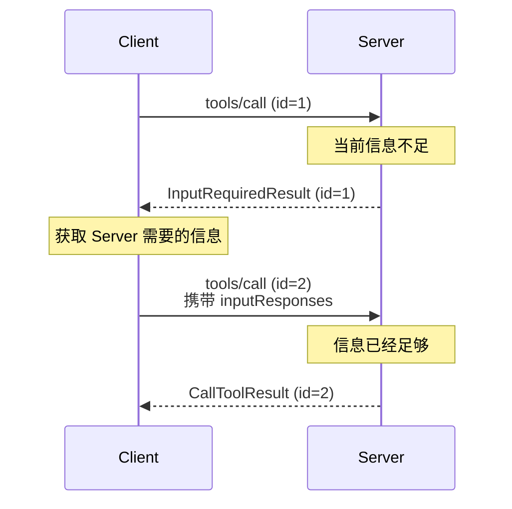
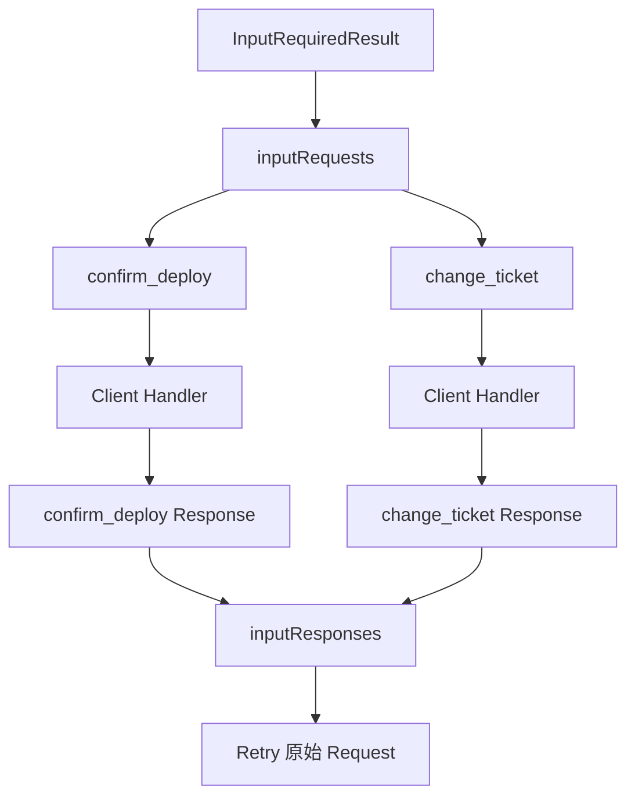
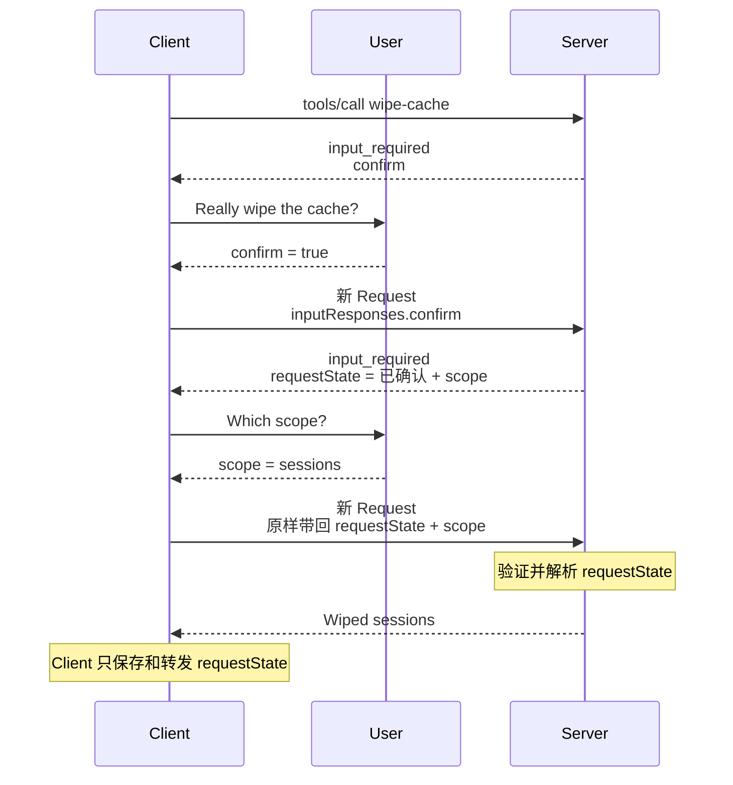
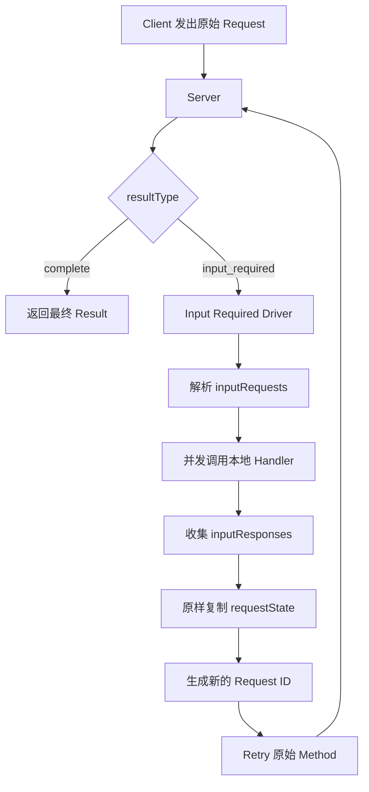

---

title: 深入 MCP：一次请求需要多轮交互时怎么办？
description: "从 MRTR、InputRequiredResult 和 requestState 出发，深入理解 MCP 如何在无状态协议下完成多轮交互。"
summary: 深入拆解 MCP Multi Round-Trip Requests 的设计，理解多轮输入、状态传递、请求重试以及官方 SDK 的实现方式。
keywords:
- 深入 MCP
- MCP MRTR
- MCP 原理
tags:
  - AI Agent
  - 原理
  - MCP
author: 布吉岛
lastUpdated: 2026-09-14
status: draft
draft: true
assets: none
reviewed: false
sourceType: original
noindex: true

---

# 深入 MCP：一次请求需要多轮交互时怎么办？

有些 MCP Request 并不能一次完成。

比如一个部署 Tool 收到`tools/call → deploy_production`以后，Server 已经计算好了部署计划，但真正执行之前还需要用户确认。

问题就出现了：

> Server 已经进入一次 `tools/call`，现在却还需要 Client 帮它获取额外输入，这个请求应该怎么继续？

当前 `2026-07-28` MCP 使用 **MRTR（Multi Round-Trip Requests，多轮往返请求）**解决这个问题。

它没有让 Server 把原来的 Request 一直挂在那里，也没有继续采用旧版的 Server → Client 反向 Request，而是把一次复杂操作拆成多个彼此独立的 Client Request。

## 为什么旧版 Server → Client Request 会成为问题？

早期 MCP 允许双向 Request。

Client 可以向 Server 发送：

```text
tools/call
```

Server 在处理过程中，也可以反过来发送：

```text
elicitation/create
```

让 Client 向用户收集信息；

或者发送：

```text
sampling/createMessage
```

让 Client 帮它调用模型；

还可以发送：

```text
roots/list
```

获取 Client 提供的工作区信息。

因此一次 Tool 调用可能形成：

```text
Client → Server
    tools/call
        ↓
Server → Client
    elicitation/create
        ↓
Client → Server
    ElicitResult
        ↓
Server → Client
    最终 tools/call Response
```

这套模型问题在于，**一次 Client 发起的 RPC，在执行途中又嵌套出了一次反方向 RPC。**

这会明显增加协议和 Transport 的复杂度。

尤其对于 Streamable HTTP，Server 如果需要在原请求执行期间反向发送 Request，就必须继续维持当前 Response Stream，让 Client 回答以后再继续原来的处理。

如果中间等待的是用户确认，这个等待可能不是几十毫秒，而是几十秒，甚至几分钟。

这意味着：

HTTP Response 不能结束；

负载均衡器和网关的 Timeout 必须足够长；

Server 还要保留原 Handler 当前执行到了哪里；

Client 返回结果以后，又必须恢复刚才被暂停的处理过程。

而且这种 Server Request 究竟属于哪个用户动作，也必须能够明确关联。

MCP 在真正移除反向 Request 之前，其实已经经历过一次收紧。

SEP-2260 明确要求 Sampling、Elicitation、Roots 这类 Server→Client Request 必须和某条原始 Client Request 关联，不能让 Server 在后台突然主动要求：

> 帮我调用一下模型。

或者：

> 让用户填一个表单。

原因除了 Transport 简化，还有一个很重要的安全问题：

> **Client 必须知道 Server 为什么突然需要这些信息。**

如果 `elicitation/create` 是由用户刚刚执行的`deploy_production`引起的，Client 至少知道：

> 这次确认属于哪个操作。

如果 Server 可以完全脱离用户动作主动索要信息，Host 就很难判断这次输入究竟会被拿去做什么。

到了 `2026-07-28`，MCP 进一步把这套模型彻底改掉：

**Server 不再向 Client 发起独立 JSON-RPC Request。**

如果 Server 处理中途需要更多信息，它结束当前 Request，并把：

> “我还缺什么”

作为这一次处理的结果返回。

然后由 Client 主动发起下一轮。



这样整个协议重新恢复成一个非常清晰的方向：

> **Request 永远由 Client 发起，Server 只负责返回 Result。**

## `InputRequiredResult` 为什么被设计成一种正常 Result？

Server 处理中途发现自己还需要输入时，返回的是：

```text
InputRequiredResult
```

其中：

```text
resultType = input_required
```

例如：

```json
{
  "jsonrpc": "2.0",
  "id": 1,
  "result": {
    "resultType": "input_required",
    "inputRequests": {
      "confirm_deploy": {
        "method": "elicitation/create",
        "params": {
          "mode": "form",
          "message": "确认部署到生产环境？",
          "requestedSchema": {
            "type": "object",
            "properties": {
              "confirm": {
                "type": "boolean"
              }
            },
            "required": ["confirm"]
          }
        }
      }
    },
    "requestState": "..."
  }
}
```

这里最值得注意的是：

> **`input_required` 不是 Error。**

因为 Server 没有执行失败。

它已经正确处理了当前 Request，只是现在还不能给出最终业务结果。

所以 MCP 需要区分：

```text
协议执行失败
```

和：

```text
当前这一轮正常结束，但整个操作还需要更多输入
```

两种完全不同的状态。

这也是前面消息模型里讲过的 `resultType` 真正发挥作用的地方。

```text
resultType = complete
```

表示：

> 这已经是最终结果。

而：

```text
resultType = input_required
```

表示：

> 这一轮结束了，但 Client 还需要再发下一轮 Request。

注意这里的：

> **这一轮结束了。**

这是理解 MRTR 最关键的一点。

Server 返回 `InputRequiredResult` 以后：

```text
Request id = 1
```

对应的 JSON-RPC 调用已经彻底结束。

Server 并没有把：

```text
id = 1
```

挂在那里等用户回来。

Client 获取完额外输入以后，需要创建一条**新的 Request**。

当前规范只允许：

```text
tools/call
resources/read
prompts/get
```

返回 `InputRequiredResult`。

因为 MRTR 面向的是：Server 正在执行一个具体操作，但完成这个操作还缺少输入。

它并不是一个可以随便插到任何 MCP Method 里的通用暂停机制。

例如：

```text
tools/list
```

本质上是在列出 Tool，没有理由突然进入：

> 请用户回答一个问题以后我再告诉你有哪些 Tool。

所以协议没有简单粗暴地让所有 Request 都支持 `input_required`。

## `inputRequests` 和 `inputResponses` 为什么要设计成 Map？

`InputRequiredResult` 中不是：

```text
inputRequest
```

而是：

```text
inputRequests
```

并且它本身是一个 Map：

```text
key → Input Request
```

例如 Server 一轮可能返回：

```json
{
  "inputRequests": {
    "confirm_deploy": {
      "method": "elicitation/create",
      "params": {
        "mode": "form",
        "message": "确认继续部署？",
        "requestedSchema": {
          "type": "object",
          "properties": {
            "confirm": {
              "type": "boolean"
            }
          },
          "required": ["confirm"]
        }
      }
    },
    "change_ticket": {
      "method": "elicitation/create",
      "params": {
        "mode": "form",
        "message": "请输入变更单编号",
        "requestedSchema": {
          "type": "object",
          "properties": {
            "ticket": {
              "type": "string"
            }
          },
          "required": ["ticket"]
        }
      }
    }
  }
}
```

这里：

```text
confirm_deploy
change_ticket
```

都是 Server 自己分配的 Key。

Client 完成以后，再把结果按照同样的 Key 放进：

```text
inputResponses
```

例如：

```json
{
  "inputResponses": {
    "confirm_deploy": {
      "action": "accept",
      "content": {
        "confirm": true
      }
    },
    "change_ticket": {
      "action": "accept",
      "content": {
        "ticket": "CR-1024"
      }
    }
  }
}
```

为什么不是：

```text
Request 1
Response 1

Request 2
Response 2
```

按数组位置对应？

因为这一轮的多个输入本身可以互相独立。

它们不一定需要串行执行。

也就是说：

```text
confirm_deploy
change_ticket
```

完全可以同时交给对应的 Client Handler。

等全部完成以后，再一起汇总成：

```text
inputResponses
```

所以 Map 里的 Key 实际上承担了这一轮内部的**输入关联标识**。



这里还有一个很容易出错的地方。

下一轮收到：

```text
inputResponses
```

以后，Server 不能直接相信里面的内容。

它们本质上仍然是 Client 发来的输入。

比如 Server 要求：

```text
confirm: boolean
```

Client 却返回：

```text
confirm: "yes"
```

Server 仍然应该重新验证。

也就是说：

> **Schema 不只是生成用户表单时使用一次，输入真正回到 Handler 时还要再次校验。**

同样，用户也可能：

```text
accept
decline
cancel
```

如果用户明确拒绝一个危险操作，Server 再无限重复询问显然是不合理的。

还有一个重要细节：

> **每一轮 `inputResponses` 只代表这一轮新收集到的 Response。**

假设整个流程必须分三轮：

第一轮获取：

```text
A
```

第二轮获取：

```text
B
```

第三轮获取：

```text
C
```

第三轮并不能简单假设：

```text
inputResponses
```

里还一直保存着 A、B、C。

跨 Round（轮次）真正需要持续存在的状态，应该通过：

```text
requestState
```

或者业务自己的持久化机制保存。

## `requestState` 为什么必须对 Client 保持不透明？

如果 MRTR 每一次都是全新的 Request，那么新的 Server Instance 怎么知道：

> 上一轮已经做到了哪里？

这就是：`requestState`存在的原因。

规范把它定义成一个 **Opaque String（对 Client 不透明的字符串）**。

所谓“不透明”，意思不是：

> 它一定经过加密，所以 Client 技术上绝对看不到里面是什么。

而是协议层规定：

> **Client 不应该理解它。**

Client 不应该：

解析它、修改它、亦或者根据它里面的字段做业务判断；

假设它采用 JSON、JWT 或某种固定编码。

Client 唯一需要做的是：

> **下一轮原样带回。**

例如 Server 第一轮已经：

```text
校验部署参数
读取生产环境配置
计算部署计划
```

最后只缺用户确认。

它可以生成一份：

```text
requestState
```

里面记录恢复下一轮所需要的信息。

流程就变成：

```text
Server A
生成 requestState
      ↓
Client 暂存
      ↓
下一轮原样带回
      ↓
Server B
验证 requestState
恢复执行
```

这里最大的价值是：

> **Server B 不一定非得是 Server A。**

也就是说，一个 HTTP Request 落到实例 A，下一轮 Retry 完全可能被负载均衡到实例 B。

只要 B 能够验证和理解 Server 自己生成的 `requestState`，就可以继续执行。

这样就不必为了 MRTR 强制要求：

**Sticky Session（粘性会话）**

也不需要：

> 第一轮一定命中这台机器，第二轮还必须继续命中这台机器。

这就是 MRTR 和 Stateless Server 非常契合的地方。

不过这里马上出现一个安全问题。

`requestState` 会经过 Client 再回来。

所以从 Server 的角度看，它回来时本质上已经属于：

> **不可信输入。**

假设 Server 直接生成：

```json
{
  "step": "confirmed",
  "isAdmin": true
}
```

然后只是 Base64 编码以后交给 Client。

Client 完全可以自己修改：

```json
{
  "step": "confirmed",
  "isAdmin": true
}
```

再发回来。

所以真正生产级的 `requestState` 至少需要防篡改。

官方 TypeScript SDK 提供：

```text
createRequestStateCodec
```

帮助 Server 生成和验证这类状态。

当前实现使用 HMAC-SHA256 做完整性校验，并且支持 TTL，也就是状态过期时间。

如果部署了多个 Server Instance，它们还需要共享能够验证这类状态的 Key，否则 A 生成的状态到了 B 根本验证不了。

但是这个 Codec 有一个特别需要注意的地方：

> **它是签名，不是加密。**

所以它可以证明：

> 这段内容没有被 Client 修改。

却不能保证：

> Client 看不到这段内容。

因此密码、Access Token、数据库凭证之类的秘密数据，不应该直接放进这种 `requestState`。

另外注意：

> **只把已经被前一轮真正证明过的事实写进 State。**

例如：

```text
step = confirmed
```

只能在用户真的完成确认以后生成。

如果 Server 在用户回答之前就生成：

```text
confirmed = true
```

然后把它作为下一轮凭证发出去，那么这个 Token 本身就等价于：

> 持有者已经完成确认。

官方 SDK 文档专门强调了这一点：

**State 应该只记录之前轮次已经证明的事实。**

<PlainExplanation title="用 wipe-cache 看懂 requestState">

官方 TypeScript SDK 中有一个 `wipe-cache` Tool 用来清理缓存，但它要求用户先确认，再选择清理范围。整个过程不是一次请求完成的，而是由多轮独立的 `wipe-cache` Request 组成：

```text
Client → Server：调用 wipe-cache

Server：发现还没有用户确认
返回 input_required
要求 Client 询问：“Really wipe the cache?”

Client → 用户：是否确认？
用户：确认

Client → Server：重试 wipe-cache
携带 inputResponses.confirm = true

Server：确认已经完成
生成 requestState，表达“用户已经确认，可以进入下一步”
再次返回 input_required，要求询问：“Which scope?”

Client → 用户：清理哪个范围？
用户：sessions

Client → Server：再次重试 wipe-cache
携带 requestState 和 inputResponses.scope = sessions

Server：验证 requestState，读取 scope，执行清理
返回：Wiped sessions
```

第二次进入 Server 时，`inputResponses` 里只有当前轮新收到的内容：

```json
{
  "scope": "sessions"
}
```

它不会自动携带上一轮的：

```json
{
  "confirm": true
}
```

因此，Server 必须通过 `requestState` 知道“用户已经确认过清理操作”。官方 SDK 示例中会把类似下面的状态编码进 `requestState`：

```json
{
  "step": "confirmed"
}
```

Client 不应该解析这个内容，只负责保存并原样带回：

```text
收到 requestState
        ↓
保存
        ↓
下一轮原样带回
```

Server 才负责验证和解析：

```text
收到 requestState
        ↓
验证签名和有效期
        ↓
解析 step = confirmed
        ↓
继续执行清理流程
```

</PlainExplanation>



## 为什么每一轮重试都必须使用新的 Request ID？

假设第一轮 Client 发出：

```text
Request id = 101
```

Server 返回：

```text
InputRequiredResult
Response id = 101
```

此时`101`这次 RPC 已经完成。

用户随后完成确认以后，Client 不应该继续`id = 101`发送数据。

而应该重新创建`Request id = 102`。


例如：

```json
{
  "jsonrpc": "2.0",
  "id": 102,
  "method": "tools/call",
  "params": {
    "name": "deploy_production",
    "arguments": {
      "version": "v2.1.0"
    },
    "inputResponses": {
      "confirm_deploy": {
        "action": "accept",
        "content": {
          "confirm": true
        }
      }
    },
    "requestState": "..."
  }
}
```

Server 最后返回：

```text
Response id = 102
```

为什么不能一直使用`id = 101`？

因为 JSON-RPC Request ID 的职责从来没有变。

它只负责：

> **把当前这一条 Response 和当前这一条 Request 关联起来。**

实际上流程是：

```text
RPC 1
结束
    ↓
RPC 2
结束
    ↓
RPC 3
结束
```

这些独立 RPC 在更高一层共同组成一个业务流程。

所以真正跨 Round 延续业务上下文的是：

```text
requestState
```

而不是：

```text
Request ID
```

```text
Request id = 101
        ↓
InputRequiredResult
        ↓
        X 这一轮已经结束

requestState + inputResponses
        ↓
Request id = 102
        ↓
Complete Result
```

## 官方 SDK 是怎么把 MRTR 隐藏成“一次调用”的？

从 Wire（线路上传输的实际协议消息）看，MRTR 显然可能包含很多轮 Request。

但使用官方 TypeScript SDK 时，应用代码完全可能仍然只是：

```text
await client.callTool(...)
```

这是因为 SDK 内部有一套专门的：

```text
Input Required Driver
```

负责驱动整个 MRTR Loop（多轮循环）。

第一次：

```text
tools/call
```

如果收到：

```text
resultType = input_required
```

Driver 就会读取其中的：

```text
inputRequests
```

然后交给 Client 已经注册好的对应 Handler。

例如：

```text
elicitation/create
```

就进入 Elicitation Handler。

同一轮存在多个 `inputRequests` 时，SDK 会并发执行。

所有结果完成以后生成：

```text
inputResponses
```

再把上一轮的：

```text
requestState
```

字节级原样复制到新的 Request，然后重新发送原始 Method。



除此之外，其实还有几层非常重要的保护。

首先是`maxRounds`

当前默认最大 Round 数是`10`。

如果一个错误或恶意 Server 永远返回：

```text
input_required
```

Client 不会无限循环。

超过上限以后会直接终止。

第二，同一轮的多个 Input Request 会并发执行，但共享一套 Abort（取消）机制。

其中一个失败以后，同一轮其他尚未完成的任务也会被取消，避免明知道这一轮已经失败，剩余交互还在后台继续执行。

第三，SDK 同时区分：

```text
timeout
```

和：

```text
maxTotalTimeout
```

前者约束每一个 Request Leg（单轮请求）。

后者约束整个 MRTR 流程。

假设：

```text
每轮 timeout = 30 秒
```

但 Server 连续执行十轮。

如果只有单轮 Timeout，理论上整个调用可能持续：

```text
30 × 10 = 300 秒
```

所以还需要：

```text
maxTotalTimeout
```

从整个调用第一次发出时开始计算总预算。

每进入下一轮，SDK 都会计算：

> 整体还剩多少时间？

这样不会因为每次 Retry 都重新获得一份完整 Timeout，导致总执行时间不断延长。

SDK 甚至考虑了另一种比较特殊的情况：

Server 返回：

```text
input_required
```

但没有真正的 `inputRequests`，只有：

```text
requestState
```

这种模式可以让 Server 表达：

> 当前还不能继续，请稍后带着状态再试。

如果 Client 完全没有等待，马上：

```text
Retry → input_required → Retry → input_required
```

就可能形成 **Hot Loop（高速空转循环）**。

所以当前 SDK 会在这种 `requestState-only` Round 之间加入固定 Pacing（节流等待），避免疯狂占用 CPU 和网络。

另外，自动 MRTR 也不是强制的。

SDK 允许关闭：

```text
autoFulfill
```

让应用自己看到：

```text
input_required
```

并手动决定怎样处理。

这说明 SDK 做的其实是：

> **在协议允许的基础上，为 Host 提供一个默认执行策略。**

MRTR 真正有价值的地方，也并不是让 MCP “支持多问用户几个问题”。

它完成了一次更深的协议重构：

> **把原本依赖反向 RPC、挂起连接和连接级执行状态的交互过程，重新表示成多个独立的 Client Request，再通过显式输入和可验证的 `requestState` 把这些 Request 连接成一个完整流程。**

每一轮 RPC 都可以独立结束。

每一轮都可以使用新的 Request ID。

下一轮甚至可以落到另外一个 Server Instance。

但整个业务过程仍然能够继续。

这才是 MRTR 在新版 MCP 中真正解决的问题。
