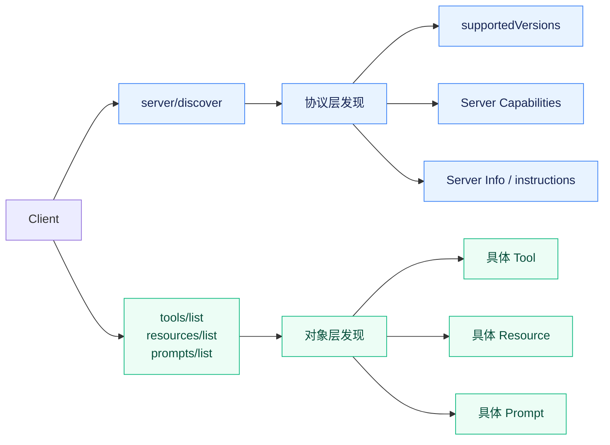
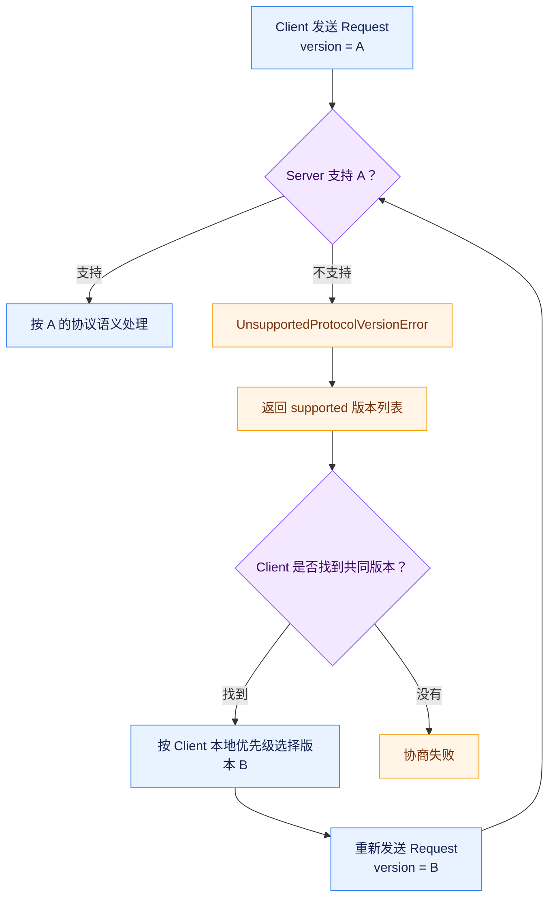
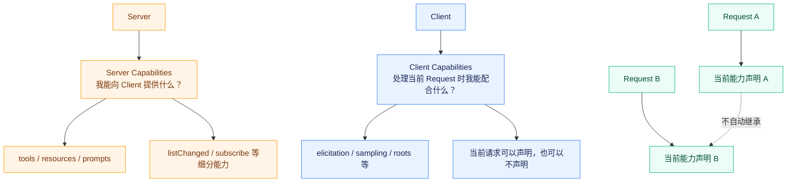
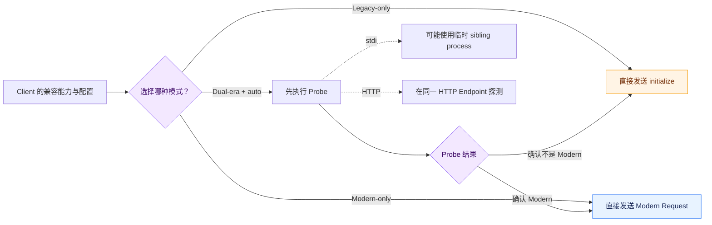
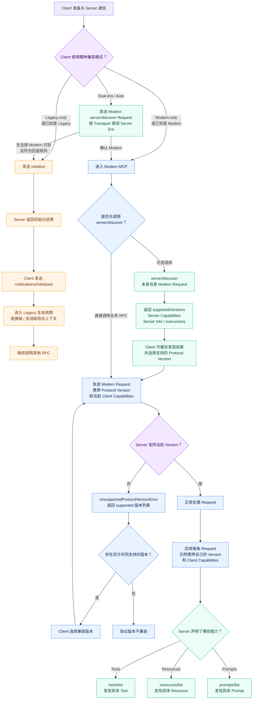

# 深入 MCP：MCP 是怎么协商协议版本和能力的？

## `server/discover` 到底发现了什么？

在 `2026-07-28` 版本中，MCP 新增了一个很重要的方法：`server/discover`

它的作用并不是列出 Server 具体提供了哪些 Tool，而是让 Client 在真正使用 Server 之前，一次性知道几个基础的信息：

Server 支持哪些 MCP Protocol Version、Server 支持哪些协议能力，以及这个 Server 自己的一些描述信息。

一条 `server/discover` Request 本身仍然是一条正常的 MCP Request：

```json
{
  "jsonrpc": "2.0",
  "id": "discover-1",
  "method": "server/discover",
  "params": {
    "_meta": {
      "io.modelcontextprotocol/protocolVersion": "2026-07-28",
      "io.modelcontextprotocol/clientInfo": {
        "name": "ExampleClient",
        "version": "1.0.0"
      },
      "io.modelcontextprotocol/clientCapabilities": {}
    }
  }
}
```

在上面这个请求中，你有没有发现：

```text
server/discover 明明是用来查询 Server 支持哪些 Protocol Version 的，为什么 Client 在发送 Discovery Request 时，自己已经要携带一个 protocolVersion？
```

因为 `server/discover` 并不是脱离 MCP 之外的“前置探测协议”。

它自己就是 **modern MCP 的一个 RPC**。

Client 必须先按照自己支持的一种 modern MCP 版本构造请求，Server 才能够按照这套协议理解它。

如果 Server 支持这个版本，就正常返回 `DiscoverResult`；如果 Server 确实是 modern Server，但不支持 Client 请求的这个具体版本，则应该返回 `UnsupportedProtocolVersionError`，同时告诉 Client 自己支持哪些版本。

所以 Discovery 解决的是：

> **“双方已经能够进行 modern MCP 通信以后，Client 怎样提前知道 Server 支持哪些 MCP Revision 和能力。”**

当前规范要求 Server **必须** 实现 `server/discover`，但是 Client **可能** 调用，也就是说 Client 并不必须先 Discover 才能调用其他 RPC。Client 完全可以直接发送 `tools/list` 或其他请求，如果版本不被支持，再根据 Server 返回的版本信息重新选择。

Server 返回的 `DiscoverResult` 大致会包含：

```json
{
  "resultType": "complete",
  "supportedVersions": [
    "2026-07-28"
  ],
  "capabilities": {
    "tools": {},
    "resources": {}
  },
  "_meta": {
    "io.modelcontextprotocol/serverInfo": {
      "name": "ExampleServer",
      "version": "1.0.0"
    }
  },
  "instructions": "This server provides weather and resource utilities.",
  "ttlMs": 3600000,
  "cacheScope": "public"
}
```

这里最重要的是 `supportedVersions` 和 `capabilities`。

`serverInfo` 只是 Server 自己报告的实现信息，可以用于展示、日志和调试，但是 Client 不应该根据这个字段做安全决策。

`instructions` 则是给 Client 的自然语言说明，可以进一步帮助上层 LLM 理解这个 Server 应该怎样使用。不过它同样不等于 Tool Description，也不应该重复每个 Tool 已经描述过的信息。

还有一个细节：

**`DiscoverResult` 本身是可以缓存的。**

它继承了 `CacheableResult`，因此 Server 还会提供 `ttlMs` 和 `cacheScope`。这意味着 Client 并没有必要每次请求之前都重新调用一遍 `server/discover`。

这里还要特别区分两层“发现”。

`server/discover` 可以告诉你：

```text
这个 Server 支持 Tools。
```

但它不会直接告诉你：

```text
这个 Server 具体有 search_issue、create_issue、get_pull_request 这三个 Tool。
```

具体有哪些 Tool，仍然要通过后面我们会详细讲的：

`tools/list`

获取。

所以：

**Capability Discovery 解决的是“这个 Server 会不会这一类协议能力”。**

**Tool Discovery 解决的是“这一类能力下面具体有哪些对象”。**

这两个 Discovery 不能混在一起。



## MCP 是怎么选择双方都支持的协议版本的？

MCP 的 Protocol Version 使用日期形式：

`2025-11-25`

`2026-07-28`

它并不是 `1.0.0`、`1.1.0` 这种 Semantic Version（语义化版本）。

而且 Protocol Version 不是：

```text
Client 和 Server 建立连接时决定一次，以后永远不再出现。
```

在 modern MCP 中，每一条 Request 都会明确携带当前使用的 Protocol Version。

例如：

```text
io.modelcontextprotocol/protocolVersion = 2026-07-28
```

Server 收到 Request 以后，第一件事情之一就是判断：

```text
我能不能按照这个 Revision 理解当前消息？
```

如果支持，就正常处理。

如果不支持，则必须返回：

`UnsupportedProtocolVersionError`

当前 Schema 给这个错误分配的 MCP Error Code 是 `-32022`

同时 Error Data 里必须告诉 Client两个关键信息：

```json
{
  "supported": [
    "2026-07-28"
  ],
  "requested": "1900-01-01"
}
```

意思非常明确：

```text
你刚才要求我用 1900-01-01 解释这个 Request，但我不支持；我真正支持的是这些版本。
```

Client 收到以后，再检查：

```text
Server 给出的版本集合里，有没有我自己也支持的版本？
```

如果存在交集，就选择一个双方都支持的版本，重新发送 Request。



所以 modern MCP 的版本协商并不是：

`Handshake → Version Negotiated → Connection Locked`

而是：

`Request(version=A) → Server 不支持 → 返回支持列表 → Client 选择共同版本 → Retry`

这里还有一个问题：

```text
如果双方同时支持多个版本，到底应该选哪个？
```

它先得到 Client 自己支持的 modern versions，再按照 Client 的本地优先顺序，从 `DiscoverResult.supportedVersions` 中寻找第一个共同版本：

```text
Client preference:
A → B → C

Server supports:
B → C

最终选择：
B
```

所以 Protocol Version Negotiation 真正表达的是：

```text
双方找到一个都能正确实现的 Wire Contract。
```

而不是：

```text
谁版本号最大就听谁的。
```

这也是为什么 Server 遇到自己认识但选择不支持的实验版本时，同样应该返回 `UnsupportedProtocolVersionError`。

## 为什么 `server/discover` 不是新版的 `initialize`？

看到这里，你会不会有这个疑问：


旧版有 initialize，新版把它删了，然后换成 server/discover，那 server/discover 不就是换了个名字的 initialize 吗？


不是。

两者看起来都能交换 Version 和 Capability，但它们在协议中的地位完全不同。

旧版 `initialize` 是生命周期的一部分。

Client 必须先：

`initialize`

Server 返回初始化结果，再由 Client：

`notifications/initialized`

随后连接才正式进入可用阶段。

也就是说：

```text
没有完成 initialize，就不存在后面的正常协议生命周期。
```

`server/discover` 没有这种语义。

当前规范明确允许：

```text
Client
  ↓
tools/list
```

直接开始。

完全不需要：

```text
server/discover
  ↓
tools/list
```

如果版本正确，Server 就处理。

如果版本错误，Server 就通过 `UnsupportedProtocolVersionError` 告诉 Client。

因此：

**`initialize` 是一个必须经过的状态转换。**

而：

**`server/discover` 是一个可选的信息查询。**

调用完 `server/discover` 之后，Server 也不会因为这次调用建立一段隐藏的 Negotiated State，然后认为：

```text
从此以后这个 Client 永远使用 2026-07-28，而且永远支持这些 Capabilities。
```

后面的 Request 仍然必须自己携带 Protocol Version 和 Client Capabilities。

换句话说：

```text
Discover Result 不会替代下一条 Request 自己应该声明的信息。
```

这正是两者最根本的区别。

`server/discover` 还可以被缓存。

如果 Discover Result 的 `ttlMs` 表明一个小时内有效，Client 完全可以一个小时以后再刷新，而中间继续直接发送正常 Request。

## Client Capabilities 和 Server Capabilities 到底有什么区别？

Capabilities 真正表达的是：

```text
当前这一方实现了哪些 MCP 协议能力。
```

Server Capabilities 描述的是 Server 能够向 Client 提供什么类型的 MCP 能力。

当前 `2026-07-28` Schema 中，Server 可以声明例如：

`tools`

`resources`

`prompts`

`completions`

`extensions`

以及仍处于弃用窗口中的 `logging`。

这些 Capability 本身内部还可以继续声明更细的能力。

比如：

```json
{
  "tools": {
    "listChanged": true
  }
}
```

这并不是说：

```text
Server 有一个叫 tools 的 Tool。
```

它表达的是：

```text
Server 支持 MCP Tools 这套协议能力，而且它还支持 Tool List 发生变化时的相关通知能力。
```

Resources 同样如此。

一个 Server 可以声明：

```json
{
  "resources": {
    "subscribe": true,
    "listChanged": true
  }
}
```

表示它不仅支持 Resource，还支持订阅 Resource 更新和 Resource List 变化相关能力。当前 Schema 就是按照这种方式组织 Server Capabilities 的。

Client Capabilities 则从另外一个方向描述：

```text
如果 Server 在完成请求时需要 Client 配合，Client 能提供哪些 MCP 协议能力？
```

当前 Schema 中包括 Elicitation（向用户请求补充信息）、Extensions（协议扩展），以及仍在弃用窗口中的 Roots（工作区根目录）和 Sampling（请求 Client 代为调用模型）等能力。



Server Capability 更偏：

> “我可以提供什么？”

Client Capability更偏：

> “当你处理我的请求时，我可以配合什么？”

例如 Server 声明：

`tools`

不是为了询问 Client：

```text
你也支持 tools 吗？
```

Client 并不需要自己提供 MCP Tools，才能调用 Server 的 Tool。

## 为什么新版要求 Client Capability 跟着每一次 Request 发送？

第二篇已经详细讲过，`2026-07-28` 把原来保存在初始化上下文里的 Client Capabilities 移进了每个 Request 的 `_meta`。

 **Client Capability 从“这个 Client 一般支持什么”，变成了“处理当前这一次 Request 时，Server 可以依赖什么”。**

当前 Schema 写得非常明确：

`clientCapabilities` 是：

> the client's capabilities for this specific request

而且 Server：

> **MUST NOT infer capabilities from prior requests**

即使 Client 上一次 Request 声明了 Elicitation，这一次没声明，Server 也不能说：

```text
你刚才明明支持，我这次继续按支持处理就行。
```

不可以。

当前 Request 写什么，就以当前 Request 为准。

这带来了一个非常有价值的特性：

**Capability 可以跟随 Request 的实际执行环境变化。**

同一个 MCP Client，从代码能力上可能实现了 Elicitation，但某一次调用发生在完全无人值守的后台任务中。

这一次 Request 完全可以不声明 Elicitation。

对于 Server 来说：

```text
当前 Request 没有 Elicitation Capability。
```

它就不能在完成这个请求时依赖“向用户弹一个表单”这种能力。

另一条 Request 发生在桌面应用中，用户就在屏幕前，那么 Client 可以重新声明：

```text
elicitation
```

这时 Server 才能够把它视为当前请求可用的协议能力。

所以 Per-request Capability 不只是为了 Stateless。

它同时把：

```text
能力声明变成了请求级契约。
```

如果 Server 在处理当前请求时确实需要某项 Client Capability，而 Client 没有声明，当前协议也没有让 Server自己猜或者随便失败。

`2026-07-28` 新增了专门的错误：

`MissingRequiredClientCapabilityError`

错误码：

`-32021`

Error Data 会告诉 Client：

```text
requiredCapabilities
```

到底缺了什么。

例如 Server 执行到某一步，需要 Elicitation，但当前 Request 没有声明：

```text
elicitation
```

那么这是：

```text
当前请求缺少 Server 完成操作所需要的 Client 协议能力。
```

它不应该伪装成：

`Method Not Found`

也不应该变成：

`Internal Error`

这就是为什么新版要给它一个独立错误类型。

## 新旧 MCP Client 和 Server 是怎么兼容的？

现在生态里不可能所有 Client 和 Server 在同一天全部升级到 `2026-07-28`。

大量 Server 仍然运行：

`2025-11-25`

甚至更早的版本。

这些协议和 `2026-07-28` 最大的困难并不只是：

```text
“Protocol Version 字符串不同。”
````

而是它们的**整个连接行为都不同**。

官方当前把这两类协议直接划成了两个时代：

**Legacy Era**

`2024-10-07` ～ `2025-11-25`

特点是：

`initialize` handshake + connection/session scoped behavior。

**Modern Era**

从：

`2026-07-28`

开始。

特点是：

per-request `_meta` + `server/discover` + Stateless Core。

这意味着判断一个 Server 是 Legacy 还是 Modern，和在 Modern Era 内选择具体 Protocol Version，其实是两个问题。

Modern Server 收到一个它不支持的 Modern Protocol Version，可以返回：

`UnsupportedProtocolVersionError`

Client 再选择共同支持版本。

这属于：

**Version Negotiation。**

但是一个 Legacy Server 可能根本不知道：

`server/discover`

是什么意思。

它甚至可能要求：

```text
在收到任何其他正常 RPC 之前，你必须先 initialize。
```

所以此时不能简单期待它返回一份规范的：

`UnsupportedProtocolVersionError`

因为这个错误本身就是 modern 协议语义。

因此一个同时支持新旧协议的 Client，还需要先判断：

```text
对面到底属于哪个 Era？
```

当前规范为 stdio 和 Streamable HTTP 分别定义了兼容探测方式。



在 stdio 中，Dual-era Client（双时代客户端） 应该先尝试 `server/discover`。如果收到合法的 Modern Response 或者已经能够确认的 Modern Error，例如 `UnsupportedProtocolVersionError`，说明对面是 Modern Server；如果得到无法识别为 Modern 的错误、超时等符合兼容规则的结果，再回退到 Legacy `initialize`。

HTTP 的判断方式又略有不同。

因为 HTTP 本身还有 Status Code，Client 可以先发送 Modern Request，然后结合 HTTP Response 和 JSON-RPC Body 判断：

```text
这是一个 Modern MCP Error？
```

还是：

```text
这个 Server 根本不理解 Modern Protocol？
```

这里的关键原则是：

```text
一个明确的 Modern Error 不能被误认为 Legacy Server。
```

例如 Server 返回：

`UnsupportedProtocolVersionError`

这说明它显然理解 modern MCP，只不过不支持你请求的这个具体 Revision。

正确处理方式应该是：

```text
继续走 Modern Version Negotiation。
```

而不是：

```text
“出错了，那我退回 initialize 试试。”
```

否则一次普通的 Protocol Version mismatch，就会被错误降级成整个协议时代切换。

官方 TypeScript SDK 为此专门实现了一套 Era Negotiation。

值得注意的是，当前 SDK 的默认行为并不是：

`mode: "auto"`

而仍然是：

**legacy。**

也就是说，如果不显式配置，`connect()` 仍然走 2025-era 的 `initialize` 路径，以避免升级 SDK 后突然给现有程序增加 Probe（探测） 行为。

开发者需要显式选择：

```text
mode: "auto"
```

SDK 才会先使用 `server/discover` 判断 Server Era，然后在需要时回退到 Legacy。

如果明确知道 Server 必须是新版，还可以：

```text
pin: "2026-07-28"
```

这种模式不会降级，对方不支持就直接失败。

所以 MCP 的版本兼容最终形成了两层非常清晰的机制：

**第一层先确定 Era：Legacy 还是 Modern。**

**第二层如果已经是 Modern，再选择双方共同支持的具体 Protocol Version。**

`server/discover` 同时参与了这两层，但它们解决的不是同一个问题。

也正因为如此，`server/discover` 不能简单理解成“新版 initialize”。



## 总结

MCP 的协议版本和能力协商，并不是通过一次固定的握手把结果永久绑定到连接上。到了 `2026-07-28`，MCP 已经转向以 **每条 Request 自描述** 为基础的协议模型：Request 自己携带 Protocol Version 和当前可用的 Client Capabilities，Server 根据当前 Request 独立判断自己能否正确处理。

`server/discover` 为现代 MCP 提供了一种提前发现 Server 信息的方式。Client 可以通过它一次性获得 Server 支持的 Protocol Version、Server Capabilities、Server Info 和 instructions 等信息。但 `server/discover` 并不是新版的 `initialize`：Server 必须实现它，Client 却可以选择不调用，直接发送正常 RPC。调用 `server/discover` 也不会建立一段隐藏的协商状态，后续 Request 仍然必须携带自己的版本和能力声明。

协议版本不匹配时，Server 会返回 `UnsupportedProtocolVersionError`，并告诉 Client 自己支持哪些版本。Client 再从双方共同支持的版本中选择合适的版本并重新发送 Request。因此现代 MCP 的版本协商不是“握手一次，以后固定”，而是：

**Request 声明版本 → Server 接受或拒绝 → 不兼容时返回支持列表 → Client 选择共同版本并重试。**

Capabilities 则描述协议双方分别具备什么能力。Server Capabilities 更关注“Server 能提供什么”，例如 Tools、Resources、Prompts；Client Capabilities 更关注“处理当前 Request 时，Client 能配合什么”，例如 Elicitation、Sampling 等。尤其是在现代 MCP 中，Client Capabilities 是**请求级契约**：Server 不能根据之前的 Request 推断当前 Request 仍然具备相同能力。

最后，MCP 还必须解决新旧协议共存的问题。`2025-11-25` 及以前属于依赖 `initialize` 的 Legacy Era，而 `2026-07-28` 开始进入基于 per-request `_meta` 的 Modern Era。一个同时兼容两种协议的 Client，需要先根据 Transport 判断 Server 属于哪个 Era；如果确认是 Modern，再进行具体的 Protocol Version 选择。

因此，理解 MCP 的版本与能力协商，可以抓住几个核心点：

- **`server/discover`** 用于发现 Server 支持的版本和能力，但不是强制握手。
- **现代 MCP 的 Protocol Version 跟随每条 Request，而不是绑定在一次 Connection 上。**
- **版本不兼容时，通过 `UnsupportedProtocolVersionError` 返回支持列表，再由 Client 选择共同版本。**
- **Server Capabilities 描述 Server 能提供什么，Client Capabilities 描述当前 Request 中 Client 能配合什么。**
- **Client Capabilities 不能从历史 Request 推断，必须以当前 Request 的声明为准。**
- **Legacy / Modern Era Detection 和 Modern Era 内部的 Version Negotiation 是两个不同的问题。**

## 相关面试题

- **MCP 是怎么协商协议版本和能力的？**
- **`server/discover` 有什么作用？它和 `tools/list`、`resources/list` 有什么区别？**
- **为什么 `server/discover` 不能理解成新版的 `initialize`？**
- **现代 MCP 是怎么选择 Client 和 Server 都支持的 Protocol Version 的？**
- **为什么 MCP 版本协商不能简单选择双方支持的“最高版本”？**
- **Client Capabilities 和 Server Capabilities 有什么区别？**
- **为什么新版 MCP 要让 Client Capabilities 跟随每一次 Request 发送？**
- **Legacy、Modern 和 Dual-era 分别是什么？新旧 MCP Client 和 Server 是怎么兼容的？**
