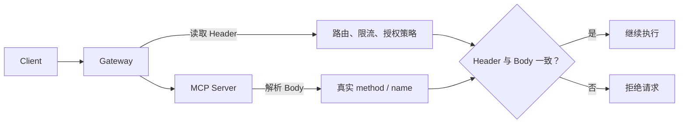
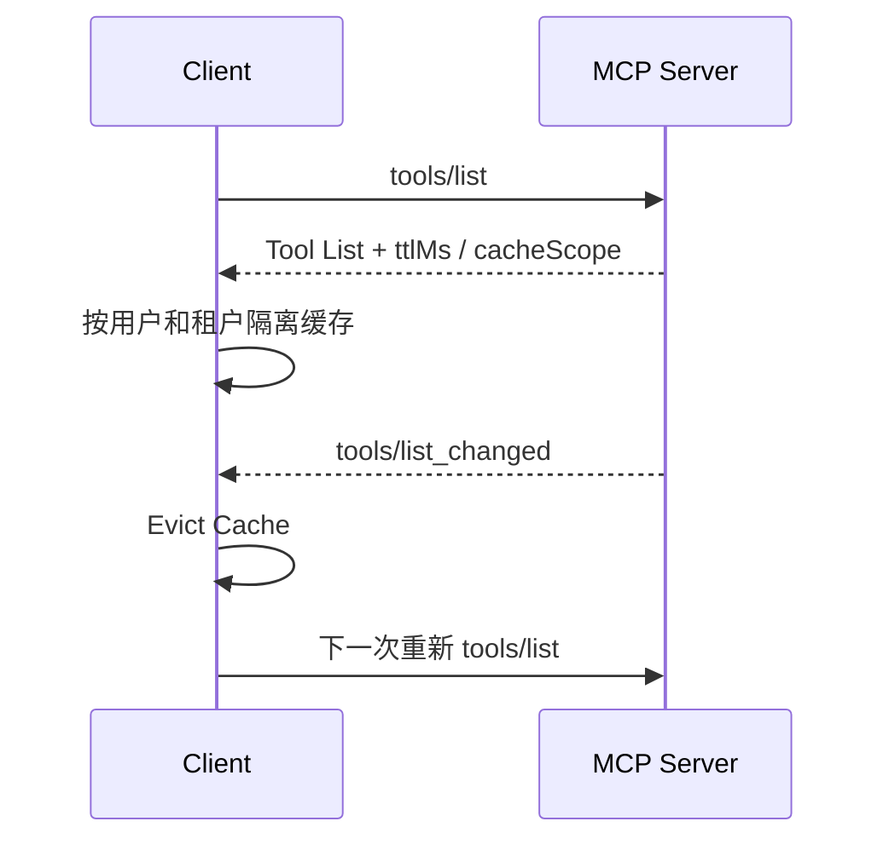
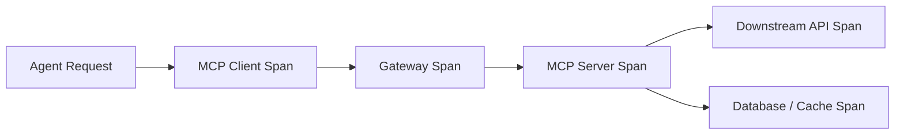
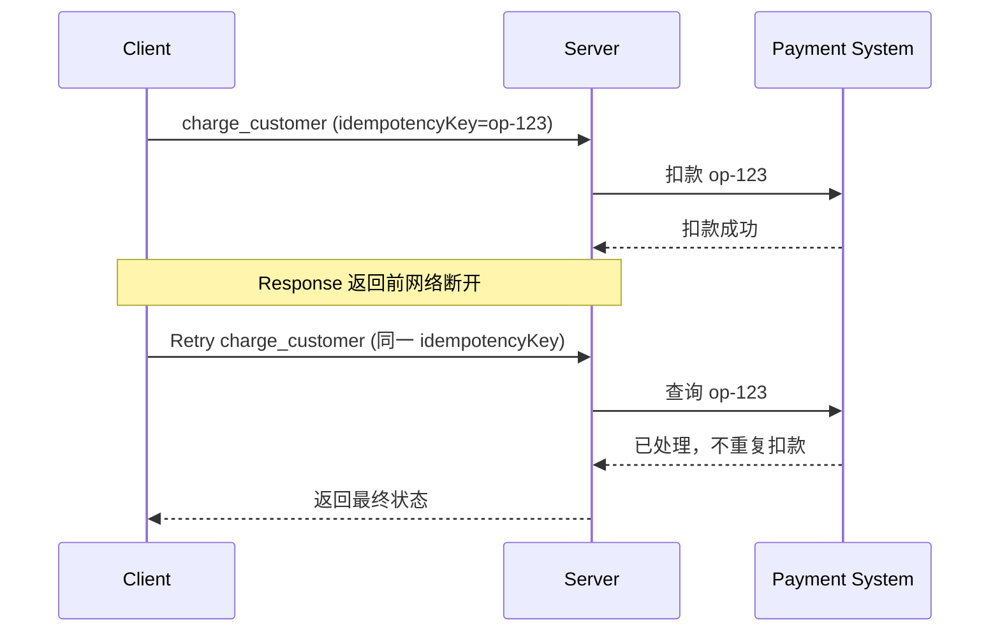

---

title: 深入 MCP：一个 MCP 系统到了生产环境还要解决什么？
description: "从 Stateless、多实例部署、Gateway 路由、缓存、Tool Catalog、可观测性和可靠性出发，深入理解 MCP 从协议可用走向生产可用还需要解决哪些工程问题。"
summary: 深入分析 MCP 进入生产环境后仍需面对的状态管理、流量路由、多租户缓存、Tool Catalog 规模、Tracing、限流、幂等和故障恢复问题。
keywords:
- 深入 MCP
- MCP 生产环境
- MCP 架构
tags:
  - AI Agent
  - 原理
  - MCP
author: 布吉岛
lastUpdated: 2026-09-14
status: draft
draft: true
assets: none
reviewed: false
sourceType: original
noindex: true

---

# 深入 MCP：一个 MCP 系统到了生产环境还要解决什么？

写一个能运行的 MCP Server 其实并不难。

比如：

```text
Client
   ↓
tools/list
   ↓
tools/call
   ↓
Server 返回结果
```

只要 Tool 能被发现、调用成功，系统就已经“跑通”了。

但真正进入生产环境以后，就要考虑很多问题：

```text
一个 Server 不够了，怎么横向扩容？

不同用户看到的 Tool 不一样，缓存怎么隔离？

几百个 Tool 每次都塞给模型吗？

Gateway 不解析 JSON Body，怎么知道这是哪个 Tool？

一条调用经过 Host、Gateway、MCP Server、数据库，
到底在哪一层变慢了？

Client 超时以后，Server 那边到底执行成功没有？
```

这些问题很多都已经不是简单的概念定义问题了，而是标准的生产系统问题。

`2026-07-28` 这一版 MCP 已经非常明显的开始为这类环境优化：

```text
Stateless

标准 HTTP Routing Header

Response Cache Hint

确定性 Tool 排序

OpenTelemetry Trace Context
```

这些变化的目的就是 **让 MCP 更容易进入真实的分布式基础设施。**

## MCP 已经 Stateless 了，为什么生产 Server 仍然不可能真的“没有状态”？

早期 MCP 很容易让 Server 和一条 Connection 绑定在一起。

例如：

```text
Client
   ↓
Connection
   ↓
Server A
```

Server A 内存里保存：

```text
当前 Session

Client Capability

初始化信息

交互状态
```

这时候如果下一次 Request 被 Load Balancer 转到：

```text
Server B
```

就可能出现：

```text
Server B 根本不知道前面发生了什么。
```

所以生产部署通常需要：

```text
Sticky Session（粘性会话）
```

让同一个 Client 尽量一直访问同一个实例。

但现代 MCP 在这方面发生了很大变化。

`2026-07-28` 把大量协议状态显式放进 Request 本身。

例如：

```text
protocolVersion

clientCapabilities
```

每一条 Request 都携带。

多轮交互也不再依赖：

```text
Server 暂停一个 Handler，然后等待 Client 从原连接回应。
```

而是通过：

```text
requestState
```

把需要继续执行的状态显式带给 Client。

Client 下一轮 Request 再原样带回来。

于是架构可以变成：

```text
                   ┌── Server A
Client → LB ───────┼── Server B
                   └── Server C
```

第一轮：

```text
Server A
```

处理。

第二轮：

```text
Server C
```

处理。

只要 C 能根据当前 Request 重新获得所需信息，就不必知道：

```text
第一轮到底是谁处理的。
```

这让普通 Round-robin Load Balancer 变得可行，也减少了协议层对 Sticky Session 的依赖。

### Protocol Stateless 和 Business Stateless 完全不是一回事

假设有一个 Tool：

```text
deploy_application
```

用户要求：

```text
部署一个新的生产环境。
```

这次 Tool Call 可能创建：

```text
deploymentId = deploy-82931
```

后台真正运行：

```text
创建云资源

上传镜像

创建数据库

运行迁移

等待健康检查
```

这些操作可能持续十几分钟。

即使 MCP Protocol 完全 Stateless，业务依然必须知道：

```text
deploy-82931 当前执行到哪一步？

属于哪个用户？

失败以后能不能 Retry？

已经创建了哪些资源？
```

这些状态不会因为 MCP Stateless 就消失。

它们只是不能再偷偷依赖：

```text
某一条 MCP Connection 的内存
```

而需要进入真正的 Durable Storage（持久化存储）。

例如：

```text
MCP Server
    ↓
PostgreSQL
Redis
Message Queue
Workflow Engine
```

### Task 更能说明这个区别

如果使用 Tasks Extension，一个长操作会返回：

```text
taskId
```

Client 以后可能：

```text
断线

重启

连接到另一台 Server
```

然后继续：

```text
tasks/get(taskId)
```

那新的 Server Instance 必须知道：

```text
这个 taskId 对应什么任务。
```

所以真正状态可能存放在：

```text
taskId
   ↓
Database
   ↓
Workflow State
```

而不是：

```text
taskId
   ↓
Server A Memory
```

否则 Server A 一挂：

```text
Task 也跟着消失。
```

以前：

```text
Connection
    ↓
固定实例
    ↓
内存状态
```

现在：

```text
Request
    ↓
任意实例
    ↓
显式 Handle
    ↓
Durable State
```

这里的：

```text
requestState
taskId
业务 jobId
```

因此：

```text
MCP 消除的是协议必须依赖的 Connection State，不是业务系统天然需要的 State。
```


## 为什么 `Mcp-Method` 和 `Mcp-Name` 对 Gateway 比对 MCP Server 本身更重要？

假设一个 Remote MCP Request 是：

```json
{
  "jsonrpc": "2.0",
  "id": 18,
  "method": "tools/call",
  "params": {
    "name": "delete_repository",
    "arguments": {
      "repo": "example"
    }
  }
}
```

对于 MCP Server 来说：

```text
method
name
```

都已经在 JSON Body 里。

那为什么现代 Streamable HTTP 还要额外使用：

```text
Mcp-Method
Mcp-Name
```

这样的 HTTP Header？

因为生产环境里的 Request 通常不是：

```text
Client
   ↓
MCP Server
```

这么简单。

真实结构可能是：

```text
Client
   ↓
CDN
   ↓
WAF
   ↓
API Gateway
   ↓
Rate Limiter
   ↓
Authorization Proxy
   ↓
Load Balancer
   ↓
MCP Server
```

这些组件很多根本不理解 MCP。

反而它们更擅长处理：

```text
HTTP Method

Path

Header

Status Code
```

如果要根据 MCP Method 路由，最原始的方式就是：

```text
Gateway 读取整个 JSON Body，然后理解 JSON-RPC。
```

例如：

```text
解析 Body
   ↓
找到 method
   ↓
进入 params
   ↓
找到 name
```

但这意味着每一个 Gateway、WAF、Rate Limiter 都要：

```text
理解 MCP Message Format。
```

成本很高。

所以现代 MCP 把最重要的 Routing Metadata 提升到了 HTTP Header。

例如：

```http
Mcp-Method: tools/call
Mcp-Name: delete_repository
```

Gateway 不需要理解 JSON-RPC，也可以直接知道：

```text
这是一个 tools/call。
```

而且调用的是：

```text
delete_repository
```

### Gateway 能因此做什么？

例如 Rate Limit：

```text
tools/list
→ 1000 req/min
```

```text
tools/call
delete_repository
→ 10 req/min
```

或者路由：

```text
Mcp-Name: image_generation
→ GPU Service
```

```text
Mcp-Name: database_query
→ Data Service
```

甚至 Authorization：

```text
Mcp-Name: read_report
→ 普通用户允许
```

```text
Mcp-Name: delete_report
→ 要求 admin scope
```

这样大量基础设施逻辑就不需要深入 MCP Payload。

所以：

```text
Mcp-Method
Mcp-Name
```

真正服务的是：

```text
HTTP Infrastructure。
```

它让应用层 MCP Semantic（语义）可以被传统网关理解。

### Header 为什么必须和 Body 一致？

但这样做就会产生一个安全问题。

攻击者可以尝试：

```http
Mcp-Method: tools/call
Mcp-Name: search_documents
```

让 Gateway 认为：

```text
这是一个低风险搜索 Tool。
```

但 JSON Body 实际是：

```json
{
  "method": "tools/call",
  "params": {
    "name": "delete_database"
  }
}
```

如果 Gateway 只相信 Header，而 MCP Server 只相信 Body ，两层安全系统看到的就不是同一个 Request。

于是就可能形成策略绕过。

因此标准 Header 不能只是一个方便 Gateway 使用的 Hint（提示）。

它必须和真正的 Request 内容匹配。

现代规范要求：

```text
Header Method
=
Body Method
```

以及命名类请求中：

```text
Header Name
=
Body Name
```

否则应该认为 Request 不合法。

这也是为什么这两个 Header 虽然看起来只是重复字段，却对生产部署特别重要。



## Tool List 为什么到了生产环境一定会遇到缓存和失效问题？

最简单的 MCP Server 可能只有：

```text
3 个 Tool
```

每次 Client Connect 都：

```text
tools/list
```

完全没有压力。

但生产环境很可能出现：

```text
50 个 Tool

200 个 Tool

不同用户看到不同 Tool

Tool 动态启停

Tool Description 频繁更新
```

甚至一个 Host 同时连接：

```text
10 个 MCP Server
```

那么完整 Tool Catalog 很快就会变大。

每次 Conversation 都重新：

```text
server/discover
tools/list
resources/list
prompts/list
```

不仅增加网络请求，还会增加后续构建模型 Context 的成本。

现代 MCP 因此为多种可发现结果提供：

```text
ttlMs

cacheScope
```

这样的缓存信息。

### `ttlMs` 解决的是什么？

例如 Server 返回：

```text
ttlMs = 300000
```

表示：

```text
这个结果接下来 5 分钟可以被 Client 认为仍然 Fresh。
```

那么：

```text
Conversation A
→ tools/list
```

拿到结果以后，

Conversation B 不必马上：

```text
tools/list
```

再请求一次。

直接复用 Cache 即可。

这在：

```text
Tool Catalog 较大

Server 距离较远

连接数量很多
```

的情况下尤其重要。

但生产缓存真正麻烦的往往不是 TTL。

而是：

```text
cacheScope
```

### `cacheScope` 为什么首先是安全问题？

假设一个多租户 MCP Server。

Alice 是管理员。

她可以看到：

```text
read_report

create_report

delete_report
```

Bob 是普通用户。

只能看到：

```text
read_report
```

于是：

```text
Alice → tools/list
```

返回：

```text
3 个 Tool
```

如果 Host Cache Key 只是：

```text
https://mcp.example.com
```

Bob 下一次请求时直接命中这份缓存，就可能得到：

```text
delete_report
```

这样的 Tool Definition。

所以 Cache 不能只回答：

```text
这个 Server 的 tools/list 是什么？
```

还要回答：

```text
在哪一个 Authorization Context 下？
```

因此 Private Cache 至少需要按类似：

```text
Server Identity
+
Authorization Principal
```

进行隔离。

也就是：

```text
Alice Cache
≠
Bob Cache
```

当前官方 TypeScript SDK 已经提供：

```text
cachePartition
```

这类机制，让调用方可以把自己的：

```text
userId
tenantId
auth subject
```

作为 Private Cache Partition。

### TTL 为什么仍然解决不了 Tool 更新？

假设：

```text
ttlMs = 10 分钟
```

Client 刚刚缓存：

```text
tools/list
```

两分钟后，Server 删除：

```text
delete_database
```

如果 Client 只能等 TTL：

```text
还要八分钟才会发现。
```

所以 MCP 还需要：

```text
notifications/tools/list_changed
```

这种主动失效机制。

完整流程变成：

```text
tools/list
    ↓
Cache
    ↓
正常复用
```

当 Server 发生：

```text
Tool Added
Tool Removed
Tool Definition Changed
```

时：

```text
notifications/tools/list_changed
        ↓
Client Evict Cache
        ↓
下一次重新 tools/list
```

这就是经典**Cache Invalidation（缓存失效）**问题。

MCP 可以告诉 Client：

```text
“这份数据最多缓存多久。”

“现在 Tool List 变化了。”
```

但真正生产系统仍然要决定：

```text
Cache 存在哪？

不同用户怎样 Partition？

共享缓存还是单 Client 缓存？

Store 挂掉怎么办？

List Changed 丢了怎么办？
```



## Tool 越多为什么不一定越好？

比如一开始只有：

```text
search
read
write
```

后来变成：

```text
search_users
search_orders
search_reports
create_report
update_report
delete_report
archive_report
restore_report
...
```

最终一个 Server 可能有：

```text
几百个 Tool
```

从 API 设计角度来看，能力更加完整了。

但对于 Agent Host 来说，Tool Catalog 最终通常还要进入模型。

比如被转换成 Provider Tool Calling 所需要的：

```text
name
description
inputSchema
```

于是：

```text
500 个 Tool
```

意味着模型每次可能需要看到大量：

```text
Tool Definition
```

这样就产生很多问题。

### 第一是 Context Cost

Tool Definition 本身就占 Token。

如果：

```text
一个 Tool Definition 平均 200 Token
```

那么：

```text
500 Tools
```

将直接占用约 10 万 Token。

而且这些 Token 不是用户真正的问题内容。

只是为了让模型知道有哪些能力。

Tool 越多：

```text
输入成本
延迟
上下文占用
```

都可能上升。

### 第二是 Tool Selection 反而可能变难

假设只有：

```text
search_documents
```

模型很容易判断。

但如果同时存在：

```text
search_documents
search_internal_documents
search_shared_documents
search_archived_documents
find_documents
query_documents
```

语义高度重叠。

模型选择错误 Tool 的概率反而可能增加。

所以工具更多，并不意味着 Agent 更加强大。

### Pagination 能解决这个问题吗？

MCP List Method 支持 Cursor Pagination（分页）。

例如：

```text
tools/list
    ↓
100 Tools
nextCursor
```

Client 再：

```text
tools/list(cursor)
```

获得下一页。

这解决的是：

```text
一次 Wire Response 不应该无限大。
```

但它解决不了：

```text
Host 最终到底把多少 Tool 暴露给模型？
```

即使分 5 页取完 500 个 Tool，最后不还是 500 个 Tool

所以 Production Host 还需要另一层策略：

```text
Tool Filtering（工具过滤）

Tool Retrieval（工具检索）

Dynamic Tool Loading（动态工具加载）

Task-aware Tool Selection（任务感知工具选择）
```

例如用户问：

```text
分析财务报表。
```

Host 根本没必要同时把：

```text
deploy_kubernetes
send_marketing_email
resize_image
```

交给模型。

所以可以先根据：

```text
当前任务

用户权限

当前 Workspace

Server
```

筛选出：

```text
20 个相关 Tool
```

再进入模型。

这是 Agent Runtime 的职责。

不是 MCP Core 的职责。

### 为什么 Tool 顺序稳定也会影响生产成本？

对于`tools/list`来说，

在 Tool Set 没变时，尽量保持：

**Deterministic Order（确定性顺序）**

例如一直：

```text
A
B
C
D
```

而不是这次：

```text
A
B
C
D
```

下一次：

```text
D
B
A
C
```

虽然内容一样，但模型 Provider 的 Prompt Cache 可能是按实际 Prompt 内容计算的。

Tool 顺序变化以后：

```text
Prompt Bytes
```

也跟着变化。

于是原本可以复用的：

```text
Prompt Cache
```

可能失效。

所以一个看起来微不足道的：

```text
Tool List 顺序是否稳定。
```

最终可能影响：

```text
模型调用延迟

Token Billing

Prompt Cache Hit Rate
```

这也是 MCP 从“协议设计”走向“生产工程”时非常典型的一种问题：

```text
Server 返回的数据虽然语义一样，但稳定性仍然会影响下游 LLM 系统成本。
```

所以生产环境中的 Tool Catalog 应该同时考虑：

```text
怎么获取

怎么缓存

怎么失效

怎么过滤

怎么稳定输出
```

而不是只看：

```text
tools/list 能不能返回成功。
```

## 为什么有日志还远远不等于可观测？

假设用户反馈：

```text
Agent 调 GitHub 的时候卡住了。
```

真正的调用链可能是：

```text
User
 ↓
Agent Runtime
 ↓
LLM
 ↓
Tool Selection
 ↓
MCP Client
 ↓
API Gateway
 ↓
MCP Server
 ↓
GitHub API
 ↓
Database / Cache
```

如果每一层都只打印：

```text
request started

request failed
```

你会看到很多日志。

但仍然不知道：

```text
哪些日志属于同一次用户操作。
```

这就是：

```text
Logging
```

和：

```text
Observability
```

之间的差别。

### Logging 只能回答“发生了什么”

例如：

```text
18:20:01 tools/call started

18:20:03 GitHub API timeout
```

可以看到事件。

但系统里同时可能有：

```text
1000 个并发 Request
```

到底哪个：

```text
tools/call
```

对应这个：

```text
GitHub timeout
```

如果没有关联关系，排查仍然很困难。

### Tracing 解决“这件事一路经过了哪里”

现代 MCP 已经约定可以通过 `_meta` 传播 OpenTelemetry 常见 Trace Context：

```text
traceparent

tracestate

baggage
```

于是一次调用可以形成：

```text
Agent Request Span
        ↓
MCP Client Span
        ↓
Gateway Span
        ↓
MCP Server Span
        ↓
GitHub HTTP Span
```

真正形成一棵：

```text
Trace Tree
```



这时候用户说：

```text
MCP 很慢。
```

你可以看到：

```text
Agent → MCP Client       2ms
Gateway                   4ms
MCP Server Handler       30ms
GitHub API             4200ms
```

立即知道：

```text
MCP Protocol 本身并不慢。
```

真正慢的是下游 API。


### Metrics 又解决另一个问题

Tracing 适合分析：

```text
某一次请求。
```

Metrics 适合回答：

```text
最近一小时 tools/call 成功率多少？

哪个 Tool P99 最慢？

403 增加了吗？

MRTR 平均几轮？

Timeout 比例多少？

哪个 Downstream Error 最多？
```

所以 Production MCP 至少会需要：

```text
Logging
+
Metrics
+
Tracing
```

三者配合。

### 应该记录什么？

常见维度可能包括：

```text
MCP Method

Tool / Resource / Prompt Name

Protocol Version

Latency

resultType

Error Code

Timeout

Cancellation

MRTR Round Count

Server Instance

Tenant / Authorization Principal
```


### 为什么现代 Logging 也变成 Per-request？

旧版 MCP 有：

```text
logging/setLevel
```

这种 Connection-level 设置。

Client 可以告诉 Server：

```text
后面都发 debug 日志。
```

现代版本则把日志偏好放进 Request `_meta`：

```text
io.modelcontextprotocol/logLevel
```

也就是说：

```text
Request A
debug

Request B
warning
```

可以各自不同。

这和整个 Stateless 设计是一致的：

```text
不再依赖 Connection 保存“当前 Log Level”。
```

需要的上下文继续随 Request 自己携带。

## MCP 能保证协议正确，为什么仍然不能保证系统可靠？

做到这里，一个生产 MCP Server 已经可能拥有：

```text
Stateless

Authorization

Schema Validation

Timeout

Progress

Cancellation

Caching

Tracing

Gateway Routing
```

看起来已经相当完整。

但仍然不能得出：

```text
系统一定可靠。
```

因为协议正确和业务正确之间还有很长距离。

### Retry 不等于 Idempotency

假设有一个：

```text
charge_customer
```

Tool。

Client 发送：

```text
tools/call
```

Server 已经：

```text
成功扣款 100 元
```

但返回 Response 前网络断开。

Client 看到的是：

```text
Timeout
```

于是 Retry。

如果业务 Handler 再执行一次：

```text
再扣 100 元
```

协议上每一步都完全合法。

问题在于：

```text
业务副作用重复发生了。
```

JSON-RPC Request ID 解决的是：

```text
这一条 Response 属于哪一条 Request。
```

不是：

```text
这一项业务操作只能执行一次。
```

真正防止重复扣款的通常需要：

```text
idempotencyKey
```

例如：

```text
paymentOperationId
```

并在数据库层确保：

```text
同一个 Operation
只成功一次
```



### Timeout 也不代表操作没有发生

假设：

```text
delete_repository
```

Client 设置：

```text
timeout = 30s
```

30 秒以后超时。

这只能说明：

```text
Client 不再等结果。
```

不能说明：

```text
Server 已经停止执行。
```

可能发生：

```text
29s
Server 已发送删除请求
```

```text
30s
Client Timeout
```

```text
31s
GitHub 删除成功
```

用户看到：

```text
失败。
```

实际系统：

```text
Repository 已经删了。
```

Cancellation 同样存在 Race Condition（竞争条件）。

所以对于：

```text
Payment

Delete

Deploy

Send Email
```

等副作用操作，业务系统仍然需要明确状态。

例如：

```text
pending

running

succeeded

failed

unknown
```

甚至需要：

```text
查询最终状态，而不是看到 Timeout 就直接认为失败。
```

### Stateless 也不意味着无限扩容

现代 MCP 很适合：

```text
Server A
Server B
Server C
```

水平扩容。

但它们后面可能都访问：

```text
同一个 PostgreSQL

同一个 GitHub API

同一个模型服务
```

假设：

```text
MCP Server
```

扩到 100 台。

结果瞬间向数据库发：

```text
10 万并发 Query
```

Server 层没挂。

数据库先挂了。

所以生产 Runtime 仍然需要：

```text
Rate Limit

Concurrency Limit

Queue

Backpressure

Circuit Breaker

Bulkhead
```

例如：

```text
某个 Tool 最多同时执行 20 个
```

多出来的：

```text
进入 Queue
```

而不是：

```text
Server 能接多少 Request，就一股脑全部往下游打。
```

### Tool 之间甚至可能需要不同的资源策略

例如：

```text
search_documents
```

可能非常轻。

可以：

```text
500 concurrency
```

而：

```text
generate_video
```

可能非常重。

只允许：

```text
5 concurrency
```

所以生产限流不能只做到整个 /mcp Endpoint 1000 req/min。

更合理的维度可能是：

```text
Tenant

Mcp-Method

Mcp-Name

Authorization Scope

Downstream Dependency
```

这又回到了：

```text
Mcp-Method
Mcp-Name
```

为什么值得暴露给 Gateway。

## MCP 到底负责到哪里？

最底层：

```text
MCP Protocol
```

负责：

```text
能力怎样描述

消息怎样组织

Request / Response 怎样关联

版本怎样协商

Tool / Resource / Prompt 怎样发现

MRTR 怎样表达

Progress / Cancellation 怎样工作

Authorization 怎样接入
```

上一层：

```text
MCP SDK
```

负责：

```text
JSON-RPC Runtime

Schema Validation

Wire Codec

Transport

Timeout

Progress

Cancellation

MRTR Driver

Subscription State
```

再往上：

```text
Production Runtime
```

需要自己解决：

```text
Load Balancing

Gateway Routing

Caching

Cache Invalidation

Rate Limiting

Backpressure

Observability

Runtime Isolation
```

最后：

```text
Business System
```

仍然需要解决：

```text
Business Authorization

Transaction

Idempotency

Workflow

Data Consistency

Business State

Side Effect
```

所以 MCP 并不是自带一个完整分布式应用平台。

它本质上还是一个协议，

核心解决的是：

```text
Agent 和外部能力之间应该如何建立一个统一、可互操作的协议边界。
```

系统：

```text
如何扩容。
如何限流。
如何持久化。
如何保证扣款只发生一次。
如何追踪跨服务调用。
```

这些仍然是分布式系统本身的问题。

但 MCP 的意义也恰恰在这里。

它没有试图重新发明：

```text
Database

Queue

Workflow Engine

Gateway

Observability Platform
```

而是尽量和这些已经成熟的基础设施配合。

例如：

```text
Stateless
```

让普通 Load Balancer 更容易工作。

```text
Mcp-Method / Mcp-Name
```

让 Gateway 可以路由和限流。

```text
ttlMs / cacheScope
```

让 Client 可以安全缓存。

```text
traceparent
```

让现有 OpenTelemetry 系统可以继续追踪。

这些设计体现的是：

```text
MCP 正在尽量成为分布式系统里的一层协议，而不是把整个分布式系统重新包进 MCP。
```

这也是整个“深入 MCP”系列我们一定要记住的：

```text
MCP 的价值不是替我们消灭所有工程问题，而是把 Agent 与能力之间稳定出一个标准化，一个协议，让剩下的问题重新回到我们已经熟悉的分布式系统、权限、安全和业务工程中。
```
