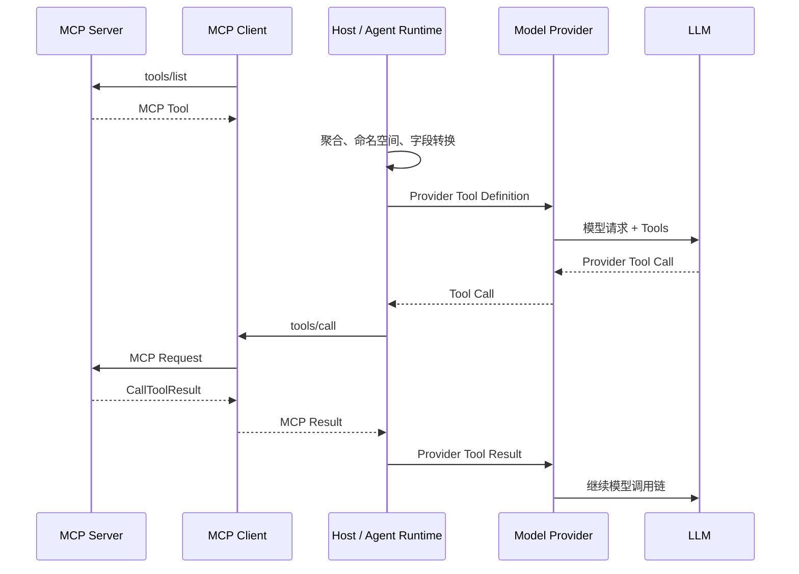
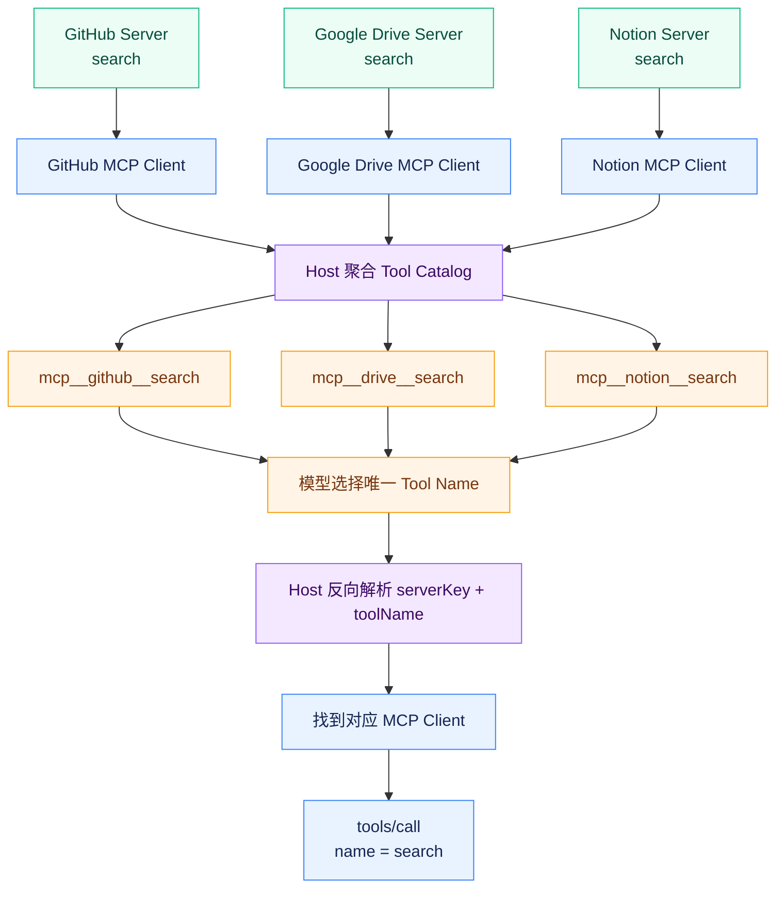
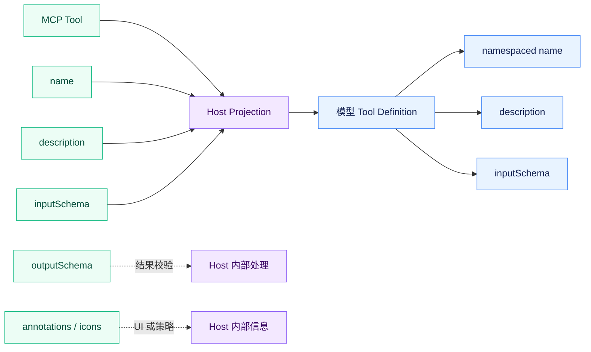
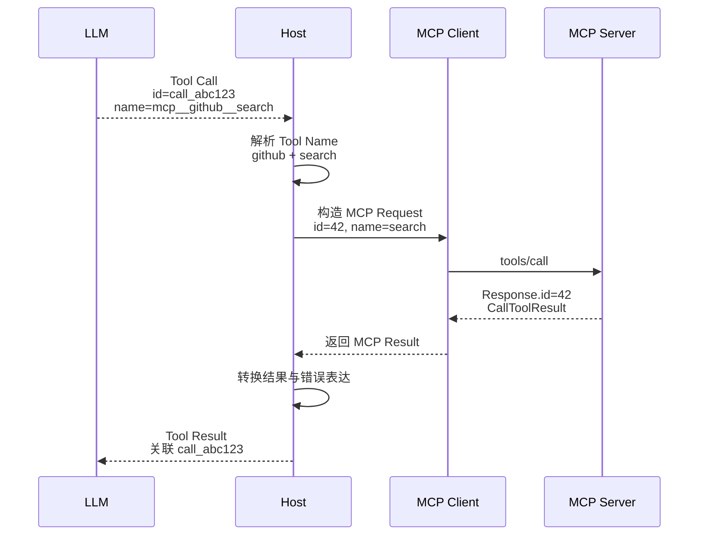

# 深入 MCP：MCP Tool 是怎么接入模型调用链的？

## Host 在 MCP 和大模型之间到底转换了什么？

MCP 只定义了 **Host 和 MCP Server 之间怎样交换 Tool**。

至于 Host 使用 OpenAI、Anthropic、Gemini 还是其他模型，以及 MCP Tool 最后怎样交给这些模型，MCP 并不规定。

所以一个完整系统实际上同时存在两个协议边界：

```text
MCP Server
    ↕ MCP
Host
    ↕ 模型 Provider API（模型服务商接口）
LLM
```

MCP Server 返回的是 MCP 定义的 `Tool`：

```text
name
description
inputSchema
outputSchema
annotations
...
```

但模型 API 并不认识所谓的：

```text
MCP Tool
```

它们有自己的 Tool Calling 格式。

所以 Host 真正需要做的事情，并不是简单地：

```text
把 MCP Server 返回的 JSON 转发给模型。
```

而是先把 MCP Tool 转换成模型接口能够理解的 Tool Definition。

官方 TypeScript SDK 的 `cli-client` 示例就把这一层单独抽象了出来。

它先定义了一套与具体模型厂商无关的结构：

```ts
interface ToolDefinition {
  name: string;
  description?: string;
  inputSchema: Record<string, unknown>;
}
```

然后不同模型 Provider 再分别把这套结构转换成自己的 API 格式。

模型返回 Tool Call 以后，又反过来：

```text
Provider Tool Call
    ↓
Host 内部 ToolCall
    ↓
MCP tools/call
```

MCP 和模型 Tool Calling 并不是同一套协议，只是 Host 把它们连接了起来。

这也意味着，所谓“某个模型支持 MCP”说法并不严谨，很多时候真正支持 MCP 的其实是模型外面的 Host 或 Agent Runtime。

模型本身最终看到的，仍然可能只是普通的 Tool Definition。



## 多个 MCP Server 的 Tool 怎么聚合，才不会失去原来的 Server 边界？

如果 Host 只连接一个 MCP Server，Tool 路由没有太大问题。

但真实 Agent 往往同时连接很多 Server。

例如：

```text
GitHub Server
Google Drive Server
Cloudflare Server
```

每个 Server 都通过自己的 `tools/list` 返回 Tool。

前面已经讲过，MCP 只要求 Tool Name 在**单个 Server 内唯一**。

因此完全可能出现：

```text
GitHub Server
└── search

Google Drive Server
└── search

Notion Server
└── search
```
如果 Host 把三个 `search` 原样交给模型，Server 边界就丢了。

模型只会看到几个同名 Tool，Host 后面也无法只根据 `name = search` 判断模型到底选择了哪一个 Server。

所以多 Server Host 通常需要建立自己的 **Namespacing（命名空间）**。

例如：

```text
mcp__github__search
mcp__drive__search
mcp__notion__search
```

这里的：

```text
mcp__github__search
```

并不是 GitHub MCP Server 原本声明的 Tool Name。

Server 真正知道的仍然可能只是：

```text
search
```

前面的：

```text
mcp__github__
```

是 Host 为了把多个 Server 聚合成一个模型 Tool Catalog（工具目录）而加入的路由信息。

官方 TypeScript SDK 的 `cli-client` 示例就采用了这种方式：

```ts
mcp__<server>__<tool>
```

Namespacing 实际上承担了：

```text
模型 Tool 空间 → MCP Server 空间
```

之间的路由映射。

这里还有一个问题。

模型真正看到的 Tool Name 已经发生了变化。

Server 描述的是：

```text
search
```

模型看到的却可能是：

```text
mcp__github__search
```

因此 Host 必须始终保留：

```text
模型 Tool Name
        ↕
Server + 原始 MCP Tool Name
```

这层映射。

否则 Tool List 一旦刷新、Server 重连或者命名规则发生变化，模型返回的 Tool Call 就可能无法正确路由。

也正因为如此，多 Server Tool 聚合应该属于 Host，而不是塞进 MCP Client 内部。

Client 只需要理解：

```text
我对应的 Server 有哪些 Tool。
```

Host 才需要理解：

```text
所有 Server 的 Tool 怎样共同出现在同一个模型面前。
```



## MCP Tool 转成模型 Tool 时，哪些信息会被保留，哪些信息会丢掉？

上一章我们已经看到，一个完整 MCP Tool 可以包含：

```text
name
title
description
inputSchema
outputSchema
annotations
icons
...
```

但这些字段并不意味着都应该进入模型。

官方示例把 MCP Tool 转成模型侧 Tool Definition 时，只保留了：

```text
name
description
inputSchema
```

其中 `name` 还不是直接使用原始值，而是先经过前面讲的 Namespacing。

形成类似：

```text
MCP Tool

name
description
inputSchema
outputSchema
annotations
icons
        ↓
Host Projection（Host 对字段进行投影/裁剪）
        ↓
Model Tool

namespaced name
description
inputSchema
```



为什么 `icons` 没有进去？

因为它主要服务 Host UI（用户界面）。

为什么 `annotations` 没有直接交给模型？

因为它首先是 Host 用来理解 Tool 行为的 Hint（提示信息），而且前面已经讲过，这些 Annotation 本身还是不可信的 Server 自我声明。

为什么 `outputSchema` 也没有直接放进模型 Tool Definition？

因为模型在决定：

```text
我要不要调用这个 Tool，以及应该怎样构造 Arguments。
```

核心需要的是：

```text
name
description
inputSchema
```

至于执行以后返回什么结构，更多属于 Host 对 Tool Result 的验证和处理。

## 模型返回的 Tool Call，为什么不能直接当成 MCP `tools/call`？

模型产生 Tool Call 以后，看起来信息已经非常接近 MCP：

```text
name
arguments
```

但它仍然不是 MCP Request。

最明显的区别之一就是：

**两边的 ID 根本不是一个。**

例如一个模型 Provider 返回：

```text
tool_call_id = call_abc123
```

这个 ID 用来表示：

```text
当前模型输出中的这一次 Tool Call。
```

后面 Host 把 Tool Result 重新交给模型时，还需要使用这个 ID 告诉模型：

```text
这份结果对应你刚才的 call_abc123。
```

而 Host 真正向 MCP Server 发出 `tools/call`时，又会产生自己的 JSON-RPC Request ID：

```json
{
  "jsonrpc": "2.0",
  "id": 42,
  "method": "tools/call",
  "params": {
    "name": "search",
    "arguments": {}
  }
}
```

这里：

```text
id = 42
```

解决的是：

```text
MCP Server 返回的 Response 对应哪一条 MCP Request？
```

所以 `Provider Tool Call ID` 和 `MCP JSON-RPC Request ID`处在两个协议世界里。

它们解决的是两种不同的关联关系。

除了 ID，Tool Name 也已经发生过一次转换。

模型可能返回：

```text
mcp__github__search
```

但 MCP Server 根本不知道这个名字。

Host 必须先恢复：

```text
serverKey = github
toolName = search
```

然后再构造真正的：

```text
tools/call
```

所以模型 Tool Call 到 MCP Request 之间至少存在两步：

**路由解析**

和：

**协议消息构造**

并不是把模型返回的 JSON 原样转发过去。

## MCP Tool Result 回到模型之前，为什么还需要一次适配？

Tool Definition 从 MCP 进入模型时经历了一次转换。

Tool Result 回来时，同样存在这个问题。

MCP 的 `CallToolResult` 可以表达的内容很多。

例如：

```text
Text
Image
Audio
Resource Link
Embedded Resource
structuredContent
isError
```

但模型 Provider 的 Tool Result 接口未必能够完整表达所有这些信息。

因此：

```text
MCP CallToolResult
```

也不能直接原样交给模型。

官方示例举了一个例子：

```text
对准备注入模型的 Server 文本设置长度上限。
```

它把单次注入内容限制在一定字符数量，过长就截断。

MCP Server 完全可以返回非常大的 Tool Result。

但 Host 最终是否允许这几十万字符全部进入模型 Context（上下文），是 Host 自己需要控制的问题，也就是我们开发 Agent Runtime的时候需要考虑的问题。

所以：

```text
MCP Server 能返回什么，和 Host 最终允许模型看到什么，并不能完全等同。
```

错误结果也一样。

MCP Tool 可以通过：

```text
isError = true
```

表示：

```text
Tool 本身执行了，但业务执行失败。
```

而模型 Provider 不一定有一个完全对应的：

```text
isError
```

字段。

官方 OpenAI Chat Completions 示例就会把失败转换成文本：

```text
[tool error] ...
```

再作为 Tool Message 交回模型。

这里再次发生了语义映射：

```text
MCP isError
        ↓
Host
        ↓
Provider 能理解的失败表达
```
Host 在两边承担了两次转换：

```text
MCP Tool
        ↓
模型 Tool
```

以及：

```text
MCP Tool Result
        ↓
模型 Tool Result
```

再加上一层：

```text
模型侧 Tool Name / Tool Call ID
        ↕
MCP Server / Tool Name / Request ID
```

的路由和关联。



