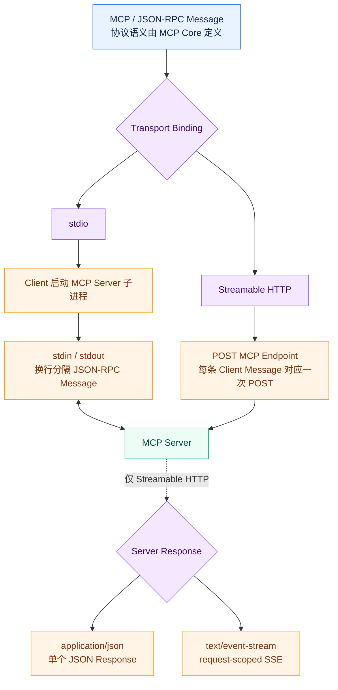
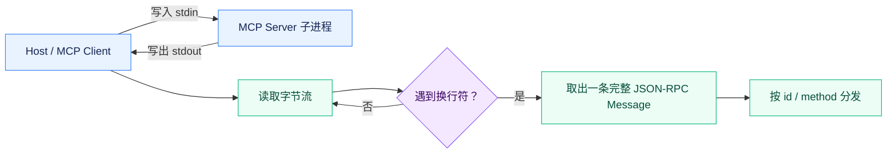
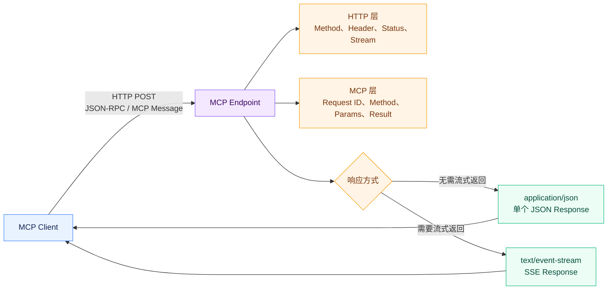
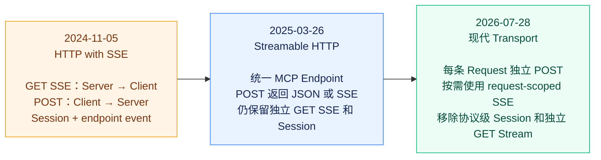

# 深入 MCP：MCP 的消息是怎么传输的？




MCP 定义了一条 Message 应该是什么结构、`method` 表达什么含义，但 JSON-RPC Message 本身并不会凭空从 Client 跑到 Server。

真正负责把这些消息发送出去的这一层，就是 **Transport**。

当前 `2026-07-28` 规范提供了两种标准 Transport：**stdio** 和 **Streamable HTTP**。

stdio 主要用于本地进程之间通信，Client 启动一个 MCP Server 子进程，然后通过标准输入输出交换消息；

Streamable HTTP 则主要面向远程 MCP Server，每一条 Client Message 都通过 HTTP POST 发送，Server 再通过普通 JSON Response 或 SSE Response 返回结果。

**Transport 只负责“消息怎么过去”，不负责定义“消息是什么意思”。**


无论一条 `tools/call` 最终通过 stdio 还是 HTTP 发送，它仍然是同一条 MCP `tools/call`。Transport 可以规定消息怎样分帧、怎样传输 Metadata、连接怎样结束，但不能重新定义 `tools/call` 的业务语义。

官方规范把这种关系称为 Transport Binding：协议语义在不同 Transport 上应该保持一致。

## stdio 是怎么传输 MCP 消息的？

stdio 就是 Standard Input / Standard Output，也就是我们平时说的：

`stdin`

`stdout`

在 stdio Transport 中，**MCP Client 负责启动 MCP Server 子进程**。Server 从自己的 `stdin` 读取 MCP Message，再把结果写到 `stdout`。

如果 Host 启动了一个 Node.js MCP Server，从操作系统进程关系来看，大致就是：

`Host / MCP Client → spawn() → MCP Server Process`

Client 持有 Server 子进程的标准输入输出 Pipe。Client 想发送消息，就往 Server 的 `stdin` 写；Server 想返回消息，就往自己的 `stdout` 写。

这里并没有 HTTP，也没有端口，更不需要让 MCP Server 自己监听一个网络地址。

但 JSON-RPC 是一段 JSON，而 stdio 本质上只是一条连续的字节流。

假设 Server 连续收到两条消息：

`{"jsonrpc":"2.0","id":1,...}`

和：

`{"jsonrpc":"2.0","id":2,...}`

如果只是把两段 JSON 连续写进 Pipe：

`{...}{...}`

接收方怎么知道第一条消息在哪里结束？

所以 stdio Transport 必须解决一个问题：**Message Framing，也就是消息边界。**

MCP 的处理方式非常简单：

```text
一条 MCP Message 占一行，通过换行符分隔。
```

当前规范明确要求，每一条消息都是一个完整的 JSON-RPC Request、Response 或 Notification，消息之间通过换行分隔，而且一条消息内部不能包含嵌入式换行。所有消息都必须使用 UTF-8 编码。

接收方不断读取字节，遇到换行就知道：

```text
一条完整 MCP Message 收到了。
```

这套设计虽然简单，但却非常实用。

它没有再设计 Length Prefix（长度前缀），也没有引入复杂的 Binary Frame（二进制帧）。因为 MCP Message 本身就是 JSON，而 JSON 经过序列化以后完全可以压缩成单行，换行天然可以作为消息分隔符。



不过 stdio 有一个需要注意的地方：

**所有 Request、Response 和 Notification 都共享同一条 stdout 通道。**

假设 Client 同时发送三个 Request，Server 的 Response 完全可以按照 `Response 3 → Response 1 → Response 2` 的顺序写回 stdout。

stdio 并不会给每个 Request 建立一条独立的数据流。

真正负责把 Response 和 Request 对应起来的，仍然是我们第二章讲过的 JSON-RPC `id`。

所以 stdio Transport 解决的是：

```text
一条 Message 从哪里开始、在哪里结束，以及字节如何在两个进程之间传递。
```

JSON-RPC `id` 解决的是：

```text
这条 Response 到底属于哪个 Request。
```

## 为什么 stdio 的 stdout 不能随便输出日志？

普通程序里，我们经常直接：

`console.log("server started")`

或者：

`print("debug...")`

但如果这个程序正在作为 stdio MCP Server 运行，这样做可能直接把协议通信破坏掉。

原因就是刚才讲的 Message Framing（消息分帧）。

对于 MCP Client 来说，Server 的 stdout 不是普通终端输出，而是一条**纯协议通道**。

Client 会把 stdout 中读到的每一行都当成 MCP Message：

`read line → parse JSON → validate JSON-RPC → dispatch`

假设 Server 正常准备返回：

```json
{"jsonrpc":"2.0","id":1,"result":{"resultType":"complete"}}
```

但代码前面突然执行：

`console.log("loading database...")`

stdout 就变成了两行：

`loading database...`

`{"jsonrpc":"2.0","id":1,...}`

Client 读到第一行以后，会尝试把：

`loading database...`

当成 JSON-RPC Message 解析。

解析失败。

所以当前规范直接规定：

> Server **禁止** 向 stdout 写入任何不是合法 MCP Message 的内容。

同样，Client 也不能向 Server 的 stdin 塞入非 MCP Message。

那日志应该写到哪里？

**stderr。**

Server 可以把 UTF-8 日志输出到 `stderr`。Client 可以选择捕获、转发或者直接忽略这些内容，而且 Client 不应该因为 stderr 出现输出，就认为 MCP Server 一定发生了错误。

官方 TypeScript SDK 的 stdio 文档就专门拿 `console.log()` 举例：只要往 stdout 插入一条普通 Debug Log，Host 就会尝试把这条日志解析成协议消息。官方示例因此使用 `console.error()` 输出 Server Ready 等日志，因为它进入的是 stderr。

## Streamable HTTP 是怎么传输 MCP 消息的？

stdio 适合：

```text
Host 和 MCP Server 运行在同一台机器。
```

但如果 MCP Server 部署在另外一台服务器、Cloudflare Worker、云函数或者企业内部服务里，Client 显然不能再通过本地 stdin/stdout 和它通信。

这就是 Streamable HTTP 要解决的问题。

在当前 `2026-07-28` 规范里，一个 Streamable HTTP Server 对外暴露一个 MCP Endpoint，例如：

`https://example.com/mcp`

Client 每发送一条 JSON-RPC Message，都要创建一个新的 HTTP POST Request。

例如一条 `tools/call` 在 Wire 上可能真正长这样：

```http
POST /mcp HTTP/1.1
Content-Type: application/json
Accept: application/json, text/event-stream
MCP-Protocol-Version: 2026-07-28
Mcp-Method: tools/call
Mcp-Name: get_weather

{
  "jsonrpc": "2.0",
  "id": 1,
  "method": "tools/call",
  "params": {
    "_meta": {
      "io.modelcontextprotocol/protocolVersion": "2026-07-28",
      "io.modelcontextprotocol/clientCapabilities": {}
    },
    "name": "get_weather",
    "arguments": {
      "location": "Tokyo"
    }
  }
}
```

注意这里其实同时存在两层协议。

外层是：

**HTTP**

内层是：

**JSON-RPC / MCP**

HTTP 负责：

Request Method、Header、Body、HTTP Status、Response Stream。

JSON-RPC / MCP 负责：

Request ID、Method、Params、MCP Metadata、Result。

所以：

`HTTP POST`

并不是 MCP 的 `Request`。

它只是用来承载 MCP Request 的 Transport Envelope。

这一点非常重要。

例如 HTTP 层可能返回：

`400 Bad Request`

而 MCP JSON-RPC 层本身也有：

`-32602 Invalid params`

它们处在不同层次。

同样，HTTP `200 OK` 也不能简单等价于：

```text
MCP Tool 执行成功。
```

它只说明 HTTP 层成功完成了这次响应过程。内部真正的 MCP Message 仍然可能携带不同的协议结果。

当前 Streamable HTTP 还有一个特点：

```text
一条 Client JSON-RPC Message 对应一次新的 HTTP POST。
```

所以它和 stdio 的长字节流完全不同。

stdio 是：

`一条连接 → 不断发送很多 MCP Message`

而现代 Streamable HTTP 则是：

`Message A → POST A`

`Message B → POST B`

`Message C → POST C`



## 为什么 Server 有时直接返回 JSON，有时却要返回 SSE？

Client 发出一个 HTTP POST Request 以后，Server 有两种合法的 Response 方式：

`Content-Type: application/json`

或者：

`Content-Type: text/event-stream`

Client 必须同时支持这两种。

为什么需要两种？

假设 Client 调用一个很简单的操作。

Server 很快就能算出最终结果，而且执行期间没有任何额外消息需要返回。

那最简单的方法就是直接返回一个 JSON：

`HTTP Request → JSON Response`

一次 HTTP Request / Response 就结束了。

但有些操作没有这么简单。

假设 Tool 执行需要几十秒，中间 Server 希望不断告诉 Client：

```text
已经完成 20%。
正在处理第三个文件。
当前阶段已经结束。
```

如果只允许最后返回一个 JSON Response，那么 Server 必须等所有工作完成以后一次性返回。

这时候就需要 SSE。

**SSE，全称 Server-Sent Events。**

它建立在普通 HTTP Response 之上，但 Server 不会马上结束 Response Body，而是保持这条 Response Stream，在同一条 HTTP Response 中持续发送多个 Event。

因此当前 MCP 可以形成这样的结构：

`Client POST Request`

↓

`Server 打开 SSE Response`

↓

`Notification`

↓

`Notification`

↓

`最终 JSON-RPC Response`

↓

`SSE Stream 结束`

当前规范把这种方式称为 **request-scoped SSE**：这条 SSE Stream 只属于最初那个 HTTP Request，它里面出现的 Server Message 应该和该请求有关，最终还应该包含这条 JSON-RPC Request 对应的 Response。

注意： **SSE 并不是第三种 MCP Transport。**

当前标准 Transport 仍然是 `stdio` 和 `Streamable HTTP` 。

SSE 只是 **Streamable HTTP 在 Server 需要通过同一次 Response 发送多条消息时采用的流式响应机制**。

Server 可以根据当前请求选择其中一种，而 Client 必须有能力处理两种情况。

这也是“Streamable HTTP”名字里 **Streamable** 的真正意义之一。

它既可以退化成最普通的 HTTP JSON Request/Response，也可以在需要时升级成流式 Response，而不是要求所有 MCP HTTP 请求都必须长期保持 SSE。

## 为什么旧版 Streamable HTTP 会设计 GET SSE 和 `Mcp-Session-Id`，新版又把它们删除了？

要理解这个变化，需要把 HTTP Transport 的演进稍微往前追一步。

MCP 在 `2024-11-05` 使用的还不是 Streamable HTTP，而是一套叫 **HTTP with SSE** 的 Transport。

当时 Server 需要提供两个 Endpoint：

一个 SSE Endpoint，Client 先通过 GET 建立长期 Server → Client 通道；

另一个 POST Endpoint，Client 通过 HTTP POST 向 Server 发送 MCP Message。

连接建立以后，Server 还要先通过 SSE 发送一个 `endpoint` Event，告诉 Client：

```text
你以后应该把 POST 发到哪里。
```

大概可以理解成：

`GET SSE：Server → Client`

`POST：Client → Server`

也就是说，为了获得双向通信能力，当时实际上拼出了两条不同方向的 HTTP 通道。

到了 `2025-03-26`，MCP 用 **Streamable HTTP** 替换了这套旧 HTTP+SSE Transport。

最大的变化之一，是把双方统一到一个 MCP Endpoint 上。

Client 可以 POST Message，而 Server 可以：

直接返回 JSON；

或者把这个 POST 的 Response 变成 SSE Stream。

这已经比之前“两套 Endpoint”的设计简单很多。

但这一代 Streamable HTTP 仍然保留了两个非常明显的有状态 / 双向的痕迹。

第一个就是：

**独立 GET SSE。**

即使 Client 当前没有发送一个 POST Request，也可以向 MCP Endpoint 发 GET，单独建立一条 SSE Stream。

这样 Server 就可以主动向 Client发送 Notification，甚至发送 Server → Client Request。

第二个是：

**`MCP-Session-Id`。**

严格来说，它不是每个 Server 都必须启用的。旧版规范规定的是：Server **可以**在初始化时分配 Session ID；一旦 Server 分配了，Client 后续所有 HTTP Request 就必须继续携带这个 Session ID。

为什么需要 Session？

因为旧版协议本身就很依赖：

`initialize → 保存上下文 → 后续继续通信`

Server 还可能维护一条独立 GET SSE Stream，用来主动向 Client 发消息。

此时 Server 必须知道：

```text
这个 POST 属于哪个 Client？
这条 GET SSE 又属于哪个 Client？
它们是不是同一组协议交互？
```

`MCP-Session-Id` 就为这些逻辑相关的交互提供了一个连接点。

所以旧版实际上形成了：

**Session + POST + GET SSE**

这一整套相互配合的模型。

但到了 `2026-07-28`，前面第二章已经看到 MCP 开始转向无状态。

每条 Request 自己带：

Protocol Version

Client Capabilities

等必要协议上下文。

Server 不再依赖：

```text
“这个 Client 在之前的 initialize 里告诉过我什么。”
```

同时 Server 也不再主动发起独立 JSON-RPC Request。

这样一来，很多过去需要独立 GET SSE 长连接才能完成的事情，已经不再要求 Server 随时主动“找到 Client”。

于是 `2026-07-28` 一次性移除了：

**协议级 Session**

`Mcp-Session-Id`

以及：

**独立 GET Stream Endpoint。**



## 为什么新版 HTTP Request 又增加了 `Mcp-Method`、`Mcp-Name` 这些 Header？

这里看起来有一个很奇怪的设计。

MCP Request Body 里明明已经写着：

```json
{
  "method": "tools/call",
  "params": {
    "name": "get_weather"
  }
}
```

为什么新版 Streamable HTTP 又要求：

`Mcp-Method: tools/call`

`Mcp-Name: get_weather`

不是重复了吗？

确实重复。

而且是**故意重复**。

因为一个远程 MCP Request 到达真正的 MCP Server 之前，通常不会凭空穿过互联网直接落到业务进程。

中间可能还有：

Load Balancer

API Gateway

Reverse Proxy

WAF

Rate Limiter

Observability System

这些基础设施并不一定希望解析一遍 JSON-RPC Body，才能知道：

```text
这是什么 MCP 操作？
```

例如 Gateway 想做：

`tools/call → 允许`

`resources/read → 允许`

某个高风险 Method → 限流

或者想统计：

```text
get_weather 一分钟到底调用了多少次？
```

如果这些信息只存在 JSON Body 中，Gateway 必须理解 MCP 的 JSON Schema、读取 Body，再解析：

`method`

和：

`params.name`

这会让 MCP 流量对于普通 HTTP 基础设施来说变得不透明。

所以 `2026-07-28` 把部分重要字段**镜像到 HTTP Header**。

当前规范要求所有 HTTP MCP Request 都包含：

`Mcp-Method`

它来源于 JSON-RPC Body 的：

`method`

而对于：

`tools/call`

`resources/read`

`prompts/get`

还必须包含：

`Mcp-Name`

分别来源于：

`params.name`

或者：

`params.uri`。

这样 Gateway 不需要理解整个 Body，就能看到：

`Mcp-Method: tools/call`

`Mcp-Name: execute_sql`

官方 `2026-07-28` 发布说明直接把这项变化称为 **Header-based routing**，目的就是让 Gateway、Rate Limiter 和 WAF 可以根据 Header 做路由和计量，而不必解析 JSON Body。

类似的还有：

`MCP-Protocol-Version`

它把 Request `_meta` 中的 Protocol Version 镜像到 HTTP Header。

为什么版本也需要放 Header？

原因类似。

有些 Gateway 甚至在请求进入 MCP Runtime 之前，就需要知道：

```text
这是哪个 MCP Revision？
```

然后决定应该转给：

Legacy Handler

还是：

Modern Handler。

当前 TypeScript SDK 的 HTTP Entry 就需要区分 2025-era 和 2026-era Traffic，只不过具体分类逻辑由 SDK 封装了。

不过这里必须强调一个原则：

```text
Header 不是协议真相源。
```

真正的 MCP 信息仍然存在 JSON-RPC Body 中。

HTTP Header 只是 Transport 层对关键字段做的 Mirror。

当前规范明确规定，`MCP-Protocol-Version` Header 必须和 Body `_meta` 中的版本一致。如果两边不一致，Server 必须返回 `400 Bad Request`，并使用 `HeaderMismatch` JSON-RPC Error 拒绝请求。

为什么必须检查一致性？

假设 Gateway 看到：

`Mcp-Method: resources/read`

于是按照低风险请求放行。

但 Body 里真正写的是：

`tools/call`

如果 Server 只相信 Body，而 Gateway 只相信 Header，就会出现两层基础设施对“这到底是什么请求”产生不同理解。

这是一类非常危险的协议歧义问题。

所以：

**Body 定义真实协议语义，Header 提供基础设施可见性，两者必须保持一致。**

新版还进一步允许 Tool Schema 使用：

`x-mcp-header`

把某些原本位于 Tool Arguments 中的简单参数镜像成：

`Mcp-Param-*`

Header。

例如 `execute_sql` 的 `region` 参数可以最终形成：

`Mcp-Param-Region: us-west1`

这样 Gateway 甚至可以根据具体业务参数：

```text
不同 Region 路由到不同后端。
```

不过能够被镜像的参数受到严格限制，只允许适合安全表示为 Header 的 Primitive 类型。

从这个设计可以看出一个很明显的趋势：

早期 MCP 更多关注的是：

```text
Client 和 Server 能不能通信。
```

到了现在，协议已经开始认真考虑：

```text
MCP Request 真正进入企业网络以后，Gateway、WAF、Load Balancer、Observability 这些基础设施怎么理解它。
```

这也是 MCP 从“开发者本地工具协议”逐渐走向真正远程基础设施协议时必然需要解决的问题。

## stdio 和 Streamable HTTP 到底有什么本质区别？

两种 Transport 最容易被简单总结成：

```text
stdio 是本地，HTTP 是远程。
```

这个结论并没有错，但其实只说到表面。

真正的区别首先来自**生命周期模型**。

stdio 下，Client 会启动 MCP Server 子进程。

Client 和 Server 之间存在一条和进程生命周期绑定的双向 Byte Stream。

只要 Server Process 没结束：

`stdin / stdout`

就一直存在。

所以 stdio 天然拥有一个长期 Connection。

Streamable HTTP 则不同。

Server 是独立运行的网络服务，不由某一个 Client 启动。

一个 Server 可以同时处理很多 Client。

对于现代协议，每一条 Client Message 又是一次独立 HTTP POST，所以 Request 本身天然形成了隔离边界。

两者在 **Message Framing** 上也完全不同。

stdio 依靠：

```text
newline
```

划分 Message。

Streamable HTTP 则拥有：

```text
HTTP Request Body
```

作为消息边界。

HTTP Server 不需要自己扫描字节流寻找换行，因为 Web Server 已经知道：

```text
这个 Body 到这里结束。
```

Response 方式同样不同。

stdio 所有 Response 和 Notification 都共享同一条 stdout Stream，最终通过 JSON-RPC `id`、Subscription ID 等协议字段区分属于谁。

Streamable HTTP 则拥有“每个 HTTP Request 对应自己的 Response”，如果一个请求需要多个 Server Message，再在这一条 Response 中开启 request-scoped SSE。

所以可以这样理解：

**stdio 是在一条长期共享 Byte Stream 上复用很多 MCP Exchange。**

**Streamable HTTP 是把每个 MCP Exchange 映射到独立的 HTTP Request/Response 边界。**

这也是为什么有些行为在两种 Transport 上会采用不同表达方式。

因为协议层想表达的是同一件事，但 Transport 能提供的底层能力并不完全相同。

另外，两种 Transport 面对的基础设施环境也完全不同。

stdio 运行在本地进程边界内，更多面对的是：

进程启动、Pipe、stderr、进程退出。

Streamable HTTP 面对的则是：

HTTP Server、Gateway、Proxy、WAF、负载均衡、网络中断、远程身份和多实例部署。

因此 Streamable HTTP 才需要 Header Mirroring、Origin 校验等 stdio 完全不需要考虑的机制。当前规范也明确要求远程 Streamable HTTP Server 校验 `Origin`，本地 HTTP Server 应优先绑定 localhost，以防止 DNS Rebinding 等攻击。

但无论两者底层有多大差异，MCP 刻意保持了一件事情不变：

**上层协议语义应该一致。**

Client 调用：

`tools/call`

不应该因为 Server 是一个本地 stdio 子进程，就变成一种 Tool Call；换成远程 HTTP Server，又变成另一种 Tool Call。

Transport 解决的是：

```text
怎么送到那里。
```

MCP Core 解决的是：

```text
送过去的东西到底是什么意思。
```

这也是为什么 MCP 可以同时拥有 stdio 和 Streamable HTTP，而不需要维护两套完全不同的 Tool、Resource 和 Prompt 协议。
