# DeepSeek Harness 的上下文压缩机制：从 Token Pressure 到 Compaction Checkpoint

随着 Coding Agent 持续执行任务，Context 中会不断累积用户消息、模型回复、Tool Call、Tool Result、文件内容以及各种运行时上下文。

当这些内容逐渐逼近模型的 Context Window 时，Agent 必须想办法释放空间，否则下一次再调用 LLM 的时候就可能报错。

对于我们来说，最容易想到的方案是：

```text
历史太长
   ↓
调用 LLM 总结
   ↓
删除旧消息
   ↓
留下 Summary
```

但 DeepSeek Harness 的实现要复杂得多。

一次 Compaction，可能经历：

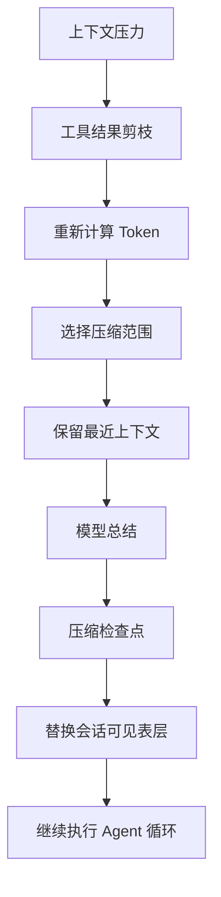

更重要的是，DeepSeek Harness 并没有把这套算法直接写死在 Agent Loop 中。

它首先定义的是：

```text
Compaction 是一种可替换的 Agent Capability。
```

具体采用什么压缩算法，则交给不同的 Compaction Provider 实现。

::: tip 版本说明
本文正文基于 DeepSeek Harness `ddefc45f` 源码完成，是对该阶段 Context Compaction 机制的一次完整源码分析。

为保留原始设计、分析过程以及后续架构演进，本文正文不再随每个版本重新改写。当后续版本出现实现变化时，会在对应章节增加「版本变化」提示。

新版本差异分析将在公众号文章及时发布更新。新版本架构图、分析图等将在星球逐版本更新发布。
:::

## 一、Compaction 不是 Agent Loop 的一部分：它是一个可替换能力

DeepSeek Harness 的一个核心设计理念是：

```text
Everything is a Plugin。
```

模型、工具、Session、文件系统、Sandbox 等能力都通过插件组合，Compaction 同样如此。官方将 Compaction 明确设计成一个 capability seam，而不是 Agent Loop 中不可替换的一段内部代码。

<PlainExplanation title="什么是 seam？">

英文里的 `seam` 原意是“接缝”，指两块材料拼接时留下的连接处。Michael Feathers 在《修改代码的艺术》（*Working Effectively with Legacy Code*）中把它借用到软件工程里，用来描述代码中一个特殊的“可改变位置”：你可以通过它改变程序的行为，却不必直接修改发生变化的那段代码。

例如，代码依赖的是一个接口，实际使用哪个实现则在构造、注入或配置时决定。测试时可以放入一个替代实现，生产环境再放回真实实现；被测试的核心代码本身不需要改动。这个“决定替代谁”的位置，就是 seam 的启用点（enabling point）。

因此，`capability seam` 可以理解为“能力接缝”：Agent Loop 只依赖 Compaction 的行为约定，具体由哪个 Provider 实现则可以在外部决定。这里的重点不是“有一个接口”本身，而是压缩行为可以在这个边界上被替换，而不必把压缩逻辑写死在 Agent Loop 里。
</PlainExplanation>

整体关系可以简化成：

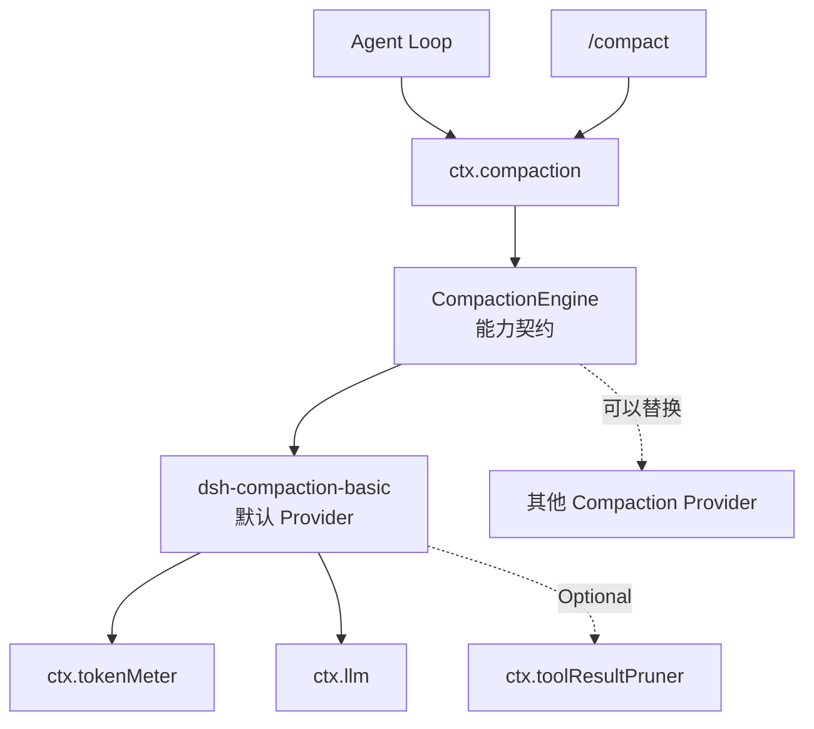

这里最容易混淆的是：

```text
dsh-compaction
```

和：

```text
dsh-compaction-basic
```

并不是同一个东西。

`@deepseek-ai/dsh-compaction` 定义的是共享契约，包括：

```text
ctx.compaction

CompactionEngine

compactIfNeeded()

compactNow()

compactRegion()

CompactionResult
```

它本身并不执行具体的压缩算法。

真正负责当前默认压缩逻辑的是：

```text
@deepseek-ai/dsh-compaction-basic
```

也就是：

```text
Compaction Capability
          ↓
CompactionEngine
          ↓
BasicCompactionEngine
          ↓
当前默认压缩算法
```

因此后面我们看到的：

```text
80% Pressure Threshold
16% Recent Tail
Tool Result Pruning
LLM Summary
Surface Replace
```

严格来说都属于 **`dsh-compaction-basic` 的策略**，而不是 `CompactionEngine` 接口强制规定的行为。

::: tip 版本变化：v0.1.7-rc.2
当前版本仍默认使用 `thresholdRatio = 0.8` 和 `retainRatio = 0.16`，但 80% 不再等同于固定的实际触发线。新版 Pressure 预算还会考虑模型输出预留和额外 Headroom，具体计算见第二节。
:::

### Compaction 有哪几个入口？

默认的 `BasicCompactionEngine` 主要面对三种场景：

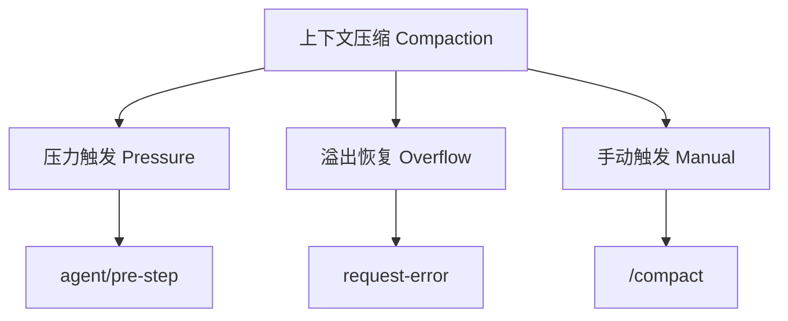

第一种是正常运行过程中的 **Token Pressure**。

第二种是请求已经触发：

```text
CONTEXT_WINDOW_EXCEEDED
```

之后的 **Overflow Recovery**。

第三种则是用户主动执行：

```text
/compact
```

三条路径最终都会复用底层的 Compaction 能力，但它们的触发条件和范围选择并不完全相同。

可以把前两种情况理解成“提前处理”和“事后恢复”。`Token Pressure` 发生在正常 Agent Loop 中：Harness 根据本地 Token 估算发现上下文快要达到阈值，于是在真正发起下一次模型请求前，先剪枝或压缩一部分历史。这是一种主动的容量管理，目标是尽量避免请求失败。

`Overflow Recovery` 则发生在模型请求已经被发送之后。此时模型或 Provider 已经返回 `CONTEXT_WINDOW_EXCEEDED`，说明本地估算没有成功阻止超限，或者本地估算与实际 Context Window 存在差异。Harness 只能先处理已有的上下文，再重新尝试请求，因此它是错误恢复路径，通常会采用更激进的压缩范围和保留策略。

## 二、从 Token Pressure 开始：什么时候真正触发 Compaction？

正常情况下，DeepSeek Harness 并不会每执行一步就压缩历史。

它首先通过：

```text
ctx.tokenMeter
```

计算当前 Session 对模型造成的 Context Pressure。

默认 `compaction-basic` 使用：

```text
thresholdRatio = 0.8
retainRatio    = 0.16
```

也就是默认在上下文大约达到模型 Context Window 的 80% 时进入压缩逻辑，并尝试原样保留最近约 16% Context Window 对应的历史预算。实际值还可以针对具体的 provider/model 单独覆盖。

核心关系可以理解成：

```text
thresholdTokens
    =
contextWindow × thresholdRatio


retainTokens
    =
contextWindow × retainRatio
```

例如某个模型的 Context Window 为：

```text
128K
```

那么默认策略大致对应：

```text
128K × 0.8
≈ 102.4K
```

达到这一压力附近之后，才会尝试 Compaction。

而：

```text
128K × 0.16
≈ 20.5K
```

则代表正常 Pressure Compaction 希望给最近历史保留的预算。

::: tip 版本变化：v0.1.7-rc.2
以上公式和数值对应本文分析基线 `ddefc45f`。新版会先从 Context Window 中扣除当前请求预留的输出 Token，得到消息预算；Pressure 阈值还会受额外 Headroom 限制（默认 `65,536` Token），而 `retainRatio = 0.16` 是按扣除输出预留后的消息预算计算。因此，80% 是阈值比例上限之一，不是固定触发点；这里的 `128K` 示例也仅用于说明旧版实现。
:::

注意，这里只是为了帮助理解比例关系。真正的实现还要经过 Token Meter、Surface Node 定价以及 Range Selection，并不是简单按照 messages 数组切掉前 64%。

<SupplementaryNote title="Token Meter 在源码中做了什么？">

`Token Meter` 可以把它理解成 Harness 内部统一的“Context 计量器”。它不是简单地把 `messages` 数组交给 Tokenizer，也不会为了测量再次调用模型。

官方 `measure(session)` 的过程更接近下面这样：

```text
Session Log
    ↓
读取上次尚未消费的事件
    ↓
逐条执行 _foldEvent()
    ↓
恢复 request header、Surface、替换关系和 usage anchor
    ↓
按当前模型路由重新计算价格
    ↓
生成 TokenMeasurement
```

这里的“重放”指的是重新应用已经写入 Session Log 的事件。例如日志中先后记录了 `request/header`、`user/message`、`assistant/message` 和 `surfaceOp: replace`，Token Meter 就按这个顺序恢复当前 Surface。它不会重新执行工具，也不会重新请求 LLM；它只是恢复“当前如果构造模型请求，输入状态是什么”。如果 Session 没有新增事件，Token Meter 会从已保存的消费位置继续，不必每次从第一条历史开始扫描。

这个快照中最容易混淆的是 `totalTokens` 和 `surfaceTokens`：

- `surfaceTokens` 是当前模型可见 Surface 节点的路由定价总和，也就是 `nodes[].tokens` 的总和。它只统计当前 Surface，不包含 request header 中单独保存的 Tool Schemas。
- `totalTokens` 是用于上下文压力判断的总量，源码计算为 `max(0, baseline.tokens + surfaceDeltaTokens)`。没有可复用的历史调用锚点时，它通常是 Tool Schemas 估算值加当前 Surface；存在匹配的上一次调用时，它还可能复用 Provider 报告的输入、缓存和输出 usage，再叠加 Surface 相对锚点的变化。

例如，假设当前 Surface 是 `8,000` tokens，Tool Schemas 是 `1,000` tokens。在没有历史 usage anchor 的情况下，可以近似得到：

```text
surfaceTokens = 8,000
totalTokens   ≈ 1,000 + 8,000 = 9,000
```

如果上一次成功模型调用报告的整体 usage 是 `12,000`，之后当前 Surface 又增加了 `500` tokens，那么当前结果可能是：

```text
surfaceTokens = 8,500
totalTokens   ≈ 12,000 + 500 = 12,500
```

所以，`surfaceTokens` 更接近“当前模型输入 Surface 的 Token 数”，而 `totalTokens` 是“用于判断上下文压力的计量值”，二者不能简单画等号。

如果最近一次成功的模型调用存在可复用的 Provider Usage，并且请求的 Provider、Model、Tools 等请求 Envelope 没有发生变化，Token Meter 会尽量把这份真实 Usage 当作一个 `baseline`，然后计算此后 Surface 增加或减少了多少。这里的 `baseline` 可能包含上一次请求的输入、缓存和输出 usage，因此它不等于当前输入 Surface 的长度。

可以粗略理解成：

```text
上一次真实 Usage
       +
之后新增的上下文
       -
之后被替换掉的上下文
       ↓
当前 Pressure
```

如果没有可靠的 Usage 可以复用，它才会退回本地估算。当前文本估算规则非常简单：大体按照 **4 个字符约等于 1 Token**，同时再给 Content Block、Message Role 等结构增加固定开销。因此它追求的是稳定、可重放的容量估计，而不是 Billing 级别的精确 Tokenizer 结果。图片则比较特殊：如果当前模型 Adapter 声明了图片 Token 定价，Token Meter 会使用对应 Route 的图片价格。

所以前面的：

```text
当前 Token >= Context Window × 0.8
```

更准确地说，其实是：

```text
ctx.tokenMeter.measure(...)
        ↓
measurement.totalTokens
        ↓
与 thresholdTokens 比较
```

也就是说，Compaction 自己并不负责“数 Token”：它用 `totalTokens` 判断是否达到 Pressure Threshold，再使用 `surfaceTokens` 和 `nodes` 选择可压缩范围。

需要注意的是，这套文本估算并不是精确 Tokenizer。源码也明确记录了它对 CJK 文本、JSON Schema 等内容可能存在明显误差，因此这里的 `80%` 和 `16%` 应理解为容量管理策略，而不是精确到某一个真实 Token 的硬切线。

注意，与 thresholdTokens 比较的是 totalTokens ，而不是 surfaceTokens。surfaceTokens 只包括 4 种事件：system/message 、user/message 、assistant/message 和 tool/result 。而 totalTokens 则还可能包括 Tool Schema 等内容。

</SupplementaryNote>

<SupplementaryNote title="Surface Node 定价（Token 计量）在源码中如何进行？">

这里的“定价”并不是计算 API 费用，而是给每个 Surface Node 分配一个“放入当前模型请求时需要承担多少 Token 成本”的数值。源码使用 `pricing` 这个词，文章中把它理解成“Token 计量”会更容易：

```text
这个 Surface Node
如果继续放进下一次模型请求
大约会占多少 Context？
```

DeepSeek Harness 并不是直接拿整个 `messages[]` 做一次总估算。Token Meter 会先把每个 Surface Event 转换成模型可见的 `Message`，再由 `analyzeNode()` 分析内容，并为它创建一个带位置的节点。

Token Meter 会给当前 Surface 中的每一个节点分别附上一份 Token 价格：

```text
Surface

system/message      →  820 tokens
user/message        →  460 tokens
assistant/message   →  730 tokens
tool/result         →  4,200 tokens
user/message        →  310 tokens
...
```

源码中的 `TokenSurfaceNode` 核心就是：

```ts
{
  seq,
  tokens,
  heuristicTokens
}
```

其中 `tokens` 是当前模型 Route 下用于 Pressure、Retention 和 Range Selection 的节点价格；`heuristicTokens` 则是与具体 Route 无关的固定启发式价格，主要用于 Surface Replace 等需要稳定重放的内部记账。

例如，一个普通文本节点按固定启发式计算得到 `120` tokens，在没有图片或文件特殊投影时，它的两个数值可能都是 `120`。一个包含图片的节点，图片 JSON 结构的启发式价格可能是 `20`，但当前模型 Route 实际按 `80` 个视觉 Token 加 `10` 个替代文本 Token 处理，那么它的 `heuristicTokens` 仍是 `20`，而 `tokens` 会变成约 `90`。此时，`tokens` 反映当前模型真正看到的图片表示；文件也类似，会按照模型实际看到的文件句柄文本重新估算。

有了逐节点价格以后，`retainRatio = 0.16` 才真正能够落到具体的历史范围上。

例如计算得到：

```text
retainTokens ≈ 20K
```

Harness 会从 Surface **最新端向前走**：

```text
最新 Node      3K
       ↑
前一个 Node    5K
       ↑
前一个 Node    8K
       ↑
前一个 Node    6K
```

累计到：

```text
3K + 5K + 8K + 6K = 22K
```

这表示最近上下文的实际保留量可能略高于 `retainTokens`，因为节点不能被切成半个。得到候选切点后，源码还会确认 Token Meter 的节点序列与当前 Session Surface 完全一致，并检查边界是否把 Tool Call 和 Tool Result 拆开；如果边界不平衡，就向更旧的一侧移动，直到形成安全的 Compactable Range。

达到 `retainTokens` 后，就得到一个初步切点：

```text
[ 更老的历史 ........ ] [ 最近约 22K ]
          ↓                   ↓
       准备压缩             原样保留
```

```text
Context Window
      ↓
得到 Retention Token Budget
      ↓
给当前 Surface Node 分别定价
      ↓
从新到旧累计 Node Token
      ↓
找到候选切点
      ↓
再根据 Tool Pairing 调整边界
```

</SupplementaryNote>


### Pressure 检查发生在哪里？

`BasicCompactionEngine` 会监听 Agent 生命周期。

核心逻辑可以抽象成：

```ts
ctx.on("agent/pre-step", async ({ agent, signal }, next) => {
    await compactIfNeeded(agent, "pressure", signal)

    return next()
})
```

也就是：

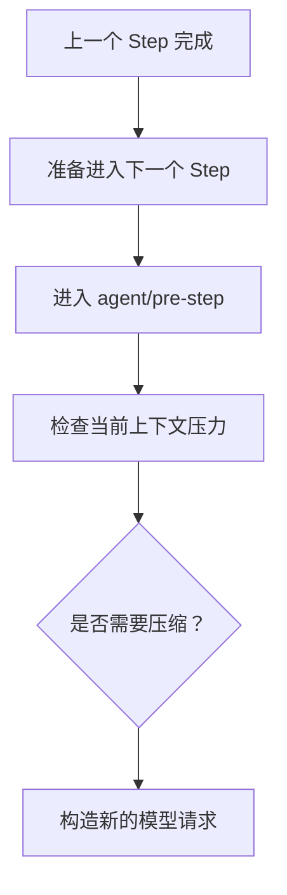

也就是一种 **between-step compaction**。


这里有一个重要设计：

DeepSeek Harness 并不是看到：

```text
totalTokens >= threshold
```

之后立刻调用 LLM 总结。

中间还有一步：

```text
先尝试不调用模型的 Tool Result Pruning。
```

---

## 三、为什么先 Prune （剪枝），再调用 LLM 做 Summary？

Coding Agent 的 Context 与普通聊天有一个很大的区别：

**Tool Result 往往非常大。**

例如一次：

```text
read_file
```

可能读取数千行源码。

一次：

```text
bash
```

可能输出大量日志。

一次搜索也可能返回几十 KB 内容。

这些东西可能已经完成它们的使命：

```text
Agent 已经读完文件
Agent 已经分析日志
Agent 已经根据 Tool Result 修改代码
```

但完整 Tool Result 仍然留在 Context 中。

如果这时候直接让另一个 LLM：

```text
“请把这几万 Token 总结一下。”
```

成本显然很高。

因此 DeepSeek Harness 提供一个独立的 companion service：

```text
@deepseek-ai/dsh-compaction-tool-result-pruner
```

对应：

```text
ctx.toolResultPruner
```

需要特别注意：

```text
Tool Result Pruner 不是另一个 Compaction 的具体实现。
```

它没有实现 `CompactionEngine`。

它只是 `compaction-basic` 可以选择使用的一项辅助能力。


### Tool Result 是怎么 Prune 的？

当前默认参数是：

```text
thresholdChars = 8192
headChars      = 4096
tailChars      = 1024
```


也就是说，当一个 Tool Result 中的文本超过约 8192 个 Unicode code points 时，它会保留：

```text
前 4096 字符
+
Prune Marker
+
后 1024 字符
```

形成：

```text
原始 Tool Result

┌──────────────────────────────────────┐
│                                      │
│ Head                                 │
│                                      │
│                                      │
│ 超大量中间内容                        │
│                                      │
│                                      │
│ Tail                                 │
│                                      │
└──────────────────────────────────────┘


Pruned Tool Result

┌──────────────────────────────────────┐
│ Head                                 │
│                                      │
│ [... tool result middle pruned ...]  │
│                                      │
│ Tail                                 │
└──────────────────────────────────────┘
```

整个过程：

```text
不调用 LLM
不生成 Summary
不需要推理
```

只是一个确定性的内容裁剪。

更重要的是：

**原始 Tool Result 并没有从 Session Log 中删除。**

Pruner 改变的依然只是模型当前看到的 Surface 。

这点后面会详细解释。


### 为什么 Prune 后还要重新 Measure（测量） ？

流程不是：

```text
Pressure
   ↓
Prune
   ↓
一定继续 Summary
```

实际上的逻辑是：

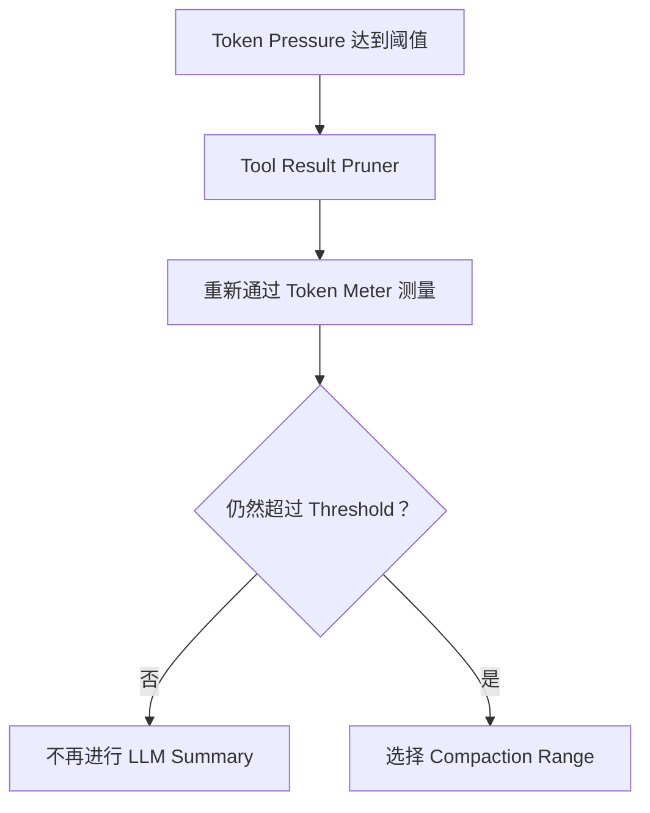

这一步很重要。

假如 Context 有 105K Token：

```text
Threshold = 102K
```

其中一个 Tool Result 占了大量空间。

Prune 后可能变成：

```text
96K
```

这时 Pressure 已经解除。

于是 `LLM Summarization` 根本没有必要发生。


因此 DeepSeek Harness 的 Compaction 并不等同于：

```text
“让模型总结历史。”
```

更准确地说，它是一套分层 Reduction (缩减)：

```text
先做便宜的、确定性的 Reduction
            ↓
         仍然不够
            ↓
再做昂贵的、语义性的 Summarization
```

---

## 四、DeepSeek Harness 到底选择哪一段历史进行压缩？

Prune 完成之后，如果 Context 依旧超过阈值，就必须真正选择一段历史进行 Summary。

核心逻辑位于：

```text
selectCompactableRange()
```

它解决的问题不是：

```text
“压不压？”
```

而是：

```text
“压哪一段？”
```

可以把核心算法简化成下面这段伪代码：

```ts
function selectCompactableRange(
    pricedSurfaceNodes,
    retainTokens,
) {
    if (pricedSurfaceNodes.length === 0) return null

    // 首个 System Prompt 不进入压缩范围。
    const firstIndex = hasSystemHead(pricedSurfaceNodes) ? 1 : 0

    // 从最新节点向前累计需要原样保留的 Token 预算。
    let accumulatedTokens = 0
    let keepFromIndex = pricedSurfaceNodes.length

    for (let index = pricedSurfaceNodes.length - 1; index >= 0; index -= 1) {
        accumulatedTokens += pricedSurfaceNodes[index].tokens
        keepFromIndex = index

        if (accumulatedTokens >= retainTokens) break
    }

    // 如果保留区已经覆盖到可压缩起点，就没有安全的压缩范围。
    if (keepFromIndex <= firstIndex) return null

    // 保留区的起点不能落在 Tool Call 与 Tool Result 之间。
    // 如果不平衡，就继续向更旧的节点移动边界。
    while (
        keepFromIndex > firstIndex &&
        !toolPairingBalancedBefore(pricedSurfaceNodes[keepFromIndex])
    ) {
        keepFromIndex -= 1
    }

    // 向前移动后仍没有可压缩范围，交给上层决定如何处理。
    if (keepFromIndex <= firstIndex) return null

    // 压缩从第一个非 System 节点开始，结束于保留区起点的前一个节点。
    return {
        start: pricedSurfaceNodes[firstIndex],
        end: pricedSurfaceNodes[keepFromIndex - 1],
    }
}
```

核心思想其实很直观：

```text
旧历史                               最新历史
│                                      │
▼                                      ▼

[ A ][ B ][ C ][ D ][ E ][ F ][ G ][ H ]
 └──────── 压缩区域 ────────┘ └─ 保留 ─┘
```

它不是“取最前面 N 条消息”。

而是从 Surface 尾部反向累计 Token：

```text
H
H + G
H + G + F
...
```

直到达到需要保留的 `retainTokens`。

剩下较旧的 Head Region 才成为 Compaction Candidate (压缩候选)。

这里的伪代码是概念化简写；当前源码实际按 `token-meter` 提供的 Surface Nodes 反向累加，并通过 `toolPairingBalancedBefore()` 修正边界。对应实现位于 `compaction-basic/src/region.ts`。

### System Prompt 为什么不会一起被压缩？

在当前实现中，Surface 的首个 `system/message` 被特殊保护，普通 Compaction Range 从第一个非 System 节点开始。

可以理解成：

```text
System Prompt       ← 保留
────────────────

User A
Assistant A
Tool Call
Tool Result
User B              ← Compaction Candidate
Assistant B

────────────────

User C
Assistant C         ← Recent Context 保留
```
因为 System Prompt 表达的是：

```text
Agent 身份
系统行为
Tool / Runtime 行为约束
```

它不是普通历史事实。

把 System Prompt 压缩成 Summary 会改变它原本的语义地位。

---

### 为什么 Tool Call 和 Tool Result 不能从中间切开？

Range Selection （范围选择）还有一个非常重要的限制：

```text
Compaction Boundary （压缩边界）必须保持 Tool Pairing Balanced （工具配对均衡）。
```

例如下面这种切法就是错误的：

```text
Assistant
└── tool_call(read_file)
          │
──────────┼──── Compaction Boundary（压缩边界）
          │
Tool Result
└── src/index.ts content
```

假如上半部分被 Summary 替换，模型可能最终看到：

```text
Compaction Summary

Tool Result:
src/index.ts ...
```

但是这个 Tool Result 对应什么调用？


为什么会返回？

可能已经无法恢复。

因此 DeepSeek Harness 提供：

```text
toolPairingBalancedBefore()

toolPairingBalancedAfter()
```

来判断 Range Boundary 是否安全。

于是实际边界可能发生调整：

```text
最初计划：

A
B
Tool Call
────────────
Tool Result
C


调整以后：

A
B
────────────
Tool Call
Tool Result
C
```

## 五、Range 选好以后，Summary 是怎么生成出来的？

现在终于进入大家通常理解的“压缩”部分：

```text
LLM Summarization
```

但 DeepSeek Harness 这里还有一个细节：

它不是重新构造一套完全不同的 Summarization Prompt，而是尽可能复用原 Conversation Prefix。

流程可以画成：

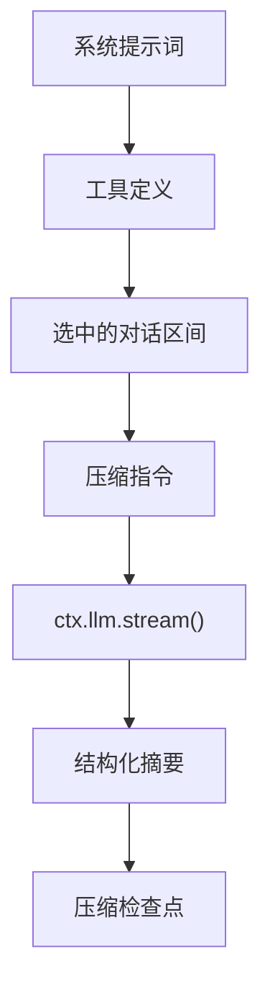

### Summarization Input 长什么样？

`buildSummarizationInput()` 会从当前 Session 中重建：

```text
System Prompt
    +
Tool Schemas
    +
被选中的 Messages
```

然后摘要请求再在末尾追加 Compaction Instruction：

```text
System
Tools
Message A
Message B
Message C
Compaction Instruction
```

注意顺序。

不是：

```text
新的 Summarizer System Prompt
+
整个聊天
```

而是尽量保持原 `Conversation Prefix` 不变。

理由就是：

```text
尽可能复用 Provider 已经存在的 warm prefix / KV Cache。
```
也就是提高缓存命中率。

::: tip 版本变化：v0.1.7-rc.2
Prefix Reuse 的核心思路没有变化。新版 Summary 请求还会携带从 Session 重建的 `toolHistory`，由运行时按模型路由投影工具定义和历史更新；同时，Summary 的默认 `maxTokens` 从 `8192` 调整为跟随 `headroomTokens`，当前默认值为 `65,536`。这些变化影响 Summary 请求预算和工具上下文恢复，不改变本节介绍的前缀复用机制。
:::

## 六、Compaction Summary 并不是一段普通摘要

如果只是：

```text
请总结一下我们的聊天
```

最终很可能得到：

```text
用户正在开发一个项目，已经修改了一些代码，目前正在解决认证问题……
```

这种摘要对 Coding Agent 来说远远不够。

Agent 重新接手任务时，更需要知道：

```text
用户真正要求什么？
已经修改了哪些文件？
之前做过什么决定？
出现了哪些错误？
错误怎么解决的？
当前执行到了哪里？
下一步是什么？
```

因此 `compaction-basic` 的默认 Summarization Instruction 要求输出一个结构化 Checkpoint。

当前结构主要包括：

```text
Primary Request and Intent（主要请求与目标）

Key Technical Concepts（关键技术概念）

Files and Code（文件与代码）

Errors and Fixes（错误与修复）

Pending Jobs（待处理任务）

Current Work（当前工作）

Next Step（下一步）

Critical Context（关键上下文）
```

其思想并不是保存聊天内容的“摘要”。

而是保存能够让另一个 Agent 恢复任务状态的最小工作集。

因此在 DeepSeek Harness 里，把它叫 `Checkpoint` 比单纯理解成 `Summary` 更准确。

<SupplementaryNote title="DeepSeek 官方压缩提示词（中文翻译）">

下面是 `dsh-compaction-basic/src/summarizer.ts` 中 `COMPACTION_INSTRUCTION` 的中文翻译。

你现在要作为这个 AI Coding Assistant 的压缩引擎工作。请将上面的对话压缩为一个结构化检查点，让另一个模型能够在不丢失关键上下文的情况下继续当前任务。

请严格按照下面的 Markdown 结构输出：保留所有章节，并保持顺序不变。使用简洁的项目符号，不要写成长段落。空章节写 `(none)`，不要省略任何章节。

```text
## Primary Request and Intent（主要请求与目标）
- 用户最初以及后续变化的目标；如果原话很重要，请逐字引用

## Key Technical Concepts（关键技术概念）
- 当前涉及的技术、框架、模式和约定

## Files and Code（文件与代码）
- 精确文件路径：它为什么重要、进行了哪些关键修改，或包含哪些关键代码片段

## Errors and Fixes（错误与修复）
- 出现了什么错误、如何解决，以及相关的用户反馈

## Pending Jobs（待处理任务）
- 用户明确要求但尚未完成的工作

## Current Work（当前工作）
- 在这个检查点，当前正在进行的具体工作

## Next Step（下一步）
- 紧接最近一次请求应该执行的唯一下一步；如果没有下一步，写 `(none)`

## Critical Context（关键上下文）
- 关键决定及其理由、限制条件、用户偏好、待解决问题，以及继续工作所需的数据
```

其他规则：

- 使用简洁的英文工程语言；准确保留文件路径、命令、错误字符串、标识符、数字、函数签名和语法片段。
- 忠实记录用户的反馈和明确指令，尤其是用户对之前内容的纠正。
- 不要提及这次摘要请求，也不要提及上下文已经被压缩。
- 只输出检查点文本，不要调用任何工具，也不要执行其他操作。
- 如果对话中已经存在 `<compacted-summary>`，说明那是之前的检查点。不要原样复制它；保留仍然有效的事实，删除已经过时的内容，并将新信息合并成同一份结构化检查点。

</SupplementaryNote>

## 七、为什么生成 Summary 后还要检查“它到底有没有变小”？

LLM 被要求总结，并不意味着：

```text
输出一定比输入短。
```

尤其当被压缩的范围区域很小时，结构化 Summary 再加上 Checkpoint 的约束框架，反而可能更长。

因此 DeepSeek Harness 会计算：

```text
framedSummaryTokenCount
```

然后与：

```text
shadowedRouteTokenCount
```

比较。

逻辑可以简化为：

```ts
if (
    framedSummaryTokenCount
    >=
    shadowedRouteTokenCount
) {
    throw new Error(
        "summary is not smaller than the shadowed content"
    )
}
```

也就是说：

```text
原区域：2000 tokens
Summary：500 tokens
```

可以接受。

但是：

```text
原区域：300 tokens
Checkpoint：450 tokens
```

则不能 Commit。

这其实是一个非常重要的约束。

因为“语义上进行了总结”并不代表“Context 被压缩了”。

Compaction 最终的工程目标不是生成一份多么漂亮摘要，而是：

```text
降低下一次模型请求的 Context Pressure
```

如果 Summary 比原内容还大，那么这次操作从上下文管理的角度就是失败的。

## 八、压缩并不等于删除：DeepSeek Harness 没有删除 History

理解到这里，我们只看到了：

```text
旧历史
   ↓
Summary
```

但这还不是 DeepSeek Harness Compaction 最核心的部分。

真正关键的是：

```text
Compaction 并没有删除原来的 Session History。
```

要理解这一点，我们需要先理解 DeepSeek Harness 的 Session。

---

### Session Log 与 Session Surface

DeepSeek Harness 的 Session 是一个：

```text
append-only event log
```

Agent 整个交互过程中的事实都会不断 Append：

```text
turn/start
user/message
step/start
assistant/message
tool/call
tool/result
step/end
...
```

LLM 每次看到的 Message History，并不是另外维护的一份可随意修改的：

```ts
messages[]
```

而是从 Event Log 派生出的一个：

```text
Surface
```
日志保留事实，而 Surface 是当前模型可见历史的有序投影。

### 压缩之前

假设 Log 是：

```text
#1 system/message
#2 user/message
#3 assistant/message
#4 tool/result
#5 user/message
#6 assistant/message
```

那么 Surface 可能就是：

```text
System

User A

Assistant A

Tool Result

User B

Assistant B
```

两者几乎一一对应。

---

### Compaction 之后发生了什么？

假设现在准备压缩：

```text
#2
#3
#4
#5
```

DeepSeek Harness 并不会删除：

```text
#2 ~ #5
```

它会继续在 Event Log 尾部 Append 新事件。

大概变成：

```text
#1 system/message

#2 user/message
#3 assistant/message
#4 tool/result
#5 user/message

#6 assistant/message

#7 compaction/start

#8 compaction/summary

#9 user/message
   surfaceOp:
   replace(#2 → #5)

#10 compaction/end
```

此时 Log 中：

```text
#2
#3
#4
#5
```

仍然完整存在。

但是 Surface 变成：

```text
System

Compaction Checkpoint

Assistant B
```

可以画成：

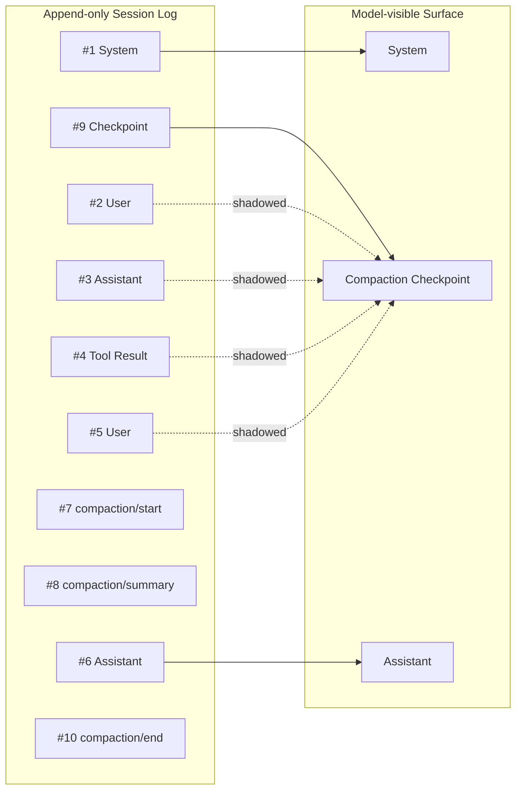

## 九、`surfaceOp: replace`：Compaction 真正改变的是什么？

真正执行 Surface Mutation （改变） 的，不是：

```text
compaction/summary
```

而是一条新的：

```text
user/message
```

它携带类似：

```ts
surfaceOp: {
    op: "replace",
    startSeq,
    endSeq
}
```

这样的信息。

源码核心逻辑可以抽象为：

```ts
session.append(
    "user/message",
    checkpointMessage,
    {
        surfaceOp: {
            op: "replace",
            startSeq: start,
            endSeq: end
        },

        sourceEventSeqs: [
            startEvent.seq,
            summaryEvent.seq,
            ...shadowedSeqs
        ]
    }
)
```

官方 Compaction 文档也明确说明：

`compaction/start`、`compaction/summary`、`compaction/end` 都是 **log-only event**；

真正执行 Summary Compaction Surface Mutation 的，是这条携带 `surfaceOp: replace` 的 `user/message`。

所以 `Compaction` 真正修改的并不是历史事实,而是模型下一次看到的历史投影.

## 十、为什么 Checkpoint 使用 `user/message`？

这里还有一个很有意思的设计问题。

为什么不直接让：

```text
compaction/summary
```

成为新的 Surface Node？

因为 DeepSeek Harness 的：

```text
SurfaceEventType
```

是受限制的。

只有真正能够成为模型 Message 的事件类型才能进入 Surface，例如：

```text
user/message
assistant/message
tool/result
```

而：

```text
compaction/start
compaction/summary
compaction/end
```

属于内部生命周期事件。

因此它们是：

```text
log-only
```

不能直接进入模型历史。

于是 Summary 会被包装成一条：

```text
user/message
```

并附带 Canonical Checkpoint Source。

从模型的角度，它最终看到类似：

```text
This is an automatically generated checkpoint...

<compacted-summary>

...

</compacted-summary>
```

这样设计其实非常合理。

因为这个 Checkpoint 本质表达的是：

```text
“这些内容是之前会话中已经成立的背景事实。”
```

它不是模型新产生的一条 Assistant Answer，而是给模型提供的既有上下文。

因此以 User Role 重新进入 Context 是一种明确的语义选择，而不是为了绕过类型系统的临时办法。

## 十一、为什么还需要 `compaction/start → summary → end`？

如果最终只是 `Surface Replace`

为什么还需要这么多 Compaction Events？

因为真正的压缩过程并不是原子的。

中间包含一次异步 LLM Call：

```text
选择 Range
    ↓
调用模型
    ↓
等待 Summary
    ↓
验证
    ↓
Commit
```

在这段时间里：

```text
Session 可能变化
Compaction 可能失败
用户可能取消
模型可能报错
Persistence 可能失败
```

因此 DeepSeek Harness 将一次 Compaction 组织成类似 Transaction (事务) 的生命周期：

```text
compaction/start
        ↓
准备 Compaction Input
        ↓
LLM Summarization
        ↓
验证 Summary
        ↓
compaction/summary
        ↓
Surface Replace
        ↓
compaction/end
```

其中：

```text
compaction/start
```

同时承担一个重要作用：

```text
Compaction Lock
```

避免同一个 Session 同时运行两个互相覆盖的压缩事务。

如果压缩失败：

```text
compaction/end
```

还可以记录错误。

官方将这一组 start / summary / end 明确设计成可持久化的声明周期。

::: tip 补充说明
本节为突出主事务链路，省略了 Summary Error Recovery。Summary 请求失败时，`compaction/summary-error` 恢复钩子允许插件记录所选摘要输入的持久化调整；若恢复成功，Backend 会重新构建并计量输入，再尝试生成 Summary。

官方 `compaction-image-offload` 插件会利用这一机制记录图片卸载决策并重试 Summary。该能力在本文分析基线 `ddefc45f` 中已经存在，并非 v0.1.7 新增。`compaction/summary-error` 是恢复钩子，不是 Session 事件。
:::

## 十二、Summary 生成期间 Session 又变化了怎么办？（存疑）

假设：

```text
t1：选择准备压缩的 Range

t2：开始调用 LLM Summary

t3：等待模型返回

t4：准备把 Summary 写回
```

如果在：

```text
t2 → t4
```

期间 Session Surface 已经被其他操作改变了呢？

那么这个 Summary 实际上是基于：

```text
旧 Surface
```

生成的。

直接 Commit 就存在覆盖新状态的风险。

因此 DeepSeek Harness 在开始 Summarization 前会保存对应的 Surface 状态。

Summary 返回以后再次检查。

可以简化成：

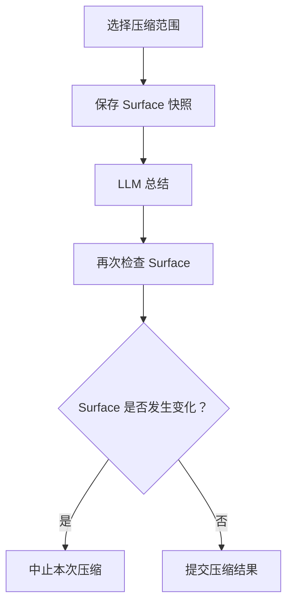

这里还有一个比较细的区别。

### Automatic Compaction

自动 Pressure Compaction 使用更严格的：

```text
whole-surface stability
```

也就是要求它生成 Summary 期间整个相关 Surface 不能发生变化。

### Manual Compaction

手动 `compactNow()` 使用的是：

```text
selected-span stability
```


意味着 Selected Region 本身必须保持不变，但 Region 外新增内容并不一定使整个操作失效。

::: tip 思考一下：Surface 在压缩期间究竟怎么变化？

官方把 `whole-surface stability` 和 `selected-span stability` 的区别建立在“压缩期间 Surface 可能发生变化”这个前提上。读到这里，可以先停下来想几个问题：

- Compaction 已经选定 Region 并开始等待 LLM 生成 Summary 后，究竟还有哪个组件可以继续向 Session 写入消息？
- 普通用户消息、Tool Result、Skill 注入或其他运行时上下文，分别会通过什么路径进入当前 Surface？
- 如果用户消息在这个阶段只是排队等待，而不是立即修改 Surface，那么 Surface 还有可能发生什么变化？
- 如果确实存在 Surface 变化，它是正常的业务状态推进，还是并发控制没有完全生效的竞态？
- 如果没有明确的写入者能够改变 Surface，那么自动压缩为什么还要因为整个 Surface 变化而失败？

:::

<SupplementaryNote title="两套 Stability Contract 是否已经出现语义漂移？">

下面是本文作者基于源码演进做出的个人判断，不代表 DeepSeek Harness 官方结论。对这个问题感兴趣的读者，可以进一步阅读相关提交、Agent Note 和测试代码。

DeepSeek Harness 中一次典型的跨分支架构演进，可能造成了这样的语义漂移：当前 Automatic Compaction 与 Manual Compaction 仍然使用两套不同的 Surface Stability Contract，但支撑这种差异的历史动机，可能已经与当前运行时部分脱节。

在 2026 年 7 月底设计 Manual `/compact` 时，idle 状态下的 `agent.inject()` 可以在不唤醒 Agent Loop 的情况下，直接向 Session Surface 追加持久化的 `user/message`。因此，Manual Summary 等待期间，Selected Region 外合法出现新的 Surface Node 是一个真实场景，`selected-span` 也有其必要性；Automatic Compaction 位于 active turn 内，则采用更严格的 `whole-surface`。

随后，ReactLoopAgent 的 message-machine 重构将 `inject()` 统一纳入 Inbox，并进一步通过 `runMaintenance` 串行化 Manual Compaction 与后续 Turn。当前官方测试要求 Summary 期间的 injection 保留在 `Inbox.nextStep`，而不是立即进入 Session Surface。这样一来，当初支撑 Manual `selected-span` 的核心内建场景已经被明显削弱，甚至可能基本消失。

在这种情况下，与其继续讨论哪一种 Stability Rule 更合适，也许更值得考虑的是：直接取消 Compaction 层的两套 optimistic stability validation，把并发约束上移到 Agent 或 Session 的 mutation ownership。Compaction 期间，标准输入统一排队，非 owner 不允许直接修改 Conversation Surface。这样，Automatic 与 Manual 就可以共享同一套 transaction model，只保留触发时机和生命周期位置上的区别。

</SupplementaryNote>


## 十三、如果一次 Compaction 之后还是太大怎么办？

Compaction 并不保证一次就一定降到安全阈值。

例如：

```text
Context = 120K

第一次 Compaction
↓
106K

Threshold = 102K
```

::: tip 版本变化：v0.1.7-rc.2
上面的 `120K → 102K` 示例基于本文分析版本的旧 Pressure 公式。新版实际阈值还会受 Completion Reservation 与 `headroomTokens` 限制，因此可能明显低于 Context Window 的 80%。本节讨论的重试机制没有变化：默认 `compactionRetries = 1`，一次成功压缩后若 Pressure 仍未解除，还可以基于最新 Surface 再压缩一次。
:::

虽然已经减少很多，但依旧高于 Threshold。

因此 `compaction-basic` 支持继续尝试。

逻辑可以简化成：

```ts
// attempt = 0 表示第一次压缩；compactionRetries 只控制成功替换后
// 仍然超过阈值时的额外尝试次数。
for (
    attempt = 0;
    attempt <= compactionRetries;
    attempt++
) {
    // 每次重试都要基于最新的 Surface 重新选择压缩范围，
    // 不能重复使用上一次已经被替换过的 range。
    range = selectCompactableRange(...)

    // 一次压缩会把选中的历史范围替换为新的 Checkpoint。
    result = compact(range)

    // Summary 提交后重新测量当前 Session，确认 Context Pressure 是否解除。
    measurement = tokenMeter.measure(session)

    // 已经低于阈值，说明本轮压缩达到目标，立即结束整个循环。
    if (measurement.totalTokens < threshold) {
        return result
    }

    // 仍然超过阈值时，只有剩余重试次数才允许继续下一轮。
}

// 所有允许的压缩轮次都完成后仍未降到阈值以下。
throw new Error("still above threshold")
```

当前默认：

```text
compactionRetries = 1
```

也就是第一次 Compaction 之后，默认还允许再重试一次。

这里的“重试”有严格边界：`compactionRetries` 只用于一次成功替换后仍高于阈值的继续压缩，不是对未变小的 Summary 或失败的模型调用无限重试。

这时候就会出现一个很有意思的情况：

```text
第一次

Old History
    ↓
Checkpoint A
+
Recent Context
```

继续增长以后，第二次可能变成：

```text
Checkpoint A
+
More History
        ↓
Checkpoint B
+
Recent Context
```

也就是说：

```text
Checkpoint 自己也可能成为下一轮 Compaction 的输入。
```

因此当前 Summarization Prompt 还专门告诉模型：

如果输入中已经存在：

```text
<compacted-summary>
```

不要机械复制整个旧 Summary。

而应该：

```text
保留仍然有效的事实
删除已经过时的信息
合并最新上下文
重新生成新的统一 Checkpoint
```
## 十四、Pressure Compaction 与 Context Overflow 并不是同一条路径

到目前为止，我们主要讲的是正常 Pressure Compaction，也就是：

```text
Context 快满
    ↓
提前 Compaction
```

但其实还有一种情况：

模型直接返回：

```text
CONTEXT_WINDOW_EXCEEDED
```

这时说明提前 Pressure Control 没能阻止 Overflow，或者实际 Provider Context 计算与本地估计出现了差异。

于是会进入：

```text
agent/request-error
```

对应的 Overflow Recovery。

整体流程变成：

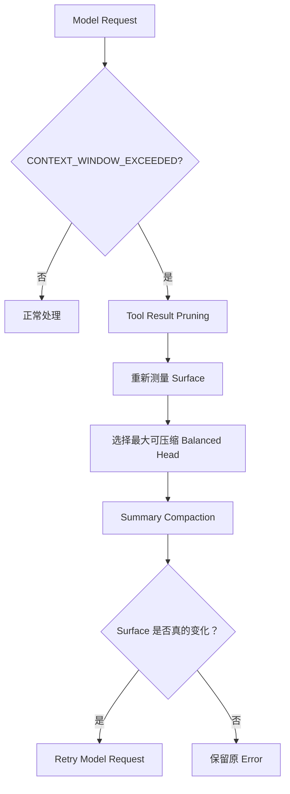

Overflow 与普通 Pressure 有一个非常重要的不同：

```text
它会绕过普通的 Pressure Threshold 和 retained-tail policy。
```

也就是说，这时不会再说：

```text
我要保留 16% Recent Tail
```

而是使用：

```text
retainTokens = 0
```

选择一次尽可能有用、同时仍然保持 Tool Pairing Balanced 的 Head Reduction。官方的 Overflow Recovery 设计也明确说明，它不要求正常 capacity metadata，并绕过普通保留策略。

为什么？

因为这时候系统不是：

```text
提前优化
```

而是在：

```text
请求已经失败
```

的情况下做 Recovery。

策略自然需要更加激进。


---

## 十五、为什么 Overflow Retry 要检查 `replaceGeneration`？

发生 Overflow 后，并不是：

```text
调用 compactIfNeeded()
```

返回成功就直接 Retry。

DeepSeek Harness 还会观察：

```text
session.surface.replaceGeneration
```

可以把这个字段理解为：

```text
Surface Replacement 有没有真正发生过变化。
```

流程是：

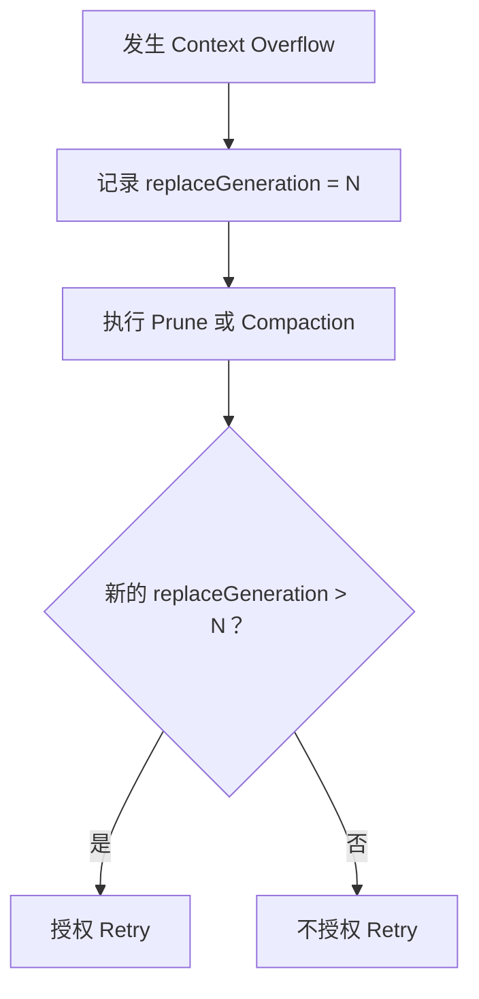

这背后的判断非常合理。

如果模型刚刚因为 Context 太大失败，那么重试的前提必须是：

```text
下一次模型看到的 Context 与刚才失败时相比真的发生了有效减少。
```

否则：

```text
原请求失败
↓
什么都没改变
↓
原请求再发一次
```

只是在重复同一个错误。

更有意思的是：

即使后续 LLM Summary 失败了，但前面的 Tool Result Pruning 已经成功改变 Surface：

```text
replaceGeneration
```

仍然可能增加。

这时候 Context 已经真正变小，因此 Overflow Recovery 依然可能具备 Retry 的理由。

## 十六、把完整 Compaction 链路重新串起来

前面的章节分别解释了触发条件、剪枝、范围选择、摘要生成和 Surface 替换。把它们合在一起，可以看到三种入口最终如何汇合到同一条提交链路。

### 总体流程

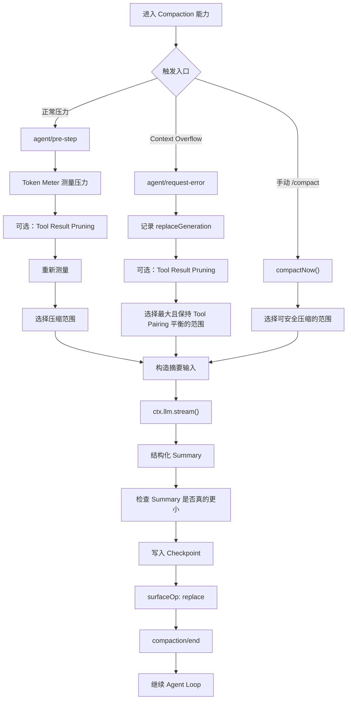

这张图展示的是主干关系：三种入口的前置策略不同，但真正生成 Summary、写入 Checkpoint 和替换 Surface 的核心阶段是共用的。

### 正常 Pressure Path

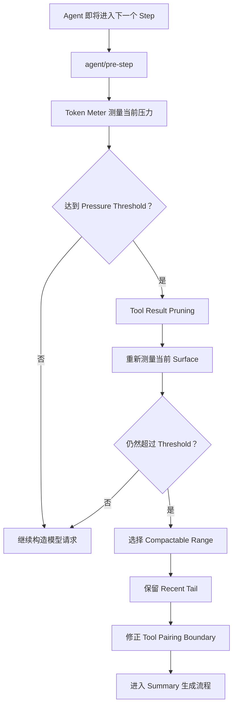

正常压力路径会先尝试不调用模型的确定性剪枝；只有剪枝后仍然超过阈值，才会进入 LLM Summary。

### Overflow Recovery Path

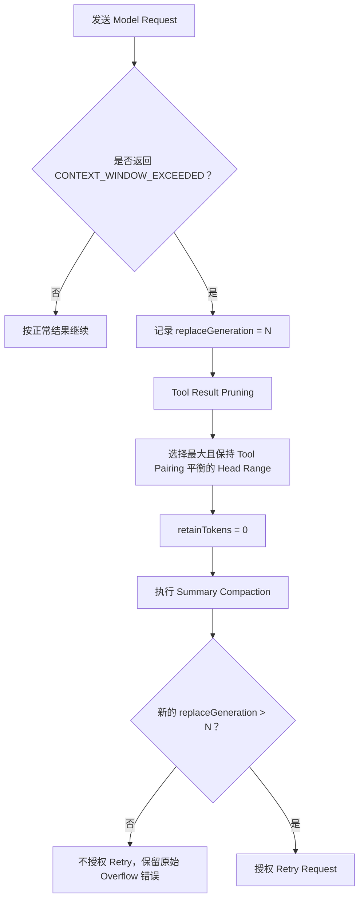

Overflow Recovery 的目标不是按照普通 Pressure 策略保留最近尾部，而是尽可能清理出一次可重试的有效变化。

### Summary 与 Surface 提交流程

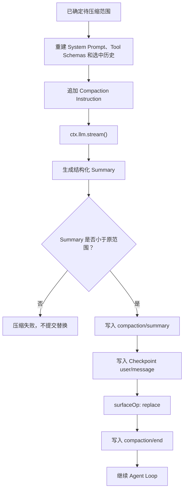

这条共同提交链路体现了 Compaction 的核心语义：原始历史仍保留在 Session Log 中，模型可见的 Surface 则被一个更小的 Checkpoint 替换。

## 总结

DeepSeek Harness 的 Compaction 不是简单删除旧消息，而是一套可以插入 Agent Runtime 的 Context Lifecycle 能力。它被设计成可替换的 capability seam，因此触发策略、Token Meter、Pruner、Range Selector、Summarizer 和最终的 Surface 更新，都可以在能力边界内独立演进。

理解 Compaction，首先要区分三条进入 Compaction 的路径：正常运行时 Token Pressure 达到阈值、模型请求因为上下文超限而进入 Overflow Recovery，以及用户主动执行 `/compact`。三条路径最终都可以复用底层的 Compaction Engine，但触发时机、错误恢复和稳定性检查处在不同的运行时位置。

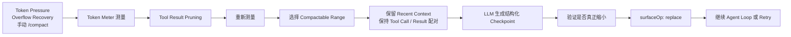

其中，Prune 和 Compaction 解决的是不同问题。Prune 是不调用模型的体积缩减，主要针对已经很大的 Tool Result；Compaction 则把一段旧历史转换为语义化的 Checkpoint。Prune 完成后必须重新测量，因为真正的压缩范围和后续判断都依赖新的 Token 数，而不是依赖裁剪前的估算。

Range Selection 也不是按照 `messages` 数组机械地删除前一部分内容。它需要从当前可压缩 Surface 中选择连续的历史区间，保护 System Prompt 等系统头部，保留最近上下文，并避免把 Tool Call 与对应的 Tool Result 从中间切开。这里的 Token 数来自 Token Meter 对当前 Surface 的定价结果，因此“保留最近 16%”之类的比例只能帮助理解，不能当作完整算法。

Summary 也不是普通聊天摘要。官方压缩提示词要求模型围绕 Primary Request and Intent、Key Technical Concepts、Files and Code、Errors and Fixes、Pending Jobs、Current Work、Next Step 和 Critical Context 组织信息。它要保存的是让 Agent 能够继续工作的任务状态，而不是把每一轮对话平均缩写一遍。生成的结果还会被包装成结构化的 Compaction Checkpoint，供后续模型请求继续使用。

Compaction 的另一个关键点是区分 Session Log 和 Session Surface。Session Log 保存追加写入的原始事件，便于回放和追踪；Session Surface 是当前准备发送给模型的上下文投影。`surfaceOp: replace` 替换的是模型可见投影，不代表原始消息已经从 Session 中被物理删除。压缩以后，模型通常看到的是 System Prompt、Checkpoint 和仍需保留的 Recent Context。

`user/message` 形式的 Checkpoint 以及 `compaction/start`、Summary、`compaction/end` 事件，共同把一次压缩记录为 Session 中可观察、可回放的生命周期。这样，Compaction 不只是内存里的临时字符串替换，而是一次能够被 Agent Runtime 和 Session 层共同理解的状态变更。

因此，全文最重要的结论可以归纳为：

- Compaction 改变的是模型当前看到的 Surface，而不是删除 Session Log 中的原始历史。
- 生产级压缩必须同时处理 Token 计量、Tool Result 裁剪、连续范围选择、结构化摘要、Surface 替换和失败恢复。
- Checkpoint 的目标是保存可继续执行的工作状态，而不是生成一段看起来流畅但无法支撑后续工作的摘要。
- 具体阈值、保留比例和 Summarizer 都可以更换，真正稳定的是 Compaction Engine 对这些能力定义的组合边界。

## 相关问题

- **Compaction 和普通的聊天总结摘要有什么区别？**
- **为什么必须先 Prune Tool Result，再重新测量 Token？**
- **Range Selection 为什么不能直接按消息数量切掉前半段？**
- **为什么 Tool Call 和 Tool Result 不能被压缩边界从中间拆开？**
- **Session Log 和 Session Surface 分别保存什么？`surfaceOp: replace` 替换的到底是什么？**
- **Token Pressure、Overflow Recovery 和手动 `/compact` 有什么区别？**
- **为什么 Overflow Retry 还需要检查 `replaceGeneration`？**


---

::: tip 源码版本说明

本文基于 DeepSeek Harness 官方仓库 `master` 在 commit [`ddefc45f`](https://github.com/deepseek-ai/deepseek-harness/commit/ddefc45fbc7f8e46dd73185e68295696d1297887) 对应的 Compaction / Session 实现整理。由于 `master` 会持续变化，后续提交可能导致接口与实现发生兼容性变更。

:::
