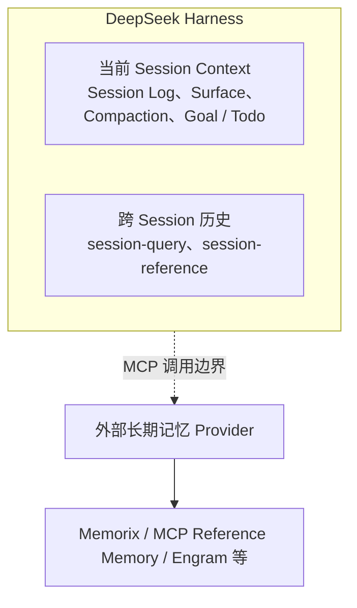
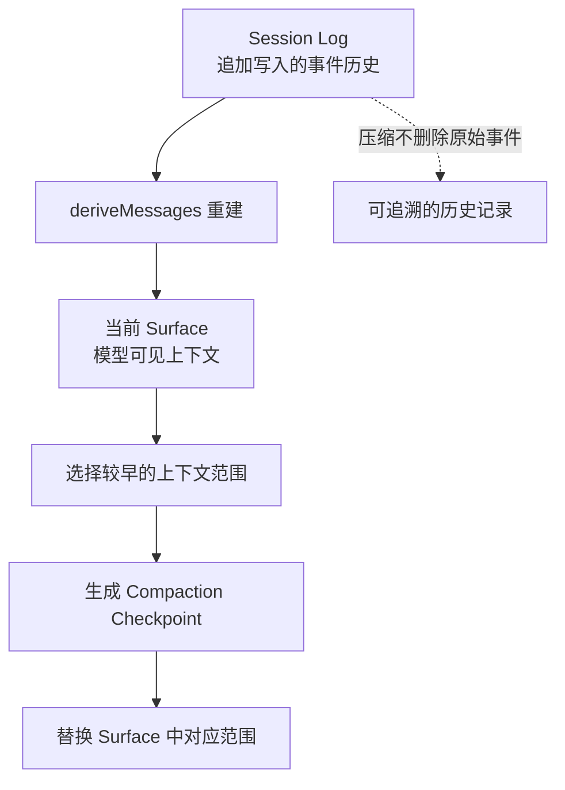
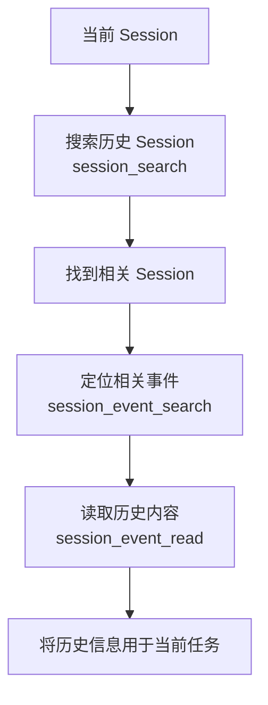
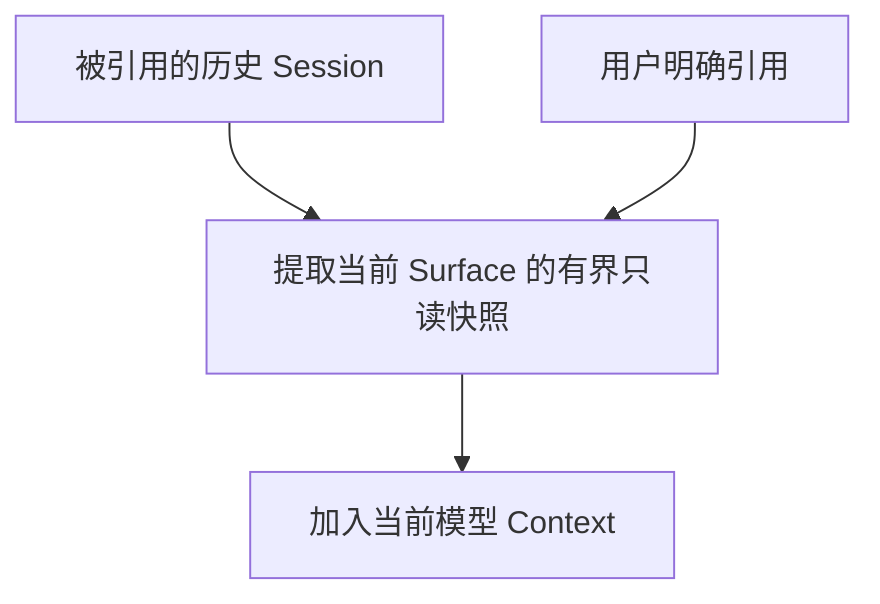
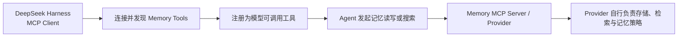

# 深入记忆系统：DeepSeek Harness 记忆系统

::: tip 版本说明
本文基于 **2026 年 9 月 30 日**的 DeepSeek Harness 官方源码进行分析，参考仓库为 `deepseek-ai/deepseek-harness` 的 `master` 分支。本文分析时对应的仓库 HEAD 为 **`639ed01`**（完整 Commit：`639ed015397290b3745d163aafe02ffee4aa3f84`），该提交于 **2026 年 9 月 29 日**合并，版本为 **`dsh@0.2.0-rc.2`**。
:::

准确的说，DeepSeek Harness 并没有一套完整的记忆系统。

目前与记忆相关的能力可以分成三层：

```text
Session Context
      ↓
Cross-session History
      ↓
External MCP Memory
```

第一层解决当前 Session 怎么维持上下文，第二层解决以前的 Session 怎么重新找到，真正的长期记忆则被交给了 Harness 外部的 MCP Memory Provider。

接下来我们就沿着这三层来看。

## 一、先区分：什么才算 Memory？

Agent Memory 目前并没有一个绝对统一、严格的定义。

一般来说，我们可以把它理解为：**Agent 在持续运行和交互过程中，对过去的信息、经验、知识和行为规则进行保存、组织、更新与召回，使这些信息能够影响未来决策的一套机制。**

因此，持久化的历史聊天记录并不完全等同于 Memory。

但换一个角度来看，如果过去的聊天记录能够在未来被重新检索，并参与 Agent 的判断和决策，那么它同样可以成为 Memory 的一种来源。

所以 Memory 的边界并不是绝对的，不同 Agent、框架对它的定义和实现方式也并不完全相同。

很多人提到 Agent Memory 时，首先想到的是“向量化存储 + 语义检索”，但这只是比较常见的一种实现方式，并不是 Memory 的全部。

真正值得关注的其实是下面这几个问题：

```text
什么值得记住？
        ↓
怎么保存？
        ↓
什么时候检索？
        ↓
检索哪些记忆？
        ↓
怎么重新放回 Context？
```

进一步复杂以后，还可能涉及记忆去重、冲突处理、更新、遗忘，以及用户隔离、项目隔离等机制。

按照不同维度，Memory 也可以有不同的分类方式。

从持续时间来看，可以分为短期记忆和长期记忆。

从隔离范围来看，可以分为用户记忆、项目记忆、工作空间记忆等。

从存储和表达形式来看，则可能采用文本文件、结构化数据库、向量数据库、Knowledge Graph 等不同方案。

当然，上面这些都不是一套绝对严格的分类标准。实际的 Agent 系统也不需要同时实现所有类型，而是根据自己的场景选择合适的 Memory 机制。

后续你会发现，不同项目和框架对 Memory 的理解与实现方式，其实存在很大差异。

---

## 二、DeepSeek Harness 的整体记忆结构

先看整体：



所以 DeepSeek Harness 并不是存在一个统一的：

```text
MemoryManager
```

然后下面管理用户记忆、项目记忆、长期记忆。

它选择了另一条路线：**Harness 自己管理 Session 和历史 Session；真正的长期 Memory 通过 MCP 接出去。**

接下来我们就从这三方面来看 DeepSeek Harness 的记忆系统。

## 三、Session Context：当前会话是怎么“记住”的？

DeepSeek Harness 最核心的数据结构之一就是 Session。

一个 Session 本质上是一份 append-only 的 `SessionEvent` 日志。

用户消息、Assistant 消息、Tool Call、Tool Result 等都会不断进入 Session Log：

```text
Session Log

seq 1   user/message
seq 2   assistant/message
seq 3   tool/call
seq 4   tool/result
seq 5   assistant/message
...
```

模型真正看到的消息历史并不是单独再保存一份，而是通过：



从事件日志重新派生出来。

这里就出现了一个很重要的概念：

### Surface

Session Log 保存完整事件历史，而 Surface 表示当前仍然进入模型上下文的那部分消息。

因此可以简单理解为：

```text
Session Log
= 完整发生过什么

Surface
= 模型现在看到什么
```

当 Context 越来越长时，Compaction 会把较早的一段 Surface 压缩成 Summary，再用 Summary 替换原来的上下文区域。

但被替换的原始内容仍然留在 Session Log 中。

也就是说把过去的一部分历史聊天记录整理成一个新的“记忆”，添加到下一个 Surface 中。

### Goal 和 Todo 算不算记忆？

DeepSeek Harness 还有 Goal 和 Todo。

Goal 可以让一个 Session 保存一个长期执行目标，并且在 resume、fork、进程重启后继续存在；Todo 则保存当前任务的结构化执行状态。

它们确实带有一定的“工作记忆”特征：

```text
Goal
→ 我要完成什么

Todo
→ 我现在做到哪里
```

但二者本质上仍然是 **Session-owned state**。

Goal 的持久状态最终同样记录在 Session Log 中，而 Todo 也是当前 Session 拥有的任务状态。

所以这里没有必要特意把它们包装成一套独立记忆系统，我们只需要明确，Goal 和 Todo 是属于 Session ，但是仍然具有 Memory 特征。

## 四、Cross-session History：以前的 Session 怎么找回来？

DeepSeek Harness 当前已经提供了一套独立的 `session-query` 能力。

它可以对已经存在的 Session History 进行读取、过滤、搜索和关系追踪，包括：

```text
searchSessions()
searchEvents()

readSession()
readEvent()

traceSession()
traceEvent()
```

其中官方提供的 SQLite Backend 使用 SQLite FTS5 对 Session History 做全文检索。

在这之上还有模型可以直接调用的 `tool-session-query`。

例如当前 Agent 可以：



官方给出的典型场景就是：

> Coding Agent 在开始一个任务之前，搜索自己以前的 Session，看看过去做过什么。

而且跨 Session 查询不是无限制的。

模型侧的 `tool-session-query` 会根据当前 Session 的工作目录做授权，目标 Session 的 `cwd` 必须与当前调用方一致，才能进行跨 Session 访问。

其实这部分就是我前面说的，历史记录不完全等同于记忆，但是它可以作为 Memory 的一种来源。

## 五、Session Reference：不搜索，也可以直接引用历史 Session

除了主动搜索历史，DeepSeek Harness 还有另一种跨 Session 能力：

```text
session-reference
```

它允许当前对话引用另一个 Session。

当用户引用某个历史 Session 后，Harness 会把那个 Session 当前 Surface 的一个有界只读快照放进当前模型 Context。

可以理解为：



这和 `session-query` 的思路不同。

`session-query` 是：

> Agent 主动去搜索以前发生过什么。

而 `session-reference` 则是：

> 用户明确把另一个 Session 当作当前任务的背景资料带进来。

它依然不是长期 Memory，只是另一种跨 Session Context 复用机制。

## 六、真正的长期 Memory：通过 MCP 接出去

DeepSeek Harness 真正处理长期记忆的方式，其实非常直接：

**自己不做。**

目前官方给出了三种第三方 Memory Server 的参考接入：

```text
Memorix

MCP Reference Memory

Engram
```

它们全部通过 MCP 接入 DeepSeek Harness。

整体关系就是：



至于：

```text
Memory 存在哪里

是否使用 Embedding

如何检索

如何组织记忆

是否进行总结

是否进行遗忘

如何解决冲突
```

这些都属于外部 Memory Provider。

官方在设计说明里也明确划分了这个边界：Memory Provider 的账户、模型、Embedding、存储初始化以及 Provider 自己的数据都不属于 DSH 的职责。

甚至官方提供的 MCP Reference Memory 本身都非常简单。

它使用本地 Knowledge Graph 保存 Entity、Relation 和 Observation，搜索只是大小写无关的 substring matching，并没有 Embedding、自动摘要、冲突消解或者遗忘机制。

## 九、为什么 DeepSeek Harness 不自己做 Memory？

其实这里并不是说明 Memory 不重要，而是 DeepSeek Harness 提供了一种非常灵活的方案。

官方曾经考虑过直接集成某个 Memory Provider。

但这样做以后：

```text
Provider API
Provider Config
Provider Health
Provider Tool Semantics
Provider Storage
...
```

都会逐渐变成 DeepSeek Harness 自己需要维护的产品接口。

换一个 Memory Provider，又需要重新适配一次。

最终官方选择：

```text
                 DeepSeek Harness
                        │
                   Generic MCP
                        │
          ┌─────────────┼─────────────┐
          ▼             ▼             ▼
       Memorix        Engram       Other Memory
```

把长期记忆放到一个通用 MCP Boundary 后面。

这样 Harness 不需要决定：

> 什么才是最好的 Memory 架构？

它只需要保证：

> Agent 能够稳定地发现和调用外部 Memory Tools。

所以 DeepSeek Harness 的 Memory 设计特点，并不是它拥有一套多么复杂的 Memory Algorithm。

恰恰相反：

> **它选择不在 Harness 内部定义长期记忆应该长什么样。**

---

## 总结

DeepSeek Harness 与记忆相关的能力最终可以归纳成三层：

```text
① Session Context
   │
   ├── Session Log
   ├── Surface
   ├── Compaction
   └── Goal / Todo
   │
   ▼
当前 Session 的上下文和任务状态


② Cross-session History
   │
   ├── session-query
   └── session-reference
   │
   ▼
重新找到和复用历史 Session


③ External Long-term Memory
   │
   └── MCP
        │
        ├── Memorix
        ├── Engram
        └── Other Memory Providers
   │
   ▼
真正的长期 Memory
```

**DeepSeek Harness 自己主要解决当前 Session 如何保持上下文，以及历史 Session 如何重新找到；真正的长期记忆并没有内建，而是通过 MCP 交给外部 Memory Provider。**

## 相关面试题

- **Session Log、Session Surface 和 Compaction 分别承担什么职责？为什么 Compaction 不等于长期记忆？**
- **`session-query` 和 `session-reference` 分别解决什么问题？它们为什么仍属于历史检索与上下文复用？**
- **DeepSeek Harness 的 Workspace 为什么不能直接视为项目记忆？它与模型上下文有什么关系？**
- **DeepSeek Harness 如何接入长期记忆？Harness 与外部 MCP Memory Provider 的职责边界是什么？**
