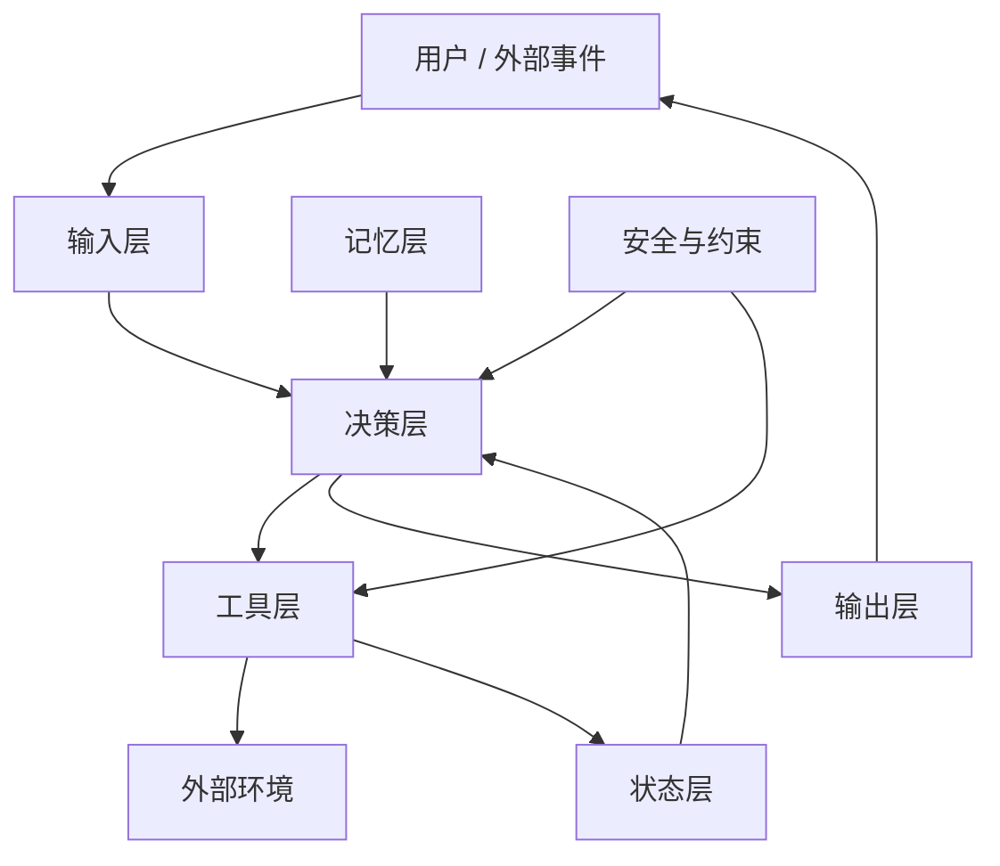
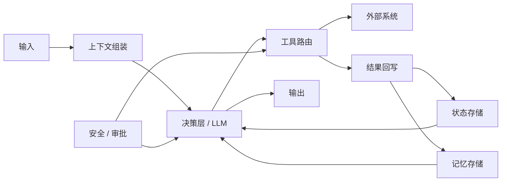

# 通用 Agent 原理：Agent 架构

`入门` 栏目更偏“这是什么”。  
这一栏开始，重点变成“系统内部到底怎么组织”。

所以这一篇不只讲概念，也会给一个最小 Python 版本，让你看到：

- 一个 Agent 系统通常有哪些模块
- 这些模块在代码里分别长什么样
- 为什么它不是“一个 prompt + 一个模型调用”就结束

## 这一篇要解决什么问题

如果把不同形态的 Agent 都放在一起看，你会发现它们表面差异很大：

- Coding Agent 会读文件、跑命令、改代码
- 客服 Agent 会查订单、查规则、发回复
- 助理 Agent 会读日程、查资料、发提醒

但底层通常都逃不开几个共同模块：

- 输入
- 决策
- 工具
- 状态
- 记忆
- 输出
- 安全约束

这就是 Agent 架构。

## 先看一张总图



先不要急着背名词。  
你可以把这张图理解成一句话：

**Agent 接收任务，结合状态和记忆做决策，必要时调用工具影响外部世界，并在约束下输出结果。**

## 一个最小 Python 版本

下面这段代码不是生产级框架，只是一个“能看懂骨架”的最小实现。

```python
from dataclasses import dataclass, field
from typing import Any


@dataclass
class AgentState:
    current_task: str | None = None
    step_count: int = 0
    last_tool_result: str | None = None
    done: bool = False


class Memory:
    def __init__(self) -> None:
        self.facts: list[str] = []

    def add(self, fact: str) -> None:
        self.facts.append(fact)

    def get_context(self) -> list[str]:
        return self.facts[-5:]


class ToolRegistry:
    def __init__(self) -> None:
        self.tools: dict[str, Any] = {
            "search_docs": self.search_docs,
            "send_reply": self.send_reply,
        }

    def search_docs(self, query: str) -> str:
        return f"[docs] 找到与“{query}”相关的 3 条结果"

    def send_reply(self, message: str) -> str:
        return f"[reply] 已发送：{message}"

    def call(self, tool_name: str, **kwargs: Any) -> str:
        return self.tools[tool_name](**kwargs)


class Guardrails:
    def allow(self, tool_name: str) -> bool:
        blocked_tools = {"delete_user"}
        return tool_name not in blocked_tools


class Planner:
    def decide(self, user_input: str, state: AgentState, memory: Memory) -> dict[str, Any]:
        if "文档" in user_input and state.last_tool_result is None:
            return {
                "type": "tool",
                "tool_name": "search_docs",
                "args": {"query": user_input},
            }

        return {
            "type": "tool",
            "tool_name": "send_reply",
            "args": {"message": "我已经根据资料整理好答案了。"},
        }


class Agent:
    def __init__(self) -> None:
        self.state = AgentState()
        self.memory = Memory()
        self.tools = ToolRegistry()
        self.guardrails = Guardrails()
        self.planner = Planner()

    def run_once(self, user_input: str) -> str:
        self.state.current_task = user_input
        self.state.step_count += 1

        decision = self.planner.decide(user_input, self.state, self.memory)

        if decision["type"] == "tool":
            tool_name = decision["tool_name"]

            if not self.guardrails.allow(tool_name):
                self.state.done = True
                return f"工具 {tool_name} 被安全策略拦截"

            result = self.tools.call(tool_name, **decision["args"])
            self.state.last_tool_result = result
            self.memory.add(result)

            if tool_name == "send_reply":
                self.state.done = True

            return result

        self.state.done = True
        return "任务结束"


agent = Agent()
print(agent.run_once("请先查一下这个问题对应的文档，再给我答复"))
print(agent.run_once("继续"))
```

这段代码故意很短，但已经把架构骨架放进去了。

## 这段代码里，每个模块对应什么

### 1. `AgentState`：状态层

它记录的是系统当前推进到哪里了，比如：

- 当前任务是什么
- 当前是第几步
- 上一次工具执行结果是什么
- 是否已经结束

真实系统里，状态通常还会更复杂，比如：

- 当前 owner
- 当前审批节点
- 错误次数
- 重试次数
- 中间产物 ID

但核心思想不变：  
**状态层负责记录“系统现在处于什么位置”。**

### 2. `Memory`：记忆层

这里用一个最小列表来模拟长期信息。

真实系统里，记忆可以来自：

- 对话摘要
- 用户偏好
- 项目知识
- 向量检索
- 结构化用户画像

它和状态的区别是：

- 状态偏当前任务推进
- 记忆偏跨轮、跨任务复用的信息

### 3. `ToolRegistry`：工具层

这里把工具注册成一个映射表。

这对应真实系统里的：

- 函数调用
- 内部 API
- 数据库查询
- 浏览器操作
- Shell / 代码执行

模型自己并不真的执行动作。  
更常见的情况是：模型做决策，应用代码真的去执行工具。

这一点和官方文档里讲的 tool use 很一致。

### 4. `Guardrails`：安全与约束层

很多人一开始会完全忽略这层。  
但只要 Agent 真的能做事，这层迟早要补。

它控制的是：

- 哪些工具能用
- 哪些操作要拦截
- 哪些动作要审批

这里为了演示，只做了一个最简单的工具黑名单。

### 5. `Planner`：决策层

这是架构里最核心的一层。

它不负责真正执行动作，而是负责：

- 判断现在该做什么
- 选择是否调用工具
- 选择调用哪个工具
- 决定下一步往哪里走

在真实系统里，这一层通常会连接模型推理。  
但从架构角度看，重点不是“模型多强”，而是：

**系统里必须有一个明确承担决策职责的地方。**

### 6. `Agent`：编排层

`Agent` 本身更像一个协调者，把前面几个模块串起来。

它做的事包括：

- 接收输入
- 更新状态
- 调用决策层
- 检查安全规则
- 执行工具
- 写回状态和记忆

你也可以把它理解成：  
**Agent 不是单个对象，而是一个把多个模块组织起来的运行壳。**

## 为什么不能只写成“一个大函数”

很多初学者会先写成这样：

```python
def run_agent(user_input: str) -> str:
    # 直接让模型判断并返回结果
    ...
```

这在 Demo 阶段没问题，但很快就会碰到麻烦：

- 工具越来越多
- 状态越来越复杂
- 记忆要单独存
- 安全规则要插进去
- 不同场景要复用同一个工具层

这时候如果没有架构分层，所有逻辑就会混在一起。

所以“Agent 架构”的意义，不是让代码看起来更高级，  
而是让系统在复杂起来之后还能继续维护。

## 一个更贴近真实系统的版本

实际工程里，常见结构会更像这样：



相比前面的最小代码，这张图多了几件现实中很常见的事：

- 上下文不是直接拿来就用，而是先做组装
- 工具执行之后，结果要写回不同容器
- 安全规则可能同时约束“决策”和“执行”
- 决策层不只是看用户输入，还会看状态和记忆

## 一个例子：客服 Agent 架构怎么落地

假设用户说：

```text
我的订单一直没发货，可以退款吗？
```

这时候各层分工大致会是：

- 输入层：拿到用户消息、订单号、历史会话
- 决策层：判断先查物流还是先查退款规则
- 工具层：调用订单系统、物流系统、退款规则服务
- 状态层：记录目前查到了什么、下一步该走哪
- 记忆层：保留用户偏好、历史投诉信息
- 安全层：判断退款是否需要人工审批
- 输出层：回复用户，或者转人工

这样你就能看清楚：

Agent 不是“一个会聊天的模型”，  
而是“一个由多个模块配合起来的系统”。

## 这一篇真正要理解什么

- `Agent 架构` 讲的是静态模块分工
- 通用 Agent 通常至少包含：输入、决策、工具、状态、记忆、输出、安全
- Python 里的类和对象，只是这些职责的一种落地方式
- 理解了架构骨架，后面再看 `核心循环`、`规划`、`工具`、`记忆` 会更顺

## 小结

- Agent 不是单个大模型调用，而是一组模块协作
- 决策层是中枢，工具层负责行动，状态和记忆负责信息承载，安全层负责边界
- 用最小 Python 代码去看架构，比只看抽象概念更容易真正理解

## 参考资料

- [OpenAI: Using tools](https://developers.openai.com/api/docs/guides/tools)
- [OpenAI: Conversation state](https://developers.openai.com/api/docs/guides/conversation-state)
- [Anthropic: Tool use with Claude](https://platform.claude.com/docs/en/agents-and-tools/tool-use/overview)
- [Anthropic: How tool use works](https://platform.claude.com/docs/en/agents-and-tools/tool-use/how-tool-use-works)
- [LangChain Documentation](https://docs.langchain.com/)
