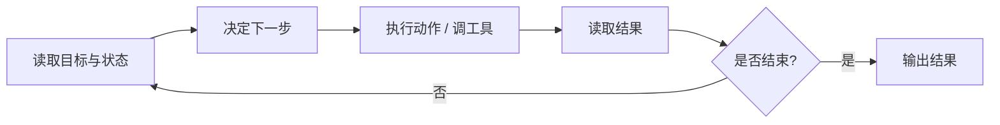
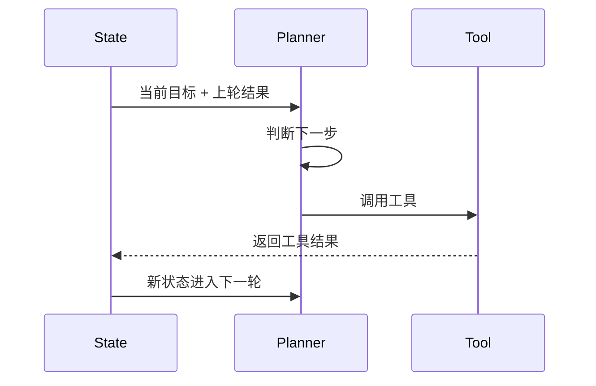
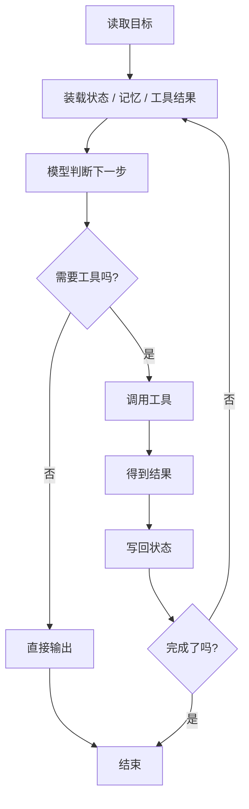

# 通用 Agent 原理：核心循环

如果说前一篇 [01-Agent 架构](./general-agent-architecture.md) 讲的是“系统里有哪些模块”，  
那这一篇讲的是：

**这些模块是怎么一轮一轮跑起来的。**

很多人以为 Agent 的关键是“能调工具”。  
但真正关键的是：

- 什么时候调工具
- 工具结果回来之后怎么处理
- 下一步怎么选
- 什么时候停

这几个问题合起来，就是核心循环。

## 先看一张最小流程图



它和普通问答最大的区别在于：

普通问答更像：

```text
输入 -> 输出
```

而 Agent 更像：

```text
读状态 -> 决策 -> 行动 -> 读结果 -> 再决策
```

## 一个最小 Python 循环

下面这段代码专门演示“核心循环”，所以故意只保留最关键的部分。

```python
from dataclasses import dataclass


@dataclass
class LoopState:
    goal: str
    step_count: int = 0
    last_result: str | None = None
    done: bool = False


def decide_next_action(state: LoopState) -> dict:
    if state.last_result is None:
        return {"type": "tool", "tool_name": "search_docs", "query": state.goal}

    if "找到" in state.last_result:
        return {
            "type": "tool",
            "tool_name": "write_answer",
            "content": "我已经根据检索结果整理好了答案。",
        }

    return {"type": "finish", "message": "暂时没有足够信息完成任务"}


def call_tool(action: dict) -> str:
    if action["tool_name"] == "search_docs":
        return f"找到与“{action['query']}”相关的资料"

    if action["tool_name"] == "write_answer":
        return action["content"]

    return "未知工具"


def should_finish(state: LoopState, action: dict) -> bool:
    return action["type"] == "finish" or state.step_count >= 3


def run_agent_loop(goal: str) -> str:
    state = LoopState(goal=goal)

    while not state.done:
        state.step_count += 1
        action = decide_next_action(state)

        if action["type"] == "finish":
            state.done = True
            return action["message"]

        result = call_tool(action)
        state.last_result = result

        if action["tool_name"] == "write_answer":
            state.done = True
            return result

        if should_finish(state, action):
            state.done = True

    return state.last_result or "任务结束"


print(run_agent_loop("请查一下 Agent 架构相关文档，然后给我简要说明"))
```

这段代码很小，但已经包含了核心循环的几个关键点：

- 有一个显式的 `while`
- 每一轮都会重新做决策
- 工具结果会写回状态
- 系统知道什么时候停止

## 把这段代码拆开看

### 1. `LoopState`

它记录的是当前循环的运行状态：

- 目标是什么
- 已经跑了多少轮
- 上一轮结果是什么
- 是否已经结束

这就是为什么 Agent 往往不是“无状态的一次调用”。  
它要靠状态把多轮运行串起来。

### 2. `decide_next_action`

这是每一轮的决策入口。

这里做的不是直接执行，而是判断：

- 现在要不要调工具
- 该调哪个工具
- 是否已经可以结束

真实系统里，这一层通常会交给模型。  
但无论是不是模型，核心职责都一样：

**决定下一步。**

### 3. `call_tool`

这一步负责真正执行动作。

这里用两个最小工具模拟：

- `search_docs`
- `write_answer`

真实系统里，对应的可能是：

- 检索文档
- 调数据库
- 跑命令
- 调浏览器
- 调业务 API

### 4. 结果回写

```python
result = call_tool(action)
state.last_result = result
```

这是循环里经常被忽略的一步。

如果工具调完不把结果写回状态，下一轮就不知道刚才发生了什么。  
系统就会像“每一轮都重新开始”。

### 5. 停止条件

```python
if action["tool_name"] == "write_answer":
    state.done = True
    return result
```

以及：

```python
if should_finish(state, action):
    state.done = True
```

这里演示了两个很典型的停止方式：

- 已经拿到最终结果
- 到达系统设定的上限

没有停止条件，循环就很容易失控。

## 用一张图看“每轮到底在干什么”



这张图要表达的重点很简单：

**每一轮都不是孤立动作，而是“结果进入状态，状态驱动下一轮”。**

## 一个更贴近真实系统的版本

真实工程里，循环通常不会只有一个 `last_result`，而会同时读很多输入：

- 用户输入
- 当前状态
- 记忆
- 工具结果
- 预算
- 安全约束

所以更真实的结构会像这样：



这里你应该开始能看出来：

- `01-Agent 架构` 是静态模块图
- `02-核心循环` 是这些模块的动态运行图

这两篇不是重复，而是两个视角。

## 一个例子：会议纪要 Agent 的循环

假设目标是：

```text
整理今天评审会纪要，并列出 action items。
```

它的一轮轮运行可能是这样：

1. 读取会议转写文本
2. 判断信息是否足够
3. 如果不够，补查相关文档或参会人信息
4. 重新整理主题、决策和待办
5. 判断现在是否已经可以输出

也就是说，它不是“一次总结”，而是“边看、边补、边收敛”。

## 为什么很多 Agent 一跑就不稳

大多数不稳，不是因为模型太弱，而是循环设计太粗。

典型问题有：

- 没有状态回写，结果没进入下一轮
- 没有停止条件，系统不停重试
- 每一轮目标太模糊，不知道现在到底要推进什么
- 错误结果没有被当成下一轮输入

例如：

- `401` 不是单纯失败，而是在告诉系统“下一轮该先认证”
- “没查到订单”不是空结果，而是在告诉系统“下一轮可能要追问订单号”

如果没有这种“结果驱动下一轮”的设计，Agent 很难稳定。

## 写原理文章时，为什么一定要看到这段代码

因为只看概念，读者很容易以为核心循环是一个抽象口号。  
但一旦你看到 `while`、`decide_next_action`、`call_tool`、`state.last_result = result` 这些代码，事情就会立刻具体起来：

- 循环不是比喻，是真实存在的控制流
- 决策不是玄学，就是每轮选下一步
- 工具调用不是插曲，而是循环中的执行环节
- 状态回写不是装饰，而是系统继续运行的依据

## 这一篇真正要理解什么

- 核心循环讲的是 Agent 怎么持续推进任务
- 最小循环可以理解成：读状态 -> 决策 -> 行动 -> 读结果 -> 判断是否继续
- Python 里最直接的形态就是一个显式 `while` 循环
- 没有状态回写和停止条件，Agent 通常不稳

## 小结

- Agent 的关键不是“一次答得更聪明”，而是“多轮推进任务”
- 代码层面上，核心循环通常就是显式的状态更新和控制流
- 理解了这篇，后面的 `规划`、`工具`、`记忆`、`多 Agent` 都更容易落到代码里

## 参考资料

- [OpenAI: Using tools](https://developers.openai.com/api/docs/guides/tools)
- [OpenAI: Conversation state](https://developers.openai.com/api/docs/guides/conversation-state)
- [OpenAI: Reasoning best practices](https://developers.openai.com/api/docs/guides/reasoning-best-practices)
- [Anthropic: Tool use with Claude](https://platform.claude.com/docs/en/agents-and-tools/tool-use/overview)
- [Anthropic: How tool use works](https://platform.claude.com/docs/en/agents-and-tools/tool-use/how-tool-use-works)
