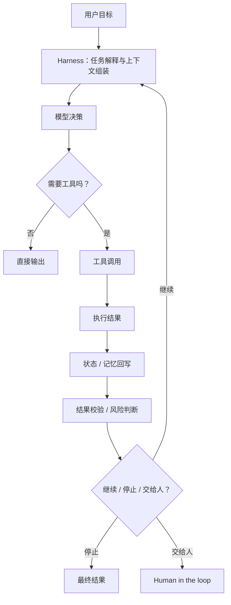

# 通用 Agent 原理：什么是 Harness Engineering，为什么 Agent 不只是模型和 Prompt？

最近 `Harness Engineering` 这个说法开始变热。  
如果你第一次听到它，很容易把它理解成：

- 又一个新术语
- Prompt Engineering 的换皮说法
- 只有 Coding Agent 才关心的东西

这些理解都沾到一点边，但都不够准。

更实用的理解是：

**Harness Engineering 不是在优化“模型说什么”，而是在设计“模型如何在一个可控系统里做事”。**

也可以把 harness 暂时理解成：

- Agent 的运行外壳
- 包住模型的一层编排与控制系统
- 让模型从“会回答”变成“能稳定完成任务”的那层工程结构

如果只看聊天界面，模型像是主角。  
但只要进入真正的 Agent 系统，主角就不再只是模型本身，而是：

```text
模型 + 工具 + 状态 + 上下文 + 权限 + 校验 + 评测 + 恢复机制 + 人工接管
```

这整层东西，才更接近 harness。

## 先给结论：Harness Engineering 到底在讲什么？

综合 OpenAI、Anthropic、OpenAI Agents SDK、LangChain 以及 Mitchell Hashimoto 的几类资料来看，我更倾向于把它总结成一句话：

**Harness Engineering，就是围绕模型设计一套运行机制，让 Agent 能够更稳定地理解任务、调用能力、验证结果、控制风险，并在失败后继续推进。**

这里要注意两点：

### 1. 它还不是一个边界完全统一的标准术语

这一点是我基于多篇资料做出的归纳。  
不同团队在谈 Harness Engineering 时，强调点并不完全一样：

- 有的更强调 `AGENTS.md`、脚本、工具和自动验证
- 有的更强调上下文组织、知识可见性和运行环境
- 有的更强调长任务、多轮执行、恢复和交接
- 有的更强调评测、观测和持续迭代

所以你会发现，大家讲的不是同一个“模块”，而是在讲同一个“工程层”。

### 2. 它和 Prompt Engineering 有重叠，但绝不等于 Prompt Engineering

Prompt 当然是 harness 的一部分。  
但 harness 讨论的是更大的问题：

- 任务怎么拆
- 工具怎么暴露
- 状态怎么存
- 结果怎么验
- 出错怎么停
- 下一轮怎么继续
- 什么情况必须让人接手

如果这些都没有，只是 prompt 写得更花，通常还谈不上 Harness Engineering。

## 为什么这个概念会突然变重要？

因为很多团队已经遇到了同一类现实问题：

- Demo 很顺，真实任务一长就乱
- 模型会调用工具，但不会稳定完成任务
- 单次回答不错，多轮执行就开始漂
- 会写代码、会搜资料，但不会自证结果是否正确
- 出错后不是恢复，而是继续在错误轨道上跑

这些问题，往往不是一句 prompt 能补掉的。

如果你把 Agent 理解成：

```text
输入 -> 模型 -> 输出
```

那你自然会把问题理解成“模型不够强”或“提示词不够好”。

但如果你把 Agent 理解成：

```text
输入 -> 任务理解 -> 状态读取 -> 工具选择 -> 执行 -> 结果回写 -> 校验 -> 继续 / 停止 / 交给人
```

你就会发现，问题常常出在中间这一整条链路上。  
而这条链路，就是 harness 的工作范围。

## Harness 和 Prompt、Context、Workflow 分别是什么关系？

这是最容易混淆的一层，必须先拆开。

### 1. Prompt Engineering

它关注的是：

- 指令怎么写
- 示例怎么给
- 约束怎么表达
- 输出格式怎么指定

它解决的是“如何更好地对模型说话”。

### 2. Context Engineering

它关注的是：

- 哪些信息该进上下文
- 什么信息该压缩
- 什么信息该长期保存
- 多轮任务里上下文如何更新

它解决的是“模型在这一轮到底看到了什么”。

### 3. Workflow / Orchestration

它关注的是：

- 多个步骤怎么串
- 多个 Agent 怎么协作
- 哪些环节串行，哪些并行
- 哪些节点插入人工确认

它解决的是“系统按什么顺序推进任务”。

### 4. Harness Engineering

它把前面这些东西装进一个可运行、可演进的工程壳里。

所以更准确的关系是：

- Prompt Engineering 是 harness 的一部分
- Context Engineering 是 harness 的一部分
- Workflow / Orchestration 也是 harness 的一部分

**Harness Engineering 讨论的是“整套系统如何落地成一个可控 Agent 运行机制”。**

## 一个最小的心智模型：Harness 到底包住了什么？

先看一张图。



这张图里，真正的“模型”只占中间一小块。  
而真正决定系统能不能稳定工作的，是外面这一圈。

所以 harness 至少通常会包含下面几层：

### 1. 任务入口层

负责把用户目标翻译成系统能执行的任务形态。  
例如：

- 给任务加范围
- 补执行约束
- 决定是直接执行还是先规划

### 2. 上下文与状态层

负责决定模型在这一轮能看到什么、记住什么。  
例如：

- 当前任务状态
- 中间产物
- 历史执行记录
- 长期记忆

### 3. 工具层

负责把外部能力暴露给模型。  
例如：

- 搜索
- 读写文件
- 调 API
- 执行命令
- 浏览器操作

### 4. 控制层

负责规定系统怎么推进。  
例如：

- 单步循环还是 plan-and-execute
- 是单 Agent 还是多 Agent
- 哪些情况下重试
- 哪些情况下中断

### 5. 校验与评测层

负责判断“刚才到底做得对不对”。  
例如：

- 结构化输出校验
- 工具结果检查
- 单元测试 / 端到端测试
- LLM-as-a-judge
- 回归评测

### 6. 风险与权限层

负责判断“这件事能不能让它自己做”。  
例如：

- 哪些工具可用
- 哪些参数被限制
- 哪些动作必须审批
- 哪些输出必须人工复核

## 一个最小 Python 版本：用代码看 Harness 长什么样

下面这段代码不是生产实现，只是为了把 harness 的骨架看清楚。

```python
from dataclasses import dataclass, field


@dataclass
class RunState:
    goal: str
    notes: list[str] = field(default_factory=list)
    last_result: str | None = None
    step_count: int = 0
    done: bool = False


def build_context(state: RunState) -> str:
    history = "\n".join(state.notes[-3:])
    return f"goal={state.goal}\nlast_result={state.last_result}\nhistory={history}"


def decide_action(context: str) -> dict:
    if "last_result=None" in context:
        return {"type": "tool", "tool": "search_docs", "args": {"query": "harness engineering"}}
    return {"type": "tool", "tool": "draft_answer", "args": {"topic": "harness engineering"}}


def run_tool(tool: str, args: dict) -> str:
    if tool == "search_docs":
        return "找到 5 篇高相关资料，并整理出定义、组成和实践要点"
    if tool == "draft_answer":
        return f"已生成关于 {args['topic']} 的初稿"
    raise ValueError("unknown tool")


def evaluate(result: str) -> bool:
    return "找到" in result or "已生成" in result


def should_stop(state: RunState, result: str) -> bool:
    return "已生成" in result or state.step_count >= 3


def run_agent(goal: str) -> str:
    state = RunState(goal=goal)

    while not state.done:
        state.step_count += 1
        context = build_context(state)
        action = decide_action(context)
        result = run_tool(action["tool"], action["args"])

        if not evaluate(result):
            state.notes.append("结果未通过校验，停止自动执行")
            state.done = True
            return "需要人工接管"

        state.last_result = result
        state.notes.append(result)

        if should_stop(state, result):
            state.done = True
            return result

    return state.last_result or "任务结束"


print(run_agent("写一篇 Harness Engineering 教程"))
```

这段代码里，`LLM` 甚至没有真的出现，但 harness 的轮廓已经出现了：

- `build_context`：上下文组装
- `decide_action`：决策
- `run_tool`：能力执行
- `evaluate`：结果校验
- `should_stop`：停止策略
- `RunState`：状态承载

真正的工程区别，恰恰不在“模型接没接上”，而在这些层有没有被明确设计。

## 一个更贴近现实的判断：什么时候你缺的不是 Prompt，而是 Harness？

如果出现下面这些问题，优先怀疑 harness，而不是先怪模型：

### 1. 它总是知道该做什么，但做不稳

例如：

- 会选对工具，但参数经常错
- 会大致走对方向，但中途丢状态
- 能产出结果，但质量波动很大

这通常不是“不会想”，而是“没有被放进稳定运行机制”。

### 2. 它能完成短任务，但一长就乱

例如：

- 多轮之后开始忘前文
- 中间产物没有被结构化保存
- 新一轮接不上上一轮

这通常是状态设计、上下文组织和恢复机制有问题。

### 3. 它会做，但不会自证

例如：

- 代码写完不跑测试
- 页面改完不做真实交互验证
- 数据查到了但不核对口径

这通常说明校验层缺失，而不是模型能力本身完全不足。

### 4. 一旦出错就越跑越偏

例如：

- 工具失败后继续胡猜
- 任务条件变化后不重规划
- 结果低置信度时仍继续自动提交

这通常说明停止条件、重试机制和人工接管点没有设计好。

## 从网上这些资料里，可以提炼出哪些共同规律？

虽然各家说法不完全一样，但我觉得至少有 5 个高度一致的共识。

### 1. 好 harness 的目标不是“让模型更聪明”，而是“让系统更稳”

OpenAI 在讲 harness engineering 时，强调的是环境、知识可见性、反馈回路和控制系统。  
Anthropic 在讲长时运行 harness 时，强调的是初始化、增量推进、干净状态、结构化交接。  
OpenAI Agents SDK 则把很多这类机制直接做成了运行时能力，例如 tools、sessions、guardrails、human in the loop 和 tracing。

这些都在说明一件事：

**Agent 的改进不只来自更强模型，也来自更好的运行壳。**

### 2. 长任务的关键不是“让它一直跑”，而是“让它每一轮都能重新站稳”

Anthropic 讲 long-running agents 时，反复在解决两个问题：

- 别一口气做太多
- 新会话开始时别丢失工作状态

这说明长任务的核心，不是循环本身，而是：

- 如何留下结构化中间产物
- 如何让下一轮快速理解当前进度
- 如何让环境始终保持可继续开发的“干净状态”

### 3. Agent 需要的不是更多提示词，而是更好的可见性

OpenAI 那篇文章里有一个很重要的方向：让仓库知识、日志、指标、UI 行为、测试能力对 Agent 可见。  
换句话说，不是把更多话塞给模型，而是把系统本身改造成可读、可查、可验证。

这其实很像你给一个新人做 onboarding：

- 光靠口头叮嘱没用
- 关键知识要进入 repo、文档、工具和规则
- 最好还能被自动检查

### 4. Harness 往往会长成“显式状态 + 工具 + 校验 + 观测”

如果一个系统已经开始认真做 harness，你通常会看到下面这些东西：

- 明确的任务状态
- 明确的工具 schema
- 明确的测试或验收标准
- 明确的 trace / log / metrics
- 明确的失败处理路径

反过来，如果系统只有一个巨大 prompt，大概率还停留在早期阶段。

### 5. 好的 harness 不是一次设计出来的，而是从失败里迭代出来的

Mitchell Hashimoto 的说法很务实：  
每当 Agent 犯一个常见错误，就花时间做一个机制，让它以后别再犯。

这个机制可能是：

- 改 `AGENTS.md`
- 补脚本
- 加测试
- 加 lint
- 加 guardrail
- 加可观测性
- 加人工确认点

这也是为什么我更愿意把 Harness Engineering 理解成一种工程方法，而不是一个固定组件。

## 一个可用 harness，通常至少要回答这 7 个问题

如果你正在设计 Agent 系统，可以先用这 7 个问题自查。

### 1. 它怎么知道当前任务做到哪里了？

如果答案只是“全在上下文里”，通常还不够稳。  
更好的答案通常会包含：

- 显式状态
- 中间产物
- 进度文件
- 会话记忆

### 2. 它怎么知道下一步该做什么？

如果答案只是“让模型自己想”，通常还不够。  
至少要考虑：

- 是否要显式规划
- 是否只允许单步推进
- 是否需要根据结果重规划

### 3. 它怎么做事？

也就是工具层是否清晰：

- 工具暴露是否明确
- 参数 schema 是否稳定
- 是否区分读操作和写操作
- 是否给了足够快的验证工具

### 4. 它怎么知道自己做对了？

这是很多系统最缺的一层。  
如果没有这一层，系统就只能“看起来像做完了”。

### 5. 它做错了会怎样？

要明确：

- 重试还是停止
- 回滚还是标记失败
- 是否需要人工接管

### 6. 什么事它不能自己做？

这就是权限和风险控制。  
如果没有这一层，系统很容易从“智能”直接滑向“失控”。

### 7. 人和它怎么协作？

成熟系统里，人不是补丁，而是显式节点。  
要设计清楚：

- 什么情况人审批
- 什么情况人复核
- 什么情况人只看最终结果

## 什么场景最值得投入 Harness Engineering？

不是所有任务都值得重投入。

下面这些场景，最适合认真做 harness：

### 1. 多步任务

例如：

- 调研
- 编码
- 浏览器操作
- 工单处理
- 复杂业务分析

### 2. 有真实副作用的任务

例如：

- 发邮件
- 改数据库
- 提交代码
- 调内部系统 API

### 3. 任务时长跨多轮、多上下文窗口

例如：

- 长时间 Coding Agent
- 长链路研究任务
- 分阶段交付的内容生产任务

### 4. 需要持续提质而不是一次性 demo 的任务

也就是你已经不满足于“偶尔能跑通”，而是开始关心：

- 稳定性
- 成本
- 可维护性
- 可观测性
- 团队复用

## 什么场景不必把 Harness Engineering 搞得太重？

也要防止另一个极端：为了显得专业，把系统堆得过于复杂。

下面这些场景，通常不需要很重的 harness：

- 单轮摘要、翻译、改写
- 没有工具调用的简单问答
- 不需要长期状态的轻任务
- 失败成本很低的探索性 demo

如果任务本身很短，先把 prompt、context 和简单工具用好，往往更划算。

## 常见误区

### 1. 把 Harness Engineering 理解成“多写一点系统提示词”

这会把问题越做越窄。  
真正的 harness，通常要落到脚本、schema、状态、测试、观测和权限里。

### 2. 以为 harness 越复杂越好

复杂 harness 当然可能更强，但也更贵、更慢、更难维护。  
Anthropic 在新文章里也明确提到：每个 harness 组件都编码了一种“模型自己还做不到”的假设，而这种假设会随着模型变强而过时。

所以更成熟的思路是：

**先用最简单的结构，只有在它确实不够时再加层。**

### 3. 只给工具，不给验证

这会让 Agent 有“行动力”，但没有“自证能力”。  
很多失败并不是不会做，而是做完以后不知道自己错了。

### 4. 只有自动化，没有接管机制

自动化不是越满越高级。  
真正成熟的是知道：

- 哪些地方可以放权
- 哪些地方必须拦

### 5. 不积累失败样本

如果每次失败都只靠人工补一下，下次还会再犯。  
Harness Engineering 的本质之一，就是把失败沉淀成系统能力。

## 一个务实的落地顺序

如果你准备把 Harness Engineering 真正做进系统，我建议按这个顺序推进：

1. 先补最关键的工具和 schema  
先让 Agent 真正能做事，而且接口稳定。

2. 再补状态和中间产物  
先解决“下一轮接不住上一轮”的问题。

3. 再补校验  
优先加最快、最硬的验证手段，比如结构校验、单测、端到端测试。

4. 再补观测  
让你能看见它每一步在做什么，不然很难调。

5. 最后补风险控制和人工接管  
当任务开始涉及真实副作用时，这层必须尽快补齐。

这个顺序的核心逻辑是：

**先解决“不能做”，再解决“做不稳”，最后解决“做错后怎么控制”。**

## 这篇文章真正要理解什么？

- `Harness Engineering` 不是单纯写 prompt，而是在设计 Agent 的运行外壳
- 它处理的是模型周围那一整层工程系统：工具、状态、上下文、校验、权限、评测、恢复和协作
- 当 Agent 从单轮回答走向多步执行时，系统质量越来越取决于 harness，而不只是模型
- 这个概念目前还没有完全统一的行业定义，但主流资料已经收敛到同一个方向：让 Agent 在可控系统里稳定做事
- 真正有效的 Harness Engineering，通常来自持续把失败沉淀成机制，而不是一次性写出一个很大的总提示词

## 小结

- 模型决定“能不能想”
- 工具决定“能不能做”
- harness 决定“能不能稳定做对”

如果你只把注意力放在模型和提示词上，很容易在 Demo 阶段止步。  
真正从 Demo 走向长期可用，靠的往往是 Harness Engineering。

## 参考资料

- [Mitchell Hashimoto: My AI Adoption Journey](https://mitchellh.com/writing/my-ai-adoption-journey)
- [OpenAI: Harness engineering: leveraging Codex in an agent-first world](https://openai.com/index/harness-engineering/)
- [OpenAI Agents SDK](https://openai.github.io/openai-agents-python/)
- [Anthropic: Effective harnesses for long-running agents](https://www.anthropic.com/engineering/effective-harnesses-for-long-running-agents)
- [Anthropic: How we built our multi-agent research system](https://www.anthropic.com/engineering/multi-agent-research-system)
- [Anthropic: Effective context engineering for AI agents](https://www.anthropic.com/engineering/effective-context-engineering-for-ai-agents)
- [LangChain: Deep Agents Deploy: an open alternative to Claude Managed Agents](https://www.langchain.com/blog/deep-agents-deploy-an-open-alternative-to-claude-managed-agents)
- [LangChain: Better Harness: A Recipe for Harness Hill-Climbing with Evals](https://www.langchain.com/blog/better-harness-a-recipe-for-harness-hill-climbing-with-evals)
