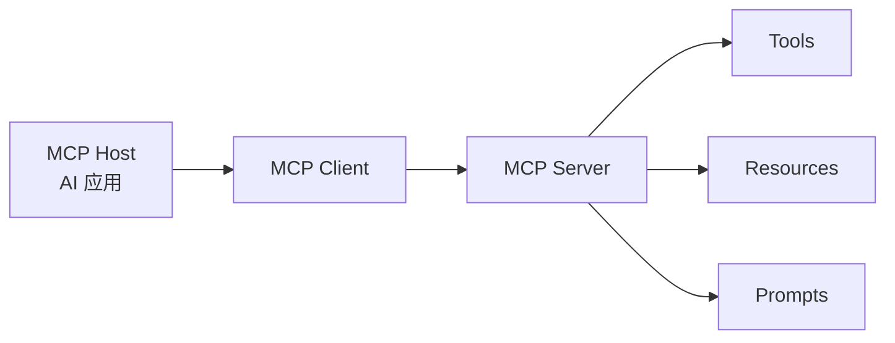
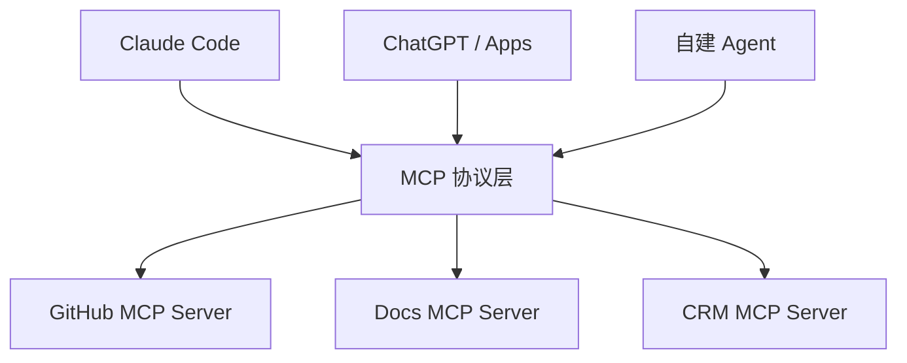
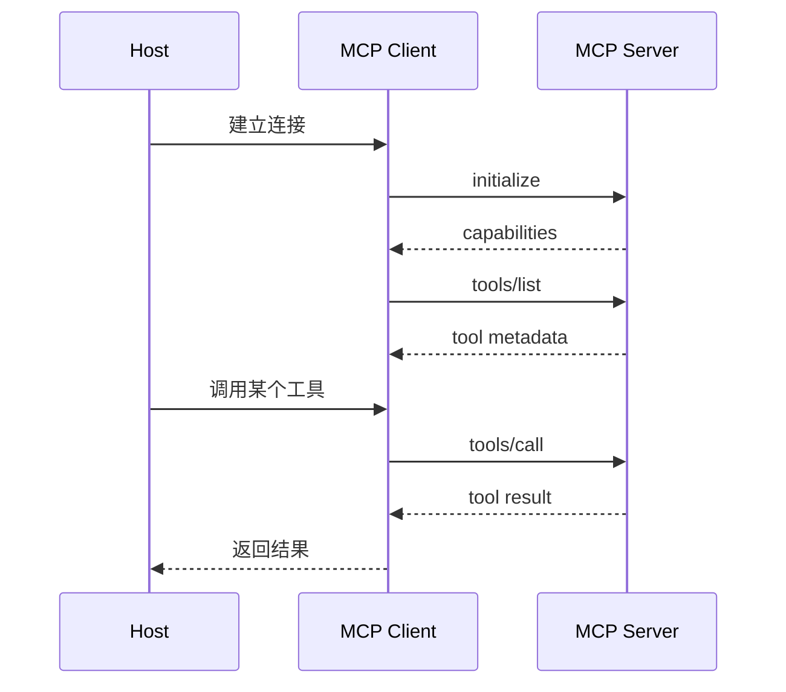

# 通用 Agent 原理：MCP

讲完 [04-工具](./general-tools.md) 和 [06-Skill](./general-skills.md) 之后，接下来就该讲 MCP 了。

因为很多人第一次听到 MCP，会下意识把它理解成：

- 一个工具库
- 一个插件系统
- 一个专门给 Claude 或 ChatGPT 用的接入方式

这些理解都沾到一点边，但都不够准确。

更准确一点说：

**MCP 是一层标准化协议，用来让 AI 应用稳定地连接外部工具、数据和提示模板。**

## MCP 在解决什么问题

如果没有 MCP，AI 应用接外部系统通常会变成这样：

- 接 GitHub 写一套协议
- 接 Notion 再写一套
- 接数据库、文件系统、内部 API 又各写一套

这会带来几个问题：

- 集成方式不统一
- 迁移成本高
- 客户端和服务端强耦合
- 一个工具换一个 AI 客户端就要重做

MCP 要解决的就是这个问题：

**把“AI 应用怎么连接外部能力”这件事标准化。**

所以它的价值不只是“多接几个工具”，而是：

- 统一接入方式
- 降低重复集成成本
- 让同一个 server 可以服务多个 AI 客户端

这也是官方文档经常把 MCP 类比成 “USB-C for AI applications” 的原因。

## 先看最核心的一张图



这张图里最关键的是三层角色：

- `Host`：真正承载用户交互的 AI 应用，比如 Claude Code、ChatGPT 或你自己的 Agent 产品
- `Client`：Host 内部负责和某个 MCP Server 建立连接的组件
- `Server`：把外部能力暴露出来的服务

所以 MCP 不是“模型直接连数据库”，而是：

**Host 通过 MCP Client 去连接 MCP Server，再由 Server 提供工具、资源和提示。**

## MCP 不只暴露工具

这是很多人最容易误解的地方。

MCP 里最常被提到的是 tools，但它不只有 tools。

按官方架构文档，MCP server 主要可以暴露三类核心 primitive：

- `Tools`：可执行动作
- `Resources`：可读取的数据资源
- `Prompts`：可复用的提示模板

可以先这么理解：

### 1. Tools

适合：

- 发起动作
- 调 API
- 执行函数
- 修改外部系统

### 2. Resources

适合：

- 提供上下文数据
- 暴露文件、记录、API 响应
- 让客户端按需读取内容

### 3. Prompts

适合：

- 提供可复用提示模板
- 暴露某类交互模式或任务模板

所以 MCP 的目标，不只是“调用函数”，  
而是把 AI 应用需要的外部能力抽象成一套统一协议。

## 一个最小 Python 版本

下面这段代码不是完整 MCP 实现，而是一个“帮助理解角色分工”的最小模拟。

```python
from dataclasses import dataclass, field


@dataclass
class MCPTool:
    name: str
    description: str


@dataclass
class MCPServer:
    name: str
    tools: list[MCPTool] = field(default_factory=list)
    resources: list[str] = field(default_factory=list)
    prompts: list[str] = field(default_factory=list)

    def list_tools(self) -> list[MCPTool]:
        return self.tools

    def call_tool(self, tool_name: str, args: dict) -> str:
        if tool_name == "search_docs":
            return f"[{self.name}] 找到与“{args['query']}”相关的资料"
        raise ValueError("tool not found")


class MCPClient:
    def __init__(self, server: MCPServer) -> None:
        self.server = server

    def discover_tools(self) -> list[MCPTool]:
        return self.server.list_tools()

    def execute(self, tool_name: str, args: dict) -> str:
        return self.server.call_tool(tool_name, args)


class HostApp:
    def __init__(self, client: MCPClient) -> None:
        self.client = client

    def run(self, user_input: str) -> str:
        tools = self.client.discover_tools()
        available_tool_names = [tool.name for tool in tools]

        if "search_docs" in available_tool_names:
            return self.client.execute("search_docs", {"query": user_input})

        return "没有可用工具"


server = MCPServer(
    name="docs-server",
    tools=[MCPTool(name="search_docs", description="搜索文档")],
    resources=["docs://agent/introduction"],
    prompts=["prompt://summarize-docs"],
)

client = MCPClient(server)
app = HostApp(client)

print(app.run("请查一下 MCP 是什么"))
```

这段代码里最重要的不是“能不能跑复杂逻辑”，而是角色划分：

- `HostApp` 是面向用户的 AI 应用
- `MCPClient` 负责连接 server
- `MCPServer` 负责暴露能力

这就是 MCP 最核心的架构关系。

## 这段代码里，对应了 MCP 的哪几个关键动作

### 1. 能力发现

```python
tools = self.client.discover_tools()
```

这对应 MCP 里的一个核心思想：

**先发现 server 暴露了什么，再决定怎么用。**

在官方架构文档里，这种模式很明确，例如：

- 先初始化连接
- 再 `tools/list`
- 再按需 `tools/call`

所以 MCP 不是客户端预先把所有 server 能力写死，而是支持动态发现。

### 2. 结构化调用

```python
return self.client.execute("search_docs", {"query": user_input})
```

这对应的是：

- 不是自由文本沟通
- 而是结构化方法调用

官方文档里也强调：

- tool metadata 包括 `name`
- `description`
- `inputSchema`

这让客户端和模型都能更稳定地理解如何调用。

### 3. Host 不直接依赖底层系统

`HostApp` 并不知道文档真正存在哪。  
它只知道自己通过 MCP 拿到了一个 `search_docs` 工具。

这就是 MCP 的一个很重要的价值：

**把 AI 应用和底层外部系统隔开。**

## 为什么 MCP 比“直接写工具适配器”更值得讲

因为 MCP 解决的是协议层问题，不只是代码层问题。

假设你自己写一个 Agent，你当然也可以直接手搓：

- `search_docs()`
- `read_file()`
- `get_order()`

这在单项目里完全可行。  
但一旦你想让这些能力被：

- Claude Code 用
- ChatGPT 用
- 你自己的 Web Agent 用
- 别的客户端也能用

就会开始遇到标准化问题。

这时 MCP 的意义就出现了：

- server 暴露统一能力
- 不同 host/client 按统一协议接入
- 降低 N×M 集成复杂度

## 用一张图看 MCP 为什么能降耦合



如果没有中间这层协议，通常会变成：

- Claude Code 接 GitHub 一套
- ChatGPT 接 GitHub 又一套
- 自建 Agent 再来一套

而有了 MCP，至少目标是：

**server 写一次，多个客户端复用。**

## MCP 和工具、Skill 的关系

这是这一组文章里很重要的边界。

### MCP 和工具

- `工具` 是一个动作接口
- `MCP` 是暴露和传输这些接口的协议层

也就是说，MCP server 可以暴露工具，但 MCP 本身不等于工具。

### MCP 和 Skill

- `Skill` 更像任务方法包
- `MCP` 更像外部能力接入标准

Skill 偏“怎么做这类事”，  
MCP 偏“怎么把外部能力标准化接进来”。

所以它们不是替代关系，而是不同层次。

## 一个更贴近真实 MCP 的流程

真实流程通常更像这样：



这张图的重点有三个：

1. 先初始化，再发现能力  
2. tool list 和 tool call 是分开的  
3. server 返回的是结构化能力，而不是一堆散乱函数

## 除了 tools，resources 和 prompts 为什么也重要

这块在很多教程里会被略过，但其实值得讲。

### Resources

很多场景里，AI 应用并不一定想“执行动作”，而是想“读取可用上下文”。

例如：

- 某个配置文件
- 某条数据库记录
- 某个 API 返回对象

这时候 resource 就比 tool 更自然，因为它更像“可读资源”。

### Prompts

有些 server 不只是想暴露工具，还想暴露一类标准任务模板。  
例如：

- 如何总结一份文档
- 如何分析某类告警
- 如何解释某类数据

这时 prompt primitive 就有价值。

所以 MCP 的设计比“函数调用协议”更广一点，  
它是在定义一套通用上下文交换方式。

## MCP 不会自动替你解决所有问题

这里也要讲清楚，不要神化。

MCP 带来的是标准化，但不代表它自动解决：

- 工具选择质量
- 工具顺序控制
- 权限设计
- Prompt injection
- 高风险写操作

例如 AWS 的工程文章就专门提到一个现实问题：

**MCP 本身不原生保证工具调用顺序。**

如果你的流程要求：

1. 先拿到 `order_id`
2. 再查 `order_detail`

那么这个顺序约束，仍然要靠你的 server 设计、工具设计或上层编排去保证。

所以 MCP 是接入标准，不是完整工作流引擎。

## 安全为什么在 MCP 里尤其重要

只要 MCP 把外部能力开放给 AI 应用，安全问题就会立刻变得更现实。

至少要考虑：

- 哪些 tools 能暴露
- 哪些 write actions 需要确认
- 鉴权怎么做
- 参数范围怎么限制
- 如何防 prompt injection 借工具扩大影响

OpenAI 和 Anthropic 的相关文档都明确在强调这件事：

- ChatGPT developer mode 提示了写操作和恶意 MCP 的风险
- Anthropic 的 MCP connector 文档也强调了配置、allowlist/denylist 和数据保留边界

所以一旦 MCP 进入生产，不要把它当成“只是多了个插件接口”。

## 一个更工程化的理解方式

如果你站在工程实现角度，可以这样理解 MCP：

- `Host`：产品层
- `Client`：协议接入层
- `Server`：能力暴露层
- `Tool / Resource / Prompt`：能力表达层
- `Auth / Policy / Confirmation`：治理层

也就是说，MCP 真正改变的是：

**AI 应用和外部系统之间的边界组织方式。**

## 这一篇真正要理解什么

- MCP 是协议层，不是单个工具库
- MCP 的核心是 Host / Client / Server 三层关系
- MCP server 不只暴露工具，还可以暴露 resources 和 prompts
- MCP 解决的是标准化接入，不自动解决顺序控制、规划和安全治理

## 小结

- 工具回答“能做什么动作”，MCP 回答“这些能力怎么被标准化接进 AI 应用”
- 有了 MCP，不同客户端和不同外部能力之间更容易解耦
- 真正落地时，MCP 通常要和权限、审批、参数约束、上层编排一起看

## 参考资料

- [Model Context Protocol: Introduction](https://modelcontextprotocol.io/docs/getting-started/intro)
- [Model Context Protocol: Architecture overview](https://modelcontextprotocol.io/docs/learn/architecture)
- [Anthropic: MCP connector](https://platform.claude.com/docs/en/agents-and-tools/mcp-connector)
- [LangChain: MCP](https://docs.langchain.com/oss/python/langchain/mcp)
- [OpenAI: ChatGPT Developer mode](https://developers.openai.com/api/docs/guides/developer-mode)
- [OpenAI Help: Apps in ChatGPT](https://help.openai.com/en/articles/11487775-connectors-in-chatgpt)
- [AWS: Unlocking the power of MCP on AWS](https://aws.amazon.com/blogs/machine-learning/unlocking-the-power-of-model-context-protocol-mcp-on-aws/)
- [AWS: Building MCP Servers with Controlled Tool Orchestration](https://aws.amazon.com/blogs/devops/flexibility-to-framework-building-mcp-servers-with-controlled-tool-orchestration/)
