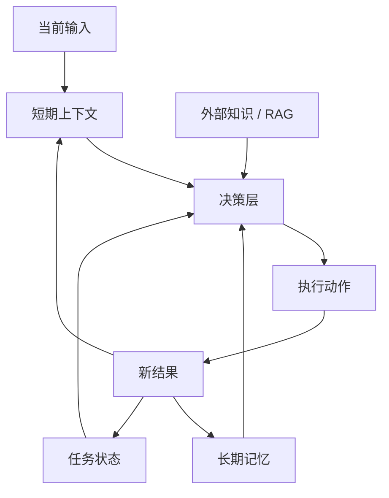
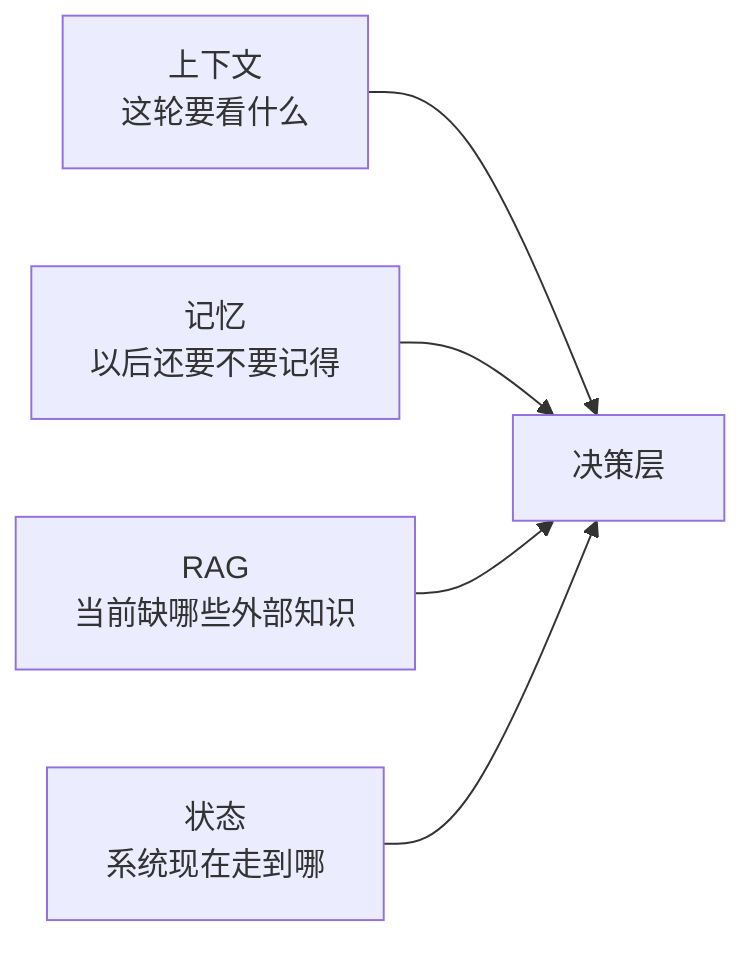

# 通用 Agent 原理：记忆

前面几篇已经把结构、循环、规划、工具都拆开了。  
这一篇讲另一个非常容易被误解的部分：

**记忆。**

很多人一说 Agent 记忆，脑子里首先想到的是：

- 更长的上下文窗口
- 把历史消息全塞进去
- 做一个向量库检索

这些都只碰到了一部分问题，但没有真正把“记忆”讲清楚。

更准确一点说，记忆要回答的是：

**系统应该长期保留什么，什么时候取出来，以及哪些信息根本不该叫记忆。**

## 记忆在解决什么问题

如果没有记忆，Agent 很容易表现得像这样：

- 同一个用户下一次来，它完全不记得是谁
- 上一周已经确认过的偏好，这一轮又要重新问
- 明明之前做过类似任务，这次还是从零开始

所以记忆真正解决的是：

- 跨轮延续
- 跨会话延续
- 经验沉淀
- 个性化适配

这也是为什么很多团队在做长任务或长期助手时，都会发现：

**上下文窗口再长，也不等于真正的记忆系统。**

## 先看一张图



这张图想表达的是：

- 不是所有信息都进记忆
- 记忆只是信息系统中的一个容器
- 它要和上下文、RAG、状态分开看

## 一个最小 Python 版本

下面这段代码用最小实现演示“短期上下文 + 长期记忆”是怎么配合的。

```python
from dataclasses import dataclass, field


@dataclass
class SessionState:
    recent_messages: list[str] = field(default_factory=list)
    last_result: str | None = None


class MemoryStore:
    def __init__(self) -> None:
        self.user_profiles: dict[str, dict] = {}

    def save_preference(self, user_id: str, key: str, value: str) -> None:
        profile = self.user_profiles.setdefault(user_id, {})
        profile[key] = value

    def load_profile(self, user_id: str) -> dict:
        return self.user_profiles.get(user_id, {})


def build_context(user_input: str, session: SessionState, memory: MemoryStore, user_id: str) -> dict:
    return {
        "user_input": user_input,
        "recent_messages": session.recent_messages[-3:],
        "user_profile": memory.load_profile(user_id),
        "last_result": session.last_result,
    }


def agent_step(user_input: str, session: SessionState, memory: MemoryStore, user_id: str) -> str:
    context = build_context(user_input, session, memory, user_id)

    if "以后都用中文回复" in user_input:
        memory.save_preference(user_id, "language", "zh-CN")
        result = "好的，我之后会优先使用中文回复。"
    else:
        preferred_language = context["user_profile"].get("language", "default")
        result = f"当前偏好语言: {preferred_language}"

    session.recent_messages.append(user_input)
    session.last_result = result
    return result


memory = MemoryStore()
session = SessionState()

print(agent_step("以后都用中文回复", session, memory, "u1"))
print(agent_step("帮我总结一下今天的重点", session, memory, "u1"))
```

这段代码里最值得注意的不是语法，而是职责划分：

- `SessionState` 负责当前会话里的近信息
- `MemoryStore` 负责跨会话保留用户偏好
- 每次决策前，系统会把“当前输入 + 近上下文 + 长期记忆”组装起来

这已经很接近很多真实 Agent 系统的基础记忆模型了。

## 这段代码里，哪部分才算“记忆”

### 1. `SessionState` 不是长期记忆

```python
@dataclass
class SessionState:
```

这里存的是：

- 最近消息
- 上一轮结果

这些更像短期上下文，或者说会话内记忆。  
它们很重要，但不该和长期记忆混为一谈。

### 2. `MemoryStore` 才是长期记忆容器

```python
class MemoryStore:
```

这里保留的是跨会话还能复用的信息。  
这个例子里存的是用户偏好，真实系统里还可能包括：

- 用户习惯
- 项目规则
- 历史结论
- 反复验证过的事实

### 3. `build_context` 是记忆进入决策的入口

很多系统不是没有记忆，而是“有了也没用上”。  
因为它们没有在每一轮决策前把记忆正确取回来。

所以记忆系统至少要做两件事：

- 存
- 取

只存不取，不算真正接入 Agent。

## 记忆、上下文、RAG、状态到底怎么区分

这是这篇最核心的部分。

### 1. 上下文：当前这一轮要看什么

上下文更偏：

- 最近消息
- 刚刚的工具结果
- 当前明确目标

它的特点是：

- 近
- 临时
- 成本高

所以把所有历史一直塞进上下文，通常不是好策略。

### 2. 记忆：以后还可能重复用到什么

记忆更偏：

- 长期偏好
- 稳定事实
- 经验沉淀

它的特点是：

- 跨轮
- 跨会话
- 相对稳定

### 3. RAG：当前任务还缺什么外部知识

RAG 更偏：

- 从文档、数据库、网页里临时取知识
- 用来补齐当前推理缺的外部信息

它的特点是：

- 按需获取
- 面向外部知识
- 不代表系统已经记住了

### 4. 状态：系统当前推进到哪一步

状态更偏：

- 当前任务阶段
- 已完成步骤
- 错误次数
- 当前 owner

它的重点不是“知识”，而是“位置和流转”。

## 用一张图把边界画清楚



如果你把这四个容器混了，系统通常就会开始失控。

## 一个更贴近真实系统的版本

真实系统里，记忆通常不会只是一个 `dict`。  
更常见的是下面这几类：

- 个人偏好记忆
- 项目规则记忆
- 任务经验记忆
- 结构化 profile
- 检索型记忆

一些工程实践还会进一步把长期记忆拆成：

- `semantic memory`：稳定事实
- `episodic memory`：发生过的经历
- `procedural memory`：流程和规则

像 LangChain 和一些大型公司的工程文章，也会用类似的分类来解释不同记忆形态。

## 什么时候该写入记忆

这比“怎么存”更重要。

不是每一条信息都值得记。

更适合写入记忆的，通常是：

- 用户明确表达的长期偏好
- 以后大概率复用的稳定背景
- 多次验证过的经验
- 任务中沉淀下来的规则

不太适合直接写入长期记忆的，通常是：

- 一次性的工具结果
- 当前任务的临时中间值
- 噪声很大的猜测
- 尚未确认的外部信息

## 一个简单的“该不该记”判断函数

```python
def should_store_as_memory(text: str) -> bool:
    long_lived_signals = [
        "以后都",
        "默认",
        "偏好",
        "长期",
        "记住",
    ]
    return any(signal in text for signal in long_lived_signals)
```

这当然只是个最小演示，但它说明了一个很重要的原理：

**记忆写入本身就是一个决策问题。**

真实系统里，这个决策可以由：

- 开发者规则控制
- 模型判断控制
- 两者结合

## 为什么“大上下文”不等于“好记忆”

这是很多人最容易踩的坑。

更大的上下文窗口确实能让模型一次看到更多内容，  
但它并不能自动解决这些问题：

- 哪些信息是长期重要的
- 会话结束后什么要继续保留
- 哪些信息应该被压缩
- 哪些信息应该被遗忘

一些工程文章也专门强调这一点：

- 大窗口只能缓解“当前能装多少”
- 真正的记忆系统解决的是“跨时间持续保留什么”

所以：

**大上下文是容量问题，记忆是持久化和检索问题。**

## 为什么 RAG 也不等于记忆

RAG 很有用，但它解决的是另一个问题。

RAG 擅长的是：

- 在需要时拉取外部资料
- 给模型补充事实依据

但它不天然解决：

- 用户是谁
- 上次聊到哪
- 这个团队的默认规则是什么
- 这个 Agent 之前学到了什么

可以用一句简单的话记住：

- `RAG` 帮 Agent 回答得更准
- `记忆` 帮 Agent 延续得更稳

## 记忆系统最容易出问题的地方

### 1. 什么都记

这会让记忆迅速膨胀，最后变成垃圾堆。

### 2. 什么都不记

系统每次都从零开始，长期体验会很差。

### 3. 把状态当记忆

例如把“当前任务卡在审批节点”写成长期记忆，这通常会污染后续决策。

### 4. 把 RAG 结果直接当长期记忆

外部资料通常需要验证、筛选、压缩之后再决定要不要沉淀。

## 一个更完整的最小版本

下面这段代码把“短期上下文 + 长期记忆 + 外部检索”并排放在一起。

```python
from dataclasses import dataclass, field


@dataclass
class MemoryDemoState:
    recent_messages: list[str] = field(default_factory=list)


class LongTermMemory:
    def __init__(self) -> None:
        self.data: dict[str, dict] = {}

    def get(self, user_id: str) -> dict:
        return self.data.get(user_id, {})

    def put(self, user_id: str, key: str, value: str) -> None:
        self.data.setdefault(user_id, {})[key] = value


def rag_lookup(query: str) -> str:
    return f"外部知识库返回：与“{query}”相关的 2 条资料"


def answer(user_id: str, user_input: str, state: MemoryDemoState, memory: LongTermMemory) -> str:
    profile = memory.get(user_id)
    external_knowledge = rag_lookup(user_input)

    if "默认称呼我老王" in user_input:
        memory.put(user_id, "nickname", "老王")
        return "好的，我记住了。"

    nickname = profile.get("nickname", "你")
    state.recent_messages.append(user_input)
    return f"{nickname}，结合上下文和外部资料，我的结论是：{external_knowledge}"
```

这段代码非常适合拿来区分四个概念：

- `recent_messages` 是上下文
- `LongTermMemory` 是记忆
- `rag_lookup` 是外部检索
- 如果再加任务推进字段，那就是状态

## 这一篇真正要理解什么

- 记忆不是上下文、不是 RAG、也不是状态
- 记忆解决的是跨轮、跨会话的长期保留
- 一个有效的记忆系统至少要能：存、取、更新、必要时遗忘
- 不是所有信息都值得写入记忆

## 小结

- 上下文管当前，记忆管长期，RAG 管外部知识，状态管任务流转
- 很多所谓“Agent 不稳定”，本质上是信息容器边界没有分清
- 用最小 Python 示例去看，记忆系统的关键不是“多存一点”，而是“存对、取对、用对”

## 参考资料

- [OpenAI: Conversation state](https://developers.openai.com/api/docs/guides/conversation-state)
- [Anthropic Cookbook: Context engineering, memory, compaction, and tool clearing](https://platform.claude.com/cookbook/tool-use-context-engineering-context-engineering-tools)
- [LangChain: Memory overview](https://docs.langchain.com/oss/javascript/concepts/memory)
- [Oracle Cloud: Agent Memory](https://docs.oracle.com/en-us/iaas/Content/generative-ai/memory.htm)
- [Oracle Developers: Agent Memory: Why Your AI Has Amnesia and How to Fix It](https://blogs.oracle.com/developers/agent-memory-why-your-ai-has-amnesia-and-how-to-fix-it)
