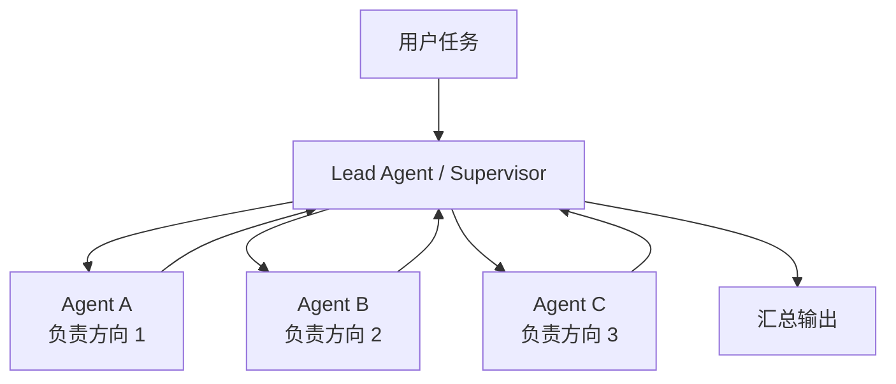
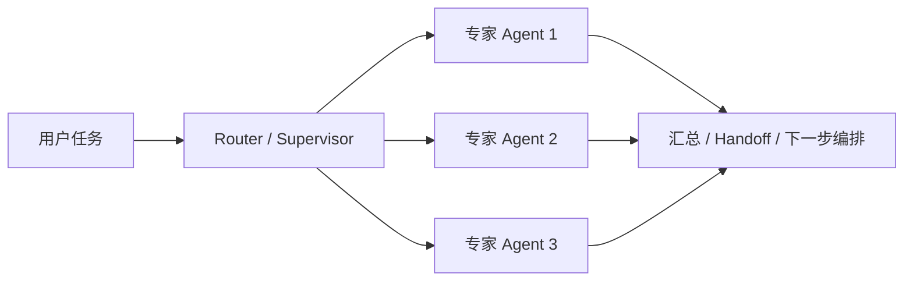

# 通用 Agent 原理：多 Agent

讲到这里，很多人会自然产生一个想法：

**既然一个 Agent 已经能规划、调工具、用记忆，那为什么还要多 Agent？**

这个问题非常关键。  
因为多 Agent 不是“更高级的默认答案”，而是一种有明确适用边界的系统设计选择。

这篇就专门回答两件事：

- 多 Agent 为什么会出现
- 什么时候该拆，什么时候不该拆

## 多 Agent 在解决什么问题

单 Agent 在很多任务里已经够用。  
尤其是：

- 任务不长
- 工具不多
- 上下文不复杂
- 不需要并行处理

这时硬上多 Agent，往往只会增加复杂度。

那为什么还会出现多 Agent？

因为当任务继续变复杂时，单 Agent 往往会开始遇到几个瓶颈：

- 工具太多，选择变差
- 上下文太大，信息互相干扰
- 任务里有明显可并行的部分
- 需要不同角色或不同专业边界
- 不同团队希望独立维护不同能力

所以多 Agent 的核心目标不是“显得聪明”，而是：

**把一个过于复杂的单体问题，拆成多个边界更清晰的子问题。**

## 先看一张最常见的结构图



这是最常见、也最容易理解的一种模式：

- 一个主 Agent 负责理解目标和分配任务
- 多个子 Agent 负责处理不同子问题
- 最后由主 Agent 汇总结果

Anthropic 的多 Agent 研究系统，本质上就是这种 `orchestrator-worker` 模式。

## 多 Agent 并不一定比单 Agent 更强

这一点必须先讲清楚。

LangChain 官方文档写得很直接：

- 很多开发者说自己需要 multi-agent
- 但实际问题可能只是在找更好的上下文管理、工具管理、并行化方式
- 不是每个复杂任务都必须上多 Agent

换句话说：

**多 Agent 是一种手段，不是目标。**

如果一个单 Agent 加上更清楚的工具集、更好的 prompt、更稳的状态设计就能解决问题，那通常没必要拆。

## 一个最小 Python 版本

下面这段代码演示一个最小版的 `lead agent + worker agents`。

```python
from dataclasses import dataclass


@dataclass
class WorkerResult:
    worker_name: str
    result: str


def worker_agent(task: str, worker_name: str) -> WorkerResult:
    return WorkerResult(
        worker_name=worker_name,
        result=f"{worker_name} 完成了任务：{task}",
    )


def lead_agent(user_goal: str) -> str:
    subtasks = [
        "收集背景资料",
        "提炼关键要点",
        "生成最终总结",
    ]

    results = []
    for index, subtask in enumerate(subtasks, start=1):
        worker_name = f"worker_{index}"
        results.append(worker_agent(subtask, worker_name))

    merged = "\n".join([f"{item.worker_name}: {item.result}" for item in results])
    return f"目标：{user_goal}\n汇总结果：\n{merged}"


print(lead_agent("请完成一份简短调研"))
```

这段代码很短，但已经体现了多 Agent 的最小骨架：

- 有一个主 Agent
- 主 Agent 拆任务
- 子 Agent 执行子任务
- 主 Agent 汇总

## 这段代码里，多 Agent 真正多出来的是什么

### 1. 任务拆分

单 Agent 里，很多时候是：

- 同一个 Agent 自己想、自己做、自己收尾

多 Agent 里，会多出一个明确动作：

- 先把任务拆给别人

这意味着系统要开始处理：

- 怎么拆
- 拆成多少份
- 哪些能并行
- 哪些必须串行

### 2. 角色边界

子 Agent 不是为了“数量更多”，而是为了边界更清楚。

例如：

- 一个负责检索
- 一个负责分析
- 一个负责验证

边界清楚之后，每个 Agent 看到的上下文可以更小，职责也更专一。

### 3. 汇总机制

只会拆，不会汇总，系统就会很乱。  
所以多 Agent 设计里，汇总是和拆分同样重要的部分。

## 多 Agent 最常见的几种模式

### 1. Orchestrator-Worker

就是前面这张图那种：

- 一个主 Agent 负责任务拆解和调度
- 多个 worker 负责执行

这是目前最常见的模式，因为它最容易控制。

### 2. Router

先由一个路由步骤判断：

- 这个任务应该交给哪个专长 Agent

例如：

- 财务问题给财务 Agent
- 法务问题给法务 Agent
- 技术问题给技术 Agent

这种模式更像“智能分诊”。

### 3. Handoff

任务不会一直由同一个主 Agent 控制，  
而是在不同 Agent 之间切换所有权。

例如：

- 客服 Agent 接到问题
- 识别为退款请求
- handoff 给退款 Agent
- 退款 Agent 再决定是否转人工

### 4. 并行专家

多个 Agent 面向同一个目标，从不同角度并行探索，然后再汇总。

这在调研、分析、搜索类任务里特别常见。

Anthropic 的研究系统，本质上就非常适合这一类。

## 用一张图看几种模式的差别



你可以把它理解成：

- Router 负责选路
- Worker 负责执行
- Handoff 负责换人
- Supervisor 负责总控

很多所谓多 Agent 系统，本质上只是这几种模式的组合。

## 什么时候多 Agent 特别有价值

结合官方文档和工程案例，多 Agent 特别适合下面几种场景。

### 1. 可明显并行的任务

例如：

- 多方向调研
- 多资料源对照
- 多专家视角分析

Anthropic 文章里提到的一个重点就是：

- 多 Agent 在 breadth-first 的研究类问题上效果尤其好
- 因为不同 subagent 可以并行探索不同方向

### 2. 上下文过大，单 Agent 容易混乱

LangChain 也强调这一点：

- 单 Agent 工具太多时，决策会变差
- 上下文太长时，模型更容易被无关信息干扰

这时拆成多个专职 Agent，反而更稳。

### 3. 领域边界明确

例如企业系统里：

- 供应链一个 Agent
- 库存一个 Agent
- 物流一个 Agent
- 合规一个 Agent

AWS 的多 Agent 架构案例，本质上就是这种“按职能拆”。

### 4. 多团队协作开发

如果不同团队分别维护不同能力，  
多 Agent 架构会天然更适合模块化协作。

因为每个 Agent 可以成为一个更清楚的维护边界。

## 什么时候不该拆多 Agent

这部分同样重要。

### 1. 任务很短

如果就是一次问答或一次简单工具调用，拆多 Agent 纯属增加成本。

### 2. 子任务高度耦合

如果每一步都强依赖前一步细节，  
拆成多个 Agent 反而会带来大量通信和状态同步成本。

### 3. 没有清楚的角色边界

如果你说不清每个 Agent 到底负责什么，那拆出来也大概率会互相打架。

### 4. 汇总成本大于拆分收益

有些任务拆得很细，但最后主 Agent 需要花很多成本把结果拼回来。  
这种情况下，多 Agent 不一定划算。

Anthropic 自己也明确提到：

- 某些编码任务不太适合现在的多 Agent 架构
- 因为真正能并行的部分没那么多
- 实时协调和委派本身也还不够稳

## 多 Agent 为什么会更贵、更难控

这是必须面对的现实。

多 Agent 不是免费午餐。

一旦拆成多个 Agent，系统会多出很多成本：

- token 成本
- 调度成本
- 汇总成本
- 错误传播成本
- 状态同步成本

Anthropic 的文章里给了一个非常直接的结论：

- 多 Agent 系统通常会消耗远多于普通聊天和单 Agent 的 tokens

所以它只有在“任务价值足够高”的时候才划算。

## 一个更贴近真实系统的版本

下面这段代码把“主 Agent 调度 + 专长 Agent + 汇总”再往前推一步。

```python
from dataclasses import dataclass


@dataclass
class AgentTask:
    owner: str
    description: str


def route_tasks(goal: str) -> list[AgentTask]:
    return [
        AgentTask(owner="research_agent", description="收集相关资料"),
        AgentTask(owner="analysis_agent", description="整理关键观点"),
        AgentTask(owner="review_agent", description="检查结论是否一致"),
    ]


def run_specialist(task: AgentTask) -> str:
    return f"{task.owner} 已完成：{task.description}"


def run_multi_agent(goal: str) -> str:
    tasks = route_tasks(goal)
    outputs = [run_specialist(task) for task in tasks]
    return "\n".join(outputs)
```

这段代码里最关键的是：

- 不是随机多出几个 Agent
- 而是每个 Agent 对应一种清晰职责

这才是多 Agent 设计成立的前提。

## 多 Agent 和 Skill、MCP 的关系

这也是这一组文章里需要串起来理解的地方。

### 多 Agent vs Skill

- `Skill` 是一类任务的方法包
- `多 Agent` 是系统的角色拆分方式

你完全可以在多 Agent 系统里，让每个 Agent 再加载自己的 Skill。

### 多 Agent vs MCP

- `MCP` 解决外部能力怎么标准化接入
- `多 Agent` 解决任务怎么分工和协作

一个多 Agent 系统里，每个 Agent 甚至可以连接不同的 MCP server。

所以这几层不是冲突关系，而是不同层次的设计。

## 一个实用判断框架：拆之前先问 4 个问题

在决定要不要上多 Agent 时，可以先问：

1. 这个任务真的存在清晰可拆的子问题吗？
2. 这些子问题之间能并行吗？
3. 每个子问题是否值得有独立上下文和独立角色？
4. 汇总收益是否大于额外成本？

如果这四个问题里，大多数答案都是否定的，  
那很可能还不该上多 Agent。

## 这一篇真正要理解什么

- 多 Agent 不是默认更强，而是适合某些复杂任务的拆分方式
- 它最适合并行化强、上下文大、领域边界清晰的任务
- 主 Agent 的调度能力和汇总能力，和子 Agent 的执行能力同样重要
- 如果没有清晰边界，多 Agent 只会把单体复杂度变成系统复杂度

## 小结

- 多 Agent 的本质，是把复杂问题拆给多个边界清晰的执行单元
- 最常见模式是 orchestrator-worker、router、handoff、并行专家
- 它适合高价值、可并行、上下文过大的任务，不适合所有任务

## 参考资料

- [Anthropic: How we built our multi-agent research system](https://www.anthropic.com/engineering/multi-agent-research-system)
- [LangChain: Multi-agent](https://docs.langchain.com/oss/python/langchain/multi-agent/index)
- [AWS: Building Resilient Supply Chains with Multi-Agent AI](https://aws.amazon.com/blogs/industries/building-resilient-supply-chains-multi-agent-ai-architectures-for-retail-and-cpg-with-amazon-bedrock/)
- [AWS: Field Workforce Safety AI Assistant](https://aws.amazon.com/blogs/industries/transforming-business-operations-with-multi-agent-systems-field-workforce-safety-ai-assistant/)
- [Microsoft Cloud Blog: The rise of multi-agentic systems](https://www.microsoft.com/en-us/microsoft-cloud/blog/2025/12/04/multi-agentic-ai-unlocking-the-next-wave-of-business-transformation/)
- [LangChain: Agents](https://www.langchain.com/agents)
