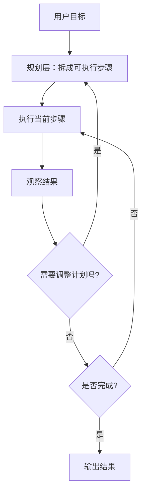
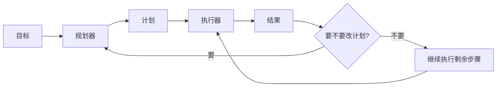

# 通用 Agent 原理：规划

前两篇已经拆开了两个视角：

- [01-Agent 架构](./general-agent-architecture.md) 讲系统里有哪些模块
- [02-核心循环](./general-core-loop.md) 讲这些模块怎么一轮一轮跑起来

这一篇继续往里走一步，讲一个非常关键的问题：

**Agent 在每一轮里，到底怎么决定“接下来做什么”。**

这就是规划。

## 规划在解决什么问题

用户给 Agent 的目标，往往都是模糊的。

例如：

- 帮我调研一下适合中小团队的客服系统
- 帮我整理这次会议的纪要和待办
- 帮我分析这个线上问题可能出在哪

这些目标都不是“一个动作”能直接完成的。  
中间通常还需要：

- 拆任务
- 排优先级
- 决定先做哪一步
- 在执行后根据结果调整路径

所以规划不是装饰层，而是 Agent 能不能从“会回答”变成“会推进任务”的关键。

## 一张图先看懂



这张图想表达的是：

- 规划不是只在开头发生一次
- 执行之后，系统可能会重新规划
- 所以规划通常是“先规划，再执行，必要时再规划”

## 规划不等于“想很多”

很多人第一次听到规划，会把它理解成：

- 长链条思考
- 非常复杂的任务树
- 一开始就把所有步骤写满

这不准确。

更实用的理解是：

**规划的本质，是把模糊目标转换成当前可执行的下一组步骤。**

所以规划可以很轻，也可以很重。

轻规划：

- 只决定下一步调用哪个工具

重规划：

- 先拆出多个子目标
- 决定哪些串行、哪些并行
- 执行一部分后再动态调整

## 一个最小 Python 版本

下面这段代码演示一个非常小的 `plan-and-execute` 结构。

```python
from dataclasses import dataclass, field


@dataclass
class PlanState:
    goal: str
    plan: list[str] = field(default_factory=list)
    completed: list[str] = field(default_factory=list)
    observations: list[str] = field(default_factory=list)
    done: bool = False


def make_plan(goal: str) -> list[str]:
    return [
        "先检索相关资料",
        "提炼关键结论",
        "生成最终回答",
    ]


def execute_step(step: str) -> str:
    if step == "先检索相关资料":
        return "找到 5 篇相关资料，其中 2 篇与目标高度相关"
    if step == "提炼关键结论":
        return "已经整理出 3 个核心要点"
    if step == "生成最终回答":
        return "已生成一份结构化回答"
    return "未知步骤"


def should_replan(state: PlanState, result: str) -> bool:
    return "高度相关" not in result and "检索" in state.completed[-1]


def replan(state: PlanState) -> list[str]:
    return [
        "换一个关键词重新检索",
        "提炼关键结论",
        "生成最终回答",
    ]


def run_with_plan(goal: str) -> str:
    state = PlanState(goal=goal)
    state.plan = make_plan(goal)

    while state.plan and not state.done:
        current_step = state.plan.pop(0)
        result = execute_step(current_step)

        state.completed.append(current_step)
        state.observations.append(result)

        if should_replan(state, result):
            state.plan = replan(state)
            continue

        if current_step == "生成最终回答":
            state.done = True
            return result

    return state.observations[-1] if state.observations else "没有结果"


print(run_with_plan("请调研一下 Agent 规划机制，并整理成一个简短说明"))
```

这段代码虽然很小，但已经把规划的核心要素放进来了：

- 先生成一个计划
- 按步骤执行
- 根据执行结果决定是否重规划
- 在合适的时候结束

## 这段代码里，真正体现规划的是哪几部分

### 1. `make_plan`

```python
def make_plan(goal: str) -> list[str]:
```

它把一个模糊目标先转换成较清晰的步骤。

这一步对应真实系统里的：

- 任务拆解
- 子目标生成
- 步骤排序

如果没有这一步，系统就更容易在原地打转，因为它每一轮都只看到一个很大的模糊目标。

### 2. `state.plan`

```python
plan: list[str] = field(default_factory=list)
```

很多人会把计划只放在模型的上下文里。  
这在简单任务里还能跑，但一旦任务变长，问题就会越来越明显：

- 计划容易丢
- 中间步骤难复用
- 很难知道当前执行到哪

把计划显式放进状态里，系统就会稳定很多。

### 3. `execute_step`

规划本身不做事，执行层才真正做事。

这也是为什么规划不能脱离工具和执行去理解。  
好的规划，必须最后能落到可执行步骤上。

### 4. `should_replan`

```python
def should_replan(state: PlanState, result: str) -> bool:
```

这是规划里最容易被忽略，但非常关键的一步。

因为现实任务不是按理想路径推进的。  
执行后经常会出现：

- 搜索结果不对
- 数据不完整
- 工具报错
- 外部环境变了

这时候继续机械执行旧计划，往往会越走越偏。  
所以真正实用的规划，通常都要允许重规划。

## 规划在真实系统里常见的两种形态

### 1. 轻规划：每次只决定下一步

适合：

- 任务短
- 环境变化快
- 每一步都高度依赖上一步结果

例如：

- 客服对话
- 浏览器操作
- 命令行排错

这种模式的特点是：

- 不一定先列完整计划
- 每一轮都做局部选择
- 更接近 `react` 风格

### 2. 重规划：先拆计划，再边执行边修正

适合：

- 任务更长
- 可以预先拆解
- 目标比较复杂

例如：

- 调研任务
- 长文写作
- 项目方案输出

这种模式的特点是：

- 会先形成一个显式计划
- 之后按步骤推进
- 中途允许重规划

## 为什么很多团队会单独把“规划”拿出来讲

因为一旦任务变长，规划质量会直接决定系统表现。

比如 Anthropic 在介绍多 Agent 研究系统时，就明确提到过：

- 先由 lead agent 制定策略
- 再把不同方向拆给 subagents
- 执行过程中根据结果继续调整

这说明在复杂任务里，规划不是一层可有可无的包装，  
而是整个系统效率和质量的关键杠杆。

很多大型公司的工程实践里，真正有效的模式也往往不是“先把所有答案想完”，而是：

- 先有一个足够好的初始计划
- 执行
- 看反馈
- 再修正

## 用一张图看“计划”和“执行”的关系



这张图最重要的点是：

**规划和执行不是上下级关系，而是一个来回反馈的关系。**

## 一个具体例子：做竞品调研时怎么规划

假设目标是：

```text
帮我调研 5 个适合中小团队的客服系统，并给出对比建议。
```

这时一个比较自然的规划会是：

1. 先明确筛选维度
2. 再收集候选产品
3. 再对价格、功能、部署方式做比较
4. 最后给建议

但执行时可能会发现：

- 有些产品资料太少
- 有些定价不透明
- 某几个产品更适合拆开单独研究

这时系统就需要把原计划改成：

- 补充搜索某一类产品
- 替换掉信息不足的候选
- 新增一步“验证官方定价”

这就是规划真正工作的地方。

## 什么时候不需要太重的规划

不是所有 Agent 都要上复杂规划。

下面这些情况，通常轻规划就够了：

- 任务很短
- 每次只需要一个工具调用
- 环境变化太快，提前列长计划意义不大
- 任务本身已经被固定工作流包住了

所以规划不是越复杂越好，  
而是要和任务长度、变化程度、工具复杂度匹配。

## 常见误区

### 1. 以为规划就是先写一个长 Todo

如果这个 Todo 不会被执行结果修正，那它更像静态清单，不是真正规划。

### 2. 以为有规划就一定更强

对短任务来说，过重的规划反而会增加成本和延迟。

### 3. 只让模型“想”，不把计划写进状态

这样计划很容易在长任务里漂移。

### 4. 有计划但没有重规划机制

一旦环境变化，系统就会继续机械执行错误路径。

## 这一篇真正要理解什么

- 规划解决的是“模糊目标怎么变成可执行步骤”
- 规划既可以很轻，也可以很重
- 一个更稳的系统，通常会把计划显式写进状态
- 执行结果会反过来影响计划，所以重规划很重要

## 小结

- 规划不是想很多，而是把目标转成当前可执行路径
- 最小代码形态通常是：`make_plan -> execute_step -> should_replan`
- 复杂任务里，规划往往决定系统的效率、稳定性和成本

## 参考资料

- [OpenAI Developers](https://developers.openai.com/)
- [Anthropic Engineering: How we built our multi-agent research system](https://www.anthropic.com/engineering/multi-agent-research-system)
- [Anthropic: How tool use works](https://platform.claude.com/docs/en/agents-and-tools/tool-use/how-tool-use-works)
- [LangChain Documentation](https://docs.langchain.com/)
