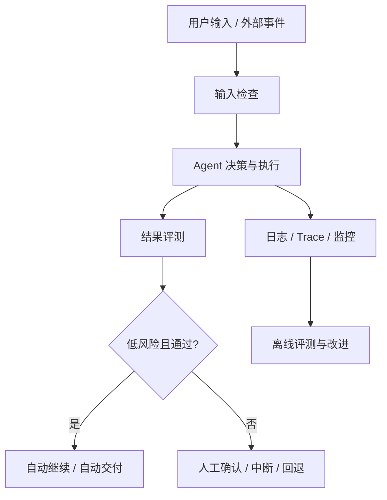
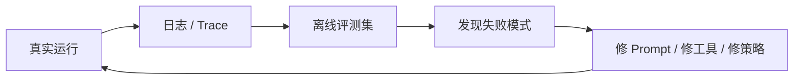

# 通用 Agent 原理：可靠性与安全

前面几篇讲的是：

- 系统怎么组织
- 怎么循环
- 怎么规划
- 怎么调工具
- 怎么管理记忆
- 怎么拆多 Agent

但如果把问题拉回到真实上线环境，会发现还有一层几乎绕不过去：

**这个 Agent 能不能稳定地做对事，并且在做错事之前被拦住。**

这就是“可靠性与安全”。

很多系统 Demo 很顺，但一上线就暴露问题，通常不是因为“原理没写对”，而是因为缺了这层控制。

## 这一篇在解决什么问题

可靠性和安全经常被混在一起讲，但它们关注点不完全一样。

可以先粗略分成两部分：

- `可靠性`：系统能不能稳定、可重复地完成任务
- `安全`：系统会不会做出不该做的事，或者在高风险情况下还能被控制

放到 Agent 上，它们通常会一起出现。

因为 Agent 不只是生成文本，它还会：

- 调工具
- 执行动作
- 读取外部内容
- 修改外部系统

所以你必须同时回答：

- 它做得对不对
- 它做得稳不稳
- 它会不会做危险动作
- 出问题时谁来接管

## 先看一张总图



这张图里最重要的点是：

- 安全不是只在开头做一次过滤
- 可靠性也不是只看最后结果
- 真正的系统通常是“执行 + 评测 + 风险控制 + 人工接管”一起存在

## 一个最小 Python 版本

先用最小代码把这件事讲清楚。

```python
from dataclasses import dataclass, field


@dataclass
class ExecutionResult:
    output: str
    risk_level: str
    passed_eval: bool


@dataclass
class AgentRun:
    logs: list[str] = field(default_factory=list)
    requires_human: bool = False


def evaluate_output(output: str) -> bool:
    banned_signals = ["未知来源", "无法验证"]
    return not any(signal in output for signal in banned_signals)


def assess_risk(action: str) -> str:
    if "删除" in action or "转账" in action or "发正式通知" in action:
        return "high"
    return "low"


def human_approval_needed(risk_level: str, passed_eval: bool) -> bool:
    return risk_level == "high" or not passed_eval


def run_agent(action: str) -> AgentRun:
    run = AgentRun()
    run.logs.append(f"收到任务: {action}")

    output = f"执行结果: 已处理 {action}"
    risk_level = assess_risk(action)
    passed_eval = evaluate_output(output)

    result = ExecutionResult(
        output=output,
        risk_level=risk_level,
        passed_eval=passed_eval,
    )

    run.logs.append(f"风险等级: {result.risk_level}")
    run.logs.append(f"评测通过: {result.passed_eval}")

    if human_approval_needed(result.risk_level, result.passed_eval):
        run.requires_human = True
        run.logs.append("进入人工确认")
    else:
        run.logs.append("自动继续执行")

    return run


demo = run_agent("删除一条客户记录")
print("\n".join(demo.logs))
```

这段代码很小，但已经把真实系统里最关键的几件事带出来了：

- 先做结果评测
- 再做风险判断
- 根据结果决定是自动继续，还是进入人工确认
- 整个过程有日志

这比“直接让 Agent 去做”已经多出了一层非常关键的控制面。

## 可靠性到底在看什么

很多人一提可靠性，第一反应是“模型答得准不准”。  
但对 Agent 来说，这还不够。

更完整一点，可靠性至少包括：

- 能否稳定完成任务
- 相同输入下是否行为接近
- 工具失败时是否能合理处理
- 遇到异常时是否能停下来
- 输出是否可验证

所以可靠性不只是“正确率”，而是：

**在真实环境里，系统是否可预测、可观察、可恢复。**

## 为什么 Agent 特别需要评测

普通问答模型的评测重点，常常是：

- 回答是否正确
- 是否拒绝违规请求

但 Agent 评测会更复杂，因为它还有：

- 工具选择
- 执行顺序
- 状态更新
- 最终结果

OpenAI 的 agent evals 文档就是在强调这一点：

- 不只是评最终输出
- 还要评执行过程、工具使用和任务完成质量

Anthropic 的 tool evaluation cookbook 也在讲类似的事：

- 工具描述是否清楚
- 模型会不会选对工具
- 参数是否填得对

也就是说，对 Agent 来说，“会不会调用工具”本身就是评测对象。

## 用一张图看可靠性闭环



这张图想表达的是：

可靠性不是写出来的，而是迭代出来的。

成熟的 Agent 系统通常都会做这件事：

- 从真实运行里收集失败样本
- 做成评测集
- 继续修系统

## 安全为什么不只是“内容过滤”

如果 Agent 只是聊天，安全很多时候可以主要理解为：

- 有害内容拦截
- 政策违规拒绝

但一旦 Agent 会调用工具，安全问题就立刻升级了。

例如：

- 读到了恶意网页里的 prompt injection
- 在高权限环境里执行了危险命令
- 帮用户修改了本不该改的记录
- 自动完成了本来应该审批的动作

这时候安全就不只是“模型别乱说”，而是：

**系统别乱做。**

## 安全在 Agent 里常见的 4 层控制

### 1. 输入侧控制

解决的是：

- 用户输入是否恶意
- 外部内容是否带 prompt injection
- 某些任务是否一开始就不该执行

Microsoft 的 guardrails 安全博客里，专门讲了两类典型问题：

- 恶意 prompt
- 带毒内容

这类攻击不是让模型“说错一句话”，而是想借模型和工具去扩大影响。

### 2. 工具侧控制

解决的是：

- 哪些工具能暴露
- 哪些参数允许通过
- 哪些动作必须受限

Anthropic 的 bash / computer use 文档都反复强调：

- 隔离环境
- 最小权限
- 命令过滤
- 日志审计

因为真正有风险的，往往不是模型本身，而是模型手里的工具。

### 3. 执行侧控制

解决的是：

- 是否需要超时
- 是否需要预算限制
- 是否要限制重试次数
- 是否达到中断条件

很多事故不是第一步就错，而是错了之后还不停继续。

### 4. 人工确认

解决的是：

- 哪些高风险动作必须让人拍板
- 哪些结果在低置信度时应该让人看一眼

LangGraph 的 interrupts 和 Human-in-the-loop 文档，本质上就是在讲：

**人类不是补丁，而是系统中的一个显式控制节点。**

## 一个更像真实系统的版本

下面这段代码把“评测 + 风险 + 人工确认 + 日志”再往前推一步。

```python
from dataclasses import dataclass, field


@dataclass
class SafetyState:
    action: str
    logs: list[str] = field(default_factory=list)
    retries: int = 0
    halted: bool = False


def run_tool(action: str) -> str:
    return f"已尝试执行: {action}"


def evaluate(result: str) -> bool:
    return "失败" not in result


def risk_policy(action: str) -> str:
    risky_keywords = ["删除", "支付", "发送正式邮件", "修改生产配置"]
    return "high" if any(keyword in action for keyword in risky_keywords) else "low"


def should_halt(state: SafetyState, passed_eval: bool, risk: str) -> bool:
    if risk == "high":
        return True
    if not passed_eval and state.retries >= 1:
        return True
    return False


def controlled_run(action: str) -> SafetyState:
    state = SafetyState(action=action)

    result = run_tool(action)
    state.logs.append(result)

    passed_eval = evaluate(result)
    risk = risk_policy(action)
    state.logs.append(f"eval={passed_eval}, risk={risk}")

    if should_halt(state, passed_eval, risk):
        state.halted = True
        state.logs.append("中断执行，等待人工处理")
    else:
        state.logs.append("允许自动继续")

    return state
```

这段代码里，最重要的其实不是规则写得多复杂，  
而是你已经能看到一个非常清楚的控制逻辑：

- 执行
- 评测
- 风险判断
- 是否中断

这就是很多生产级 Agent 最终都会长出来的基本骨架。

## Human-in-the-loop 为什么值得单独强调

这一层不一定需要单独拆成一个栏目，  
但在原理体系里必须讲清楚。

因为真正可用的 Agent，通常都不是“100% 全自动”，而是：

- 低风险动作自动化
- 高风险动作人工确认
- 低置信度结果人工复核
- 连续失败时人工接管

这是一种工程设计，不是能力不足。

OpenAI 在一些 agent 案例和系统卡里也反复强调类似原则：

- 高风险动作要可验证
- 用户要能看到日志和结果
- 人工 review 仍然重要

所以 Human-in-the-loop 的真正含义是：

**把“人什么时候接手”设计进系统，而不是出问题之后再补救。**

## 为什么可观测性也是可靠性的一部分

很多团队一开始只盯着“模型回答”，但不盯：

- 调了什么工具
- 参数是什么
- 为什么停
- 卡在哪一步

这样系统一出问题就很难定位。

所以真正稳定的 Agent，通常都需要：

- trace
- tool logs
- 中间状态
- 错误类型
- 人工接管记录

没有这些，你很难做：

- 故障复盘
- 失败归因
- 离线评测集迭代

## 一个实用判断框架：上线前先问 5 个问题

如果你想判断一个 Agent 是否接近可上线，可以先问：

1. 我怎么知道它做得对不对？
2. 我怎么知道它什么时候风险高？
3. 哪些动作必须人工确认？
4. 出错后它会不会继续扩大损失？
5. 出问题后我能不能复盘它刚才做了什么？

如果这 5 个问题里，大部分都没有明确答案，那这个系统大概率还停留在 Demo 阶段。

## 可靠性与安全，最后会落到哪些工程机制

回到工程实现，最后通常会落到这些具体机制上：

- 评测集和回归测试
- guardrails
- allowlist / denylist
- 参数校验
- 超时和预算限制
- 审批 / interrupts
- 日志与 trace
- 失败回退和停止条件

所以这一篇真正想表达的是：

**可靠性与安全不是“后面补一点保护”，而是 Agent 架构本身的一部分。**

## 这一篇真正要理解什么

- 可靠性关注的是系统能不能稳定、可预测地完成任务
- 安全关注的是系统能不能在高风险情况下被限制、被拦截、被接管
- Agent 的安全重点往往在工具、权限、外部内容和自动执行
- Human-in-the-loop、可观测性、停止条件，都是这层控制面的一部分

## 小结

- 能做事不等于能上线
- 对 Agent 来说，评测、风控、人工确认、日志，通常要一起设计
- 真正可用的系统，不只是会执行，还会在不该继续时停下来

## 参考资料

- [OpenAI: Agent evals](https://platform.openai.com/docs/guides/agent-evals)
- [OpenAI: Safety evaluations hub](https://openai.com/safety/evaluations-hub/)
- [OpenAI: Keeping your data safe when an AI agent clicks a link](https://openai.com/index/ai-agent-link-safety/)
- [Anthropic: How tool use works](https://platform.claude.com/docs/en/agents-and-tools/tool-use/how-tool-use-works)
- [Anthropic: Computer use tool](https://platform.claude.com/docs/en/agents-and-tools/tool-use/computer-use-tool)
- [Anthropic: Bash tool](https://platform.claude.com/docs/en/agents-and-tools/tool-use/bash-tool)
- [Anthropic Cookbook: Tool evaluation](https://platform.claude.com/cookbook/tool-evaluation-tool-evaluation)
- [LangGraph: Human-in-the-loop / Interrupts](https://docs.langchain.com/oss/python/langgraph/human-in-the-loop)
- [Microsoft Security Blog: AI guardrails](https://www.microsoft.com/en-us/security/blog/2024/04/11/how-microsoft-discovers-and-mitigates-evolving-attacks-against-ai-guardrails/)
