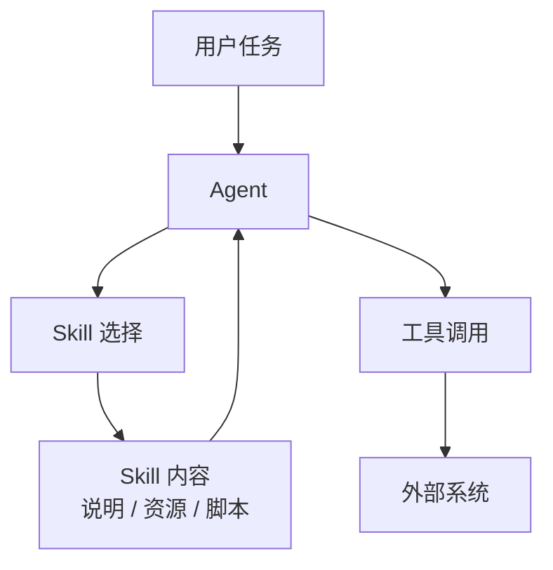
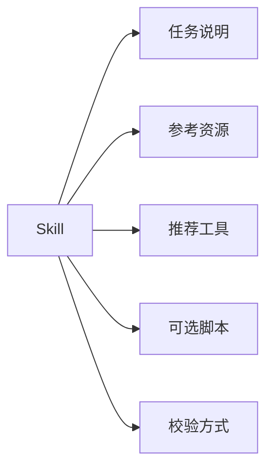

# 通用 Agent 原理：Skill

讲完 [04-工具](./general-tools.md) 之后，很多人会自然问一个问题：

**既然已经有工具了，为什么还需要 Skill？**

答案是：

工具解决的是“做一个动作”，  
Skill 解决的是“把一类做事方法打包成可复用能力”。

这也是为什么很多 Agent 系统走到后面，都会从“工具很多”继续演化到“技能体系”。

## Skill 在解决什么问题

假设你已经给 Agent 配了很多工具：

- 搜索文档
- 读数据库
- 写文件
- 发消息

这时 Agent 确实能做很多事。  
但新问题也会很快冒出来：

- 同一类任务每次都要重新讲做法
- 团队经验很难沉淀
- 不同项目里重复写同样的提示和流程
- 工具虽然有了，但 Agent 不知道什么时候组合使用更稳

这时就需要 Skill。

你可以把 Skill 理解成：

**针对某一类任务，提前打包好的 instructions + resources + optional scripts。**

也就是说，Skill 不是单个动作，而是“做这类事的一套方法”。

## 先看一张图



这张图想表达的是：

- 工具直接连接外部动作
- Skill 更像在工具之上的能力封装层
- 它帮助 Agent 更稳定地完成一类任务

## Skill 和工具到底有什么区别

这是最关键的一部分。

### 工具更像“函数接口”

例如：

- `search_docs(query)`
- `get_order(order_id)`
- `send_email(message)`

工具关注的是：

- 调什么
- 参数是什么
- 返回什么

### Skill 更像“任务能力包”

例如：

- “写发布说明”的 Skill
- “做代码审查”的 Skill
- “导入公众号文章”的 Skill

Skill 关注的是：

- 这种任务通常该怎么做
- 先看哪些信息
- 调哪些工具
- 结果怎么校验

所以一句话区分就是：

- `工具`：一个动作接口
- `Skill`：一套可复用方法

## 一个最小 Python 版本

下面这段代码演示一个最小的 Skill 结构。

```python
from dataclasses import dataclass, field


@dataclass
class Skill:
    name: str
    description: str
    instructions: str
    recommended_tools: list[str] = field(default_factory=list)


skills = [
    Skill(
        name="release_note_writer",
        description="把变更整理成发布说明",
        instructions="先读变更记录，再按用户可读的方式组织成版本说明。",
        recommended_tools=["search_docs", "write_file"],
    ),
    Skill(
        name="bug_triage",
        description="对 bug 进行初步排查和分类",
        instructions="先收集报错，再判断复现路径和影响范围。",
        recommended_tools=["search_logs", "search_docs"],
    ),
]


def select_skill(user_input: str) -> Skill | None:
    if "发布说明" in user_input:
        return skills[0]
    if "排查 bug" in user_input:
        return skills[1]
    return None


def run_with_skill(user_input: str) -> str:
    skill = select_skill(user_input)
    if skill is None:
        return "没有匹配到 Skill，走通用流程"

    return (
        f"加载 Skill: {skill.name}\n"
        f"说明: {skill.instructions}\n"
        f"建议工具: {', '.join(skill.recommended_tools)}"
    )


print(run_with_skill("请帮我写一下这次版本更新的发布说明"))
```

这段代码里，Skill 并没有真正执行工具。  
它做的是另一件事：

**给 Agent 提供这类任务的工作方法。**

## 这段代码里，Skill 真正承担了什么职责

### 1. 描述任务类型

```python
description="把变更整理成发布说明"
```

这告诉 Agent，这个 Skill 适合什么任务。

### 2. 提供做事说明

```python
instructions="先读变更记录，再按用户可读的方式组织成版本说明。"
```

这部分非常关键。

因为 Skill 的核心价值，不在于“再多一个名字”，  
而在于把任务经验显式写出来。

### 3. 提供推荐工具集合

```python
recommended_tools=["search_docs", "write_file"]
```

Skill 不一定自己就是工具。  
更常见的是它会指导 Agent：

- 优先调哪些工具
- 什么顺序更合适
- 哪些结果需要验证

## Skill 为什么比一段长 Prompt 更有用

很多团队最开始其实会把 Skill 写成“复制粘贴的提示词模板”。  
这当然能用，但很快就会遇到问题：

- 不好复用
- 不好版本化
- 不好共享
- 不好附带资源和脚本

Skill 的价值就在于，它把这些东西从一次性 prompt 里抽出来，变成了一个明确对象。

也就是说，Skill 比普通 prompt 更像：

- 一个能力模块
- 一个团队资产
- 一个可维护的任务单元

## 一个更贴近真实系统的版本

真实系统里的 Skill，通常会包含的不只是文字说明。

更完整的形态常见是：

- instructions
- 参考资源
- 示例输入输出
- 可选脚本
- 适用范围
- 验证规则

可以抽象成下面这样：



这也是为什么一些官方 Skill 文档会强调：

- progressive disclosure
- 只在需要时加载完整 Skill 内容
- Skill 可以组合使用

因为一旦 Skill 数量变多，它本身也会变成上下文管理问题。

## 用代码再往前推一步

下面这段代码把 Skill 和工具连接起来。

```python
from dataclasses import dataclass, field


@dataclass
class SkillPackage:
    name: str
    instructions: str
    tools: list[str] = field(default_factory=list)


def choose_skill(task: str) -> SkillPackage | None:
    if "代码审查" in task:
        return SkillPackage(
            name="code_review",
            instructions="优先识别 bug、风险、回归和缺失测试，再给总结。",
            tools=["read_file", "search_code", "run_tests"],
        )
    return None


def execute_task(task: str) -> str:
    skill = choose_skill(task)
    if skill is None:
        return "未命中 Skill，按默认流程处理"

    return (
        f"已命中 Skill: {skill.name}\n"
        f"执行原则: {skill.instructions}\n"
        f"优先使用工具: {', '.join(skill.tools)}"
    )
```

这段代码的关键点是：

- Skill 不替代工具
- Skill 决定“这类任务更适合怎么做”
- 工具负责真正执行动作

## Skill 和工作流又有什么区别

这也很容易混。

Skill 更像：

- 面向某类任务的方法包
- 帮 Agent 更稳地处理这类任务

工作流更像：

- 固定节点和固定顺序
- 明确的系统流程

所以：

- `工作流` 更偏流程编排
- `Skill` 更偏能力封装

两者可以一起存在。

例如一个内容生产系统里：

- 工作流规定：选题 -> 检索 -> 起草 -> 审校 -> 发布
- Skill 规定：“写发布说明”这一步应该怎样做才更稳

## 为什么团队会越来越重视 Skill

因为当 Agent 不再只是个人 Demo，而变成团队系统时，Skill 会自然承担几个重要角色：

- 经验沉淀
- 任务标准化
- 团队共享
- 能力复用

没有 Skill，很多经验只存在开发者脑子里，或者散落在 prompt 片段里。  
有了 Skill，系统就开始具备“把做法沉淀下来”的能力。

这也是为什么很多工程实践最终会从：

- “我给 Agent 多配几个工具”

走向：

- “我给 Agent 建一套技能库”

## Skill 设计不好的常见问题

### 1. Skill 太泛

如果一个 Skill 什么都想覆盖，它最后通常什么都讲不清。

### 2. Skill 和工具职责重叠

如果一个 Skill 实际上只是在包装一个单函数，那它很可能不该叫 Skill。

### 3. Skill 不给明确做法

只有一句“请认真完成任务”，这不算真正的 Skill。

### 4. Skill 不说明边界

Agent 不知道什么时候该用，什么时候不该用。

## 一个实用判断标准：什么时候该抽成 Skill

如果某类任务符合下面这些特征，就很适合抽成 Skill：

- 会反复出现
- 做法相对稳定
- 经常需要多工具组合
- 团队希望统一输出风格或质量标准

例如：

- 写发布说明
- 做代码审查
- 生成周报
- 导入某类资料
- 做故障初筛

## 这一篇真正要理解什么

- Skill 不是工具的别名，而是能力封装层
- Skill 的核心价值，是把一类任务的做法显式沉淀下来
- 工具负责“做动作”，Skill 负责“指导怎么做这类事”
- Skill 越做越像团队资产，而不只是单次 prompt

## 小结

- 工具让 Agent 能行动，Skill 让 Agent 更会做事
- 一个好的 Skill 通常包含：说明、边界、推荐工具、可选资源或脚本
- 理解了 Skill，后面看 `MCP` 和 `多 Agent` 会更容易区分“能力封装”和“能力接入”

## 参考资料

- [Claude API Docs: Using Skills with the API](https://platform.claude.com/docs/en/build-with-claude/skills-guide)
- [Claude API Reference: Skills](https://platform.claude.com/docs/en/api/beta/skills)
- [PagerDuty Engineering: Making Every Engineer an AI Agent Engineer](https://www.pagerduty.com/eng/making-every-engineer-an-ai-agent-engineer/)
- [Sierra: Meet the AI agent engineer](https://sierra.ai/blog/meet-the-ai-agent-engineer)
