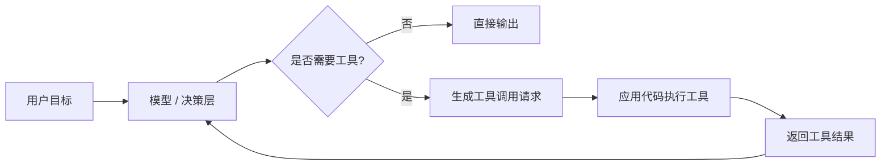
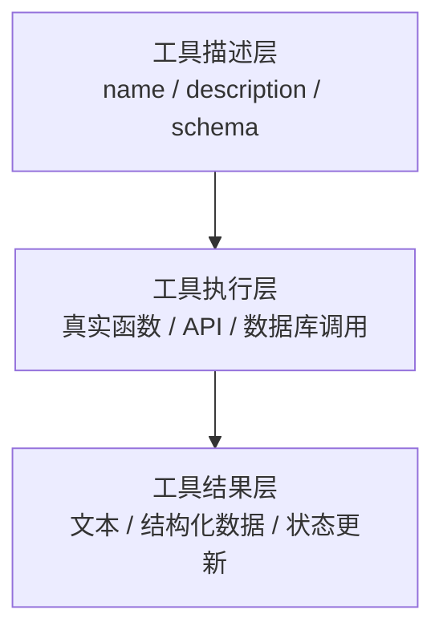

# 通用 Agent 原理：工具

前面几篇已经把骨架搭起来了：

- [01-Agent 架构](./general-agent-architecture.md) 讲系统里有哪些模块
- [02-核心循环](./general-core-loop.md) 讲系统怎么一轮一轮推进
- [03-规划](./general-planning.md) 讲系统怎么把模糊目标变成步骤

这一篇讲一个真正让 Agent 和普通聊天模型拉开差距的东西：

**工具。**

## 工具到底在解决什么问题

模型本身再强，也有几个天然边界：

- 它不能直接读取你数据库里的实时数据
- 它不能直接调用你公司内部 API
- 它不能直接发消息、改状态、操作浏览器
- 它不能真的去执行一个副作用动作

工具层存在的意义，就是把这些“模型不能直接做的事”变成可调用接口。

所以工具不是“给模型多几个按钮”，而是：

**把模型的判断连接到真实世界。**

## 先看一张总图



这张图里最重要的一点是：

**模型并不是自己执行工具。**

更常见的真实情况是：

1. 模型决定要调哪个工具
2. 模型输出结构化调用请求
3. 应用代码真的去执行这个工具
4. 工具结果再回到模型

这也是很多官方文档反复强调的 tool use contract。

## 一个最小 Python 示例

下面这段代码演示一个最小版的工具调用机制。

```python
from typing import Any


TOOLS = {
    "search_docs": {
        "description": "搜索与问题相关的文档",
        "parameters": ["query"],
    },
    "send_reply": {
        "description": "向用户发送回复",
        "parameters": ["message"],
    },
}


def decide_tool(user_input: str, last_result: str | None) -> dict[str, Any]:
    if last_result is None:
        return {
            "tool_name": "search_docs",
            "args": {"query": user_input},
        }

    return {
        "tool_name": "send_reply",
        "args": {"message": f"我已经查到结果：{last_result}"},
    }


def execute_tool(tool_name: str, **kwargs: Any) -> str:
    if tool_name == "search_docs":
        return f"搜索结果：找到与“{kwargs['query']}”相关的 3 条资料"

    if tool_name == "send_reply":
        return f"已发送回复：{kwargs['message']}"

    raise ValueError(f"Unknown tool: {tool_name}")


def run_once(user_input: str) -> str:
    first_call = decide_tool(user_input, last_result=None)
    first_result = execute_tool(first_call["tool_name"], **first_call["args"])

    second_call = decide_tool(user_input, last_result=first_result)
    second_result = execute_tool(second_call["tool_name"], **second_call["args"])

    return second_result


print(run_once("请查一下 Agent 工具调用机制，然后给我一个简短结论"))
```

这段代码很小，但已经把工具调用的核心流程表现出来了：

- 先决定调什么工具
- 再由应用代码执行工具
- 再把结果作为下一轮输入

## 这里真正重要的不是 `execute_tool`

很多人学工具时，会把注意力都放在“怎么写工具函数”上。  
这当然重要，但不够。

真正更重要的是三件事：

### 1. 工具要有清晰的接口

例如：

- 工具名是什么
- 它解决什么问题
- 需要哪些参数
- 返回什么结果

这就是为什么现代 tool calling 都非常强调 schema。

因为对模型来说，工具不是一段看不见的内部代码，  
而是一个“可以调用的接口描述”。

### 2. 工具调用是结构化请求，不是自由发挥

真实系统里，不应该让模型随便输出一句：

```text
我觉得你现在应该去查一下数据库。
```

更稳的方式是让模型输出类似：

```json
{
  "tool_name": "search_docs",
  "args": {
    "query": "Agent 工具调用机制"
  }
}
```

因为只有结构化，应用代码才能稳定解析、执行、校验。

### 3. 工具结果要回到系统里

工具不是“执行完就没了”。  
它真正的价值，是它的结果会影响下一步决策。

如果没有结果回写，工具层就只是一个外挂，不是 Agent 系统的一部分。

## 再进一步：给工具加 schema

下面把前面的例子再推进一步，改成更像真实工程的写法。

```python
from dataclasses import dataclass
from typing import Any


@dataclass
class ToolSpec:
    name: str
    description: str
    parameters: dict[str, str]


tool_specs = [
    ToolSpec(
        name="search_docs",
        description="搜索与问题相关的文档",
        parameters={"query": "要检索的问题"},
    ),
    ToolSpec(
        name="send_reply",
        description="向用户发送最终回复",
        parameters={"message": "要发送的消息"},
    ),
]


def validate_tool_call(tool_name: str, args: dict[str, Any]) -> None:
    spec = next(spec for spec in tool_specs if spec.name == tool_name)
    required_fields = set(spec.parameters.keys())
    actual_fields = set(args.keys())

    if required_fields != actual_fields:
        raise ValueError(f"{tool_name} 参数不匹配: expected {required_fields}, got {actual_fields}")


def execute_tool(tool_name: str, args: dict[str, Any]) -> str:
    validate_tool_call(tool_name, args)

    if tool_name == "search_docs":
        return f"找到关于“{args['query']}”的相关资料"

    if tool_name == "send_reply":
        return f"发送成功：{args['message']}"

    raise ValueError("未知工具")
```

这时候你会发现，工具已经不再只是函数本身，  
而变成了：

- 一份接口定义
- 一套参数校验
- 一个执行入口

这就是工具工程化的起点。

## 工具和普通函数有什么区别

这是一个很容易混淆的地方。

不是所有函数都适合作为 Agent 工具。

一个普通函数，只要程序员会调用就行。  
但一个 Agent 工具，至少还要满足：

- 模型能理解它是干什么的
- 参数边界清晰
- 返回结果对下一轮有用
- 副作用可控

所以更准确地说：

**工具是“暴露给 Agent 使用的函数接口”，不是任意内部函数。**

## 用一张图看工具的三个层次



这张图要表达的是：

- 描述层决定模型能不能正确调用
- 执行层决定动作能不能真的完成
- 结果层决定调用结果能不能被系统继续利用

很多工具调用失败，不一定是执行函数有 bug，  
也可能是描述层太差，导致模型根本不会正确调用。

## 工具返回值为什么也很重要

工具返回值不只是“给人看”的。

它通常至少有三种形态：

### 1. 返回文本

适合：

- 搜索结果摘要
- 命令执行结果说明
- 简单人类可读信息

例如：

```python
def search_docs(query: str) -> str:
    return "找到 3 篇相关文档"
```

### 2. 返回结构化对象

适合：

- 金额、状态、时间等明确字段
- 后续还要继续推理和比对

例如：

```python
def get_order(order_id: str) -> dict:
    return {
        "order_id": order_id,
        "status": "pending",
        "amount": 199,
    }
```

### 3. 直接更新状态

有些框架会允许工具不仅返回结果，还直接写状态。  
例如更新用户偏好、任务字段、图状态等。

这也是 LangChain / LangGraph 这类系统强调的一个点。

## 一个更像真实 Agent 的最小版本

下面这段代码把“工具描述 + 执行 + 结果回写”放在一起。

```python
from dataclasses import dataclass, field


@dataclass
class ToolState:
    last_tool_result: str | None = None
    history: list[str] = field(default_factory=list)


def model_choose_tool(question: str, state: ToolState) -> tuple[str, dict]:
    if state.last_tool_result is None:
        return "search_docs", {"query": question}
    return "send_reply", {"message": f"结论如下：{state.last_tool_result}"}


def execute_tool(tool_name: str, args: dict) -> str:
    if tool_name == "search_docs":
        return f"找到关于“{args['query']}”的资料"
    if tool_name == "send_reply":
        return f"已回复用户：{args['message']}"
    raise ValueError("tool not found")


def run_tool_loop(question: str) -> str:
    state = ToolState()

    for _ in range(2):
        tool_name, args = model_choose_tool(question, state)
        result = execute_tool(tool_name, args)
        state.last_tool_result = result
        state.history.append(f"{tool_name}: {result}")

    return state.history[-1]
```

你会看到，工具这件事真正工作起来，至少需要这几个部分：

- 让模型知道可用工具有哪些
- 让模型以结构化方式发起调用
- 让应用代码真正执行
- 把结果写回状态，支撑下一轮

## 工具设计不好的常见后果

### 1. 描述太模糊

模型不知道什么时候该调这个工具，也不知道怎么填参数。

### 2. 一个工具做太多事

例如一个工具同时负责：

- 查用户
- 改订单
- 发通知

这会让模型很难稳定决策，也不利于安全控制。

### 3. 返回值太乱

如果返回值没有稳定形态，下一轮决策就会变得脆弱。

### 4. 没有权限与审批边界

只要工具有副作用，就必须考虑：

- 谁能调
- 什么情况下能调
- 是否需要人工确认

## 一个实用判断标准：什么时候该做成工具

如果某件事符合下面任意一条，就很可能应该做成工具：

- 需要读取模型训练之外的新信息
- 需要调用外部系统
- 需要执行真实动作
- 需要稳定的结构化结果

反过来，如果只是：

- 总结
- 改写
- 翻译
- 普通知识问答

通常不一定需要工具。

## 这一篇真正要理解什么

- 工具的本质，是把模型判断连接到真实系统
- 工具不只是函数本身，更包括描述、参数、执行和结果回写
- 好的工具设计会直接影响 Agent 的稳定性
- 工具结果只有进入下一轮，才真正属于 Agent 系统的一部分

## 小结

- Agent 之所以能“做事”，核心就在工具层
- 一个工具至少要考虑：怎么描述、怎么调、怎么执行、怎么返回
- 只会写工具函数还不够，真正难的是把工具做成模型可稳定调用的接口

## 参考资料

- [OpenAI: Using tools](https://developers.openai.com/api/docs/guides/tools)
- [Anthropic: Tool use with Claude](https://platform.claude.com/docs/en/agents-and-tools/tool-use/overview)
- [Anthropic: How tool use works](https://platform.claude.com/docs/en/agents-and-tools/tool-use/how-tool-use-works)
- [Anthropic Cookbook: Context engineering, memory, compaction, and tool clearing](https://platform.claude.com/cookbook/tool-use-context-engineering-context-engineering-tools)
- [LangChain: Tools](https://docs.langchain.com/oss/python/langchain/tools)
