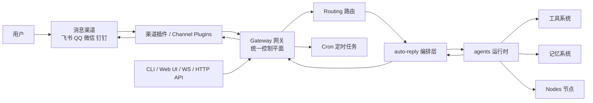
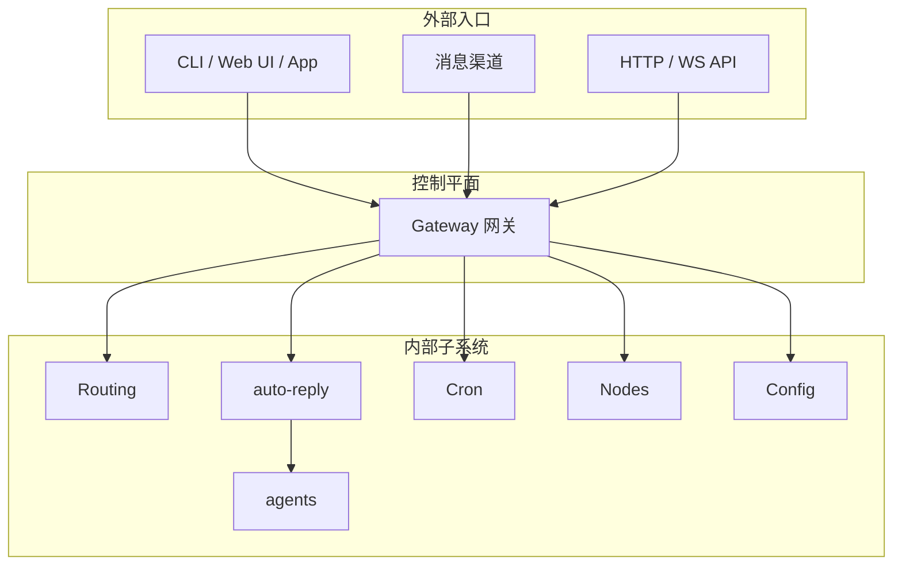
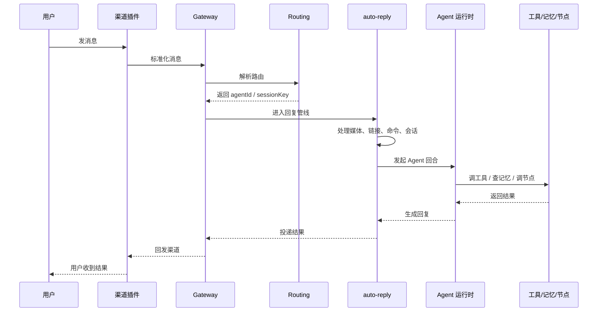
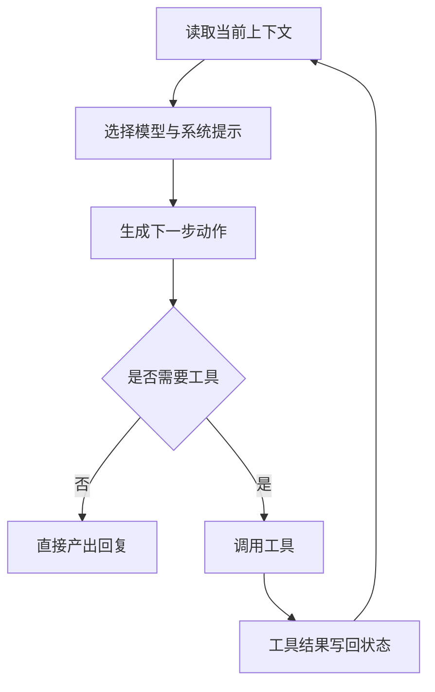
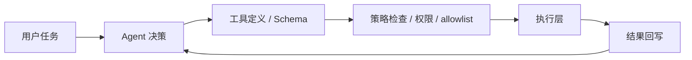
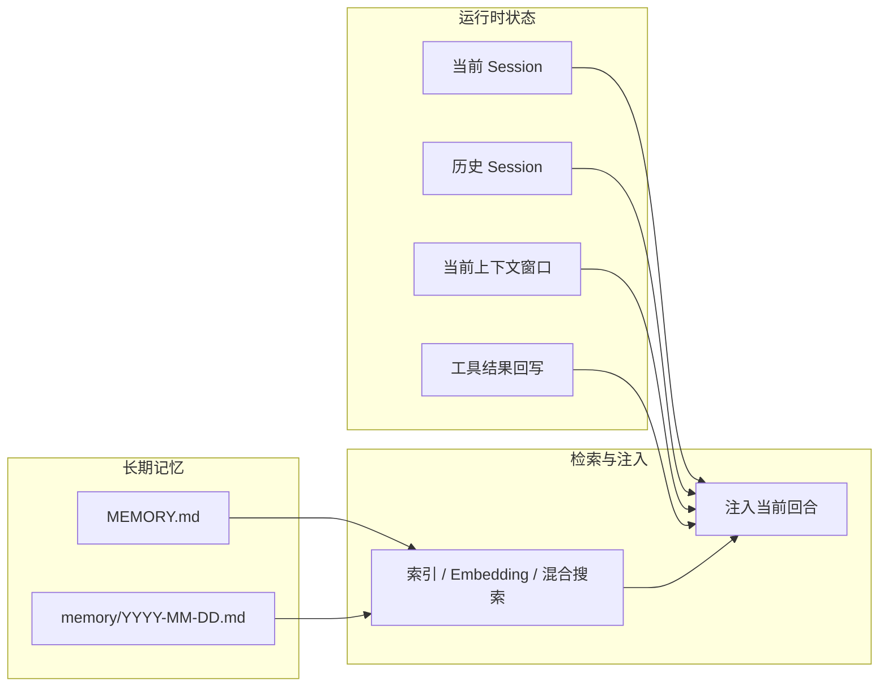
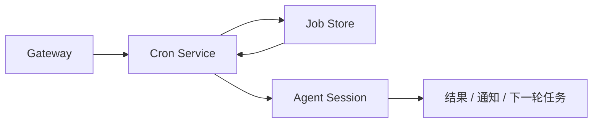
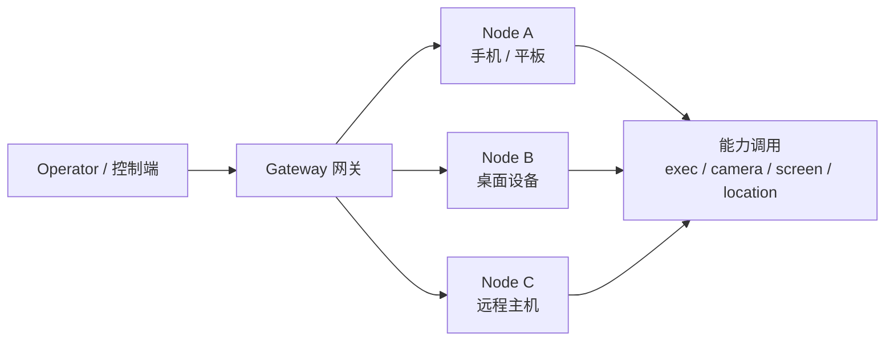
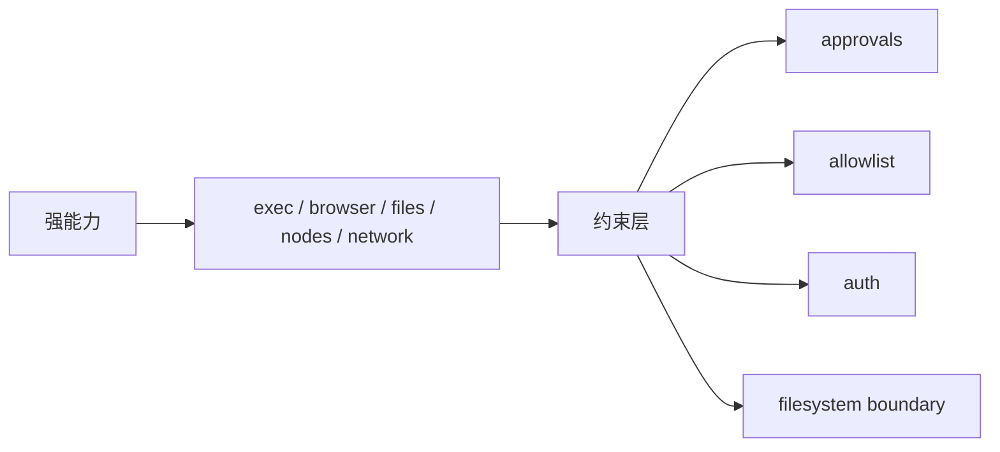

# OpenClaw 架构

如果只从表面看，OpenClaw 很像“一个能接消息、能调用模型、还能跑工具的聊天机器人”。

但从工程角度看，它更像一套完整的 **自托管 Agent 平台**：

- 外面接消息渠道
- 中间有统一控制平面
- 里面有 Agent 运行时、工具系统、记忆系统、定时任务、节点系统
- 周围还有认证、审批、配置热更新、健康检查等运维与安全机制

所以理解 OpenClaw 架构，重点不是盯着“它接了哪个模型”，而是看清楚：

**它如何把“消息入口 -> 任务编排 -> Agent 执行 -> 长期状态 -> 安全控制”组织成一个持续运行的系统。**

## 一句话先记住

> OpenClaw 的中心不是模型，而是 `Gateway 网关`。

模型只是执行能力的一部分。  
真正把渠道、会话、工具、记忆、定时任务、节点和 UI 串起来的，是 Gateway 这个统一控制平面。

## 一张图先看整体

你可以把这张图理解成 3 层：

- 最外层：消息渠道、客户端、外部调用入口
- 中间层：Gateway、路由、消息编排
- 内层：Agent 运行时、工具、记忆、Cron、节点

## 1. 为什么 Gateway 是整个系统的核心

从官方架构文档和官方中文文档看，Gateway 至少承担了下面几类职责：

- WebSocket JSON-RPC 控制平面
- HTTP 服务端，包括 OpenResponses / OpenAI 兼容接口
- 渠道插件接入点
- 节点管理
- Cron 调度器挂载点
- 配置热更新、健康检查、状态广播

这意味着 Gateway 不是“一个普通后端服务”，而更像 OpenClaw 的系统中枢。

这样做的好处很直接：

- CLI、Web UI、节点、消息渠道都走同一套系统主干
- 配置、认证、权限、状态同步更容易统一
- 扩展新能力时，不需要每个入口各做一套

### Gateway 在系统里的位置

把这张图看清楚以后，就比较容易理解：Gateway 更像总控台，而不是单纯的“转发服务”。

## 2. 渠道层：为什么消息平台只是入口，不是系统本体

OpenClaw 支持的真实渠道很多。为了更方便国内读者理解，你可以先把这一层类比成：

- 飞书
- QQ
- 微信
- 钉钉

关键点不在于具体接哪个 IM，而在于它们进入 OpenClaw 之后，会先经过一层 **Channel 插件抽象**。

这层抽象解决的是：

- 不同平台消息格式不一样
- 不同平台鉴权方式不一样
- 不同平台发送/回调机制不一样

插件层的作用，就是把这些平台差异压平，向上提供统一的消息语义。

你可以把它理解成：

- 下层是各个平台自己的 Bot API / SDK / Webhook
- 上层是 OpenClaw 自己统一的消息上下文

所以从架构角度看，消息渠道只是“入口设备”，不是系统本体。

## 3. 一条消息进入系统后，到底经历了什么

OpenClaw 的消息链路不是“收到消息 -> 调模型 -> 回答”这么简单。

可以压缩成下面这条链路：

这里最关键的，不是模型调用本身，而是中间这几步：

- 路由
- 会话恢复
- 媒体/链接理解
- 命令鉴权
- 状态初始化
- 回复投递

也就是说，真正的 OpenClaw 架构不是“一段强 Prompt”，而是一条完整的消息处理管线。

## 4. `auto-reply` 和 `agents` 为什么要分开

从代码结构和架构文档看，OpenClaw 明显把两层拆开了：

- `auto-reply`：偏消息编排层
- `agents`：偏 Agent 运行时

`auto-reply` 更关心这些问题：

- 这条消息属于哪个 Agent
- 属于哪个 sessionKey
- 是否需要重置会话
- 是否有媒体、链接、命令需要预处理
- 最终结果如何回发

`agents` 更关心这些问题：

- 这轮调用用哪个模型
- 系统提示词怎么拼
- 当前可用工具有哪些
- 是否需要技能、子 Agent、沙箱、浏览器
- 工具结果怎样继续推进下一轮

这个分层很重要，因为它意味着：

**OpenClaw 把“消息产品逻辑”和“Agent 执行逻辑”分开了。**

## 5. Agent 运行时：真正让 OpenClaw 能做事的地方

`agents` 模块是 OpenClaw 最像“Agent 框架”的部分。

根据架构设计，这一层至少包含：

- 模型选择与 fallback
- System Prompt 构建
- 工具注册
- 工具执行循环
- Skills 系统
- Subagent / 子 Agent
- 沙箱能力
- 浏览器能力
- 认证配置文件与 OAuth

这意味着 OpenClaw 的 Agent 并不是一段单纯的 Prompt，而是一个完整的执行运行时。

模型不是只回答一次，而是在运行时中反复经历：

1. 读上下文
2. 生成下一步动作
3. 调工具
4. 读结果
5. 继续下一轮

### 运行时的核心循环

这才是它“像 Agent”的根本原因。

## 6. 工具系统：为什么 OpenClaw 的能力边界这么大

OpenClaw 的能力边界大，不只是因为模型强，而是因为工具系统做得比较完整。

从架构上看，工具系统里既有：

- 命令执行
- 文件操作
- Web / HTTP
- 记忆搜索
- 浏览器能力
- 消息相关能力
- Cron 相关能力
- 节点相关能力

也有相应的：

- Schema 规范化
- 策略管道
- 调用 API
- 插件扩展

可以这样理解：

- 工具定义层：告诉模型有哪些能力
- 策略层：决定哪些能力能用、怎么用
- 执行层：真正去调用本地、远程或系统资源

### 工具调用链路

这也是 OpenClaw 能从“对话”走向“执行”的关键。

## 7. 记忆系统：为什么它更像“双源记忆”

OpenClaw 的记忆不是单一来源，而是至少包含两类内容。

### 第一类：文件化的持久记忆

例如：

- `MEMORY.md`
- `memory/YYYY-MM-DD.md`

这类记忆的特点是：

- 在文件系统中可见
- 可以被人直接阅读和修改
- 更适合存长期事实、偏好、经验、每日记录

可以把这套设计概括成“文件即真相”：文件负责长期保存，系统负责索引、搜索和注入。

### 第二类：会话与上下文相关状态

另一部分信息并不是长期写进 `MEMORY.md`，而是来自：

- 当前 session
- 历史 session
- 当前上下文窗口
- 工具结果回写

这类内容更偏“运行时状态”。

### 双源记忆结构图

用这张图去理解就很清楚了：OpenClaw 的“记忆”不是单一文件，也不是单一数据库，而是长期文件记忆和运行时状态共同组成的。

## 8. 记忆搜索为什么不是简单全文检索

OpenClaw 的记忆搜索不是只做字符串匹配，而是混合了：

- 文件内容
- 语义 Embedding
- 向量相似度
- 多样性重排
- 时间衰减或近期优先

这样做的目的很直接：

- 既保留“精确命中”能力
- 又保留“语义近似”能力
- 还能避免结果过于重复

所以从架构角度看，OpenClaw 的记忆系统不是“存起来就完了”，而是：

**文件负责持久化，索引和检索负责可用性。**

## 9. Cron：为什么 OpenClaw 不只是被动回复

如果一个系统只能“你发一句，它回一句”，那它更像聊天应用。

OpenClaw 之所以更像平台，一个原因就是它把 `Cron` 做成了正式子系统。

根据架构设计，Cron 至少包含：

- 一次性任务
- 固定间隔任务
- 标准 cron 表达式
- 任务持久化
- 任务恢复
- 超时与执行保护
- 会话清理

这意味着系统可以做的不是只有“现在回答你”，还包括：

- 3 分钟后再检查一次
- 每天上午 9 点执行一次
- 每周同步某类任务

### Cron 在系统中的作用

真正能把“主动性”落到工程里的，往往就离不开 Cron 这种子系统。

## 10. Nodes：为什么 OpenClaw 能从单机走向多设备

当执行目标选择到 `node` 时，Gateway 可以把对应的调用转发到节点主机。

这意味着 OpenClaw 的执行层不一定只发生在当前这台机器上。

你可以把 Nodes 理解成：

- 被 Gateway 管理的一组远程设备或伴侣应用
- 每个节点暴露自己允许的能力
- Gateway 负责配对、鉴权、唤醒、调用和事件回传

### Nodes 在系统里的位置

这样看就更容易理解：Gateway 负责统一协调，Node 负责暴露各自设备上的实际能力。

## 11. 配置系统：为什么 OpenClaw 不像写死的机器人

`config` 模块在 OpenClaw 里非常基础，几乎所有模块都依赖它。

配置系统至少决定：

- Agent 定义
- 模型与 provider
- 工具策略
- 工作区
- 心跳和 compaction 策略
- Gateway 的网络与认证方式
- Channels / Nodes / Cron 的行为

还能确认到几件具体事实：

- 配置主文件位于 `~/.openclaw/openclaw.json`
- 使用 JSON5
- 支持 schema 校验
- 支持 `$include`
- 支持环境变量替换
- 支持 Gateway 热重载

这意味着：

**OpenClaw 尽量把系统行为配置化，而不是把所有变化写死在代码里。**

## 12. 安全模型：为什么强能力一定要配强约束

OpenClaw 这类系统最危险的地方，不在“它能聊天”，而在它能执行外部动作。

比如：

- 执行命令
- 读写文件
- 调浏览器
- 调远程节点
- 访问网络

所以系统里必须有：

- `approvals`
- allowlist
- 鉴权模式
- SSRF 防护
- 文件系统权限收紧
- 节点配对与权限控制

### 能力与约束的对应关系

这说明 OpenClaw 的安全不是“额外加一个提示词”，而是进了主架构。

## 13. 这套架构最值得学的 5 个点

如果你不是要立刻改源码，而是把 OpenClaw 当作一个学习样本，最值得带走的是下面 5 个判断：

### 1. 中心一定要明确

OpenClaw 很清楚地把 Gateway 放成了中心。  
这比“每个入口自己接模型”更稳定，也更像平台设计。

### 2. 消息处理和 Agent 执行要分层

`auto-reply` 解决的是编排问题，`agents` 解决的是运行时问题。  
这让系统结构明显更清楚。

### 3. 工具要进入正式框架

不是“随便挂几个函数”就叫工具系统。  
真正的平台需要定义、策略、执行、权限、回写完整闭环。

### 4. 记忆不能只靠上下文窗口

OpenClaw 的文件化长期记忆 + 会话/上下文状态 + 检索索引，是很典型的工程化方案。

### 5. 安全必须属于主架构

审批、allowlist、节点权限、文件系统边界，这些不是补丁，而是主结构。

## 小结

OpenClaw 的架构可以压缩成一句话：

> 它是一套以 `Gateway 网关` 为中心，围绕消息渠道、路由编排、Agent 运行时、双源记忆、Cron、Nodes 与安全控制组织起来的自托管 Agent 平台。

如果再拆成更容易记住的版本，就是：

- Gateway 是统一控制平面
- Channels 负责接入外部世界
- auto-reply 负责编排消息
- agents 负责运行时执行
- Memory / Cron / Nodes 负责长期能力
- approvals / allowlist / auth 负责把能力关进边界里

当你把这几点看清楚后，OpenClaw 在你眼里就不再只是“一个会聊天的大龙虾”，而更像一套完整的 Agent 平台骨架。

## 参考资料

- [OpenClaw 官方架构文档（GitHub）](https://github.com/mudrii/openclaw-docs/blob/main/ARCHITECTURE.md)
- [OpenClaw 官方中文文档](https://docs.openclaw.ai/zh-CN)
- [Gateway 网关协议 - OpenClaw](https://docs.openclaw.ai/zh-CN/gateway/protocol)
- [配置 - OpenClaw](https://docs.openclaw.ai/zh-CN/gateway/configuration)
- [节点 - OpenClaw](https://docs.openclaw.ai/zh-CN/nodes)
- [approvals - OpenClaw](https://docs.openclaw.ai/zh-CN/cli/approvals)
- [OpenResponses API - OpenClaw](https://docs.openclaw.ai/zh-CN/gateway/openresponses-http-api)
- [玩转OpenClaw，你需要了解的：核心架构、运作原理、Agent部署步骤](https://mp.weixin.qq.com/s/Q0CC0p5e-DQEYEk5ErQB1Q)
- [深入理解OpenClaw技术架构与实现原理（上）](https://mp.weixin.qq.com/s/wVcItgqsCiwl9-PZ56z27w)
- [深入理解OpenClaw技术架构与实现原理（下）](https://mp.weixin.qq.com/s/FUJEofqbK7vX-J64UX8Nkg)
