---
title: RAG 教程目录
summary: 按章节、主题模块和具体问题组织的 RAG 教程结构。
---

# RAG 教程目录

这部分会从整体认知、数据准备、检索设计、上下文构造、评测调优到生产落地，系统讲清楚 RAG 的关键问题与实践方法。

## 目录导图

先看一张树形总览图，可以更快理解这一栏是怎么按主题分层展开的。

```mermaid
flowchart TB
  ROOT["RAG 教程目录"]

  ROOT --> A["认知层"]
  ROOT --> B["数据与索引层"]
  ROOT --> C["检索层"]
  ROOT --> D["生成层"]
  ROOT --> E["评测与优化层"]
  ROOT --> F["工程与升级层"]
  ROOT --> G["原则总结层"]

  A --> A1["第 1 章<br/>RAG 全景图与核心认知"]
  A1 --> A11["1.1 定义与定位"]
  A1 --> A12["1.2 系统基本组成"]
  A1 --> A13["1.3 常见误解"]

  B --> B1["第 2 章<br/>数据接入与知识库准备"]
  B1 --> B11["2.1 为什么先做数据"]
  B1 --> B12["2.2 数据源类型与接入"]
  B1 --> B13["2.3 清洗与标准化"]
  B1 --> B14["2.4 权限、时效与治理"]
  B --> B2["第 3 章<br/>Chunk、Metadata 与索引前设计"]
  B2 --> B21["3.1 为什么必须切块"]
  B2 --> B22["3.2 Chunk 切分策略"]
  B2 --> B23["3.3 Metadata 设计"]
  B2 --> B24["3.4 检索块与生成块"]
  B --> B3["第 4 章<br/>索引构建与知识库更新"]
  B3 --> B31["4.1 索引在做什么"]
  B3 --> B32["4.2 索引构建思路"]
  B3 --> B33["4.3 更新与索引维护"]

  C --> C1["第 5 章<br/>Embedding、BM25 与混合检索"]
  C1 --> C11["5.1 Embedding 原理"]
  C1 --> C12["5.2 向量检索"]
  C1 --> C13["5.3 BM25"]
  C1 --> C14["5.4 混合检索与多路召回"]
  C --> C2["第 6 章<br/>查询理解与检索链路设计"]
  C2 --> C21["6.1 为什么不能直接检索"]
  C2 --> C22["6.2 Rewrite 与 Expansion"]
  C2 --> C23["6.3 筛选与路由"]
  C2 --> C24["6.4 大文档与复杂场景"]
  C --> C3["第 7 章<br/>重排、排序与结果精选"]
  C3 --> C31["7.1 为什么召回后还答不好"]
  C3 --> C32["7.2 Rerank 的作用"]
  C3 --> C33["7.3 结果组织与精选"]

  D --> D1["第 8 章<br/>上下文构造与答案生成"]
  D1 --> D11["8.1 上下文构造"]
  D1 --> D12["8.2 任务化上下文组织"]
  D1 --> D13["8.3 长上下文问题"]
  D1 --> D14["8.4 RAG Prompt 设计"]
  D1 --> D15["8.5 生成阶段错误"]

  E --> E1["第 9 章<br/>RAG 评测体系与错误归因"]
  E1 --> E11["9.1 不能只看最终回答"]
  E1 --> E12["9.2 检索层评测"]
  E1 --> E13["9.3 生成层评测"]
  E1 --> E14["9.4 评测集构建"]
  E1 --> E15["9.5 错误分型与归因"]
  E --> E2["第 10 章<br/>RAG 调优方法论"]
  E2 --> E21["10.1 效果不好先查哪里"]
  E2 --> E22["10.2 质量、成本平衡"]
  E2 --> E23["10.3 常见优化抓手"]
  E2 --> E24["10.4 调优闭环"]

  F --> F1["第 11 章<br/>生产级 RAG 工程实践"]
  F1 --> F11["11.1 上线必备能力"]
  F1 --> F12["11.2 性能、缓存与并发"]
  F1 --> F13["11.3 日志、观测与排障"]
  F1 --> F14["11.4 发布与风险控制"]
  F --> F2["第 12 章<br/>高级 RAG 形态与升级路径"]
  F2 --> F21["12.1 检索不稳"]
  F2 --> F22["12.2 大文档与复杂结构"]
  F2 --> F23["12.3 检索质量不稳定"]
  F2 --> F24["12.4 任务不只是问答"]
  F2 --> F25["12.5 更复杂的数据形态"]
  F --> F3["第 13 章<br/>从 0 到 1 搭一个最小可用 RAG"]
  F3 --> F31["13.1 最小 Demo"]
  F3 --> F32["13.2 从 Demo 到生产"]
  F3 --> F33["13.3 务实落地顺序"]

  G --> G1["第 14 章<br/>常见误区与设计原则总结"]
  G1 --> G11["14.1 常见误区"]
  G1 --> G12["14.2 实用设计原则"]
```

## 章节目录

- [第 1 章 RAG 全景图与核心认知](./ch01-rag-overview/)
- [第 2 章 数据接入与知识库准备](./ch02-data-and-knowledge-base/)
- [第 3 章 Chunk、Metadata 与索引前设计](./ch03-chunk-metadata-and-pre-index-design/)
- [第 4 章 索引构建与知识库更新](./ch04-indexing-and-updates/)
- [第 5 章 Embedding、BM25 与混合检索](./ch05-embedding-bm25-and-hybrid-retrieval/)
- [第 6 章 查询理解与检索链路设计](./ch06-query-understanding-and-retrieval-pipeline/)
- [第 7 章 重排、排序与结果精选](./ch07-reranking-and-result-selection/)
- [第 8 章 上下文构造与答案生成](./ch08-context-construction-and-generation/)
- [第 9 章 RAG 评测体系与错误归因](./ch09-evaluation-and-error-analysis/)
- [第 10 章 RAG 调优方法论](./ch10-optimization-methodology/)
- [第 11 章 生产级 RAG 工程实践](./ch11-production-engineering/)
- [第 12 章 高级 RAG 形态与升级路径](./ch12-advanced-rag-and-upgrades/)
- [第 13 章 从 0 到 1 搭一个最小可用 RAG](./ch13-build-a-minimum-viable-rag/)
- [第 14 章 常见误区与设计原则总结](./ch14-misconceptions-and-principles/)
