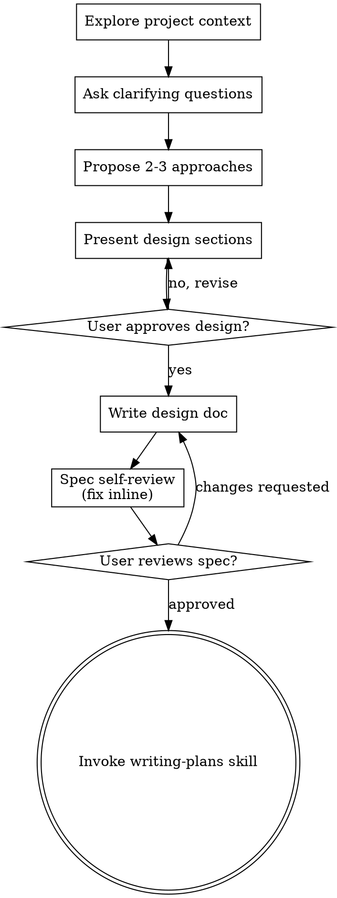

# brainstorming

> 本文为 [Superpowers](https://github.com/obra/superpowers/tree/main/skills/brainstorming) 原 skill 文件夹的中文翻译，基于 MIT 协议。原文路径：`skills/brainstorming/`。

---

**Skill 元数据**

| 字段 | 内容 |
|------|------|
| 名称 | brainstorming |
| 描述 | 在任何创意工作之前必须使用——创建功能、构建组件、添加功能或修改行为时，先通过协作对话澄清用户意图、探索需求和设计，再进入实现 |

---

# 将想法头脑风暴为设计

通过自然的协作对话，帮助将想法转化为完整的设计和规格说明。

从理解当前项目上下文开始，然后逐一提问来细化想法。当你理解了要构建什么之后，呈现设计并获得用户批准。

::: danger ⚠️ HARD GATE
在呈现设计并获得用户批准之前，不要调用任何实现 skill、编写任何代码、搭建任何项目或采取任何实现行动。这适用于每个项目，无论感知上有多简单。
:::

## 反模式："这太简单了不需要设计"

每个项目都要走这个流程。一个待办列表、一个单函数工具、一个配置修改——全部都是。「简单」项目恰恰是未经审视的假设导致最多浪费工作的地方。设计可以很短（对真正简单的项目就几句话），但你必须呈现它并获得批准。

## 检查清单

你必须为以下每一项创建任务并按顺序完成：

1. **探索项目上下文** — 检查文件、文档、最近的提交
2. **适时提供视觉伴侣** — 不要提前提供。当某个问题用展示比描述更清楚时，才在那时提供（作为单独的一条消息）；用户同意后浏览器标签页会为你打开。如果始终没有视觉问题出现，就不要提供。参见下文的视觉伴侣部分。
3. **提出澄清问题** — 一次一个，理解目的/约束/成功标准
4. **提出 2-3 种方案** — 附带权衡分析和你的推荐
5. **呈现设计** — 按复杂度缩放各部分，每个部分后获得用户批准
6. **编写设计文档** — 保存到 `docs/superpowers/specs/YYYY-MM-DD-<topic>-design.md` 并提交
7. **规格自审** — 快速内联检查占位符、矛盾、歧义、范围（见下文）
8. **用户审查书面规格** — 在继续之前请用户审查规格文件
9. **过渡到实现** — 调用 writing-plans skill 创建实现计划

## 流程图



**终态是调用 writing-plans。** 不要调用 frontend-design、mcp-builder 或任何其他实现 skill。brainstorming 之后你调用的唯一 skill 是 writing-plans。

## 过程

**理解想法：**

- 先检查当前项目状态（文件、文档、最近的提交）
- 在提出详细问题之前，评估范围：如果请求描述了多个独立子系统（例如，「构建一个包含聊天、文件存储、计费和分析的平台」），立即标记。不要花时间在需要先分解的项目上细化细节。
- 如果项目太大无法用单个规格说明覆盖，帮助用户分解为子项目：哪些是独立的部分，它们如何关联，应该以什么顺序构建？然后通过正常的设计流程对第一个子项目进行头脑风暴。每个子项目都有自己的规格 → 计划 → 实现循环。
- 对于范围合适的项目，逐一提问来细化想法
- 尽可能使用多选题，但开放式问题也可以
- 每条消息只问一个问题 — 如果某个主题需要更多探索，拆分为多个问题
- 聚焦于理解：目的、约束、成功标准

**探索方案：**

- 提出 2-3 种不同方案及权衡分析
- 以对话方式呈现选项，附上你的推荐和理由
- 先展示你推荐的选项并解释原因

**呈现设计：**

- 一旦你认为自己理解了要构建什么，呈现设计
- 按复杂度缩放各部分：如果简单就几句话，如果复杂就 200-300 字
- 每个部分后询问目前看起来是否正确
- 覆盖：架构、组件、数据流、错误处理、测试
- 如果有说不通的地方，准备好回过头来澄清

**为隔离和清晰而设计：**

- 将系统拆分为更小的单元，每个单元有单一明确目的，通过定义良好的接口通信，并且可以独立理解和测试
- 对于每个单元，你应该能回答：它做什么，你怎么使用它，它依赖什么？
- 别人能否不读内部实现就理解一个单元做什么？你能否在不破坏调用方的情况下修改内部实现？如果不能，边界需要再推敲。
- 更小的、边界清晰的单元也更容易让你工作 — 你对能一次性放入上下文的代码推理得更好，当文件聚焦时你的编辑也更可靠。当文件变得很大时，这通常是它在做太多事情的信号。

**在现有代码库中工作：**

- 在提出修改之前先探索当前结构。遵循现有模式。
- 当现有代码存在影响当前工作的问题（例如，一个变得太大的文件，不清晰的边界，纠缠的职责），将针对性改进作为设计的一部分 — 就像一个好开发者在他们工作的代码中做改进一样。
- 不要提出不相关的重构。专注于服务于当前目标的内容。

## 设计之后

**文档：**

- 将验证通过的设计（规格）写入 `docs/superpowers/specs/YYYY-MM-DD-<topic>-design.md`
  - （用户对规格位置的偏好覆盖此默认值）
- 使用 elements-of-style:writing-clearly-and-concisely skill（如果可用）
- 将设计文档提交到 git

**规格自审：**
编写规格文档后，用新的眼光审视它：

1. **占位符扫描：** 有没有「TBD」、「TODO」、未完成的部分或模糊的需求？修复它们。
2. **内部一致性：** 各部分之间是否有矛盾？架构是否与功能描述匹配？
3. **范围检查：** 这是否足够聚焦于单个实现计划，还是需要分解？
4. **歧义检查：** 是否有任何需求可以被两种不同方式解读？如果有，选择一种并明确写出来。

内联修复任何问题。不需要重新审查 — 修复后继续前进。

**用户审查门：**
规格审查循环通过后，请用户在继续之前审查书面规格：

> 「规格已写入并提交到 `<path>`。请审查它，在开始编写实现计划之前，让我知道你是否想做任何修改。」

等待用户的回复。如果他们要求修改，进行修改并重新运行规格审查循环。仅在用户批准后才继续。

**实现：**

- 调用 writing-plans skill 创建详细的实现计划
- 不要调用任何其他 skill。writing-plans 是下一步。

## 关键原则

- **一次一个问题** — 不要用多个问题压倒对方
- **优先使用多选题** — 可能时比开放式问题更容易回答
- **严格遵循 YAGNI** — 从所有设计中移除不必要的功能
- **探索替代方案** — 在确定之前总是提出 2-3 种方案
- **增量验证** — 呈现设计，在继续之前获得批准
- **保持灵活** — 当有说不通的地方，回过头来澄清

## 视觉伴侣

基于浏览器的伴侣，用于在头脑风暴期间展示模型图、图表和视觉选项。作为工具可用——不是一种模式。接受伴侣意味着它可用于受益于视觉处理的问题；这并不意味着每个问题都通过浏览器处理。

**适时提供（just-in-time）：** 不要提前提供。等到某个问题用展示比描述更清楚时——真正的模型图、布局或图表问题，而不仅仅是涉及 UI 话题——才在那时提供，作为单独的一条消息：
> "接下来这部分如果我给你看可能更容易理解——我可以在浏览器标签页中制作模型图、图表和对比。这个功能还很新，可能会消耗较多 token。想试试吗？我会为你打开它。"

**此提议必须是单独的一条消息。** 只包含提议——不含澄清问题、总结或任何其他内容。等待用户的回复。如果他们同意，使用 `--open` 启动服务器，让浏览器自动打开第一个页面。如果他们拒绝，继续纯文本，除非他们主动提起，否则不要再提供。

**逐问题决策：** 即使用户接受了，也要针对每个问题决定是使用浏览器还是终端。判断标准：**用户通过看到它是否比读到它更容易理解？**

- **使用浏览器** 处理本身是视觉的内容——模型图、线框图、布局对比、架构图、并排视觉设计
- **使用终端** 处理文本内容——需求问题、概念选择、权衡列表、A/B/C/D 文本选项、范围决策

关于 UI 主题的问题不自动就是视觉问题。"在这个上下文中 personality 是什么意思？"是概念性问题——使用终端。"哪种向导布局更好？"是视觉问题——使用浏览器。

如果他们同意使用伴侣，在继续之前阅读详细指南：
`skills/brainstorming/visual-companion.md`

---

## 附录 A：视觉伴侣指南

> 翻译自 `skills/brainstorming/visual-companion.md`

基于浏览器的视觉头脑风暴伴侣，用于展示模型图、图表和选项。

### 何时使用

逐问题决策，不是逐会话决策。判断标准：**用户通过看到它是否比读到它更容易理解？**

**使用浏览器** 当内容本身是视觉的：

- **UI 模型图** — 线框图、布局、导航结构、组件设计
- **架构图** — 系统组件、数据流、关系图
- **并排视觉对比** — 比较两种布局、两种配色方案、两种设计方向
- **设计打磨** — 当问题关于外观和感觉、间距、视觉层次时
- **空间关系** — 状态机、流程图、实体关系图

**使用终端** 当内容是文本或表格：

- **需求和范围问题** — 「X 是什么意思？」、「哪些功能在范围内？」
- **概念 A/B/C 选择** — 在用文字描述的方案之间做选择
- **权衡列表** — 优缺点、对比表
- **技术决策** — API 设计、数据建模、架构方案选择
- **澄清问题** — 答案是文字而非视觉偏好的任何内容

关于 UI 主题的问题不自动就是视觉问题。「你想要什么样的向导？」是概念性的 — 使用终端。「这些向导布局哪个感觉对？」是视觉的 — 使用浏览器。

### 工作原理

服务器监视目录中的 HTML 文件并将最新的文件提供给浏览器。你将 HTML 内容写入 `screen_dir`，用户在浏览器中看到它并可以点击选择选项。选择记录到 `state_dir/events`，你在下一轮读取它。

**内容片段 vs 完整文档：** 如果你的 HTML 文件以 `<!DOCTYPE` 或 `<html` 开头，服务器原样提供（只注入辅助脚本）。否则，服务器自动将你的内容包装在框架模板中 — 添加头部、CSS 主题、选择指示器和所有交互基础设施。**默认写内容片段。** 只在你需要完全控制页面时才写完整文档。

### 启动会话

```bash
# 启动带持久化的服务器（模型图保存到项目）
scripts/start-server.sh --project-dir /path/to/project

# 返回：{"type":"server-started","port":52341,"url":"http://localhost:52341",
#           "screen_dir":"/path/to/project/.superpowers/brainstorm/12345-1706000000/content",
#           "state_dir":"/path/to/project/.superpowers/brainstorm/12345-1706000000/state"}
```

保存响应中的 `screen_dir` 和 `state_dir`。告诉用户打开 URL。

**查找连接信息：** 服务器将其启动 JSON 写入 `$STATE_DIR/server-info`。如果你在后台启动了服务器但没有捕获 stdout，读取该文件以获取 URL 和端口。使用 `--project-dir` 时，检查 `&lt;project&gt;/.superpowers/brainstorm/` 获取会话目录。

**注意：** 将项目根目录作为 `--project-dir` 传入，这样模型图会持久化在 `.superpowers/brainstorm/` 中并在服务器重启后保留。没有它，文件会进入 `/tmp` 并在停止时被清理。提醒用户如果还没有的话将 `.superpowers/` 添加到 `.gitignore`。

**按平台启动服务器：**

**Claude Code（macOS / Linux）：**
```bash
# 默认模式即可 — 脚本自行将服务器放到后台
scripts/start-server.sh --project-dir /path/to/project
```

**Claude Code（Windows）：**
```bash
# Windows 自动检测并使用前台模式，这会阻塞工具调用。
# 在 Bash 工具调用上设置 run_in_background: true，使服务器在
# 对话轮次之间保持存活。
scripts/start-server.sh --project-dir /path/to/project
```
通过 Bash 工具调用时，设置 `run_in_background: true`。然后在下一轮读取 `$STATE_DIR/server-info` 获取 URL 和端口。

**Codex：**
```bash
# Codex 会回收后台进程。脚本自动检测 CODEX_CI 并
# 切换到前台模式。正常运行即可 — 不需要额外标志。
scripts/start-server.sh --project-dir /path/to/project
```

**Gemini CLI：**
```bash
# 使用 --foreground 并在 shell 工具调用上设置 is_background: true
# 使进程在轮次之间保持存活
scripts/start-server.sh --project-dir /path/to/project --foreground
```

**其他环境：** 服务器必须在后台跨对话轮次持续运行。如果你的环境会回收分离的进程，使用 `--foreground` 并通过你的平台的后台执行机制启动命令。

如果 URL 从浏览器无法访问（在远程/容器化设置中常见），绑定非回环地址：

```bash
scripts/start-server.sh \
  --project-dir /path/to/project \
  --host 0.0.0.0 \
  --url-host localhost
```

使用 `--url-host` 控制返回的 URL JSON 中打印的主机名。

### 循环

1. **检查服务器是否存活**，然后**将 HTML 写入** `screen_dir` 中的新文件：
   - 每次写入前，检查 `$STATE_DIR/server-info` 是否存在。如果不存在（或 `$STATE_DIR/server-stopped` 存在），说明服务器已关闭 — 在继续之前用 `start-server.sh` 重启它。服务器在 30 分钟不活动后自动退出。
   - 使用语义化文件名：`platform.html`、`visual-style.html`、`layout.html`
   - **永远不要重用文件名** — 每个屏幕用一个新文件
   - 使用 Write 工具 — **永远不要用 cat/heredoc**（会将噪音输出到终端）
   - 服务器自动提供最新文件

2. **告诉用户期望什么并结束你的轮次：**
   - 提醒他们 URL（每一步都要，不只是第一次）
   - 给出屏幕内容的简短文本摘要（例如，「展示首页的 3 种布局选项」）
   - 请他们在终端中回复：「看看并告诉我你的想法。如果你想选择一个选项，可以点击。」

3. **在下一轮** — 用户在终端回复后：
   - 读取 `$STATE_DIR/events`（如果存在）— 这包含用户的浏览器交互（点击、选择）作为 JSON 行
   - 与用户的终端文本合并以获取完整画面
   - 终端消息是主要反馈；`state_dir/events` 提供结构化交互数据

4. **迭代或前进** — 如果反馈改变了当前屏幕，写一个新文件（例如 `layout-v2.html`）。只在当前步骤验证后才进入下一个问题。

5. **返回终端时卸载** — 当下一步不需要浏览器时（例如澄清问题、权衡讨论），推送一个等待屏幕以清除过时内容：

   ```html
   <!-- 文件名：waiting.html（或 waiting-2.html 等）-->
   <div style="display:flex;align-items:center;justify-content:center;min-height:60vh">
     <p class="subtitle">在终端中继续...</p>
   </div>
   ```

   这防止用户在对话已经继续时盯着一个已解决的选择。当下一个视觉问题出现时，像往常一样推送新的内容文件。

6. 重复直到完成。

### 编写内容片段

只写放入页面的内容。服务器会自动将其包装在框架模板中（头部、主题 CSS、选择指示器和所有交互基础设施）。

**最简示例：**

```html
<h2>哪种布局更好？</h2>
<p class="subtitle">考虑可读性和视觉层次</p>

<div class="options">
  <div class="option" data-choice="a" onclick="toggleSelect(this)">
    <div class="letter">A</div>
    <div class="content">
      <h3>单列</h3>
      <p>干净、专注的阅读体验</p>
    </div>
  </div>
  <div class="option" data-choice="b" onclick="toggleSelect(this)">
    <div class="letter">B</div>
    <div class="content">
      <h3>双列</h3>
      <p>侧边栏导航加主内容</p>
    </div>
  </div>
</div>
```

就是这样。不需要 `&lt;html&gt;`、不需要 CSS、不需要 `&lt;script&gt;` 标签。服务器提供所有这些。

### 可用 CSS 类

框架模板为你的内容提供这些 CSS 类：

#### 选项（A/B/C 选择）

```html
<div class="options">
  <div class="option" data-choice="a" onclick="toggleSelect(this)">
    <div class="letter">A</div>
    <div class="content">
      <h3>标题</h3>
      <p>描述</p>
    </div>
  </div>
</div>
```

**多选：** 在容器上添加 `data-multiselect` 让用户选择多个选项。每次点击切换该项目。指示器栏显示数量。

```html
<div class="options" data-multiselect>
  <!-- 同样的选项标记 — 用户可以选择/取消选择多个 -->
</div>
```

#### 卡片（视觉设计）

```html
<div class="cards">
  <div class="card" data-choice="design1" onclick="toggleSelect(this)">
    <div class="card-image"><!-- 模型内容 --></div>
    <div class="card-body">
      <h3>名称</h3>
      <p>描述</p>
    </div>
  </div>
</div>
```

#### 模型容器

```html
<div class="mockup">
  <div class="mockup-header">预览：仪表板布局</div>
  <div class="mockup-body"><!-- 你的模型 HTML --></div>
</div>
```

#### 分割视图（并排）

```html
<div class="split">
  <div class="mockup"><!-- 左侧 --></div>
  <div class="mockup"><!-- 右侧 --></div>
</div>
```

#### 优缺点

```html
<div class="pros-cons">
  <div class="pros"><h4>优点</h4><ul><li>收益</li></ul></div>
  <div class="cons"><h4>缺点</h4><ul><li>缺点</li></ul></div>
</div>
```

#### 模型元素（线框构建块）

```html
<div class="mock-nav">Logo | 首页 | 关于 | 联系</div>
<div style="display: flex;">
  <div class="mock-sidebar">导航</div>
  <div class="mock-content">主内容区域</div>
</div>
<button class="mock-button">操作按钮</button>
<input class="mock-input" placeholder="输入框">
<div class="placeholder">占位区域</div>
```

#### 排版和节

- `h2` — 页面标题
- `h3` — 节标题
- `.subtitle` — 标题下方的辅助文本
- `.section` — 带底部边距的内容块
- `.label` — 小号大写标签文本

### 浏览器事件格式

当用户在浏览器中点击选项时，他们的交互被记录到 `$STATE_DIR/events`（每行一个 JSON 对象）。当你推送新屏幕时文件会自动清空。

```jsonl
{"type":"click","choice":"a","text":"选项 A - 简单布局","timestamp":1706000101}
{"type":"click","choice":"c","text":"选项 C - 复杂网格","timestamp":1706000108}
{"type":"click","choice":"b","text":"选项 B - 混合","timestamp":1706000115}
```

完整事件流显示用户的探索路径 — 他们可能在确定前点击多个选项。最后一个 `choice` 事件通常是最终选择，但点击的模式可能揭示值得询问的犹豫或偏好。

如果 `$STATE_DIR/events` 不存在，说明用户没有与浏览器交互 — 只使用他们的终端文本。

### 设计技巧

- **保真度与问题匹配** — 布局问题用线框图，打磨问题用精细图
- **在每个页面上解释问题** — 「哪种布局感觉更专业？」而不是仅仅「选一个」
- **在前进之前迭代** — 如果反馈改变了当前屏幕，写一个新版本
- **每屏最多 2-4 个选项**
- **重要时使用真实内容** — 对于摄影作品集，使用实际图片（Unsplash）。占位内容会掩盖设计问题。
- **保持模型图简单** — 专注于布局和结构，不是像素级完美设计

### 文件命名

- 使用语义化名称：`platform.html`、`visual-style.html`、`layout.html`
- 永远不要重用文件名 — 每个屏幕必须是新文件
- 迭代：添加版本后缀如 `layout-v2.html`、`layout-v3.html`
- 服务器按修改时间提供最新文件

### 清理

```bash
scripts/stop-server.sh $SESSION_DIR
```

如果会话使用了 `--project-dir`，模型图文件会持久化在 `.superpowers/brainstorm/` 中供以后参考。只有 `/tmp` 会话在停止时被删除。

### 参考

- 框架模板（CSS 参考）：`scripts/frame-template.html`
- 辅助脚本（客户端）：`scripts/helper.js`

---

## 附录 B：规格文档审查员提示词模板

> 翻译自 `skills/brainstorming/spec-document-reviewer-prompt.md`

在派发规格文档审查员子代理时使用此模板。

**目的：** 验证规格是否完整、一致，并准备好进行实现计划。

**在以下操作之后派发：** 规格文档已写入 docs/superpowers/specs/

```
Task tool (general-purpose):
  description: "审查规格文档"
  prompt: |
    你是规格文档审查员。验证此规格是否完整并准备好进行计划。

    **要审查的规格：** [SPEC_FILE_PATH]

    ## 检查什么

    | 类别 | 查找什么 |
    |------|----------|
    | 完整性 | TODO、占位符、「TBD」、未完成的部分 |
    | 一致性 | 内部矛盾、冲突的需求 |
    | 清晰度 | 足以导致某人构建错误事物的模糊需求 |
    | 范围 | 足够聚焦于单个计划 — 不覆盖多个独立子系统 |
    | YAGNI | 未请求的功能、过度工程 |

    ## 校准

    **只标记会在实现计划中导致实际问题的事项。**
    缺失的部分、矛盾、或足够模糊以至于可以被两种不同方式解读的需求 — 这些是问题。
    措辞改进、风格偏好和「部分不如其他部分详细」不是问题。

    除非存在会导致有缺陷计划的严重缺口，否则批准。

    ## 输出格式

    ## 规格审查

    **状态：** 已批准 | 发现问题

    **问题（如有）：**
    - [第 X 节]：[具体问题] - [为什么对计划有影响]

    **建议（参考性质，不阻止批准）：**
    - [改进建议]
```

**审查员返回：** 状态、问题（如有）、建议

---

## 备注：Brainstorm Server

原 skill 文件夹包含 Brainstorm Server 脚本（`scripts/` 目录），用于提供可视化头脑风暴辅助界面。代码保留原文，此处仅说明功能：

- `server.cjs` — 零依赖 Node.js WebSocket 服务器，监听目录变化并推送最新 HTML 到浏览器
- `frame-template.html` — 可视化界面模板，包含 CSS 主题、选择指示器和交互基础设施
- `helper.js` — 客户端辅助脚本，处理选项点击和事件记录
- `start-server.sh` — 启动脚本，支持 `--project-dir`（持久化）、`--host`（绑定地址）、`--foreground`（前台模式）等选项
- `stop-server.sh` — 停止脚本，优雅关闭服务器进程，仅清理 `/tmp` 下的临时目录
