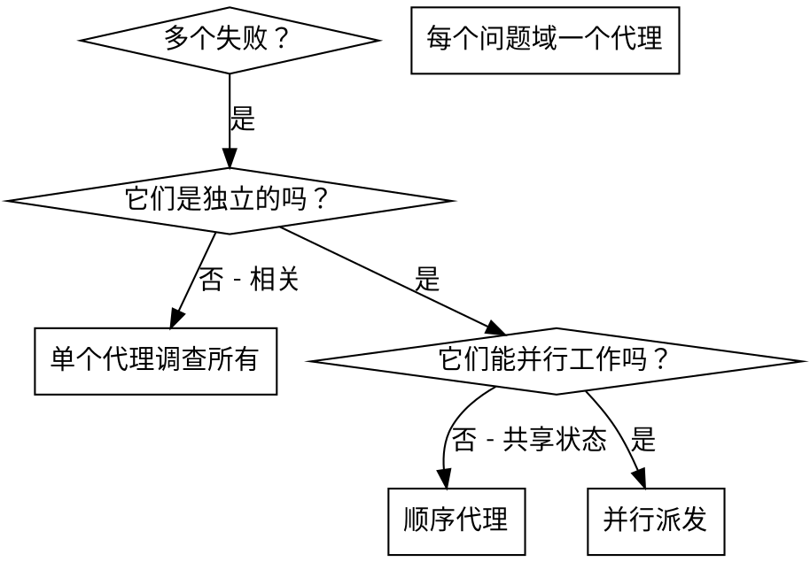

# dispatching-parallel-agents

> 本文为 [Superpowers](https://github.com/obra/superpowers/tree/main/skills/dispatching-parallel-agents) 原 skill 文件夹的中文翻译，基于 MIT 协议。原文路径：`skills/dispatching-parallel-agents/`。

---

**Skill 元数据**

| 字段 | 内容 |
|------|------|
| 名称 | dispatching-parallel-agents |
| 描述 | 在面对 2 个及以上无共享状态或顺序依赖的独立任务时使用 |

---

# 并行派发子代理

## 概述

你将任务委托给具有隔离上下文的专业代理。通过精确构造它们的指令和上下文，你确保它们保持专注并成功完成任务。它们绝不应继承你会话的上下文或历史——你精确构造它们需要的东西。这也保留了你自己的上下文用于协调工作。

当你有多个不相关的失败（不同测试文件、不同子系统、不同 bug）时，顺序调查它们会浪费时间。每个调查是独立的，可以并行进行。

**核心原则：** 为每个独立问题域派发一个代理。让它们并发工作。

## 何时使用



**使用时机：**
- 3+ 个测试文件因不同根因而失败
- 多个子系统独立损坏
- 每个问题可以在不需要其他上下文的情况下理解
- 调查之间没有共享状态

**不使用时机：**
- 失败是相关的（修复一个可能修复其他）
- 需要理解完整系统状态
- 代理会互相干扰

## 模式

### 1. 识别独立域

按损坏的内容对失败分组：
- 文件 A 测试：工具批准流程
- 文件 B 测试：批量完成行为
- 文件 C 测试：中止功能

每个域是独立的——修复工具批准不影响中止测试。

### 2. 创建聚焦的代理任务

每个代理获得：
- **特定范围：** 一个测试文件或子系统
- **清晰目标：** 让这些测试通过
- **约束：** 不要更改其他代码
- **预期输出：** 你发现和修复了什么的摘要

### 3. 并行派发

在同一次响应中发出所有三个子代理派发——它们并行运行：

```text
Subagent (general-purpose): "修复 agent-tool-abort.test.ts 失败"
Subagent (general-purpose): "修复 batch-completion-behavior.test.ts 失败"
Subagent (general-purpose): "修复 tool-approval-race-conditions.test.ts 失败"
# 所有三个并发运行。
```

一次响应中多个派发调用 = 并行执行。每个响应一个 = 顺序执行。

### 4. 审查和集成

当代理返回时：
- 阅读每个摘要
- 验证修复不冲突
- 运行完整测试套件
- 集成所有变更

## 代理提示结构

好的代理提示是：
1. **聚焦的** — 一个清晰的问题域
2. **自包含的** — 理解问题所需的所有上下文
3. **输出明确的** — 代理应该返回什么？

```markdown
修复 src/agents/agent-tool-abort.test.ts 中的 3 个失败测试：

1. "should abort tool with partial output capture" - 期望消息中包含 'interrupted at'
2. "should handle mixed completed and aborted tools" - 快速工具被中止而不是完成
3. "should properly track pendingToolCount" - 期望 3 个结果但得到 0

这些是时间/竞态条件问题。你的任务：

1. 阅读测试文件并理解每个测试验证什么
2. 识别根因——时间问题还是实际 bug？
3. 通过以下方式修复：
   - 用基于事件的等待替换任意超时
   - 如果发现中止实现中的 bug，修复它们
   - 如果测试的是变更后的行为，调整测试期望

不要只是增加超时——找到真正的问题。

返回：你发现和修复了什么的摘要。
```

## 常见错误

**❌ 太宽泛：** "修复所有测试"——代理迷失了
**✅ 具体：** "修复 agent-tool-abort.test.ts"——聚焦的范围

**❌ 没有上下文：** "修复竞态条件"——代理不知道在哪
**✅ 上下文：** 粘贴错误信息和测试名称

**❌ 没有约束：** 代理可能重构一切
**✅ 约束：** "不要更改生产代码"或"只修复测试"

**❌ 输出含糊：** "修复它"——你不知道什么变了
**✅ 具体：** "返回根因和变更的摘要"

## 何时不要使用

**相关失败：** 修复一个可能修复其他——先一起调查
**需要完整上下文：** 理解需要看到整个系统
**探索性调试：** 你还不知道什么坏了
**共享状态：** 代理会干扰（编辑相同文件，使用相同资源）

## 会话中的真实示例

**场景：** 重大重构后 6 个测试失败，跨 3 个文件

**失败：**
- agent-tool-abort.test.ts: 3 个失败（时间问题）
- batch-completion-behavior.test.ts: 2 个失败（工具未执行）
- tool-approval-race-conditions.test.ts: 1 个失败（执行计数 = 0）

**决策：** 独立域——中止逻辑与批量完成分离，与竞态条件分离

**派发：**
```
Agent 1 → 修复 agent-tool-abort.test.ts
Agent 2 → 修复 batch-completion-behavior.test.ts
Agent 3 → 修复 tool-approval-race-conditions.test.ts
```

**结果：**
- Agent 1：用基于事件的等待替换超时
- Agent 2：修复事件结构 bug（threadId 放在错误位置）
- Agent 3：添加等待异步工具执行完成

**集成：** 所有修复独立，无冲突，完整套件绿色

**节省的时间：** 3 个问题并行解决 vs 顺序解决

## 关键好处

1. **并行化** — 多个调查同时进行
2. **聚焦** — 每个代理有窄范围，需要跟踪的上下文更少
3. **独立性** — 代理互不干扰
4. **速度** — 3 个问题在 1 个的时间内解决

## 验证

代理返回后：
1. **审查每个摘要** — 理解什么变了
2. **检查冲突** — 代理编辑了相同代码吗？
3. **运行完整套件** — 验证所有修复一起工作
4. **抽查** — 代理可能犯系统性错误

## 真实世界影响

来自调试会话（2025-10-03）：
- 6 个失败跨 3 个文件
- 并行派发 3 个代理
- 所有调查并发完成
- 所有修复成功集成
- 代理变更之间零冲突
