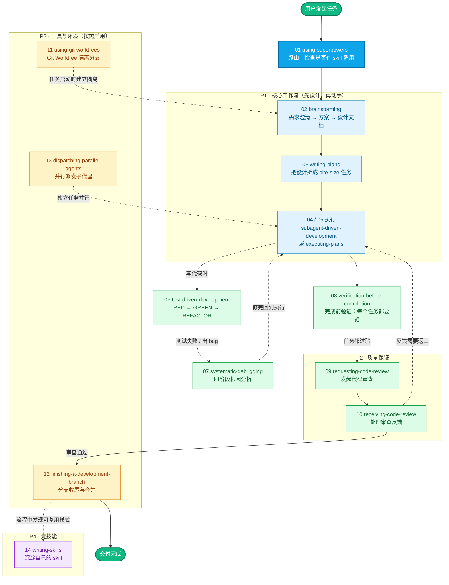

# Superpowers 参考文档

> 本文档为 [Superpowers](https://github.com/obra/superpowers) 原 skill 文件夹的中文翻译，基于 MIT 协议。

## 阅读说明

- 每个 skill 对应一篇参考文档，翻译自原 `skills/<skill-name>/SKILL.md` 及附属文件
- 附属文件（prompt 模板、示例等）整合为文末附录或子章节
- 14 个 skill 不是孤立的手册，而是一条完整的"接需求 → 设计 → 执行 → 验证 → 交付"流水线

## Superpowers 使用流程总览

下图展示了从接到一个开发任务到最终交付的完整 superpowers 工作流，每个节点对应下文文档列表中的一个 skill。

## 文档列表

### 核心工作流（P1）

| # | Skill | 说明 |
|---|-------|------|
| 01 | [using-superpowers](./using-superpowers) | 所有 skill 的入口和路由器 |
| 02 | [brainstorming](./brainstorming) | 设计先行：需求澄清 → 方案 → 设计文档 |
| 03 | [writing-plans](./writing-plans) | 任务拆解：把设计拆成 bite-size 任务 |
| 04 | [subagent-driven-development](./subagent-driven-development) | 子代理驱动开发：逐任务 + 两层 review |
| 05 | [executing-plans](./executing-plans) | 计划执行：inline 批量执行（兼容模式） |

### 质量保证（P2）

| # | Skill | 说明 |
|---|-------|------|
| 06 | [test-driven-development](./test-driven-development) | TDD 铁律：RED → GREEN → REFACTOR |
| 07 | [systematic-debugging](./systematic-debugging) | 系统化调试：四阶段根因分析 |
| 08 | [verification-before-completion](./verification-before-completion) | 完成前验证：修完必须验证 |
| 09 | [requesting-code-review](./requesting-code-review) | 发起代码审查 |
| 10 | [receiving-code-review](./receiving-code-review) | 处理审查反馈 |

### 工具与环境（P3）

| # | Skill | 说明 |
|---|-------|------|
| 11 | [using-git-worktrees](./using-git-worktrees) | Git Worktree 隔离 |
| 12 | [finishing-a-development-branch](./finishing-a-development-branch) | 分支收尾与合并 |
| 13 | [dispatching-parallel-agents](./dispatching-parallel-agents) | 并行子代理调度 |

### 元技能（P4）

| # | Skill | 说明 |
|---|-------|------|
| 14 | [writing-skills](./writing-skills) | 如何写好一个 skill |
