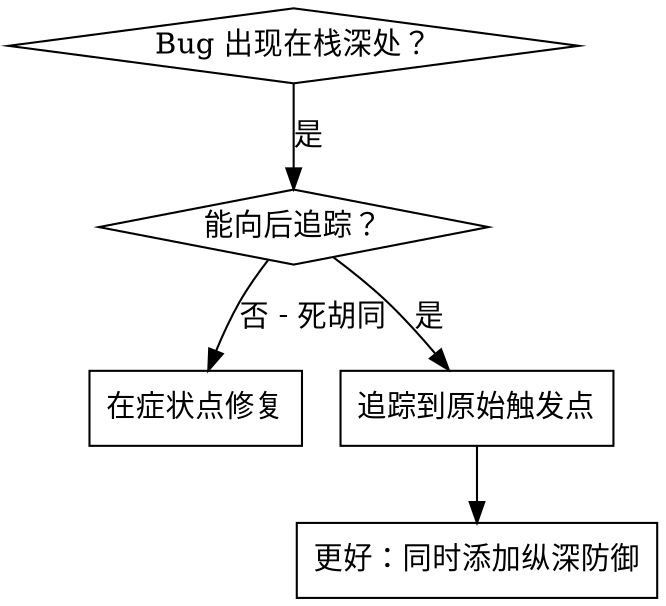
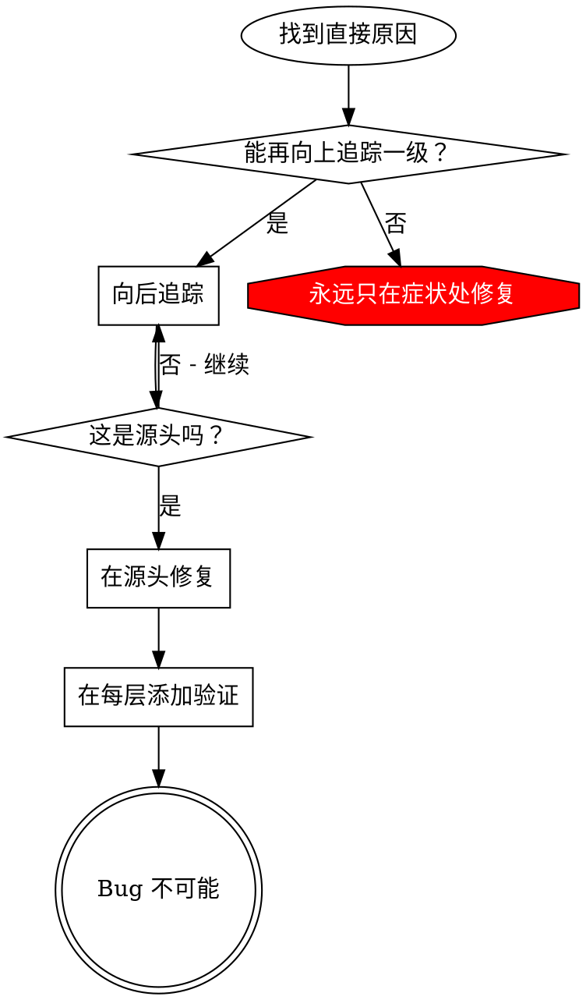
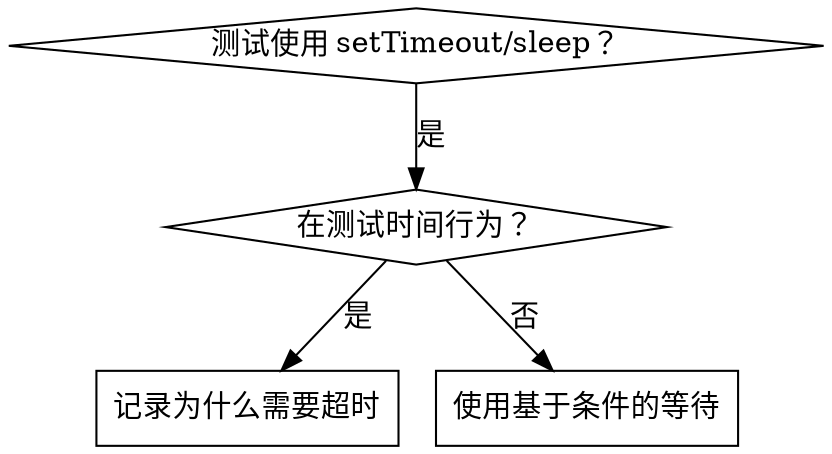

# systematic-debugging

> 本文为 [Superpowers](https://github.com/obra/superpowers/tree/main/skills/systematic-debugging) 原 skill 文件夹的中文翻译，基于 MIT 协议。原文路径：`skills/systematic-debugging/`。

---

**Skill 元数据**

| 字段 | 内容 |
|------|------|
| 名称 | systematic-debugging |
| 描述 | 在遇到任何 bug、测试失败或意外行为时使用，提出修复方案之前先执行 |

---

# 系统调试

## 概述

随机修复浪费时间并制造新 bug。快速补丁掩盖了根本问题。

**核心原则：** 在尝试修复之前，总是先找到根因。症状修复就是失败。

**违反此流程的字面意思就是违反调试的精神。**

## 铁律

```
没有先完成根因调查，就不能提出修复
```

如果你没有完成第一阶段，就不能提出修复方案。

## 何时使用

用于任何技术问题：
- 测试失败
- 生产环境 bug
- 意外行为
- 性能问题
- 构建失败
- 集成问题

**特别在这些情况下使用：**
- 时间压力下（紧急情况让猜测变得诱人）
- "只有一个快速修复"看起来很明显
- 你已经尝试了多种修复
- 之前的修复没用
- 你不完全理解问题

**不要跳过：**
- 问题看起来简单（简单 bug 也有根因）
- 你很匆忙（匆忙保证返工）
- 经理要求立即修复（系统化的比乱试更快）

## 四个阶段

你必须完成每个阶段才能进入下一个阶段。

### 第一阶段：根因调查

**在尝试任何修复之前：**

1. **仔细阅读错误信息**
   - 不要跳过错误或警告
   - 它们通常包含精确的解决方案
   - 完整阅读堆栈跟踪
   - 注意行号、文件路径、错误代码

2. **一致地复现**
   - 你能可靠地触发它吗？
   - 确切步骤是什么？
   - 它每次都发生吗？
   - 如果不能复现 → 收集更多数据，不要猜测

3. **检查最近的变更**
   - 什么变更可能导致这个？
   - git diff、最近的提交
   - 新依赖、配置变更
   - 环境差异

4. **在多组件系统中收集证据**

   **当系统有多个组件时（CI → 构建 → 签名，API → 服务 → 数据库）：**

   **在提出修复之前，添加诊断工具：**
   ```
   对于每个组件边界：
     - 记录进入组件的数据
     - 记录离开组件的数据
     - 验证环境/配置传播
     - 检查每一层的状态

   运行一次以收集证据，显示问题在哪里中断
   然后分析证据以识别失败的组件
   然后调查该特定组件
   ```

   **示例（多层系统）：**
   ```bash
   # 第 1 层：工作流
   echo "=== 工作流中可用的 secrets: ==="
   echo "IDENTITY: ${IDENTITY:+SET}${IDENTITY:-UNSET}"

   # 第 2 层：构建脚本
   echo "=== 构建脚本中的环境变量: ==="
   env | grep IDENTITY || echo "IDENTITY 不在环境中"

   # 第 3 层：签名脚本
   echo "=== 钥匙串状态: ==="
   security list-keychains
   security find-identity -v

   # 第 4 层：实际签名
   codesign --sign "$IDENTITY" --verbose=4 "$APP"
   ```

   **这揭示：** 哪一层失败（secrets → 工作流 ✓，工作流 → 构建 ✗）

5. **追踪数据流**

   **当错误深入调用栈时：**

   参见本目录下的 `root-cause-tracing.md` 以获取完整的反向追踪技术。

   **快速版本：**
   - 坏值起源于哪里？
   - 谁用这个坏值调用了这里？
   - 持续向上追踪直到找到源头
   - 在源头修复，而不是在症状处修复

### 第二阶段：模式分析

**在修复之前找到模式：**

1. **找到工作示例**
   - 在同一代码库中找到类似的能工作的代码
   - 什么能工作，与坏掉的相似？

2. **与参考实现对比**
   - 如果正在实现某种模式，完整阅读参考实现
   - 不要略读——每一行都读
   - 在应用之前充分理解模式

3. **识别差异**
   - 能工作的和坏掉的之间有什么不同？
   - 列出每一个差异，无论多小
   - 不要假设"那不可能有影响"

4. **理解依赖**
   - 这个需要什么其他组件？
   - 什么设置、配置、环境？
   - 它做了什么假设？

### 第三阶段：假设与测试

**科学方法：**

1. **形成单一假设**
   - 清楚陈述："我认为 X 是根因，因为 Y"
   - 写下来
   - 要具体，不要模糊

2. **最小化测试**
   - 做最小的可能变更来测试假设
   - 一次一个变量
   - 不要同时修复多个东西

3. **继续之前验证**
   - 有效？→ 进入第四阶段
   - 无效？→ 形成新假设
   - 不要在上面叠加更多修复

4. **当你不知道时**
   - 说"我不理解 X"
   - 不要假装知道
   - 寻求帮助
   - 做更多研究

### 第四阶段：实现

**修复根因，而不是症状：**

1. **创建失败测试用例**
   - 最简单的可能复现
   - 如果可能，使用自动化测试
   - 如果没有框架，使用一次性测试脚本
   - 修复之前必须有
   - 使用 `superpowers:test-driven-development` skill 编写正确的失败测试

2. **实现单一修复**
   - 解决已识别的根因
   - 一次一个变更
   - 没有"既然来了"的改进
   - 没有捆绑式重构

3. **验证修复**
   - 测试现在通过了吗？
   - 其他测试没有破坏？
   - 问题真的解决了吗？

4. **如果修复不起作用**
   - 停下来
   - 计数：你已经尝试了多少个修复？
   - 如果 < 3：返回第一阶段，用新信息重新分析
   - **如果 ≥ 3：停下来并质疑架构（见下面的步骤 5）**
   - 在没有架构讨论的情况下不要尝试第 4 个修复

5. **如果 3 个以上修复失败：质疑架构**

   **指示架构问题的模式：**
   - 每个修复都在不同地方揭示新的共享状态/耦合/问题
   - 修复需要"大规模重构"才能实现
   - 每个修复在其他地方制造新症状

   **停下来并质疑 fundamentals：**
   - 这个模式从根本上说是合理的吗？
   - 我们是否在"靠惯性坚持"？
   - 我们应该重构架构而不是继续修复症状吗？

   **在尝试更多修复之前与你的伙伴讨论**

   这不是失败的假设——这是错误的架构。

## 红旗——停下来，遵循流程

如果你发现自己这样想：
- "先快速修复，之后再调查"
- "就试着改 X 看看有没有用"
- "加多个变更，跑测试"
- "跳过测试，我会手动验证"
- "可能是 X，让我修复它"
- "我不完全理解，但这可能有用"
- "模式说 X，但我会以不同方式适配它"
- "主要问题是：[在没有调查的情况下列出修复]"
- 在追踪数据流之前提出解决方案
- **"再试一次修复"（已经尝试过 2+ 次）**
- **每个修复都在不同地方揭示新问题**

**以上任何一种都意味着：停下来。返回第一阶段。**

**如果 3+ 修复失败：** 质疑架构（见第四阶段第 5 步）

## 你的伙伴指出你做错了的信号

**注意这些重定向：**
- "这件事没有发生吗？" — 你在没有验证的情况下假设了
- "这会显示给我们吗？" — 你本应收集证据
- "停止猜测" — 你在不理解的情况下提出修复
- "深入思考这个" — 质疑 fundamentals，而不是症状
- "我们卡住了？"（沮丧） — 你的方法不管用

**当你看到这些时：** 停下来。返回第一阶段。

## 常见借口

| 借口 | 现实 |
|------|------|
| "问题简单，不需要流程" | 简单问题也有根因。流程对简单 bug 来说很快。 |
| "紧急情况，没时间走流程" | 系统调试比猜测-检查式乱试更快。 |
| "先试试这个，然后再调查" | 第一个修复设定了模式。从一开始就做对。 |
| "修复有效后再写测试" | 未经测试的修复不会持久。先写测试证明它。 |
| "多个修复同时进行省时间" | 无法隔离什么起了作用。会制造新 bug。 |
| "参考太长，我适配一下模式" | 部分理解保证 bug。完整阅读。 |
| "我看到问题了，让我修复它" | 看到症状 ≠ 理解根因。 |
| "再试一次修复"（2+ 次失败后） | 3+ 次失败 = 架构问题。质疑模式，不要再修复。 |

## 快速参考

| 阶段 | 关键活动 | 成功标准 |
|------|----------|----------|
| **1. 根因** | 读错误、复现、检查变更、收集证据 | 理解 WHAT 和 WHY |
| **2. 模式** | 找到工作示例、对比 | 识别差异 |
| **3. 假设** | 形成理论、最小化测试 | 确认或新假设 |
| **4. 实现** | 创建测试、修复、验证 | Bug 解决，测试通过 |

## 当流程揭示"没有根因"

如果系统调查显示问题确实是环境相关的、时间相关的，或外部的：

1. 你已完成流程
2. 记录你调查了什么
3. 实现适当的处理（重试、超时、错误信息）
4. 添加监控/日志以供未来调查

**但是：** 95% 的"没有根因"案例都是调查不完整。

## 支持技术

这些技术是系统调试的一部分，本目录中可用：

- **`root-cause-tracing.md`** — 通过调用栈反向追踪 bug 以找到原始触发点
- **`defense-in-depth.md`** — 在找到根因后在多个层添加验证
- **`condition-based-waiting.md`** — 用条件轮询替换任意超时

**相关 skill：**
- **superpowers:test-driven-development** — 用于创建失败测试用例（第四阶段第 1 步）
- **superpowers:verification-before-completion** — 在声称成功之前验证修复有效

## 真实世界影响

从调试会话中：
- 系统化方法：15-30 分钟修复
- 随机修复方法：2-3 小时乱试
- 首次修复率：95% vs 40%
- 引入的新 bug：接近零 vs 常见

---

## 附录 A：根因追踪

> 翻译自 `skills/systematic-debugging/root-cause-tracing.md`

## 概述

Bug 通常 manifested 在调用栈深处（git init 在错误目录、文件创建在错误位置、数据库用错误路径打开）。你的本能是在错误出现的地方修复，但那是在治疗症状。

**核心原则：** 通过调用链向后追踪，直到找到原始触发点，然后在源头修复。

## 何时使用



**使用时机：**
- 错误发生在执行深处（不在入口点）
- 堆栈跟踪显示长调用链
- 不清楚无效数据起源于哪里
- 需要找到哪个测试/代码触发问题

## 追踪过程

### 1. 观察症状
```
Error: git init failed in ~/project/packages/core
```

### 2. 找到直接原因
**什么代码直接导致这个？**
```typescript
await execFileAsync('git', ['init'], { cwd: projectDir });
```

### 3. 问：谁调用了这个？
```typescript
WorktreeManager.createSessionWorktree(projectDir, sessionId)
  → 被 Session.initializeWorkspace() 调用
  → 被 Session.create() 调用
  → 被 Project.create() 处的测试调用
```

### 4. 持续向上追踪
**传递了什么值？**
- `projectDir = ''`（空字符串！）
- 空字符串作为 `cwd` 解析为 `process.cwd()`
- 那就是源代码目录！

### 5. 找到原始触发点
**空字符串从哪里来？**
```typescript
const context = setupCoreTest(); // 返回 { tempDir: '' }
Project.create('name', context.tempDir); // 在 beforeEach 之前访问！
```

## 添加堆栈跟踪

当你无法手动追踪时，添加工具：

```typescript
// 在有问题的操作之前
async function gitInit(directory: string) {
  const stack = new Error().stack;
  console.error('DEBUG git init:', {
    directory,
    cwd: process.cwd(),
    nodeEnv: process.env.NODE_ENV,
    stack,
  });

  await execFileAsync('git', ['init'], { cwd: directory });
}
```

**关键：** 在测试中使用 `console.error()`（不是 logger——可能不会显示）

**运行并捕获：**
```bash
npm test 2>&1 | grep 'DEBUG git init'
```

**分析堆栈跟踪：**
- 查找测试文件名
- 找到触发调用的行号
- 识别模式（同一个测试？同一个参数？）

## 找到哪个测试造成污染

如果某些东西在测试期间出现但你不知道哪个测试：

使用本目录中的二分脚本 `find-polluter.sh`：

```bash
./find-polluter.sh '.git' 'src/**/*.test.ts'
```

逐个运行测试，停在第一个污染者。用法参见脚本。

## 真实示例：空的 projectDir

**症状：** `.git` 在 `packages/core/`（源代码）中创建

**追踪链：**
1. `git init` 在 `process.cwd()` 运行 ← 空的 cwd 参数
2. WorktreeManager 被传入空的 projectDir
3. Session.create() 被传入空字符串
4. 测试在 beforeEach 之前访问 `context.tempDir`
5. setupCoreTest() 最初返回 `{ tempDir: '' }`

**根因：** 顶层变量初始化访问了空值

**修复：** 让 tempDir 成为 getter，如果在 beforeEach 之前访问则抛出

**同时添加纵深防御：**
- 第 1 层：Project.create() 验证目录
- 第 2 层：WorkspaceManager 验证非空
- 第 3 层：NODE_ENV guard 拒绝在 tmpdir 之外 git init
- 第 4 层：git init 之前记录堆栈跟踪

## 关键原则



**永远不要在错误出现的地方修复。** 回溯找到原始触发点。

## 堆栈跟踪技巧

**在测试中：** 使用 `console.error()` 而不是 logger——logger 可能被抑制
**在操作之前：** 在危险操作之前记录，而不是失败之后
**包含上下文：** 目录、cwd、环境变量、时间戳
**捕获堆栈：** `new Error().stack` 显示完整调用链

## 真实世界影响

从调试会话（2025-10-03）：
- 通过 5 层追踪找到根因
- 在源头修复（getter 验证）
- 添加了 4 层防御
- 1847 个测试通过，零污染

---

## 附录 B：纵深防御验证

> 翻译自 `skills/systematic-debugging/defense-in-depth.md`

## 概述

当你修复由无效数据引起的 bug 时，只在一个地方添加验证感觉很足够。但单一检查可能被不同的代码路径、重构或 mock 绕过。

**核心原则：** 在数据通过的每一层都进行验证。让 bug 在结构上不可能发生。

## 为什么需要多层

单一验证："我们修复了 bug"
多层验证："我们让 bug 不可能"

不同层捕获不同情况：
- 入口验证捕获大多数 bug
- 业务逻辑捕获边缘情况
- 环境 guard 防止特定上下文中的危险
- 调试日志在其他层失败时提供帮助

## 四个层

### 第 1 层：入口点验证
**目的：** 在 API 边界拒绝明显无效的输入

```typescript
function createProject(name: string, workingDirectory: string) {
  if (!workingDirectory || workingDirectory.trim() === '') {
    throw new Error('workingDirectory cannot be empty');
  }
  if (!existsSync(workingDirectory)) {
    throw new Error(`workingDirectory does not exist: ${workingDirectory}`);
  }
  if (!statSync(workingDirectory).isDirectory()) {
    throw new Error(`workingDirectory is not a directory: ${workingDirectory}`);
  }
  // ... 继续
}
```

### 第 2 层：业务逻辑验证
**目的：** 确保数据对此操作有意义

```typescript
function initializeWorkspace(projectDir: string, sessionId: string) {
  if (!projectDir) {
    throw new Error('projectDir required for workspace initialization');
  }
  // ... 继续
}
```

### 第 3 层：环境 Guard
**目的：** 防止在特定上下文中执行危险操作

```typescript
async function gitInit(directory: string) {
  // 在测试中，拒绝在临时目录之外 git init
  if (process.env.NODE_ENV === 'test') {
    const normalized = normalize(resolve(directory));
    const tmpDir = normalize(resolve(tmpdir()));

    if (!normalized.startsWith(tmpDir)) {
      throw new Error(
        `Refusing git init outside temp dir during tests: ${directory}`
      );
    }
  }
  // ... 继续
}
```

### 第 4 层：调试工具
**目的：** 捕获取证上下文

```typescript
async function gitInit(directory: string) {
  const stack = new Error().stack;
  logger.debug('About to git init', {
    directory,
    cwd: process.cwd(),
    stack,
  });
  // ... 继续
}
```

## 应用模式

当你找到 bug 时：

1. **追踪数据流** — 坏值起源于哪里？在哪里使用？
2. **映射所有检查点** — 列出数据通过的每个点
3. **在每一层添加验证** — 入口、业务、环境、调试
4. **测试每一层** — 尝试绕过第 1 层，验证第 2 层捕获它

## 会话中的示例

Bug：空的 `projectDir` 导致在源代码中 `git init`

**数据流：**
1. 测试设置 → 空字符串
2. `Project.create(name, '')`
3. `WorkspaceManager.createWorkspace('')`
4. `git init` 在 `process.cwd()` 运行

**添加的四个层：**
- 第 1 层：`Project.create()` 验证非空/存在/可写
- 第 2 层：`WorkspaceManager` 验证 projectDir 非空
- 第 3 层：`WorktreeManager` 在测试中拒绝在 tmpdir 之外 git init
- 第 4 层：git init 之前记录堆栈跟踪

**结果：** 所有 1847 个测试通过，bug 无法复现

## 关键洞察

所有四个层都是必要的。在测试期间，每一层都捕获了其他层遗漏的 bug：
- 不同的代码路径绕过了入口验证
- Mock 绕过了业务逻辑检查
- 不同平台上的边缘情况需要环境 guard
- 调试日志识别了结构性误用

**不要只在一个验证点停下来。** 在每一层都添加检查。

---

## 附录 C：基于条件的等待

> 翻译自 `skills/systematic-debugging/condition-based-waiting.md`

## 概述

不稳定的测试通常用任意延迟猜测时间。这创造了竞态条件：测试在快速机器上通过，但在负载下或 CI 中失败。

**核心原则：** 等待你实际关心的条件，而不是对耗时多久的猜测。

## 何时使用



**使用时机：**
- 测试有任意延迟（`setTimeout`、`sleep`、`time.sleep()`）
- 测试不稳定（有时通过，有时在负载下失败）
- 并行运行时测试超时
- 等待异步操作完成

**不要使用：**
- 测试实际时间行为（debounce、throttle 间隔）
- 如果使用任意超时，始终记录 WHY

## 核心模式

```typescript
// ❌ 之前：猜测时间
await new Promise(r => setTimeout(r, 50));
const result = getResult();
expect(result).toBeDefined();

// ✅ 之后：等待条件
await waitFor(() => getResult() !== undefined);
const result = getResult();
expect(result).toBeDefined();
```

## 快速模式

| 场景 | 模式 |
|------|------|
| 等待事件 | `waitFor(() => events.find(e => e.type === 'DONE'))` |
| 等待状态 | `waitFor(() => machine.state === 'ready')` |
| 等待数量 | `waitFor(() => items.length >= 5)` |
| 等待文件 | `waitFor(() => fs.existsSync(path))` |
| 复杂条件 | `waitFor(() => obj.ready && obj.value > 10)` |

## 实现

通用轮询函数：
```typescript
async function waitFor<T>(
  condition: () => T | undefined | null | false,
  description: string,
  timeoutMs = 5000
): Promise<T> {
  const startTime = Date.now();

  while (true) {
    const result = condition();
    if (result) return result;

    if (Date.now() - startTime > timeoutMs) {
      throw new Error(`Timeout waiting for ${description} after ${timeoutMs}ms`);
    }

    await new Promise(r => setTimeout(r, 10)); // 每 10ms 轮询
  }
}
```

参见本目录中的 `condition-based-waiting-example.ts` 以获取完整实现，包括来自实际调试会话的领域特定辅助函数（`waitForEvent`、`waitForEventCount`、`waitForEventMatch`）。

## 常见错误

**❌ 轮询太快：** `setTimeout(check, 1)` - 浪费 CPU
**✅ 修复：** 每 10ms 轮询

**❌ 没有超时：** 如果条件永远不满足就永远循环
**✅ 修复：** 总是包含清晰的错误超时

**❌ 数据陈旧：** 在循环前缓存状态
**✅ 修复：** 在循环内调用 getter 以获取最新数据

## 何时任意超时是正确的

```typescript
// 工具每 100ms tick 一次——需要 2 个 tick 来验证部分输出
await waitForEvent(manager, 'TOOL_STARTED'); // 首先：等待条件
await new Promise(r => setTimeout(r, 200));   // 然后：等待定时行为
// 200ms = 2 个 100ms 间隔的 tick——有记录并合理
```

**要求：**
1. 首先等待触发条件
2. 基于已知时间（不是猜测）
3. 注释解释 WHY

## 真实世界影响

从调试会话（2025-10-03）：
- 修复了 3 个文件中的 15 个不稳定测试
- 通过率：60% → 100%
- 执行时间：快 40%
- 不再有竞态条件
