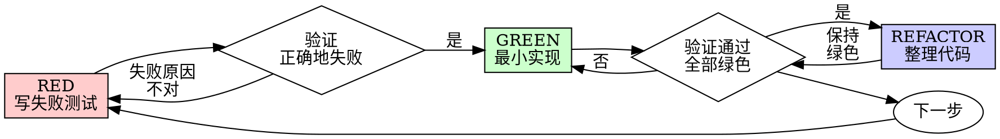

# test-driven-development

> 本文为 [Superpowers](https://github.com/obra/superpowers/tree/main/skills/test-driven-development) 原 skill 文件夹的中文翻译，基于 MIT 协议。原文路径：`skills/test-driven-development/`。

---

**Skill 元数据**

| 字段 | 内容 |
|------|------|
| 名称 | test-driven-development |
| 描述 | 在实现任何功能或修复 bug、编写实现代码之前使用 |

---

# 测试驱动开发（TDD）

## 概述

先写测试。看它失败。写最少的代码让它通过。

**核心原则：** 如果你没有亲眼看到测试失败，你不知道它有没有测试对的东西。

**违反规则的字面意思就是违反规则的精神。**

## 何时使用

**始终：**
- 新功能
- Bug 修复
- 重构
- 行为变更

**例外（需询问你的伙伴）：**
- 一次性原型
- 生成的代码
- 配置文件

想着"就这一次跳过 TDD"？停下来。那是在给自己找借口。

## 铁律

```
没有先有失败测试，就不能有生产代码
```

在测试之前写了代码？删掉它。重新开始。

**没有例外：**
- 不要留着它作"参考"
- 不要在写测试时"改编"它
- 不要看它
- 删除就是删除

从测试开始重新实现。就这样。

## 红-绿-重构



### RED — 写失败测试

写一个最小测试，展示应该发生什么。

**✅ Good:**
```typescript
test('retries failed operations 3 times', async () => {
  let attempts = 0;
  const operation = () => {
    attempts++;
    if (attempts < 3) throw new Error('fail');
    return 'success';
  };

  const result = await retryOperation(operation);

  expect(result).toBe('success');
  expect(attempts).toBe(3);
});
```
名称清晰，测试真实行为，只测一件事

**❌ Bad:**
```typescript
test('retry works', async () => {
  const mock = jest.fn()
    .mockRejectedValueOnce(new Error())
    .mockRejectedValueOnce(new Error())
    .mockResolvedValueOnce('success');
  await retryOperation(mock);
  expect(mock).toHaveBeenCalledTimes(3);
});
```
名称模糊，测试 mock 而非代码

**要求：**
- 一个行为
- 清晰的名称
- 真实代码（除非不得已不要用 mock）

### 验证 RED — 看它失败

**必须。永远不要跳过。**

```bash
npm test path/to/test.test.ts
```

确认：
- 测试失败（而不是报错）
- 失败信息符合预期
- 因功能缺失而失败（不是因为拼写错误）

**测试通过？** 你在测试已有行为。修改测试。

**测试报错？** 修复错误，重新运行直到正确地失败。

### GREEN — 最小实现

写最简单的代码让测试通过。

**✅ Good:**
```typescript
async function retryOperation<T>(fn: () => Promise<T>): Promise<T> {
  for (let i = 0; i < 3; i++) {
    try {
      return await fn();
    } catch (e) {
      if (i === 2) throw e;
    }
  }
  throw new Error('unreachable');
}
```
刚好够通过

**❌ Bad:**
```typescript
async function retryOperation<T>(
  fn: () => Promise<T>,
  options?: {
    maxRetries?: number;
    backoff?: 'linear' | 'exponential';
    onRetry?: (attempt: number) => void;
  }
): Promise<T> {
  // YAGNI
}
```
过度设计

不要添加功能、重构其他代码，或做测试以外的"改进"。

### 验证 GREEN — 看它通过

**必须。**

```bash
npm test path/to/test.test.ts
```

确认：
- 测试通过
- 其他测试仍然通过
- 输出干净（无错误、无警告）

**测试失败？** 修代码，不要修测试。

**其他测试失败？** 现在就修。

### REFACTOR — 整理代码

只在绿色后进行：
- 去除重复
- 改善命名
- 提取辅助函数

保持测试绿色。不要添加行为。

### 循环

对下一个功能写下一个失败测试。

## 好测试的特征

| 质量 | 好 | 不好 |
|------|----|----|
| **最小** | 只测一件事。名称里有"and"？拆分它。 | `test('validates email and domain and whitespace')` |
| **清晰** | 名称描述行为 | `test('test1')` |
| **表达意图** | 展示期望的 API | 隐藏代码应该做什么 |

## 为什么顺序很重要

**"我先实现，之后补测试来验证它能用"**

写在代码之后的测试会立即通过。立即通过什么都证明不了：
- 可能测的是错误的东西
- 可能测的是实现细节而非行为
- 可能漏掉你没想到的边缘情况
- 你从没看见它捕获 bug

先写测试迫使你看到测试失败，证明它确实在测试什么。

**"我已经手动测试了所有边缘情况"**

手动测试是临时性的。你以为你测了所有情况，但：
- 没有记录你测了什么
- 代码变更时无法重新运行
- 在压力下容易遗忘情况
- "我试的时候能用"≠ 全面

自动测试是系统性的。每次以相同方式运行。

**"删掉 X 小时的工作是浪费"**

这是沉没成本谬误。那些时间已经过去了。你现在的选择是：
- 删掉它，用 TDD 重写（再花 X 小时，高可信度）
- 保留它，之后补测试（30 分钟，低可信度，可能有 bug）

"浪费"是保留你不能信任的代码。没有真实测试的可工作代码是技术债。

**"TDD 是教条的，务实意味着要适应"**

TDD 本来就是务实的：
- 在提交前发现 bug（比之后调试更快）
- 防止回归（测试立即捕获破坏）
- 文档化行为（测试展示如何使用代码）
- 支持重构（自由修改，测试捕获破坏）

"务实"的捷径 = 在生产中调试 = 更慢。

**"后写测试能达到相同目标——重要的是精神而非仪式"**

不对。后写测试回答"这东西做什么？"先写测试回答"这东西应该做什么？"

后写测试受你的实现偏见影响。你测试你构建的东西，而不是要求的东西。你验证你记住的边缘情况，而不是发现的边缘情况。

先写测试迫使在实现之前发现边缘情况。后写测试验证你记住了所有情况（你没有）。

30 分钟的后写测试 ≠ TDD。你得到了覆盖率，但失去了测试有效性的证明。

## 常见借口

| 借口 | 现实 |
|------|------|
| "太简单了不需要测试" | 简单代码也会出错。写一个测试只需 30 秒。 |
| "我之后再测" | 立即通过的测试什么都证明不了。 |
| "后写测试达到相同目标" | 后写 = "这东西做什么？"先写 = "这东西应该做什么？" |
| "已经手动测了" | 临时性 ≠ 系统性。没有记录，无法重新运行。 |
| "删掉 X 小时是浪费" | 沉没成本谬误。保留未验证的代码是技术债。 |
| "留着作参考，先写测试" | 你会改编它。那就是后写测试。删除就是删除。 |
| "需要先探索一下" | 可以。扔掉探索性代码，从 TDD 开始。 |
| "测试很难写 = 设计不清晰" | 听测试的话。难以测试 = 难以使用。 |
| "TDD 会拖慢我" | TDD 比调试快。务实 = 先写测试。 |
| "手动测试更快" | 手动测试证明不了边缘情况。每次改动你都要重测。 |
| "现有代码没有测试" | 你在改进它。为现有代码添加测试。 |

## 红旗——停下来，重新开始

- 代码在测试之前
- 实现之后才写测试
- 测试立即通过
- 无法解释测试为什么失败
- 测试"稍后"添加
- 在为"就这一次"找借口
- "我已经手动测试过了"
- "后写测试达到相同目的"
- "重要的是精神而非仪式"
- "留着作参考"或"改编现有代码"
- "已经花了 X 小时，删掉是浪费"
- "TDD 是教条的，我在务实"
- "这种情况不一样，因为……"

**以上任何一种都意味着：删掉代码。用 TDD 重新开始。**

## 示例：修复 Bug

**Bug：** 空邮件被接受

**RED**
```typescript
test('rejects empty email', async () => {
  const result = await submitForm({ email: '' });
  expect(result.error).toBe('Email required');
});
```

**验证 RED**
```bash
$ npm test
FAIL: expected 'Email required', got undefined
```

**GREEN**
```typescript
function submitForm(data: FormData) {
  if (!data.email?.trim()) {
    return { error: 'Email required' };
  }
  // ...
}
```

**验证 GREEN**
```bash
$ npm test
PASS
```

**REFACTOR**
如果需要，提取多个字段的验证逻辑。

## 验证清单

标记工作完成前：

- [ ] 每个新函数/方法都有测试
- [ ] 在实现之前看到每个测试失败
- [ ] 每个测试因预期原因失败（功能缺失，不是拼写错误）
- [ ] 写了最少的代码让每个测试通过
- [ ] 所有测试通过
- [ ] 输出干净（无错误，无警告）
- [ ] 测试使用真实代码（只有不得已才用 mock）
- [ ] 边缘情况和错误已覆盖

无法勾选所有项？你跳过了 TDD。重新开始。

## 卡住时

| 问题 | 解决方案 |
|------|----------|
| 不知道如何测试 | 写出你希望的 API。先写断言。询问你的伙伴。 |
| 测试太复杂 | 设计太复杂。简化接口。 |
| 必须 mock 所有东西 | 代码耦合太紧。使用依赖注入。 |
| 测试设置太大 | 提取辅助函数。还是复杂？简化设计。 |

## 调试集成

发现 bug？写一个重现它的失败测试。遵循 TDD 循环。测试既证明了修复，又防止了回归。

永远不要不写测试就修复 bug。

## 测试反模式

在添加 mock 或测试工具时，阅读下方的[测试反模式](#附录测试反模式)以避免常见陷阱：
- 测试 mock 行为而非真实行为
- 向生产类添加仅测试用的方法
- 不了解依赖就使用 mock

## 最终规则

```
生产代码 → 测试先存在且先失败
否则 → 不是 TDD
```

没有伙伴的许可，没有例外。

---

## 附录：测试反模式

> 翻译自 `skills/test-driven-development/testing-anti-patterns.md`

**在以下情况加载此参考：** 写或修改测试、添加 mock、或想要向生产代码添加仅测试用的方法时。

## 概述

测试必须验证真实行为，而不是 mock 行为。Mock 是隔离的手段，不是被测试的对象。

**核心原则：** 测试代码做了什么，而不是 mock 做了什么。

**严格遵循 TDD 可以防止这些反模式。**

## 铁律

```
1. 永远不要测试 mock 行为
2. 永远不要向生产类添加仅测试用的方法
3. 永远不要在不了解依赖的情况下使用 mock
```

## 反模式 1：测试 Mock 行为

**违规：**
```typescript
// ❌ 坏：测试 mock 是否存在
test('renders sidebar', () => {
  render(<Page />);
  expect(screen.getByTestId('sidebar-mock')).toBeInTheDocument();
});
```

**为什么这是错的：**
- 你在验证 mock 是否工作，而不是组件是否工作
- mock 存在时测试通过，不存在时测试失败
- 对真实行为什么都说明不了

**伙伴的质疑：** "我们在测试 mock 的行为吗？"

**修复：**
```typescript
// ✅ 好：测试真实组件或不要 mock 它
test('renders sidebar', () => {
  render(<Page />);  // 不要 mock sidebar
  expect(screen.getByRole('navigation')).toBeInTheDocument();
});

// 或者如果为了隔离必须 mock sidebar：
// 不要断言 mock 本身——测试 sidebar 存在时 Page 的行为
```

### 关卡函数

```
在断言任何 mock 元素之前：
  问："我在测试真实组件行为还是只是 mock 的存在？"

  如果在测试 mock 的存在：
    停下来——删除断言或取消 mock 组件

  改为测试真实行为
```

## 反模式 2：向生产代码添加仅测试用的方法

**违规：**
```typescript
// ❌ 坏：destroy() 只在测试中使用
class Session {
  async destroy() {  // 看起来像生产 API！
    await this._workspaceManager?.destroyWorkspace(this.id);
    // ... 清理
  }
}

// 在测试中
afterEach(() => session.destroy());
```

**为什么这是错的：**
- 生产类被仅测试代码污染
- 意外在生产中调用会很危险
- 违反 YAGNI 和关注点分离
- 混淆了对象生命周期和实体生命周期

**修复：**
```typescript
// ✅ 好：测试工具处理测试清理
// Session 没有 destroy()——它在生产中是无状态的

// 在 test-utils/ 中
export async function cleanupSession(session: Session) {
  const workspace = session.getWorkspaceInfo();
  if (workspace) {
    await workspaceManager.destroyWorkspace(workspace.id);
  }
}

// 在测试中
afterEach(() => cleanupSession(session));
```

### 关卡函数

```
在向生产类添加任何方法之前：
  问："这个方法只被测试使用吗？"

  如果是：
    停下来——不要添加
    改为放在测试工具中

  问："这个类拥有这个资源的生命周期吗？"

  如果否：
    停下来——这个方法放错类了
```

## 反模式 3：不了解依赖就使用 Mock

**违规：**
```typescript
// ❌ 坏：Mock 破坏了测试逻辑
test('detects duplicate server', () => {
  // Mock 阻止了测试依赖的 config 写入！
  vi.mock('ToolCatalog', () => ({
    discoverAndCacheTools: vi.fn().mockResolvedValue(undefined)
  }));

  await addServer(config);
  await addServer(config);  // 应该抛错——但不会！
});
```

**为什么这是错的：**
- 被 mock 的方法有测试依赖的副作用（写入 config）
- 为了"安全"过度 mock 破坏了真实行为
- 测试因为错误原因通过或神秘失败

**修复：**
```typescript
// ✅ 好：在正确的层级 mock
test('detects duplicate server', () => {
  // 只 mock 慢的部分，保留测试需要的行为
  vi.mock('MCPServerManager'); // 只 mock 慢的服务器启动

  await addServer(config);  // Config 已写入
  await addServer(config);  // 检测到重复 ✓
});
```

### 关卡函数

```
在 mock 任何方法之前：
  停下来——先不要 mock

  1. 问："这个真实方法有什么副作用？"
  2. 问："这个测试依赖其中任何副作用吗？"
  3. 问："我完全理解这个测试需要什么吗？"

  如果依赖副作用：
    在更低层级 mock（真正慢/外部的操作）
    或使用保留必要行为的测试替身
    不要 mock 测试依赖的高层方法

  如果不确定测试依赖什么：
    先用真实实现运行测试
    观察真正需要发生什么
    然后在正确层级添加最少的 mock

  红旗：
    - "我 mock 这个以防万一"
    - "这可能很慢，最好 mock 掉"
    - 在不了解依赖链的情况下 mock
```

## 反模式 4：不完整的 Mock

**违规：**
```typescript
// ❌ 坏：部分 mock——只有你认为你需要的字段
const mockResponse = {
  status: 'success',
  data: { userId: '123', name: 'Alice' }
  // 缺少：下游代码使用的 metadata
};

// 之后：当代码访问 response.metadata.requestId 时崩溃
```

**为什么这是错的：**
- **部分 mock 隐藏了结构假设** — 你只 mock 了你知道的字段
- **下游代码可能依赖你没包含的字段** — 静默失败
- **测试通过但集成失败** — Mock 不完整，真实 API 完整
- **虚假的自信** — 测试对真实行为什么都证明不了

**铁律：** Mock 数据结构在现实中存在的完整版本，而不只是你当前测试用到的字段。

**修复：**
```typescript
// ✅ 好：镜像真实 API 的完整性
const mockResponse = {
  status: 'success',
  data: { userId: '123', name: 'Alice' },
  metadata: { requestId: 'req-789', timestamp: 1234567890 }
  // 真实 API 返回的所有字段
};
```

### 关卡函数

```
在创建 mock 响应之前：
  检查："真实 API 响应包含哪些字段？"

  操作：
    1. 检查文档/示例中的实际 API 响应
    2. 包含系统可能在下游消费的所有字段
    3. 验证 mock 与真实响应 schema 完全匹配

  关键：
    如果你在创建 mock，你必须了解整个结构
    部分 mock 在代码依赖被省略的字段时静默失败

  如果不确定：包含所有已文档化的字段
```

## 反模式 5：事后才想到集成测试

**违规：**
```
✅ 实现完成
❌ 没有写测试
"准备好测试了"
```

**为什么这是错的：**
- 测试是实现的一部分，不是可选的后续步骤
- TDD 本应捕获这个
- 没有测试就不能声称完成

**修复：**
```
TDD 循环：
1. 写失败测试
2. 实现通过
3. 重构
4. 然后才声称完成
```

## 当 Mock 变得太复杂时

**警告信号：**
- Mock 设置比测试逻辑更长
- Mock 了所有东西让测试通过
- Mock 缺少真实组件拥有的方法
- Mock 变更时测试崩溃

**伙伴的问题：** "我们真的需要在这里用 mock 吗？"

**考虑：** 使用真实组件的集成测试通常比复杂的 mock 更简单

## TDD 防止这些反模式

**TDD 为什么有帮助：**
1. **先写测试** → 迫使你思考你实际上在测试什么
2. **看它失败** → 确认测试在测试真实行为，而不是 mock
3. **最小实现** → 不会混入仅测试用的方法
4. **真实依赖** → 你在 mock 之前就看到测试实际需要什么

**如果你在测试 mock 行为，你违反了 TDD** — 你在没有先看测试对真实代码失败的情况下添加了 mock。

## 快速参考

| 反模式 | 修复 |
|--------|------|
| 断言 mock 元素 | 测试真实组件或取消 mock |
| 生产代码中的仅测试方法 | 移到测试工具中 |
| 不了解就 mock | 先了解依赖，最少地 mock |
| 不完整的 mock | 完整镜像真实 API |
| 测试是事后再想 | TDD——先写测试 |
| 过复杂的 mock | 考虑集成测试 |

## 红旗

- 断言检查 `*-mock` 测试 ID
- 只被测试文件调用的方法
- Mock 设置超过测试的 50%
- 删除 mock 时测试失败
- 无法解释为什么需要 mock
- "为了安全" mock

## 总结

**Mock 是隔离的工具，不是被测试的东西。**

如果 TDD 揭示你在测试 mock 行为，说明你走错了。

修复：测试真实行为，或质疑你为什么要 mock。
