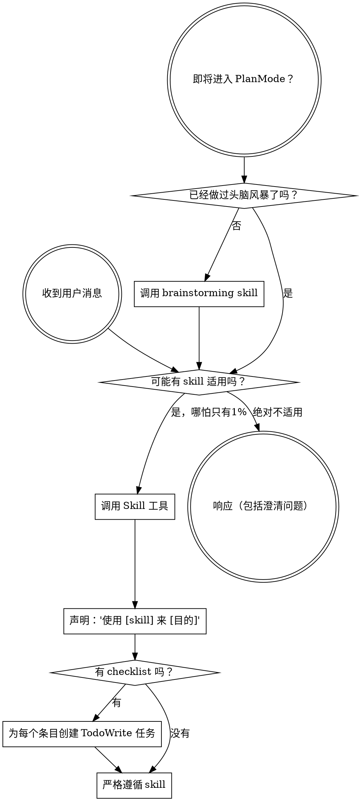

# using-superpowers

> 本文为 [Superpowers](https://github.com/obra/superpowers/tree/main/skills/using-superpowers) 原 skill 文件夹的中文翻译，基于 MIT 协议。原文路径：`skills/using-superpowers/`。

---

**Skill 元数据**

| 字段 | 内容 |
|------|------|
| 名称 | using-superpowers |
| 描述 | 在任何对话开始时使用——建立如何查找和使用 skill 的机制，要求在做出任何回复（包括澄清性问题）之前必须先调用 skill |

---

::: warning ⚠️ SUBAGENT-STOP
如果你是作为子代理被派发来执行特定任务的，跳过此 skill。
:::

::: danger ⚠️ EXTREMELY IMPORTANT
如果你认为某个 skill 有哪怕 1% 的可能性适用于你正在做的事，你**绝对必须**调用该 skill。

如果某个 skill 适用于你的任务，你**没有选择权**。你**必须**使用它。

这不可协商。这不可选择。你无法用借口绕过它。
:::

## 指令优先级

Superpowers skill 会覆盖默认系统提示词的行为，但**用户指令始终优先**：

1. **用户的明确指令**（CLAUDE.md、GEMINI.md、AGENTS.md、直接请求）— 最高优先级
2. **Superpowers skill** — 在与默认行为冲突时覆盖默认系统行为
3. **默认系统提示词** — 最低优先级

如果 CLAUDE.md、GEMINI.md 或 AGENTS.md 说"不要用 TDD"，而某个 skill 说"始终使用 TDD"，请遵循用户指令。用户拥有控制权。

## 如何访问 Skill

**永远不要用文件工具手动读取 skill 文件**——始终使用你平台的 skill 加载机制，确保 skill 被正确激活。

**在 Claude Code 中：** 使用 `Skill` 工具。当你调用一个 skill 时，其内容会被加载并呈现给你——直接遵循它。

**在 Codex 中：** Skill 原生加载，激活时按呈现的指令操作即可。

**在 Copilot CLI 中：** 使用 `skill` 工具。Skill 会从已安装的插件中自动发现。

**在 Gemini CLI 中：** Skill 通过 `activate_skill` 工具激活。Gemini 在会话开始时加载 skill 元数据，并按需激活完整内容。

**在其他环境中：** 查看你平台的文档，了解 skill 是如何加载的。

## 平台适配

Skill 以**动作**（"派发子代理"、"创建 todo"、"读取文件"）来表达指令，而非绑定任何特定运行时的工具名。各平台的工具对照和指令文件约定，参见 `references/claude-code-tools.md`、`references/codex-tools.md`、`references/copilot-tools.md`、`references/gemini-tools.md`、`references/pi-tools.md` 和 `references/antigravity-tools.md`。Gemini CLI 用户会通过 GEMINI.md 自动加载工具映射。

# 使用 Skill

## 核心规则

**在做出任何响应或采取任何行动之前，调用相关或被请求的 skill。** 即使只有 1% 的可能性某个 skill 可能适用，你也应该调用该 skill 来确认。如果调用的 skill 最终不适用于当前情况，你不需要使用它。



## 红旗信号

以下这些想法意味着**停下来**——你在自我合理化：

| 想法 | 事实 |
|------|------|
| "这只是一个简单的问题" | 问题也是任务。检查是否有适用的 skill。 |
| "我需要先了解更多上下文" | Skill 检查在澄清问题**之前**进行。 |
| "让我先探索一下代码库" | Skill 告诉你**如何**探索。先检查 skill。 |
| "我可以快速检查一下 git/文件" | 文件缺乏对话上下文。检查是否有适用的 skill。 |
| "让我先收集信息" | Skill 告诉你**如何**收集信息。 |
| "这不需要正式的 skill" | 如果 skill 存在，就使用它。 |
| "我记得这个 skill" | Skill 会演进。阅读当前版本。 |
| "这不算是一个任务" | 行动 = 任务。检查是否有适用的 skill。 |
| "这个 skill 太重了" | 简单的事情会变复杂。使用它。 |
| "我先做这一件事" | 在做任何事**之前**先检查。 |
| "这感觉很有成效" | 缺乏纪律的行动浪费时间。Skill 防止这种情况。 |
| "我知道那是什么意思" | 知道概念 ≠ 使用 skill。调用它。 |

## Skill 优先级

当多个 skill 都可能适用时，按以下顺序使用：

1. **流程 skill 优先**（brainstorming、debugging）— 它们决定了**如何**着手任务
2. **实现 skill 其次**（frontend-design、mcp-builder）— 它们指导执行

"我们来构建 X" → 先 brainstorming，再使用实现 skill。
"修复这个 bug" → 先 debugging，再使用领域特定 skill。

## Skill 类型

**严格型**（TDD、debugging）：严格遵循。不要跳过纪律要求。

**灵活型**（patterns）：根据上下文调整原则。

Skill 本身会告诉你它属于哪种类型。

## 用户指令

指令说的是**做什么**，而不是**怎么做**。"添加 X"或"修复 Y"不意味着跳过工作流。

---

## 附录 A：Codex 工具映射

Skill 以动作表达指令，在 Codex 上对应如下工具：

| Skill 请求的动作 | Codex 对应工具 |
|----------------|--------------|
| 读取文件 | `shell`（如 `cat`、`head`、`tail`）— Codex 通过 shell 读文件 |
| 创建 / 编辑 / 删除文件 | `apply_patch`（结构化 diff，支持创建、更新、删除） |
| 运行 shell 命令 | `shell` |
| 搜索文件内容 | `shell`（如 `grep`、`rg`） |
| 按名称查找文件 | `shell`（如 `find`、`ls`） |
| 抓取 URL | `shell` 配合 `curl` / `wget`——Codex 没有原生 fetch 工具 |
| 搜索网络 | `web_search`（默认启用；可在 `config.toml` 的顶级 `web_search` 配置项设为 `live`、`cached` 或 `disabled`） |
| 调用 skill | Skill 原生加载，直接遵循指令即可 |
| 派发子代理（`Subagent (general-purpose):` 模板） | `spawn_agent`（参见[子代理派发需要多代理支持](#子代理派发需要多代理支持)） |
| 多个并行派发 | 在一次响应中发出多个 `spawn_agent` 调用 |
| 等待子代理结果 | `wait_agent` |
| 子代理完成后释放槽位 | `close_agent` |
| 任务追踪（"创建 todo"、"标记完成"） | `update_plan` |

### 指令文件

当 skill 提到"你的指令文件"时，在 Codex 中指的是项目根目录的 **`AGENTS.md`**。Codex 也会读取 `~/.codex/AGENTS.md` 作为全局上下文；若存在 `AGENTS.override.md`（项目树或 `~/.codex/` 中），它拥有最高优先级。Codex 从项目根目录向下遍历到当前工作目录，沿途拼接找到的 `AGENTS.md`，上限为 `project_doc_max_bytes`（默认 32 KiB）。

### 个人 skill 目录

用户级 skill 存放于 **`$CODEX_HOME/skills/`**（默认 `~/.codex/skills/`）。Codex 也读取跨运行时路径 **`~/.agents/skills/`**（与 Copilot CLI 和 Gemini CLI 共享）。当两个目录在同一层级都存在时，Codex 将其作为两个独立的 skill 目录分别加载。每个 skill 是一个含 `SKILL.md`（带 `name` 和 `description` frontmatter）的子目录。

### 子代理派发需要多代理支持

在你的 Codex 配置（`~/.codex/config.toml`）中添加：

```toml
[features]
multi_agent = true
```

这将启用 `spawn_agent`、`wait_agent` 和 `close_agent`，供 `dispatching-parallel-agents` 和 `subagent-driven-development` 等 skill 使用。

旧版说明：`rust-v0.115.0` 之前的 Codex 构建版本将派生代理的等待操作暴露为 `wait`。当前 Codex 使用 `wait_agent` 来等待派生的代理。`wait` 名称现在属于 code-mode 的 `exec/wait`，它通过 `cell_id` 恢复一个已让出的 exec cell；它不是派生代理的结果工具。

### 环境检测

创建 worktree 或完成分支的 skill 应在继续之前使用只读 git 命令检测其环境：

```bash
GIT_DIR=$(cd "$(git rev-parse --git-dir)" 2>/dev/null && pwd -P)
GIT_COMMON=$(cd "$(git rev-parse --git-common-dir)" 2>/dev/null && pwd -P)
BRANCH=$(git branch --show-current)
```

- `GIT_DIR != GIT_COMMON` → 已在一个链接的 worktree 中（跳过创建）
- `BRANCH` 为空 → detached HEAD（无法从沙箱中分支/推送/创建 PR）

参见 `using-git-worktrees` 的 Step 0 和 `finishing-a-development-branch` 的 Step 1，了解每个 skill 如何使用这些信号。

### Codex App 收尾

当沙箱阻止分支/推送操作（在外部管理的 worktree 中处于 detached HEAD 状态）时，代理提交所有工作并告知用户使用 App 的原生控件：

- **"创建分支"** — 命名分支，然后通过 App UI 进行提交/推送/PR
- **"交接给本地"** — 将工作转移到用户的本地检出目录

代理仍然可以运行测试、暂存文件，并输出建议的分支名称、提交信息和 PR 描述供用户复制。

---

## 附录 B：Copilot CLI 工具映射

Skill 以动作表达指令，在 Copilot CLI 上对应如下工具：

| Skill 请求的动作 | Copilot CLI 对应工具 |
|----------------|-------------------|
| 读取文件 | `view` |
| 创建 / 编辑 / 删除文件 | `apply_patch`（Copilot CLI 没有独立的 create/edit/write 工具） |
| 运行 shell 命令 | `bash` |
| 搜索文件内容 | `rg`（ripgrep；Copilot CLI 未暴露 `grep` 工具） |
| 按名称查找文件 | `glob` |
| 抓取 URL | `web_fetch` |
| 搜索网络 | `web_search` |
| 调用 skill | `skill` |
| 派发子代理（`Subagent (general-purpose):` 模板） | `task` 配合 `agent_type: "general-purpose"`（其他可用类型：`explore`、`task`、`code-review`、`research`、`configure-copilot`） |
| 多个并行派发 | 在一次响应中发出多个 `task` 调用 |
| 子代理状态 / 输出 / 控制 | `read_agent`、`list_agents`、`write_agent` |
| 任务追踪（"创建 todo"、"标记完成"） | `update_todo` |
| 进入 / 退出 plan mode | 无对应工具——保持在主会话中即可 |

### 指令文件

当 skill 提到"你的指令文件"时，在 Copilot CLI 中指的是仓库根目录的 **`AGENTS.md`**。若 `AGENTS.md` 和 `.github/copilot-instructions.md` 同时存在，Copilot 会同时读取两者。

### 个人 skill 目录

用户级 skill 存放于 **`~/.copilot/skills/`**。Copilot CLI 也识别跨运行时别名 **`~/.agents/skills/`**（与 Codex 和 Gemini CLI 共享）。每个 skill 是一个含 `SKILL.md`（带 `name` 和 `description` frontmatter）的子目录。

### 异步 Shell 会话

Copilot CLI 支持持久的异步 shell 会话，Claude Code 中没有直接对应：

| 工具 | 用途 |
|------|------|
| `bash` 配合 `mode: "async"`（可选 `detach: true`） | 在后台启动长时间运行的命令，返回 `shellId` |
| `write_bash` | 向运行中的异步会话发送输入 |
| `read_bash` | 从异步会话读取输出 |
| `stop_bash` | 终止一个异步会话 |
| `list_bash` | 列出所有活跃的 shell 会话 |

### Copilot CLI 额外工具

| 工具 | 用途 |
|------|------|
| `store_memory` | 持久化关于代码库的事实，供未来会话使用 |
| `report_intent` | 用当前意图更新 UI 状态栏 |
| `sql` | 查询会话的 SQLite 数据库（todos、元数据） |
| `fetch_copilot_cli_documentation` | 查阅 Copilot CLI 文档 |
| GitHub MCP 工具（`github-mcp-server-*`） | 原生 GitHub API 访问（issues、PRs、代码搜索） |

---

## 附录 C：Gemini CLI 工具映射

Skill 以动作表达指令，在 Gemini CLI 上对应如下工具：

| Skill 请求的动作 | Gemini CLI 对应工具 |
|----------------|----------------------|
| 读取文件 | `read_file` |
| 创建文件 | `write_file` |
| 编辑文件 | `replace` |
| 运行 shell 命令 | `run_shell_command` |
| 搜索文件内容 | `grep_search` |
| 按名称查找文件 | `glob` |
| 列出文件和子目录 | `list_directory` |
| 抓取 URL | `web_fetch` |
| 搜索网络 | `google_web_search` |
| 调用 skill | `activate_skill` |
| 派发子代理（`Subagent (general-purpose):` 模板） | `invoke_agent` 配合 `agent_name: "generalist"`（也可通过 `@generalist` 聊天语法触发——参见[子代理支持](#子代理支持)） |
| 多个并行派发 | 在同一次响应中发出多个 `invoke_agent` 调用 |
| 任务追踪（"创建 todo"、"标记完成"） | `write_todos`（状态：pending、in_progress、completed、cancelled、blocked） |

### 指令文件

当 skill 提到"你的指令文件"时，在 Gemini CLI 中指的是 **`GEMINI.md`**。Gemini CLI 按层级加载：全局在 `~/.gemini/GEMINI.md`，项目级在工作区目录及其父目录中查找，当工具访问子目录文件时也会读取该子目录下的 `GEMINI.md`。

### 个人 skill 目录

用户级 skill 存放于 **`~/.gemini/skills/`**，**`~/.agents/skills/`** 为跨运行时别名（与 Codex 和 Copilot CLI 共享）。当两个目录在同一层级都存在时，`.agents/skills/` 优先。每个 skill 是一个含 `SKILL.md`（带 `name` 和 `description` frontmatter）的子目录。

### 子代理支持

Gemini CLI 通过 `invoke_agent` 工具派发子代理，该工具接收 `agent_name` 和 `prompt` 参数。同样的派发也可通过聊天语法快捷触发：输入 `@generalist &lt;prompt&gt;` 等价于调用 `invoke_agent` 并指定 `agent_name: "generalist"`。内置代理名包括 `generalist`、`cli_help`、`codebase_investigator`，以及（启用浏览器工具时）`browser_agent`。

Skill 使用 `Subagent (general-purpose):` 派发，要么引用提示模板文件（如 `superpowers:subagent-driven-development` 的 `./implementer-prompt.md`），要么提供内联提示。在 Gemini CLI 中的对应方式：

| Skill 派发形式 | Gemini CLI 对应方式 |
|--------------|----------------------|
| 引用 `*-prompt.md` 模板（implementer、task-reviewer、code-reviewer 等） | 填充模板后，调用 `invoke_agent` 配合 `agent_name: "generalist"` 和填充好的提示 |
| 引用 `superpowers:requesting-code-review` 的 `./code-reviewer.md` | 调用 `invoke_agent` 配合 `agent_name: "generalist"` 和填充好的审查提示 |
| 内联提示（无模板引用） | 调用 `invoke_agent` 配合 `agent_name: "generalist"` 和你的内联提示 |

### 提示填充

Skill 提供带有占位符的提示模板，如 `{WHAT_WAS_IMPLEMENTED}` 或 `[FULL TEXT of task]`。在将完整提示传给 `invoke_agent` 之前，先填充所有占位符。提示模板本身包含代理的角色、审查标准和预期输出格式——子代理会遵循它。

### 并行派发

Gemini CLI 支持并行子代理派发。在同一次响应中发出多个 `invoke_agent` 调用（或在一条提示中使用多个 `@generalist` 调用），即可并行运行独立的子代理任务。保持有依赖关系的任务按顺序执行，但不要为了保持更简单的历史记录而串行化独立的子代理任务。

### Gemini CLI 额外工具

这些工具是 Gemini CLI 独有的：

| 工具 | 用途 |
|------|------|
| `save_memory`（旧版） | 当 `experimental.memoryV2 = false` 时跨会话持久化事实 |
| `get_internal_docs` | 查阅 Gemini CLI 内置文档 |
| `ask_user` | 向用户提出结构化问题（文本 / 单选 / 多选） |
| `enter_plan_mode` / `exit_plan_mode` | 进入和退出只读 plan 模式 |
| `update_topic` | 更新当前对话的主题 / 战略意图元数据 |
| `complete_task` | 通知 Gemini 子代理已完成并将结果返回给父代理 |
| `tracker_create_task`、`tracker_update_task`、`tracker_get_task`、`tracker_list_tasks`、`tracker_add_dependency`、`tracker_visualize` | 支持依赖和可视化的丰富任务追踪器 |
| `read_mcp_resource`、`list_mcp_resources` | MCP 资源访问 |
