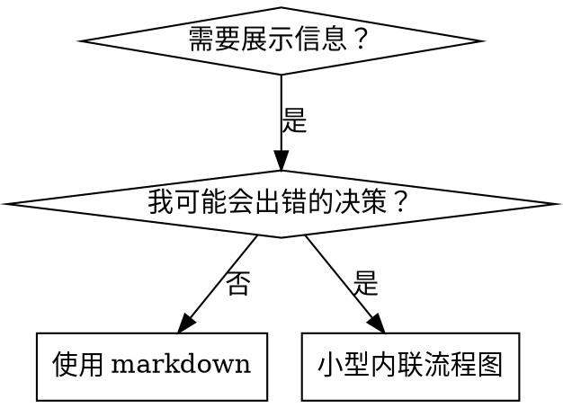

# writing-skills

> 本文为 [Superpowers](https://github.com/obra/superpowers/tree/main/skills/writing-skills) 原 skill 文件夹的中文翻译，基于 MIT 协议。原文路径：`skills/writing-skills/`。

---

**Skill 元数据**

| 字段 | 内容 |
|------|------|
| 名称 | writing-skills |
| 描述 | 在创建新 skill、编辑已有 skill，或在部署前验证 skill 是否正常工作时使用 |

---

# 编写 Skill

## 概述

**编写 skill 就是将测试驱动开发应用于流程文档。**

**个人 skill 存放在你运行时的 skills 目录**——路径参见各平台工具对照文档。Codex、Copilot CLI 和 Gemini CLI 也都识别 `~/.agents/skills/` 作为跨运行时别名。

你编写测试用例（带子代理的压力场景），看它们失败（基线行为），编写 skill（文档），看测试通过（代理遵循），并重构（堵住漏洞）。

**核心原则：** 如果你没有看过代理在没有 skill 时失败，你就不知道 skill 教的是否对。

**必备背景：** 在使用本 skill 之前必须理解 superpowers:test-driven-development。该 skill 定义了基本的 RED-GREEN-REFACTOR 循环。本 skill 将 TDD 适配到文档。

**官方指南：** Anthropic 的官方 skill 编写最佳实践，见 `anthropic-best-practices.md`。该文档提供了补充本 skill 中 TDD 方法的额外模式和指南。

## 什么是 Skill？

**Skill** 是针对已验证技术、模式或工具的参考指南。Skill 帮助未来的代理找到并应用有效的方法。

**Skill 是：** 可重用的技术、模式、工具、参考指南

**Skill 不是：** 关于你如何解决过一次问题的叙述

## Skill 的 TDD 映射

| TDD 概念 | Skill 创建 |
|----------|-----------|
| **测试用例** | 带子代理的压力场景 |
| **生产代码** | Skill 文档（SKILL.md） |
| **测试失败（RED）** | 没有 skill 时代理违反规则（基线） |
| **测试通过（GREEN）** | 有 skill 时代理遵循 |
| **重构** | 堵住漏洞同时保持遵循 |
| **先写测试** | 在编写 skill 之前运行基线场景 |
| **看它失败** | 记录代理使用的确切借口 |
| **最小代码** | 编写针对那些特定违规的 skill |
| **看它通过** | 验证代理现在遵循 |
| **重构循环** | 找到新借口 → 堵住 → 重新验证 |

整个 skill 创建过程遵循 RED-GREEN-REFACTOR。

## 何时创建 Skill

**创建时机：**
- 技术对你来说不是直观明显的
- 你会跨项目再次引用它
- 模式广泛应用（非项目特定）
- 其他人会受益

**不要创建：**
- 一次性解决方案
- 其他地方已有良好文档的标准实践
- 项目特定的约定（放入你的指令文件）
- 机械性约束（如果可用正则/验证强制执行，自动化它——为判断调用保留文档）

## Skill 类型

### 技术型
带步骤遵循的具体方法（condition-based-waiting、root-cause-tracing）

### 模式型
关于问题的思维方式（flatten-with-flags、test-invariants）

### 参考型
API 文档、语法指南、工具文档（office docs）

## 目录结构

```
skills/
  skill-name/
    SKILL.md              # 主参考（必需）
    supporting-file.*     # 仅在需要时
```

**扁平命名空间**——所有 skill 在一个可搜索的命名空间中

**独立文件用于：**
1. **重型参考**（100+ 行）——API 文档、全面语法
2. **可重用工具**——脚本、工具、模板

**保持内联：**
- 原则和概念
- 代码模式（< 50 行）
- 其他一切

## SKILL.md 结构

**Frontmatter（YAML）：**
- 两个必需字段：`name` 和 `description`（所有支持的字段见 [agentskills.io/specification](https://agentskills.io/specification)）
- 总共最多 1024 字符
- `name`：只使用字母、数字和连字符（无括号、特殊字符）
- `description`：第三人称，只描述何时使用（而不是它做什么）
  - 以 "Use when..." 开头，聚焦触发条件
  - 包含具体症状、情况和上下文
  - **永远不要总结 skill 的流程或工作流**（原因见 SDO 部分）
  - 如果可能保持在 500 字符以下

```markdown
---
name: Skill-Name-With-Hyphens
description: Use when [具体触发条件和症状]
---

# Skill 名称

## 概述
这是什么？1-2 句核心原则。

## 何时使用
[如果决策不明显则放小型内联流程图]

带症状和使用场景的项目列表
何时不使用

## 核心模式（用于技术/模式）
前后代码对比

## 快速参考
用于快速扫描常见操作的表或项目

## 实现
内联代码用于简单模式
链接到文件用于重型参考或可重用工具

## 常见错误
哪里会出错 + 修复

## 真实世界影响（可选）
具体结果
```

## Skill 发现优化（SDO）

**对发现至关重要：** 未来的代理需要找到你的 skill

### 1. 丰富的 Description 字段

**目的：** 你的代理读取 description 来决定为给定任务加载哪些 skill。让它回答："我现在应该读这个 skill 吗？"

**格式：** 以 "Use when..." 开头，聚焦触发条件

**关键：Description = 何时使用，而不是 Skill 做什么**

description 应该只描述触发条件。不要在 description 中总结 skill 的流程或工作流。

**为什么这很重要：** 测试揭示，当 description 总结 skill 的工作流时，代理可能会遵循 description 而不是阅读完整 skill 内容。一个写着 "code review between tasks" 的 description 导致代理只做一次审查，即使 skill 的流程图清楚地显示了两次审查（规格合规，然后代码质量）。

当 description 改为 "Use when executing implementation plans with independent tasks"（无工作流摘要），代理正确地阅读了流程图并遵循了两阶段审查过程。

**陷阱：** 总结工作流的 description 创建了代理会走的捷径。Skill 主体变成了代理跳过的文档。

```yaml
# ❌ 坏：总结工作流——代理可能遵循这个而不是阅读 skill
description: Use when executing plans - dispatches subagent per task with code review between tasks

# ❌ 坏：太多流程细节
description: Use for TDD - write test first, watch it fail, write minimal code, refactor

# ✅ 好：只有触发条件，无工作流摘要
description: Use when executing implementation plans with independent tasks in the current session

# ✅ 好：只有触发条件
description: Use when implementing any feature or bugfix, before writing implementation code
```

**内容：**
- 使用具体触发器、症状和情境，表明此 skill 适用
- 描述问题（竞态条件、不一致行为）而非语言特定症状（setTimeout、sleep）
- 保持触发器技术无关，除非 skill 本身是技术特定的
- 如果 skill 是技术特定的，在触发器中明确
- 用第三人称写（注入到系统提示词）
- **永远不要总结 skill 的流程或工作流**

```yaml
# ❌ 坏：太抽象、含糊、不包含何时使用
description: For async testing

# ❌ 坏：第一人称
description: I can help you with async tests when they're flaky

# ❌ 坏：提到技术但 skill 不特定于它
description: Use when tests use setTimeout/sleep and are flaky

# ✅ 好：以"Use when"开头，描述问题，无工作流
description: Use when tests have race conditions, timing dependencies, or pass/fail inconsistently

# ✅ 好：技术特定 skill，带明确触发器
description: Use when using React Router and handling authentication redirects
```

### 2. 关键词覆盖

使用代理会搜索的词：
- 错误信息："Hook timed out"、"ENOTEMPTY"、"race condition"
- 症状："flaky"、"hanging"、"zombie"、"pollution"
- 同义词："timeout/hang/freeze"、"cleanup/teardown/afterEach"
- 工具：实际命令、库名、文件类型

### 3. 描述性命名

**使用主动语态，动词优先：**
- ✅ `creating-skills` 而非 `skill-creation`
- ✅ `condition-based-waiting` 而非 `async-test-helpers`

### 4. Token 效率（关键）

**问题：** getting-started 和频繁引用的 skill 加载到每次对话中。每个 token 都重要。

**目标字数：**
- getting-started 工作流：<150 词每个
- 频繁加载的 skill：<200 词总共
- 其他 skill：<500 词（仍要简洁）

**技巧：**

**将细节移到工具帮助中：**
```bash
# ❌ 坏：在 SKILL.md 中记录所有标志
search-conversations supports --text, --both, --after DATE, --before DATE, --limit N

# ✅ 好：引用 --help
search-conversations supports multiple modes and filters. Run --help for details.
```

**使用交叉引用：**
```markdown
# ❌ 坏：重复工作流细节
When searching, dispatch subagent with template...
[20 行重复指令]

# ✅ 好：引用其他 skill
Always use subagents (50-100x context savings). REQUIRED: Use [other-skill-name] for workflow.
```

**压缩示例：**
```markdown
# ❌ 坏：冗长示例
your human partner: "How did we handle authentication errors in React Router before?"
You: I'll search past conversations for React Router authentication patterns.
[Dispatch subagent with search query: "React Router authentication error handling 401"]

# ✅ 好：最简示例
Partner: "How did we handle auth errors in React Router?"
You: Searching...
[Dispatch subagent → synthesis]
```

**消除冗余：**
- 不要重复交叉引用的 skill 中的内容
- 不要解释命令中明显的东西
- 不要包含相同模式的多个示例

**验证：**
```bash
wc -w skills/path/SKILL.md
# getting-started 工作流：目标 <150 每个
# 其他频繁加载的：目标 <200 总共
```

**用你做什么或核心洞察命名：**
- ✅ `condition-based-waiting` > `async-test-helpers`
- ✅ `using-skills` 而非 `skill-usage`
- ✅ `flatten-with-flags` > `data-structure-refactoring`
- ✅ `root-cause-tracing` > `debugging-techniques`

**Gerunds（-ing）对流程很有效：**
- `creating-skills`、`testing-skills`、`debugging-with-logs`
- 主动的，描述你正在做的动作

### 5. 交叉引用其他 Skill

**当编写引用其他 skill 的文档时：**

只使用 skill 名称，带明确的必要性标记：
- ✅ 好：`**REQUIRED SUB-SKILL:** Use superpowers:test-driven-development`
- ✅ 好：`**REQUIRED BACKGROUND:** You MUST understand superpowers:systematic-debugging`
- ❌ 坏：`See skills/testing/test-driven-development`（不清楚是否必需）
- ❌ 坏：`@skills/testing/test-driven-development/SKILL.md`（强制加载，消耗上下文）

**为什么不用 @ 链接：** `@` 语法立即强制加载文件，在你需要之前消耗 200k+ 上下文。

## 流程图使用



**流程图仅用于：**
- 非显而易见的决策点
- 你可能过早停止的流程循环
- "何时使用 A vs B" 决策

**永远不要用于：**
- 参考材料 → 表、列表
- 代码示例 → Markdown 块
- 线性指令 → 编号列表
- 没有语义含义的标签（step1、helper2）

参见本目录中的 `graphviz-conventions.dot` 获取 graphviz 样式规则。

## 代码示例

**一个优秀的示例胜过许多平庸的示例**

选择最相关的语言：
- 测试技术 → TypeScript/JavaScript
- 系统调试 → Shell/Python
- 数据处理 → Python

**好示例：**
- 完整且可运行
- 有良好注释解释为什么
- 来自真实场景
- 清晰展示模式
- 准备好适配（不是通用模板）

**不要：**
- 用 5+ 语言实现
- 创建填空模板
- 编写人为示例

你擅长移植——一个优秀示例就够了。

## 文件组织

### 自包含 Skill
```
defense-in-depth/
  SKILL.md    # 所有内容内联
```
何时：所有内容都适合，不需要重型参考

### 带可重用工具的 Skill
```
condition-based-waiting/
  SKILL.md    # 概述 + 模式
  example.ts  # 可适配的工作辅助函数
```
何时：工具是可重用代码，不仅仅是叙述

### 带重型参考的 Skill
```
pptx/
  SKILL.md       # 概述 + 工作流
  pptxgenjs.md   # 600 行 API 参考
  ooxml.md       # 500 行 XML 结构
  scripts/       # 可执行工具
```
何时：参考材料太大无法内联

## 铁律（与 TDD 相同）

```
没有先有失败测试，就不能有 skill
```

这适用于新的 skill 和对现有 skill 的编辑。

在测试之前写了 skill？删掉它。重新开始。
在没有测试的情况下编辑了 skill？同样的违规。

**没有例外：**
- "简单添加"不行
- "只是加一节"不行
- "文档更新"不行
- 不要保留未测试的变更作为"参考"
- 不要在运行测试时"改编"
- 删除就是删除

**必备背景：** superpowers:test-driven-development skill 解释了为什么这很重要。相同的原则适用于文档。

## 测试所有 Skill 类型

不同的 skill 类型需要不同的测试方法：

### 纪律执行型 Skill（规则/要求）

**示例：** TDD、verification-before-completion、designing-before-coding

**用以下方式测试：**
- 学术问题：他们理解规则吗？
- 压力场景：他们在压力下遵循吗？
- 多重压力组合：时间 + 沉没成本 + 疲惫
- 识别借口并添加明确的反驳

**成功标准：** 代理在最大压力下遵循规则

### 技术型 Skill（操作指南）

**示例：** condition-based-waiting、root-cause-tracing、defensive-programming

**用以下方式测试：**
- 应用场景：他们能正确应用技术吗？
- 变体场景：他们能处理边缘情况吗？
- 缺失信息测试：指令有缺口吗？

**成功标准：** 代理成功将技术应用到新场景

### 模式型 Skill（心智模型）

**示例：** reducing-complexity、信息隐藏概念

**用以下方式测试：**
- 识别场景：他们识别模式何时适用吗？
- 应用场景：他们能使用心智模型吗？
- 反例：他们知道何时不适用吗？

**成功标准：** 代理正确识别何时/如何应用模式

### 参考型 Skill（文档/API）

**示例：** API 文档、命令参考、库指南

**用以下方式测试：**
- 检索场景：他们能找到正确的信息吗？
- 应用场景：他们能正确使用找到的信息吗？
- 缺口测试：常见用例被覆盖了吗？

**成功标准：** 代理找到并正确应用参考信息

## 跳过测试的常见借口

| 借口 | 现实 |
|------|------|
| "Skill 显然很清楚" | 对你清楚 ≠ 对其他代理清楚。测试它。 |
| "它只是一个参考" | 参考可以有缺口、不清楚的部分。测试检索。 |
| "测试是过度杀伤" | 未测试的 skill 有问题。总是这样。15 分钟测试节省数小时。 |
| "如果出现问题我会测试" | 问题 = 代理无法使用 skill。部署之前测试。 |
| "测试太繁琐" | 测试比在生产中调试坏 skill 更不繁琐。 |
| "我有信心它好" | 过度自信保证问题。无论如何测试。 |
| "学术审查就够了" | 阅读 ≠ 使用。测试应用场景。 |
| "没时间测试" | 部署未测试的 skill 浪费更多时间在后面修复。 |

**以上所有这些意味着：在部署之前测试。没有例外。**

## 将形式匹配到失败

在编写指导之前，对基线失败进行分类。对一种失败类型防弹的形式对另一种可测量地适得其反。

| 基线失败 | 正确形式 | 错误形式 |
|----------|----------|----------|
| 在压力下跳过/违反规则（知道得更好，但还是做了） | 禁止 + 借口表 + 红旗（见下方防弹） | 软指导（"prefer..."、"consider..."） |
| 遵循，但输出形状错误（臃肿提示、埋没裁决、重述规格） | 正面配方或合同：陈述输出是什么——其部分，按顺序 | 禁止列表（"don't restate"、"never narrate"） |
| 从他们已经产生的东西中遗漏必需元素 | 结构化：他们在填充的模板中的必需字段或槽 | 模板附近的散文提醒 |
| 行为应取决于条件 | 以可观察谓词为键的条件（"if the brief exists, reference it"） | 无条件规则 + 豁免条款 |

**为什么禁止对形状问题适得其反：** 在竞争激励下（"让提示自包含"），代理与"don't X"谈判。在关于派发提示指导的措辞对比测试中，禁止臂产生了比配方臂明显更多的多余内容（完全分离的分布），并且趋势比无指导控制更糟——假设之前微测试你自己的情况，但永远不要默认使用禁止。配方不给谈判留空间：输出要么匹配陈述的形状，要么不匹配。

**无论你选择哪种形式的规则：**
- **不要有细微条款。** "除非它重要，否则不要 X"重新打开谈判——向一个获胜配方附加一个细微条款在相同的措辞测试中将其从一致降级为嘈杂。将一个真实例外表达为基于可观察谓词的自己的条件。
- **豁免条款不限制范围。** "此限制不适用于代码块"仍然抑制代码块。如果输出的某部分必须豁免，重组使得规则无法触及它。

## 让 Skill 对抗借口防弹

执行纪律的 skill（如 TDD）需要抵抗借口。代理很聪明，在压力下会找到漏洞。

**范围：** 此工具包用于纪律失败——知道规则但在压力下跳过的代理。对于错误形状的输出或遗漏的元素，基于禁止的防弹适得其反；改为使用"将形式匹配到失败"中的形式。

**心理学说明：** 理解为什么说服技术有效有助于你系统地应用它们。参见 `persuasion-principles.md` 了解权威、承诺、稀缺性、社会认同和统一原则的研究基础（Cialdini，2021；Meincke et al.，2025）。

### 明确堵住每个漏洞

不要只是陈述规则——禁止特定的变通方法：

**❌ Bad:**
```markdown
在测试之前写了代码？删掉它。
```

**✅ Good:**
```markdown
在测试之前写了代码？删掉它。重新开始。

**没有例外：**
- 不要保留它作为"参考"
- 不要在写测试时"改编"它
- 不要看它
- 删除就是删除
```

### 处理"精神 vs 字面"争论

在早期添加基础原则：

```markdown
**违反规则的字面意思就是违反规则的精神。**
```

这切断了整类"我在遵循精神"的借口。

### 建立借口表

从基线测试中捕获借口（见下方测试部分）。代理做出的每个借口都进入表中：

```markdown
| 借口 | 现实 |
|------|------|
| "太简单了不需要测试" | 简单代码也会出错。写一个测试只需 30 秒。 |
| "我之后再测" | 立即通过的测试什么都证明不了。 |
| "后写测试达到相同目标" | 后写 = "这东西做什么？"先写 = "这东西应该做什么？" |
```

### 创建红旗列表

让代理在找借口时容易自我检查：

```markdown
## 红旗——停下来，重新开始

- 代码在测试之前
- "我已经手动测试过了"
- "后写测试达到相同目的"
- "重要的是精神而非仪式"
- "这种情况不一样，因为……"

**以上任何一种都意味着：删掉代码。用 TDD 重新开始。**
```

### 为违规症状更新 SDO

添加到 description：你即将违反规则的症状：

```yaml
description: use when implementing any feature or bugfix, before writing implementation code
```

## Skill 的 RED-GREEN-REFACTOR

遵循 TDD 循环：

### RED：写失败测试（基线）

在没有 skill 的情况下用子代理运行压力场景。记录确切行为：
- 他们做了什么选择？
- 他们用了什么借口（逐字记录）？
- 哪些压力触发了违规？

这就是"看测试失败"——你必须看到代理在没有 skill 时自然做什么，然后才写 skill。

### GREEN：写最小 Skill

编写针对那些特定借口的 skill。不要为假设情况添加额外内容。

用 skill 运行相同的场景。代理现在应该遵循。

### REFACTOR：堵住漏洞

代理找到新借口？添加明确的反驳。重新测试直到防弹。

### 在完整场景之前微测试措辞

完整压力场景运行是最终关卡，但每次迭代又慢又贵。先用微测试验证措辞本身：

1. **每次调用一个新鲜上下文样本**——原始 API 调用，或者如果你没有 API 访问权限就用一次性子代理。系统提示词 = 指导将存在的现实上下文（完整的 skill 或提示模板，而不是孤立的指导）；用户消息 = 诱使失败的任务。
2. **始终包含无指导对照。** 如果对照没有表现出失败，说明没有什么要修复的——停止，不要编写指导。
3. **每个变体 5+ 次重复。** 单样本会说谎。
4. **手动读取每个标记的匹配。** 可以编程评分，但模板回显和引用的反例伪装成命中；仅自动计数会高估失败和成功。
5. **方差是一个指标。** 当指导落地时，重复趋于相同形状。五次重复的五种不同解释意味着措辞不够绑定——在添加更多词之前收紧形式。

微测试验证措辞；它们不能替代纪律 skill 的压力场景。

## 反模式

### ❌ 叙述性示例
"In session 2025-10-03, we found empty projectDir caused..."
**为什么坏：** 太具体，不可重用

### ❌ 多语言稀释
example-js.js、example-py.py、example-go.go
**为什么坏：** 平庸的质量，维护负担

### ❌ 流程图中的代码
```dot
step1 [label="import fs"];
step2 [label="read file"];
```
**为什么坏：** 无法复制粘贴，难以阅读

### ❌ 通用标签
helper1、helper2、step3、pattern4
**为什么坏：** 标签应有语义含义

## STOP：进入下一个 Skill 之前

**在编写任何 skill 之后，你必须停下来并完成部署过程。**

**不要：**
- 批量创建多个 skill 而不测试每一个
- 在当前 skill 被验证之前进入下一个
- 因为"批量更高效"而跳过测试

**以下部署检查清单对每个 skill 都是强制的。**

部署未测试的 skill = 部署未测试的代码。这违反了质量标准。

## Skill 创建检查清单（适配 TDD）

**重要：为以下每个检查清单项目创建 todo。**

**RED 阶段——写失败测试：**
- [ ] 创建压力场景（纪律 skill 需 3+ 组合压力）
- [ ] 在没有 skill 的情况下运行场景——逐字记录基线行为
- [ ] 识别借口/失败的模式

**GREEN 阶段——写最小 Skill：**
- [ ] 名称只使用字母、数字、连字符（无括号/特殊字符）
- [ ] YAML frontmatter 带必需的 `name` 和 `description` 字段（最多 1024 字符）
- [ ] Description 以 "Use when..." 开头，包含具体触发器/症状
- [ ] Description 用第三人称写
- [ ] 全文关键词用于搜索（错误、症状、工具）
- [ ] 清晰的概述带核心原则
- [ ] 解决 RED 中识别的特定基线失败
- [ ] 指导形式匹配失败类型（见"将形式匹配到失败"）
- [ ] 对于行为塑造指导：针对无指导对照微测试措辞（5+ 次重复，每次手动读取标记匹配）——纯参考 skill 不适用
- [ ] 代码内联或链接到独立文件
- [ ] 一个优秀示例（不是多语言）
- [ ] 带 skill 运行场景——验证代理现在遵循

**REFACTOR 阶段——堵住漏洞：**
- [ ] 从测试中识别新借口
- [ ] 添加明确的反驳（如果是纪律 skill）
- [ ] 从所有测试迭代建立借口表
- [ ] 创建红旗列表
- [ ] 重新测试直到防弹

**质量检查：**
- [ ] 仅在决策不明显时使用小型流程图
- [ ] 快速参考表
- [ ] 常见错误部分
- [ ] 无叙述性故事
- [ ] 支持文件仅用于工具或重型参考

**部署：**
- [ ] 提交 skill 到 git 并推送到你的 fork（如果已配置）
- [ ] 考虑通过 PR 贡献回去（如果广泛有用）

## 发现工作流

未来代理如何找到你的 skill：

1. **遇到问题**（"测试不稳定"）
2. **搜索 skill**（grep description，浏览类别）
3. **找到 SKILL**（description 匹配）
4. **扫描概述**（这个相关吗？）
5. **阅读模式**（快速参考表）
6. **加载示例**（仅在实现时）

**为此流程优化**——尽早并频繁放置可搜索的术语。

## 总结

**创建 skill 就是过程文档的 TDD。**

相同的铁律：没有先有失败测试就没有 skill。
相同的循环：RED（基线）→ GREEN（写 skill）→ REFACTOR（堵住漏洞）。
相同的好处：更好的质量、更少的意外、防弹的结果。

如果你为代码遵循 TDD，就为 skill 遵循它。这是应用于文档的相同纪律。
